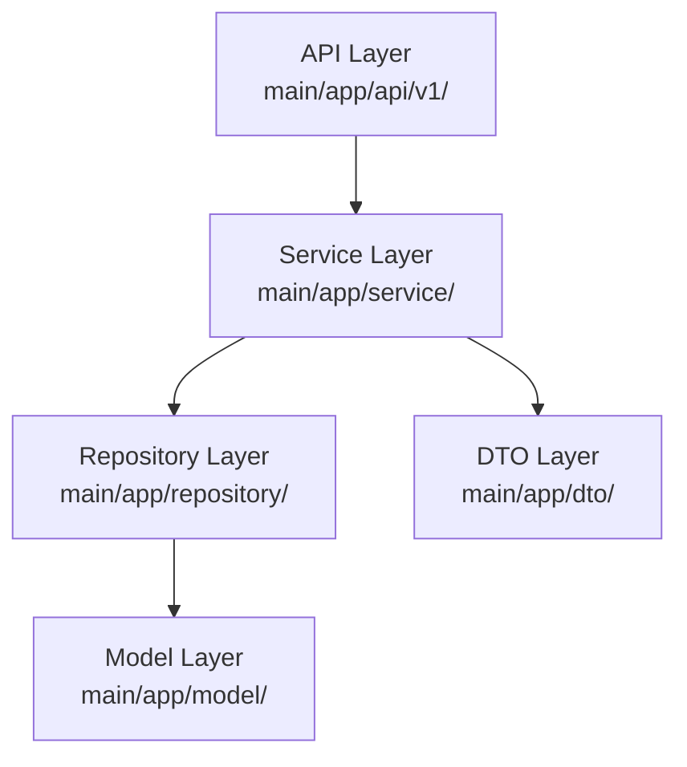

# 上下文

- 当前日期: !`TZ=Asia/Shanghai date +%Y-%m-%d`
- 设计人: !`git config user.name`
- Spec 目录: !`ls docs/shared/specs/active/ 2>/dev/null | head -5`

# 任务

为已通过审核的 Spec 创建技术设计文档（design.md）和任务清单（tasks.md）。

## 强制规则

1. **前置检查必须通过**（requirements.md 已通过、Level ≠ spike）
2. **必须完成 3 轮采访**，不得跳过或提前结束
3. **SP > 5 必须拆分**，在采访中识别并引导拆分
4. 每轮必须等待用户回答后，才能进入下一轮
5. **必须使用 AskUserQuestion 工具**，不能用文本模拟提问

## 触发条件

| Level | 触发条件 | 输出文件 | 特殊说明 |
|-------|---------|---------|---------|
| story | requirements 审核通过 | design.md + tasks.md | 完整流程 |
| task | requirements 审核通过 | design.md + tasks.md | 完整流程 |
| bug | requirements 审核通过 | design.md + tasks.md | 可简化，合并 design 内容到 tasks |
| spike | **不触发阶段二** | - | 调研结果直接写入 requirements.md |

---

## 前置检查

### Step 0: 验证

1. **读取 requirements.md**:
   ```
   docs/shared/specs/active/{spec-id}/requirements.md
   ```

2. **验证审核状态**:
   - 状态 ≠ 已通过 → 退出，提示先完成审核
   ```markdown
   ⚠️ requirements.md 审核状态不是"已通过"，请先完成产品审核。
   当前状态: {status}
   ```

3. **验证 Level**:
   - Level == spike → 退出
   ```markdown
   ⚠️ spike 类型不需要技术设计。调研结果应直接写入 requirements.md。
   ```

4. **提取需求信息**（MUST）:
   - 用户故事（角色、功能、价值）
   - 业务实体和领域
   - 验收标准和功能范围
   - 终端和平台

---

## 采访流程

### Round 1: How (怎么实现？复用什么？)

使用 `AskUserQuestion` 询问：

```yaml
question: |
  基于需求文档，请确认技术方案：
  1. 采用什么架构方案？
  2. 有哪些可复用的代码？
options:
  架构: (根据需求推断)
    - 扩展现有 {Service} 服务
    - 新建 {Name}Service 服务
    - 重构现有模块
  复用: (根据功能领域搜索)
    - main/app/service/{xxx}.go 现有服务
    - main/app/repository/{xxx}.go 现有仓库
    - 无明显可复用代码
```

**采集结果填充 design.md：**
- Q1 架构 → 架构设计章节
- Q2 复用 → 代码复用分析章节

**⛔ STOP - 等待用户回答**

---

### Round 2: Interface (接口设计)

使用 `AskUserQuestion` 询问：

```yaml
question: |
  1. API 层面需要什么变更？
  2. 数据模型需要调整吗？
options:
  API:
    - 复用现有 API
    - 新增 API 端点
    - 修改现有 API
  模型:
    - 复用现有 Model
    - 扩展现有 Model 字段
    - 新建 Model
```

**采集结果填充 design.md：**
- Q3 API → API 设计章节
- Q4 模型 → 数据模型章节

**自动检查数据库迁移需求：**
```markdown
IF 新建/修改 Model:
  ⚠️ 需要同步更新:
  - 创建迁移文件: admin/database/migrations/
  - 更新种子文件: admin/database/seeds/shop_01.sql
```

**⛔ STOP - 等待用户回答**

---

### Round 3: Estimate (评估与分解)

使用 `AskUserQuestion` 询问：

```yaml
question: |
  1. 评估 Story Point？
  2. 如何分解任务？
options:
  SP: (根据复杂度+风险因素计算)
    - SP1: 极简单，0.5-1 天
    - SP3: 简单，1-2 天
    - SP5: 中等，2-3 天
  Phase:
    - Phase1: 核心实现（Repository + Service）
    - Phase2: API 层集成
    - Phase3: 测试与文档
```

**风险加成计算：**

| 因素 | 加分 | 触发条件 |
|------|------|---------|
| 高风险模块 | +1 | payment, order, cart 相关 |
| 新技术 | +1 | 首次使用技术栈 |
| 多端适配 | +0.5/端 | 需要支持多个终端 |
| 测试要求高 | +0.5 | 覆盖率 100%、复杂测试场景 |

**采集结果填充：**
- Q5 SP → tasks.md 进度总览-总 SP
- Q6 任务 → tasks.md Phase 列表

**⛔ STOP - 等待用户回答**

---

## SP > 5 拆分检查

**IF SP > 5:**

```markdown
⚠️ SP 超过 5，必须拆分！

**拆分策略（按优先级）：**

1. **按应用垂直拆分**（优先）
   ❌ story-pos-shop-order-sync (SP8)
   ✅ story-pos-order-sync (SP3)
   ✅ story-shop-order-sync (SP3)

2. **按功能模块拆分**
   ❌ story-pos-payment (SP8)
   ✅ story-pos-payment-quick (SP3)
   ✅ story-pos-payment-config (SP3)

3. **按 Phase 拆分**
   ❌ story-pos-refund (SP8)
   ✅ story-pos-refund-core (SP5)
   ✅ story-pos-refund-integration (SP3)

请先拆分 Spec，再执行 /spec:design。
```

**退出流程，不创建文件。**

---

## 生成设计文档

### Step 1: 创建 design.md

读取模板并适配 Go 技术栈：

```markdown
# {spec-id} 技术设计

## 📋 概述

| 项目 | 内容 |
|------|------|
| Spec ID | {spec-id} |
| 设计人 | {designer} |
| 设计日期 | {date} |
| 总 SP | {sp} |

## 🔄 代码复用分析

### 可复用代码
| 文件 | 说明 | 复用方式 |
|------|------|---------|
| {path} | {description} | 直接调用/扩展/参考 |

### 需要新建
| 文件 | 说明 |
|------|------|
| {path} | {description} |

## 🏗️ 架构设计

### 架构图



### 分层说明

- **API Layer**: `main/app/api/v1/{terminal}/` - HTTP Handler
- **Service Layer**: `main/app/service/` - 业务逻辑
- **Repository Layer**: `main/app/repository/` - 数据访问
- **Model Layer**: `main/app/model/` - 数据模型
- **DTO Layer**: `main/app/dto/req/`, `main/app/dto/resp/` - 请求/响应对象

## 🧩 组件和接口

### Service: {ServiceName}

**位置**: `main/app/service/{name}.go`

**接口定义**:
```go
type I{Name}Srv interface {
    {Method}(ctx context.Context, req req.{Req}) (*resp.{Resp}, error)
}
```

## 📊 数据模型

### Model: {ModelName}

**位置**: `main/app/model/{name}.go`

```go
type {ModelName} struct {
    ID         uint64 `gorm:"primaryKey"`
    Uuid       uint64 `gorm:"uniqueIndex"`
    // ... fields
    CreateTime int    `gorm:"autoCreateTime"`
    UpdateTime int    `gorm:"autoUpdateTime"`
    DeleteTime int    `gorm:"default:0"`
}
```

## 🔌 API 设计

### {Endpoint}

| 项目 | 内容 |
|------|------|
| Method | GET/POST |
| Path | /api/v1/{path} |
| 请求 | req.{Name}Req |
| 响应 | resp.{Name}Resp |

## ⚠️ 风险识别

| 风险 | 影响 | 缓解措施 |
|------|------|---------|
| {risk} | {impact} | {mitigation} |

## 🧪 测试策略

**目标覆盖率**:
- main/app/service: 80%+
- main/app/repository: 70%+

**测试命令**:
```bash
cd main && go test -coverprofile=coverage.out ./app/service/...
cd main && go tool cover -html=coverage.out
```
```

### Step 2: 创建 tasks.md

```markdown
# {spec-id} 任务清单

## 📊 进度总览

| 项目 | 数值 |
|------|------|
| 总 SP | {sp} |
| 总任务数 | {total} |
| 已完成 | 0 |
| 完成率 | 0% |

---

## Phase 1: 核心实现

### 1.1 {Task Title}

| 项目 | 内容 |
|------|------|
| File | `main/app/{layer}/{file}.go` |
| Purpose | {目的} |
| Requirements | {需求点} |
| Leverage | {可复用代码} |

- [ ] 完成

### 1.2 {Task Title}

...

---

## Phase 2: API 层集成

### 2.1 {Task Title}

...

---

## Phase 3: 测试与文档

### 3.1 编写单元测试

| 项目 | 内容 |
|------|------|
| File | `main/app/service/{name}_test.go` |
| Purpose | 单元测试覆盖 |
| Requirements | 覆盖率 ≥ 80% |

- [ ] 完成

### 3.2 更新文档

- [ ] 完成

---

## 提交清单

### 代码质量
- [ ] `go mod tidy` 执行
- [ ] `go fmt ./...` 执行
- [ ] `go vet ./...` 通过
- [ ] 测试通过: `go test ./...`

### 功能完整性
- [ ] 所有验收标准通过
- [ ] API 响应格式正确（data 为对象）
- [ ] 多语言字段使用 LocaleResponse

### 迁移同步
- [ ] 迁移文件已创建（如需要）
- [ ] shop_01.sql 已更新（如需要）
```

### Step 3: 更新状态

更新 requirements.md 状态: `已通过` → `开发中`

### Step 4: 输出结果

```markdown
✅ 技术设计已创建

| 项目 | 内容 |
|------|------|
| Spec ID | {spec-id} |
| 总 SP | {sp} |
| 总任务数 | {total} |
| Phase 数 | 3 |

## 文件列表
- `docs/shared/specs/active/{spec-id}/design.md`
- `docs/shared/specs/active/{spec-id}/tasks.md`

## 下一步

1. 执行 `/spec:check {spec-id}` 查看进度
2. 开始开发：按 tasks.md Phase 顺序执行任务
3. 或使用 feature-dev agent：`implement {spec-id}`
```

---

## 示例

**用户输入:** `/spec:design story-pos-quick-payment`

**前置检查:**
- ✅ requirements.md 存在
- ✅ 审核状态 = 已通过
- ✅ Level = story ≠ spike

**Round 1:**
```yaml
question: |
  基于需求文档，请确认技术方案：
  1. 采用什么架构方案？
  2. 有哪些可复用的代码？
options:
  架构:
    - 扩展现有 PaymentService 服务
    - 新建 QuickPaymentService 服务
  复用:
    - main/app/service/payment.go 现有支付服务
    - main/app/repository/payment_method.go 支付方式仓库
```

**Round 2:**
```yaml
question: |
  1. API 层面需要什么变更？
  2. 数据模型需要调整吗？
options:
  API:
    - 复用现有支付 API
    - 新增快捷支付配置 API
  模型:
    - 扩展 PaymentMethod 添加 is_quick 字段
    - 新建 QuickPaymentConfig 模型
```

**Round 3:**
```yaml
question: |
  1. 评估 Story Point？
  2. 如何分解任务？
options:
  SP:
    - SP3: 简单扩展，风险低
    - SP5: 中等复杂度，需要测试
  Phase:
    - Phase1: Repository + Service 核心实现
    - Phase2: API 层集成
    - Phase3: 测试与文档
```

**生成文件:**
- `docs/shared/specs/active/story-pos-quick-payment/design.md`
- `docs/shared/specs/active/story-pos-quick-payment/tasks.md`
