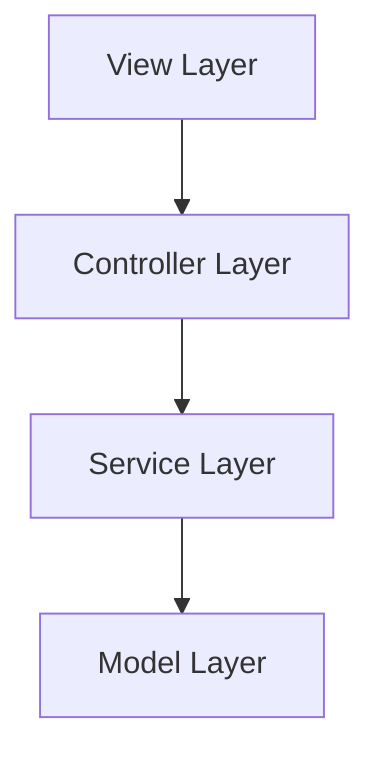

# {功能名称} 设计文档

## 📋 概述

[高层次描述该功能及其在整体系统中的位置]

---

## 🔄 代码复用分析

### 可复用的现有组件

- **{组件名称}**: `{路径}` - {如何使用}

### 集成点

- **{现有系统/API}**: {新功能如何集成}

---

## 🏗️ 架构设计

### 架构图



### 分层说明

- **View Layer**: `apps/{app}/lib/pages/` - UI 界面
- **Controller Layer**: `apps/{app}/lib/controllers/` - 状态管理
- **Service Layer**: `packages/api/lib/` - 业务逻辑
- **Model Layer**: `packages/model/lib/` - 数据模型

---

## 🧩 组件和接口

### 组件 1: {组件名称}

- **位置**: `{文件路径}`
- **目的**: {该组件的功能}
- **公共接口**:
  ```dart
  class FeatureController extends GetxController {
    static FeatureController getInstance() { ... }
  }
  ```

---

## 📊 数据模型

### Model: {模型名称}

```dart
@freezed
class FeatureModel with _$FeatureModel {
  const factory FeatureModel({
    required int id,
    required String name,
  }) = _FeatureModel;

  factory FeatureModel.fromJson(Map<String, dynamic> json) =>
      _$FeatureModelFromJson(json);
}
```

---

## 🔌 API 设计

```dart
class FeatureAPI {
  final API _api = Get.find<APIController>().api;

  Future<FeatureModel?> getFeature({
    ExtraRequestOptions? options,
  }) async {
    try {
      final response = await _api.getWithRequestOptions(
        APIPath.featureGet.path,
        requestOptions: options,
      );
      if (response.code.success) {
        return await response.safeFromJson(
          FeatureModel.fromJson,
          response.data,
          modelName: 'FeatureModel',
          options: options,
        );
      }
      return null;
    } catch (error, stackTrace) {
      Logger.talker.error('getFeature Error', error, stackTrace);
      return null;
    }
  }
}
```

---

## ⚡ 状态管理

```dart
class FeatureController extends GetxController {
  static FeatureController getInstance({String? tag}) {
    return Get.isRegistered<FeatureController>(tag: tag)
        ? Get.find<FeatureController>(tag: tag)
        : Get.put(FeatureController(), tag: tag);
  }

  final FeatureAPI _api = FeatureAPI();
  final Rx<FeatureModel?> data = Rx<FeatureModel?>(null);
  final RxBool isLoading = false.obs;
}
```

---

## 🚨 错误处理

### 场景 1: {错误描述}

- **处理方式**: {如何处理}
- **用户影响**: {用户看到什么}

---

## 🧪 测试策略

### 单元测试

**目标覆盖率**:
- packages/model: 80%+
- packages/api: 80%+
- apps/controllers: 70%+

---

## 🌐 平台兼容性

### Web 平台

- ⚠️ 不使用 `dart:ffi`
- ⚠️ 不使用 `dart:io`
- ✅ 使用条件导入

---

**版本**: v1.0.0
**创建日期**: {YYYY-MM-DD}
