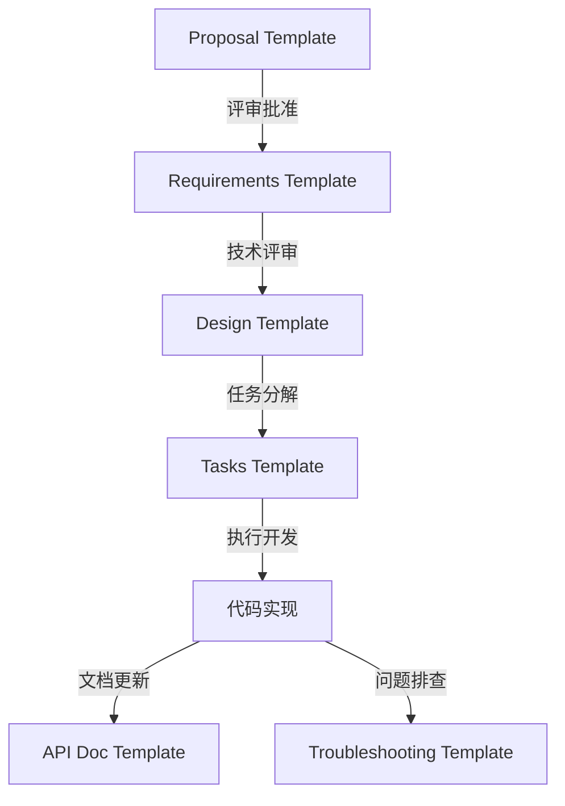

# 文档模板

> Agent 使用的标准化文档模板

---

## 📋 模板列表

### 核心模板（✅ 已完成）

- [x] `proposal-template.md` - 需求提案模板
- [x] `requirements-template.md` - 需求规格模板（后端版）
- [x] `design-template.md` - 技术设计模板（后端版）
- [x] `tasks-template.md` - 任务分解模板（后端版）
- [x] `graphiti-episode.md` - Graphiti Episode 模板（知识沉淀）

### 后端专属模板（✅ 已完成）

- [x] `database-migration-template.md` - 数据库迁移模板
- [x] `api-doc-template.md` - API 文档模板
- [x] `troubleshooting-guide.md` - 问题排查模板
- [x] `grpc-service-template.md` - gRPC 服务模板

---

## 📝 模板特点

### 后端技术栈适配

所有模板已针对后端项目进行优化：

- **多技术栈支持**: Go (main/), Go (ttpos-bmp/), PHP (admin/), Vue (admin/views/)
- **后端特色内容**:
  - 数据库设计（SQL、迁移脚本、Go Model）
  - API 设计（RESTful + gRPC）
  - 缓存设计（Redis）
  - 并发控制（UUID 锁）
  - 事件总线（Event Bus）
- **测试覆盖率**: Service 70%, Repository 80%, Payment/Order 100%
- **性能要求**: 本地响应 < 200ms

### 模板结构

每个模板都包含：

1. **规范对齐**: 如何遵循 `.cursor/rules/` 中的规范
2. **代码复用**: 可复用的现有组件
3. **完整示例**: 具体实现代码示例
4. **AI Prompt**: 辅助 AI 生成代码的提示模板

---

## 🎯 使用指南

### 创建新 Spec

#### Step 1: 创建目录

```bash
mkdir -p docs/shared/specs/story-{module}-{feature}
```

#### Step 2: 复制模板

```bash
cd docs/shared/specs/story-{module}-{feature}

# 复制并重命名
cp ../../agent/templates/requirements-template.md requirements.md
cp ../../agent/templates/design-template.md design.md
cp ../../agent/templates/tasks-template.md tasks.md
```

#### Step 3: 填充内容

按照模板中的 `{占位符}` 填写具体内容：

- `{功能名称}` - 替换为具体功能名
- `{YYYY-MM-DD}` - 替换为当前日期
- `{需求编号}` - 关联 requirements.md 中的需求
- 删除不适用的技术栈选项

### 使用 Cursor 指令（推荐）

```bash
# 自动创建并填充模板
/create-spec story-order-quick-payment
```

---

## 📖 完整示例参考

查看完整的 Spec 示例：

**示例**: `docs/shared/specs/story-order-quick-payment/`

包含：

- ✅ 完整的 requirements.md（实际业务需求）
- ✅ 完整的 design.md（技术设计和代码示例）
- ✅ 完整的 tasks.md（15 个任务，分 3 个 Phase）
- ✅ 与 Proposal 的关联

**特点**：

- 展示后端特色：数据库设计、API 设计、缓存策略、并发控制
- 展示代码复用：依赖现有 Service 接口
- 展示 AI 友好：每个任务包含 Prompt 模板

---

## 🔗 模板关系图



---

## 🚀 快速对照表

| 我需要...      | 使用模板                       | 示例                                                        |
| -------------- | ------------------------------ | ----------------------------------------------------------- |
| 发起需求       | proposal-template.md           | docs/team/proposals/2025-11-16-quick-payment.md             |
| 定义详细需求   | requirements-template.md       | docs/shared/specs/story-order-quick-payment/requirements.md |
| 设计技术方案   | design-template.md             | docs/shared/specs/story-order-quick-payment/design.md       |
| 分解开发任务   | tasks-template.md              | docs/shared/specs/story-order-quick-payment/tasks.md        |
| 创建数据库迁移 | database-migration-template.md | admin/database/migrations/20251117\_\*.php                  |
| 记录 API 接口  | api-doc-template.md            | docs/shared/api/order_api.md                                |
| 排查问题       | troubleshooting-template.md    | docs/shared/troubleshooting/payment-timeout.md              |
| 开发 gRPC 服务 | grpc-service-template.md       | ttpos-bmp/app/ttpos-_/manifest/protobuf/_.proto             |

---

## 📐 模板规范

### Requirements Template

**关键章节**:

- 基本信息（来源 Proposal、负责人、涉及技术栈）
- 功能需求（User Story + 验收标准）
- 非功能需求（代码架构、API 设计、数据库设计、性能、安全）
- 约束条件（技术约束、业务约束、资源约束）

**后端特色**:

- 数据库设计要求（字段规范、索引设计）
- API 设计要求（URL 命名、响应格式）
- 测试覆盖率（Service 70%, Repository 80%, Payment/Order 100%）
- 性能要求（响应时间 < 200ms）

### Design Template

**关键章节**:

- 规范对齐（Go/PHP/API/数据库规范）
- 代码复用分析
- 架构设计（分层架构、依赖规则）
- 数据库设计（建表 SQL、迁移脚本、Go Model）
- API 设计（RESTful/gRPC）
- 核心组件实现（Service、Repository、API）
- 缓存设计、错误处理、测试策略

**后端特色**:

- 完整的 SQL 建表语句
- PHP Phinx 迁移脚本示例
- Go Service/Repository 实现代码
- Redis 缓存设计
- UUID 锁并发控制

### Tasks Template

**关键章节**:

- 任务分解原则（颗粒度、可追踪、可复用、AI 友好）
- 进度总览（总任务数、完成率）
- 分阶段任务清单（Phase 1-6）
- 提交清单（代码质量、功能完整性、规范遵循）
- AI Prompt 模板

**后端特色**:

- Phase 1: 数据库设计和迁移（迁移文件、Go Model、Seeds）
- Phase 2: 核心实现（Repository → Service → API）
- Phase 3: PHP Admin 模块（Controller、Service、Model、Validate）
- Phase 4: Vue 前端模块（API 封装、页面组件）
- Phase 5: 微服务集成（Protobuf、gRPC、Nacos）
- Phase 6: 测试和优化（单元测试、集成测试、性能测试）

---

## ⚠️ 注意事项

### 模板使用规则

1. **不要删除必填章节**: 即使内容为空，也保留章节标题，标注 `[待补充]`
2. **技术栈选择**: 根据实际情况勾选涉及的技术栈（Go/PHP/Vue）
3. **需求关联**: tasks.md 中的任务必须关联 requirements.md 的需求编号
4. **代码示例**: design.md 中必须包含关键代码的实现示例
5. **AI Prompt**: tasks.md 中复杂任务建议提供 Prompt 模板

### 常见错误

❌ **错误 1**: 删除模板中的章节
✅ **正确**: 保留章节，标注 `[本项目不适用]` 或 `[待补充]`

❌ **错误 2**: 模板内容全是占位符，未填写实际内容
✅ **正确**: 至少填写 80% 的内容，剩余部分标注 `[待补充 by @责任人]`

❌ **错误 3**: design.md 只有文字描述，没有代码
✅ **正确**: 包含关键代码的完整实现示例

❌ **错误 4**: tasks.md 任务太粗，无法执行
✅ **正确**: 每个任务 1-4 小时，提供 File、Purpose、Leverage、Prompt

---

## 🔄 模板更新

### 版本历史

- **v1.0.0** (2025-11-17): 初始版本，完成核心模板（requirements, design, tasks）

### 更新计划

- [ ] 补充数据库迁移模板
- [ ] 补充 API 文档模板
- [ ] 补充问题排查模板
- [ ] 补充 gRPC 服务模板

---

## 📚 相关资源

### 工作流程

- [需求管理工作流](../workflows/requirement-management.md)
- [功能开发工作流](../workflows/feature-development.md)
- [数据库迁移工作流](../workflows/database-migration.md)
- [微服务集成工作流](../workflows/microservice-integration.md)

### 核心规范

- [Agent 速查表](../../../AGENT.md)
- [Spec 规范](../../../.cursor/rules/specs.mdc)
- [工作流导航](../../../.cursor/rules/workflows.mdc)
- [文档创建规范](../../../.cursor/rules/documentation.mdc)

### 开发规范

- [Go Main 规范](../../../.cursor/rules/go-main.mdc)
- [Go BMP 规范](../../../.cursor/rules/go-bmp.mdc)
- [PHP 规范](../../../.cursor/rules/php.mdc)
- [Vue 规范](../../../.cursor/rules/vue.mdc)
- [API 设计规范](../../../.cursor/rules/api.mdc)
- [数据库规范](../../../.cursor/rules/database.mdc)

---

**最后更新**: 2025-11-17  
**维护者**: 后端开发组
