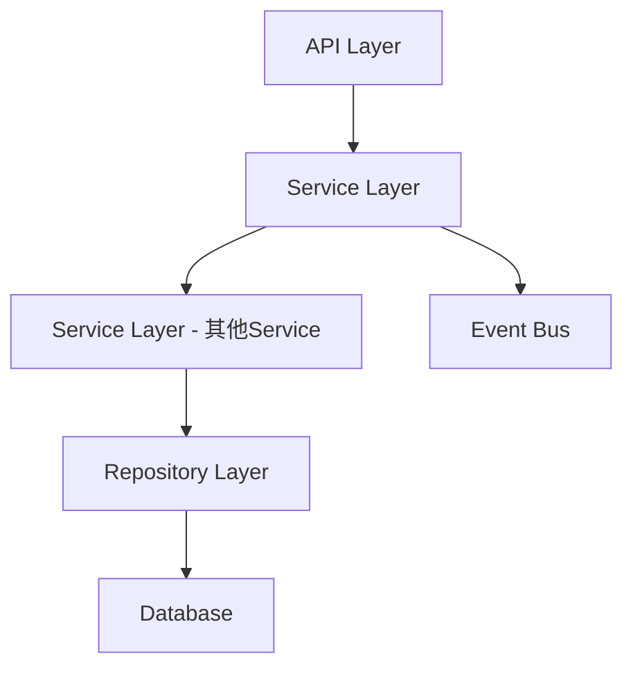

# {功能名称} 设计文档

> 本文档定义 {功能} 的技术设计和实现方案。

## 📋 概述

[高层次描述该功能及其在整体系统中的位置]

---

## 🎯 规范对齐

### Go Main 规范 (go-main.mdc)

[说明设计如何遵循 Go Main 开发规范]
- Service 只依赖其他 Service 接口
- Repository 只持有 db 实例
- URL 使用 snake_case
- data 字段必须是对象
- 不使用 panic，返回 error

### Go BMP 规范 (go-bmp.mdc)

[如涉及微服务，说明如何遵循 GoFrame 规范]
- 禁止修改 dao/entity/do/ 目录
- gRPC 服务注册到 Nacos
- 遵循 GoFrame 项目结构

### PHP 规范 (php.mdc)

[如涉及 PHP，说明如何遵循规范]
- 遵循 MVC 分层
- Controller 不写业务逻辑
- 使用验证器验证参数

### API 设计规范 (api.mdc)

[说明 API 设计如何遵循规范]
- URL 使用 snake_case
- 响应格式统一
- data 不能为 null 或数组

### 数据库规范 (database.mdc)

[说明数据库设计如何遵循规范]
- 必需字段完整
- 时间字段使用 int
- 金额字段使用 decimal

---

## 🔄 代码复用分析

[分析将复用、扩展或集成的现有代码]

### 可复用的现有组件

- **{Service/Repository 名称}**: `{路径}` - {如何使用}
- **{工具/辅助类名称}**: `{路径}` - {如何扩展}

### 集成点

- **{现有 API}**: {新功能如何集成}
- **{数据库表}**: {数据如何连接到现有架构}
- **{微服务}**: {如何通过 gRPC 调用}

---

## 🏗️ 架构设计

[描述整体架构和使用的设计模式]

### 分层设计原则

**Go Main 三层架构**:
```
API 层 (Controller/API)
  ↓ 依赖
业务层 (Service)
  ↓ 依赖
数据层 (Repository)
```

**依赖规则**:
- ✅ 上层可依赖下层
- ❌ 禁止下层依赖上层
- ❌ 禁止跨层调用
- ❌ Service 不能依赖 Repository
- ✅ Service 可以依赖其他 Service 接口

### 架构图



### 模块划分

#### Go Main 模块
- **API 层**: `main/app/api/` - 路由处理、参数校验
- **Service 层**: `main/app/service/` - 业务逻辑、事务管理
- **Repository 层**: `main/app/repository/` - 数据访问、数据库操作
- **Model 层**: `main/app/model/` - 数据模型
- **DTO 层**: `main/app/dto/` - 数据传输对象
  - `req/` - 请求参数
  - `resp/` - 响应数据

#### Go BMP 模块（如适用）
- **HTTP Controller**: `ttpos-{service}/internal/controller/http/` - HTTP 接口
- **RPC Controller**: `ttpos-{service}/internal/controller/rpc/` - gRPC 接口
- **Logic 层**: `ttpos-{service}/internal/logic/` - 业务逻辑
- **DAO 层**: `ttpos-{service}/internal/dao/` - 数据访问（自动生成 ❌ 禁止修改）
- **Model 层**: `ttpos-{service}/internal/model/`
  - `entity/` - 数据实体（自动生成 ❌ 禁止修改）
  - `do/` - 数据对象（自动生成 ❌ 禁止修改）
  - `dto/` - 数据传输对象（手动编写 ✅）

#### PHP Admin 模块（如适用）
- **Controller 层**: `admin/app/{admin|shop}/controller/` - 控制器
- **Service 层**: `admin/app/{admin|shop}/service/` - 业务逻辑
- **Model 层**: `admin/app/{admin|shop}/model/` - 数据模型
- **Validate 层**: `admin/app/{admin|shop}/validate/` - 参数验证

#### Vue 前端模块（如适用）
- **Pages**: `admin/views/{admin|shop}/pages/` - 页面
- **Components**: `admin/views/{admin|shop}/components/` - 组件
- **API**: `admin/views/{admin|shop}/api/` - API 封装
- **Store**: `admin/views/{admin|shop}/store/` - 状态管理

---

## 🗄️ 数据库设计

### 数据表设计

#### 表 1: {表名}

```sql
CREATE TABLE IF NOT EXISTS `ttpos_{table_name}` (
    `id` bigint unsigned NOT NULL AUTO_INCREMENT COMMENT '主键ID',
    `uuid` bigint unsigned NOT NULL DEFAULT 0 COMMENT '唯一标识',
    `{field_name}` {type} NOT NULL DEFAULT {value} COMMENT '{comment}',
    `create_time` int NOT NULL DEFAULT 0 COMMENT '创建时间',
    `update_time` int NOT NULL DEFAULT 0 COMMENT '更新时间',
    `delete_time` int NOT NULL DEFAULT 0 COMMENT '删除时间',
    PRIMARY KEY (`id`),
    UNIQUE KEY `uk_uuid` (`uuid`),
    KEY `idx_{field}` (`{field}`)
) ENGINE=InnoDB DEFAULT CHARSET=utf8mb4 COMMENT='{表注释}';
```

**字段说明**:
| 字段 | 类型 | 说明 | 约束 |
|------|------|------|------|
| id | bigint unsigned | 主键ID | AUTO_INCREMENT |
| uuid | bigint unsigned | 唯一标识 | DEFAULT 0, UNIQUE |
| {field_name} | {type} | {说明} | {约束} |
| create_time | int | 创建时间 | DEFAULT 0 |
| update_time | int | 更新时间 | DEFAULT 0 |
| delete_time | int | 删除时间 | DEFAULT 0 |

**索引设计**:
- 主键索引: `PRIMARY KEY (id)`
- 唯一索引: `UNIQUE KEY uk_uuid (uuid)`
- 普通索引: `KEY idx_{field} ({field})`

**迁移文件**: `admin/database/migrations/{YYYYMMDDHHMMSS}_create_ttpos_{table_name}_table.php`

#### 表 2: {表名}

[同上格式]

### 数据库迁移

**迁移脚本**:
```bash
# 创建迁移文件
cd admin
php think migrate:create CreateTtpos{TableName}Table

# 执行迁移
php think migrate:run
```

**同步 Go Model**:
```bash
# 在 main/app/model/ 中创建对应的 Go 结构体
```

**参考**: `docs/agent/workflows/database-migration.md`

---

## 📊 数据模型

### Go Model

```go
// main/app/model/{name}.go
type {ModelName} struct {
    Id         uint64 `gorm:"column:id;primaryKey" json:"id"`
    Uuid       uint64 `gorm:"column:uuid;uniqueIndex" json:"uuid"`
    {FieldName} {Type} `gorm:"column:{field_name}" json:"{field_name}"`
    CreateTime int64  `gorm:"column:create_time" json:"create_time"`
    UpdateTime int64  `gorm:"column:update_time" json:"update_time"`
    DeleteTime int64  `gorm:"column:delete_time;index" json:"delete_time"`
}

func (*{ModelName}) TableName() string {
    return "ttpos_{table_name}"
}
```

### DTO 定义

#### Request DTO

```go
// main/app/dto/req/{name}_req.go
type {Name}CreateReq struct {
    {FieldName} {Type} `json:"{field_name}" binding:"required"`
}

type {Name}UpdateReq struct {
    Uuid       uint64 `json:"uuid" binding:"required"`
    {FieldName} {Type} `json:"{field_name}"`
}

type {Name}GetReq struct {
    Uuid uint64 `json:"uuid" binding:"required"`
}

type {Name}ListReq struct {
    PageNo   int    `json:"page_no" binding:"required"`
    PageSize int    `json:"page_size" binding:"required"`
    {Filter} {Type} `json:"{filter}"`
}
```

#### Response DTO

```go
// main/app/dto/resp/{name}_resp.go
type {Name}Resp struct {
    Uuid       uint64 `json:"uuid"`
    {FieldName} {Type} `json:"{field_name}"`
    CreateTime int64  `json:"create_time"`
    UpdateTime int64  `json:"update_time"`
}

type {Name}ListResp struct {
    List []*{Name}Resp `json:"list"`
    Meta *PageMeta     `json:"meta"`
}

type PageMeta struct {
    PageNo   int   `json:"page_no"`
    PageSize int   `json:"page_size"`
    Total    int64 `json:"total"`
}
```

---

## 🔌 API 设计

### RESTful API

#### API 1: {API 名称}

**请求**:
- **URL**: `/api/v1/{module}/{action}`
- **Method**: `POST` / `GET` / `PUT` / `DELETE`
- **Headers**: 
  ```json
  {
    "Authorization": "Bearer {token}",
    "Content-Type": "application/json"
  }
  ```
- **Body**:
  ```json
  {
    "{field}": "{value}"
  }
  ```

**响应**:
```json
{
  "code": 1,
  "message": "success",
  "data": {
    "uuid": 123456,
    "{field}": "{value}"
  }
}
```

**错误响应**:
```json
{
  "code": 0,
  "message": "错误信息",
  "data": {}
}
```

#### API 2: {API 名称}

[同上格式]

### gRPC API（如适用）

#### Protobuf 定义

```protobuf
// ttpos-bmp/app/ttpos-{service}/manifest/protobuf/{name}.proto
syntax = "proto3";

package {service};
option go_package = "ttpos-{service}/api/{name}";

service {ServiceName} {
  rpc {MethodName} ({Request}) returns ({Response});
}

message {Request} {
  uint64 uuid = 1;
  string {field} = 2;
}

message {Response} {
  int32 code = 1;
  string message = 2;
  {Data} data = 3;
}

message {Data} {
  uint64 uuid = 1;
  string {field} = 2;
}
```

**生成代码**:
```bash
cd ttpos-bmp/app/ttpos-{service}
make dao
```

**参考**: `docs/agent/workflows/microservice-integration.md`

---

## 🧩 组件和接口

### Service 层

#### Service 接口

```go
// main/app/service/i_{name}_service.go
type I{Name}Srv interface {
    Create(ctx *gin.Context, req *dto_req.{Name}CreateReq) (*dto_resp.{Name}Resp, error)
    Update(ctx *gin.Context, req *dto_req.{Name}UpdateReq) error
    GetByUuid(ctx *gin.Context, uuid uint64) (*dto_resp.{Name}Resp, error)
    GetList(ctx *gin.Context, req *dto_req.{Name}ListReq) (*dto_resp.{Name}ListResp, error)
    Delete(ctx *gin.Context, uuid uint64) error
}
```

#### Service 实现

```go
// main/app/service/{name}_service.go
type {name}Srv struct {
    dbm *database.DBManager
    // 依赖其他 Service
    {other}Srv I{Other}Srv
}

func New{Name}Srv(
    dbm *database.DBManager,
    {other}Srv I{Other}Srv,
) I{Name}Srv {
    return &{name}Srv{
        dbm:        dbm,
        {other}Srv: {other}Srv,
    }
}

func (s *{name}Srv) Create(ctx *gin.Context, req *dto_req.{Name}CreateReq) (*dto_resp.{Name}Resp, error) {
    // 获取 Repository
    {name}Repo := repository.New{Name}Repo(s.dbm.GetDB(ctx))
    
    // 业务逻辑
    {name} := &model.{ModelName}{
        Uuid:       pkg_uuid.GenerateUuid(),
        {FieldName}: req.{FieldName},
        CreateTime: time.Now().Unix(),
        UpdateTime: time.Now().Unix(),
    }
    
    // 保存数据
    if err := {name}Repo.Create({name}); err != nil {
        return nil, errors.WithMessage(err, "创建失败")
    }
    
    // 发布事件（如需要）
    go func() {
        event.NewSystemBus().Publish{Name}CreatedEvent(
            event.{Name}CreatedPayload{
                BasePayload: event.BasePayload{
                    Ctx:         ctx,
                    CompanyUuid: ctx.GetCompanyUuid(),
                },
                {Name}Uuid: {name}.Uuid,
            },
        )
    }()
    
    // 返回响应
    return &dto_resp.{Name}Resp{
        Uuid:       {name}.Uuid,
        {FieldName}: {name}.{FieldName},
        CreateTime: {name}.CreateTime,
        UpdateTime: {name}.UpdateTime,
    }, nil
}

// 其他方法实现...
```

### Repository 层

#### Repository 接口

```go
// main/app/repository/i_{name}_repo.go
type I{Name}Repo interface {
    Create({name} *model.{ModelName}) error
    Update({name} *model.{ModelName}, options ...DBOption) error
    GetByUuid(uuid uint64, options ...DBOption) (*model.{ModelName}, error)
    GetList(options ...DBOption) ([]*model.{ModelName}, int64, error)
    Delete(uuid uint64) error
    
    // 选项方法
    WhereUuid(uuid uint64) DBOption
    Where{Field}({field} {Type}) DBOption
    // ...
}
```

#### Repository 实现（使用选项模式）

```go
// main/app/repository/{name}_repo.go
type {Name}RepoImpl struct {
    db *gorm.DB  // ✅ 只持有 db 实例
}

func New{Name}Repo(db *gorm.DB) I{Name}Repo {
    return &{Name}RepoImpl{db: db}
}

func (r *{Name}RepoImpl) Create({name} *model.{ModelName}) error {
    return r.db.Create({name}).Error
}

func (r *{Name}RepoImpl) GetByUuid(uuid uint64, options ...DBOption) (*model.{ModelName}, error) {
    var {name} model.{ModelName}
    db := r.db.Where("delete_time = ?", 0)
    
    for _, option := range options {
        db = option(db)
    }
    
    if err := db.Where("uuid = ?", uuid).First(&{name}).Error; err != nil {
        return nil, err
    }
    return &{name}, nil
}

func (r *{Name}RepoImpl) GetList(options ...DBOption) ([]*model.{ModelName}, int64, error) {
    var list []*model.{ModelName}
    var total int64
    
    db := r.db.Where("delete_time = ?", 0)
    
    for _, option := range options {
        db = option(db)
    }
    
    if err := db.Model(&model.{ModelName}{}).Count(&total).Error; err != nil {
        return nil, 0, err
    }
    
    if err := db.Find(&list).Error; err != nil {
        return nil, 0, err
    }
    
    return list, total, nil
}

// 选项方法
func (r *{Name}RepoImpl) WhereUuid(uuid uint64) DBOption {
    return func(db *gorm.DB) *gorm.DB {
        return db.Where("uuid = ?", uuid)
    }
}

func (r *{Name}RepoImpl) Where{Field}({field} {Type}) DBOption {
    return func(db *gorm.DB) *gorm.DB {
        return db.Where("{field_name} = ?", {field})
    }
}
```

### API 层

```go
// main/app/api/{name}_api.go
type {Name}API struct {
    {name}Srv service.I{Name}Srv
}

func New{Name}API({name}Srv service.I{Name}Srv) *{Name}API {
    return &{Name}API{{name}Srv: {name}Srv}
}

// POST /api/v1/{name}/create
func (api *{Name}API) Create(c *gin.Context) {
    var req dto_req.{Name}CreateReq
    if err := c.ShouldBindJSON(&req); err != nil {
        helper.ErrorWithDetail(c, constant.CodeInvalidParam, err)
        return
    }
    
    resp, err := api.{name}Srv.Create(c, &req)
    if err != nil {
        helper.ErrorWithDetail(c, constant.CodeFail, err)
        return
    }
    
    helper.Success(c, gin.H{
        "data": resp,
    })
}

// 其他 API 方法...
```

---

## ⚡ 缓存设计

### Redis 缓存

**缓存策略**:
- **Key 命名**: `ttpos:{module}:{type}:{id}`
- **过期时间**: 根据业务场景设置
- **更新策略**: Cache-Aside Pattern

**示例**:
```go
// 缓存读取
key := fmt.Sprintf("ttpos:{module}:{name}:%d", uuid)
cached, err := redis.Get(key)
if err == nil {
    // 缓存命中
    return cached
}

// 缓存未命中，查询数据库
data, err := repo.GetByUuid(uuid)
if err != nil {
    return err
}

// 写入缓存
redis.Set(key, data, 5*time.Minute)
return data
```

---

## 🚨 错误处理

### 错误场景

#### 场景 1: {错误描述}

- **处理方式**: {如何处理}
- **用户影响**: {用户看到什么}
- **代码示例**:
  ```go
  if err != nil {
      logger.Logger.Error("{操作}失败", zap.Error(err))
      return nil, errors.WithMessage(err, "{错误提示}")
  }
  ```

#### 场景 2: {错误描述}

- **处理方式**: {如何处理}
- **用户影响**: {用户看到什么}

---

## 🔒 安全设计

### 身份验证

- **JWT Token**: 所有 API 需要 Token 验证
- **Token 刷新**: 自动刷新机制

### 权限控制

- **RBAC**: 基于角色的访问控制
- **API 权限**: 每个 API 检查用户权限

### 数据安全

- **敏感数据加密**: 密码、支付信息等加密存储
- **SQL 注入防护**: 使用参数化查询
- **XSS 防护**: 前端输入校验

---

## 🧪 测试策略

### 单元测试

**目标覆盖率**: 
- main/app/service: 70%+
- main/app/repository: 80%+
- **Payment/Order 相关: 100%**（高风险）

**测试内容**:
- Service 业务逻辑
- Repository 数据访问
- DTO 数据转换

**示例**:
```go
// main/app/service/{name}_service_test.go
func Test{Name}Service_Create(t *testing.T) {
    // 测试实现
}
```

### API 测试

**测试内容**:
- API 接口调用
- 参数验证
- 响应格式
- 错误处理

### 集成测试

**测试流程**:
- 端到端业务流程
- 数据库事务
- 缓存一致性

---

## 📈 性能优化

### 优化策略

1. **数据库优化**:
   - 添加索引
   - 优化 SQL 查询
   - 使用连接池

2. **缓存优化**:
   - Redis 缓存热点数据
   - 缓存预热
   - 缓存穿透防护

3. **并发控制**:
   - UUID 锁防止并发冲突
   - 事务隔离级别

4. **接口优化**:
   - 异步处理
   - 批量操作

### 性能指标

- 本地响应时间: < 200ms
- 数据库查询: < 50ms
- 缓存命中率: > 80%
- 并发能力: 1000+ QPS

---

## 🌐 浏览器兼容性

### 前端兼容性（Vue）

- Chrome 90+
- Safari 14+
- Firefox 88+
- Edge 90+

### 响应式设计

- 桌面端: 1920x1080
- 平板端: 1024x768
- 移动端: 375x667

---

## 📚 实现清单

### Phase 1: 数据库和模型

- [ ] 创建数据库迁移文件
- [ ] 执行数据库迁移
- [ ] 创建 Go Model
- [ ] 更新 Seeds 文件

### Phase 2: 核心实现

- [ ] 实现 Repository 接口和实现
- [ ] 实现 Service 接口和实现
- [ ] 实现 API 接口
- [ ] 创建 DTO 定义

### Phase 3: 集成和优化

- [ ] 集成事件总线（如需要）
- [ ] 实现缓存策略
- [ ] 实现并发控制
- [ ] 性能优化

### Phase 4: 测试

- [ ] 单元测试
- [ ] API 测试
- [ ] 集成测试
- [ ] 性能测试

**详细任务**: 参见 `tasks.md`

---

**版本**: v1.0.0  
**创建日期**: {YYYY-MM-DD}  
**作者**: {团队/个人}  
**审核者**: {审核者}

