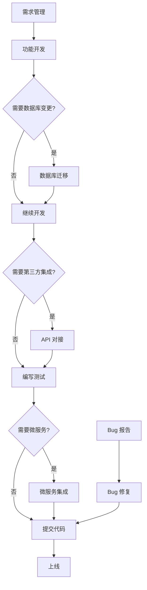

# 工作流索引

> Agent 执行清单的详细文档

---

## 📋 工作流列表

### 核心工作流（P0）

| 工作流         | 文件                                                     | 适用场景             | 预计时间 |
| -------------- | -------------------------------------------------------- | -------------------- | -------- |
| **新成员入职** | [onboarding.md](./onboarding.md)                         | 新成员快速上手       | 4-6 天   |
| **需求管理**   | [requirement-management.md](./requirement-management.md) | 需求发起、评审、确认 | 0.5-1 天 |
| **功能开发**   | [feature-development.md](./feature-development.md)       | 新增功能、优化功能   | 2-5 天   |
| **Bug 修复**   | [bug-fixing.md](./bug-fixing.md)                         | 修复缺陷、解决问题   | 0.5-2 天 |
| **API 对接**   | [api-integration.md](./api-integration.md)               | 第三方集成、接口开发 | 1-3 天   |
| **链接回写**   | [proposal-spec-linking.md](./proposal-spec-linking.md)   | Proposal↔Spec 双向链 | 0.5 天   |

### 后端专属工作流（P0）

| 工作流         | 文件                                                         | 适用场景              | 预计时间 |
| -------------- | ------------------------------------------------------------ | --------------------- | -------- |
| **数据库迁移** | [database-migration.md](./database-migration.md)             | 新增表、修改字段      | 0.5-1 天 |
| **微服务集成** | [microservice-integration.md](./microservice-integration.md) | gRPC 服务、Nacos 注册 | 2-4 天   |

---

## 🎯 快速查询

### 我想知道...

| 问题                 | 查阅                                              |
| -------------------- | ------------------------------------------------- |
| 新成员如何快速上手？ | [新成员入职工作流](./onboarding.md)               |
| 如何开始一个新功能？ | [功能开发工作流](./feature-development.md)        |
| Bug 修复的完整流程？ | [Bug 修复工作流](./bug-fixing.md)                 |
| 如何对接第三方 API？ | [API 对接工作流](./api-integration.md)            |
| 如何创建数据库迁移？ | [数据库迁移工作流](./database-migration.md)       |
| 如何开发 gRPC 服务？ | [微服务集成工作流](./microservice-integration.md) |
| 如何管理需求？       | [需求管理工作流](./requirement-management.md)     |

### 我在某个步骤卡住了...

| 步骤             | 查阅                                            |
| ---------------- | ----------------------------------------------- |
| Spec 文档创建    | `../../.cursor/rules/specs.mdc`                 |
| Go 代码实现规范  | `../../.cursor/rules/golang.mdc`                |
| PHP 代码实现规范 | `../../.cursor/rules/php.mdc`                   |
| Vue 前端规范     | `../../.cursor/rules/vue.mdc`                   |
| 数据库迁移规范   | `../../.cursor/rules/php.mdc` (迁移部分)        |
| GoFrame 开发规范 | `../../ttpos-bmp/.cursor/rules/go-rules.mdc`    |
| Protobuf 规范    | `../../ttpos-bmp/.cursor/rules/proto-rules.mdc` |
| 文档更新         | `../../.cursor/rules/documentation.mdc`         |
| 知识记录         | `../../.cursor/rules/knowledge_management.mdc`  |

---

## 🔄 工作流关系

---

## 📝 场景映射

### 场景 0: 产品经理提出需求

**关键词**: "有个想法" "能不能做" "提个需求"  
**工作流**: [需求管理](./requirement-management.md)

### 场景 1: 开发者实现功能

**关键词**: "新增" "添加" "实现" "开发"  
**工作流**: [功能开发](./feature-development.md)

### 场景 3: 用户报告 Bug

**关键词**: "错误" "报错" "bug" "崩溃"  
**工作流**: [Bug 修复](./bug-fixing.md)

### 场景 4: 第三方 API 集成

**关键词**: "集成" "对接" "API" "第三方"  
**工作流**: [API 对接](./api-integration.md)

### 场景 5: 数据库迁移

**关键词**: "迁移数据库" "新增表" "修改字段"  
**工作流**: [数据库迁移](./database-migration.md)

### 场景 6: 微服务集成

**关键词**: "gRPC" "微服务" "ttpos-bmp" "Nacos"  
**工作流**: [微服务集成](./microservice-integration.md)

---

## 🔧 工作流特点

### Agent 视角文档

- **目标**: 快速执行，精准定位
- **长度**: <300 行
- **结构**: 步骤检查清单 + IF-THEN 决策树
- **风格**: YAML/表格/代码块优先

### 后端特色

- **多语言**: Go / PHP / Vue 三种技术栈
- **多服务**: main/ / ttpos-bmp/ / admin/ 三个服务
- **数据库**: PHP Phinx + Go Model 同步
- **微服务**: gRPC + Nacos 服务发现

---

## 📚 相关资源

### 核心规范

- [Agent 速查表](../../AGENT.md) - 所有规则的压缩映射表
- [工作流导航](../../.cursor/rules/workflows.mdc) - 场景识别和流程导航

### 开发规范

- [Go 开发规范](../../.cursor/rules/golang.mdc)
- [PHP 开发规范](../../.cursor/rules/php.mdc)
- [Vue 开发规范](../../.cursor/rules/vue.mdc)
- [GoFrame 规范](../../ttpos-bmp/.cursor/rules/go-rules.mdc)
- [Protobuf 规范](../../ttpos-bmp/.cursor/rules/proto-rules.mdc)

### 文档模板

- [文档模板目录](../templates/) - 标准化文档模板

---

## Graphiti & 活动日志

- 所有工作流在执行完关键节点后，应在文档末尾的“Graphiti & 活动日志”区域填入 `Related Episode`。
- Episode 模板：`docs/agent/templates/graphiti-episode.md`
- 活动日志：`docs/team/activities/{YYYY-MM}/{YYYY-MM-DD}.md`
- 典型触发：Bug 排查 >30min、复杂数据库迁移、第三方对接踩坑、微服务治理经验、新人 Onboarding 回顾等。

---

## 📊 工作流状态

| 工作流     | 状态      | 最后更新   |
| ---------- | --------- | ---------- |
| 新成员入职 | ✅ 已完成 | 2025-11-17 |
| 需求管理   | ✅ 已完成 | 2025-11-16 |
| 功能开发   | ✅ 已完成 | 2025-11-16 |
| Bug 修复   | ✅ 已完成 | 2025-11-16 |
| API 对接   | ✅ 已完成 | 2025-11-16 |
| 数据库迁移 | ✅ 已完成 | 2025-11-16 |
| 微服务集成 | ✅ 已完成 | 2025-11-16 |

---

**最后更新**: 2025-11-17  
**维护者**: 后端开发组
