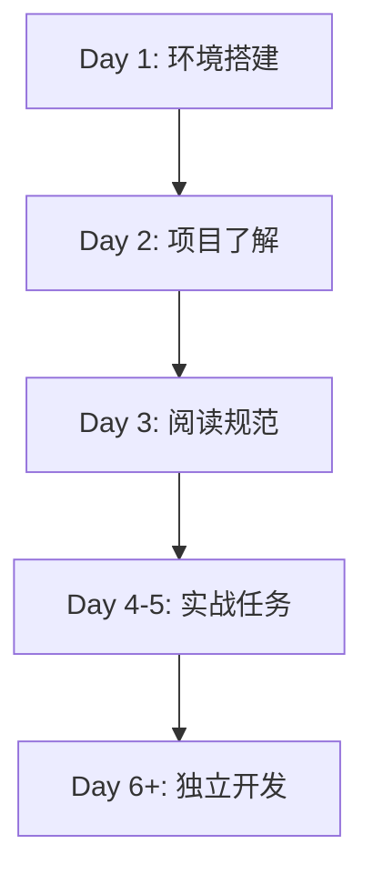

# 新成员入职工作流

> 本文档帮助新成员快速了解后端项目并开始贡献代码。

## 📋 概述

### 适用场景

- 新加入团队的后端开发者
- 实习生
- 外部协作者

### 预计时间

- 环境搭建: 0.5-1 天
- 项目熟悉: 1-2 天
- 首个任务: 2-3 天
- **总计**: 4-6 天完全上手

### 前置要求

- 熟悉 Go 或 PHP 基础
- 了解 Git 基本操作
- 有 Web 开发或 API 开发经验
- 了解 MySQL 和 Redis

---

## 🔄 入职路径



---

## Day 1: 环境搭建和项目克隆

### 🎯 目标

完成开发环境搭建，能够运行项目。

### 📋 任务清单

#### 1. 安装开发工具 (2-4 小时)

**必需工具**:

- [ ] Go 1.23+
- [ ] PHP 8.0+
- [ ] Node.js 16+ (前端开发)
- [ ] MySQL 8.0+
- [ ] Redis 6.0+
- [ ] Docker + Docker Compose
- [ ] Git
- [ ] IDE (VS Code 或 GoLand 或 PhpStorm)

**参考**: 项目 README.md

**可选工具**:

- **Postman** / **Apifox**: API 测试
- **Redis Desktop Manager**: Redis 可视化
- **MySQL Workbench**: 数据库管理
- **wrk** / **ab**: 性能测试

#### 2. 克隆项目 (10 分钟)

```bash
# 克隆仓库
git clone <repository_url>
cd ttpos-server-go

# 查看项目结构
ls -la
# main/        - Go Main 模块
# admin/       - PHP Admin 模块
# ttpos-bmp/   - Go BMP 微服务
# websocket/   - WebSocket 服务
# redis-proxy/ - Redis 代理
# docker/      - Docker 配置
# docs/        - 项目文档
```

#### 3. 启动 Docker 环境 (30 分钟)

```bash
# 启动开发环境（MySQL + Redis + Nginx + PHP）
docker-compose -f docker-compose.dev.yml up -d

# 查看容器状态
docker-compose -f docker-compose.dev.yml ps

# 查看日志
docker-compose -f docker-compose.dev.yml logs -f mysql
docker-compose -f docker-compose.dev.yml logs -f redis
```

#### 4. 初始化数据库 (20 分钟)

```bash
# 进入 admin 目录
cd admin

# 安装 PHP 依赖
composer install

# 执行数据库迁移
php think migrate:run

# 导入初始数据
mysql -h127.0.0.1 -uroot -p ttpos < database/seeds/shop_01.sql
```

#### 5. 运行 Go Main 服务 (20 分钟)

```bash
# 进入 main 目录
cd main

# 安装 Go 依赖
go mod download

# 运行服务
go run main.go

# 或使用 fresh 热重载
fresh
```

#### 6. 验证服务 (10 分钟)

```bash
# 测试 Go Main API
curl http://localhost:8080/api/v1/health

# 测试 PHP Admin API
curl http://localhost/admin/api/v1/health

# 访问管理后台（如已启动前端）
open http://localhost:3000
```

#### 7. 验证检查清单

- [ ] Go 版本正确 (1.23+)
- [ ] PHP 版本正确 (8.0+)
- [ ] MySQL 可连接
- [ ] Redis 可连接
- [ ] Go Main 服务启动成功
- [ ] PHP Admin 服务启动成功
- [ ] 数据库迁移执行成功
- [ ] API 测试通过

---

## Day 2: 了解项目架构和业务

### 🎯 目标

理解项目结构、架构设计和业务领域。

### 📋 任务清单

#### 1. 阅读核心文档 (2-3 小时)

**必读文档** (按顺序):

1. [ ] [README.md](../../README.md) - 项目概览
2. [ ] [AGENTS.md](../../AGENTS.md) - Agent 速查表 ⭐⭐⭐
3. [ ] [项目结构](../../.cursor/rules/structs.mdc) - 代码定位
4. [ ] [系统架构](../human/architecture/overview.md) - 技术架构
5. [ ] [餐饮术语表](../human/business/glossary.md) - 业务术语

**重点理解**:

- 3 个主要模块（Main + Admin + BMP）
- 微服务架构设计
- 多租户数据库架构
- 核心技术栈（Go + PHP + Vue + MySQL + Redis）

#### 2. 了解业务流程 (1-2 小时)

**核心业务流程**:

1. **订单流程**: 创建订单 → 计算金额 → 支付 → 库存扣减 → 通知厨房
2. **支付流程**: 选择支付方式 → 调用支付接口 → 更新订单状态 → 打印小票
3. **会员流程**: 会员注册 → 充值 → 消费 → 积分累计 → 等级升级
4. **库存流程**: 采购入库 → 销售出库 → 库存盘点 → 库存调拨

**参考**: `docs/human/business/workflows/` - 业务流程文档

#### 3. 熟悉代码结构 (1-2 小时)

**浏览关键目录**:

```bash
# main/ - Go Main 核心业务服务
main/
├── app/
│   ├── api/          # API 层 (路由处理)
│   ├── service/      # Service 层 (业务逻辑) ⭐ 重点
│   ├── repository/   # Repository 层 (数据访问)
│   ├── model/        # Model 层 (数据模型)
│   ├── dto/          # DTO 层 (数据传输对象)
│   │   ├── req/      # 请求参数
│   │   └── resp/     # 响应数据
│   ├── constant/     # 常量定义
│   ├── errors/       # 错误处理
│   └── event/        # 事件总线
├── config/           # 配置管理
├── router/           # 路由注册
└── main.go           # 入口文件

# admin/ - PHP Admin 管理后台
admin/
├── app/
│   ├── admin/        # 管理后台
│   │   ├── controller/  # 控制器
│   │   ├── service/     # 服务层
│   │   ├── model/       # 模型
│   │   └── validate/    # 验证器
│   ├── shop/         # 店铺后台 (同上)
│   └── common/       # 共享代码
├── database/
│   ├── migrations/   # 数据库迁移 ⭐ 重点
│   └── seeds/        # 初始数据
└── views/            # 前端代码 (Vue 3)

# ttpos-bmp/ - Go BMP 微服务
ttpos-bmp/app/
├── ttpos-erp/        # ERP 服务
├── ttpos-manager/    # 管理服务
├── ttpos-message/    # 消息服务
└── ...

# docs/ - 项目文档
docs/
├── agent/            # Agent 专用 ⭐ 重点
│   ├── workflows/    # 工作流程
│   └── templates/    # 文档模板
├── human/            # 人类专用
│   ├── architecture/ # 架构设计
│   ├── guides/       # 开发指南
│   └── business/     # 业务知识
└── shared/           # 共用资源
    ├── specs/        # 功能规格
    ├── api/          # API 文档
    └── troubleshooting/ # 问题排查
```

**建议**: 打开 `main/app/service/order_srv.go`，跟踪订单创建流程

#### 4. 理解三层架构 (1 小时)

**Go Main 架构**:

```
API 层 (Controller/API)
  ↓ 调用
Service 层 (业务逻辑)
  ↓ 调用
Repository 层 (数据访问)
```

**依赖规则** (重要):

- ✅ Service 只依赖其他 Service 接口
- ❌ Service 不能直接依赖 Repository
- ✅ Repository 只持有 db 实例
- ❌ Repository 不能持有 DBManager

**参考**: `docs/human/architecture/go-main-architecture.md`

#### 5. 验证检查清单

- [ ] 理解 3 个主要模块的用途
- [ ] 了解核心业务流程
- [ ] 知道三层架构的依赖规则
- [ ] 能说出 5 个关键技术
- [ ] 知道文档在哪里找

---

## Day 3: 学习开发规范

### 🎯 目标

掌握项目的编码规范、工作流程和最佳实践。

### 📋 任务清单

#### 1. 阅读 Agent 开发规范 (2-3 小时)

**核心规范** (必读):

1. [ ] [intro.mdc](../../.cursor/rules/intro.mdc) - 项目概览
2. [ ] [structs.mdc](../../.cursor/rules/structs.mdc) - 项目结构
3. [ ] [go-main.mdc](../../.cursor/rules/go-main.mdc) - **Go Main 规范** ⭐⭐⭐
4. [ ] [php.mdc](../../.cursor/rules/php.mdc) - **PHP 规范** ⭐⭐⭐
5. [ ] [api.mdc](../../.cursor/rules/api.mdc) - **API 设计规范** ⭐⭐⭐
6. [ ] [database.mdc](../../.cursor/rules/database.mdc) - **数据库规范** ⭐⭐⭐

**专项规范** (按需):

7. [ ] [go-bmp.mdc](../../.cursor/rules/go-bmp.mdc) - Go BMP 微服务规范
8. [ ] [vue.mdc](../../.cursor/rules/vue.mdc) - Vue 前端规范
9. [ ] [security.mdc](../../.cursor/rules/security.mdc) - 安全规范
10. [ ] [version.mdc](../../.cursor/rules/version.mdc) - Git 工作流

**重点掌握**:

- Service/Repository 依赖规则
- API 响应格式（data 必须是对象）
- URL 命名规范（snake_case）
- 数据库字段规范（时间用 int，金额用 decimal）
- 错误处理方式（不用 panic）
- 测试覆盖率要求

#### 2. 学习工作流程 (1-2 小时)

**必读工作流**:

1. [ ] [需求管理工作流](./requirement-management.md) ⭐⭐⭐
2. [ ] [功能开发工作流](./feature-development.md) ⭐⭐⭐
3. [ ] [Bug 修复工作流](./bug-fixing.md)
4. [ ] [数据库迁移工作流](./database-migration.md) ⭐⭐

**重点理解**:

- Story Point 评估 (必须 ≤ 5)
- Spec 文档创建（requirements → design → tasks）
- 数据库迁移流程（PHP Phinx + Go Model）
- 测试覆盖率要求（Service 70%, Repository 80%, Payment/Order 100%）
- PR 提交规范
- 知识记录流程

#### 3. 实践代码规范 (1-2 小时)

**练习任务**: 创建一个符合规范的 Service

```go
// main/app/service/practice_srv.go

package service

import (
    "github.com/gin-gonic/gin"
    "github.com/pkg/errors"
)

/// 练习: 创建一个符合规范的 Service

// ✅ 接口以 I 开头
type IPracticeSrv interface {
    GetMessage(ctx *gin.Context) (string, error)
}

// ✅ 实现以 Impl 结尾
type practiceSrvImpl struct {
    dbm *database.DBManager  // ✅ 持有 DBManager
    // ✅ 依赖其他 Service 接口
    orderSrv IOrderSrv
}

// ✅ 构造函数
func NewPracticeSrv(
    dbm *database.DBManager,
    orderSrv IOrderSrv,
) IPracticeSrv {
    return &practiceSrvImpl{
        dbm:      dbm,
        orderSrv: orderSrv,
    }
}

// ✅ 实现接口方法
func (s *practiceSrvImpl) GetMessage(ctx *gin.Context) (string, error) {
    // ✅ 使用 errors.WithMessage 包装错误
    if err := someOperation(); err != nil {
        return "", errors.WithMessage(err, "操作失败")
    }

    // ✅ 不使用 panic，返回 error
    return "Hello, TTPOS!", nil
}
```

**自检清单**:

- [ ] 接口以 `I` 开头
- [ ] 实现以 `Impl` 结尾
- [ ] Service 持有 DBManager
- [ ] Service 依赖其他 Service 接口（不依赖 Repository）
- [ ] 不使用 panic
- [ ] 使用 errors.WithMessage 包装错误

#### 4. 验证检查清单

- [ ] 掌握 Go Main 三层架构
- [ ] 理解 API 响应格式规范
- [ ] 知道数据库字段规范
- [ ] 熟悉测试覆盖率要求
- [ ] 完成练习代码

---

## Day 4-5: 首个实战任务

### 🎯 目标

在导师指导下完成第一个开发任务。

### 📋 任务类型

#### 推荐任务 (由易到难)

**Level 1: 简单任务 (SP1-2)**

- [ ] 为现有 API 添加一个新字段
- [ ] 修改一个配置项
- [ ] 更新一个 API 文档
- [ ] 修复一个简单的逻辑 Bug

**Level 2: 中等任务 (SP3)**

- [ ] 实现一个新的查询 API
- [ ] 添加数据库字段并同步 Go Model
- [ ] 优化一个 SQL 查询
- [ ] 实现一个 Repository 方法

**Level 3: 复杂任务 (SP5)**

- [ ] 实现一个完整的 CRUD API
- [ ] 创建一个新的 Service
- [ ] 实现一个完整的业务功能
- [ ] 集成一个第三方 API

**建议**: 从 Level 1 开始，逐步提升

### 🎓 学习要点

#### 1. 按照工作流执行

**功能开发** (参考 [feature-development.md](./feature-development.md)):

1. 阅读 Spec 文档（requirements.md）
2. 查看技术设计（design.md）
3. 按照任务清单执行（tasks.md）
4. 实现代码
5. 编写测试
6. 提交 PR

**数据库迁移** (参考 [database-migration.md](./database-migration.md)):

1. 创建 PHP Phinx 迁移文件
2. 执行迁移
3. 更新 Go Model
4. 更新 Seeds 文件
5. 验证数据

#### 2. 寻求帮助

**卡住时**:

1. 查看相关文档（docs/）
2. 搜索 Graphiti 知识库
3. 查看类似代码实现（Leverage）
4. 询问导师或团队成员

**提问技巧**:

- 描述问题现象
- 说明已尝试的方法
- 附上错误日志
- 提供代码位置

#### 3. Code Review 学习

**PR 提交后**:

- 认真阅读审查意见
- 理解为什么要这样改
- 记录新的知识点
- 积极改进代码

**从 Review 中学习**:

- 代码风格
- 最佳实践
- 性能优化
- 安全考虑

#### 4. 验证检查清单

- [ ] 按照工作流完成任务
- [ ] 代码符合规范
- [ ] 测试已编写并通过
- [ ] PR 已通过 Review
- [ ] 代码已合并

---

## Day 6+: 独立开发

### 🎯 目标

能够独立承接和完成开发任务。

### 📋 持续学习

#### 1. 深入学习模块

**按兴趣/职责选择**:

- **Go 后端开发**: Service/Repository 模式、事件总线、并发控制
- **PHP 后端开发**: ThinkPHP 框架、MVC 分层、验证器
- **数据库设计**: 表结构设计、索引优化、SQL 优化
- **API 设计**: RESTful 规范、错误处理、文档编写
- **微服务开发**: gRPC、Protobuf、Nacos 服务发现

#### 2. 参与技术分享

**分享形式**:

- 技术分享会
- Code Review
- 文档编写
- 帮助新成员

#### 3. 贡献最佳实践

**如何贡献**:

- 补充文档
- 优化工作流
- 提出改进建议
- 记录经验到 Graphiti

---

## 常见问题

### Q: Go 版本不匹配怎么办？

**A**:

```bash
# 查看当前版本
go version

# 安装指定版本（使用 gvm）
gvm install go1.23
gvm use go1.23

# 或使用 asdf
asdf install golang 1.23.0
asdf global golang 1.23.0
```

### Q: PHP Composer 安装失败？

**A**: 常见原因和解决方法：

1. **网络问题**: 配置国内镜像
2. **依赖冲突**: 删除 `composer.lock` 重试
3. **版本不匹配**: 检查 PHP 版本

```bash
# 配置国内镜像
composer config -g repo.packagist composer https://mirrors.aliyun.com/composer/

# 清理并重试
rm -rf vendor composer.lock
composer install

# 查看详细日志
composer install -vvv
```

### Q: 数据库迁移失败？

**A**: 检查步骤：

```bash
# 1. 检查数据库连接
mysql -h127.0.0.1 -uroot -p

# 2. 检查迁移状态
cd admin
php think migrate:status

# 3. 回滚迁移
php think migrate:rollback

# 4. 重新执行
php think migrate:run
```

### Q: 不知道从哪个任务开始？

**A**: 建议顺序：

1. **阅读代码**: 熟悉现有实现
2. **修改字段**: 了解数据库迁移流程
3. **新增 API**: 理解三层架构
4. **完整功能**: 完整流程实践

找导师领取适合的任务！

### Q: 如何快速找到某个功能的代码？

**A**: 使用搜索技巧：

```bash
# 搜索文件名
find . -name "*order*.go"

# 搜索代码内容
grep -r "CreateOrder" main/app/service/

# 使用 IDE 的全局搜索
Ctrl/Cmd + Shift + F
```

### Q: Service 和 Repository 的区别？

**A**: 核心区别：

| 层级       | 职责               | 依赖               | 持有对象  |
| ---------- | ------------------ | ------------------ | --------- |
| Service    | 业务逻辑、事务管理 | 其他 Service 接口  | DBManager |
| Repository | 数据访问、SQL 查询 | 无（只操作数据库） | db 实例   |

**错误示例** ❌:

```go
// Service 直接依赖 Repository
type orderSrv struct {
    orderRepo IOrderRepo  // ❌ 错误
}
```

**正确示例** ✅:

```go
// Service 依赖其他 Service
type orderSrv struct {
    dbm       *database.DBManager  // ✅ 正确
    memberSrv IMemberSrv            // ✅ 正确
}
```

---

## 学习资源

### 项目文档

- [README.md](../../README.md) - 项目总览
- [AGENTS.md](../../AGENTS.md) - Agent 速查表 ⭐⭐⭐
- [docs/agent/workflows/](../agent/workflows/) - 工作流程 ⭐⭐⭐
- [docs/human/architecture/](../human/architecture/) - 架构设计
- [docs/shared/api/](../shared/api/) - API 文档

### 开发规范

- [.cursor/rules/go-main.mdc](../../.cursor/rules/go-main.mdc) - Go Main 规范 ⭐⭐⭐
- [.cursor/rules/php.mdc](../../.cursor/rules/php.mdc) - PHP 规范 ⭐⭐⭐
- [.cursor/rules/api.mdc](../../.cursor/rules/api.mdc) - API 设计规范 ⭐⭐⭐
- [.cursor/rules/database.mdc](../../.cursor/rules/database.mdc) - 数据库规范 ⭐⭐⭐

### 外部资源

- [Go 官方文档](https://go.dev/doc/)
- [Gin 框架文档](https://gin-gonic.com/docs/)
- [ThinkPHP 文档](https://www.kancloud.cn/manual/thinkphp6_0/)
- [GORM 文档](https://gorm.io/docs/)
- [GoFrame 文档](https://goframe.org/display/gf)

---

## 入职检查清单

### Week 1 完成目标

- [ ] 开发环境搭建完成
- [ ] 所有服务可以启动
- [ ] 阅读完核心文档
- [ ] 了解项目架构和业务
- [ ] 掌握开发规范
- [ ] 完成至少 1 个实战任务
- [ ] 提交至少 1 个 PR
- [ ] 认识团队成员

### Week 2 完成目标

- [ ] 独立完成 2-3 个任务
- [ ] PR 通过率提升
- [ ] 代码规范熟练掌握
- [ ] 能够帮助解答简单问题
- [ ] 参与技术讨论

### Month 1 完成目标

- [ ] 独立承接 SP5 以下任务
- [ ] 熟悉核心业务流程
- [ ] 代码质量稳定
- [ ] 贡献文档或最佳实践
- [ ] 完全融入团队

---

## 欢迎加入 TTPOS 后端团队！

有任何问题，随时询问：

- 技术问题 → 导师或技术群
- 流程问题 → 项目经理
- 工具问题 → IT 支持

**记住**: 没有愚蠢的问题，主动提问是最快的学习方式！

---

## Graphiti & 活动日志

- Related Episode: `[待补充]`
- 模板：`docs/agent/templates/graphiti-episode.md`
- 活动日志：`docs/team/activities/{YYYY-MM}/{YYYY-MM-DD}.md`
- 建议在完成 Onboarding 或总结学习路径/踩坑后记录 Episode，帮助下一位新同学更快上手。

---

**最后更新**: 2025-11-17  
**维护者**: 后端开发组  
**版本**: v1.0.0 - 后端版初始版本
