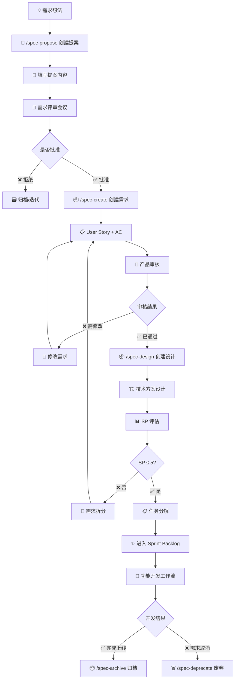

# 需求管理工作流（后端版）

## 概述

本工作流基于 **Scrum** 框架，定义了从需求提案到 Spec 创建的完整流程，确保需求的合理性、可行性和可追溯性。

---

## 触发条件

- 产品经理提出新功能想法
- 用户反馈功能改进建议
- 技术团队提出架构优化方案
- Stakeholder 提出业务需求

---

## 前置条件

### 人员要求

- **产品经理 (PM)**: 负责需求提案和业务价值评估
- **技术负责人 (Tech Lead)**: 负责技术可行性评估
- **开发代表 (Dev)**: 参与技术方案讨论
- **测试代表 (QA)**: 评估测试复杂度
- **Scrum Master**: 组织评审会议，把控流程

### 环境要求

- 熟悉 Scrum 框架和 User Story 编写规范
- 了解项目的 Story Point 评估标准
- 掌握项目的 Spec 命名规范

---

## 执行流程概览



---

## 详细步骤

### Step 1: 创建需求提案 (PM 执行)

**目标**: 将需求想法转化为结构化的提案文档。

**Agent 动作**:

1. 使用 `/spec-propose {feature-name}` 指令创建提案。
2. 自动填充日期、提案人等基本信息。

**操作步骤**:

```bash
# 创建提案（例如：快速支付功能）
/spec-propose quick-payment
```

**输出产物**: `docs/team/proposals/{YYYY-MM}/quick-payment.md`

**检查清单**:

- [ ] 已创建提案文档
- [ ] 文件路径符合命名规范

---

### Step 2: 填写提案内容 (PM 执行)

**目标**: 完整阐述需求背景、业务价值和解决方案。

**操作步骤**:

1. **描述问题背景**

   - 当前存在什么问题？
   - 用户遇到了什么痛点？
   - 为什么现在要解决？

2. **阐明业务价值**

   - 解决这个问题能带来什么收益？
   - 对用户的价值是什么？
   - 对业务的影响是什么？

3. **提出解决方案**

   - 简要描述解决方案（1-2 段）
   - 列出核心功能点（3-5 个）
   - 标注影响范围（涉及哪些模块：Go/PHP/Vue）

4. **初步评估**
   - 技术复杂度（低/中/高）
   - 工作量预估（粗略）
   - 潜在风险识别

**参考模板**: `docs/agent/templates/proposal-template.md`

**检查清单**:

- [ ] 问题背景清晰且有说服力
- [ ] 业务价值可量化
- [ ] 解决方案可行且具体
- [ ] 影响范围明确
- [ ] 风险识别充分

---

### Step 3: 组织需求评审会议 (Scrum Master 执行)

**目标**: 团队讨论需求的合理性、可行性和优先级。

**会议议程**:

1. **PM 陈述** (10 分钟)

   - 问题背景和业务价值
   - 解决方案和核心功能

2. **技术评估** (15 分钟)

   - 技术可行性讨论
   - 技术风险识别
   - 架构影响评估

3. **测试评估** (10 分钟)

   - 测试复杂度评估
   - 测试资源需求

4. **团队讨论** (10 分钟)

   - 开放讨论，提出疑问和建议
   - 优先级讨论

5. **投票表决** (5 分钟)
   - 批准 / 修改后批准 / 拒绝

**参考规范**: `.cursor/rules/scrum_story_point.mdc` - 阶段 4: 团队评审

**检查清单**:

- [ ] 所有必要角色参与（PM, Tech Lead, Dev, QA）
- [ ] 技术可行性已确认
- [ ] 业务价值达成共识
- [ ] 评审结论已记录

---

### Step 4: 评审决策 (团队共同决定)

**目标**: 根据评审结果决定是否进入开发。

**决策点**:

#### 场景 A: ✅ 批准

**条件**:

- 业务价值明确且高
- 技术可行性无重大风险
- 优先级高

**下一步**:

- 进入 Step 5（创建 Spec）

#### 场景 B: 🔄 修改后批准

**条件**:

- 提案有价值，但需要补充细节
- 技术方案需要调整
- 影响范围需要明确

**下一步**:

- PM 修改提案，重新评审

#### 场景 C: ❌ 拒绝

**条件**:

- 业务价值不明确或低
- 技术风险过高
- 优先级低，资源不足

**下一步**:

- 归档提案，标注拒绝原因
- 可在未来重新评审

**检查清单**:

- [ ] 评审结论已记录在提案文档中
- [ ] 如被拒绝，已标注原因

---

### Step 5: 创建 Spec 需求文档 (Tech Lead 执行)

**目标**: 将批准的提案转化为详细的需求规格文档。

> **注意**: 此步骤只创建 `requirements.md`，等待产品审核通过后再创建设计文档。

**Agent 动作**:

1. 提示使用 `/spec-create` 指令创建需求文档。
2. 根据提案内容，自动填充基本信息。
3. 初始化审核状态为「待审核」。

**操作步骤**:

```bash
# 创建 Spec 需求文档（需确定模块和功能名）
/spec-create story-order-quick-payment
```

**输出产物**: `docs/shared/specs/active/story-order-quick-payment/`

- `requirements.md` (需求规格，审核状态: 待审核) ← 自动关联到 Proposal

**智能关联**:

- `/spec-create` 会自动搜索 `docs/team/proposals/` 目录
- 根据 feature 名称匹配对应的 Proposal
- 在 requirements.md 中自动填充 Proposal 链接
- 回写 Proposal，更新状态和 Spec 链接

**参考规范**:

- `.cursor/rules/specs.mdc` - Spec 命名规范
- `docs/agent/templates/requirements-template.md`

**检查清单**:

- [ ] requirements.md 已创建
- [ ] Spec 命名符合规范 (`story-{module}-{feature}`)
- [ ] 审核状态为「待审核」

---

### Step 6: 编写 User Story + AC (PM + Tech Lead 协作)

**目标**: 在 `requirements.md` 中定义详细的需求和验收标准。

**操作步骤**:

1. **编写核心 User Story**

```markdown
## 📝 用户故事

**作为** 收银员  
**我想** 一键完成支付并打印小票  
**以便于** 提高收银效率，减少顾客等待时间
```

2. **定义功能需求**

```markdown
### Requirement 1: 快速支付按钮

**用户故事**: 作为收银员，我想在订单详情页点击"快速支付"按钮，以便于快速完成支付。

#### 验收标准

1. **WHEN** 订单金额 > 0 **THEN** 系统 **SHALL** 显示"快速支付"按钮
2. **WHEN** 点击"快速支付"按钮 **THEN** 系统 **SHALL** 自动使用默认支付方式完成支付
3. **WHEN** 支付成功 **THEN** 系统 **SHALL** 自动打印小票
```

3. **定义验收标准 (AC)**
   - 使用 **WHEN...THEN...SHALL** 格式
   - 每个需求至少 3 条 AC
   - AC 应可测试、可验证

**参考模板**: `docs/agent/templates/requirements-template.md` (Line 13-56)

**检查清单**:

- [ ] 核心 User Story 已编写
- [ ] 每个功能需求有明确的 User Story
- [ ] 每个需求有至少 3 条 AC
- [ ] AC 使用标准格式（WHEN...THEN...SHALL）
- [ ] AC 可测试且具体

---

### Step 7: 产品审核 (PM 执行)

**目标**: 产品经理审核需求文档，确认需求完整性和准确性。

**Agent 动作**:

1. 提示 PM 审核 requirements.md。
2. 根据审核结果更新审核状态字段。

**审核要点**:

1. **需求完整性**

   - 是否覆盖了所有功能点？
   - 是否有遗漏的边界情况？

2. **验收标准清晰度**

   - AC 是否可测试？
   - AC 是否具体明确？

3. **业务价值一致性**
   - 需求是否与 Proposal 的业务目标一致？
   - 是否有范围蔓延？

**审核结果处理**:

#### 场景 A: ✅ 已通过

**条件**:

- 需求完整且清晰
- AC 可测试
- 与业务目标一致

**操作**:

1. 在 requirements.md 中更新审核状态为「已通过」
2. 填写审核人和审核日期
3. 进入 Step 8（创建设计文档）

#### 场景 B: 🔄 需修改

**条件**:

- 需求有缺失或模糊
- AC 不够具体
- 需要补充细节

**操作**:

1. 在 requirements.md 中更新审核状态为「需修改」
2. 填写审核意见（具体修改建议）
3. 返回 Step 6 修改需求

**检查清单**:

- [ ] 审核状态已更新
- [ ] 审核人和日期已填写
- [ ] 如需修改，审核意见已填写

---

### Step 8: 创建 Spec 设计文档 (Tech Lead 执行)

**目标**: 产品审核通过后，创建技术设计文档和任务分解。

> **前置条件**: requirements.md 审核状态必须为「已通过」。

**Agent 动作**:

1. 检查 requirements.md 审核状态是否为「已通过」。
2. 提示使用 `/spec-design` 指令创建设计文档。

**操作步骤**:

```bash
# 创建设计文档（需求审核通过后）
/spec-design story-order-quick-payment
```

**输出产物**: `docs/shared/specs/active/story-order-quick-payment/`

- `requirements.md` (已存在，审核状态: 已通过)
- `design.md` (新创建：技术设计)
- `tasks.md` (新创建：任务分解)

**参考规范**:

- `docs/agent/templates/design-template.md`
- `docs/agent/templates/tasks-template.md`

**检查清单**:

- [ ] 审核状态确认为「已通过」
- [ ] design.md 已创建
- [ ] tasks.md 已创建

---

### Step 9: 技术方案设计 (Tech Lead 执行)

**目标**: 在 `design.md` 中定义技术架构和实现方案。

**操作步骤**:

1. **架构设计**

   - 组件结构
   - 数据流
   - 技术栈选择（Go/PHP/Vue）

2. **代码复用分析**

   - 可复用的现有代码
   - 需要新建的模块
   - 集成点

3. **技术实现细节**

   - 数据模型
   - API 接口设计
   - 数据库表设计
   - 错误处理

4. **后端特有考虑**
   - [ ] 数据库迁移计划
   - [ ] API 响应格式
   - [ ] 是否需要 gRPC 服务

**参考模板**: `docs/agent/templates/design-template.md`
**参考规范**: `.cursor/rules/go-main.mdc`, `.cursor/rules/php.mdc`, `.cursor/rules/structs.mdc`

**检查清单**:

- [ ] 架构设计清晰且合理
- [ ] 代码复用分析完整
- [ ] 技术方案符合项目规范
- [ ] 错误处理和边界情况已考虑

---

### Step 10: Story Point 评估 (团队协作)

**目标**: 评估需求的复杂度和工作量，决定是否拆分。

**Agent 动作**:

1. 提示团队参考 SP 评估规范。
2. 辅助填写 SP 评估清单。
3. 根据评估结果，建议是否拆分。

**评估流程**:

1. **技术复杂度评估**

   - Go 开发工作量
   - PHP 开发工作量
   - 数据库设计工作量
   - 第三方集成工作量

2. **功能复杂度评估**

   - 业务逻辑复杂度
   - 用户交互复杂度
   - 数据处理复杂度
   - 错误处理复杂度

3. **因素加成**

   - 技术风险因素（+1-2 SP）
   - 测试复杂度因素（+0.5-1 SP）
   - 文档要求因素（+0.5 SP）
   - 协作复杂度因素（+0.5-1 SP）
   - 业务影响因素（+0.5-1 SP）

4. **团队评审**
   - 开发团队评估
   - 测试团队评估
   - 产品团队评估
   - 三方协商确定最终 SP

**参考规范**: `.cursor/rules/scrum_story_point.mdc`

**决策点**:

#### 场景 A: SP ≤ 5 ✅

**条件**: 评估结果为 SP1, SP3 或 SP5

**下一步**:

- 进入 Step 11（任务分解）
- 可以进入 Sprint 开发

#### 场景 B: SP > 5 ❌

**条件**: 评估结果为 SP8 或 SP13

**下一步**:

- **必须拆分需求**（参考 scrum_story_point.mdc 黄金规则）
- 按最小细粒度拆分为多个 SP ≤ 5 的需求
- 为每个拆分后的需求创建独立的 Spec
- 重新评估 SP

**检查清单**:

- [ ] 已完成 SP 评估（使用评估清单）
- [ ] SP ≤ 5 或已拆分需求
- [ ] 评估过程已记录
- [ ] 团队达成共识

---

### Step 11: 任务分解 (Tech Lead + Dev 协作)

**目标**: 在 `tasks.md` 中分解详细的开发任务。

**操作步骤**:

1. **按 Phase 分组任务**

   - Phase 1: 核心功能实现
   - Phase 2: 集成和测试
   - Phase 3: 文档和知识沉淀

2. **为每个任务定义**
   - File: 需要修改的文件
   - Purpose: 任务目的
   - Requirements: 关联需求编号
   - Language: 技术栈（Go/PHP/Vue）
   - Leverage: 可复用代码
   - Prompt: AI 执行模板（可选）

**参考模板**: `docs/agent/templates/tasks-template.md`
**参考示例**: `docs/shared/specs/example-story-order-quick-payment/tasks.md`

**检查清单**:

- [ ] 任务分解完整（覆盖所有需求）
- [ ] 每个任务颗粒度合理（1-4 小时）
- [ ] 任务关联了需求编号
- [ ] 标注了可复用代码
- [ ] 为 Agent 编写了 Prompt（可选）

---

### Step 12: 进入 Sprint Backlog (Scrum Master 执行)

**目标**: 将 Spec 纳入 Sprint 计划，分配给开发团队。

**Agent 动作**:

1. 提示 Scrum Master 将 Spec 加入 Sprint Backlog。
2. 提醒分配责任人和目标 Sprint。

**操作步骤**:

1. **Sprint Planning 会议**

   - 确定优先级
   - 分配责任人
   - 确定目标 Sprint

2. **更新 Spec 状态**

   - 在 `requirements.md` 中标注状态为"已排期"
   - 标注责任人和目标 Sprint

3. **进入功能开发工作流**
   - 参考 `docs/agent/workflows/development/feature.md`

**检查清单**:

- [ ] Spec 已加入 Sprint Backlog
- [ ] 责任人已分配
- [ ] 目标 Sprint 已确定
- [ ] 团队已知晓

---

## 常见问题

### Q1: 提案被拒绝后怎么办？

**A**: 提案被拒绝通常有以下原因：

- 业务价值不明确或优先级低 → 重新评估业务价值
- 技术风险过高 → 技术预研后重新提案
- 资源不足 → 等待合适时机

**建议**: 将拒绝原因记录在提案文档中，未来可以重新评审。

### Q2: 如何判断需求是否需要拆分？

**A**: 根据 Story Point 评估：

- **SP ≤ 5**: 无需拆分，可直接进入开发
- **SP = 8**: 强烈建议拆分，除非技术评审确认无法拆分
- **SP = 13**: 必须拆分，通常可拆分为 2-3 个 SP5 的需求

**拆分原则**: 按最小细粒度拆分（参考 `.cursor/rules/specs.mdc`）

### Q3: User Story 和 AC 如何编写？

**A**: 遵循标准格式：

- **User Story**: 作为 [角色]，我想 [功能]，以便于 [价值]
- **AC**: WHEN [事件] THEN [系统] SHALL [响应]

**参考**: `docs/agent/templates/requirements-template.md`

### Q4: 技术方案设计需要多详细？

**A**: 取决于复杂度：

- **SP1-3**: 简要描述即可
- **SP5**: 需要详细的架构和数据模型
- **SP8+**: 必须有完整的技术方案，包括错误处理、性能优化等

### Q5: 提案和 Spec 有什么区别？

**A**:

| 阶段     | 文档类型     | 详细程度 | 用途                      |
| -------- | ------------ | -------- | ------------------------- |
| 需求发起 | Proposal     | 粗略     | 团队评审，决策是否做      |
| 需求确认 | Requirements | 详细     | User Story + AC，开发依据 |
| 技术设计 | Design       | 详细     | 技术方案，实现指导        |
| 任务分解 | Tasks        | 详细     | 开发执行，进度追踪        |

---

## 工作流输出产物

| 阶段     | 产物                                        | 存放位置                                             | 命令           |
| -------- | ------------------------------------------- | ---------------------------------------------------- | -------------- |
| 需求提案 | `{YYYY-MM-DD}-{feature-name}.md`            | `docs/team/proposals/`                               | `/spec-propose`     |
| 需求规格 | `requirements.md`                           | `docs/shared/specs/active/story-{module}-{feature}/` | `/spec-create` |
| 产品审核 | 审核状态字段（在 requirements.md 中）       | `docs/shared/specs/active/story-{module}-{feature}/` | 手动更新       |
| 技术设计 | `design.md`                                 | `docs/shared/specs/active/story-{module}-{feature}/` | `/spec-design` |
| 任务分解 | `tasks.md`                                  | `docs/shared/specs/active/story-{module}-{feature}/` | `/spec-design` |
| 评估记录 | SP 评估清单（可选，记录在 requirements 中） | `docs/shared/specs/active/story-{module}-{feature}/` | -              |

---

## 相关资源

### Agent 规范

- `.cursor/rules/scrum_story_point.mdc` - Story Point 评估规范 ⭐
- `.cursor/rules/specs.mdc` - Spec 命名和结构规范
- `.cursor/rules/go-main.mdc` - Go 代码规范
- `.cursor/rules/php.mdc` - PHP 代码规范
- `.cursor/rules/structs.mdc` - 项目结构规范

### Cursor 指令

- `/spec-propose {feature-name}` - 创建需求提案
- `/spec-create story-{module}-{feature}` - 创建需求文档（requirements.md）
- `/spec-design story-{module}-{feature}` - 创建设计文档（design.md + tasks.md）
- `/spec-archive @{spec-name}` - 归档已完成的 Spec
- `/spec-deprecate @{spec-name}` - 废弃不再需要的 Spec
- `/spec-restore @{spec-name}` - 恢复已归档/废弃的 Spec

### 模板文件

- `docs/agent/templates/proposal-template.md` - 提案模板
- `docs/agent/templates/requirements-template.md` - 需求模板
- `docs/agent/templates/design-template.md` - 设计模板
- `docs/agent/templates/tasks-template.md` - 任务模板

### 相关工作流

- `docs/agent/workflows/development/feature.md` - 功能开发工作流
- `docs/agent/workflows/development/bug-fixing.md` - Bug 修复工作流

---

## Scrum 最佳实践

### 1. 需求提案要简洁

- ❌ 不要在提案阶段写太详细的技术方案
- ✅ 重点阐明"为什么做"和"怎么做"
- ✅ 让团队快速理解业务价值

### 2. 评审会议要高效

- 控制时间（建议 30-45 分钟）
- 提前发送提案给参会人员
- 聚焦关键问题，避免细枝末节

### 3. User Story 要清晰

- 使用标准格式（作为...我想...以便于...）
- 一个 User Story 对应一个用户价值
- 避免技术术语，用业务语言

### 4. AC 要可测试

- 每个 AC 应该可以用测试验证
- 使用 WHEN...THEN...SHALL 格式
- 避免模糊的描述（如"快速响应"）

### 5. SP 评估要团队共识

- 不是某一个人决定
- 开发、测试、产品三方协商
- 参考历史数据校准

---

## Graphiti & 活动日志

- Related Episode: `[待补充]`
- 模板：`docs/agent/templates/graphiti-episode.md`
- 活动日志：`docs/team/activities/{YYYY-MM}/{YYYY-MM-DD}.md`
- 动作：需求完成评审/拆分后，如发现可复用经验或决策沉淀，立即创建 Episode，并在 Proposal/Spec 文末互链。

---

**最后更新**: 2025-11-25  
**维护者**: Scrum Master + 产品组 + 后端开发组  
**相关工作流**: feature.md, bug-fixing.md
