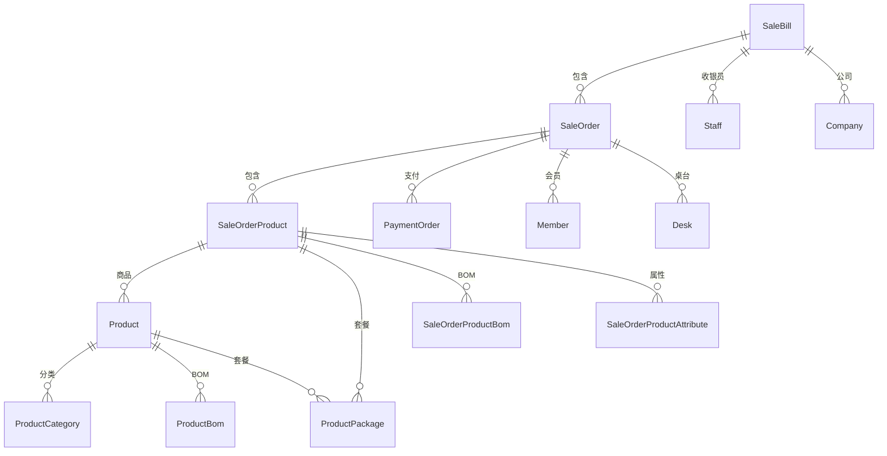
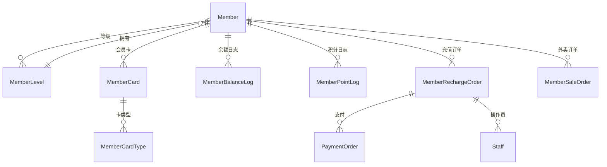
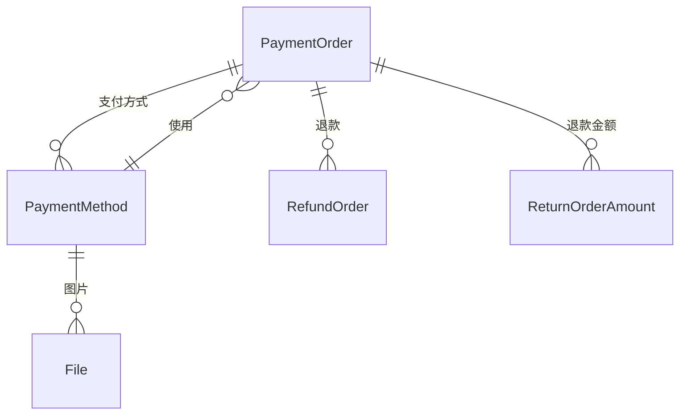
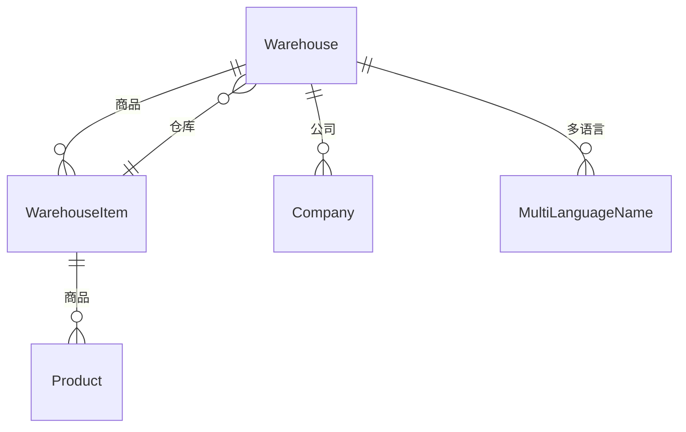
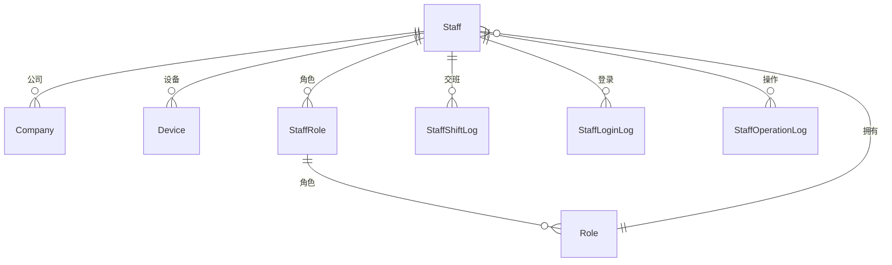
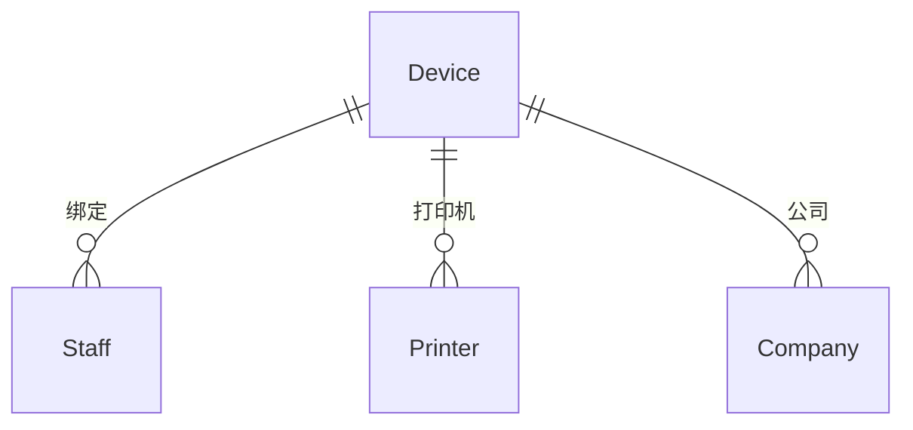
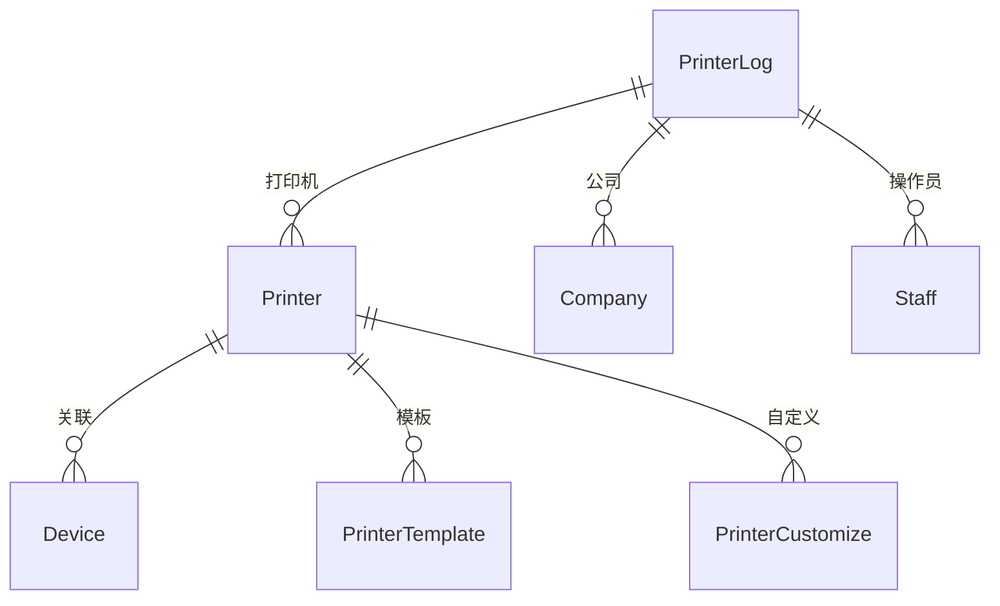
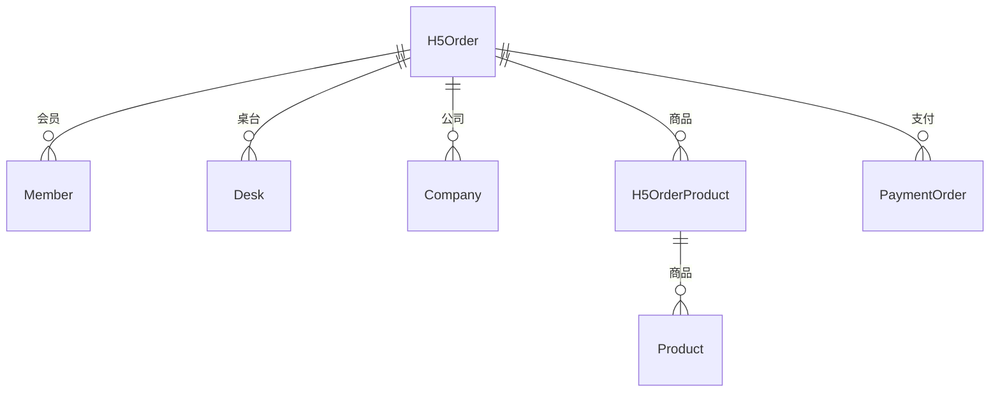
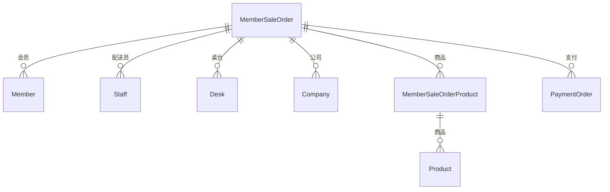

# 实体关联关系图

## 核心实体关系

### 1. 销售流程核心实体

### 2. 会员体系实体

### 3. 支付体系实体

### 4. 仓储物流实体

### 5. 员工权限实体

### 6. 设备管理实体

### 7. 打印系统实体

### 8. H5扫码点餐实体

### 9. 会员外卖实体

## 主要关联关系说明

### 1. 销售流程关系
- **SaleBill** 是销售账单的核心，包含多个 **SaleOrder**
- **SaleOrder** 关联商品、会员、支付、收银员等信息
- **SaleOrderProduct** 记录订单中的具体商品，支持BOM和属性
- 支持套餐、规格、加料等复杂商品结构

### 2. 会员体系关系
- **Member** 是会员核心，关联等级、卡片、余额、积分等
- 支持多级会员等级和会员卡类型
- 完整的充值、消费、退款流程记录
- 积分和余额分离管理，支持冻结机制

### 3. 支付体系关系
- **PaymentOrder** 是支付核心，支持多种支付方式
- **PaymentMethod** 定义支付方式，支持手续费计算
- 完整的退款和反结账流程
- 支持第三方支付和内部支付

### 4. 多租户架构
- **Company** 是多租户核心，大部分实体都关联公司
- 支持总部-分店架构
- 统一的用户权限和设备管理

### 5. 实时通信
- 大部分实体继承 **BaseModel**，支持WebSocket推送
- 订单状态变更实时通知
- 设备状态实时同步

## 数据流向总结

### 销售数据流
1. 开台 → 创建SaleBill
2. 点餐 → 创建SaleOrder和SaleOrderProduct
3. 结账 → 创建PaymentOrder
4. 支付 → 更新订单状态
5. 打印 → 创建PrinterLog

### 会员数据流
1. 注册 → 创建Member
2. 充值 → 创建MemberRechargeOrder和PaymentOrder
3. 消费 → 扣减余额/积分，创建日志
4. 升级 → 更新MemberLevel

### 库存数据流
1. 入库 → 更新WarehouseItem
2. 调拨 → 创建TransferOrder
3. 盘点 → 创建StockReconciliation
4. 出库 → 更新库存数量

这个实体关系图展现了TTPOS系统的完整业务架构，涵盖了销售、会员、支付、仓储、员工、设备等各个模块的关联关系。