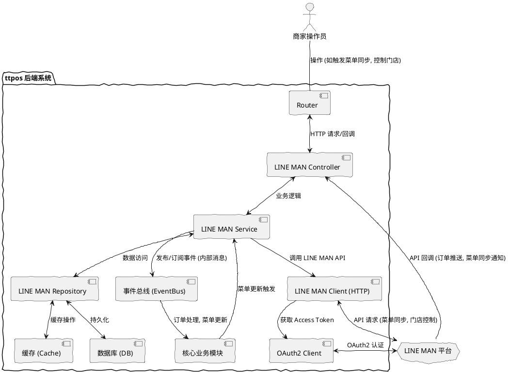

# ttpos 与 LINE MAN 集成系统架构设计文档

## 1. 引言

### 1.1 目的

本文档旨在详细阐述 ttpos 后端系统与 LINE MAN 外部平台进行集成的系统架构设计。它将描述系统的主要组件、它们之间的交互方式、数据流、API 契约以及在实现需求规格说明书 (SRS) 中定义的功能和非功能需求时的设计决策。

### 1.2 范围

本架构设计文档覆盖 ttpos 系统中所有与 LINE MAN 集成相关的组件和接口。这包括认证模块、菜单同步模块、订单处理模块和门店状态控制模块的设计。文档将详细说明 ttpos 如何作为客户端调用 LINE MAN 的 API，以及如何作为服务端暴露 API 供 LINE MAN 回调。

### 1.3 定义、缩略语和缩写

*   **ttpos:** 本地收银系统（Point of Sale）。
*   **LINE MAN:** 泰国领先的按需服务平台。
*   **SRS:** 软件需求规格说明书 (Software Requirements Specification)。
*   **SAD:** 系统架构设计 (System Architecture Design)。
*   **API:** 应用程序编程接口 (Application Programming Interface)。
*   **OAuth 2.0:** 开放授权 2.0。
*   **HTTP/HTTPS:** 超文本传输协议/安全超文本传输协议。
*   **DTO:** 数据传输对象 (Data Transfer Object)。

### 1.4 参考资料

*   `docs/features/ttpos_lineman_srs.md` (ttpos 与 LINE MAN 集成需求规格说明书)
*   `docs/features/ttpos_lineman_user_stories_use_cases.md` (ttpos 与 LINE MAN 集成用户故事/用例文档)
*   `docs/features/ttpos_lineman_use_case_diagrams.md` (ttpos 与 LINE MAN 集成用例图文档)
*   `LINE MAN - Partner Integration Workflow - V2.pdf` (原始需求文档)
*   `TTPOS Go开发规范与最佳实践` (内部开发规范)

### 1.5 概述

本文档分为以下主要部分：
*   **引言：** 文档目的、范围、定义和参考资料。
*   **总体架构：** 描绘 ttpos 与 LINE MAN 集成的宏观视图。
*   **模块设计：** 详细说明 ttpos 内部的集成模块及其职责。
*   **数据流设计：** 解释主要业务场景的数据流转。
*   **API 集成设计：** 客户端与服务端 API 交互的具体设计。
*   **错误处理、安全性、性能与可扩展性：** 非功能性需求在架构层面的实现考量。
*   **部署架构考量和技术栈：** 集成方案的部署和技术选择。

## 2. 总体架构

ttpos 与 LINE MAN 的集成采用客户端-服务端模式，双方通过 HTTPS 协议进行 RESTful API 调用。ttpos 既作为客户端调用 LINE MAN API (如菜单同步、门店控制)，也作为服务端暴露 API 供 LINE MAN 回调 (如订单推送、菜单同步结果通知)。

### 2.1 架构视图



### 2.2 核心交互流

1.  **认证：** ttpos (通过 `OAuth2Client`) 向 LINE MAN 获取 Access Token，用于所有后续 API 调用。
2.  **菜单同步 (ttpos -> LINE MAN)：**
    *   商家操作员在 ttpos 操作，或 ttpos 内部菜单变更，`CoreBusiness` 发布事件。
    *   `LinemanService` 监听事件，通过 `LinemanHttpClient` 调用 LINE MAN 菜单同步 API。
    *   LINE MAN 处理后，可选通过回调通知 ttpos 同步结果 (`LinemanController`)。
3.  **菜单同步 (LINE MAN -> ttpos)：**
    *   LINE MAN 发起“触发菜单同步”回调到 `LinemanController`。
    *   `LinemanService` 处理请求，再次触发 ttpos -> LINE MAN 的菜单同步流程。
4.  **订单推送 (LINE MAN -> ttpos)：**
    *   顾客在 LINE MAN 下单，LINE MAN 回调 `LinemanController` 的订单推送 API。
    *   `LinemanService` 处理订单数据，通过 `LinemanRepo` 写入 DB，并发布内部事件。
    *   `CoreBusiness` 监听事件，完成订单的后续处理 (如通知厨房)。
5.  **门店状态控制 (ttpos -> LINE MAN)：**
    *   商家操作员在 ttpos 控制门店开关。
    *   `LinemanService` 通过 `LinemanHttpClient` 调用 LINE MAN 门店控制 API。

## 3. 模块设计

ttpos 内部将为 LINE MAN 集成创建以下核心模块，遵循 `main/app` 下的 `controller`, `service`, `repository`, `model`, `dto` 结构，并在 `main/pkg` 下提供基础设施支持。

### 3.1 `main/app/controller/lineman/`

*   **职责：** 负责接收 LINE MAN 平台的回调请求，包括新订单推送、订单状态更新、订单编辑更新和触发菜单同步请求。进行请求参数的初步验证，并将请求转发给 `LinemanService` 进行业务处理。
*   **关键接口/方法：**
    *   `PlaceOrderCallback(ctx *gin.Context)`: 接收新订单。
    *   `OrderStatusUpdateCallback(ctx *gin.Context)`: 接收订单状态更新。
    *   `OrderEditUpdateCallback(ctx *gin.Context)`: 接收订单编辑更新。
    *   `TriggerSyncMenuCallback(ctx *gin.Context)`: 接收触发菜单同步请求。
*   **依赖：** `main/app/service/lineman/ILinemanSrv`，`main/app/dto/req/lineman/`。

### 3.2 `main/app/service/lineman/`

*   **职责：** 包含 LINE MAN 集成的核心业务逻辑，协调各层组件完成功能。处理控制器层的请求，调用 `LinemanRepo` 进行数据操作，调用 `main/pkg/lineman_client` 调用 LINE MAN API，并与 `EventBus` 交互。
*   **关键接口/方法：**
    *   `CreateOrder(ctx context.Context, req dto.lineman.PlaceOrderReq)`: 处理 LINE MAN 推送的新订单。
    *   `UpdateOrderStatus(ctx context.Context, req dto.lineman.OrderStatusUpdateReq)`: 处理订单状态更新。
    *   `UpdateOrderDetails(ctx context.Context, req dto.lineman.OrderEditUpdateReq)`: 处理订单编辑更新。
    *   `SyncMenuToLineman(ctx context.Context, fullMenuData dto.lineman.FullMenuReq)`: 推送完整菜单快照到 LINE MAN。
    *   `TriggerLinemanMenuSync(ctx context.Context, triggerReq dto.lineman.TriggerSyncMenuReq)`: 响应 LINE MAN 的触发同步请求，并调用 `SyncMenuToLineman`。
    *   `UpdateMenuItemStatus(ctx context.Context, itemStatusReq dto.lineman.MenuItemStatusUpdateReq)`: 更新单个菜单项状态。
    *   `ControlRestaurantStatus(ctx context.Context, statusReq dto.lineman.RestaurantStatusControlReq)`: 控制门店营业状态。
*   **依赖：** `main/app/repository/lineman/ILinemanRepo`, `main/pkg/lineman_client/ILinemanClient`, `main/pkg/eventbus/IEventBus`, `main/pkg/database/DBManager`, 核心业务 Service (如 `IOrderSrv`, `IMenuSrv`)。

### 3.3 `main/app/repository/lineman/`

*   **职责：** 提供 LINE MAN 相关数据的持久化操作，如存储 LINE MAN 订单、同步日志、LINE MAN 门店配置等。
*   **关键接口/方法：**
    *   `CreateLinemanOrder(ctx context.Context, order model.LinemanOrder) error`
    *   `UpdateLinemanOrderStatus(ctx context.Context, orderID string, status string) error`
    *   `GetLinemanConfig(ctx context.Context, companyID uint64) (model.LinemanConfig, error)`
*   **依赖：** `gorm.DB` 实例。

### 3.4 `main/app/model/lineman/` 和 `main/app/dto/lineman/`

*   **`main/app/model/lineman/`:** 定义数据库中 LINE MAN 相关的实体模型 (如 `LinemanOrder`, `LinemanConfig`, `LinemanMenuSyncLog`)。
*   **`main/app/dto/lineman/`:** 定义 LINE MAN API 请求和响应的数据传输对象 (DTOs)，包括请求参数 (Req) 和响应数据 (Resp)。严格遵循 LINE MAN API 文档的 JSON 结构。

### 3.5 `main/pkg/lineman_client/`

*   **职责：** 作为 ttpos 调用 LINE MAN 外部 API 的客户端封装。处理 HTTP 请求的构建、发送、响应解析、错误重试以及 Access Token 的注入。
*   **关键接口/方法：**
    *   `SyncMenu(ctx context.Context, menuData interface{}) (LinemanAPIResp, error)`
    *   `UpdateMenuItemStatus(ctx context.Context, itemID string, status string) (LinemanAPIResp, error)`
    *   `ForceRestaurantStatus(ctx context.Context, restaurantID string, status string) (LinemanAPIResp, error)`
*   **依赖：** `main/pkg/lineman_auth/ILinemanAuth` (用于获取 Access Token)。

### 3.6 `main/pkg/lineman_auth/`

*   **职责：** 负责管理 LINE MAN API 的 OAuth 2.0 Client Credentials 认证流程。包括获取、刷新和缓存 Access Token。
*   **关键接口/方法：**
    *   `GetAccessToken(ctx context.Context) (string, error)`: 获取当前有效的 Access Token。如果过期则自动刷新。
    *   `RefreshToken(ctx context.Context) (string, error)`: 强制刷新 Access Token。
*   **依赖：** HTTP 客户端，配置参数 (Client ID, Client Secret, Auth URL, Token TTL)。

### 3.7 `main/pkg/eventbus/`

*   **职责：** 提供 ttpos 内部的事件发布/订阅机制。用于解耦集成模块与其他核心业务模块的直接依赖，实现异步通信和触发。
*   **关键事件：**
    *   `EventMenuChanged`: ttpos 菜单发生变更时发布，`LinemanService` 订阅此事件以触发菜单同步。
    *   `EventNewLinemanOrder`: `LinemanService` 成功接收 LINE MAN 新订单后发布，`CoreBusiness` (订单服务) 订阅此事件进行后续处理。

## 4. 交互数据流设计

### 4.1 商家外部唯一标识（External Company ID）

**定义：**
`ExternalCompanyID` 是 TTPOS 系统为每个商家生成的一个全局唯一的字符串标识，用于与外部系统（如 LINE MAN）进行交互。此标识旨在对外部系统透明，不包含任何可推断 TTPOS 内部系统结构或敏感信息的元素，以增强安全性。它与 TTPOS 内部使用的 `companyUuid`（`uint64` 类型）进行安全映射。

**生成和映射：**
在 TTPOS 内部，每个 `companyUuid` 都将对应一个唯一的 `ExternalCompanyID`。`ExternalCompanyID` 可以是一个 UUID v4 字符串或一个安全的加密哈希值，确保其随机性和不可预测性。TTPOS 将在创建商家时自动生成 `ExternalCompanyID`，并将其与 `companyUuid` 一同存储在 `model.Company` 结构体中。

**在TTPOS与LINE MAN交互中的应用：**

为了确保 TTPOS 和 LINE MAN 之间的每次交互都能明确操作的门店，并且保障内部系统安全，双方将约定使用 `ExternalCompanyID` 作为共同的商家标识。

*   **TTPOS -> LINE MAN 的请求：**
    当 TTPOS 向 LINE MAN 发送任何请求（例如，创建/更新菜单、查询订单、通知库存变更等）时，`ExternalCompanyID` 都必须作为请求体中的一个字段 `external_company_id` 进行传递。

    **示例 (TTPOS 创建菜单到 LINE MAN):**
    ```json
    {
      "external_company_id": "a1b2c3d4-e5f6-7890-1234-567890abcdef",
      "menu_items": [
        {
          "item_id": "item_001",
          "name": "招牌炒饭",
          "price": 120.00
        }
      ]
    }
    ```

*   **LINE MAN -> TTPOS 的通知/回调：**
    当 LINE MAN 向 TTPOS 发送任何通知或回调（例如，订单状态变更、取消订单、查询 TTPOS 门店信息等）时，`ExternalCompanyID` 都必须作为请求体中的一个字段 `external_company_id` 进行传递。

    **示例 (LINE MAN 通知 TTPOS 订单状态更新):**
    ```json
    {
      "external_company_id": "a1b2c3d4-e5f6-7890-1234-567890abcdef",
      "order_id": "LM_ORDER_001",
      "status": "DELIVERED",
      "timestamp": "2025-11-13T10:00:00Z"
    }
    ```

### 4.2 安全与验证

双方在接收到包含 `external_company_id` 的请求或通知时，必须进行严格的验证：

1.  **合法性校验：** TTPOS 在接收 `external_company_id` 后，必须将其映射回内部的 `companyUuid`，并验证该 `companyUuid` 是否存在且合法。LINE MAN 也应验证其 `external_company_id` 是否有效。
2.  **权限校验：** 确保请求或通知的发起方拥有操作该 `external_company_id` 对应商家的权限。
3.  **数据一致性：** 在处理业务逻辑时，应始终以内部映射的 `companyUuid` 作为上下文，确保数据操作作用于正确的商家范围。

### 4.3 影响范围

*   **TTPOS后端服务：** 所有与 LINE MAN 交互的控制器（controller）、服务（service）和数据访问层（repository）都需要调整，以在请求和响应中包含 `external_company_id`，并在内部将其转换为 `companyUuid`。
*   **LINE MAN集成模块：** LINE MAN 侧的集成模块需要确保在发送请求和回调时，正确地包含 `external_company_id`，并对接收到的 `external_company_id` 进行处理和验证。
*   **API文档：** 所有相关的 API 文档（如 Swagger/OpenAPI）都需要更新，以反映 `external_company_id` 字段的加入及其预期行为。
*   **数据库变更：** `model.Company` 结构体需要添加 `ExternalCompanyID` 字段，数据库表也需要同步更新。

## 5. API 集成设计

### 5.1 ttpos 作为客户端调用 LINE MAN API

ttpos 将通过 `main/pkg/lineman_client/` 封装的 HTTP 客户端调用以下 LINE MAN API：

*   **认证 API (`/vX/oauth/token`)**
    *   **方法：** `POST`
    *   **请求体：** `client_id`, `client_secret`, `grant_type="client_credentials"` (FORM URL-ENCODED)
    *   **响应体：** `access_token`, `token_type`, `expires_in`
    *   **调用者：** `main/pkg/lineman_auth/`
*   **菜单同步 API (`/vX/menus/sync`)**
    *   **方法：** `POST`
    *   **请求头：** `Authorization: Bearer <AccessToken>`
    *   **请求体：** 完整的菜单数据 JSON (参见 LINE MAN 文档定义)
    *   **调用者：** `main/app/service/lineman/LinemanService`
*   **更新菜单项状态 API (`/vX/menus/items/{item_id}/status`) (可选)**
    *   **方法：** `PUT`
    *   **请求头：** `Authorization: Bearer <AccessToken>`
    *   **请求体：** `status` (AVAILABLE, SOLD_OUT_TODAY, SUSPENDED)
    *   **调用者：** `main/app/service/lineman/LinemanService`
*   **更新菜单选项状态 API (`/vX/menus/property_values/{property_value_id}/status`) (可选)**
    *   **方法：** `PUT`
    *   **请求头：** `Authorization: Bearer <AccessToken>`
    *   **请求体：** `status` (AVAILABLE, SOLD_OUT_TODAY, SUSPENDED)
    *   **调用者：** `main/app/service/lineman/LinemanService`
*   **强制开店/关店 API (`/vX/restaurants/{restaurant_id}/status`) (可选)**
    *   **方法：** `PUT`
    *   **请求头：** `Authorization: Bearer <AccessToken>`
    *   **请求体：** `status` (OPEN, CLOSE)
    *   **调用者：** `main/app/service/lineman/LinemanService`

### 5.2 ttpos 作为服务端暴露给 LINE MAN 回调 API

ttpos 将通过 `main/app/controller/lineman/` 暴露以下 API 供 LINE MAN 回调：

*   **下单通知 API (`/api/v1/lineman/order/place`)**
    *   **方法：** `POST`
    *   **请求头：** LINE MAN 可能要求特定的签名验证头。
    *   **请求体：** 新订单详情 JSON (参见 LINE MAN 文档定义)
    *   **响应体：** JSON 格式的成功/失败信息 (`{"code": 1, "message": "success"}`)
    *   **调用者：** LINE MAN 平台
*   **订单状态更新通知 API (`/api/v1/lineman/order/status_update`) (可选)**
    *   **方法：** `POST`
    *   **请求头：** LINE MAN 可能要求特定的签名验证头。
    *   **请求体：** 订单 ID, 状态 JSON (参见 LINE MAN 文档定义)
    *   **响应体：** JSON 格式的成功/失败信息
    *   **调用者：** LINE MAN 平台
*   **订单编辑更新通知 API (`/api/v1/lineman/order/update`) (可选)**
    *   **方法：** `POST`
    *   **请求头：** LINE MAN 可能要求特定的签名验证头。
    *   **请求体：** 订单编辑后详情 JSON (参见 LINE MAN 文档定义)
    *   **响应体：** JSON 格式的成功/失败信息
    *   **调用者：** LINE MAN 平台
*   **触发菜单同步 API (`/api/v1/lineman/menu/trigger_sync`)**
    *   **方法：** `POST`
    *   **请求头：** LINE MAN 可能要求特定的签名验证头。
    *   **请求体：** 触发请求 JSON (可能包含门店ID)
    *   **响应体：** JSON 格式的成功/失败信息
    *   **调用者：** LINE MAN 平台
*   **菜单同步结果通知 API (`/api/v1/lineman/menu/sync_notification`) (可选)**
    *   **方法：** `POST`
    *   **请求头：** LINE MAN 可能要求特定的签名验证头。
    *   **请求体：** 同步结果 JSON (成功/失败, 错误信息)
    *   **响应体：** JSON 格式的成功/失败信息
    *   **调用者：** LINE MAN 平台

## 6. 错误处理机制

*   **统一错误响应：** ttpos 作为服务端暴露的 API 应遵循统一的 API 响应规范，包括 `code`, `message`, `data` 字段，以清晰地向 LINE MAN 报告处理结果。
*   **日志记录：** 所有 API 调用（请求和响应）、内部处理异常、数据验证失败都将记录详细日志。日志应包含请求上下文 (如 `trace_id`, `request_id`, 门店ID)，方便追踪和排查。
*   **重试机制：** ttpos 作为客户端调用 LINE MAN API 时，对于幂等的请求和可恢复的错误 (如网络瞬时故障、5xx 错误)，应实施指数退避的重试策略。
*   **熔断/限流：** 对于连续失败的 LINE MAN API 调用，考虑引入熔断机制，避免对 LINE MAN 平台造成过大压力，并保护自身系统。
*   **告警通知：** 当发生严重错误（如认证失败、核心功能 API 连续失败）时，通过内部告警系统通知相关运维人员。
*   **数据幂等性：** ttpos 接收 LINE MAN 回调时，应确保对相同订单或菜单同步请求的重复处理是幂等的，避免数据重复或不一致。

## 7. 安全性设计

*   **OAuth 2.0 Client Credentials：** 严格按照 LINE MAN 的 OAuth 2.0 Client Credentials 规范进行认证。Client ID 和 Client Secret 必须作为敏感配置，安全存储（例如，通过环境变量或安全的配置管理服务），不得硬编码。Access Token 应在内存中缓存，并确保及时刷新。
*   **HTTPS 通信：** 所有 ttpos 与 LINE MAN 之间的 API 交互必须强制使用 HTTPS 协议，确保数据在传输过程中的加密和完整性。
*   **IP 白名单：** 如果 LINE MAN 强制要求 IP 白名单，ttpos 部署的服务器 IP 必须添加到 LINE MAN 的白名单中。同时，ttpos 自身暴露的回调 API 也应考虑设置 IP 白名单，限制只有来自 LINE MAN 的请求才能访问。
*   **签名验证：** LINE MAN 回调 ttpos 的 API 请求，通常会包含签名验证机制。ttpos 必须实现对这些签名的验证，以确保请求的真实性和完整性，防止伪造请求。
*   **输入验证：** 对所有接收到的 LINE MAN API 请求参数进行严格的输入验证和消毒，防止注入攻击和非法数据。
*   **日志安全：** 日志中不得包含敏感信息（如 Client Secret, Access Token, 个人身份信息），或对敏感信息进行脱敏处理。

## 8. 性能与可扩展性设计

*   **异步处理：** 对于 LINE MAN 推送的新订单，ttpos 在接收并持久化基本信息后，可以迅速返回响应给 LINE MAN，而后续复杂的业务逻辑（如库存扣减、厨房通知）可以通过内部事件总线 (`EventBus`) 异步处理，避免阻塞 API 响应。
*   **缓存策略：** Access Token 等短期有效的凭证应进行缓存，减少不必要的认证请求。
*   **数据库优化：** 针对 LINE MAN 订单的快速写入和查询，数据库表设计应考虑索引优化，特别是订单 ID、状态等常用查询字段。
*   **并发处理：** Go 语言的并发特性将用于处理高并发的 API 请求。`gin` 框架能有效处理 HTTP 请求，`Goroutines` 和 `Channels` 可用于实现内部异步任务和并发控制。
*   **水平扩展：** ttpos 后端服务应设计为无状态，可以通过增加 Pod/实例数量在 Kubernetes 或其他容器编排平台中进行水平扩展，以应对不断增长的业务量和请求负载。
*   **消息队列：** `EventBus` 的引入，有助于将不同业务逻辑解耦，使其能够独立扩展和处理，提高系统的整体吞吐量和弹性。

## 9. 部署架构考量

*   **容器化：** ttpos 后端服务将打包为 Docker 镜像，方便在容器化环境中部署（如 Kubernetes）。
*   **配置管理：** 敏感配置（如 Client ID/Secret）将通过 Kubernetes Secrets 或其他安全的配置管理方案进行管理，非敏感配置通过 ConfigMaps 或环境变量。
*   **网络配置：** 部署时需确保 ttpos 部署环境能够访问 LINE MAN 的 API 端点，并且 LINE MAN 平台能够访问 ttpos 暴露的回调 API。需要正确配置防火墙规则和网络路由。
*   **负载均衡：** ttpos 回调 API 应部署在负载均衡器之后，确保高可用和请求分发。

## 10. 技术栈与规范

*   **编程语言：** Go
*   **Web 框架：** Gin
*   **ORM：** GORM
*   **数据库：** MySQL (通过 `main/pkg/database/DBManager` 访问)
*   **缓存：** Redis (通过 `main/pkg/cache/` 访问)
*   **消息队列/事件总线：** ttpos 内部 `main/pkg/eventbus/` (可能基于 Go Channel 或轻量级消息队列实现)
*   **HTTP 客户端：** Go 标准库 `net/http` 或第三方库 (如 `resty`)，封装在 `main/pkg/lineman_client/` 中。
*   **开发规范：** 严格遵循 `TTPOS Go开发规范与最佳实践` 中定义的目录结构、命名规范、错误处理、服务层设计模式等。
