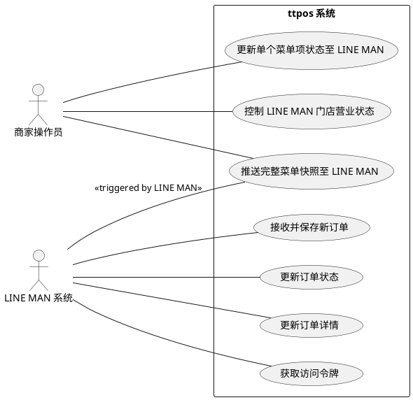
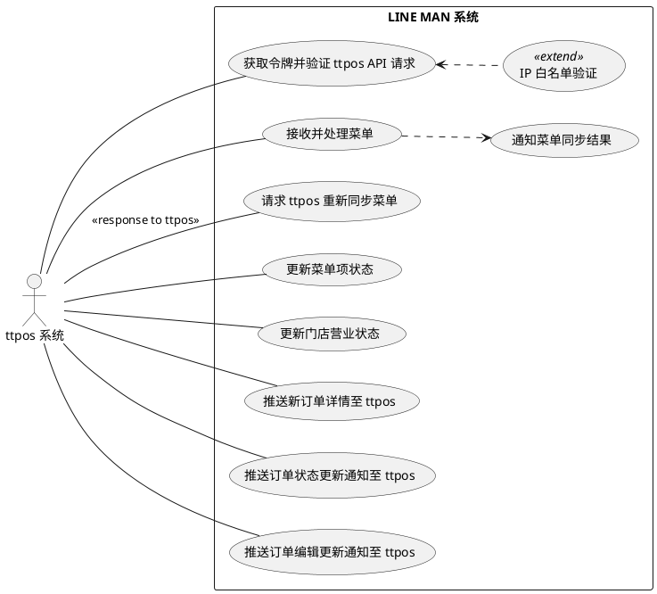

# ttpos 与 LINE MAN 集成用例图

本文档提供了 ttpos 系统与 LINE MAN 平台集成用例的 PlantUML 图示。图示从 ttpos 系统视角和 LINE MAN 系统视角展示了主要参与者、用例及其关系。
在线渲染UML网站:https://www.planttext.com

## 1. ttpos 系统视角用例图 (ttpos System Perspective Use Case Diagram)

此图重点展示 `ttpos 系统` 作为中心，它所执行或直接参与的用例，以及与 `商家操作员` 和 `LINE MAN 系统` 的交互。

## 2. LINE MAN 系统视角用例图 (LINE MAN System Perspective Use Case Diagram)

此图重点展示 `LINE MAN 系统` 作为中心，它所执行或直接参与的用例，以及与 `ttpos 系统` 的交互。

