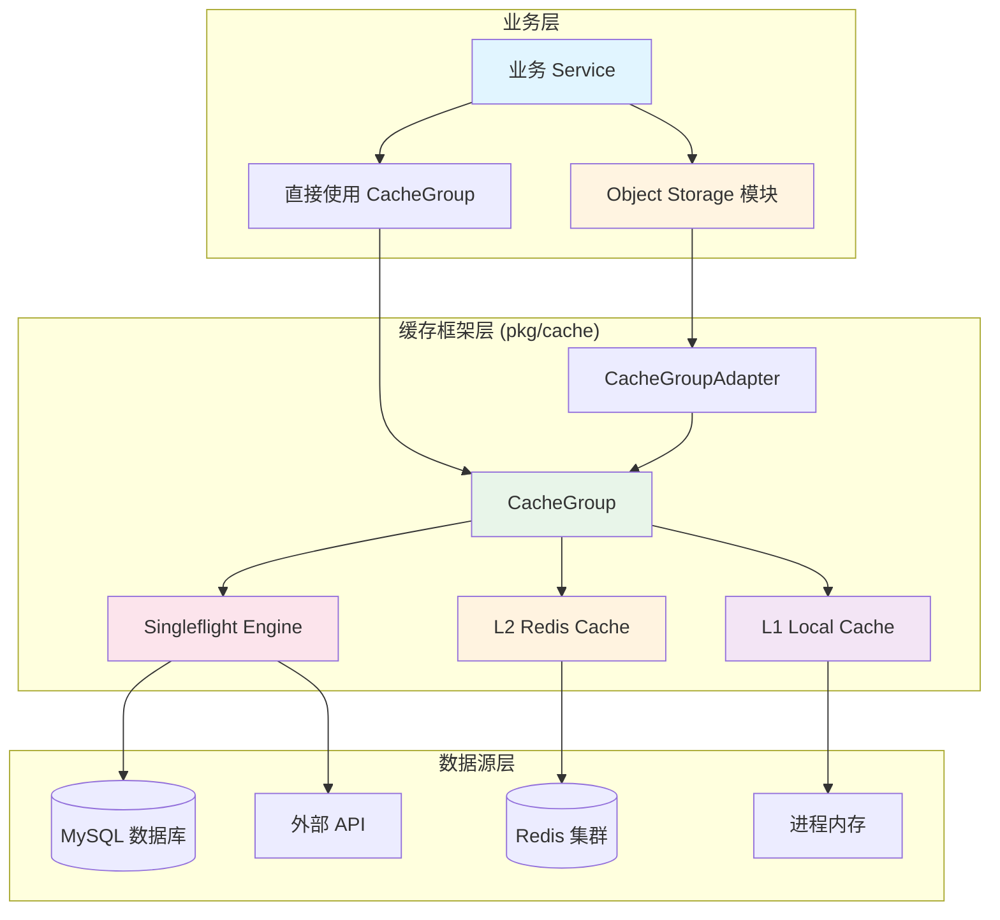
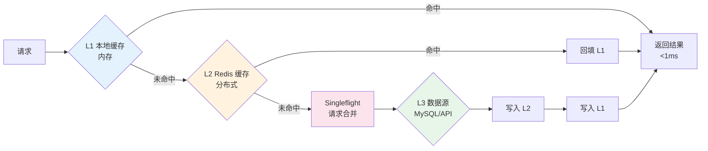
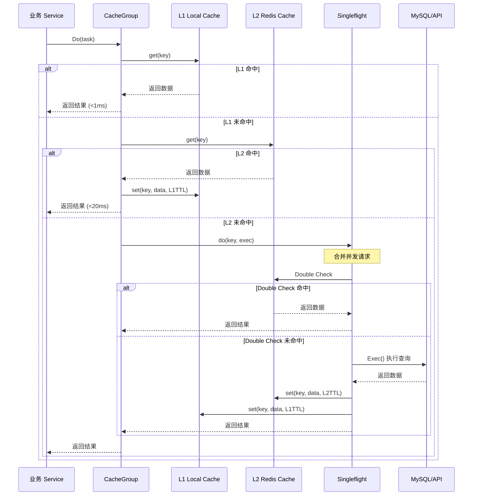
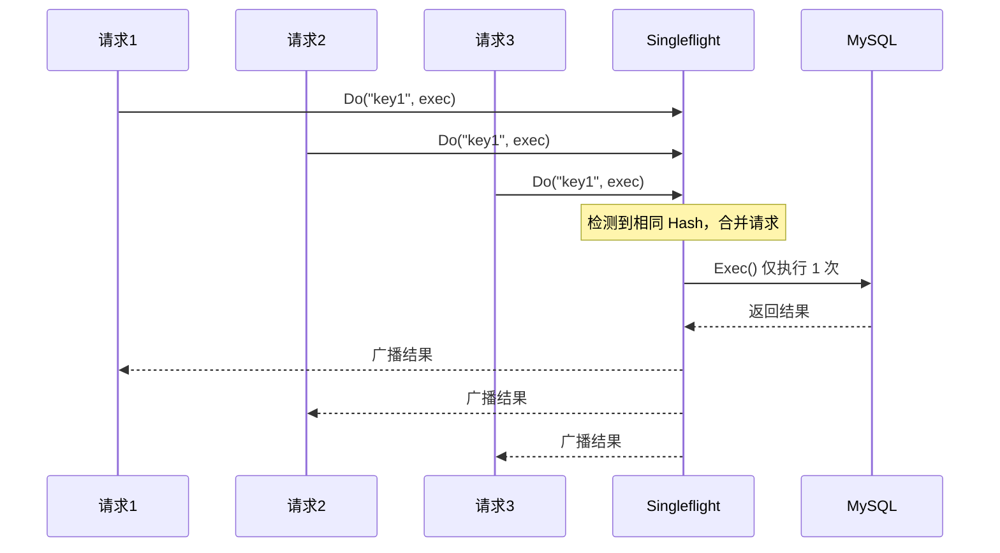
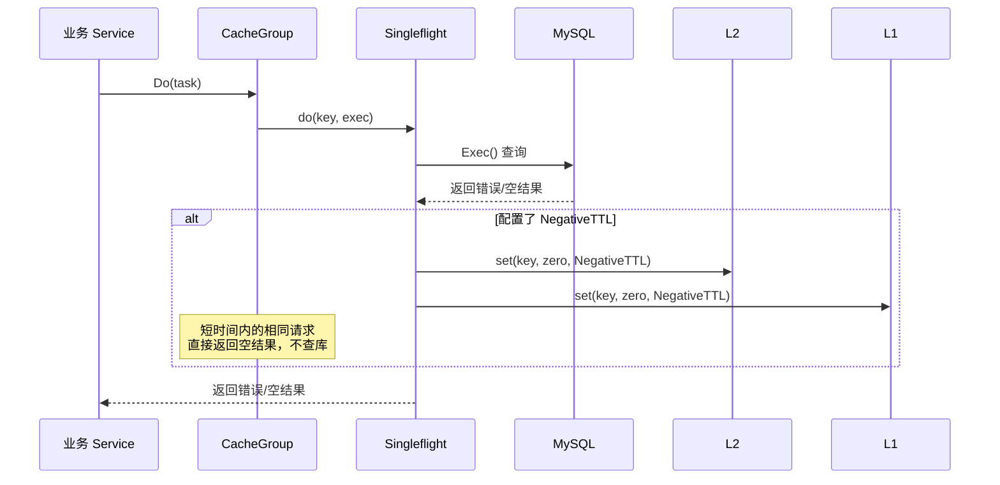

# TTPOS 缓存架构设计文档

> 本文档详细说明 TTPOS 系统的整体缓存架构方案，包括多级缓存策略、请求合并机制和对象存储层的缓存实现。

---

## 📋 目录

- [架构概览](#架构概览)
- [核心组件](#核心组件)
- [缓存流程](#缓存流程)
- [技术实现](#技术实现)
- [优点分析](#优点分析)
- [缺点分析](#缺点分析)
- [最佳实践](#最佳实践)

---

## 🏗️ 架构概览

### 整体架构图



### 三级缓存架构



---

## 🔧 核心组件

### 1. CacheGroup（缓存组）

**位置**: `main/pkg/cache/group.go`

**职责**:
- 协调 L1/L2 缓存的查询和写入
- 集成 Singleflight 请求合并
- 实现 Read-Through 模式
- 处理负缓存（防穿透）

**核心接口**:
```go
type ICacheGroup[T any] interface {
    Do(ctx context.Context, task Task[T]) (T, error)
    ClearL1()
}
```

### 2. Singleflight Engine（请求合并引擎）

**位置**: `main/pkg/cache/engine.go`

**职责**:
- 合并相同 Key 的并发请求
- 确保同一时间只有一个请求执行实际业务逻辑
- 将结果广播给所有等待的请求

**工作原理**:
```go
// 100 个并发请求同一个 Key
// 仅执行 1 次 Exec()
// 100 个请求共享同一个结果
```

### 3. L1 Local Cache（本地缓存）

**位置**: `main/pkg/cache/local.go`

**特点**:
- 基于 `github.com/patrickmn/go-cache`
- 进程内内存缓存
- 访问速度最快（<1ms）
- 不支持跨进程共享

**配置**:
```go
EnableLocalCache: true
L1TTL: 1 * time.Minute  // 阶梯式 TTL，通常为任务 TTL 的 1/3-1/2
```

### 4. L2 Redis Cache（分布式缓存）

**位置**: `main/pkg/cache/redis.go`

**特点**:
- 基于 Redis 集群
- 跨进程共享
- 支持分布式部署
- 访问速度较快（<20ms）

**配置**:
```go
EnableRedisCache: true
L2TTL: 5 * time.Minute  // 阶梯式 TTL，通常为任务 TTL 的 1.5-2 倍
```

### 5. Object Storage 模块

**位置**: `main/app/modules/objectstorage/`

**职责**:
- 提供统一的对象存储接口
- 封装三级缓存逻辑
- 支持自动关联注入（类似 GORM Preload）
- 支持批量操作和缓存失效

**Key 格式**:
```
ttpos4:{company_uuid}:{object_type}:{object_uuid}
```

**示例**:
- `ttpos4:1724054084:product_package:123456`
- `ttpos4:1724054084:desk:789012`
- `ttpos4:1724054084:sale_bill_setting:345678`

---

## 🔄 缓存流程

### 完整查询流程



### Singleflight 请求合并流程



### 负缓存（防穿透）流程



---

## 💻 技术实现

### 1. 阶梯式 TTL 策略

**设计理念**:
- L1 使用较短 TTL，减少内存占用
- L2 使用较长 TTL，保持缓存命中率
- L1 过期后可从 L2 回填，避免直接查数据库

**配置示例**:
```go
groupConfig := cache.GroupConfig{
    Name:             "product-package",
    EnableLocalCache: true,
    EnableRedisCache: true,
    L1TTL:            1 * time.Minute,   // L1 缓存 1 分钟
    L2TTL:            5 * time.Minute,    // L2 缓存 5 分钟
    NegativeTTL:       30 * time.Second,  // 负缓存 30 秒
}
```

**优势**:
- 减少内存占用（L1 数据量小）
- 提高缓存命中率（L2 数据保留时间长）
- 降低数据库压力（L1 过期后从 L2 回填）

### 2. Double Check 机制

**问题场景**:
在等待 Singleflight 锁的过程中，前面的请求可能已经填充了缓存。

**解决方案**:
```go
// 进入 Singleflight 后再次检查缓存
if val, ok := g.l2.get(ctx, key); ok {
    return val, nil  // 直接返回，不执行 Exec()
}
```

**效果**:
- 避免重复执行 Exec()
- 减少不必要的数据库查询
- 提高系统性能

### 3. 单例模式管理 CacheGroup

**位置**: `main/app/modules/objectstorage/infrastructure/adapter/cache_group_adapter.go`

**实现**:
```go
var cacheGroupSingletons sync.Map  // map[string]cache.ICacheGroup[T]

func GetOrCreateCacheLayer[T any](...) repository.CacheLayer[T] {
    // 使用类型名称作为 key，确保相同类型的 CacheGroup 是单例
    key := reflect.TypeOf((*T)(nil)).Elem().String()
    
    // 从单例池获取或创建
    if cached, ok := cacheGroupSingletons.Load(key); ok {
        return cached.(cache.ICacheGroup[T])
    }
    // 创建新的 CacheGroup...
}
```

**优势**:
- L1 缓存可以跨请求共享
- 减少内存占用（相同类型共享一个 CacheGroup）
- 支持全局 L1 缓存清理

### 4. 泛型实现

**类型安全**:
```go
// 为不同对象类型创建独立的缓存适配器
cacheAdapter := adapter.GetOrCreateCacheLayer[model.SaleBill](
    groupConfig,
    cache.Global,
    5*time.Minute,
)

// 编译时类型检查，避免运行时错误
saleBill, err := cacheAdapter.GET(key, func() (model.SaleBill, error) {
    return repo.GetSaleBill(...)
})
```

---

## ✅ 优点分析

### 1. 性能优势

#### 响应时间优化
- **L1 命中**: <1ms（内存访问）
- **L2 命中**: <20ms（Redis 网络访问）
- **数据库查询**: 50-200ms（取决于查询复杂度）

**性能提升**:
- L1 命中率 80%+ → 平均响应时间降低 90%+
- L2 命中率 95%+ → 数据库查询减少 95%+

#### 并发处理能力
- **Singleflight 合并**: 100 个并发请求仅执行 1 次查询
- **减少数据库压力**: 高峰期数据库查询量减少 99%+
- **提高系统吞吐量**: 单机 QPS 提升 10-50 倍

### 2. 架构优势

#### 多级缓存策略
- **L1 本地缓存**: 最快访问速度，适合热点数据
- **L2 分布式缓存**: 跨进程共享，适合分布式部署
- **L3 数据库**: 数据持久化，最可靠的数据源

#### 请求合并机制
- **防止缓存击穿**: Singleflight 确保同一时间只有一个请求查库
- **减少重复计算**: 复杂计算逻辑仅执行一次
- **保护下游资源**: MySQL 和外部 API 免受高并发冲击

#### 防穿透保护
- **负缓存机制**: 缓存空结果，防止恶意查询
- **TTL 配置**: 短时间内的空查询直接返回，不查库

### 3. 可维护性优势

#### 统一接口
- **CacheGroup.Do()**: 统一的缓存访问入口
- **类型安全**: 泛型实现，编译时类型检查
- **配置灵活**: 支持按业务配置不同的 TTL

#### 代码复用
- **基础设施组件**: `pkg/cache` 可被所有业务模块复用
- **Object Storage 模块**: 封装通用对象存储逻辑
- **减少重复代码**: 避免每个业务模块重复实现缓存逻辑

### 4. 扩展性优势

#### 水平扩展
- **Redis 集群**: 支持 Redis 集群模式，可水平扩展
- **多实例部署**: L2 缓存支持多实例共享
- **负载均衡**: 缓存层可独立扩展，不影响业务层

#### 功能扩展
- **缓存预热**: 支持 Warmup 接口，提前加载热点数据
- **批量操作**: 支持批量获取和更新
- **缓存失效**: 支持按公司、按类型批量失效

---

## ❌ 缺点分析

### 1. 数据一致性风险

#### 问题描述
- **L1 缓存不一致**: 多实例部署时，L1 缓存无法跨进程同步
- **L2 缓存延迟**: Redis 主从复制存在延迟（通常 <1s）
- **TTL 过期时间**: 缓存过期时间不精确，可能存在数据延迟

#### 影响场景
- **数据更新后**: L1/L2 缓存可能仍保留旧数据
- **多实例部署**: 实例 A 更新数据，实例 B 的 L1 缓存未失效
- **缓存穿透**: 缓存失效瞬间，大量请求穿透到数据库

#### 缓解措施
- **主动失效**: 数据更新时主动清除相关缓存
- **缩短 TTL**: 对实时性要求高的数据使用较短 TTL
- **版本号机制**: 使用版本号判断缓存是否过期

### 2. 内存占用问题

#### 问题描述
- **L1 缓存占用**: 每个进程的 L1 缓存占用内存
- **热点数据膨胀**: 热点数据可能占用大量内存
- **内存泄漏风险**: 如果 TTL 配置不当，可能导致内存泄漏

#### 影响场景
- **高并发场景**: 大量请求导致 L1 缓存数据量激增
- **长时间运行**: 内存占用持续增长，可能导致 OOM
- **多实例部署**: 每个实例都占用内存，总内存占用 = 单实例 × 实例数

#### 缓解措施
- **阶梯式 TTL**: L1 使用较短 TTL，减少内存占用
- **LRU 淘汰**: 使用 LRU 算法淘汰不常用的数据
- **内存限制**: 设置 L1 缓存的最大内存限制

### 3. 复杂度增加

#### 问题描述
- **调试困难**: 多级缓存导致问题定位困难
- **配置复杂**: 需要为不同业务配置不同的 TTL
- **学习成本**: 新成员需要理解多级缓存的工作原理

#### 影响场景
- **问题排查**: 缓存命中/未命中日志分散，难以追踪
- **性能调优**: 需要根据业务特点调整 TTL 配置
- **代码维护**: 缓存逻辑与业务逻辑耦合，增加维护成本

#### 缓解措施
- **详细日志**: 记录缓存命中/未命中的详细日志
- **监控埋点**: 添加缓存命中率、响应时间等监控指标
- **文档完善**: 提供详细的使用文档和最佳实践

### 4. 单点故障风险

#### 问题描述
- **Redis 故障**: L2 缓存依赖 Redis，Redis 故障会导致缓存失效
- **网络问题**: Redis 网络抖动可能导致缓存访问失败
- **数据丢失**: Redis 重启可能导致缓存数据丢失

#### 影响场景
- **Redis 宕机**: 所有请求穿透到数据库，数据库压力激增
- **网络延迟**: Redis 网络延迟导致响应时间增加
- **缓存雪崩**: 大量缓存同时失效，导致数据库压力激增

#### 缓解措施
- **Redis 集群**: 使用 Redis 集群模式，提高可用性
- **降级策略**: Redis 故障时降级到直接查数据库
- **缓存预热**: 系统启动时预热热点数据
- **过期时间随机化**: 避免大量缓存同时失效

### 5. 缓存穿透风险

#### 问题描述
- **恶意查询**: 攻击者查询不存在的数据，导致缓存未命中
- **负缓存配置**: 如果未配置 NegativeTTL，可能导致缓存穿透
- **空结果处理**: 空结果未正确缓存，导致重复查询数据库

#### 影响场景
- **恶意攻击**: 大量查询不存在的数据，导致数据库压力激增
- **业务异常**: 业务逻辑返回空结果但未缓存，导致重复查询

#### 缓解措施
- **负缓存机制**: 配置 NegativeTTL，缓存空结果
- **参数验证**: 在业务层验证参数，过滤无效查询
- **限流机制**: 对频繁查询的 Key 进行限流

---

## 📚 最佳实践

### 1. TTL 配置建议

| 数据类型 | L1 TTL | L2 TTL | 说明 |
|---------|--------|--------|------|
| 配置类数据 | 5 分钟 | 30 分钟 | 变更频率低，可设置较长 TTL |
| 基础数据 | 1 分钟 | 5 分钟 | 变更频率中等 |
| 业务数据 | 30 秒 | 2 分钟 | 变更频率较高 |
| 实时数据 | 10 秒 | 30 秒 | 实时性要求高 |

### 2. Key 设计规范

**格式**: `{prefix}:{company_uuid}:{object_type}:{object_uuid}`

**示例**:
```
ttpos4:1724054084:product_package:123456
ttpos4:1724054084:desk:789012
```

**原则**:
- 使用有意义的命名空间
- 包含公司 UUID，支持多租户
- 包含对象类型，便于批量失效
- 避免 Key 冲突

### 3. 缓存失效策略

**主动失效**:
```go
// 数据更新时主动清除缓存
objectStorage.Invalidate(ctx, key)

// 批量失效
objectStorage.InvalidateByCompany(ctx, companyUuid)
objectStorage.InvalidateByCompanyAndType(ctx, companyUuid, "ProductPackage")
```

**被动失效**:
- 依赖 TTL 自动过期
- 适用于数据更新频率低的场景

### 4. 监控指标

**关键指标**:
- **缓存命中率**: L1 命中率、L2 命中率
- **响应时间**: L1 命中时间、L2 命中时间、数据库查询时间
- **请求合并率**: Singleflight 合并的请求数
- **缓存大小**: L1 缓存大小、L2 缓存大小

**告警阈值**:
- L1 命中率 < 70%: 警告
- L2 命中率 < 90%: 警告
- 数据库查询 QPS > 1000: 警告
- Redis 响应时间 > 50ms: 警告

---

## 📖 相关文档

- [高并发缓存框架需求文档](../../shared/specs/active/task-main-high-concurrency-cache-framework/requirements.md)
- [高并发缓存框架设计文档](../../shared/specs/active/task-main-high-concurrency-cache-framework/design.md)
- [对象存储模块 README](../../../main/app/modules/objectstorage/README.md)
- [对象存储层设计文档](../../shared/specs/active/story-main-object-storage-layer/design.md)
- [Redis 配置文档](../../../ttpos-bmp/docs/human/architecture/modules/websocket/features/redis-configuration.md)

---

**版本**: v1.0.0  
**创建日期**: 2025-12-29  
**维护者**: TTPOS Team  
**最后更新**: 2025-12-29

