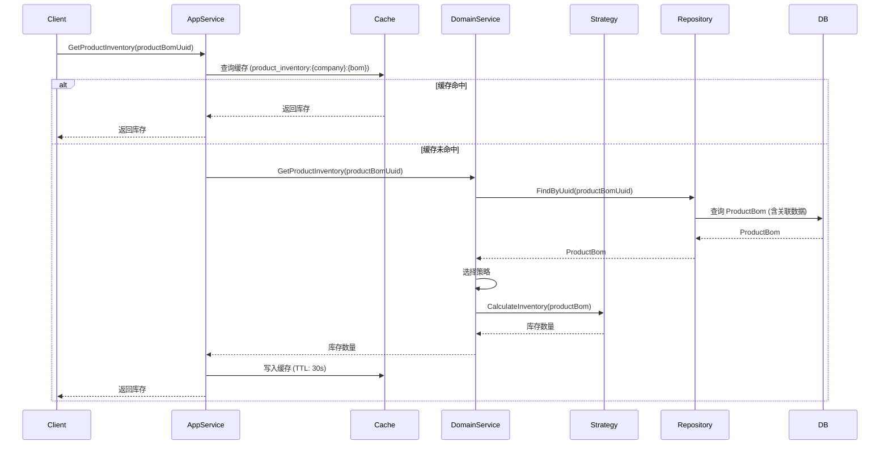

# TTPOS 库存管理流程详解

> **文档版本**: 1.0
> **生成时间**: 2026-01-18
> **适用范围**: TTPOS 主服务 (main/) + ERPNext 集成

---

## 目录

1. [整体架构](#整体架构)
2. [核心概念与数据模型](#核心概念与数据模型)
3. [库存计算策略](#库存计算策略)
4. [库存查询流程](#库存查询流程)
5. [订单库存流转](#订单库存流转)
6. [盘点流程](#盘点流程)
7. [ERPNext 集成](#erpnext-集成)
8. [关键代码路径](#关键代码路径)

---

## 整体架构

TTPOS 的库存管理采用 **DDD (领域驱动设计)** 架构，分为以下几层：

```
┌─────────────────────────────────────────────────────────┐
│                   应用服务层 (Application)                │
│   ProductInventoryAppService - 带缓存的库存查询服务       │
│   - 缓存管理 (Redis)                                       │
│   - 批量查询优化                                           │
│   - 库存检查 (CheckStock)                                 │
└─────────────────────────────────────────────────────────┘
                            ↓
┌─────────────────────────────────────────────────────────┐
│                   领域服务层 (Domain Service)              │
│   ProductInventoryDomainService - 核心库存计算逻辑        │
│   - 策略模式选择                                           │
│   - 库存计算协调                                           │
└─────────────────────────────────────────────────────────┘
                            ↓
┌─────────────────────────────────────────────────────────┐
│                   库存计算策略 (Strategy Pattern)          │
│   ┌─────────────────┬─────────────────┬───────────────┐ │
│   │ BomCard         │ FlavorMaterials │ NonBomCard    │ │
│   │ (有成本卡商品)   │ (规格关联材料)   │ (无成本卡)     │ │
│   ├─────────────────┼─────────────────┼───────────────┤ │
│   │ SauceBomCard    │ SauceMaterials  │ SauceNonBom   │ │
│   │ (小料有成本卡)   │ (小料关联材料)   │ (小料无成本卡) │ │
│   └─────────────────┴─────────────────┴───────────────┘ │
└─────────────────────────────────────────────────────────┘
                            ↓
┌─────────────────────────────────────────────────────────┐
│                   数据访问层 (Repository)                  │
│   - ProductBomRepository                                  │
│   - ProductPackageRepository                              │
│   - WarehouseItemRepository                               │
└─────────────────────────────────────────────────────────┘
                            ↓
┌─────────────────────────────────────────────────────────┐
│                   数据模型 (Model)                         │
│   - ProductBom (商品规格/小料)                             │
│   - ProductPackage (商品包)                               │
│   - Material (原料)                                        │
│   - WarehouseItem (仓库库存)                              │
│   - ProductBomCard (成本卡)                               │
└─────────────────────────────────────────────────────────┘
```

### 📍 关键特性

- **策略模式**: 根据商品类型自动选择库存计算策略
- **缓存机制**: Redis 缓存库存数据（30秒 TTL）
- **批量查询**: 支持批量获取商品/商品包库存
- **事务保证**: 库存变更使用数据库事务
- **分布式锁**: 防止并发扣减/增加库存

---

## 核心概念与数据模型

### 1. 商品结构

```
ProductPackage (商品包)
    └─ ProductBom (商品规格/小料)
        ├─ ProductBomCard (成本卡) - 可选
        │   └─ RelatedMaterial[] (关联材料)
        │       └─ Material (原料)
        │           └─ WarehouseItem[] (仓库库存)
        └─ FlavorMaterials[] (规格关联材料) - 可选
            └─ Material (原料)
                └─ WarehouseItem[] (仓库库存)
```

### 2. 核心数据模型

#### Material (原料表 `ttpos_material`)

```go
type Material struct {
    Uuid                uint64   // 原料UUID
    Name                string   // 原料名称
    Code                string   // 原料编码
    StockNum            float64  // 库存数量 (字段存在但不使用，实际库存在 WarehouseItem)
    SafetyStock         *float64 // 安全库存
    AllowNegativeStock  int      // 是否允许负库存 (1-允许, 0-不允许)
    WarehouseUuid       uint64   // 默认仓库UUID

    // 关联关系
    WarehouseItems      []*WarehouseItem  // 仓库库存明细
}
```

**🔑 关键逻辑**:
- `GetStockNum(opts)`: 获取原料在默认仓库的库存
  - 如果 `AllowNegativeStock == 1`，返回无限库存 (`99999999`)
  - 否则从 `WarehouseItems` 中查找默认仓库的库存

#### WarehouseItem (仓库物品表 `ttpos_warehouse_item`)

```go
type WarehouseItem struct {
    Uuid          uint64  // UUID
    WarehouseUuid uint64  // 仓库UUID
    MaterialUuid  uint64  // 物品UUID
    Stock         float64 // 库存数量 (实际库存存储位置)
    ReservedStock float64 // 预留库存
    Valuation     float64 // 估值单价
}
```

**🔑 关键字段**:
- `Stock`: **实际库存存储位置**，TTPOS 内部库存以此为准
- `ReservedStock`: 预留库存（暂未使用）

#### ProductBom (商品规格/小料表 `ttpos_product_bom`)

```go
type ProductBom struct {
    Uuid                uint64  // UUID
    ProductPackageUuid  uint64  // 所属商品包UUID
    StockNum            float64 // 可售量
    IsOpenStock         int     // 是否开启可售量 (1-开启, 0-关闭)
    IsSoldOut           int     // 是否售罄 (1-售罄, 0-正常)
    UseBomCardStock     int     // 是否使用成本卡控制库存 (1-是, 0-否)

    // 关联关系
    ProductBomCard      *ProductBomCard       // 成本卡
    FlavorMaterials     []*RelatedMaterial    // 规格关联材料
    ProductSauce        *ProductSauce         // 小料信息
}
```

**🔑 关键方法**:
- `HasProductBomCard()`: 是否有成本卡
- `IsFlavor()`: 是否为商品规格
- `IsSauce()`: 是否为小料
- `IsOpenStockBool()`: 是否开启可售量

#### ProductBomCard (成本卡表 `ttpos_product_bom_card`)

```go
type ProductBomCard struct {
    Uuid              uint64  // UUID
    ProductBomUuid    uint64  // 商品规格UUID

    // 关联关系
    RelatedMaterials  []*RelatedMaterial  // 关联材料列表
}
```

**🔑 关键方法**:
- `CalculateExpectedProductionNum(opts)`: 计算预计生产数量
  - 遍历 `RelatedMaterials`，计算每个材料能生产的数量
  - 返回**最小值**（木桶原理）
  - 支持负库存检查选项

### 3. 库存值对象 (Stock)

```go
// 位置: main/app/modules/inventory/domain/valueobject/stock.go
type Stock struct {
    value float64  // 库存数量（不可变）
}

// 特性：
// - 不可变对象
// - 自动处理负数（转为0）
// - 保留两位小数
```

---

## 库存计算策略

TTPOS 使用 **策略模式** 根据商品类型选择不同的库存计算逻辑。

### 策略选择流程

```go
// 位置: main/app/modules/inventory/domain/service/product_inventory_domain_service.go
func (s *productInventoryDomainService) GetProductInventory(ctx, productBomUuid) {
    // 1. 查询商品BOM
    productBom := ...

    // 2. 根据商品类型选择策略
    var strategy IInventoryStrategy

    if productBom.HasProductBomCard() {
        strategy = s.strategies["bom_card"]  // 有成本卡
    } else if len(productBom.FlavorMaterials) > 0 {
        strategy = s.strategies["flavor_materials"]  // 规格关联材料
    } else if productBom.IsSauce() {
        // 小料：优先判断成本卡 -> 关联材料 -> 无成本卡
        if productBom.ProductSauce.HasProductBomCard() {
            strategy = s.strategies["sauce_bom_card"]
        } else if len(productBom.ProductSauce.SauceMaterials) > 0 {
            strategy = s.strategies["sauce_materials"]
        } else {
            strategy = s.strategies["sauce_non_bom_card"]
        }
    } else {
        strategy = s.strategies["non_bom_card"]  // 无成本卡
    }

    // 3. 计算库存
    inventory := strategy.CalculateInventory(ctx, productBom)
    return inventory
}
```

### 策略详解

#### 1️⃣ BomCard 策略 (有成本卡商品)

**文件路径**: `main/app/modules/inventory/domain/service/bom_card_product_inventory_strategy.go`

```go
func (s *bomCardProductInventoryStrategy) CalculateInventory(ctx, productBom) {
    bom := productBom.(*model.ProductBom)

    // 🔑 关键判断1: 是否开启成本卡控制
    if bom.UseBomCardStock == constant.Yes {
        // 根据成本卡计算库存
        inventory := bom.ProductBomCard.CalculateExpectedProductionNum()
        return max(0, inventory)
    }

    // 🔑 关键判断2: 成本卡控制未开启，执行无成本卡逻辑
    return s.calculateNonBomCardInventory(bom)
}

func (s *bomCardProductInventoryStrategy) calculateNonBomCardInventory(bom) {
    // 判断1: 是否标记售罄
    if bom.IsSoldOut == constant.ProductStatusSaleOut {
        return 0  // ❌ 已售罄
    }

    // 判断2: 是否开启可售量
    if bom.IsOpenStockBool() {
        // 🔑 特殊处理: 如果有成本卡且有材料不允许负库存
        if bom.HasProductBomCard() && bom.ProductBomCard != nil {
            hasMaterialNotAllowNegativeStock := false
            for _, material := range bom.ProductBomCard.RelatedMaterials {
                if material.Material.AllowNegativeStock == constant.No {
                    hasMaterialNotAllowNegativeStock = true
                    break
                }
            }
            if hasMaterialNotAllowNegativeStock {
                bomCardInventory := bom.ProductBomCard.CalculateExpectedProductionNum(...)
                return min(bom.StockNum, bomCardInventory)  // 取最小值
            }
        }
        return bom.StockNum  // ✅ 返回可售量
    }

    // 判断3: 特殊需求 - 成本卡中材料不允许负库存
    if bom.HasProductBomCard() && bom.ProductBomCard != nil {
        for _, material := range bom.ProductBomCard.RelatedMaterials {
            if material.Material.AllowNegativeStock == constant.No {
                return bom.ProductBomCard.CalculateExpectedProductionNum(...)
            }
        }
    }

    // 默认: 返回无限库存
    return 99999999
}
```

**📊 库存计算优先级**:
1. **UseBomCardStock = 1** → 成本卡计算
2. **IsSoldOut = 1** → 返回 0
3. **IsOpenStock = 1** → 返回 StockNum (可售量)
   - 特殊情况：如果成本卡材料不允许负库存，取 `min(StockNum, 成本卡库存)`
4. **成本卡材料不允许负库存** → 成本卡计算
5. **默认** → 返回 99999999 (无限库存)

#### 2️⃣ FlavorMaterials 策略 (规格关联材料)

**计算逻辑**:
- 遍历 `productBom.FlavorMaterials`
- 计算每个材料能制作的数量 = `材料库存 / 材料用量`
- 返回**最小值**

#### 3️⃣ NonBomCard 策略 (无成本卡商品)

**计算逻辑**:
- 与 `BomCard` 策略的 `calculateNonBomCardInventory` 方法相同

#### 4️⃣ Sauce 系列策略 (小料)

- **SauceBomCard**: 小料有成本卡 → 逻辑同 `BomCard`
- **SauceMaterials**: 小料关联材料 → 逻辑同 `FlavorMaterials`
- **SauceNonBomCard**: 小料无成本卡 → 逻辑同 `NonBomCard`

### 商品包库存计算

**策略**: 默认使用 **最大值策略** (`MaxProductPackageInventoryStrategy`)

```go
// 位置: main/app/modules/inventory/domain/service/product_inventory_domain_service.go
func (s *productInventoryDomainService) GetProductPackageInventory(ctx, productPackageUuid, opts) {
    // 1. 查询商品包
    productPackage := ...

    // 2. 查询商品包下所有BOM
    productBomInterfaces := s.productBomRepo.FindByProductPackageUuid(ctx, productPackageUuid)

    // 3. 批量查询库存
    inventoryMap := s.GetProductInventoriesBatch(ctx, productBomUuids)

    // 4. 收集库存值
    inventories := []float64{...}

    // 5. 使用策略计算商品包库存 (默认: 最大值)
    strategy := option.Strategy ?? s.defaultPackageInventoryStrategy
    return strategy.CalculatePackageInventory(ctx, inventories)
}
```

**可选策略**:
- **MaxProductPackageInventoryStrategy**: 返回最大值（默认）
- **MinProductPackageInventoryStrategy**: 返回最小值

---

## 库存查询流程

### 1. 单个商品库存查询



**📍 关键代码路径**:
```
main/app/modules/inventory/application/product_inventory_app_service.go:102
    → main/app/modules/inventory/domain/service/product_inventory_domain_service.go:104
        → main/app/modules/inventory/domain/service/bom_card_product_inventory_strategy.go:19
```

### 2. 批量查询优化

```go
// 位置: main/app/modules/inventory/domain/service/product_inventory_domain_service.go:153
func (s *productInventoryDomainService) GetProductInventoriesBatch(ctx, productBomUuids) {
    // 1. 批量查询商品BOM
    productBomInterfaces := s.productBomRepo.FindByUuids(ctx, productBomUuids)

    // 2. 遍历每个BOM，计算库存
    result := make(map[uint64]float64)
    for _, bomInterface := range productBomInterfaces {
        productBom := bomInterface.(*model.ProductBom)

        // 选择策略
        var strategy IInventoryStrategy
        if productBom.HasProductBomCard() { ... }

        // 计算库存
        inventory := strategy.CalculateInventory(ctx, productBom)
        result[productBom.Uuid] = inventory
    }

    return result
}
```

**🚀 性能优化**:
- 使用 `FindByUuids` 批量查询，减少数据库请求
- 单次遍历完成所有库存计算
- 错误不中断，记录日志后继续处理

### 3. 库存检查 (CheckStock)

```go
// 位置: main/app/modules/inventory/application/product_inventory_app_service.go:145
func (s *ProductInventoryAppService) CheckStock(ctx, bomQuantityMap) {
    // 1. 批量查询库存
    inventoryMap := s.GetProductInventoriesBatch(ctx, bomUuids)

    // 2. 检查库存是否充足
    insufficientBomUuids := []uint64{}
    for bomUuid, requiredQty := range bomQuantityMap {
        availableStock := inventoryMap[bomUuid]
        if availableStock < float64(requiredQty) {
            insufficientBomUuids = append(insufficientBomUuids, bomUuid)
        }
    }

    return insufficientBomUuids  // 返回库存不足的BOM列表
}
```

---

## 订单库存流转

### 事件驱动架构

TTPOS 使用 **事件总线 (EventBus)** 进行库存流转，解耦订单模块和库存模块。

```
订单操作 → 发布事件 → 事件处理器 → 库存变更
```

### 1. 扣减库存 (送厨时)

**触发事件**: `SubscribeSentCookingEvent`
**文件路径**: `main/app/event/order/order_sent_cooking_event_handler.go:130`

```go
// 事件订阅
event.NewSystemBus().SubscribeSentCookingEvent(func(payload event.SentCookingPayload) {
    db := database.GetDBManager(config.DatabaseConf{}).GetDB(payload.CompanyUuid)
    ReduceStock(payload.Ctx, db, payload.SaleBillUuid)
})

// 扣减库存实现
func ReduceStock(payloadCtx context.Context, db *gorm.DB, saleBillUuid uint64) {
    // 🔒 加锁防止并发
    lock.NewSystemLock().LockUuid(saleBillUuid)
    defer lock.NewSystemLock().UnlockUuid(saleBillUuid)

    // 1. 查询未处理的出库单明细
    warehouseOutFormItems := warehouseFormRepo.GetWarehouseOutFormItemNotProcessed(saleBillUuid)

    // 2. 收集需要扣减的库存
    ProductBoms := make(map[uint64]*model.ProductBom)
    Materials := make(map[uint64]*StockNum)

    for _, item := range warehouseOutFormItems {
        item.ReduceStock = constant.WarehouseOutFormItemReduceStockSuccess

        if item.IsProductBom() {
            ProductBoms[item.ProductBomUuid].StockNum -= item.Num  // 🔑 扣减商品库存
        } else if item.IsMaterial() {
            Materials[item.MaterialUuid].ReduceStockNum += item.Num  // 🔑 扣减材料库存
        }
    }

    // 3. 事务更新库存
    repository.CommonRepo.Transaction(db, func(tx *gorm.DB) error {
        // 更新出库单明细状态
        warehouseFormRepo.UpdateWarehouseOutFormItemRecordsReduceStock(saleBillUuid)

        // 更新商品BOM库存
        repository.NewProductBomRepo(tx).UpdateProductBoms(ProductBomsList)

        // 更新材料仓库库存
        for _, material := range Materials {
            base.NewMaterialRepo(tx).UpdateMaterialsStockNum(
                material.MaterialUuid,
                material.WarehouseUuid,
                -material.ReduceStockNum  // 🔑 负数表示扣减
            )
        }

        // 更新商品包销量
        base.NewProductPackageRepo(tx).UpdateProductPackageActualSaleNum(...)

        return nil
    })

    // 4. 同步外卖平台库存
    utils.Go(func() {
        takeoutService.NewTakeoutSrv(...).SyncMenuChanges(payloadCtx, "grab")
    })
}
```

**🔑 关键逻辑**:
1. **分布式锁**: 使用 `saleBillUuid` 作为锁键，防止并发扣减
2. **出库单明细**: 查询 `WarehouseOutFormItem` 表，状态为"未处理"
3. **区分商品和材料**:
   - 商品 (ProductBom): 扣减 `stock_num` 字段
   - 材料 (Material): 扣减 `WarehouseItem.stock` 字段
4. **事务保证**: 所有库存更新在一个事务中
5. **异步同步**: 外卖平台库存同步在后台异步执行

### 2. 增加库存 (退菜时)

**触发事件**: `SubscribeCancelSaleOrderProductEvent`
**文件路径**: `main/app/event/order/order_return_product_event_handler.go:102`

```go
// 事件订阅
event.NewSystemBus().SubscribeCancelSaleOrderProductEvent(func(payload event.CancelSaleOrderProductPayload) {
    db := database.GetDBManager(config.DatabaseConf{}).GetDB(payload.CompanyUuid)
    AddStock(payload.Ctx, db, payload.SaleBillUuid)
})

// 增加库存实现
func AddStock(payloadCtx context.Context, db *gorm.DB, saleBillUuid uint64) {
    // 🔒 加锁防止并发
    lock.NewSystemLock().LockUuid(saleBillUuid)
    defer lock.NewSystemLock().UnlockUuid(saleBillUuid)

    // 1. 查询未处理的入库单明细
    warehouseFormItems := warehouseFormRepo.GetWarehouseFormItemNotProcessed(saleBillUuid)

    // 2. 收集需要增加的库存
    productBoms := make(map[uint64]*model.ProductBom)
    materials := make(map[uint64]*StockNum)

    for _, item := range warehouseFormItems {
        if item.IsProductBom() {
            productBoms[item.ProductBomUuid].StockNum += item.Num  // 🔑 增加商品库存
        } else if item.IsMaterial() {
            materials[item.MaterialUuid].AddStockNum = item.Num  // 🔑 增加材料库存
        }
    }

    // 3. 事务更新库存
    repository.CommonRepo.Transaction(db, func(tx *gorm.DB) error {
        // 更新入库单明细状态
        warehouseFormRepo.UpdateWarehouseFormItemRecordsAddStock(saleBillUuid)

        // 更新商品BOM库存
        repository.NewProductBomRepo(tx).UpdateProductBoms(productBomsList)

        // 更新材料仓库库存
        for _, material := range materials {
            base.NewMaterialRepo(tx).UpdateMaterialsStockNum(
                material.MaterialUuid,
                material.WarehouseUuid,
                material.AddStockNum  // 🔑 正数表示增加
            )
        }

        return nil
    })
}
```

**🔑 关键差异**:
- 查询 **入库单明细** (不是出库单)
- 库存数量为 **正数** (增加)
- 不更新商品包销量

### 3. 库存流转关键表

#### WarehouseOutFormItem (出库单明细表)

```sql
CREATE TABLE `ttpos_warehouse_out_form_item` (
  `sale_bill_uuid` BIGINT,          -- 销售单UUID
  `product_bom_uuid` BIGINT,        -- 商品规格UUID
  `material_uuid` BIGINT,           -- 材料UUID
  `num` DECIMAL(14,4),              -- 出库数量
  `reduce_stock` TINYINT DEFAULT 0, -- 扣减状态 (0-未扣减, 1-已扣减)
  ...
) ENGINE=InnoDB;
```

**🔑 关键字段**:
- `reduce_stock`: 扣减状态，防止重复扣减
  - `0`: 未扣减 (待处理)
  - `1`: 已扣减 (已处理)

---

## 盘点流程

### 盘点单生命周期

```
草稿 (0) → 提交到ERPNext → 审核 → 更新库存
   ↓                          ↓
 删除                       驳回 → 取消
```

### 1. 创建/保存盘点单

**接口**: `POST /api/v1/shop/stock_reconciliation/save`
**服务方法**: `IStockReconciliationSrv.SaveStockReconciliation`
**文件路径**: `main/app/service/stock_reconciliation.go`

```go
func (s *stockReconciliationSrv) SaveStockReconciliation(ctx, req) {
    // 1. 参数校验
    if req.Uuid > 0 {
        // 更新逻辑
        stockReconciliation := stockReconciliationRepo.GetStockReconciliation(...)
        // 只有草稿状态才能修改
        if stockReconciliation.Status != constant.StockReconciliationStatusDraft {
            return errors.New("盘点单状态不允许修改")
        }
    }

    // 2. 获取账面库存
    bookedQuantityMap := s.getBookedQuantityMap(db, req.WarehouseUuid)

    // 3. 保存盘点单和明细
    stockReconciliation := model.StockReconciliation{
        WarehouseUuid: req.WarehouseUuid,
        Status:        constant.StockReconciliationStatusDraft,  // 🔑 草稿状态
        ...
    }

    for _, item := range req.Items {
        stockReconciliationItem := model.StockReconciliationItem{
            MaterialUuid:    item.MaterialUuid,
            BookedQuantity:  bookedQuantityMap[item.MaterialUuid],  // 🔑 账面库存
            CountedQuantity: item.CountedQuantity,  // 🔑 盘点库存
            ...
        }
    }

    // 4. 事务保存
    repository.CommonRepo.Transaction(db, func(tx *gorm.DB) error {
        stockReconciliationRepo.SaveStockReconciliation(stockReconciliation)
        stockReconciliationRepo.SaveStockReconciliationItems(items)
        return nil
    })
}
```

**🔑 关键字段**:
- `BookedQuantity`: 账面库存（从 `WarehouseItem.Stock` 查询）
- `CountedQuantity`: 盘点库存（用户输入）
- `差异 = CountedQuantity - BookedQuantity`

### 2. 提交到 ERPNext

**接口**: `POST /api/v1/shop/stock_reconciliation/approve`
**服务方法**: `IStockReconciliationSrv.ApproveStockReconciliation`

```go
func (s *stockReconciliationSrv) ApproveStockReconciliation(ctx, req) {
    // 1. 查询盘点单
    stockReconciliation := stockReconciliationRepo.GetStockReconciliation(...)

    // 2. 状态校验
    if stockReconciliation.Status != constant.StockReconciliationStatusDraft {
        return errors.New("盘点单状态不允许审核")
    }

    // 3. 构造 ERPNext 请求
    erpReq := &stock.SaveStockReconciliationReq{
        SetPostingTime: 1,
        PostingDate:    time.Unix(stockReconciliation.CreateTime, 0).Format("2006-01-02"),
        PostingTime:    time.Unix(stockReconciliation.CreateTime, 0).Format("15:04:05"),
        Items:          ...,
    }

    for _, item := range stockReconciliation.StockReconciliationItems {
        erpReq.Items = append(erpReq.Items, &stock.SaveStockReconciliationItem{
            ItemCode:  item.Material.Code,  // 🔑 物品编码 (ERPNext)
            Warehouse: stockReconciliation.Warehouse.ErpCode,  // 🔑 仓库编码 (ERPNext)
            Qty:       item.CountedQuantity.InexactFloat64(),  // 🔑 盘点数量
            Valuation: item.Material.Price,  // 估值单价
        })
    }

    // 4. 调用 ERPNext 接口 (保存盘点单)
    erpResp := erp.NewIErpSrv(s.dbm).SubmitStockReconciliation(ctx, companySetting, erpReq)

    // 5. 调用 ERPNext 接口 (提交盘点单)
    erpSrv.ApproveStockReconciliation(ctx, companySetting, &stock.SubmitStockReconciliationReq{
        StockReconciliationName: erpResp.StockReconciliationName,
    })

    // 6. 更新 TTPOS 盘点单状态
    repository.CommonRepo.Transaction(db, func(tx *gorm.DB) error {
        stockReconciliationRepo.UpdateStockReconciliation(stockReconciliation.Uuid, map[string]any{
            "status":                          constant.StockReconciliationStatusApproved,
            "erp_stock_reconciliation_number": erpResp.StockReconciliationName,
        })
        return nil
    })
}
```

**🔑 关键流程**:
1. **TTPOS 盘点单** → 保存到 ERPNext (SaveStockReconciliation)
2. **ERPNext 返回** → 盘点单编号 (`StockReconciliationName`)
3. **提交到 ERPNext** → 触发 ERPNext 库存更新 (SubmitStockReconciliation)
4. **更新 TTPOS** → 状态改为"已审核"，记录 ERPNext 编号

### 3. 驳回盘点单

**接口**: `POST /api/v1/shop/stock_reconciliation/reject`
**服务方法**: `IStockReconciliationSrv.RejectStockReconciliation`

```go
func (s *stockReconciliationSrv) RejectStockReconciliation(ctx, req) {
    // 1. 查询盘点单
    stockReconciliation := ...

    // 2. 调用 ERPNext 取消接口
    erpSrv.RejectStockReconciliation(ctx, companySetting, &stock.CancelStockReconciliationReq{
        StockReconciliationName: stockReconciliation.ErpStockReconciliationNumber,
    })

    // 3. 更新 TTPOS 盘点单状态
    stockReconciliationRepo.UpdateStockReconciliation(stockReconciliation.Uuid, map[string]any{
        "status": constant.StockReconciliationStatusRejected,
    })
}
```

### 4. 盘点单关键表

#### StockReconciliation (盘点单表 `ttpos_stock_reconciliation`)

```sql
CREATE TABLE `ttpos_stock_reconciliation` (
  `uuid` BIGINT PRIMARY KEY,
  `warehouse_uuid` BIGINT,                         -- 仓库UUID
  `status` TINYINT DEFAULT 0,                     -- 状态 (0-草稿, 1-已审核, 2-已驳回)
  `erp_stock_reconciliation_number` VARCHAR(255), -- ERPNext盘点单编号
  `create_time` INT,
  ...
) ENGINE=InnoDB;
```

#### StockReconciliationItem (盘点单明细表 `ttpos_stock_reconciliation_item`)

```sql
CREATE TABLE `ttpos_stock_reconciliation_item` (
  `uuid` BIGINT PRIMARY KEY,
  `stock_reconciliation_uuid` BIGINT,  -- 盘点单UUID
  `material_uuid` BIGINT,              -- 物品UUID
  `booked_quantity` DECIMAL(14,4),    -- 账面库存
  `counted_quantity` DECIMAL(14,4),   -- 盘点库存
  `material_name` TEXT,                -- 物品名称 (冗余)
  ...
) ENGINE=InnoDB;
```

---

## ERPNext 集成

### 集成架构

```
┌─────────────────────────────────────────────────────────┐
│                    TTPOS Main 服务                        │
│  ┌───────────────────────────────────────────────────┐  │
│  │       ERP Service (RPC Client)                    │  │
│  │  main/app/service/rpc/erp/                        │  │
│  │  - stock.go (库存相关)                             │  │
│  │  - erp.go (基础接口)                               │  │
│  │  - selling.go (销售相关)                           │  │
│  └───────────────────────────────────────────────────┘  │
└─────────────────────────────────────────────────────────┘
                         ↓ gRPC
┌─────────────────────────────────────────────────────────┐
│                   TTPOS BMP 服务                          │
│  ┌───────────────────────────────────────────────────┐  │
│  │       ERP 微服务 (ttpos-bmp/app/ttpos-erp)        │  │
│  │  - StockServiceClient (库存服务)                  │  │
│  │  - SellingServiceClient (销售服务)                │  │
│  └───────────────────────────────────────────────────┘  │
└─────────────────────────────────────────────────────────┘
                         ↓ HTTP API
┌─────────────────────────────────────────────────────────┐
│                    ERPNext 服务                           │
│  - Stock Reconciliation (盘点单)                         │
│  - Material Request (物料申请单)                          │
│  - Bin (仓库库存记录)                                     │
│  - POS Entry (销售记录)                                   │
└─────────────────────────────────────────────────────────┘
```

### 核心 gRPC 接口

#### 1. 库存盘点相关

**文件路径**: `main/app/service/rpc/erp/stock.go`

##### SaveStockReconciliation (保存盘点单)

```go
// 提交盘点单到 ERPNext (保存)
func (s *erpSrv) SubmitStockReconciliation(
    ctx cc.Context,
    companySetting model.CompanySetting,
    saveStockReconciliationReq *stock.SaveStockReconciliationReq,
) (*stock.SaveStockReconciliationResp, error) {
    client, conn, err := NewErpStockClient()
    defer conn.Close()

    // 🔑 填充公司信息
    saveStockReconciliationReq.CompanyAbbr = companySetting.ErpnextCompanyAbbr
    saveStockReconciliationReq.Branch = companySetting.ErpnextBranchName

    // 🔑 调用 gRPC 接口 (带 SiteCode 元数据)
    result, err := client.SaveStockReconciliation(
        WithSiteCode(ctx.GetContext(), companySetting.ErpnextSiteCode),
        saveStockReconciliationReq,
    )

    // 解析响应
    var resp stock.SaveStockReconciliationResp
    result.Data.UnmarshalTo(&resp)
    return &resp, nil
}
```

**请求结构**:
```protobuf
message SaveStockReconciliationReq {
  string CompanyAbbr = 1;       // 公司简称 (如 "xs1")
  string Branch = 2;            // 分支名称
  int32 SetPostingTime = 3;     // 是否设置过账时间 (1-是, 0-否)
  string PostingDate = 4;       // 过账日期 (YYYY-MM-DD)
  string PostingTime = 5;       // 过账时间 (HH:MM:SS)
  repeated SaveStockReconciliationItem Items = 6;  // 盘点明细
}

message SaveStockReconciliationItem {
  string ItemCode = 1;          // 物品编码 (ERPNext Item Code)
  string Warehouse = 2;         // 仓库编码 (ERPNext Warehouse Code)
  double Qty = 3;               // 盘点数量
  double Valuation = 4;         // 估值单价
}
```

**响应结构**:
```protobuf
message SaveStockReconciliationResp {
  string StockReconciliationName = 1;  // 盘点单编号 (如 "MAT-RECO-2024-00001")
}
```

##### ApproveStockReconciliation (审核盘点单)

```go
// 审核盘点单 (对应 ERPNext 的提交操作)
func (s *erpSrv) ApproveStockReconciliation(
    ctx cc.Context,
    companySetting model.CompanySetting,
    saveStockReconciliationReq *stock.SubmitStockReconciliationReq,
) (*stock.SubmitStockReconciliationResp, error) {
    client, conn, err := NewErpStockClient()
    defer conn.Close()

    // 🔑 调用 gRPC 接口
    result, err := client.SubmitStockReconciliation(
        WithSiteCode(ctx.GetContext(), companySetting.ErpnextSiteCode),
        saveStockReconciliationReq,
    )

    return &resp, nil
}
```

**请求结构**:
```protobuf
message SubmitStockReconciliationReq {
  string StockReconciliationName = 1;  // 盘点单编号
}
```

##### RejectStockReconciliation (驳回盘点单)

```go
// 驳回盘点单 (对应 ERPNext 的取消操作)
func (s *erpSrv) RejectStockReconciliation(
    ctx cc.Context,
    companySetting model.CompanySetting,
    cancelStockReconciliationReq *stock.CancelStockReconciliationReq,
) (*stock.CancelStockReconciliationReq, error) {
    client, conn, err := NewErpStockClient()
    defer conn.Close()

    // 🔑 调用 gRPC 接口
    result, err := client.CancelStockReconciliation(
        WithSiteCode(ctx.GetContext(), companySetting.ErpnextSiteCode),
        cancelStockReconciliationReq,
    )

    return &resp, nil
}
```

##### GetBin (查询仓库库存记录)

```go
// 获取物品在指定仓库的 Bin 记录
func (s *erpSrv) GetMaterialStockNumByBin(ctx cc.Context, warehouseErpCode string) ([]*stock.ItemStockBin, error) {
    client, conn, err := NewErpStockClient()
    defer conn.Close()

    result, err := client.GetBin(
        WithSiteCode(ctx.GetContext(), ctx.GetCompany().CompanySetting.ErpnextSiteCode),
        &stock.GetBinReq{
            Warehouse: warehouseErpCode,  // 🔑 仓库 ERP 编码
        },
    )

    var resp stock.GetBinResp
    result.Data.UnmarshalTo(&resp)
    return resp.Items, nil
}
```

**响应结构**:
```protobuf
message ItemStockBin {
  string ItemCode = 1;    // 物品编码
  double ActualQty = 2;   // 实际库存
  double ReservedQty = 3; // 预留库存
  double Valuation = 4;   // 估值
}
```

#### 2. 物料申请单相关

##### SaveMaterialRequest (保存物料申请单)

```go
func (s *erpSrv) SaveMaterialRequest(
    ctx cc.Context,
    companySetting model.CompanySetting,
    createPurchaseOrderReq *stock.SaveMaterialRequestReq,
) (*stock.SaveMaterialRequestResp, error) {
    client, conn, err := NewErpStockClient()
    defer conn.Close()

    createPurchaseOrderReq.CompanyAbbr = companySetting.ErpnextCompanyAbbr
    createPurchaseOrderReq.Branch = companySetting.ErpnextBranchName

    result, err := client.SaveMaterialRequest(
        WithSiteCode(context.Background(), companySetting.ErpnextSiteCode),
        createPurchaseOrderReq,
    )

    return &resp, nil
}
```

##### GetMaterialRequestList (获取物料申请单列表)

```go
func (s *erpSrv) GetMaterialRequestList(
    ctx cc.Context,
    getMaterialRequestListReq *stock.GetMaterialRequestListReq,
) (*stock.GetMaterialRequestListResp, error) {
    // 类似实现
}
```

### 关键配置字段

#### CompanySetting (公司设置表 `ttpos_company_setting`)

```go
type CompanySetting struct {
    ErpnextSiteCode        string  // ERPNext 站点编码 (如 "1", "TEST_SITE")
    ErpnextCompanyAbbr     string  // ERPNext 公司缩写 (如 "xs1")
    ErpnextBranchName      string  // ERPNext 分支名称
    ErpnextPosProfileName  string  // ERPNext POS Profile 名称
    ErpnextAdminEmail      string  // ERPNext 管理员邮箱
    ErpnextHeadquarterAbbr string  // ERPNext 总部简称
}
```

**🔑 关键用途**:
- `ErpnextSiteCode`: gRPC 元数据，路由到正确的 ERPNext 站点
- `ErpnextCompanyAbbr`: 标识商户在 ERPNext 中的公司
- `ErpnextBranchName`: 标识商户在 ERPNext 中的分支

### gRPC 元数据传递

```go
// 文件路径: main/app/service/rpc/erp/erp.go
func WithSiteCode(ctx context.Context, siteCode string) context.Context {
    md := metadata.Pairs("site_code", siteCode)
    return metadata.NewOutgoingContext(ctx, md)
}
```

**🔑 作用**:
- BMP 服务根据 `site_code` 元数据路由到不同的 ERPNext 实例
- 支持多租户架构 (每个商户可以使用独立的 ERPNext 站点)

---

## 关键代码路径

### 库存查询

```
📂 main/app/modules/inventory/
├── application/
│   └── product_inventory_app_service.go:102      # GetProductInventory (带缓存)
│       └── :137                                    # GetProductInventoriesBatch (批量)
│       └── :145                                    # CheckStock (库存检查)
├── domain/
│   ├── service/
│   │   ├── product_inventory_domain_service.go:104  # GetProductInventory (核心)
│   │   │   └── :124                                  # 策略选择
│   │   │   └── :145                                  # 调用策略计算
│   │   ├── bom_card_product_inventory_strategy.go:19  # 有成本卡策略
│   │   ├── flavor_materials_product_inventory_strategy.go  # 规格材料策略
│   │   ├── non_bom_card_product_inventory_strategy.go  # 无成本卡策略
│   │   └── ...                                      # 其他策略
│   └── valueobject/
│       └── stock.go:12                             # Stock 值对象
└── infrastructure/
    └── persistence/                                # Repository 实现
```

### 订单库存流转

```
📂 main/app/event/order/
├── order_change_stock_event_handler.go:14         # 变更库存事件处理器
│   └── :16                                         # SubscribeChangeStockEvent
│       └── :20                                     # AddStock + ReduceStock
├── order_sent_cooking_event_handler.go:130        # 送厨事件 → 扣减库存
│   └── :138                                        # ReduceStock 实现
│       └── :140                                    # 🔒 分布式锁
│       └── :193                                    # 🔑 事务更新库存
└── order_return_product_event_handler.go:102      # 退菜事件 → 增加库存
    └── :109                                        # AddStock 实现
        └── :111                                    # 🔒 分布式锁
        └── :144                                    # 🔑 事务更新库存
```

### 盘点流程

```
📂 main/app/service/
└── stock_reconciliation.go
    ├── :38                                         # GetStockReconciliationList (列表)
    ├── :140                                        # GetStockReconciliationTemplate (模板)
    ├── :232                                        # GetStockReconciliationDetail (详情)
    ├── SaveStockReconciliation                     # 保存盘点单
    ├── DeleteStockReconciliation                   # 删除盘点单
    ├── ApproveStockReconciliation                  # 审核盘点单 → ERPNext
    └── RejectStockReconciliation                   # 驳回盘点单 → ERPNext
```

### ERPNext 集成

```
📂 main/app/service/rpc/erp/
├── erp.go:24                                       # IErpSrv 接口定义
├── stock.go                                        # 库存相关 gRPC 调用
│   ├── :25                                         # SaveMaterialRequest (物料申请单)
│   ├── :54                                         # GetMaterialRequestList (物料申请单列表)
│   ├── :85                                         # SubmitStockReconciliation (提交盘点单)
│   ├── :114                                        # ApproveStockReconciliation (审核盘点单)
│   ├── :140                                        # RejectStockReconciliation (驳回盘点单)
│   └── :166                                        # GetMaterialStockNumByBin (查询 Bin 库存)
└── selling.go                                      # 销售相关 gRPC 调用
```

---

## 附录

### A. 库存常量定义

```go
// 文件路径: main/app/constant/product.go
const (
    ProductBomInfiniteStock        float64 = 99999999  // 无限库存
    ProductStatusSaleOut           int     = 1         // 售罄状态
    Yes                            int     = 1
    No                             int     = 0
)

// 文件路径: main/app/constant/stock_reconciliation.go
const (
    StockReconciliationStatusDraft    int = 0  // 草稿
    StockReconciliationStatusApproved int = 1  // 已审核
    StockReconciliationStatusRejected int = 2  // 已驳回
)

// 文件路径: main/app/constant/warehouse.go
const (
    WarehouseOutFormItemReduceStockSuccess int = 1  // 扣减成功
    WarehouseFormItemAddStockSuccess       int = 1  // 增加成功
)
```

### B. 缓存键格式

```go
// 商品库存缓存键
product_inventory:{company_uuid}:{product_bom_uuid}
// 示例: product_inventory:8267304538112000:8267305678901234

// 商品包库存缓存键
product_package_inventory:{company_uuid}:{product_package_uuid}
// 示例: product_package_inventory:8267304538112000:8267306789012345

// 缓存 TTL: 30 秒
```

### C. 数据库表关系

```
CompanySetting (公司设置)
    └─ ErpnextSiteCode (站点编码)
    └─ ErpnextCompanyAbbr (公司简称)

Warehouse (仓库)
    ├─ ErpCode (ERP 仓库编码)
    └─ WarehouseItem[] (仓库库存)
        ├─ MaterialUuid → Material
        └─ Stock (实际库存存储位置 ⭐)

Material (原料)
    ├─ Code (物品编码，对应 ERPNext ItemCode)
    ├─ WarehouseUuid (默认仓库)
    ├─ AllowNegativeStock (是否允许负库存)
    └─ WarehouseItems[] → WarehouseItem

ProductBom (商品规格/小料)
    ├─ StockNum (可售量)
    ├─ IsOpenStock (是否开启可售量)
    ├─ IsSoldOut (是否售罄)
    ├─ UseBomCardStock (是否使用成本卡控制库存)
    ├─ ProductBomCard → ProductBomCard
    │   └─ RelatedMaterials[] → Material
    └─ FlavorMaterials[] → Material

ProductPackage (商品包)
    └─ ProductBoms[] → ProductBom

StockReconciliation (盘点单)
    ├─ WarehouseUuid → Warehouse
    ├─ Status (0-草稿, 1-已审核, 2-已驳回)
    ├─ ErpStockReconciliationNumber (ERP 盘点单编号)
    └─ StockReconciliationItems[] → StockReconciliationItem
        ├─ MaterialUuid → Material
        ├─ BookedQuantity (账面库存)
        └─ CountedQuantity (盘点库存)
```

---

## 总结

### 核心设计原则

1. **DDD 分层架构**: 应用层 → 领域层 → 数据访问层
2. **策略模式**: 根据商品类型动态选择库存计算逻辑
3. **事件驱动**: 订单库存流转使用事件总线解耦
4. **缓存优化**: Redis 缓存减少数据库查询
5. **事务保证**: 库存变更使用数据库事务
6. **分布式锁**: 防止并发库存扣减/增加

### 关键数据流

```
订单送厨 → 发布事件 → 扣减库存 (ReduceStock)
         → 更新 WarehouseItem.Stock (材料)
         → 更新 ProductBom.StockNum (商品)

订单退菜 → 发布事件 → 增加库存 (AddStock)
         → 更新 WarehouseItem.Stock (材料)
         → 更新 ProductBom.StockNum (商品)

盘点审核 → 提交到 ERPNext → ERPNext 更新库存 → TTPOS 同步库存
```

### ERPNext 集成要点

1. **多租户支持**: 通过 `site_code` 元数据路由到不同 ERPNext 站点
2. **双向同步**:
   - TTPOS → ERPNext: 盘点单、物料申请单
   - ERPNext → TTPOS: 库存数据 (通过 GetBin 查询)
3. **状态映射**:
   - TTPOS "审核" = ERPNext "提交" (Submit)
   - TTPOS "驳回" = ERPNext "取消" (Cancel)

### 注意事项

1. ⚠️ **库存存储位置**:
   - 材料库存在 `WarehouseItem.Stock` (非 `Material.StockNum`)
   - 商品库存在 `ProductBom.StockNum`

2. ⚠️ **负库存处理**:
   - 材料允许负库存 → 返回无限库存 (`99999999`)
   - 成本卡材料不允许负库存 → 强制校验库存

3. ⚠️ **并发控制**:
   - 使用 `lock.LockUuid(saleBillUuid)` 防止重复扣减
   - 使用数据库事务保证原子性

4. ⚠️ **缓存失效**:
   - 库存变更后需要手动清理缓存
   - 使用 `InvalidateAllInventoryCache` 清理所有库存缓存

---

**文档结束**
