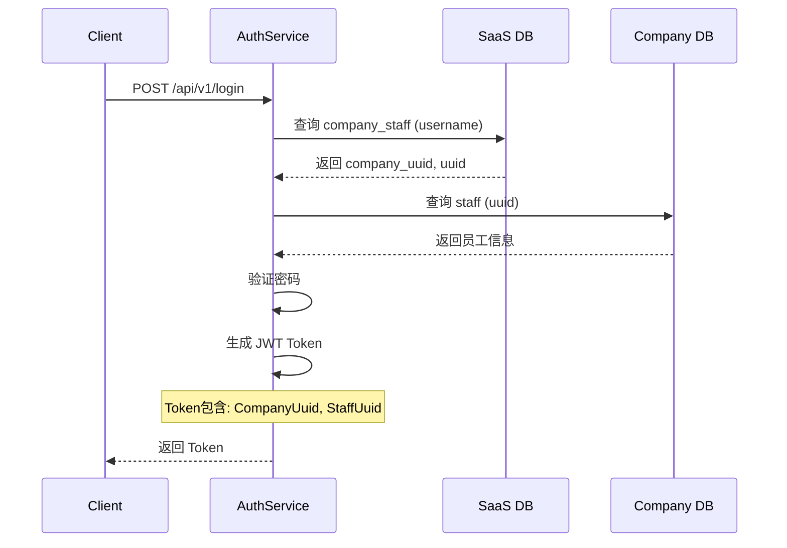
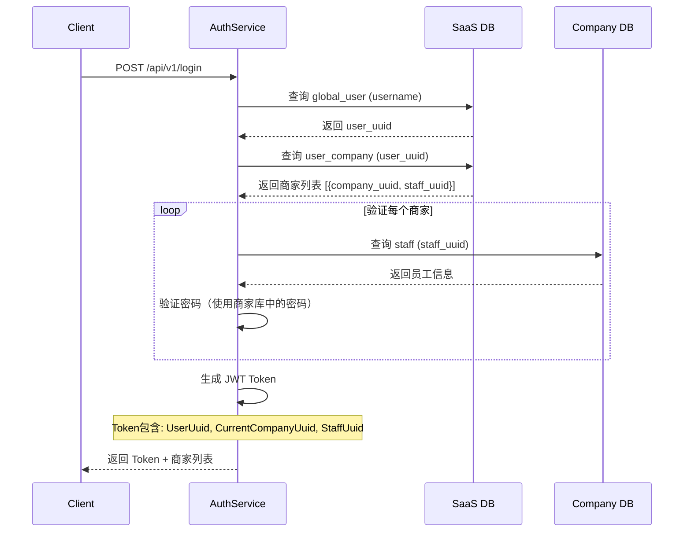
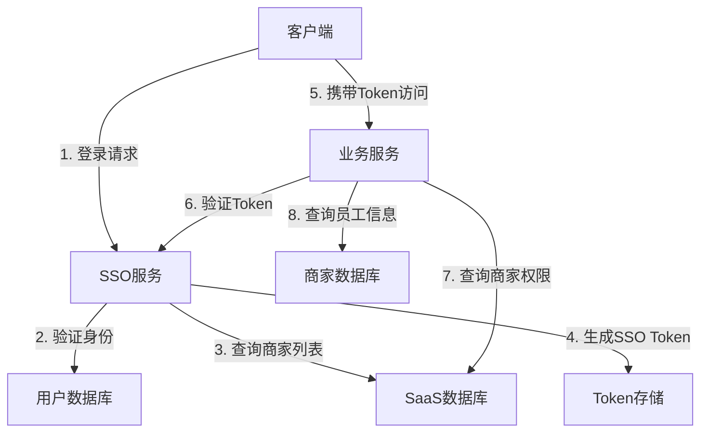

# 跨商家登录方案设计

> 👤 **受众**: 架构师、后端开发工程师  
> 📖 **用途**: 实现一个账号可以登录多个商家的技术方案设计

---

## 📋 目录

- [背景与需求](#背景与需求)
- [当前架构分析](#当前架构分析)
- [方案对比](#方案对比)
- [推荐方案](#推荐方案)
- [第三方鉴权库推荐](#第三方鉴权库推荐)
- [实施步骤](#实施步骤)
- [风险评估](#风险评估)

---

## 背景与需求

### 业务背景

当前 TTPOS 系统采用多租户架构：
- **SaaS 数据库**（saas）：存储全局数据和商家信息
- **商家独立数据库**（shop{company_id}）：每个商家拥有独立的数据库
- **账号体系**：每个商家默认有一个超管账号，商家可以添加自己的员工账号

### 需求描述

**核心需求**：实现一个账号可以登录多个商家

**业务场景**：
1. 区域经理需要管理多个门店
2. 连锁企业总部员工需要访问多个分店
3. 第三方服务商需要同时管理多个客户商家
4. 员工在不同商家间切换工作

**功能要求**：
- 一个账号（username）可以绑定多个商家
- 登录后可以查看可访问的商家列表
- 支持在已登录状态下切换商家
- 每个商家内的权限独立管理
- 保持现有权限体系（RBAC）不变

---

## 当前架构分析

### 数据库结构

#### SaaS 库（saas）

**表：ttpos_company_staff**
```sql
CREATE TABLE ttpos_company_staff (
    id bigint PRIMARY KEY AUTO_INCREMENT,
    uuid bigint UNIQUE COMMENT '员工ID（对应商家库中的staff.uuid）',
    company_uuid bigint COMMENT '商家ID',
    username varchar(255) COMMENT '员工账号',
    phone varchar(255) COMMENT '员工手机号',
    is_super int COMMENT '是否超级管理员',
    create_time int,
    update_time int,
    delete_time int,
    INDEX idx_username (username),
    INDEX idx_company_uuid (company_uuid)
);
```

**当前限制**：
- 一个 `username` 在表中只能有一条记录
- 登录时通过 `username` 查询，只能找到一条 `company_uuid`
- 无法支持一个账号对应多个商家

#### 商家库（shop{company_id}）

**表：ttpos_staff**
```sql
CREATE TABLE ttpos_staff (
    id bigint PRIMARY KEY AUTO_INCREMENT,
    uuid bigint UNIQUE COMMENT '员工ID',
    company_uuid bigint COMMENT '商家ID',
    username varchar(255) COMMENT '员工账号',
    password varchar(255) COMMENT '密码（加密）',
    phone varchar(255) COMMENT '手机号',
    is_super int COMMENT '是否超级管理员',
    -- ... 其他字段
);
```

**权限体系**：
- 基于 RBAC（Role-Based Access Control）
- 每个商家有独立的角色和权限配置
- 员工通过 `StaffRole` → `Role` → `RoleAccess` → `Access` 获取权限

### 登录流程（当前）



### JWT Token 结构

```go
type Claims struct {
    Source         string    `json:"source"`           // 终端
    CompanyUuid    uint64    `json:"company_uuid"`    // 商家ID（单一）
    StaffUuid      uint64    `json:"staff_uuid"`      // 员工ID
    DeviceUuid     uint64    `json:"device_uuid"`     // 设备Uuid
    DeviceId       string    `json:"device_id"`        // 设备ID
    Assistant      Assistant `json:"assistant"`        // 点餐助手信息
    IsRefreshToken bool      `json:"is_refresh_token"` // 是否refresh_token
    jwt.RegisteredClaims
}
```

**问题**：
- Token 中只包含一个 `CompanyUuid`
- 切换商家需要重新登录
- 无法同时持有多个商家的访问权限

---

## 方案对比

### 方案一：扩展 company_staff 表（推荐）

#### 设计思路

允许一个 `username` 对应多个 `company_uuid`，通过一对多关系实现跨商家登录。

#### 数据库变更

**方案 1.1：修改主键结构**

```sql
-- 修改主键，允许同一 username 对应多个 company_uuid
ALTER TABLE ttpos_company_staff 
DROP PRIMARY KEY,
ADD PRIMARY KEY (uuid, company_uuid);

-- 添加唯一索引，确保同一商家内 username 唯一
ALTER TABLE ttpos_company_staff
ADD UNIQUE KEY uk_company_username (company_uuid, username);
```

**方案 1.2：新增全局用户表（更优）**

```sql
-- SaaS 库：全局用户表
CREATE TABLE ttpos_global_user (
    id bigint PRIMARY KEY AUTO_INCREMENT,
    uuid bigint UNIQUE COMMENT '全局用户ID',
    username varchar(255) UNIQUE COMMENT '全局唯一账号',
    phone varchar(255) COMMENT '手机号',
    password_hash varchar(255) COMMENT '密码哈希（可选，用于统一密码）',
    create_time int,
    update_time int,
    delete_time int,
    INDEX idx_username (username),
    INDEX idx_phone (phone)
);

-- SaaS 库：用户-商家关联表
CREATE TABLE ttpos_user_company (
    id bigint PRIMARY KEY AUTO_INCREMENT,
    user_uuid bigint COMMENT '全局用户ID',
    company_uuid bigint COMMENT '商家ID',
    staff_uuid bigint COMMENT '商家库中的员工ID',
    is_super int COMMENT '是否超级管理员',
    status tinyint COMMENT '状态：1-启用，0-禁用',
    create_time int,
    update_time int,
    delete_time int,
    UNIQUE KEY uk_user_company (user_uuid, company_uuid),
    INDEX idx_user_uuid (user_uuid),
    INDEX idx_company_uuid (company_uuid)
);
```

#### 登录流程



#### API 设计

**1. 登录接口**

```go
// 请求
type LoginReq struct {
    Username string `json:"username"`
    Password string `json:"password"`
    Source   string `json:"source"`
    Code     string `json:"code"` // 验证码
}

// 响应
type LoginResp struct {
    Token        string           `json:"token"`
    RefreshToken string           `json:"refresh_token"`
    UserInfo     UserInfo         `json:"user_info"`
    Companies    []CompanyInfo    `json:"companies"` // 可访问的商家列表
}

type CompanyInfo struct {
    CompanyUuid uint64 `json:"company_uuid"`
    CompanyName string `json:"company_name"`
    StaffUuid   uint64 `json:"staff_uuid"`
    IsSuper     int    `json:"is_super"`
    Status      int    `json:"status"` // 商家状态
}
```

**2. 切换商家接口**

```go
// POST /api/v1/auth/switch_company
type SwitchCompanyReq struct {
    CompanyUuid uint64 `json:"company_uuid"`
}

type SwitchCompanyResp struct {
    Token        string `json:"token"`
    RefreshToken string `json:"refresh_token"`
}
```

#### 优点

- ✅ **改动最小**：主要修改 SaaS 库表结构，商家库无需改动
- ✅ **向后兼容**：可以通过数据迁移脚本兼容现有数据
- ✅ **权限隔离**：每个商家内的权限独立管理
- ✅ **灵活扩展**：支持未来添加全局用户属性（如统一密码、头像等）

#### 缺点

- ⚠️ **数据迁移**：需要将现有 `company_staff` 数据迁移到新表结构
- ⚠️ **密码管理**：需要决定使用统一密码还是各商家独立密码

---

### 方案二：引入统一身份服务（SSO）

#### 设计思路

使用第三方 SSO（Single Sign-On）服务，实现统一身份认证和跨商家登录。

#### 架构设计



#### 实现方式

**选项 2.1：自建 SSO 服务**

- 基于 JWT + Redis 实现
- 统一用户表 + 用户-商家关联表
- Token 中包含用户ID和当前商家ID

**选项 2.2：使用第三方 SSO 服务**

- Keycloak、Auth0、Clerk、Ory Kratos 等

#### 优点

- ✅ **标准化**：遵循 OAuth 2.0 / OpenID Connect 标准
- ✅ **安全性高**：专业的身份认证服务
- ✅ **扩展性强**：支持多应用、多租户
- ✅ **功能丰富**：支持社交登录、MFA、审计日志等

#### 缺点

- ❌ **复杂度高**：需要引入新的服务和技术栈
- ❌ **成本增加**：第三方服务可能产生费用
- ❌ **学习成本**：团队需要学习新的技术
- ❌ **迁移成本**：现有系统需要大幅改造

---

### 方案三：JWT Token 多商家支持

#### 设计思路

在 JWT Token 中包含多个商家的信息，通过 Token 切换实现商家切换。

#### Token 结构

```go
type Claims struct {
    Source         string              `json:"source"`
    UserUuid       uint64             `json:"user_uuid"`        // 新增：全局用户ID
    CurrentCompany uint64             `json:"current_company"`  // 当前商家ID
    StaffUuid      uint64             `json:"staff_uuid"`      // 当前商家员工ID
    Companies      []CompanyClaim     `json:"companies"`        // 新增：可访问商家列表
    DeviceUuid     uint64             `json:"device_uuid"`
    DeviceId       string             `json:"device_id"`
    Assistant      Assistant          `json:"assistant"`
    IsRefreshToken bool               `json:"is_refresh_token"`
    jwt.RegisteredClaims
}

type CompanyClaim struct {
    CompanyUuid uint64 `json:"company_uuid"`
    StaffUuid   uint64 `json:"staff_uuid"`
    IsSuper     int    `json:"is_super"`
}
```

#### 优点

- ✅ **无需额外存储**：所有信息都在 Token 中
- ✅ **无状态**：服务端无需存储会话信息

#### 缺点

- ❌ **Token 体积大**：包含多个商家信息，Token 会变大
- ❌ **安全性问题**：Token 泄露会暴露所有商家权限
- ❌ **刷新困难**：切换商家需要重新生成 Token
- ❌ **不推荐**：不符合 JWT 最佳实践（Token 应尽量小）

---

## 推荐方案

### 最终选择：方案一（扩展 company_staff 表）

**选择理由**：
1. **改动最小**：主要修改 SaaS 库，商家库无需改动
2. **向后兼容**：可以通过数据迁移保持兼容
3. **实施简单**：不需要引入新的服务和技术栈
4. **成本最低**：无需第三方服务费用
5. **符合现状**：与现有架构契合度高

### 具体实施方案：方案 1.2（新增全局用户表）

**原因**：
- 更清晰的用户-商家关系
- 支持未来扩展（统一密码、用户属性等）
- 便于维护和管理

---

## 第三方鉴权库推荐

### 如果需要引入第三方库

#### 1. Keycloak（推荐用于企业级）

**简介**：开源的身份和访问管理解决方案

**优点**：
- ✅ 完全开源，无费用
- ✅ 功能强大：SSO、OAuth 2.0、OpenID Connect、SAML
- ✅ 支持多租户
- ✅ 丰富的管理界面
- ✅ 支持用户联邦（LDAP、Active Directory）

**缺点**：
- ⚠️ 部署复杂，需要独立服务
- ⚠️ 资源消耗较大
- ⚠️ 学习曲线陡峭

**适用场景**：
- 大型企业级应用
- 需要复杂权限管理
- 需要集成多种认证方式

**文档**：https://www.keycloak.org/

---

#### 2. Clerk（推荐用于快速开发）

**简介**：现代化的身份认证和用户管理平台

**优点**：
- ✅ 开箱即用，集成简单
- ✅ 丰富的 SDK 和文档
- ✅ 支持多租户
- ✅ 内置用户管理界面
- ✅ 支持社交登录、MFA

**缺点**：
- ❌ 商业产品，有费用（免费额度有限）
- ❌ 依赖第三方服务
- ❌ 数据存储在 Clerk 服务器

**适用场景**：
- 快速开发，需要快速上线
- 中小型应用
- 团队规模小，需要减少开发工作量

**文档**：https://clerk.com/docs

---

#### 3. Auth0

**简介**：企业级身份认证平台

**优点**：
- ✅ 功能全面
- ✅ 安全性高
- ✅ 支持多种认证方式
- ✅ 丰富的集成选项

**缺点**：
- ❌ 商业产品，费用较高
- ❌ 依赖第三方服务
- ❌ 配置复杂

**适用场景**：
- 大型企业应用
- 需要企业级支持
- 预算充足

**文档**：https://auth0.com/docs

---

#### 4. Ory Kratos（推荐用于自托管）

**简介**：开源的身份认证和用户管理系统

**优点**：
- ✅ 完全开源
- ✅ 可自托管
- ✅ 现代化架构（云原生）
- ✅ 支持多种认证方式

**缺点**：
- ⚠️ 相对较新，社区较小
- ⚠️ 文档和示例较少
- ⚠️ 需要自行部署和维护

**适用场景**：
- 需要自托管解决方案
- 云原生架构
- 团队有运维能力

**文档**：https://www.ory.sh/docs/kratos/

---

#### 5. Logto（推荐用于现代化集成）

**简介**：开源的身份与访问管理（IAM）平台，专注于简化开发者集成体验

**优点**：
- ✅ 完全开源，免费计划包括 50,000 MAUs 和 100,000 令牌
- ✅ 严格遵循 OIDC、OAuth 2.0、SAML 等开放标准
- ✅ 支持多租户管理，适合多商家场景
- ✅ 丰富的 SDK，支持超过 30 种流行框架（Go、Node.js、Python、Java 等）
- ✅ 开发者友好，集成简单，文档完善
- ✅ 支持无密码认证（邮件/短信验证码、社交登录）
- ✅ 可定制登录体验，UI 现代化
- ✅ 可自托管，数据可控

**缺点**：
- ⚠️ 相对较新的项目，某些高级企业功能可能尚未完全成熟
- ⚠️ 社区规模相对较小，但正在快速增长
- ⚠️ 需要独立部署和维护（自托管模式）

**适用场景**：
- 需要快速集成现代化认证体验
- 重视开发者友好性和多框架支持
- 需要多租户支持但不想过度复杂化
- 希望遵循开放标准，便于未来扩展

**文档**：https://docs.logto.io/

**GitHub**：https://github.com/logto-io/logto

---

#### 6. Casdoor（推荐用于功能丰富场景）

**简介**：基于 OAuth 2.0、OIDC、SAML、CAS 的 UI 优先身份和访问管理平台

**优点**：
- ✅ 完全开源，可自托管
- ✅ 功能丰富：支持 OAuth 2.0、OIDC、SAML、CAS、LDAP、SCIM 等多种协议
- ✅ 支持多种认证方式：账号密码、邮箱/短信验证码、社交登录
- ✅ 内置多租户和身份代理，适合多商家管理
- ✅ 提供集中式仪表盘，管理用户、角色、权限、审计日志
- ✅ 支持 RBAC，可与 Casbin 等细粒度授权组件集成
- ✅ 前后端分离架构（Go + React），便于定制
- ✅ 社区活跃，定期更新和维护

**缺点**：
- ⚠️ 曾出现安全漏洞（如 SQL 注入 CVE-2022-24124），需严格配置安全参数并及时升级
- ⚠️ 内置 UI 相较现代认证方案可能显得陈旧，可能需要自定义以提升用户体验
- ⚠️ 高级定制需掌握 Golang 和 React.js，学习成本较高
- ⚠️ 配置相对复杂，需要一定的技术能力

**适用场景**：
- 需要支持多种认证协议（SAML、CAS、LDAP 等）
- 需要丰富的功能集成和细粒度权限控制
- 团队具备 Golang 和 React.js 开发经验
- 需要集中式身份管理平台

**文档**：https://casdoor.org/docs/overview

**GitHub**：https://github.com/casbin/casdoor

---

#### 7. 自建方案（当前推荐）

**简介**：基于现有架构扩展，不引入第三方服务

**优点**：
- ✅ 完全控制
- ✅ 无额外费用
- ✅ 与现有系统集成度高
- ✅ 学习成本低

**缺点**：
- ⚠️ 需要自行实现和维护
- ⚠️ 功能相对简单

**适用场景**：
- **当前项目推荐**：改动最小，实施简单

---

### 第三方库对比总结

| 库名 | 类型 | 多租户 | 协议支持 | 集成难度 | 自托管 | 推荐度 | 适用场景 |
|------|------|--------|---------|---------|--------|--------|---------|
| **Keycloak** | 开源 | ✅ | OAuth/OIDC/SAML | 中 | ✅ | ⭐⭐⭐⭐ | 企业级，复杂权限 |
| **Clerk** | 商业 | ✅ | OAuth/OIDC | 低 | ❌ | ⭐⭐⭐ | 快速开发，预算充足 |
| **Auth0** | 商业 | ✅ | OAuth/OIDC/SAML | 中 | ❌ | ⭐⭐⭐ | 企业级，预算充足 |
| **Ory Kratos** | 开源 | ✅ | OAuth/OIDC | 中 | ✅ | ⭐⭐⭐ | 云原生，自托管 |
| **Logto** | 开源 | ✅ | OAuth/OIDC/SAML | **低** | ✅ | ⭐⭐⭐⭐⭐ | **现代化集成，多租户** |
| **Casdoor** | 开源 | ✅ | OAuth/OIDC/SAML/CAS/LDAP | 中 | ✅ | ⭐⭐⭐⭐ | **功能丰富，多协议** |
| **自建方案** | - | ✅ | 自定义 | 低 | ✅ | ⭐⭐⭐⭐⭐ | **当前推荐：改动最小** |

### 推荐结论

#### 方案一：自建方案（当前推荐）

**当前阶段**：**不引入第三方库**，采用方案一（扩展表结构）

**原因**：
1. 需求相对简单，不需要复杂的 SSO 功能
2. 现有架构已经支持多租户
3. 引入第三方库会增加系统复杂度
4. 自建方案可以完全控制，便于后续扩展
5. 实施时间短（9-15天），成本低

#### 方案二：如果选择第三方库

**如果团队决定引入第三方库，推荐优先级如下：**

**1. Logto（最推荐）** ⭐⭐⭐⭐⭐
- ✅ **最适合 TTPOS 项目**：支持多租户，集成简单，开发者友好
- ✅ **技术栈匹配**：提供 Go SDK，与现有 Go 项目集成方便
- ✅ **现代化体验**：UI 现代化，支持无密码认证
- ✅ **成本低**：开源免费，可自托管
- ✅ **标准协议**：遵循 OIDC/OAuth，便于未来扩展
- ⚠️ **注意事项**：相对较新，需评估企业功能成熟度

**2. Casdoor（次推荐）** ⭐⭐⭐⭐
- ✅ **功能丰富**：支持多种协议（SAML、CAS、LDAP），适合复杂场景
- ✅ **多租户支持**：内置多租户和身份代理
- ✅ **技术栈匹配**：Go + React，与项目技术栈一致
- ✅ **成本低**：开源免费，可自托管
- ⚠️ **注意事项**：需关注安全配置，UI 可能需要自定义

**3. Keycloak** ⭐⭐⭐⭐
- ✅ **功能强大**：企业级功能完善
- ⚠️ **复杂度高**：部署和维护复杂，资源消耗大

**4. Clerk** ⭐⭐⭐
- ✅ **集成简单**：开箱即用
- ❌ **成本高**：商业产品，有费用
- ❌ **数据外置**：数据存储在第三方服务器

**未来考虑**：
- 如果需求变复杂（需要支持 OAuth、社交登录等），**优先考虑 Logto**
- 如果需要支持多种协议（SAML、CAS、LDAP），可以考虑 **Casdoor**
- 如果需要企业级功能且预算充足，可以考虑 Keycloak

---

## 实施步骤

### 阶段一：数据库设计（1-2天）

#### 1.1 创建新表结构

```sql
-- SaaS 库：全局用户表
CREATE TABLE ttpos_global_user (
    id bigint PRIMARY KEY AUTO_INCREMENT,
    uuid bigint UNIQUE COMMENT '全局用户ID',
    username varchar(255) UNIQUE COMMENT '全局唯一账号',
    phone varchar(255) COMMENT '手机号',
    password_hash varchar(255) COMMENT '密码哈希（可选，用于统一密码）',
    avatar varchar(500) COMMENT '头像URL',
    create_time int COMMENT '创建时间',
    update_time int COMMENT '更新时间',
    delete_time int COMMENT '删除时间',
    INDEX idx_username (username),
    INDEX idx_phone (phone)
) ENGINE=InnoDB DEFAULT CHARSET=utf8mb4 COMMENT='全局用户表';

-- SaaS 库：用户-商家关联表
CREATE TABLE ttpos_user_company (
    id bigint PRIMARY KEY AUTO_INCREMENT,
    user_uuid bigint COMMENT '全局用户ID',
    company_uuid bigint COMMENT '商家ID',
    staff_uuid bigint COMMENT '商家库中的员工ID',
    is_super int COMMENT '是否超级管理员：0-否，1-是',
    status tinyint COMMENT '状态：1-启用，0-禁用',
    create_time int COMMENT '创建时间',
    update_time int COMMENT '更新时间',
    delete_time int COMMENT '删除时间',
    UNIQUE KEY uk_user_company (user_uuid, company_uuid),
    INDEX idx_user_uuid (user_uuid),
    INDEX idx_company_uuid (company_uuid)
) ENGINE=InnoDB DEFAULT CHARSET=utf8mb4 COMMENT='用户-商家关联表';
```

#### 1.2 数据迁移脚本

```sql
-- 迁移现有 company_staff 数据到新表结构
-- 步骤1：创建全局用户（基于 username 去重）
INSERT INTO ttpos_global_user (uuid, username, phone, create_time, update_time)
SELECT 
    UUID_SHORT() as uuid,
    username,
    phone,
    UNIX_TIMESTAMP() as create_time,
    UNIX_TIMESTAMP() as update_time
FROM (
    SELECT DISTINCT username, phone
    FROM ttpos_company_staff
    WHERE delete_time = 0
) AS distinct_users;

-- 步骤2：创建用户-商家关联记录
INSERT INTO ttpos_user_company (user_uuid, company_uuid, staff_uuid, is_super, status, create_time, update_time)
SELECT 
    gu.uuid as user_uuid,
    cs.company_uuid,
    cs.uuid as staff_uuid,
    cs.is_super,
    1 as status,
    cs.create_time,
    cs.update_time
FROM ttpos_company_staff cs
INNER JOIN ttpos_global_user gu ON gu.username = cs.username
WHERE cs.delete_time = 0;
```

### 阶段二：代码实现（3-5天）

#### 2.1 模型定义

```go
// main/app/model/global_user.go
package model

// GlobalUser 全局用户表 ttpos_global_user
type GlobalUser struct {
    BaseModel
    Username     string `gorm:"column:username;type:varchar(255);uniqueIndex;comment:全局唯一账号;NOT NULL" json:"username"`
    Phone        string `gorm:"column:phone;type:varchar(255);index;comment:手机号" json:"phone"`
    PasswordHash string `gorm:"column:password_hash;type:varchar(255);comment:密码哈希（可选）" json:"-"`
    Avatar       string `gorm:"column:avatar;type:varchar(500);comment:头像URL" json:"avatar"`
    
    UserCompanies []UserCompany `gorm:"foreignKey:UserUuid;references:Uuid" json:"user_companies"`
}

// UserCompany 用户-商家关联表 ttpos_user_company
type UserCompany struct {
    BaseModel
    UserUuid    uint64 `gorm:"column:user_uuid;type:bigint(20) unsigned;index;comment:全局用户ID;NOT NULL" json:"user_uuid"`
    CompanyUuid uint64 `gorm:"column:company_uuid;type:bigint(20) unsigned;index;comment:商家ID;NOT NULL" json:"company_uuid"`
    StaffUuid   uint64 `gorm:"column:staff_uuid;type:bigint(20) unsigned;comment:商家库中的员工ID;NOT NULL" json:"staff_uuid"`
    IsSuper     int    `gorm:"column:is_super;type:int(11);default:0;comment:是否超级管理员" json:"is_super"`
    Status      int    `gorm:"column:status;type:tinyint(4);default:1;comment:状态：1-启用，0-禁用" json:"status"`
    
    GlobalUser *GlobalUser `gorm:"foreignKey:UserUuid;references:Uuid" json:"global_user,omitempty"`
    Company    *Company    `gorm:"foreignKey:CompanyUuid;references:Uuid" json:"company,omitempty"`
}
```

#### 2.2 Repository 层

```go
// main/app/repository/global_user.go
package repository

type IGlobalUserRepo interface {
    WhereUsername(username string) DBOption
    GetGlobalUser(opts ...DBOption) (model.GlobalUser, error)
    GetUserCompanies(userUuid uint64) ([]model.UserCompany, error)
    CreateGlobalUser(globalUser *model.GlobalUser) error
    CreateUserCompany(userCompany *model.UserCompany) error
}

// main/app/repository/user_company.go
package repository

type IUserCompanyRepo interface {
    WhereUserUuid(userUuid uint64) DBOption
    WhereCompanyUuid(companyUuid uint64) DBOption
    WhereStatus(status int) DBOption
    GetUserCompanies(opts ...DBOption) ([]model.UserCompany, error)
}
```

#### 2.3 Service 层改造

```go
// main/app/service/auth.go

// Login 登录（改造后）
func (s *authSrv) Login(ctx context.Context, loginReq req.LoginReq) (resp.LoginResp, error) {
    var loginResp resp.LoginResp
    
    // 1. 验证验证码
    if !s.captchaSrv.Verify(ctx.GetGin().GetHeader("X-SIGN"), loginReq.Code) {
        return loginResp, errors.New("验证码错误")
    }
    
    // 2. 查询全局用户
    saasDB := s.dbm.GetDB(constant.DefaultDB)
    globalUserRepo := repository.NewGlobalUserRepo(saasDB)
    globalUser, err := globalUserRepo.GetGlobalUser(
        globalUserRepo.WhereUsername(loginReq.Username),
    )
    if err != nil || globalUser.Uuid == 0 {
        return loginResp, errors.New("账号或密码错误")
    }
    
    // 3. 查询用户可访问的商家列表
    userCompanyRepo := repository.NewUserCompanyRepo(saasDB)
    userCompanies, err := userCompanyRepo.GetUserCompanies(
        userCompanyRepo.WhereUserUuid(globalUser.Uuid),
        userCompanyRepo.WhereStatus(1), // 只查询启用的关联
    )
    if err != nil || len(userCompanies) == 0 {
        return loginResp, errors.New("未找到绑定的商家，请确认登录信息")
    }
    
    // 4. 验证密码（使用第一个商家的密码进行验证）
    // 注意：这里需要决定使用统一密码还是各商家独立密码
    firstCompany := userCompanies[0]
    staffRepo := repository.NewStaffRepo(s.dbm.GetDB(firstCompany.CompanyUuid))
    staff, err := staffRepo.GetStaff(
        staffRepo.WhereUuid(firstCompany.StaffUuid),
        staffRepo.WithCompany(),
    )
    if err != nil || staff.Uuid == 0 {
        return loginResp, errors.New("账号或密码错误")
    }
    
    // 验证密码
    if utils.EncryptPassword(loginReq.Password) != staff.Password {
        return loginResp, errors.New("账号或密码错误")
    }
    
    // 5. 检查员工状态和商家状态
    // ... 现有验证逻辑 ...
    
    // 6. 构建商家列表响应
    companies := make([]resp.CompanyInfo, 0, len(userCompanies))
    for _, uc := range userCompanies {
        companyDB := s.dbm.GetDB(uc.CompanyUuid)
        companyRepo := repository.NewCompanyRepo(companyDB)
        company, _ := companyRepo.GetCompanyInfoByUuid(uc.CompanyUuid)
        
        if company != nil && !company.IsExpired() && !company.IsException() {
            companies = append(companies, resp.CompanyInfo{
                CompanyUuid: uc.CompanyUuid,
                CompanyName: company.CompanyName,
                StaffUuid:   uc.StaffUuid,
                IsSuper:     uc.IsSuper,
                Status:      1,
            })
        }
    }
    
    if len(companies) == 0 {
        return loginResp, errors.New("没有可访问的商家")
    }
    
    // 7. 生成 Token（使用第一个商家）
    currentCompany := companies[0]
    claims := auth.Claims{
        Source:         loginReq.Source,
        UserUuid:       globalUser.Uuid,        // 新增
        CompanyUuid:    currentCompany.CompanyUuid,
        StaffUuid:      currentCompany.StaffUuid,
        // ... 其他字段
    }
    
    token, err := auth.GenerateToken(claims, config.JWT.Secret, config.JWT.Expire, false)
    if err != nil {
        return loginResp, errors.New("生成token失败")
    }
    
    refreshToken, err := auth.GenerateToken(claims, config.JWT.Secret, config.JWT.RefreshExpire, true)
    if err != nil {
        return loginResp, errors.New("生成refresh_token失败")
    }
    
    // 8. 返回响应
    loginResp = resp.LoginResp{
        Token:        token,
        RefreshToken: refreshToken,
        UserInfo: resp.UserInfo{
            UserUuid: globalUser.Uuid,
            Username: globalUser.Username,
            Phone:    globalUser.Phone,
            Avatar:   globalUser.Avatar,
        },
        Companies: companies,
    }
    
    return loginResp, nil
}

// SwitchCompany 切换商家
func (s *authSrv) SwitchCompany(ctx context.Context, req req.SwitchCompanyReq) (resp.SwitchCompanyResp, error) {
    var switchResp resp.SwitchCompanyResp
    
    // 1. 获取当前用户信息
    staffUuid := ctx.GetStaffUuid()
    userUuid := ctx.GetUserUuid() // 新增：从 context 获取
    
    // 2. 验证用户是否有权限访问该商家
    saasDB := s.dbm.GetDB(constant.DefaultDB)
    userCompanyRepo := repository.NewUserCompanyRepo(saasDB)
    userCompanies, err := userCompanyRepo.GetUserCompanies(
        userCompanyRepo.WhereUserUuid(userUuid),
        userCompanyRepo.WhereCompanyUuid(req.CompanyUuid),
        userCompanyRepo.WhereStatus(1),
    )
    if err != nil || len(userCompanies) == 0 {
        return switchResp, errors.New("无权访问该商家")
    }
    
    userCompany := userCompanies[0]
    
    // 3. 验证商家状态
    companyDB := s.dbm.GetDB(req.CompanyUuid)
    companyRepo := repository.NewCompanyRepo(companyDB)
    company, err := companyRepo.GetCompanyInfoByUuid(req.CompanyUuid)
    if err != nil || company.IsExpired() || company.IsException() {
        return switchResp, errors.New("商家状态异常，无法切换")
    }
    
    // 4. 验证员工状态
    staffRepo := repository.NewStaffRepo(companyDB)
    staff, err := staffRepo.GetStaff(
        staffRepo.WhereUuid(userCompany.StaffUuid),
    )
    if err != nil || staff.Uuid == 0 || staff.DeleteTime != 0 || staff.IsDisable == 1 {
        return switchResp, errors.New("员工状态异常，无法切换")
    }
    
    // 5. 生成新 Token
    claims := auth.Claims{
        Source:      ctx.GetSource(),
        UserUuid:    userUuid,
        CompanyUuid: req.CompanyUuid,
        StaffUuid:   userCompany.StaffUuid,
        DeviceId:    ctx.GetDeviceId(),
        // ... 其他字段
    }
    
    token, err := auth.GenerateToken(claims, config.JWT.Secret, config.JWT.Expire, false)
    if err != nil {
        return switchResp, errors.New("生成token失败")
    }
    
    refreshToken, err := auth.GenerateToken(claims, config.JWT.Secret, config.JWT.RefreshExpire, true)
    if err != nil {
        return switchResp, errors.New("生成refresh_token失败")
    }
    
    switchResp = resp.SwitchCompanyResp{
        Token:        token,
        RefreshToken: refreshToken,
    }
    
    return switchResp, nil
}
```

#### 2.4 JWT Claims 扩展

```go
// main/pkg/auth/jwt.go

type Claims struct {
    Source         string    `json:"source"`           // 终端
    UserUuid       uint64    `json:"user_uuid"`       // 新增：全局用户ID
    CompanyUuid    uint64    `json:"company_uuid"`    // 商家ID
    StaffUuid      uint64    `json:"staff_uuid"`      // 员工ID
    MemberUuid     uint64    `json:"member_uuid"`     // 会员ID
    DeviceUuid     uint64    `json:"device_uuid"`      // 设备Uuid
    DeviceId       string    `json:"device_id"`        // 设备ID
    Assistant      Assistant `json:"assistant"`        // 点餐助手绑定的收银机信息
    IsRefreshToken bool      `json:"is_refresh_token"` // 是否refresh_token
    jwt.RegisteredClaims
}
```

#### 2.5 Context 扩展

```go
// main/pkg/context/context.go

type Context struct {
    // ... 现有字段
    userUuid uint64 // 新增：全局用户ID
}

func WithUserUuid(userUuid uint64) Option {
    return func(c *Context) {
        c.userUuid = userUuid
    }
}

func (c *Context) GetUserUuid() uint64 {
    return c.userUuid
}
```

### 阶段三：API 接口（1-2天）

#### 3.1 新增接口

```go
// main/app/router/v1/auth.go

// 切换商家
authGroup.POST("/switch_company", authController.SwitchCompany)

// 获取可访问商家列表
authGroup.GET("/companies", authController.GetCompanies)
```

#### 3.2 Controller 实现

```go
// main/app/controller/auth.go

// SwitchCompany 切换商家
func (c *authController) SwitchCompany(ctx *gin.Context) {
    var req req.SwitchCompanyReq
    if err := ctx.ShouldBindJSON(&req); err != nil {
        helper.Fail(ctx, constant.CodeParamError, err.Error())
        return
    }
    
    context := context.NewContext(
        context.WithGinContext(ctx),
        context.WithUserUuid(ctx.GetUint64(jwt.UserUuid)),
        // ... 其他字段
    )
    
    resp, err := c.authSrv.SwitchCompany(context, req)
    if err != nil {
        helper.ErrorWithDetail(ctx, constant.CodeServerError, err)
        return
    }
    
    helper.Success(ctx, resp)
}

// GetCompanies 获取可访问商家列表
func (c *authController) GetCompanies(ctx *gin.Context) {
    userUuid := ctx.GetUint64(jwt.UserUuid)
    
    context := context.NewContext(
        context.WithGinContext(ctx),
        context.WithUserUuid(userUuid),
    )
    
    companies, err := c.authSrv.GetUserCompanies(context)
    if err != nil {
        helper.ErrorWithDetail(ctx, constant.CodeServerError, err)
        return
    }
    
    helper.Success(ctx, companies)
}
```

### 阶段四：前端改造（2-3天）

#### 4.1 登录流程改造

```typescript
// 登录后处理
interface LoginResponse {
    token: string;
    refresh_token: string;
    user_info: {
        user_uuid: number;
        username: string;
        phone: string;
        avatar: string;
    };
    companies: Array<{
        company_uuid: number;
        company_name: string;
        staff_uuid: number;
        is_super: number;
        status: number;
    }>;
}

// 登录成功后
if (loginResponse.companies.length > 1) {
    // 显示商家选择界面
    showCompanySelector(loginResponse.companies);
} else {
    // 只有一个商家，直接进入
    saveToken(loginResponse.token);
    navigateToHome();
}
```

#### 4.2 商家切换功能

```typescript
// 切换商家
async function switchCompany(companyUuid: number) {
    const response = await api.post('/api/v1/auth/switch_company', {
        company_uuid: companyUuid
    });
    
    // 更新 Token
    saveToken(response.data.token);
    saveRefreshToken(response.data.refresh_token);
    
    // 刷新页面或重新加载数据
    window.location.reload();
}
```

### 阶段五：测试与验证（2-3天）

#### 5.1 单元测试

- 登录逻辑测试
- 商家切换测试
- 权限验证测试

#### 5.2 集成测试

- 多商家登录流程
- Token 刷新流程
- 权限隔离验证

#### 5.3 兼容性测试

- 现有账号登录验证
- 数据迁移验证
- 向后兼容性验证

---

## 风险评估

### 技术风险

| 风险项 | 风险等级 | 影响 | 应对措施 |
|--------|---------|------|---------|
| 数据迁移失败 | 中 | 影响现有用户登录 | 1. 充分测试迁移脚本<br>2. 准备回滚方案<br>3. 分批迁移 |
| Token 兼容性问题 | 低 | 现有 Token 失效 | 1. 支持新旧 Token 格式<br>2. 逐步迁移 |
| 性能影响 | 低 | 登录查询变慢 | 1. 添加数据库索引<br>2. 使用缓存 |
| 权限混乱 | 高 | 用户访问错误商家 | 1. 严格验证权限<br>2. 添加审计日志 |

### 业务风险

| 风险项 | 风险等级 | 影响 | 应对措施 |
|--------|---------|------|---------|
| 用户体验变化 | 中 | 用户不适应新流程 | 1. 提供引导<br>2. 保持界面一致性 |
| 商家数据泄露 | 高 | 跨商家访问数据 | 1. 严格权限控制<br>2. 添加操作日志 |
| 密码管理混乱 | 中 | 用户忘记密码 | 1. 提供统一密码选项<br>2. 支持各商家独立密码 |

### 实施风险

| 风险项 | 风险等级 | 影响 | 应对措施 |
|--------|---------|------|---------|
| 开发周期延长 | 中 | 项目延期 | 1. 分阶段实施<br>2. 优先核心功能 |
| 测试不充分 | 高 | 线上问题 | 1. 充分测试<br>2. 灰度发布 |

---

## 总结

### 推荐方案

**方案一：扩展 company_staff 表（方案 1.2：新增全局用户表）**

### 关键决策

1. **不引入第三方鉴权库**：当前需求简单，自建方案更合适
2. **密码策略**：支持各商家独立密码（保持现有逻辑）
3. **向后兼容**：通过数据迁移保持兼容
4. **分阶段实施**：先实现核心功能，再逐步优化

### 实施时间估算

- **数据库设计**：1-2天
- **代码实现**：3-5天
- **API 接口**：1-2天
- **前端改造**：2-3天
- **测试验证**：2-3天
- **总计**：9-15天

### 后续优化方向

1. **统一密码功能**：支持全局用户设置统一密码
2. **商家邀请功能**：支持通过邀请链接添加商家
3. **权限审计**：记录跨商家访问日志
4. **SSO 集成**：未来如需支持 OAuth，可以基于现有架构扩展

---

**最后更新**: 2025-11-19  
**维护者**: TTPOS Team  
**版本**: v1.0

