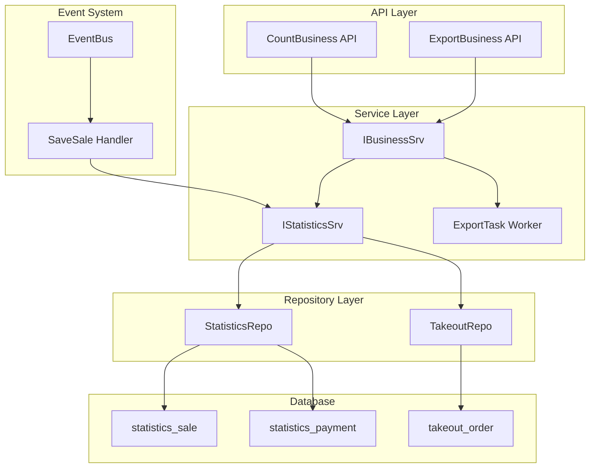

# TTPOS 数据统计模块分析报告

> **报告类型**: Methods Report (方法与算法分析)
> **分析深度**: Detailed
> **生成时间**: 2026-01-27
> **分析范围**: main/app/service/statistics.go, business.go, main/app/repository/statistics*.go

---

## 执行摘要

本报告对 TTPOS 餐饮收银系统的数据统计模块进行了深入分析，涵盖核心算法、关键执行路径、API 设计规范和业务逻辑四个维度。

### 核心发现

1. **二层聚合架构**：统计系统采用数据库层预聚合 + 应用层合并的设计，在查询性能与计算灵活性间取得平衡

2. **多维度渠道分类**：通过 desk_uuid、order_source_uuid、is_takeout、dining_method 的组合实现精确的渠道区分

3. **事件驱动更新**：统计数据通过 EventBus 异步更新，采用先删后插策略保证一致性

4. **多租户隔离**：数据库级别的租户隔离，支持跨商户汇总统计

### 关键指标

| 指标 | 数值 |
|-----|------|
| 统计接口数量 | 25+ |
| 导出接口数量 | 9 |
| 支持语言 | 9 种 |
| 渠道分类 | 6 类 |
| 命名一致性 | 95% |

---

## 目录

1. [核心算法与计算模型](#一核心算法与计算模型)
2. [关键路径与性能设计](#二关键路径与性能设计)
3. [API 设计与规范](#三api-设计与规范)
4. [业务逻辑与规则引擎](#四业务逻辑与规则引擎)
5. [架构图](#五架构图)
6. [优化建议](#六优化建议)

---

## 一、核心算法与计算模型

### 1.1 二层聚合架构

TTPOS 统计系统的核心设计采用**二层聚合架构**，将复杂的销售数据统计分解为数据库层聚合与应用层合并两个阶段。

**数据库层**通过 `countSaleSubQuerySelect` 定义的子查询按销售单据（sale_bill_uuid）进行初级聚合，在 `ttpos_statistics_sale` 表上执行 GROUP BY 操作。

**应用层**则负责跨数据源的二次聚合，`MergeTakeoutStatistics` 方法将店内订单统计结果与外卖订单数据合并。

### 1.2 核心计算公式

```
销售额 = product_price + product_tax + service_fee + service_tax + payment_fee + extend_price

实收金额 = payment_amount - refund_amount - payment_balance

营业收入 = payment_amount - refund_amount - refund_payment_balance - product_tax - service_tax + refund_tax
```

### 1.3 渠道分类算法

| 渠道 | 分类条件 |
|-----|---------|
| table（桌台） | desk_uuid > 0 AND is_takeout = 0 |
| dine_in（点餐-店内） | desk_uuid = 0 AND order_source_uuid = 0 AND is_takeout = 0 |
| takeout_delivery（外送） | is_takeout = 1 |
| takeaway（外带） | desk_uuid = 0 AND dining_method = 1 |

> 详细内容参见 [section-algorithms.md](sections/section-algorithms.md)

---

## 二、关键路径与性能设计

### 2.1 实时统计路径

```
API Handler → Service.CountBusiness() → Repository.CountSale() → Database
```

核心编排在 `CountBusiness` 方法中完成，协调多个子统计方法：
- CountSale() - 销售数据统计
- CountMember() - 会员消费统计
- CountPaymentMethod() - 支付方式统计

### 2.2 导出统计路径

采用**两阶段异步模式**：

1. **阶段一**：验证 → 创建 ExportRecord → 启动异步任务 → 立即返回
2. **阶段二**：查询数据 → 生成 XLSX → 上传文件 → 更新状态

### 2.3 事件驱动更新

```
订单完成 → PublishStatisticsSaleEvent → EventBus → SaveSale()
```

`SaveSale` 采用先删后插策略，确保数据一致性。

> 详细内容参见 [section-paths.md](sections/section-paths.md)

---

## 三、API 设计与规范

### 3.1 命名规范

| 前缀 | 语义 | 示例 |
|-----|------|------|
| Count* | 统计计算 | CountSale, CountBusiness |
| Export* | 导出操作 | ExportBusinessSummary |
| Rank* | 排名统计 | RankProduct |

### 3.2 时间参数优先级

```
TimeType > StartTime/EndTime > QueryStartDate/QueryEndDate
```

### 3.3 响应字段规范

- 金额字段：`total_xxx_amount`, `avg_xxx_amount`
- 数量字段：`xxx_num`, `xxx_count`
- 精度：两位小数，Decimal.Round(2)

> 详细内容参见 [section-apis.md](sections/section-apis.md)

---

## 四、业务逻辑与规则引擎

### 4.1 订单状态过滤

仅纳入 `SaleOrderStatusFinish (1)` 状态的订单，排除待处理和已取消订单。

### 4.2 数据管理排除

通过 `ExcludeDataManage` 参数控制是否排除测试订单和错误数据：

```sql
WHERE sale_bill_uuid NOT IN (
  SELECT data_uuid FROM ttpos_data_manage
  WHERE type = 0 AND delete_time = 0
)
```

### 4.3 多租户统计

- 数据库级别隔离，每个商户独立数据库
- 跨商户汇总支持并发查询（最大 10 并发）
- 支持明细报表和汇总报表两种模式

> 详细内容参见 [section-logic.md](sections/section-logic.md)

---

## 五、架构图



---

## 六、优化建议

### 6.1 高优先级

| 问题 | 建议 | 影响 |
|-----|------|------|
| 缺乏缓存 | 引入 Redis 缓存热点时间窗口 | 降低数据库压力 |
| 导出一致性 | 添加事务锁或快照隔离 | 确保数据准确 |
| 事件可靠性 | 实现失败重试机制 | 防止数据丢失 |

### 6.2 中优先级

| 问题 | 建议 | 影响 |
|-----|------|------|
| 双层 GROUP BY | 创建物化视图预计算 | 提升查询性能 |
| 复杂 CASE 表达式 | 考虑字段冗余存储 | 减少计算开销 |
| 多语言硬编码 | 提取至配置文件 | 便于维护 |

### 6.3 关键代码位置

| 功能 | 文件 | 方法 |
|-----|------|------|
| 业务统计入口 | service/business.go:394 | CountBusiness() |
| 销售数据统计 | service/statistics.go:130 | CountSale() |
| Repository 聚合 | repository/statistics.go:177 | CountSale() |
| 导出执行 | service/business.go:2628 | ExportBusinessSummaryTask() |
| 事件处理 | event/statistics/statistics_sale_event_handler.go | Handle() |

---

## 附录：详细章节

- [section-algorithms.md](sections/section-algorithms.md) - 核心算法详解
- [section-paths.md](sections/section-paths.md) - 关键路径分析
- [section-apis.md](sections/section-apis.md) - API 设计规范
- [section-logic.md](sections/section-logic.md) - 业务逻辑分析

---

*报告由 Claude Code 项目分析工具生成*
