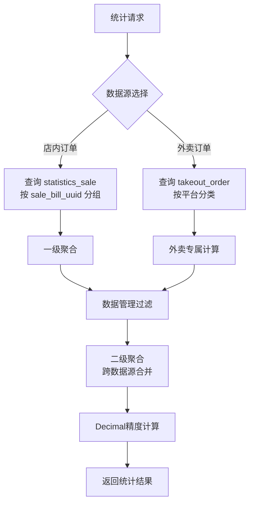

# 核心算法与计算模型

## 一、销售数据统计算法

### 1.1 二层聚合架构

TTPOS 统计系统采用**二层聚合架构**，将复杂的销售数据统计分解为数据库层聚合与应用层合并两个阶段。

在数据库层，系统通过 `countSaleSubQuerySelect` 定义的子查询按销售单据（sale_bill_uuid）进行初级聚合，在 `ttpos_statistics_sale` 表上执行 GROUP BY 操作。这种预聚合策略显著减少了传输到应用层的数据量，充分利用数据库引擎的优化能力。

应用层负责跨数据源的二次聚合，`MergeTakeoutStatistics` 方法将店内订单统计结果与外卖订单数据合并，执行加权平均计算和精度转换。

### 1.2 核心计算公式

**销售额**：
```
sale_amount = product_price + product_tax + service_fee + service_tax + payment_fee + extend_price
```

**实收金额**（扣除余额支付）：
```
received_amount = payment_amount - refund_amount - payment_balance
```

**营业收入**（净收入，排除税费）：
```
business_amount = payment_amount - refund_amount - refund_payment_balance - product_tax - service_tax + refund_tax
```

**平均订单金额**（含除零保护）：
```
avg_order_amount = total_order_amount / total_order_num  (当 total_order_num > 0)
```

### 1.3 精度保障策略

系统采用 `github.com/shopspring/decimal` 库进行高精度运算。所有金额字段在跨数据源聚合阶段使用 Decimal 类型，最终输出前执行 `Round(2)` 保留两位小数。

## 二、渠道营业统计算法

### 2.1 多维度条件分类

渠道统计通过**多维度条件组合**将订单分类到不同渠道：

| 渠道标识 | 分类条件 | 业务含义 |
|---------|---------|---------|
| table | desk_uuid > 0 AND is_takeout = 0 | 传统堂食桌台订单 |
| dine_in | desk_uuid = 0 AND order_source_uuid = 0 AND is_takeout = 0 | 自助点餐店内食用 |
| takeout_shop | desk_uuid = 0 AND order_source_uuid > 0 AND is_takeout = 0 | 自助点餐外卖来源 |
| takeout_delivery | is_takeout = 1 | 第三方外送平台订单 |
| dine_in_store | 堂食合计 | 店内用餐汇总 |
| takeaway | desk_uuid = 0 AND dining_method = 1 | 店内点餐打包带走 |

### 2.2 第三方平台统计

Grab、LINE MAN 等第三方平台采用独立数据访问路径，从 `ttpos_takeout_order` 表单独查询，通过 `calculateChannelSaleFromRawData` 函数进行统计。

## 三、时段统计算法

### 3.1 时间切片分组

时段统计通过数学取整进行高效分组：

```sql
period_start_time = FLOOR(timestamp / PeriodSeconds) * PeriodSeconds
```

支持的时段粒度：15分钟、30分钟、1小时（默认）。

### 3.2 跨源数据合并

采用 UNION ALL 方式合并店内订单和外卖订单，确保时段分析的完整性。

## 四、数据排除机制

`ExcludeDataManage` 参数启用时，通过子查询过滤：

```sql
WHERE sale_bill_uuid NOT IN (
  SELECT data_uuid FROM ttpos_data_manage
  WHERE type = 0 AND delete_time = 0
)
```

## 五、算法流程图


