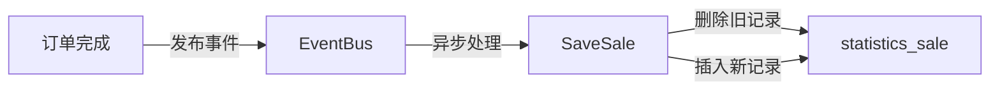

# 业务逻辑与规则引擎

## 一、核心业务规则

### 1.1 订单金额计算规则

**实收金额**：
```
实收金额 = 支付金额 - 退款金额 - 余额支付
received_amount = payment_amount - refund_amount - payment_balance
```

**营业收入**：
```
营业收入 = 支付金额 - 退款金额 - 退款余额 - 商品税 - 服务税 + 退款税
```

### 1.2 订单状态过滤规则

| 订单状态 | 状态码 | 是否纳入统计 |
|---------|-------|-------------|
| 已完成 | SaleOrderStatusFinish (1) | ✓ |
| 待处理 | SaleOrderStatusPending (0) | ✗ |
| 已取消 | SaleOrderStatusCanceled (2) | ✗ |

### 1.3 渠道分类规则

```
渠道判断优先级：
1. is_takeout = 1 → 外送渠道
2. desk_uuid > 0 → 桌台渠道
3. order_source_uuid > 0 → 外卖来源
4. dining_method = 1 → 外带
5. 其他 → 店内点餐
```

## 二、多租户统计架构

### 2.1 数据隔离机制

采用**数据库级别隔离**，每个商户拥有独立数据库实例：

```go
db := database.GetDBManager(config.Database).GetDB(ctx.GetCompanyUuid())
```

### 2.2 公司级别汇总

`CountCompanyBusinessSummary` 支持跨多个商户的汇总统计：
- 并行查询各商户数据（最大并发数 = 10）
- 支持明细报表和汇总报表两种模式

## 三、时间维度处理

### 3.1 时区转换

```go
timezone := ctx.GetCompanySetting().Timezone
timeUtil := utils.SetTimezone(timezone)
startTime, endTime := timeUtil.TodayStartEndUnix()
```

### 3.2 时间类型快捷方式

| TimeType | 含义 |
|----------|------|
| 1 | 今天 |
| 2 | 昨天 |
| 3 | 本周 |
| 4 | 本月 |
| 5 | 近7天 |
| 6 | 上月 |
| 7 | 今年 |

## 四、数据一致性保障

### 4.1 事件驱动更新



### 4.2 数据管理排除

通过 `ExcludeDataManage` 参数控制：
- 测试订单排除
- 错误数据修正
- 业务调整订单

## 五、用户分析维度

| 维度 | 字段 | 说明 |
|-----|------|------|
| 国籍 | nationality_uuid | 客户国籍分布 |
| 订单来源 | order_source_uuid | 自助点餐来源 |
| 桌台来源 | source | 桌台订单来源 |
| 就餐方式 | dining_method | 堂食/外带分布 |
| 外卖平台 | platform | Grab/LineMan 分布 |

## 六、决策点与边界处理

| 决策点 | 规则 | 处理 |
|-------|------|------|
| 合单订单 | is_meger = 1 | 总额包含，平均值排除 |
| 退款订单 | refund_amount > 0 | 从支付金额中扣除 |
| 免单订单 | free_amount > 0 | 不计入营收 |
| 赠菜订单 | gift_amount > 0 | 不计入营收 |
