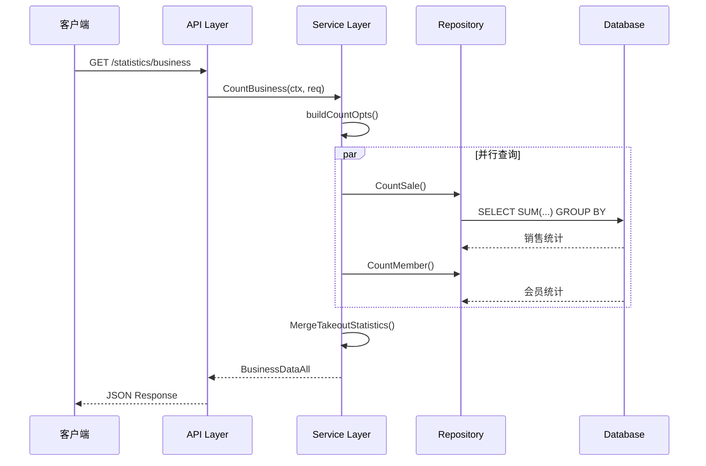

# 关键路径与性能设计

## 一、实时统计路径

### 1.1 请求处理链路

```
API Handler → Service.CountBusiness() → Repository.CountSale() → Database
```

核心编排在 `CountBusiness` 方法中完成，协调多个子统计方法：
- CountSale() - 销售数据统计
- CountMember() - 会员消费统计
- CountPaymentMethod() - 支付方式统计

### 1.2 上下文传递机制

| 上下文方法 | 用途 |
|-----------|------|
| ctx.GetDB() | 获取商户专属数据库连接 |
| ctx.GetCompanySetting() | 获取门店设置（时区、业务开关）|
| ctx.GetLanguage() | 多语言字段返回 |

### 1.3 查询条件构建

`buildCountOpts` 方法处理时间参数的多种格式，支持 TimeType 枚举、Unix 时间戳、日期字符串三种方式。

## 二、导出统计路径

### 2.1 两阶段异步模式

**阶段一：快速响应**
- 验证是否存在进行中的导出任务
- 预查询验证数据量（限制 ≤ 1000 条）
- 创建 ExportRecord（Status = PENDING）
- 启动异步任务，立即返回

**阶段二：后台处理**
- 执行 CountBusinessSummary() 获取完整数据
- 构建多语言表头（支持 9 种语言）
- 使用 excelize 库生成 XLSX 文件
- 上传文件至对象存储
- 更新 ExportRecord 状态

## 三、事件驱动统计更新

### 3.1 触发时机

```
订单完成 → PublishStatisticsSaleEvent → EventBus → SaveSale()
```

### 3.2 SaveSale 处理逻辑

采用**先删后插**策略：
1. 删除该销售单的所有统计记录
2. 查询销售账单完整信息
3. 逐订单构建统计记录
4. 批量插入至各统计表

## 四、性能瓶颈分析

| 瓶颈点 | 原因 | 优化建议 |
|-------|------|---------|
| 双层 GROUP BY | 大数据量时全表扫描 | 创建物化视图预计算 |
| 复杂 CASE 表达式 | CPU 密集型操作 | 考虑字段冗余存储 |
| 缺乏缓存 | 每次查询都访问数据库 | 引入 Redis 缓存热点数据 |

## 五、调用链序列图


