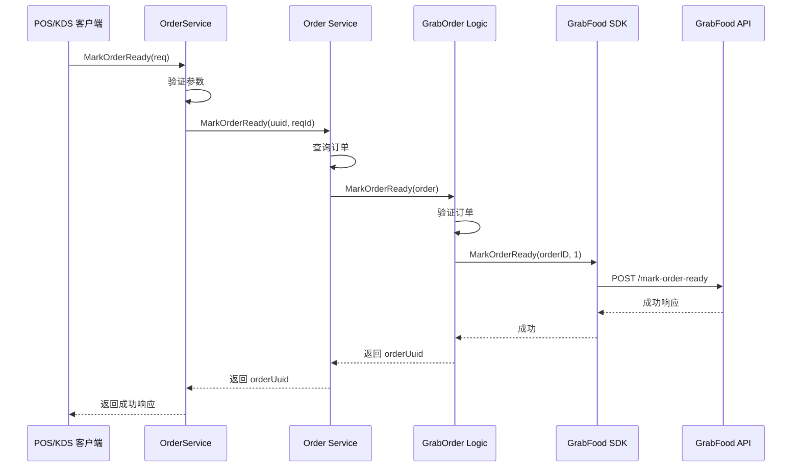

# 外卖状态管理 API 文档

> 本文档记录外卖状态管理相关的 API 接口。

## 概述

外卖状态管理 API 提供以下功能：

- 获取指定平台外卖状态
- 获取所有平台外卖状态
- 切换指定平台外卖状态
- 更新指定平台菜单数据

## 接口列表

### 1. 获取指定平台外卖状态

**接口地址**: `GET /api/v1/shop/takeout/status/{platform}`

**功能描述**: 获取指定外卖平台的状态信息

**请求参数**:

| 参数名 | 类型 | 必填 | 说明 |
|--------|------|------|------|
| platform | string | 是 | 外卖平台标识 (grab/lineman/foodpanda/shopeefood) |

**请求头**:

```
Authorization: Bearer {token}
Content-Type: application/json
```

**响应示例**:

```json
{
  "code": 1,
  "message": "success",
  "data": {
    "platform": "grab",
    "enabled": true,
    "menu": {
      "categories": [...],
      "items": [...]
    },
    "updatedAt": 1734268800
  }
}
```

**错误响应**:

```json
{
  "code": 0,
  "message": "平台不存在或未配置",
  "data": {}
}
```

### 2. 获取所有平台外卖状态

**接口地址**: `GET /api/v1/shop/takeout/status`

**功能描述**: 获取所有已配置外卖平台的状态信息

**请求参数**: 无

**请求头**:

```
Authorization: Bearer {token}
Content-Type: application/json
```

**响应示例**:

```json
{
  "code": 1,
  "message": "success",
  "data": {
    "list": [
      {
        "platform": "grab",
        "enabled": true,
        "menu": {...},
        "updatedAt": 1734268800
      },
      {
        "platform": "lineman",
        "enabled": false,
        "menu": null,
        "updatedAt": 1734268800
      }
    ]
  }
}
```

### 3. 切换指定平台外卖状态

**接口地址**: `PUT /api/v1/shop/takeout/status/{platform}`

**功能描述**: 开启或关闭指定外卖平台的功能

**请求参数**:

| 参数名 | 类型 | 必填 | 说明 |
|--------|------|------|------|
| platform | string | 是 | 外卖平台标识 |

**请求体**:

```json
{
  "enabled": true,
  "menu": {
    "categories": [...],
    "items": [...]
  }
}
```

**请求参数说明**:

| 参数名 | 类型 | 必填 | 说明 |
|--------|------|------|------|
| enabled | boolean | 是 | 是否开启外卖功能 |
| menu | object | 否 | 菜单数据（JSON格式） |

**请求头**:

```
Authorization: Bearer {token}
Content-Type: application/json
```

**响应示例**:

```json
{
  "code": 1,
  "message": "success",
  "data": {
    "platform": "grab",
    "enabled": true,
    "menu": {...},
    "updatedAt": 1734268800
  }
}
```

### 4. 更新指定平台菜单数据

**接口地址**: `PUT /api/v1/shop/takeout/menu/{platform}`

**功能描述**: 更新指定外卖平台的菜单数据

**请求参数**:

| 参数名 | 类型 | 必填 | 说明 |
|--------|------|------|------|
| platform | string | 是 | 外卖平台标识 |

**请求体**:

```json
{
  "categories": [
    {
      "id": "category_001",
      "name": "主菜",
      "items": [
        {
          "id": "item_001",
          "name": "宫保鸡丁",
          "price": 25.00,
          "description": "经典川菜"
        }
      ]
    }
  ]
}
```

**请求头**:

```
Authorization: Bearer {token}
Content-Type: application/json
```

**响应示例**:

```json
{
  "code": 1,
  "message": "菜单数据更新成功",
  "data": {}
}
```

## 错误码说明

| 错误码 | 说明 |
|--------|------|
| 0 | 请求失败 |
| 1 | 请求成功 |
| 1001 | 参数错误 |
| 1002 | 权限不足 |
| 1003 | 平台不支持 |
| 1004 | 数据验证失败 |

## 数据格式说明

### 平台标识

支持的平台标识：

- `grab`: Grab 外卖
- `lineman`: Lineman 外卖
- `foodpanda`: Foodpanda 外卖
- `shopeefood`: ShopeeFood 外卖

### 菜单数据格式

菜单数据为 JSON 格式，包含分类和商品信息：

```json
{
  "categories": [
    {
      "id": "category_id",
      "name": "分类名称",
      "description": "分类描述",
      "sort": 1,
      "items": [
        {
          "id": "item_id",
          "name": "商品名称",
          "price": 25.50,
          "description": "商品描述",
          "image": "image_url",
          "available": true
        }
      ]
    }
  ]
}
```

## 缓存策略

- 单个平台状态缓存：5分钟
- 所有平台状态缓存：5分钟
- 状态变更时自动清理相关缓存

## 权限要求

所有接口都需要有效的 JWT Token 认证，并且用户需要有相应的店铺管理权限。

---

## gRPC 接口

### 订单服务 (OrderService)

ttpos-takeout 提供 gRPC 接口用于订单管理，服务定义位于 `ttpos-bmp/app/ttpos-takeout/manifest/protobuf/order/order.proto`。

#### 1. GetOrderInfo - 获取订单信息

**功能描述**: 根据店铺 UUID 和订单 UUID 获取订单详细信息。

**请求消息**: `GetOrderInfoReq`

| 字段 | 类型 | 必填 | 说明 |
|------|------|------|------|
| shop_uuid | string | 是 | TTPOS 店铺 UUID |
| order_uuid | string | 是 | TTPOS 订单 UUID |
| request_id | string | 否 | 请求追踪 ID（可选） |

**响应消息**: `takeout.ApiResponse`

包装的数据为 `GetOrderInfoResp`:

| 字段 | 类型 | 说明 |
|------|------|------|
| shop_uuid | string | TTPOS 店铺 UUID |
| order_status | string | 订单状态 |
| order_type | string | 订单类型 |
| raw_data | string | 原始 JSON 数据 |
| provider_name | string | 渠道名称: grab, foodpanda, lineman |

**响应示例**:

```json
{
  "code": "0",
  "message": "success",
  "data": {
    "@type": "type.googleapis.com/order.GetOrderInfoResp",
    "shop_uuid": "1234567890",
    "order_status": "Accepted",
    "order_type": "delivery",
    "raw_data": "{...}",
    "provider_name": "grab"
  }
}
```

#### 2. PrepareOrder - 准备订单（接受/拒绝）

**功能描述**: 接受或拒绝外卖订单。

**请求消息**: `PrepareOrderReq`

| 字段 | 类型 | 必填 | 说明 |
|------|------|------|------|
| takeout_order_uuid | string | 是 | TTPOS 订单 UUID |
| to_state | string | 是 | 目标状态: Accepted/Rejected |
| request_id | string | 否 | 请求追踪 ID（可选） |

**响应消息**: `takeout.ApiResponse`

包装的数据为 `PrepareOrderResp`:

| 字段 | 类型 | 说明 |
|------|------|------|
| order_uuid | string | 订单 UUID |

**响应示例**:

```json
{
  "code": "0",
  "message": "success",
  "data": {
    "@type": "type.googleapis.com/order.PrepareOrderResp",
    "order_uuid": "1234567890"
  }
}
```

#### 3. MarkOrderReady - 标记订单准备完成

**功能描述**: 通知外卖平台订单已准备完成，可以开始配送。

**请求消息**: `MarkOrderReadyReq`

| 字段 | 类型 | 必填 | 说明 |
|------|------|------|------|
| takeout_order_uuid | string | 是 | 外卖订单 UUID |
| request_id | string | 否 | 请求追踪 ID（可选，用于幂等性） |

**响应消息**: `takeout.ApiResponse`

包装的数据为 `MarkOrderReadyResp`:

| 字段 | 类型 | 说明 |
|------|------|------|
| order_uuid | string | 订单 UUID |

**响应示例**:

**成功响应**:
```json
{
  "code": "0",
  "message": "success",
  "data": {
    "@type": "type.googleapis.com/order.MarkOrderReadyResp",
    "order_uuid": "1234567890"
  }
}
```

**错误响应 - 参数错误**:
```json
{
  "code": "400",
  "message": "takeout_order_uuid 不能为空",
  "data": null
}
```

**错误响应 - 订单不存在**:
```json
{
  "code": "500",
  "message": "订单不存在",
  "data": null
}
```

**错误响应 - API 调用失败**:
```json
{
  "code": "500",
  "message": "调用 GrabFood API 失败: network timeout",
  "data": null
}
```

**使用说明**:

1. **前置条件**: 订单必须已被接受（状态为 Accepted）
2. **幂等性**: 支持重复调用，多次调用同一订单不会产生副作用
3. **markStatus**: 默认固定为 1（订单准备完成）
4. **支持平台**: 目前仅支持 Grab 渠道订单
5. **状态更新**: 本地订单状态不会立即更新，等待平台回调更新

**调用流程**:



**相关文档**:

- Spec 文档: `docs/shared/specs/active/story-bmp-grab-mark-order-ready/requirements.md`
- 设计文档: `docs/shared/specs/active/story-bmp-grab-mark-order-ready/design.md`
- GrabFood API 文档: [Mark Order Ready](https://developer.grab.com/docs/grabfood/api/v1-1-3/#tag/mark-order-ready)

---

### gRPC 错误码说明

| 错误码 | 说明 |
|--------|------|
| 0 | 成功 |
| 400 | 参数错误（参数缺失或格式错误） |
| 404 | 资源不存在（订单不存在） |
| 500 | 服务器错误（业务逻辑错误、API 调用失败等） |

### gRPC 服务连接

**服务注册**: ttpos-takeout 服务通过 Nacos 进行服务注册和发现

**服务名称**: `ttpos-takeout`

**协议**: gRPC

**认证**: 通过 Nacos 服务发现，内部服务间通信

---

## 更新历史

- v1.1.0 (2025-12-24): 新增 gRPC 接口文档，添加 MarkOrderReady 接口
- v1.0.0 (2025-12-13): 初始版本，支持基本的平台状态管理和菜单数据更新
