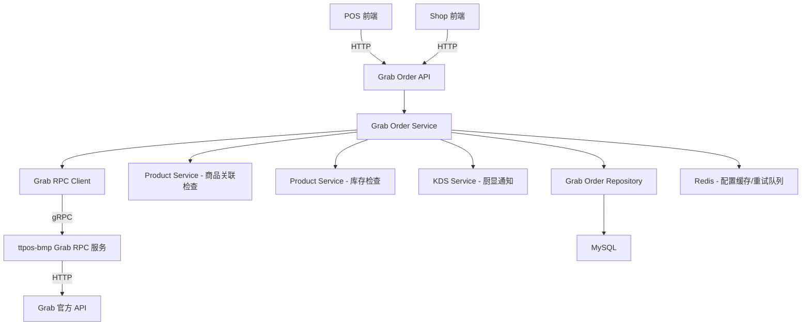

# POS 收银机 - 外卖平台订单集成 设计文档（多平台）

> 本文档定义外卖平台订单集成到 POS 收银系统的技术设计和实现方案（后端部分）。支持 Grab、Foodpanda、Lineman 等多个外卖平台。

## 📋 概述

本功能的后端职责：
1. **对接多平台 RPC 服务**：通过 gRPC 调用 ttpos-bmp 提供的各外卖平台 RPC 服务，获取订单数据并同步状态
2. **提供统一 HTTP API**：为前端（POS 和 Shop）提供统一的订单列表、详情、接单、拒单、配置管理等接口
3. **业务逻辑处理**：实现商品关联检查、库存检查、自动接单判断、KDS 通知等核心逻辑
4. **多平台支持**：通过 `platform` 字段区分不同外卖平台，支持灵活扩展

**支持的平台**：
- **Grab** (grab) - 当前优先实现
- **Foodpanda** (foodpanda) - 后续扩展
- **LINE MAN** (lineman) - 后续扩展  
- **ShopeeFood** (shopeefood) - 后续扩展

**技术栈**：Go 1.23+ + Gin + GORM + gRPC (Client) + Redis + MySQL

---

## 🎯 规范对齐

### Go Main 规范 (go-main.mdc)

本设计严格遵循 Go Main 开发规范：

- ✅ **分层架构**：Controller → Service → Repository
- ✅ **Service 依赖规则**：Service 只依赖其他 Service 接口，不直接依赖 Repository
- ✅ **Repository 持有规则**：Repository 只持有 `*gorm.DB`，不持有 DBManager
- ✅ **接口命名**：接口以 `I` 开头（如 `IGrabOrderSrv`），实现以 `Impl` 或具体名称结尾
- ✅ **错误处理**：不使用 panic，统一返回 error，使用 `errors.WithMessage` 包装错误
- ✅ **URL 命名**：使用 snake_case（如 `/api/v1/takeout/grab/orders`）
- ✅ **事务管理**：使用 DBManager 管理事务

### API 设计规范 (api.mdc)

- ✅ **响应格式**：统一使用 `{code, message, data{}}`
- ✅ **data 字段约束**：data 必须是对象，不能是 null 或数组
- ✅ **分页信息**：分页数据放在 data 内的 meta 字段
- ✅ **URL 规范**：RESTful 风格 + snake_case

### 数据库规范 (database.mdc)

- ✅ **必需字段**：id, uuid, create_time, update_time, delete_time
- ✅ **时间字段**：int 类型，\_time 结尾，默认值 0
- ✅ **金额字段**：decimal(20,8)
- ✅ **UUID 字段**：bigint unsigned
- ✅ **表名**：ttpos\_ 前缀
- ✅ **字段名**：snake_case
- ✅ **软删除**：delete_time = 0 表示未删除

---

## 🔄 代码复用分析

### 可复用的现有组件

1. **外卖模块基础结构**：
   - `main/app/modules/takeout/` - 外卖模块目录结构
   - `main/app/modules/takeout/infrastructure/adapter/grab/grab_converter.go` - Grab 数据转换器（已存在，需扩展）
   - `main/app/service/product_takeout.go` - 外卖商品服务（商品关联检查可复用）
   
2. **库存服务**：
   - `main/app/service/product.go` - 商品和库存服务（库存检查逻辑）
   
3. **KDS 服务**：
   - `main/app/service/kds.go` - KDS 通知服务（接单后通知厨显）
   
4. **Redis 队列**：
   - `pkg/redis/` - Redis 客户端封装（失败重试队列）
   
5. **UUID 生成**：
   - `pkg/uuid/` - UUID 生成工具（订单唯一标识）
   
6. **数据库工具**：
   - `main/app/repository/` - Repository 选项模式参考

### 集成点

1. **Grab RPC 服务**（ttpos-bmp 团队提供）：
   - 获取新订单
   - 接单/拒单
   - 状态同步
   - 获取拒单原因列表

2. **现有订单系统**：
   - 订单状态机
   - 订单通知机制
   - 订单列表查询

3. **现有商品系统**：
   - 商品关联映射
   - 库存查询
   - 规格和修饰符管理

---

## 🏗️ 架构设计

### 分层设计原则

**Go Main 三层架构**:

```
API 层 (Controller/API)
  ↓ 依赖
Service 层 (Business Logic)
  ↓ 依赖（通过 Service 接口）
Repository 层 (Data Access)
```

**依赖规则**:

- ✅ API 层依赖 Service 接口
- ✅ Service 层依赖其他 Service 接口
- ❌ Service 层不能直接依赖 Repository
- ✅ Service 层持有 DBManager，通过 DBManager.GetDB() 创建 Repository
- ✅ Repository 层只持有 `*gorm.DB`

### 架构图



### 模块划分

#### 核心模块结构

```
main/app/modules/takeout/
├── domain/
│   ├── entity/                    # 领域实体
│   │   └── grab_order.go          # Grab 订单实体
│   └── value_object/              # 值对象
│       ├── order_state.go         # 订单状态
│       └── currency.go            # 货币信息
├── application/
│   └── service/                   # 应用服务
│       ├── grab_order_service.go  # Grab 订单服务
│       └── grab_sync_service.go   # 订单同步服务
├── infrastructure/
│   ├── adapter/
│   │   └── grab/
│   │       ├── grab_rpc_client.go      # Grab RPC 客户端
│   │       └── grab_converter.go       # 数据转换器（已存在）
│   └── persistence/
│       ├── grab_order_repository.go    # Grab 订单仓储
│       └── grab_mapping_repository.go  # 商品关联映射仓储
└── interfaces/
    └── api/
        ├── grab_order_api.go          # Grab 订单 API
        └── grab_settings_api.go       # Grab 配置 API
```

#### Go Main 核心文件

- **Model 层**: `main/app/model/`
  - `takeout_order.go` - 外卖订单模型
  - `takeout_order_item.go` - 外卖订单商品模型
  - `takeout_item_mapping.go` - 商品关联映射模型
  - `takeout_modifier_mapping.go` - 规格关联映射模型
  - `takeout_sync_log.go` - 订单同步日志模型
  - `takeout_settings.go` - 外卖平台配置模型

- **Repository 层**: `main/app/repository/`
  - `takeout_order_repo.go` - 订单仓储接口和实现
  - `takeout_item_mapping_repo.go` - 商品映射仓储接口和实现
  - `takeout_sync_log_repo.go` - 同步日志仓储接口和实现

- **Service 层**: `main/app/service/`
  - `takeout_order_srv.go` - 订单服务接口和实现
  - `takeout_sync_srv.go` - 同步服务接口和实现

- **API 层**: `main/app/api/`
  - `takeout_order_api.go` - 订单 API（POS 端）
  - `takeout_settings_api.go` - 配置 API（Shop 端）

- **DTO 层**: `main/app/dto/`
  - `req/takeout_order_req.go` - 请求 DTO
  - `resp/takeout_order_resp/takeout_order_resp.go` - 响应 DTO

- **Constant 层**: `main/app/constant/`
  - `takeout_platform.go` - 平台常量定义

---

## 🗄️ 数据库设计

### 数据表设计

> **设计原则**：支持多外卖平台（Grab、Foodpanda、Lineman 等），通用字段 + 平台特定数据（JSON）

#### 表 1: ttpos_takeout_order

```sql
CREATE TABLE IF NOT EXISTS `ttpos_takeout_order` (
    `id` bigint unsigned NOT NULL AUTO_INCREMENT COMMENT '主键ID',
    `uuid` bigint unsigned NOT NULL DEFAULT 0 COMMENT '唯一标识',
    `takeout_order_uuid` varchar(255) NOT NULL DEFAULT '' COMMENT 'rpc takeout 订单ID',
    
    -- 平台信息
    `platform` varchar(20) NOT NULL DEFAULT '' COMMENT '外卖平台: grab,foodpanda,lineman,etc',
    `platform_order_id` varchar(255) NOT NULL DEFAULT '' COMMENT '平台订单ID',
    `short_order_number` varchar(50) NOT NULL DEFAULT '' COMMENT '短订单号(用于展示)',
    `merchant_id` varchar(100) NOT NULL DEFAULT '' COMMENT '商户ID',
    
    -- 订单状态
    `order_state` tinyint NOT NULL DEFAULT 1 COMMENT '订单状态: 1=待接单,2=已接单,3=制作中,4=已完成,5=已拒单',
    `is_abnormal` tinyint NOT NULL DEFAULT 0 COMMENT '是否异常: 0=正常,1=异常',
    `abnormal_detail` text COMMENT '异常详情(JSON)',
    `stock_status` tinyint NOT NULL DEFAULT 1 COMMENT '库存状态: 1=充足,2=不足',
    
    -- 价格信息（单位：分）
    `subtotal` bigint NOT NULL DEFAULT 0 COMMENT '小计金额',
    `delivery_fee` bigint NOT NULL DEFAULT 0 COMMENT '配送费',
    `total_amount` bigint NOT NULL DEFAULT 0 COMMENT '总金额(顾客支付)',
    `platform_discount` bigint NOT NULL DEFAULT 0 COMMENT '平台优惠',
    `merchant_discount` bigint NOT NULL DEFAULT 0 COMMENT '商户优惠',
    `tax` bigint NOT NULL DEFAULT 0 COMMENT '税费',
    
    -- 货币信息
    `currency_code` varchar(10) NOT NULL DEFAULT '' COMMENT '货币代码(THB,VND等)',
    `currency_symbol` varchar(10) NOT NULL DEFAULT '' COMMENT '货币符号(฿,$等)',
    `currency_exponent` tinyint NOT NULL DEFAULT 2 COMMENT '货币指数',
    
    -- 支付信息
    `payment_type` varchar(20) NOT NULL DEFAULT '' COMMENT '支付方式: CASH,ONLINE',
    
    -- 订单时间
    `order_time` int NOT NULL DEFAULT 0 COMMENT '下单时间(Unix时间戳)',
    `accepted_time` int NOT NULL DEFAULT 0 COMMENT '接单时间',
    `completed_time` int NOT NULL DEFAULT 0 COMMENT '完成时间',
    `rejected_time` int NOT NULL DEFAULT 0 COMMENT '拒单时间',
    `estimated_ready_time` int NOT NULL DEFAULT 0 COMMENT '预计完成时间',
    `max_ready_time` int NOT NULL DEFAULT 0 COMMENT '最大完成时间',
    
    -- 其他通用信息
    `cutlery` tinyint NOT NULL DEFAULT 0 COMMENT '是否需要餐具: 0=否,1=是',
    `order_type` varchar(50) NOT NULL DEFAULT '' COMMENT '订单类型: delivery,pickup等',
    `order_accepted_type` varchar(20) NOT NULL DEFAULT '' COMMENT '接单类型: AUTO,MANUAL',
    
    -- 平台特定数据（JSON 格式）
    `platform_data` mediumtext COMMENT '平台特定字段(JSON): Grab的partner_merchant_id等',
    
    -- 完整原始数据（JSON 格式）
    `raw_data` mediumtext COMMENT '平台原始订单数据(JSON)',
    
    -- 操作信息
    `accepted_by` bigint unsigned NOT NULL DEFAULT 0 COMMENT '接单人UUID',
    `rejected_by` bigint unsigned NOT NULL DEFAULT 0 COMMENT '拒单人UUID',
    `reject_reason_code` varchar(50) NOT NULL DEFAULT '' COMMENT '拒单原因代码',
    `reject_reason` varchar(255) NOT NULL DEFAULT '' COMMENT '拒单原因',
    
    -- 标准字段
    `create_time` int NOT NULL DEFAULT 0 COMMENT '创建时间',
    `update_time` int NOT NULL DEFAULT 0 COMMENT '更新时间',
    `delete_time` int NOT NULL DEFAULT 0 COMMENT '删除时间',
    
    PRIMARY KEY (`id`),
    UNIQUE KEY `uk_uuid` (`uuid`),
    UNIQUE KEY `uk_platform_order` (`platform`, `platform_order_id`, `delete_time`),
    KEY `idx_platform` (`platform`, `delete_time`),
    KEY `idx_order_state` (`order_state`, `delete_time`),
    KEY `idx_order_time` (`order_time`, `delete_time`),
    KEY `idx_short_order_number` (`short_order_number`, `delete_time`)
) ENGINE=InnoDB DEFAULT CHARSET=utf8mb4 COMMENT='外卖订单表(多平台)';
```

**平台代码**：
- `grab` - Grab
- `foodpanda` - Foodpanda
- `lineman` - LINE MAN
- `shopeefood` - ShopeeFood

**迁移文件**: `admin/database/migrations/20251222100000_create_ttpos_takeout_order_table.php`

#### 表 2: ttpos_takeout_order_items

```sql
CREATE TABLE IF NOT EXISTS `ttpos_takeout_order_items` (
    `id` bigint unsigned NOT NULL AUTO_INCREMENT COMMENT '主键ID',
    `uuid` bigint unsigned NOT NULL DEFAULT 0 COMMENT '唯一标识',
    `takeout_order_uuid` bigint unsigned NOT NULL DEFAULT 0 COMMENT '外卖订单UUID',
    `platform` varchar(20) NOT NULL DEFAULT '' COMMENT '外卖平台: grab,foodpanda,lineman,etc',
    
    -- 平台商品信息
    `platform_item_id` varchar(100) NOT NULL DEFAULT '' COMMENT '平台商品ID',
    `platform_item_name` varchar(255) NOT NULL DEFAULT '' COMMENT '平台商品名称',
    
    -- TTPOS 商品信息（关联映射后）
    `ttpos_product_uuid` bigint unsigned NOT NULL DEFAULT 0 COMMENT 'TTPOS商品UUID',
    `ttpos_sku_uuid` bigint unsigned NOT NULL DEFAULT 0 COMMENT 'TTPOS规格UUID',
    
    -- 商品数量和价格
    `quantity` int NOT NULL DEFAULT 0 COMMENT '数量',
    `price` bigint NOT NULL DEFAULT 0 COMMENT '单价(分)',
    `tax` bigint NOT NULL DEFAULT 0 COMMENT '税费(分)',
    `specifications` varchar(500) NOT NULL DEFAULT '' COMMENT '规格说明',
    
    -- 修饰符信息（JSON 格式）
    `modifiers` text COMMENT '修饰符列表(JSON)',
    
    -- 关联状态
    `is_mapped` tinyint NOT NULL DEFAULT 0 COMMENT '是否已关联: 0=未关联,1=已关联',
    
    -- 平台特定数据（JSON 格式）
    `platform_data` text COMMENT '平台特定字段(JSON)',
    
    -- 标准字段
    `create_time` int NOT NULL DEFAULT 0 COMMENT '创建时间',
    `update_time` int NOT NULL DEFAULT 0 COMMENT '更新时间',
    `delete_time` int NOT NULL DEFAULT 0 COMMENT '删除时间',
    
    PRIMARY KEY (`id`),
    UNIQUE KEY `uk_uuid` (`uuid`),
    KEY `idx_takeout_order_uuid` (`takeout_order_uuid`, `delete_time`),
    KEY `idx_platform_item` (`platform`, `platform_item_id`, `delete_time`)
) ENGINE=InnoDB DEFAULT CHARSET=utf8mb4 COMMENT='外卖订单商品表(多平台)';
```

**迁移文件**: `admin/database/migrations/20251222100001_create_ttpos_takeout_order_items_table.php`

#### 表 3: ttpos_takeout_item_mapping

```sql
CREATE TABLE IF NOT EXISTS `ttpos_takeout_item_mapping` (
    `id` bigint unsigned NOT NULL AUTO_INCREMENT COMMENT '主键ID',
    `uuid` bigint unsigned NOT NULL DEFAULT 0 COMMENT '唯一标识',
    `platform` varchar(20) NOT NULL DEFAULT '' COMMENT '外卖平台: grab,foodpanda,lineman,etc',
    
    -- 平台商品信息
    `platform_item_id` varchar(100) NOT NULL DEFAULT '' COMMENT '平台商品ID',
    `platform_item_name` varchar(255) NOT NULL DEFAULT '' COMMENT '平台商品名称',
    
    -- TTPOS 商品信息
    `ttpos_product_uuid` bigint unsigned NOT NULL DEFAULT 0 COMMENT 'TTPOS商品UUID',
    `ttpos_sku_uuid` bigint unsigned NOT NULL DEFAULT 0 COMMENT 'TTPOS规格UUID',
    
    -- 状态
    `is_active` tinyint NOT NULL DEFAULT 1 COMMENT '是否启用: 0=禁用,1=启用',
    
    -- 标准字段
    `create_time` int NOT NULL DEFAULT 0 COMMENT '创建时间',
    `update_time` int NOT NULL DEFAULT 0 COMMENT '更新时间',
    `delete_time` int NOT NULL DEFAULT 0 COMMENT '删除时间',
    
    PRIMARY KEY (`id`),
    UNIQUE KEY `uk_uuid` (`uuid`),
    UNIQUE KEY `uk_platform_item` (`platform`, `platform_item_id`, `delete_time`),
    KEY `idx_platform` (`platform`, `delete_time`),
    KEY `idx_ttpos_product` (`ttpos_product_uuid`, `delete_time`)
) ENGINE=InnoDB DEFAULT CHARSET=utf8mb4 COMMENT='外卖商品关联映射表(多平台)';
```

**迁移文件**: `admin/database/migrations/20251222100002_create_ttpos_takeout_item_mapping_table.php`

#### 表 4: ttpos_takeout_modifier_mapping

```sql
CREATE TABLE IF NOT EXISTS `ttpos_takeout_modifier_mapping` (
    `id` bigint unsigned NOT NULL AUTO_INCREMENT COMMENT '主键ID',
    `uuid` bigint unsigned NOT NULL DEFAULT 0 COMMENT '唯一标识',
    `shop_uuid` bigint unsigned NOT NULL DEFAULT 0 COMMENT '门店UUID',
    `platform` varchar(20) NOT NULL DEFAULT '' COMMENT '外卖平台: grab,foodpanda,lineman,etc',
    
    -- 平台修饰符信息
    `platform_modifier_id` varchar(100) NOT NULL DEFAULT '' COMMENT '平台修饰符ID',
    `platform_modifier_name` varchar(255) NOT NULL DEFAULT '' COMMENT '平台修饰符名称',
    
    -- TTPOS 规格/属性信息
    `ttpos_attribute_uuid` bigint unsigned NOT NULL DEFAULT 0 COMMENT 'TTPOS属性UUID',
    `ttpos_attribute_value_uuid` bigint unsigned NOT NULL DEFAULT 0 COMMENT 'TTPOS属性值UUID',
    
    -- 状态
    `is_active` tinyint NOT NULL DEFAULT 1 COMMENT '是否启用: 0=禁用,1=启用',
    
    -- 标准字段
    `create_time` int NOT NULL DEFAULT 0 COMMENT '创建时间',
    `update_time` int NOT NULL DEFAULT 0 COMMENT '更新时间',
    `delete_time` int NOT NULL DEFAULT 0 COMMENT '删除时间',
    
    PRIMARY KEY (`id`),
    UNIQUE KEY `uk_uuid` (`uuid`),
    UNIQUE KEY `uk_platform_modifier` (`platform`, `platform_modifier_id`, `delete_time`),
    KEY `idx_platform` (`platform`, `delete_time`),
    KEY `idx_ttpos_attribute` (`ttpos_attribute_uuid`, `delete_time`)
) ENGINE=InnoDB DEFAULT CHARSET=utf8mb4 COMMENT='外卖修饰符关联映射表(多平台)';
```

**迁移文件**: `admin/database/migrations/20251222100003_create_ttpos_takeout_modifier_mapping_table.php`

#### 表 5: ttpos_takeout_sync_logs

```sql
CREATE TABLE IF NOT EXISTS `ttpos_takeout_sync_logs` (
    `id` bigint unsigned NOT NULL AUTO_INCREMENT COMMENT '主键ID',
    `uuid` bigint unsigned NOT NULL DEFAULT 0 COMMENT '唯一标识',
    `platform` varchar(20) NOT NULL DEFAULT '' COMMENT '外卖平台: grab,foodpanda,lineman,etc',
    
    -- 同步信息
    `platform_order_id` varchar(100) NOT NULL DEFAULT '' COMMENT '平台订单ID',
    `sync_type` varchar(50) NOT NULL DEFAULT '' COMMENT '同步类型: new_order,status_update,accept,reject',
    `sync_status` tinyint NOT NULL DEFAULT 0 COMMENT '同步状态: 0=失败,1=成功,2=重试中',
    `retry_count` int NOT NULL DEFAULT 0 COMMENT '重试次数',
    
    -- 错误信息
    `error_code` varchar(50) NOT NULL DEFAULT '' COMMENT '错误代码',
    `error_message` text COMMENT '错误信息',
    
    -- 请求/响应数据
    `request_data` mediumtext COMMENT '请求数据(JSON)',
    `response_data` mediumtext COMMENT '响应数据(JSON)',
    
    -- 标准字段
    `create_time` int NOT NULL DEFAULT 0 COMMENT '创建时间',
    `update_time` int NOT NULL DEFAULT 0 COMMENT '更新时间',
    `delete_time` int NOT NULL DEFAULT 0 COMMENT '删除时间',
    
    PRIMARY KEY (`id`),
    UNIQUE KEY `uk_uuid` (`uuid`),
    KEY `idx_platform_order` (`platform`, `platform_order_id`, `delete_time`),
    KEY `idx_sync_status` (`sync_status`, `delete_time`),
    KEY `idx_create_time` (`create_time`, `delete_time`)
) ENGINE=InnoDB DEFAULT CHARSET=utf8mb4 COMMENT='外卖订单同步日志表(多平台)';
```

**迁移文件**: `admin/database/migrations/20251222100004_create_ttpos_takeout_sync_logs_table.php`

#### 表 6: ttpos_takeout_settings

```sql
CREATE TABLE IF NOT EXISTS `ttpos_takeout_settings` (
    `id` bigint unsigned NOT NULL AUTO_INCREMENT COMMENT '主键ID',
    `uuid` bigint unsigned NOT NULL DEFAULT 0 COMMENT '唯一标识',
    `platform` varchar(20) NOT NULL DEFAULT '' COMMENT '外卖平台: grab,foodpanda,lineman,etc',
    
    -- 基础配置
    `is_enabled` tinyint NOT NULL DEFAULT 0 COMMENT '是否启用: 0=关闭,1=开启',
    
    -- 自动接单配置
    `auto_accept` tinyint NOT NULL DEFAULT 0 COMMENT '自动接单开关: 0=关闭,1=开启',
    `max_amount` bigint NOT NULL DEFAULT 0 COMMENT '自动接单金额上限(分)',
    
    -- 平台特定配置（JSON 格式）
    `platform_config` text COMMENT '平台特定配置(JSON)',
    
    -- 标准字段
    `create_time` int NOT NULL DEFAULT 0 COMMENT '创建时间',
    `update_time` int NOT NULL DEFAULT 0 COMMENT '更新时间',
    `delete_time` int NOT NULL DEFAULT 0 COMMENT '删除时间',
    
    PRIMARY KEY (`id`),
    UNIQUE KEY `uk_uuid` (`uuid`),
    UNIQUE KEY `uk_platform` (`platform`, `delete_time`),
    KEY `idx_platform` (`platform`, `delete_time`)
) ENGINE=InnoDB DEFAULT CHARSET=utf8mb4 COMMENT='外卖平台配置表(多平台)';
```

**迁移文件**: `admin/database/migrations/20251222100005_create_ttpos_takeout_settings_table.php`

---

### 多平台设计说明

#### 1. 平台标识字段

所有核心表都添加 `platform` 字段：
- 值范围：`grab`, `foodpanda`, `lineman`, `shopeefood`
- 用于区分不同外卖平台的数据
- 索引策略：与业务字段组合建立联合索引

#### 2. 字段命名变更

| 原字段 (Grab 专用) | 新字段 (多平台通用) | 说明 |
|-------------------|-------------------|------|
| `grab_order_uuid` | `takeout_order_uuid` | 外卖订单UUID |
| `grab_item_id` | `platform_item_id` | 平台商品ID |
| `grab_modifier_id` | `platform_modifier_id` | 平台修饰符ID |
| `order_id` | `platform_order_id` | 平台订单ID |

#### 3. 平台特定数据存储策略

**通用字段**：
- 各平台都有的字段直接存储（如 `subtotal`, `delivery_fee`, `order_time`）

**平台特定字段**：
- 使用 `platform_data` JSON 字段存储
- 示例（Grab）：
  ```json
  {
    "partner_merchant_id": "123456",
    "grab_fund_promo": 500,
    "eater_payment": 44389
  }
  ```
- 示例（Foodpanda）：
  ```json
  {
    "vendor_id": "VN-12345",
    "pandago_delivery": true
  }
  ```

#### 4. 索引优化

所有多平台表的索引都包含 `platform` 字段：
- ✅ `uk_platform_order`: (`platform`, `platform_order_id`, `delete_time`)
- ✅ `uk_platform_item`: (`platform`, `platform_item_id`, `delete_time`)
- ✅ `uk_platform`: (`platform`, `delete_time`)

#### 5. 未来扩展性

新增平台时只需：
1. 在 `platform` 字段添加新值（代码层面）
2. 在 `platform_data` 中存储平台特定字段
3. 无需修改表结构

---

## 📊 数据模型

### Go Model 示例

```go
// main/app/model/takeout_order.go
type TakeoutOrder struct {
    Id                   uint64 `gorm:"column:id;primaryKey" json:"id"`
    Uuid                 uint64 `gorm:"column:uuid;uniqueIndex" json:"uuid"`
    
    // 平台信息
    Platform             string `gorm:"column:platform" json:"platform"`
    PlatformOrderId      string `gorm:"column:platform_order_id" json:"platform_order_id"`
    ShortOrderNumber     string `gorm:"column:short_order_number" json:"short_order_number"`
    MerchantId           string `gorm:"column:merchant_id" json:"merchant_id"`
    
    // 订单状态
    OrderState           int    `gorm:"column:order_state" json:"order_state"`
    IsAbnormal           int    `gorm:"column:is_abnormal" json:"is_abnormal"`
    AbnormalDetail       string `gorm:"column:abnormal_detail;type:text" json:"abnormal_detail"`
    StockStatus          int    `gorm:"column:stock_status" json:"stock_status"`
    
    // 价格信息
    Subtotal             int64  `gorm:"column:subtotal" json:"subtotal"`
    DeliveryFee          int64  `gorm:"column:delivery_fee" json:"delivery_fee"`
    TotalAmount          int64  `gorm:"column:total_amount" json:"total_amount"`
    PlatformDiscount     int64  `gorm:"column:platform_discount" json:"platform_discount"`
    MerchantDiscount     int64  `gorm:"column:merchant_discount" json:"merchant_discount"`
    Tax                  int64  `gorm:"column:tax" json:"tax"`
    
    // 货币信息
    CurrencyCode         string `gorm:"column:currency_code" json:"currency_code"`
    CurrencySymbol       string `gorm:"column:currency_symbol" json:"currency_symbol"`
    CurrencyExponent     int    `gorm:"column:currency_exponent" json:"currency_exponent"`
    
    // 支付信息
    PaymentType          string `gorm:"column:payment_type" json:"payment_type"`
    
    // 订单时间
    OrderTime            int64  `gorm:"column:order_time" json:"order_time"`
    AcceptedTime         int64  `gorm:"column:accepted_time" json:"accepted_time"`
    CompletedTime        int64  `gorm:"column:completed_time" json:"completed_time"`
    RejectedTime         int64  `gorm:"column:rejected_time" json:"rejected_time"`
    EstimatedReadyTime   int64  `gorm:"column:estimated_ready_time" json:"estimated_ready_time"`
    MaxReadyTime         int64  `gorm:"column:max_ready_time" json:"max_ready_time"`
    
    // 其他信息
    Cutlery              int    `gorm:"column:cutlery" json:"cutlery"`
    OrderType            string `gorm:"column:order_type" json:"order_type"`
    OrderAcceptedType    string `gorm:"column:order_accepted_type" json:"order_accepted_type"`
    
    // 平台特定数据
    PlatformData         string `gorm:"column:platform_data;type:mediumtext" json:"platform_data"`
    
    // 完整原始数据
    RawData              string `gorm:"column:raw_data;type:mediumtext" json:"raw_data"`
    
    // 操作信息
    AcceptedBy           uint64 `gorm:"column:accepted_by" json:"accepted_by"`
    RejectedBy           uint64 `gorm:"column:rejected_by" json:"rejected_by"`
    RejectReasonCode     string `gorm:"column:reject_reason_code" json:"reject_reason_code"`
    RejectReason         string `gorm:"column:reject_reason" json:"reject_reason"`
    
    // 标准字段
    CreateTime           int64  `gorm:"column:create_time" json:"create_time"`
    UpdateTime           int64  `gorm:"column:update_time" json:"update_time"`
    DeleteTime           int64  `gorm:"column:delete_time;index" json:"delete_time"`
}

func (*TakeoutOrder) TableName() string {
    return "ttpos_takeout_order"
}
```

```go
// main/app/model/takeout_order_item.go
type TakeoutOrderItem struct {
    Id                   uint64 `gorm:"column:id;primaryKey" json:"id"`
    Uuid                 uint64 `gorm:"column:uuid;uniqueIndex" json:"uuid"`
    TakeoutOrderUuid     uint64 `gorm:"column:takeout_order_uuid" json:"takeout_order_uuid"`
    Platform             string `gorm:"column:platform" json:"platform"`
    
    // 平台商品信息
    PlatformItemId       string `gorm:"column:platform_item_id" json:"platform_item_id"`
    PlatformItemName     string `gorm:"column:platform_item_name" json:"platform_item_name"`
    
    // TTPOS 商品信息
    TtposProductUuid     uint64 `gorm:"column:ttpos_product_uuid" json:"ttpos_product_uuid"`
    TtposSkuUuid         uint64 `gorm:"column:ttpos_sku_uuid" json:"ttpos_sku_uuid"`
    
    // 商品数量和价格
    Quantity             int    `gorm:"column:quantity" json:"quantity"`
    Price                int64  `gorm:"column:price" json:"price"`
    Tax                  int64  `gorm:"column:tax" json:"tax"`
    Specifications       string `gorm:"column:specifications" json:"specifications"`
    
    // 修饰符信息
    Modifiers            string `gorm:"column:modifiers;type:text" json:"modifiers"`
    
    // 关联状态
    IsMapped             int    `gorm:"column:is_mapped" json:"is_mapped"`
    
    // 平台特定数据
    PlatformData         string `gorm:"column:platform_data;type:text" json:"platform_data"`
    
    // 标准字段
    CreateTime           int64  `gorm:"column:create_time" json:"create_time"`
    UpdateTime           int64  `gorm:"column:update_time" json:"update_time"`
    DeleteTime           int64  `gorm:"column:delete_time;index" json:"delete_time"`
}

func (*TakeoutOrderItem) TableName() string {
    return "ttpos_takeout_order_items"
}
```

### 平台常量定义

```go
// main/app/constant/takeout_platform.go

package constant

// 外卖平台代码
const (
    TakeoutPlatformGrab       = "grab"       // Grab
    TakeoutPlatformFoodpanda  = "foodpanda"  // Foodpanda
    TakeoutPlatformLineman    = "lineman"    // LINE MAN
    TakeoutPlatformShopeefood = "shopeefood" // ShopeeFood
)

// 外卖平台名称映射
var TakeoutPlatformNames = map[string]string{
    TakeoutPlatformGrab:       "Grab",
    TakeoutPlatformFoodpanda:  "Foodpanda",
    TakeoutPlatformLineman:    "LINE MAN",
    TakeoutPlatformShopeefood: "ShopeeFood",
}

// 外卖订单状态
const (
    TakeoutOrderStatePending    = 1 // 待接单
    TakeoutOrderStateAccepted   = 2 // 已接单
    TakeoutOrderStateProcessing = 3 // 制作中
    TakeoutOrderStateCompleted  = 4 // 已完成
    TakeoutOrderStateRejected   = 5 // 已拒单
)

// 库存状态
const (
    TakeoutStockStatusSufficient   = 1 // 充足
    TakeoutStockStatusInsufficient = 2 // 不足
)

// 接单类型
const (
    TakeoutOrderAcceptedTypeAuto   = "AUTO"   // 自动接单
    TakeoutOrderAcceptedTypeManual = "MANUAL" // 手动接单
)
```

### DTO 定义

#### Request DTO

```go
// main/app/dto/req/takeout_order_req.go

// 订单列表请求
type TakeoutOrderListReq struct {
    PageNo    int    `json:"page_no" binding:"required"`
    PageSize  int    `json:"page_size" binding:"required"`
    Platform  string `json:"platform"`         // 平台筛选: grab,foodpanda,lineman (空=全部)
    Status    int    `json:"status"`           // 0=全部,1=待接单,2=已接单,3=制作中,4=已完成,5=已拒单
    StartTime int64  `json:"start_time"`       // 开始时间
    EndTime   int64  `json:"end_time"`         // 结束时间
    Search    string `json:"search"`           // 搜索关键词
}

// 接单请求
type TakeoutOrderAcceptReq struct {
    OrderUuid uint64 `json:"order_uuid" binding:"required"`
}

// 拒单请求
type TakeoutOrderRejectReq struct {
    OrderUuid        uint64 `json:"order_uuid" binding:"required"`
    RejectReasonCode string `json:"reject_reason_code" binding:"required"`
}

// 配置保存请求
type TakeoutSettingsSaveReq struct {
    Platform   string `json:"platform" binding:"required"` // grab,foodpanda,lineman
    IsEnabled  bool   `json:"is_enabled"`
    AutoAccept bool   `json:"auto_accept"`
    MaxAmount  int64  `json:"max_amount"` // 单位：分
}
```

#### Response DTO

```go
// main/app/dto/resp/takeout_order_resp/takeout_order_resp.go

// 订单响应
type TakeoutOrderResp struct {
    Uuid               uint64                `json:"uuid"`
    Platform           string                `json:"platform"`
    PlatformOrderId    string                `json:"platform_order_id"`
    ShortOrderNumber   string                `json:"short_order_number"`
    OrderState         int                   `json:"order_state"`
    IsAbnormal         int                   `json:"is_abnormal"`
    AbnormalDetail     string                `json:"abnormal_detail"`
    StockStatus        int                   `json:"stock_status"`
    Subtotal           int64                 `json:"subtotal"`
    DeliveryFee        int64                 `json:"delivery_fee"`
    TotalAmount        int64                 `json:"total_amount"`
    CurrencyCode       string                `json:"currency_code"`
    CurrencySymbol     string                `json:"currency_symbol"`
    PaymentType        string                `json:"payment_type"`
    OrderTime          int64                 `json:"order_time"`
    EstimatedReadyTime int64                 `json:"estimated_ready_time"`
    Items              []*TakeoutOrderItemResp `json:"items"`
}

// 订单商品响应
type TakeoutOrderItemResp struct {
    PlatformItemId string `json:"platform_item_id"`
    ProductName    string `json:"product_name"`
    Quantity       int    `json:"quantity"`
    Price          int64  `json:"price"`
    IsMapped       int    `json:"is_mapped"`
}

// 订单列表响应
type TakeoutOrderListResp struct {
    List []*TakeoutOrderResp `json:"list"`
    Meta *PageMeta           `json:"meta"`
}

type PageMeta struct {
    PageNo   int   `json:"page_no"`
    PageSize int   `json:"page_size"`
    Total    int64 `json:"total"`
}

// 配置响应
type TakeoutSettingsResp struct {
    Platform   string `json:"platform"`
    IsEnabled  bool   `json:"is_enabled"`
    AutoAccept bool   `json:"auto_accept"`
    MaxAmount  int64  `json:"max_amount"`
}

// 拒单原因响应
type TakeoutRejectReasonResp struct {
    Code string `json:"code"`
    Name string `json:"name"`
}
```

---

## 🔌 API 设计

### RESTful API

> **设计说明**：所有 API 都支持多平台，通过 `platform` 参数区分不同平台

#### API 1: 获取订单列表

**请求**:

- **URL**: `/api/v1/takeout/orders`
- **Method**: `GET`
- **Headers**:
  ```json
  {
    "Authorization": "Bearer {token}"
  }
  ```
- **Query Parameters**:
  ```
  page_no=1&page_size=20&platform=grab&status=1&search=GF-5447
  ```
  - `platform`: 平台筛选，可选值：`grab`、`foodpanda`、`lineman`（空=全部平台）
  - `status`: 订单状态（0=全部）
  - `search`: 搜索短订单号或订单ID

**响应**:

```json
{
  "code": 1,
  "message": "success",
  "data": {
    "list": [
      {
        "uuid": 123456,
        "platform": "grab",
        "platform_order_id": "123456789-C7WBHBVGE76GAA",
        "short_order_number": "GF-5447",
        "order_state": 1,
        "is_abnormal": 0,
        "stock_status": 1,
        "subtotal": 43389,
        "delivery_fee": 1000,
        "total_amount": 44389,
        "currency_code": "THB",
        "currency_symbol": "฿",
        "payment_type": "CASH",
        "order_time": 1734597846,
        "items": [...]
      }
    ],
    "meta": {
      "page_no": 1,
      "page_size": 20,
      "total": 50
    }
  }
}
```

#### API 2: 获取订单详情

**请求**:

- **URL**: `/api/v1/takeout/orders/:uuid`
- **Method**: `GET`
- **Headers**: 同上

**响应**: 同订单列表中的单条数据，但包含完整的 `items` 信息

#### API 3: 接单

**请求**:

- **URL**: `/api/v1/takeout/orders/:uuid/accept`
- **Method**: `POST`
- **Headers**: 同上
- **Body**: 无（从 Token 中获取操作人信息）

**响应**:

```json
{
  "code": 1,
  "message": "接单成功",
  "data": {
    "uuid": 123456,
    "order_state": 2,
    "accepted_time": 1734598000
  }
}
```

**错误响应**:

```json
{
  "code": 0,
  "message": "接单失败: Grab RPC 调用失败",
  "data": {}
}
```

#### API 4: 拒单

**请求**:

- **URL**: `/api/v1/takeout/orders/:uuid/reject`
- **Method**: `POST`
- **Headers**: 同上
- **Body**:
  ```json
  {
    "reject_reason_code": "OUT_OF_STOCK"
  }
  ```

**响应**: 同接单响应

#### API 5: 获取拒单原因列表

**请求**:

- **URL**: `/api/v1/takeout/:platform/reject_reasons`
- **Method**: `GET`
- **Headers**: 同上
- **Path Parameters**:
  - `platform`: 平台代码（grab、foodpanda、lineman）

**响应**:

```json
{
  "code": 1,
  "message": "success",
  "data": {
    "reasons": [
      {
        "code": "OUT_OF_STOCK",
        "name": "库存不足"
      },
      {
        "code": "RESTAURANT_TOO_BUSY",
        "name": "餐厅太忙"
      }
    ]
  }
}
```

#### API 6: 获取配置

**请求**:

- **URL**: `/api/v1/shop/takeout/:platform/settings`
- **Method**: `GET`
- **Headers**: 同上
- **Path Parameters**:
  - `platform`: 平台代码（grab、foodpanda、lineman）

**响应**:

```json
{
  "code": 1,
  "message": "success",
  "data": {
    "platform": "grab",
    "is_enabled": true,
    "auto_accept": true,
    "max_amount": 10000000
  }
}
```

#### API 7: 保存配置

**请求**:

- **URL**: `/api/v1/shop/takeout/:platform/settings`
- **Method**: `POST`
- **Headers**: 同上
- **Path Parameters**:
  - `platform`: 平台代码（grab、foodpanda、lineman）
- **Body**:
  ```json
  {
    "is_enabled": true,
    "auto_accept": true,
    "max_amount": 10000000
  }
  ```

**响应**: 同获取配置响应

---

### API 路由汇总

| API | Method | URL | 说明 |
|-----|--------|-----|------|
| 订单列表 | GET | `/api/v1/takeout/orders` | POS端，支持平台筛选 |
| 订单详情 | GET | `/api/v1/takeout/orders/:uuid` | POS端 |
| 接单 | POST | `/api/v1/takeout/orders/:uuid/accept` | POS端 |
| 拒单 | POST | `/api/v1/takeout/orders/:uuid/reject` | POS端 |
| 拒单原因 | GET | `/api/v1/takeout/:platform/reject_reasons` | POS端，按平台 |
| 获取配置 | GET | `/api/v1/shop/takeout/:platform/settings` | Shop端，按平台 |
| 保存配置 | POST | `/api/v1/shop/takeout/:platform/settings` | Shop端，按平台 |

---

## 🧩 Grab RPC 接口定义（待确认）

### Protobuf 定义（示例）

需要与 ttpos-bmp 团队确认的接口定义：

```protobuf
syntax = "proto3";

package grab;
option go_package = "ttpos-bmp/api/grab";

service GrabOrderService {
  // 获取新订单列表
  rpc GetNewOrders(GetNewOrdersRequest) returns (GetNewOrdersResponse);
  
  // 获取订单详情
  rpc GetOrderDetail(GetOrderDetailRequest) returns (GetOrderDetailResponse);
  
  // 接单
  rpc AcceptOrder(AcceptOrderRequest) returns (AcceptOrderResponse);
  
  // 拒单
  rpc RejectOrder(RejectOrderRequest) returns (RejectOrderResponse);
  
  // 获取拒单原因列表
  rpc GetRejectReasons(GetRejectReasonsRequest) returns (GetRejectReasonsResponse);
  
  // 更新订单状态
  rpc UpdateOrderStatus(UpdateOrderStatusRequest) returns (UpdateOrderStatusResponse);
}

message GetNewOrdersRequest {
  string merchant_id = 1;
  int64 since_time = 2;  // Unix 时间戳
}

message GetNewOrdersResponse {
  int32 code = 1;
  string message = 2;
  repeated GrabOrderData orders = 3;
}

message GrabOrderData {
  string order_id = 1;
  string short_order_number = 2;
  string merchant_id = 3;
  string partner_merchant_id = 4;
  string order_state = 5;
  int64 order_time = 6;
  CurrencyData currency = 7;
  PriceData price = 8;
  string payment_type = 9;
  repeated ItemData items = 10;
  string raw_json = 11;  // 原始 JSON 数据
}

message CurrencyData {
  string code = 1;
  string symbol = 2;
  int32 exponent = 3;
}

message PriceData {
  int64 subtotal = 1;
  int64 delivery_fee = 2;
  int64 eater_payment = 3;
  int64 grab_fund_promo = 4;
  int64 merchant_fund_promo = 5;
  int64 tax = 6;
}

message ItemData {
  string grab_item_id = 1;
  string id = 2;
  int32 quantity = 3;
  int64 price = 4;
  int64 tax = 5;
  string specifications = 6;
  repeated ModifierData modifiers = 7;
}

message ModifierData {
  string id = 1;
  int32 quantity = 2;
  int64 price = 3;
  int64 tax = 4;
}

message AcceptOrderRequest {
  string order_id = 1;
}

message AcceptOrderResponse {
  int32 code = 1;
  string message = 2;
}

message RejectOrderRequest {
  string order_id = 1;
  string reason_code = 2;
}

message RejectOrderResponse {
  int32 code = 1;
  string message = 2;
}

message GetRejectReasonsRequest {}

message GetRejectReasonsResponse {
  int32 code = 1;
  string message = 2;
  repeated RejectReason reasons = 3;
}

message RejectReason {
  string code = 1;
  string name = 2;
}
```

---

## ⚡ 缓存设计

### Redis 缓存

**缓存策略**:

1. **配置缓存**（多平台）:
   - Key: `ttpos:takeout:settings:{platform}`
   - 示例: `ttpos:takeout:settings:grab`
   - TTL: 1 小时
   - 更新策略: Write-Through（保存时同时更新缓存）

2. **订单列表缓存**（可选）:
   - Key: `ttpos:takeout:orders:{platform}:{status}:{page}`
   - 示例: `ttpos:takeout:orders:grab:1:1`
   - TTL: 1 分钟
   - 更新策略: Cache-Aside（查询时缓存，有变更时删除）

3. **失败重试队列**（多平台）:
   - Key: `ttpos:takeout:retry_queue:{platform}`
   - 示例: `ttpos:takeout:retry_queue:grab`
   - 数据结构: List
   - 消费策略: Worker 定时消费

4. **拒单原因缓存**（多平台）:
   - Key: `ttpos:takeout:reject_reasons:{platform}`
   - 示例: `ttpos:takeout:reject_reasons:grab`
   - TTL: 1 天
   - 更新策略: Cache-Aside

**示例**:

```go
// 缓存配置（多平台）
key := fmt.Sprintf("ttpos:takeout:settings:%s", platform)
cached, err := redis.Get(key)
if err == nil {
    return cached // 缓存命中
}

// 查询数据库
settings, err := repo.GetByPlatform(platform)
if err != nil {
    return err
}

// 写入缓存
redis.Set(key, settings, 1*time.Hour)
return settings
```

---

## 🚨 错误处理

### 错误场景

#### 场景 1: Grab RPC 调用失败

- **处理方式**: 记录错误日志，加入重试队列，返回错误给前端
- **用户影响**: 前端显示"接单失败，请稍后重试"
- **代码示例**:
  ```go
  resp, err := grabRPCClient.AcceptOrder(ctx, orderID)
  if err != nil {
      logger.Logger.Error("Grab RPC 调用失败", zap.Error(err), zap.String("order_id", orderID))
      // 加入重试队列
      retryQueue.Push(orderID, "accept")
      return errors.WithMessage(err, "接单失败: Grab RPC 调用失败")
  }
  ```

#### 场景 2: 商品未关联

- **处理方式**: 标记订单为异常，不自动接单，返回未关联商品列表
- **用户影响**: 前端显示"订单异常：以下商品未关联"，列出具体商品
- **代码示例**:
  ```go
  unmappedItems, err := s.checkItemMapping(order)
  if len(unmappedItems) > 0 {
      order.IsAbnormal = 1
      order.AbnormalDetail = toJSON(unmappedItems)
      // 不执行自动接单
      return nil
  }
  ```

#### 场景 3: 库存不足

- **处理方式**: 标记库存状态为不足，开启自动接单时跳过，手动接单时提示确认
- **用户影响**: 自动接单跳过；手动接单时前端显示确认对话框
- **代码示例**:
  ```go
  stockSufficient, insufficientItems := s.checkStock(order)
  if !stockSufficient {
      order.StockStatus = 2 // 库存不足
      // 开启自动接单时不执行
      if settings.AutoAccept {
          return nil // 跳过自动接单
      }
  }
  ```

---

## 🔒 安全设计

### 身份验证

- **JWT Token**: 所有 API 需要 Token 验证
- **Token 包含信息**: user_uuid, shop_uuid, company_uuid, role

### 权限控制

- **外卖权限**: 检查用户是否有"外卖"模块权限
- **API 权限**: 每个 API 检查用户权限（使用中间件）

### Grab RPC 安全

- **服务发现**: 通过 Nacos 动态发现各平台 RPC 服务
- **平台路由**: 根据 `platform` 字段路由到对应的 RPC 服务（Grab、Foodpanda 等）
- **超时控制**: 设置 10 秒超时
- **重试策略**: 最多重试 3 次

### 数据安全

- **敏感数据**: 顾客信息（如有）加密存储
- **SQL 注入防护**: 使用 GORM 参数化查询
- **XSS 防护**: 前端负责（后端只返回数据）

---

## 🧪 测试策略

### 单元测试

**目标覆盖率**:

- main/app/service: 70%+
- main/app/repository: 80%+
- **Order 相关: 100%**（高风险）

**测试内容**:

- Service 业务逻辑（商品关联检查、库存检查、自动接单判断）
- Repository 数据访问（CRUD 操作、选项方法）
- DTO 数据转换

**Mock 策略**:

- Mock Grab RPC 客户端
- Mock Product Service（库存检查）
- Mock KDS Service（厨显通知）

### API 测试

**测试工具**: Postman / 自动化测试

**测试内容**:

- API 接口调用
- 参数验证
- 响应格式
- 错误处理

### 集成测试

**测试流程**:

1. 订单同步 → 商品关联检查 → 库存检查 → 待接单
2. 手动接单 → Grab RPC 调用 → KDS 通知 → 已接单
3. 自动接单 → 判断规则 → 自动执行接单
4. 拒单 → Grab RPC 调用 → 已拒单

---

## 📈 性能优化

### 优化策略

1. **数据库优化**:
   - 添加索引（order_id, shop_uuid, order_state, order_time）
   - 优化查询（使用选项模式避免 N+1 查询）

2. **缓存优化**:
   - Redis 缓存配置信息（1 小时）
   - 缓存拒单原因列表（1 天）

3. **并发控制**:
   - 使用 Redis 分布式锁防止并发接单
   - 锁 Key: `ttpos:grab:lock:accept:{order_uuid}`

4. **异步处理**:
   - 订单同步使用 Worker 异步处理
   - 失败重试使用队列异步处理

### 性能指标

- 订单列表接口: < 200ms
- 接单/拒单接口: < 500ms（包含 RPC 调用）
- 数据库查询: < 50ms
- Grab RPC 调用: < 1000ms

---

## 📚 实现清单

### Phase 1: RPC 接口定义和数据库设计（2 天）

- [ ] 与 ttpos-bmp 团队确定 Protobuf 定义（优先 Grab）
- [ ] 创建数据库迁移文件（6 个表，支持多平台）
- [ ] 执行数据库迁移
- [ ] 创建 Go Model（6 个模型）
- [ ] 定义平台常量（`constant/takeout_platform.go`）

### Phase 2: 订单同步和检查逻辑（3 天）

- [ ] 实现 Grab RPC 客户端
- [ ] 实现平台路由器（根据 platform 分发到不同 RPC）
- [ ] 实现订单数据转换器（扩展现有 grab_converter.go）
- [ ] 实现商品关联检查逻辑（支持多平台）
- [ ] 实现库存检查逻辑
- [ ] 实现失败重试队列（支持多平台）

### Phase 3: HTTP API 实现（3 天）

- [ ] 实现 Repository 层（3 个 Repository，支持 platform 参数）
- [ ] 实现 Service 层（2 个 Service，支持多平台）
- [ ] 实现 API 层（2 个 API，统一接口）
- [ ] 创建 DTO 定义（Request + Response，支持 platform）
- [ ] 实现 API 路由注册

### Phase 4: 业务逻辑和 KDS 联动（2 天）

- [ ] 实现自动接单判断逻辑（按平台配置）
- [ ] 实现 KDS 通知逻辑
- [ ] 实现状态同步逻辑（支持多平台）
- [ ] 实现配置管理（按平台隔离）
- [ ] 更新缓存键（支持 platform）

### Phase 5: 测试和优化（2 天）

- [ ] 单元测试（Service + Repository）
- [ ] API 测试（Postman，测试多平台场景）
- [ ] 集成测试（Mock RPC，多平台）
- [ ] 性能测试和优化
- [ ] 文档完善（API 文档、多平台使用说明）

### Phase 6: 后续平台扩展（按需）

- [ ] 接入 Foodpanda（复用现有表和代码）
- [ ] 接入 LINE MAN（复用现有表和代码）
- [ ] 接入 ShopeeFood（复用现有表和代码）

**详细任务**: 参见 `tasks.md`

---

## Graphiti & 活动日志

- Related Episode: `[待补充]`
- 模板：`docs/agent/templates/graphiti-episode.md`
- 活动日志：`docs/team/activities/weifashi/2025-12/2025-12-22.md`
- 在技术方案评审、RPC 接口确认、架构调整后，立即补充 Episode 并在设计文档尾部互链。

---

**版本**: v1.0.0  
**创建日期**: 2025-12-22  
**作者**: weifashi  
**审核者**: [待指定]

