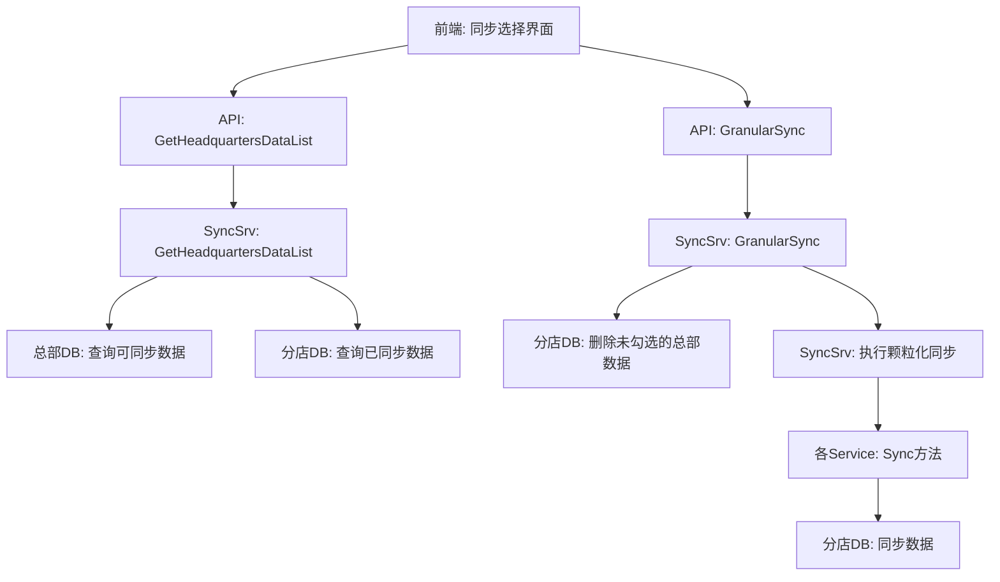

# 总部-分店颗粒化同步（后端）设计文档

> 本文档定义 总部-分店颗粒化同步后端支持 的技术设计和实现方案。

## 📋 概述

为前端"总部-分店颗粒化同步"功能提供后端支持，实现分店可以选择性地同步总部的数据，包括：优惠券、满额减、菜品标签、营销活动、支付方式以及现有的基础数据。

**核心功能**：
1. 扩展现有同步任务，增加5种新数据类型的同步
2. 提供接口：获取总部可同步数据列表（按种类分组，支持依赖关系识别）
3. 提供接口：颗粒化同步数据（接收勾选的uuid列表，删除未勾选的总部数据，同步勾选的数据）

**关联任务**：DooTask #37462  
**前端仓库**：shop-headquarters-branch-granular-sync  
**支付方式特殊规则**：详见 `PAYMENT_METHOD_SYNC_RULES.md`

---

## 🎯 规范对齐

### Go Main 规范 (go-main.mdc)

- ✅ Service 只依赖其他 Service 接口
- ✅ Repository 只持有 db 实例
- ✅ URL 使用 snake_case
- ✅ data 字段必须是对象
- ✅ 不使用 panic，返回 error
- ✅ 使用选项模式实现 Repository 查询

### API 设计规范 (api.mdc)

- ✅ URL 使用 snake_case：`/api/v1/shop/sync/headquarters_data_list`, `/api/v1/shop/sync/granular_sync`
- ✅ 响应格式统一：`{code, message, data}`
- ✅ data 不能为 null 或数组（使用对象包裹）

### 数据库规范 (database.mdc)

- ✅ 必需字段完整：id, uuid, create_time, update_time, delete_time
- ✅ 时间字段使用 int
- ✅ 金额字段使用 decimal
- ✅ 新增字段：`headquarter_uuid` 标识数据来源

---

## 🔄 代码复用分析

### 可复用的现有组件

- **SyncSrv**: `main/app/service/sync.go` - 扩展现有同步服务，增加新的同步任务类型
- **SyncTaskManager**: `main/app/service/sync.go` - 复用现有的同步任务管理器
- **Repository 选项模式**: 复用现有的选项模式实现条件查询

### 集成点

- **现有同步任务**: 在 `allTasks` 中新增5种同步任务配置
- **数据库表**: 为相关表添加 `headquarter_uuid` 字段（如果没有）
- **前端接口**: 提供2个新API接口供前端调用

### 现有同步流程

当前同步流程（参考 `sync.go`）：
1. 检查是否已有同步任务在运行（使用 `SyncTaskManager`）
2. 创建同步任务记录（`ttpos_sync_task`）
3. 按顺序执行各个同步任务（创建任务明细 `ttpos_sync_task_item`）
4. 每个同步任务的 Executor 负责具体的同步逻辑
5. 同步完成后更新任务状态，推送 WebSocket 通知

---

## 🏗️ 架构设计

### 分层设计原则

**Go Main 三层架构**:

```
API 层 (Controller/API)
  ↓ 依赖
业务层 (Service)
  ↓ 依赖
数据层 (Repository)
```

**依赖规则**:

- ✅ 上层可依赖下层
- ❌ 禁止下层依赖上层
- ❌ 禁止跨层调用
- ❌ Service 不能依赖 Repository
- ✅ Service 可以依赖其他 Service 接口

### 架构图



### 模块划分

#### Go Main 模块

- **API 层**: `main/app/api/v1/shop/shop_sync.go` - 新增2个API接口
- **Service 层**: `main/app/service/sync.go` - 扩展同步服务
- **Repository 层**: 复用现有Repository，增加查询选项
- **Model 层**: `main/app/model/` - 为相关表添加 `HeadquarterUuid` 字段
- **DTO 层**: `main/app/dto/`
  - `req/sync_req.go` - 新增请求参数
  - `resp/sync_resp.go` - 新增响应数据

#### 数据流

1. **获取可同步数据列表**:
   - 前端 → API → SyncSrv.GetHeadquartersDataList()
   - 查询总部数据库，获取各种类型的数据列表
   - 查询分店数据库，获取已同步的总部数据（用于默认勾选）
   - 返回分组数据 + 依赖关系 + 已同步状态

2. **颗粒化同步**:
   - 前端 → API → SyncSrv.GranularSync()
   - 接收每个种类的勾选uuid列表
   - 先删除分店中未勾选的总部数据（支付方式除外）
   - 再同步勾选的数据（复用现有sync方法，按uuid过滤）
   - 返回同步结果

---

## 🗄️ 数据库设计

### 数据表字段扩展

需要为以下表添加 `headquarter_uuid` 字段（如果没有）：

#### 1. `ttpos_marketing_coupon` (优惠券)

```sql
ALTER TABLE `ttpos_marketing_coupon` 
ADD COLUMN `headquarter_uuid` bigint NOT NULL DEFAULT 0 COMMENT '总部uuid，0表示本店创建，>0表示从总部同步' AFTER `uuid`;
ALTER TABLE `ttpos_marketing_coupon` 
ADD INDEX `idx_headquarter_uuid` (`headquarter_uuid`);
```

#### 2. `ttpos_full_reduction_activity` (满额减活动)

```sql
ALTER TABLE `ttpos_full_reduction_activity` 
ADD COLUMN `headquarter_uuid` bigint NOT NULL DEFAULT 0 COMMENT '总部uuid，0表示本店创建，>0表示从总部同步' AFTER `uuid`;
ALTER TABLE `ttpos_full_reduction_activity` 
ADD INDEX `idx_headquarter_uuid` (`headquarter_uuid`);
```

#### 3. `ttpos_product_label` (菜品标签)

```sql
ALTER TABLE `ttpos_product_label` 
ADD COLUMN `headquarter_uuid` bigint NOT NULL DEFAULT 0 COMMENT '总部uuid，0表示本店创建，>0表示从总部同步' AFTER `uuid`;
ALTER TABLE `ttpos_product_label` 
ADD INDEX `idx_headquarter_uuid` (`headquarter_uuid`);
```

#### 4. `ttpos_marketing_activity` (营销活动)

```sql
ALTER TABLE `ttpos_marketing_activity` 
ADD COLUMN `headquarter_uuid` bigint NOT NULL DEFAULT 0 COMMENT '总部uuid，0表示本店创建，>0表示从总部同步' AFTER `uuid`;
ALTER TABLE `ttpos_marketing_activity` 
ADD INDEX `idx_headquarter_uuid` (`headquarter_uuid`);
```

#### 5. `ttpos_payment_method` (支付方式)

```sql
-- 支付方式表可能在旧管理端（PHP），需确认表名和结构
-- 假设表名为 ttpos_payment_method
ALTER TABLE `ttpos_payment_method` 
ADD COLUMN `headquarter_uuid` bigint(20) unsigned NOT NULL DEFAULT 0 COMMENT '总部uuid，0表示本店创建，>0表示从总部同步' AFTER `id`,
ADD INDEX `idx_headquarter_uuid` (`headquarter_uuid`);
```

**说明**：
- `headquarter_uuid = 0`: 表示本店创建的数据
- `headquarter_uuid > 0`: 表示从总部同步的数据，值为总部的 company_uuid
- 索引优化查询性能

### 数据库迁移

**迁移文件**: `admin/database/migrations/20251205175111_add_headquarter_uuid_to_sync_tables.php`

**执行迁移**:

```bash
cd admin
php think migrate:run
```

**说明**:
- ✅ 使用ThinkPHP迁移系统（PHP文件）
- ✅ 字段类型：`bigint`（有符号，不限制长度）
- ✅ 支持幂等性（可重复执行）
- ✅ 自动添加字段和索引
- ✅ 错误处理（索引已存在时忽略）

**注意事项**：
1. 需要在所有分店数据库执行迁移
2. 已有数据的 `headquarter_uuid` 默认为 0（本店创建）
3. 迁移后需要重启服务

---

## 📊 数据模型

### Go Model 扩展

#### 1. MarketingCoupon (优惠券)

```go
// main/app/model/marketing.go
type MarketingCoupon struct {
    BaseModel
    HeadquarterUuid uint64  `gorm:"column:headquarter_uuid;default:0" json:"headquarter_uuid"` // 新增
    Name            string  `gorm:"column:name;type:varchar(50)" json:"name"`
    Sort            int     `gorm:"column:sort;type:int(11);default:0" json:"sort"`
    Type            string  `gorm:"column:type;type:varchar(20)" json:"type"`
    // ... 其他字段
}
```

#### 2. FullReductionActivity (满额减)

```go
// main/app/model/full_reduction_activity.go
type FullReductionActivity struct {
    BaseModel
    HeadquarterUuid       uint64 `gorm:"column:headquarter_uuid;default:0" json:"headquarter_uuid"` // 新增
    Name                  string `gorm:"column:name;type:varchar(1000);default:''" json:"name"`
    MultiLanguageNameUuid uint64 `gorm:"column:multi_language_name_uuid;type:bigint(20) unsigned;default:0" json:"multi_language_name_uuid"`
    // ... 其他字段
}
```

#### 3. ProductLabel (菜品标签)

```go
// main/app/model/product_label.go
type ProductLabel struct {
    BaseModel
    HeadquarterUuid uint64 `gorm:"column:headquarter_uuid;default:0" json:"headquarter_uuid"` // 新增
    Name            string `gorm:"default:'';column:name" json:"name"`
    Style           string `gorm:"default:'default';column:style" json:"style"`
    // ... 其他字段

    // 关联的商品列表
    ProductPackages []ProductPackage `gorm:"foreignKey:product_label_uuid;references:uuid"`
}
```

#### 4. MarketingActivity (营销活动)

```go
// main/app/model/marketing.go
type MarketingActivity struct {
    BaseModel
    HeadquarterUuid       uint64 `gorm:"column:headquarter_uuid;default:0" json:"headquarter_uuid"` // 新增
    Name                  string `gorm:"column:name;type:varchar(2500);default:''" json:"name"`
    Type                  int    `gorm:"column:type;type:tinyint(1);default:0" json:"type"`
    MultiLanguageNameUuid uint64 `gorm:"column:multi_language_name_uuid;type:biginteger;default:0" json:"multi_language_name_uuid"`
    MultiLanguageDescUuid uint64 `gorm:"column:multi_language_desc_uuid;type:biginteger;default:0" json:"multi_language_desc_uuid"`
    // ... 其他字段
}
```

#### 5. PaymentMethod (支付方式)

```go
// main/app/model/payment_method.go (如果没有则新建)
type PaymentMethod struct {
    BaseModel
    HeadquarterUuid uint64 `gorm:"column:headquarter_uuid;default:0" json:"headquarter_uuid"` // 新增
    Name            string `gorm:"column:name;type:varchar(100)" json:"name"`
    Code            string `gorm:"column:code;type:varchar(50)" json:"code"`
    // ... 其他字段（需确认实际表结构）
}
```

### DTO 定义

#### Request DTO

```go
// main/app/dto/req/sync_req.go

// GetHeadquartersDataListReq 获取总部可同步数据列表请求
type GetHeadquartersDataListReq struct {
    DataTypes []string `json:"data_types"` // 可选，指定查询的数据类型，不传则查询所有
}

// GranularSyncReq 颗粒化同步请求
type GranularSyncReq struct {
    SyncData GranularSyncData `json:"sync_data" binding:"required"` // 要同步的数据
}

// GranularSyncData 要同步的数据（按种类分组）
type GranularSyncData struct {
    ProductCategory  []uint64 `json:"product_category"`   // 商品分类
    Unit             []uint64 `json:"unit"`               // 单位
    Flavor           []uint64 `json:"flavor"`             // 规格
    Attribute        []uint64 `json:"attribute"`          // 属性
    Sauce            []uint64 `json:"sauce"`              // 加料
    Product          []uint64 `json:"product"`            // 商品
    MaterialCategory []uint64 `json:"material_category"`  // 物品分类
    Material         []uint64 `json:"material"`           // 物品
    BomCard          []uint64 `json:"bom_card"`           // 成本卡
    Supplier         []uint64 `json:"supplier"`           // 供应商
    Tax              []uint64 `json:"tax"`                // 税类
    Coupon           []uint64 `json:"coupon"`             // 优惠券
    FullReduction    []uint64 `json:"full_reduction"`     // 满额减
    ProductLabel     []uint64 `json:"product_label"`      // 菜品标签
    MarketingActivity []uint64 `json:"marketing_activity"` // 营销活动（邀请消费有礼）
    PaymentMethod    []uint64 `json:"payment_method"`     // 支付方式
}
```

#### Response DTO

```go
// main/app/dto/resp/sync_resp.go

// HeadquartersDataListResp 总部可同步数据列表响应
type HeadquartersDataListResp struct {
    DataGroups []DataGroup `json:"data_groups"` // 按种类分组的数据
}

// DataGroup 数据分组
type DataGroup struct {
    Type        string     `json:"type"`         // 数据类型（如：product_category, unit, coupon等）
    TypeName    string     `json:"type_name"`    // 类型名称（如：商品分类、单位、优惠券等）
    Items       []DataItem `json:"items"`        // 该类型的数据列表
    SyncedUuids []uint64   `json:"synced_uuids"` // 分店已同步的总部数据uuid列表
}

// DataItem 数据项
type DataItem struct {
    Uuid           uint64              `json:"uuid"`                       // 数据uuid
    LocaleName     dto.LocaleResponse  `json:"locale_name"`                // 多语言名称
    RelatedData    []RelatedData       `json:"related_data,omitempty"`     // 关联数据（明确类型和uuid列表）
    AdditionalInfo map[string]any      `json:"additional_info,omitempty"`  // 额外信息（如商品价格、活动状态等）
}

// RelatedData 关联数据
type RelatedData struct {
    Type  string   `json:"type"`  // 关联数据的类型（如：product, category, unit, flavor, attribute, sauce, bom_card, material等）
    Uuids []uint64 `json:"uuids"` // 关联的uuid列表
}

// GranularSyncResp 颗粒化同步响应
type GranularSyncResp struct {
    TaskUuid uint64 `json:"task_uuid"` // 同步任务uuid
    Message  string `json:"message"`   // 提示信息
}

// 注意：实际代码中使用 dto.LocaleResponse 结构（包含ZH, EN, TH等多语言字段）
```

---

## 🔌 API 设计

### RESTful API

#### API 1: 获取总部可同步数据列表

**请求**:

- **URL**: `/api/v1/shop/setting/headquarters_data_list`
- **Method**: `GET`
- **Headers**:
  ```json
  {
    "Authorization": "Bearer {token}"
  }
  ```
- **Query Params**: 无需传参

**说明**: 自动返回所有16种数据类型（商品分类、单位、规格、属性、加料、商品、物品分类、物品、成本卡、供应商、税类、优惠券、满额减、菜品标签、营销活动、支付方式）

**响应**:

```json
{
  "code": 1,
  "message": "success",
  "data": {
    "data_groups": [
      {
        "type": "product_category",
        "type_name": "商品分类",
        "synced_uuids": [123456, 789012],
        "items": [
          {
            "uuid": 123456,
            "locale_name": {
              "zh": "饮料",
              "en": "Beverages",
              "th": "เครื่องดื่ม",
              "zh_tw": "飲料",
              "ja": "飲み物",
              "ko": "음료",
              "my": "Minuman",
              "tr": "İçecekler",
              "sv": "Drycker"
            },
            "related_data": []
          }
        ]
      },
      {
        "type": "coupon",
        "type_name": "优惠券",
        "synced_uuids": [888888],
        "items": [
          {
            "uuid": 789012,
            "locale_name": {
              "zh": "满100减10",
              "en": "满100减10",
              "th": "满100减10"
            },
            "related_data": []
          }
        ]
      },
      {
        "type": "product_label",
        "type_name": "菜品标签",
        "synced_uuids": [345678],
        "items": [
          {
            "uuid": 345678,
            "locale_name": {
              "zh": "招牌菜",
              "en": "招牌菜",
              "th": "招牌菜"
            },
            "related_data": [
              {
                "type": "product",
                "uuids": [111111, 222222]
              }
            ]
          }
        ]
      }
    ]
  }
}
```

**错误响应**:

```json
{
  "code": 0,
  "message": "非分店账号无法查看总部数据",
  "data": {}
}
```

**业务逻辑**:

1. 检查当前公司是否为分店（`company_setting.IsSubShop()`）
2. 获取总部 company_uuid（`company_setting.HeadquarterUuid`）
3. 查询16种数据类型（固定列表，不使用传参）
4. 查询总部数据库，获取各种类型的数据列表（`headquarter_uuid = 0`）
5. 查询分店数据库，获取已同步的总部数据uuid列表（`headquarter_uuid = 总部uuid`）
6. 组装响应数据（items为总部数据列表，synced_uuids为已同步uuid列表）
7. 计算依赖关系（如菜品标签关联的商品uuid，并明确关联类型为"product"）

#### API 2: 颗粒化同步数据

**请求**:

- **URL**: `/api/v1/shop/sync/granular_sync`
- **Method**: `POST`
- **Headers**:
  ```json
  {
    "Authorization": "Bearer {token}",
    "Content-Type": "application/json"
  }
  ```
- **Body**:
  ```json
  {
    "sync_data": {
      "product_category": [123456, 789012],
      "unit": [111111, 222222],
      "coupon": [333333],
      "product_label": [444444, 555555],
      "full_reduction": [666666],
      "marketing_activity": [777777],
      "payment_method": [888888]
    }
  }
  ```

**响应**:

```json
{
  "code": 1,
  "message": "数据同步已启动",
  "data": {
    "task_uuid": 999999,
    "message": "数据同步已启动，可在同步历史中查看进度"
  }
}
```

**错误响应**:

```json
{
  "code": 0,
  "message": "数据同步中，请稍后再试",
  "data": {}
}
```

**业务逻辑**:

1. 检查当前公司是否为分店
2. 检查是否已有同步任务在运行（使用 `SyncTaskManager`）
3. 创建同步任务记录
4. **删除阶段**：删除分店中未勾选的总部数据
   - 对每种数据类型，查询分店中 `headquarter_uuid = 总部uuid` 且 `uuid NOT IN (勾选列表)` 的数据
   - 执行硬删除（支付方式除外）
5. **同步阶段**：同步勾选的数据
   - 对每种数据类型，调用对应的 Sync 方法
   - 传入勾选的 uuid 列表，只同步这些数据
6. 异步执行同步任务
7. 返回任务uuid

---

## 🧩 组件和接口

### Service 层

#### Service 接口扩展

```go
// main/app/service/i_sync_srv.go
type ISyncSrv interface {
    Sync(ctx context.Context, syncReq req.SyncReq) (resp.SyncResp, error)
    GetTaskList(ctx context.Context, listReq req.SyncTaskListReq) (resp.SyncTaskListPaginationResp, error)
    GetTaskDetail(ctx context.Context, detailReq req.SyncTaskDetailReq) (resp.SyncTaskDetailResp, error)
    
    // 新增接口
    GetHeadquartersDataList(ctx context.Context, req req.GetHeadquartersDataListReq) (resp.HeadquartersDataListResp, error)
    GranularSync(ctx context.Context, req req.GranularSyncReq) (resp.GranularSyncResp, error)
}
```

#### Service 实现

```go
// main/app/service/sync.go

// GetHeadquartersDataList 获取总部可同步数据列表
func (s *SyncSrv) GetHeadquartersDataList(ctx context.Context, req req.GetHeadquartersDataListReq) (resp.HeadquartersDataListResp, error) {
    companySetting := ctx.GetCompanySetting()
    
    // 只有分店才能查看总部数据
    if !companySetting.IsSubShop() {
        return resp.HeadquartersDataListResp{}, errors.New("非分店账号无法查看总部数据")
    }
    
    headquarterUuid := companySetting.HeadquarterUuid
    subShopUuid := companySetting.CompanyUuid
    
    // 获取数据库连接
    headquarterDB := s.dbm.GetDB(headquarterUuid)
    subShopDB := s.dbm.GetDB(subShopUuid)
    
    // 定义要查询的数据类型
    dataTypes := req.DataTypes
    if len(dataTypes) == 0 {
        // 默认查询所有类型
        dataTypes = []string{
            constant.SyncDataTypeProductCategory,
            constant.SyncDataTypeUnit,
            constant.SyncDataTypeFlavor,
            constant.SyncDataTypeAttribute,
            constant.SyncDataTypeSauce,
            constant.SyncDataTypeProduct,
            constant.SyncDataTypeMaterialCategory,
            constant.SyncDataTypeMaterial,
            constant.SyncDataTypeBomCard,
            constant.SyncDataTypeSupplier,
            constant.SyncDataTypeTax,
            constant.SyncDataTypeCoupon,
            constant.SyncDataTypeFullReduction,
            constant.SyncDataTypeProductLabel,
            constant.SyncDataTypeMarketingActivity,
            constant.SyncDataTypePaymentMethod,
        }
    }
    
    // 查询各类型数据
    var dataGroups []resp.DataGroup
    
    for _, dataType := range dataTypes {
        group, err := s.getDataGroupByType(ctx, dataType, headquarterDB, subShopDB, headquarterUuid)
        if err != nil {
            logger.Logger.Error("查询数据失败", zap.String("dataType", dataType), zap.Error(err))
            continue
        }
        dataGroups = append(dataGroups, group)
    }
    
    return resp.HeadquartersDataListResp{
        DataGroups: dataGroups,
    }, nil
}

// getDataGroupByType 根据数据类型查询数据分组
func (s *SyncSrv) getDataGroupByType(ctx context.Context, dataType string, headquarterDB, subShopDB *gorm.DB, headquarterUuid uint64) (resp.DataGroup, error) {
    switch dataType {
    case constant.SyncDataTypeProductCategory:
        return s.getProductCategoryGroup(headquarterDB, subShopDB, headquarterUuid)
    case constant.SyncDataTypeCoupon:
        return s.getCouponGroup(headquarterDB, subShopDB, headquarterUuid)
    case constant.SyncDataTypeMaterial:
        return s.getMaterialGroup(headquarterDB, subShopDB, headquarterUuid)
    case constant.SyncDataTypeProductLabel:
        return s.getProductLabelGroup(headquarterDB, subShopDB, headquarterUuid)
    case constant.SyncDataTypeFullReduction:
        return s.getFullReductionGroup(headquarterDB, subShopDB, headquarterUuid)
    case constant.SyncDataTypeMarketingActivity:
        return s.getMarketingActivityGroup(headquarterDB, subShopDB, headquarterUuid)
    case constant.SyncDataTypePaymentMethod:
        return s.getPaymentMethodGroup(headquarterDB, subShopDB, headquarterUuid)
    // ... 其他类型
    default:
        return resp.DataGroup{}, errors.New("不支持的数据类型")
    }
}

// getPaymentMethodGroup 获取支付方式数据分组（⚠️ 特殊：通过名称匹配判断已同步）
func (s *SyncSrv) getPaymentMethodGroup(headquarterDB, subShopDB *gorm.DB, headquarterUuid uint64) (resp.DataGroup, error) {
    // 1. 查询总部支付方式（过滤 code=40 和 code=10）
    var hqPayments []model.PaymentMethod
    err := headquarterDB.Where("delete_time = 0 AND headquarter_uuid = 0").
        Where("code NOT IN (?)", []int{40, 10}).
        Find(&hqPayments).Error
    if err != nil {
        return resp.DataGroup{}, errors.WithMessage(err, "查询总部支付方式失败")
    }
    
    // 2. 查询分店中从总部同步的支付方式名称列表
    //    ⚠️ 关键：只查询 headquarter_uuid = 总部uuid 的支付方式
    var syncedPaymentNames []string
    err = subShopDB.Model(&model.PaymentMethod{}).
        Where("delete_time = 0 AND headquarter_uuid = ?", headquarterUuid).
        Pluck("payment_name", &syncedPaymentNames).Error
    if err != nil {
        return resp.DataGroup{}, errors.WithMessage(err, "查询分店已同步支付方式名称失败")
    }
    
    // 3. 构建已同步名称的map
    syncedNameMap := make(map[string]bool)
    for _, name := range syncedPaymentNames {
        syncedNameMap[name] = true
    }
    
    // 4. 匹配总部支付方式，找出已同步的总部uuid
    var syncedUuids []uint64
    var items []resp.DataItem
    
    for _, hqPayment := range hqPayments {
        // 通过名称匹配：分店有同名的总部支付方式，则该总部支付方式已同步
        if syncedNameMap[hqPayment.PaymentName] {
            syncedUuids = append(syncedUuids, hqPayment.Uuid) // ✅ 总部uuid
        }
        
        items = append(items, resp.DataItem{
            Uuid:        hqPayment.Uuid,
            Name:        hqPayment.PaymentName,
            RelatedData: []resp.RelatedData{},
            AdditionalInfo: map[string]any{
                "code": hqPayment.Code,
            },
        })
    }
    
    return resp.DataGroup{
        Type:        constant.SyncDataTypePaymentMethod,
        TypeName:    constant.SyncDataTypeNames[constant.SyncDataTypePaymentMethod],
        Items:       items,
        SyncedUuids: syncedUuids, // ⚠️ 通过名称匹配得到的总部uuid列表
    }, nil
}

// getMaterialGroup 获取物品数据分组（示例：包含关联单位）
func (s *SyncSrv) getMaterialGroup(headquarterDB, subShopDB *gorm.DB, headquarterUuid uint64) (resp.DataGroup, error) {
    // 1. 查询总部物品（Preload 非基准单位列表）
    var hqMaterials []model.Material
    err := headquarterDB.Preload("NotBaseUnitList").
        Where("delete_time = 0 AND headquarter_uuid = 0").
        Find(&hqMaterials).Error
    if err != nil {
        return resp.DataGroup{}, errors.WithMessage(err, "查询总部物品失败")
    }
    
    // 2. 查询分店已同步的物品uuid列表
    var syncedUuids []uint64
    err = subShopDB.Model(&model.Material{}).
        Where("delete_time = 0 AND headquarter_uuid = ?", headquarterUuid).
        Pluck("uuid", &syncedUuids).Error
    if err != nil {
        return resp.DataGroup{}, errors.WithMessage(err, "查询分店已同步物品失败")
    }
    
    // 3. 组装数据项
    var items []resp.DataItem
    for _, material := range hqMaterials {
        // 提取关联的单位uuid
        unitUuidMap := make(map[uint64]bool)
        
        // 物品直接关联的单位
        if material.UnitUuid > 0 {
            unitUuidMap[material.UnitUuid] = true
        }
        if material.PurchaseUnitUuid > 0 {
            unitUuidMap[material.PurchaseUnitUuid] = true
        }
        if material.CostUnitUuid > 0 {
            unitUuidMap[material.CostUnitUuid] = true
        }
        
        // 从非基准单位列表中提取单位（material_unit.unit_uuid）
        for _, materialUnit := range material.NotBaseUnitList {
            if materialUnit.UnitUuid > 0 {
                unitUuidMap[materialUnit.UnitUuid] = true
            }
        }
        
        // 转为切片
        var unitUuids []uint64
        for unitUuid := range unitUuidMap {
            unitUuids = append(unitUuids, unitUuid)
        }
        
        // 构建关联数据（明确关联类型）
        var relatedData []resp.RelatedData
        if len(unitUuids) > 0 {
            relatedData = append(relatedData, resp.RelatedData{
                Type:  constant.SyncDataTypeUnit, // 明确关联的是单位
                Uuids: unitUuids,
            })
        }
        
        // 物品还关联物品分类
        if material.CategoryUuid > 0 {
            relatedData = append(relatedData, resp.RelatedData{
                Type:  constant.SyncDataTypeMaterialCategory,
                Uuids: []uint64{material.CategoryUuid},
            })
        }
        
        items = append(items, resp.DataItem{
            Uuid:        material.Uuid,
            Name:        material.Name,
            RelatedData: relatedData, // ✅ unit 指向 product_unit 表
            AdditionalInfo: map[string]any{
                "unit_count": len(unitUuids),
            },
        })
    }
    
    return resp.DataGroup{
        Type:        constant.SyncDataTypeMaterial,
        TypeName:    constant.SyncDataTypeNames[constant.SyncDataTypeMaterial],
        Items:       items,
        SyncedUuids: syncedUuids,
    }, nil
}

// getProductLabelGroup 获取菜品标签数据分组（示例）
func (s *SyncSrv) getProductLabelGroup(headquarterDB, subShopDB *gorm.DB, headquarterUuid uint64) (resp.DataGroup, error) {
    // 1. 查询总部的菜品标签（headquarter_uuid = 0，表示总部创建）
    var hqLabels []model.ProductLabel
    err := headquarterDB.Preload("ProductPackages").
        Where("delete_time = 0 AND headquarter_uuid = 0").
        Find(&hqLabels).Error
    if err != nil {
        return resp.DataGroup{}, errors.WithMessage(err, "查询总部菜品标签失败")
    }
    
    // 2. 查询分店已同步的菜品标签uuid列表（headquarter_uuid = 总部uuid）
    var syncedUuids []uint64
    err = subShopDB.Model(&model.ProductLabel{}).
        Where("delete_time = 0 AND headquarter_uuid = ?", headquarterUuid).
        Pluck("uuid", &syncedUuids).Error
    if err != nil {
        return resp.DataGroup{}, errors.WithMessage(err, "查询分店已同步菜品标签失败")
    }
    
    // 3. 组装数据项
    var items []resp.DataItem
    for _, label := range hqLabels {
        // 提取关联的商品uuid
        var relatedProductUuids []uint64
        for _, pkg := range label.ProductPackages {
            if pkg.ProductLabelUuid == label.Uuid {
                relatedProductUuids = append(relatedProductUuids, pkg.Uuid)
            }
        }
        
        // 构建关联数据（明确关联类型）
        var relatedData []resp.RelatedData
        if len(relatedProductUuids) > 0 {
            relatedData = append(relatedData, resp.RelatedData{
                Type:  constant.SyncDataTypeProduct, // 明确关联的是商品
                Uuids: relatedProductUuids,
            })
        }
        
        items = append(items, resp.DataItem{
            Uuid:        label.Uuid,
            Name:        label.Name,
            RelatedData: relatedData,
            AdditionalInfo: map[string]any{
                "product_count": len(relatedProductUuids),
            },
        })
    }
    
    return resp.DataGroup{
        Type:        constant.SyncDataTypeProductLabel,
        TypeName:    constant.SyncDataTypeNames[constant.SyncDataTypeProductLabel],
        Items:       items,
        SyncedUuids: syncedUuids, // 返回已同步的uuid列表
    }, nil
}

// GranularSync 颗粒化同步数据
func (s *SyncSrv) GranularSync(ctx context.Context, req req.GranularSyncReq) (resp.GranularSyncResp, error) {
    companySetting := ctx.GetCompanySetting()
    
    // 只有分店才能执行颗粒化同步
    if !companySetting.IsSubShop() {
        return resp.GranularSyncResp{}, errors.New("非分店账号无法执行颗粒化同步")
    }
    
    companyUuid := companySetting.CompanyUuid
    
    // 检查是否已有同步任务在运行
    if !syncTaskManager.tryStartTask(companyUuid) {
        return resp.GranularSyncResp{}, errors.New("数据同步中，请稍后再试")
    }
    
    // 实例化repo（同步任务表在公司库）
    syncTaskRepo := repository.NewSyncTaskRepo(s.dbm.GetDB(companyUuid))
    
    // 创建新的同步任务
    syncTask := &model.SyncTask{
        Status:       constant.SyncTaskStatusRunning,
        TotalCount:   0, // 后续计算
        SuccessCount: 0,
        FailCount:    0,
        StartTime:    time.Now().Unix(),
    }
    
    if err := syncTaskRepo.Create(syncTask); err != nil {
        syncTaskManager.finishTask(companyUuid)
        return resp.GranularSyncResp{}, errors.WithMessage(err, "创建同步任务失败")
    }
    
    // 异步执行颗粒化同步
    utils.Go(func() {
        s.executeGranularSync(ctx, syncTask, req.SyncData)
    })
    
    return resp.GranularSyncResp{
        TaskUuid: syncTask.Uuid,
        Message:  "数据同步已启动，可在同步历史中查看进度",
    }, nil
}

// executeGranularSync 执行颗粒化同步
func (s *SyncSrv) executeGranularSync(ctx context.Context, syncTask *model.SyncTask, syncData req.GranularSyncData) {
    companySetting := ctx.GetCompanySetting()
    companyUuid := companySetting.CompanyUuid
    headquarterUuid := companySetting.HeadquarterUuid
    
    syncTaskRepo := repository.NewSyncTaskRepo(s.dbm.GetDB(companyUuid))
    
    var successCount uint32
    var failCount uint32
    
    defer func() {
        if r := recover(); r != nil {
            stack := string(debug.Stack())
            logger.Logger.Error("颗粒化同步发生panic", zap.Uint64("companyUuid", companyUuid), zap.Any("panic", r), zap.String("stack", stack))
            syncTaskRepo.Update(syncTask.Uuid, map[string]any{
                "status":   constant.SyncTaskStatusFailed,
                "panic":    fmt.Sprintf("%v: %s", r, stack),
                "end_time": time.Now().Unix(),
            })
        }
        
        syncTaskManager.finishTask(companyUuid)
        
        // 推送websocket
        utils.Go(func() {
            websocket.PushClient(companyUuid, websocket.SourceShop, websocket.SourceAll, websocket.SYNC_DATA, map[string]any{
                "task_uuid":             syncTask.Uuid,
                "is_exception_occurred": failCount > 0,
                "sync_time":             time.Now().Unix(),
            })
        })
    }()
    
    // Step 1: 删除未勾选的总部数据（支付方式除外）
    err := s.deleteUncheckedHeadquartersData(ctx, syncData, headquarterUuid)
    if err != nil {
        logger.Logger.Error("删除未勾选的总部数据失败", zap.Error(err))
        failCount++
    }
    
    // Step 2: 同步勾选的数据（按依赖顺序）
    syncTasks := []struct {
        Name     string
        Uuids    []uint64
        Executor func(context.Context, []uint64) error
    }{
        {constant.SyncTaskTypeProductCategory, syncData.ProductCategory, s.productSrv.SyncProductCategoryByUuids},
        {constant.SyncTaskTypeUnit, syncData.Unit, s.productSrv.SyncUnitByUuids},
        {constant.SyncTaskTypeFlavor, syncData.Flavor, s.productSrv.SyncProductFlavorByUuids},
        {constant.SyncTaskTypeAttribute, syncData.Attribute, s.productSrv.SyncAttributeGroupByUuids},
        {constant.SyncTaskTypeSauce, syncData.Sauce, s.productSrv.SyncSauceByUuids},
        {constant.SyncTaskTypeMaterialCategory, syncData.MaterialCategory, s.materialSrv.SyncMaterialCategoryByUuids},
        {constant.SyncTaskTypeMaterial, syncData.Material, s.materialSrv.SyncMaterialByUuids},
        {constant.SyncTaskTypeBomCard, syncData.BomCard, s.materialSrv.SyncProductBomCardByUuids},
        {constant.SyncTaskTypeSupplier, syncData.Supplier, s.supplierSrv.SyncSupplierByUuids},
        {constant.SyncTaskTypeTax, syncData.Tax, s.productSrv.SyncProductTaxByUuids},
        {constant.SyncTaskTypeProduct, syncData.Product, s.productSrv.SyncProductByUuids},
        {constant.SyncTaskTypeCoupon, syncData.Coupon, s.SyncMarketingCouponByUuids},
        {constant.SyncTaskTypeFullReduction, syncData.FullReduction, s.SyncFullReductionByUuids},
        {constant.SyncTaskTypeProductLabel, syncData.ProductLabel, s.SyncProductLabelByUuids},
        {constant.SyncTaskTypeMarketingActivity, syncData.MarketingActivity, s.SyncMarketingActivityByUuids},
        {constant.SyncTaskTypePaymentMethod, syncData.PaymentMethod, s.SyncPaymentMethodByUuids},
    }
    
    for _, task := range syncTasks {
        if len(task.Uuids) == 0 {
            continue
        }
        
        taskItem := &model.SyncTaskItem{
            SyncTaskUuid: syncTask.Uuid,
            TaskType:     task.Name,
            TaskName:     constant.SyncTaskTypeNames[task.Name],
            Status:       constant.SyncTaskItemStatusRunning,
            StartTime:    time.Now().Unix(),
        }
        
        syncTaskItemRepo := repository.NewSyncTaskItemRepo(s.dbm.GetDB(companyUuid))
        syncTaskItemRepo.Create(taskItem)
        
        err := task.Executor(ctx, task.Uuids)
        endTime := time.Now().Unix()
        
        if err != nil {
            failCount++
            syncTaskItemRepo.Update(taskItem.Uuid, map[string]any{
                "status":        constant.SyncTaskItemStatusFailed,
                "error_message": err.Error(),
                "end_time":      endTime,
            })
        } else {
            successCount++
            syncTaskItemRepo.Update(taskItem.Uuid, map[string]any{
                "status":   constant.SyncTaskItemStatusSuccess,
                "end_time": endTime,
            })
        }
    }
    
    // 更新主任务状态
    endTime := time.Now().Unix()
    finalStatus := constant.SyncTaskStatusSuccess
    if failCount > 0 {
        finalStatus = constant.SyncTaskStatusFailed
    }
    
    syncTaskRepo.Update(syncTask.Uuid, map[string]any{
        "status":        finalStatus,
        "success_count": successCount,
        "fail_count":    failCount,
        "total_count":   successCount + failCount,
        "end_time":      endTime,
    })
}

// deleteUncheckedHeadquartersData 删除未勾选的总部数据
func (s *SyncSrv) deleteUncheckedHeadquartersData(ctx context.Context, syncData req.GranularSyncData, headquarterUuid uint64) error {
    subShopDB := s.dbm.GetDB(ctx.GetCompanyUuid())
    
    // 定义删除任务
    deleteTasks := []struct {
        TableName string
        Uuids     []uint64
        SkipDelete bool // 支付方式不删除
    }{
        {"ttpos_product_category", syncData.ProductCategory, false},
        {"ttpos_product_unit", syncData.Unit, false},
        {"ttpos_product_flavor", syncData.Flavor, false},
        {"ttpos_product_attribute_group", syncData.Attribute, false},
        {"ttpos_product_sauce", syncData.Sauce, false},
        {"ttpos_product_package", syncData.Product, false},
        {"ttpos_material_category", syncData.MaterialCategory, false},
        {"ttpos_material", syncData.Material, false},
        {"ttpos_product_bom_card", syncData.BomCard, false},
        {"ttpos_supplier", syncData.Supplier, false},
        {"ttpos_product_tax", syncData.Tax, false},
        {"ttpos_marketing_coupon", syncData.Coupon, false},
        {"ttpos_full_reduction_activity", syncData.FullReduction, false},
        {"ttpos_product_label", syncData.ProductLabel, false},
        {"ttpos_marketing_activity", syncData.MarketingActivity, false},
        {"ttpos_payment_method", syncData.PaymentMethod, true}, // 支付方式不删除
    }
    
    for _, task := range deleteTasks {
        if task.SkipDelete {
            continue
        }
        
        // 查询分店中总部来源但未勾选的数据
        query := subShopDB.Table(task.TableName).
            Where("headquarter_uuid = ?", headquarterUuid)
        
        if len(task.Uuids) > 0 {
            query = query.Where("uuid NOT IN (?)", task.Uuids)
        }
        
        // 硬删除
        err := query.Unscoped().Delete(&map[string]any{}).Error
        if err != nil {
            logger.Logger.Error("删除未勾选数据失败",
                zap.String("table", task.TableName),
                zap.Error(err))
            return errors.WithMessage(err, fmt.Sprintf("删除%s失败", task.TableName))
        }
    }
    
    return nil
}

// SyncMarketingCouponByUuids 按uuid同步优惠券
func (s *SyncSrv) SyncMarketingCouponByUuids(ctx context.Context, uuids []uint64) error {
    if len(uuids) == 0 {
        return nil
    }
    
    companySetting := ctx.GetCompanySetting()
    headquarterDB := s.dbm.GetDB(companySetting.HeadquarterUuid)
    subShopDB := s.dbm.GetDB(companySetting.CompanyUuid)
    
    // 查询总部优惠券
    var hqCoupons []model.MarketingCoupon
    err := headquarterDB.Where("delete_time = 0 AND headquarter_uuid = 0 AND uuid IN (?)", uuids).
        Find(&hqCoupons).Error
    if err != nil {
        return errors.WithMessage(err, "查询总部优惠券失败")
    }
    
    // 同步到分店（先删除再创建）
    for _, hqCoupon := range hqCoupons {
        // 删除分店中已有的该优惠券
        subShopDB.Unscoped().Where("uuid = ?", hqCoupon.Uuid).Delete(&model.MarketingCoupon{})
        
        // 创建新的优惠券（标记来源）
        newCoupon := hqCoupon
        newCoupon.HeadquarterUuid = companySetting.HeadquarterUuid
        
        err = subShopDB.Create(&newCoupon).Error
        if err != nil {
            logger.Logger.Error("同步优惠券失败", zap.Uint64("uuid", hqCoupon.Uuid), zap.Error(err))
            continue
        }
    }
    
    return nil
}

// 其他同步方法类似...
```

### API 层

```go
// main/app/api/v1/shop/shop_sync.go

// GetHeadquartersDataList 获取总部可同步数据列表
// @Summary 获取总部可同步数据列表
// @Description 获取总部可同步数据列表（按种类分组）
// @Tags 商家端.数据同步
// @Accept json
// @Produce json
// @Security JwtToken
// @Param data body req.GetHeadquartersDataListReq true "请求参数"
// @Success 200 {object} resp.HeadquartersDataListResp
// @Router /shop/sync/headquarters_data_list [post]
func (h *SyncHandler) GetHeadquartersDataList(c *gin.Context) {
    ctx := helper.GetContext(c)
    
    var req req.GetHeadquartersDataListReq
    if err := c.ShouldBindJSON(&req); err != nil {
        helper.ErrorWithDetail(c, constant.CodeInvalidParam, err)
        return
    }
    
    resp, err := h.syncSrv.GetHeadquartersDataList(ctx, req)
    if err != nil {
        helper.ErrorWithDetail(c, constant.CodeFail, err)
        return
    }
    
    helper.Success(c, gin.H{"data": resp})
}

// GranularSync 颗粒化同步数据
// @Summary 颗粒化同步数据
// @Description 颗粒化同步数据（接收勾选的uuid列表，删除未勾选的，同步勾选的）
// @Tags 商家端.数据同步
// @Accept json
// @Produce json
// @Security JwtToken
// @Param data body req.GranularSyncReq true "请求参数"
// @Success 200 {object} resp.GranularSyncResp
// @Router /shop/sync/granular_sync [post]
func (h *SyncHandler) GranularSync(c *gin.Context) {
    ctx := helper.GetContext(c)
    
    var req req.GranularSyncReq
    if err := c.ShouldBindJSON(&req); err != nil {
        helper.ErrorWithDetail(c, constant.CodeInvalidParam, err)
        return
    }
    
    resp, err := h.syncSrv.GranularSync(ctx, req)
    if err != nil {
        helper.ErrorWithDetail(c, constant.CodeFail, err)
        return
    }
    
    helper.Success(c, gin.H{"data": resp})
}
```

### 路由注册

```go
// main/router/shop_router.go

// 在shop路由组中添加新路由
shopSync := shopGroup.Group("/sync")
{
    shopSync.POST("/headquarters_data_list", shopSyncHandler.GetHeadquartersDataList)
    shopSync.POST("/granular_sync", shopSyncHandler.GranularSync)
}
```

---

## 🚨 错误处理

### 错误场景

#### 场景 1: 非分店账号尝试操作

- **处理方式**: 检查 `company_setting.IsSubShop()`，如果为 false 则返回错误
- **用户影响**: 提示"非分店账号无法执行此操作"
- **代码示例**:
  ```go
  if !companySetting.IsSubShop() {
      return errors.New("非分店账号无法执行此操作")
  }
  ```

#### 场景 2: 同步任务已在运行

- **处理方式**: 使用 `SyncTaskManager.tryStartTask()` 检查
- **用户影响**: 提示"数据同步中，请稍后再试"

#### 场景 3: 查询总部数据失败

- **处理方式**: 捕获数据库错误，记录日志，返回友好提示
- **用户影响**: 提示"获取总部数据失败，请稍后重试"

#### 场景 4: 删除数据失败（外键约束）

- **处理方式**: 记录错误日志，跳过该数据，继续处理其他数据
- **用户影响**: 同步完成后在任务详情中显示失败原因

#### 场景 5: 支付方式同名冲突

- **处理方式**: 查询分店是否已有同名支付方式，如有则跳过
- **用户影响**: 提示"支付方式已存在，跳过同步"

---

## 🔒 安全设计

### 身份验证

- **JWT Token**: 所有 API 需要 Token 验证
- **分店权限**: 必须是分店账号才能查看和同步总部数据

### 权限控制

- **数据隔离**: 分店只能查看和同步自己总部的数据（通过 `headquarter_uuid` 隔离）
- **删除保护**: 支付方式不执行删除操作，避免误删导致系统异常

### 数据安全

- **事务保护**: 删除和同步操作在同一任务中，确保一致性
- **软删除 vs 硬删除**: 颗粒化同步时使用硬删除（`Unscoped().Delete()`），确保彻底清除未勾选数据
- **SQL 注入防护**: 使用 GORM 参数化查询

---

## 🧪 测试策略

### 单元测试

**目标覆盖率**:

- main/app/service: 70%+
- main/app/repository: 80%+

**测试内容**:

- `GetHeadquartersDataList`: 测试查询逻辑、依赖关系识别
- `GranularSync`: 测试删除逻辑、同步逻辑
- `deleteUncheckedHeadquartersData`: 测试删除未勾选数据
- `SyncXxxByUuids`: 测试按uuid同步各类型数据

### API 测试

**测试用例**:

1. 分店账号查询总部数据列表
2. 非分店账号查询总部数据列表（应失败）
3. 分店执行颗粒化同步（勾选部分数据）
4. 同步时已有任务在运行（应失败）
5. 支付方式同名冲突（应跳过）

### 集成测试

**测试流程**:

1. 总部创建测试数据（优惠券、满额减、菜品标签等）
2. 分店查询可同步数据列表
3. 分店执行颗粒化同步（勾选部分数据）
4. 验证分店数据库中的数据（已勾选的存在，未勾选的被删除）
5. 总部更新数据，分店再次同步
6. 验证分店数据被更新

---

## 📈 性能优化

### 优化策略

1. **数据库优化**:

   - 添加 `headquarter_uuid` 索引
   - 使用 `IN` 查询批量获取数据
   - 分页查询大数据量

2. **并发控制**:

   - 使用 `SyncTaskManager` 防止并发同步
   - 异步执行同步任务（不阻塞接口响应）

3. **查询优化**:

   - 使用 `Preload` 预加载关联数据
   - 只查询必要字段（Select 指定字段）

4. **批量操作**:
   - 批量删除未勾选数据
   - 批量同步勾选数据

### 性能指标

- 查询总部数据列表: < 1s（单种类）
- 颗粒化同步: < 30s（100条数据）
- 数据库查询: < 50ms
- 并发能力: 支持多分店同时同步

---

## 📚 实现清单

### Phase 1: 数据库和模型

- [x] 为5张表添加 `headquarter_uuid` 字段
- [ ] 执行数据库迁移（主库和所有分店库）
- [x] 更新 Go Model（添加 `HeadquarterUuid` 字段）
- [x] 定义新的 DTO（Request 和 Response）

### Phase 2: Service 层实现

- [x] 实现 `GetHeadquartersDataList` 方法
- [x] 实现 `getDataGroupByType` 方法（处理各种数据类型）
- [x] 实现 `GranularSync` 方法
- [x] 实现 `executeGranularSync` 方法
- [x] 实现 `SyncXxxByUuids` 方法（5种新数据类型）
  - [x] SyncMarketingCouponByUuids
  - [x] SyncFullReductionByUuids
  - [x] SyncProductLabelByUuids
  - [x] SyncMarketingActivityByUuids
  - [x] SyncPaymentMethodByUuids（包含特殊规则）
- [x] 现有 Service 的 Sync 方法已支持按 uuid 列表过滤（useFilter 参数）
- [x] 支付方式同步实现完整的特殊规则

### Phase 3: API 层实现

- [ ] 创建或扩展 `ShopSyncHandler`
- [ ] 实现 `GetHeadquartersDataList` API
- [ ] 实现 `GranularSync` API
- [ ] 注册路由

### Phase 4: 常量定义

- [x] 定义新的同步数据类型常量（已在 constant.SyncTaskType* 中定义）
- [x] 常量名称映射（constant.SyncTaskTypeNames）

### Phase 5: 测试

- [ ] 单元测试（Service 层）
- [ ] API 测试
- [ ] 集成测试（端到端流程）
- [ ] 支付方式规则测试（6个测试用例）
- [ ] 性能测试

### Phase 6: 文档和部署

- [ ] 更新 API 文档（Swagger）
- [ ] 编写测试指南
- [ ] 部署数据库迁移
- [ ] 联调前端

**详细任务**: 参见 `tasks.md`

---

## 📝 注意事项

### 关键点

1. **支付方式特殊处理规则**（⚠️ 重点）:
   
   **1.1 获取可同步列表**：
   - 过滤 `code = 40` 和 `code = 10` 的支付方式（不显示给前端）
   
   **1.2 删除策略**：
   - **不删除**分店中未勾选的总部支付方式（与其他数据类型不同）
   
   **1.3 同步规则**：
   - 判断依据：`payment_name`（支付方式名称）相同
   - **特殊 code（90111, 90222, 90333）**：
     - 如果分店已存在同名支付方式，不跳过
     - 只更新该记录的 `headquarter_uuid = 总部uuid`
   - **普通 code**：
     - 如果分店已存在同名支付方式，**跳过同步**
   - **不存在同名**：
     - 创建新支付方式
     - `code` 生成规则：与手动添加（`source = 1`）一致（通常是90000-99999范围自增）
     - `logo_file_uuid = 0`
     - 以下字段使用数据库默认值：
       - `qrcode_file_uuid`
       - `fee_percent`
       - `is_show_cashier`
       - `is_show_assistant`
       - `is_show_member_recharge`
       - `status`
       - `sort`
       - `default_img`
       - `erpnext_payment`

2. **多语言数据同步**:
   - 满额减、营销活动有多语言字段（`multi_language_name_uuid`, `multi_language_desc_uuid`）
   - 需要一并同步多语言数据（复用现有 `SyncMultiLanguage` 逻辑）

3. **依赖关系处理**:
   - 菜品标签关联商品：返回关联的商品 uuid
   - 商品关联成本卡、物品等：返回关联的 uuid
   - 前端根据依赖关系提示用户勾选

4. **删除顺序**:
   - 先删除子数据（如菜品标签关联的商品）
   - 再删除父数据（如菜品标签本身）
   - 避免外键约束错误

5. **同步顺序**:
   - 按依赖关系顺序同步（如：先同步分类，再同步商品）
   - 确保关联数据存在

### 风险点

1. **外键约束**: 删除数据时可能因外键约束失败，需要按顺序删除
2. **数据量大**: 如果总部数据量很大，查询和同步可能较慢，需要优化
3. **多语言同步**: 需要确保多语言数据一并同步，避免显示异常
4. **支付方式冲突**: 需要正确处理同名支付方式的情况

---

## 📚 参考文档

- **支付方式同步特殊规则**：`PAYMENT_METHOD_SYNC_RULES.md`（⚠️ 必读）
- **关联数据获取指南**：`RELATED_DATA_GUIDE.md`（🔗 各数据类型关联关系）
- 现有同步服务：`main/app/service/sync.go`
- 同步任务模型：`main/app/model/sync_task.go`
- 商品关联关系：`product_package商品关联表.txt`

---

## Graphiti & 活动日志

- Related Episode: `[待补充]`
- 模板：`docs/agent/templates/graphiti-episode.md`
- 活动日志：`docs/team/activities/{YYYY-MM}/{YYYY-MM-DD}.md`

---

**版本**: v1.1.0  
**创建日期**: 2025-12-05  
**更新日期**: 2025-12-05  
**作者**: 曾振华  
**审核者**: 待分配  
**关联任务**: DooTask #37462
