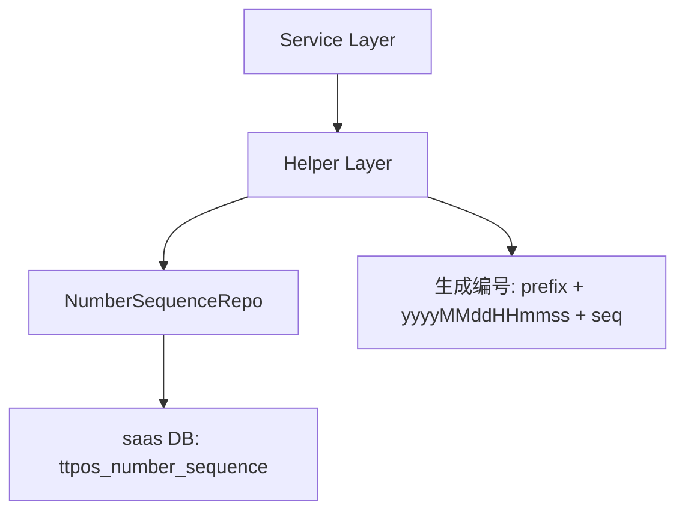

# 新管理端-品牌采购-单据编号命名规则优化 设计文档

> 本文档定义 品牌采购单据编号命名规则优化 的技术设计和实现方案。

## 📋 概述

本功能通过优化单据编号生成规则，将时间戳从日期级别（yyyyMMdd）提升到秒级别（yyyyMMddHHmmss），并使用 saas 库的 `ttpos_number_sequence` 表统一管理序列号，确保集团内品牌采购单据编号全局唯一。

**涉及单据类型**：
1. 采购申请（外部）：`PR` + `yyyyMMddHHmmss` + `序列号`
2. 采购收货（外部）：`PRC` + `yyyyMMddHHmmss` + `序列号`
3. 品牌采购（内部）：`TPHY` + `yyyyMMddHHmmss` + `序列号`
4. 品采收货（内部）：`TPHY` + `yyyyMMddHHmmss` + `序列号`
5. 盘点单：`ST` + `yyyyMMddHHmmss` + `序列号`
6. 调拨单：`TR` + `yyyyMMddHHmmss` + `序列号`

---

## 🎯 规范对齐

### Go Main 规范 (go-main.mdc)

- Service 只依赖其他 Service 接口
- Repository 只持有 db 实例
- 不使用 panic，返回 error
- 使用 errors.WithMessage 包装错误
- 遵循分层架构：API → Service → Repository

### API 设计规范 (api.mdc)

- URL 使用 snake_case
- data 字段必须是对象
- 响应格式统一：`{code, message, data{}}`

### 数据库规范 (database.mdc)

- 使用 `ttpos_number_sequence` 表（saas 库）管理序列号
- 时间字段使用 int 类型
- 遵循现有表结构设计

---

## 🔄 代码复用分析

### 可复用的现有组件

- **NumberSequenceRepo**: `main/app/repository/number_sequence.go` - 编号序列仓储，提供 `GetNextSequence` 方法
- **NumberSequence Model**: `main/app/model/number_sequence.go` - 编号序列数据模型
- **NumberSequence Constants**: `main/app/constant/number_sequence.go` - 编号类型常量定义
- **generateInvoiceNumber 示例**: `main/app/service/order.go:5504` - 发票编号生成示例，展示如何使用 `ttpos_number_sequence` 表

### 需要修改的现有代码

- **采购申请编号生成**: `main/app/service/purchase_order/helper.go:34-82` - `generateOrderNo` 和 `generatePurchaseOrderSerialNo`
- **采购收货编号生成**: `main/app/service/purchase_order/helper.go:84-134` - `generateReceiptNo` 和 `generateReceiptOrderSerialNo`
- **盘点单编号生成**: `main/app/service/stock_reconciliation.go:855-894` - `generateOrderNo`
- **调拨单编号生成**: `main/app/service/transfer_order/helper.go:35-80` - `GenerateOrderNo`

### 集成点

- **saas 数据库**: 使用 `ttpos_number_sequence` 表存储序列号
- **现有 Repository**: 复用 `NumberSequenceRepo.GetNextSequence` 方法
- **时区处理**: 使用 `utils.SetTimezone(timezone)` 获取商家时区

---

## 🏗️ 架构设计

### 分层设计原则

**Go Main 三层架构**:

```
API 层 (Controller/API)
  ↓ 依赖
业务层 (Service/Helper)
  ↓ 依赖
数据层 (Repository)
  ↓ 依赖
Database (saas库: ttpos_number_sequence)
```

**依赖规则**:

- ✅ Helper 可以依赖 Repository（获取序列号）
- ✅ Helper 可以依赖 saas 数据库连接
- ❌ Helper 不能依赖其他 Service
- ✅ 使用事务保证序列号生成的原子性

### 架构图



### 模块划分

#### Go Main 模块

- **Service 层**: `main/app/service/` - 业务逻辑层，调用 Helper 生成编号
- **Helper 层**: `main/app/service/{module}/helper.go` - 编号生成辅助方法
- **Repository 层**: `main/app/repository/number_sequence.go` - 序列号数据访问
- **Model 层**: `main/app/model/number_sequence.go` - 序列号数据模型
- **Constant 层**: `main/app/constant/number_sequence.go` - 编号类型常量

---

## 🗄️ 数据库设计

### 使用现有表：ttpos_number_sequence

**表结构**（已存在，无需创建）：

```sql
CREATE TABLE `ttpos_number_sequence` (
    `id` int unsigned NOT NULL AUTO_INCREMENT COMMENT '主键ID',
    `company_uuid` bigint unsigned NOT NULL COMMENT '商家UUID',
    `type` varchar(32) NOT NULL COMMENT '编号类型',
    `date` date NOT NULL COMMENT '日期 YYYY-MM-DD',
    `sequence` int unsigned NOT NULL DEFAULT 0 COMMENT '当日序列号',
    `create_time` bigint unsigned NOT NULL DEFAULT 0 COMMENT '创建时间',
    `update_time` bigint unsigned NOT NULL DEFAULT 0 COMMENT '更新时间',
    PRIMARY KEY (`id`),
    UNIQUE KEY `idx_company_uuid_type_date` (`company_uuid`, `type`, `date`),
    KEY `idx_type_date` (`type`, `date`)
) ENGINE=InnoDB DEFAULT CHARSET=utf8mb4 COMMENT='通用编号序列表';
```

**字段说明**:
| 字段 | 类型 | 说明 | 约束 |
|------|------|------|------|
| id | int unsigned | 主键 ID | AUTO_INCREMENT |
| company_uuid | bigint unsigned | 商家UUID | NOT NULL |
| type | varchar(32) | 编号类型 | NOT NULL |
| date | date | 日期（YYYY-MM-DD） | NOT NULL |
| sequence | int unsigned | 当日序列号 | DEFAULT 0 |
| create_time | bigint unsigned | 创建时间 | DEFAULT 0 |
| update_time | bigint unsigned | 更新时间 | DEFAULT 0 |

**索引设计**:
- 主键索引: `PRIMARY KEY (id)`
- 唯一索引: `UNIQUE KEY idx_company_uuid_type_date (company_uuid, type, date)` - 确保每个商家、每种类型、每天只有一条记录
- 普通索引: `KEY idx_type_date (type, date)` - 支持按类型和日期查询

**使用方式**:
- 通过 `NumberSequenceRepo.GetNextSequence(companyUuid, numberType, date)` 获取下一个序列号
- 方法内部使用事务保证并发安全
- 如果记录不存在，自动创建并返回 1
- 如果记录存在，序列号自增并返回新值

---

## 📊 数据模型

### 编号类型常量扩展

```go
// main/app/constant/number_sequence.go
const (
	NumberTypeInvoice        = "invoice"        // 发票编号
	NumberTypeOrder          = "order"          // 订单编号
	NumberTypeReceipt        = "receipt"       // 收据编号
	NumberTypePurchaseReq    = "purchase_req"  // 采购申请（外部）
	NumberTypePurchaseReceipt = "purchase_receipt" // 采购收货（外部）
	NumberTypeBrandPurchase   = "brand_purchase"    // 品牌采购（内部）
	NumberTypeBrandReceipt    = "brand_receipt"     // 品采收货（内部）
	NumberTypeStockTake       = "stock_take"        // 盘点单
	NumberTypeTransfer        = "transfer"          // 调拨单
)
```

### 编号生成 Helper 接口设计

```go
// main/app/service/purchase_order/helper.go
type purchaseOrderHelper struct{}

// generateOrderNo 生成采购申请/品牌采购订单编号
// 格式：prefix + yyyyMMddHHmmss + 序列号（4位）
// 例如：PR202504030915120001, TPHY202504030915120001
func (h *purchaseOrderHelper) generateOrderNo(
    saasDB *gorm.DB,
    companyUuid uint64,
    prefix string,
    numberType string,
    timezone string,
) (string, error) {
    // 1. 获取秒级时间戳
    now := utils.SetTimezone(timezone).Now()
    timestamp := now.Format("20060102150405") // yyyyMMddHHmmss
    
    // 2. 获取日期字符串（用于序列号表）
    dateStr := now.Format("2006-01-02") // YYYY-MM-DD
    
    // 3. 从 ttpos_number_sequence 表获取下一个序列号
    seqRepo := repository.NewNumberSequenceRepo(saasDB)
    seq, err := seqRepo.GetNextSequence(companyUuid, numberType, dateStr)
    if err != nil {
        return "", errors.WithMessage(err, "获取序列号失败")
    }
    
    // 4. 组装编号：prefix + timestamp + 序列号（4位）
    orderNo := fmt.Sprintf("%s%s%04d", prefix, timestamp, seq)
    return orderNo, nil
}

// generateReceiptNo 生成采购收货/品采收货编号
// 格式：prefix + yyyyMMddHHmmss + 序列号（4位）
// 例如：PRC202504030915120001, TPHY202504030915120001
func (h *purchaseOrderHelper) generateReceiptNo(
    saasDB *gorm.DB,
    companyUuid uint64,
    prefix string,
    numberType string,
    timezone string,
) (string, error) {
    // 实现逻辑同 generateOrderNo
    // ...
}
```

---

## 🔌 API 设计

### 无需新增 API

本功能是内部优化，不涉及新增 API 接口。现有创建单据的 API 会自动使用新的编号生成逻辑。

**影响的现有 API**:
- `POST /api/v1/shop/purchase_order/create` - 创建采购申请/品牌采购
- `POST /api/v1/shop/purchase_receipt_order/create` - 创建采购收货/品采收货
- `POST /api/v1/shop/stock_reconciliation/save` - 创建盘点单
- `POST /api/v1/shop/transfer_order/create` - 创建调拨单

---

## 🧩 组件和接口

### Helper 层修改

#### 采购订单 Helper

```go
// main/app/service/purchase_order/helper.go

// generateOrderNo 生成采购申请/品牌采购订单编号
// 新格式：prefix + yyyyMMddHHmmss + 序列号（4位）
func (h *purchaseOrderHelper) generateOrderNo(
    saasDB *gorm.DB,
    companyUuid uint64,
    prefix string,
    numberType string,
    timezone string,
) (string, error) {
    now := utils.SetTimezone(timezone).Now()
    timestamp := now.Format("20060102150405") // yyyyMMddHHmmss
    dateStr := now.Format("2006-01-02")       // YYYY-MM-DD
    
    seqRepo := repository.NewNumberSequenceRepo(saasDB)
    seq, err := seqRepo.GetNextSequence(companyUuid, numberType, dateStr)
    if err != nil {
        return "", errors.WithMessage(err, "获取序列号失败")
    }
    
    return fmt.Sprintf("%s%s%04d", prefix, timestamp, seq), nil
}

// generateReceiptNo 生成采购收货/品采收货编号
func (h *purchaseOrderHelper) generateReceiptNo(
    saasDB *gorm.DB,
    companyUuid uint64,
    prefix string,
    numberType string,
    timezone string,
) (string, error) {
    // 实现逻辑同 generateOrderNo
    // ...
}
```

#### 盘点单 Helper

```go
// main/app/service/stock_reconciliation.go

// generateOrderNo 生成盘点单编号
// 新格式：ST + yyyyMMddHHmmss + 序列号（4位）
func (s *stockReconciliationSrv) generateOrderNo(
    saasDB *gorm.DB,
    companyUuid uint64,
    timezone string,
) (string, error) {
    now := utils.SetTimezone(timezone).Now()
    timestamp := now.Format("20060102150405") // yyyyMMddHHmmss
    dateStr := now.Format("2006-01-02")       // YYYY-MM-DD
    
    seqRepo := repository.NewNumberSequenceRepo(saasDB)
    seq, err := seqRepo.GetNextSequence(companyUuid, constant.NumberTypeStockTake, dateStr)
    if err != nil {
        return "", errors.WithMessage(err, "获取序列号失败")
    }
    
    return fmt.Sprintf("ST%s%04d", timestamp, seq), nil
}
```

#### 调拨单 Helper

```go
// main/app/service/transfer_order/helper.go

// GenerateOrderNo 生成调拨单订单编号
// 新格式：TR + yyyyMMddHHmmss + 序列号（4位）
func (h *transferOrderHelper) GenerateOrderNo(
    saasDB *gorm.DB,
    companyUuid uint64,
    timezone string,
) (string, error) {
    now := utils.SetTimezone(timezone).Now()
    timestamp := now.Format("20060102150405") // yyyyMMddHHmmss
    dateStr := now.Format("2006-01-02")       // YYYY-MM-DD
    
    seqRepo := repository.NewNumberSequenceRepo(saasDB)
    seq, err := seqRepo.GetNextSequence(companyUuid, constant.NumberTypeTransfer, dateStr)
    if err != nil {
        return "", errors.WithMessage(err, "获取序列号失败")
    }
    
    return fmt.Sprintf("TR%s%04d", timestamp, seq), nil
}
```

### Service 层修改

#### 采购订单 Service

```go
// main/app/service/purchase_order/purchase_order.go

// 修改 CreatePurchaseOrder 方法
func (s *purchaseOrderSrv) CreatePurchaseOrder(...) {
    // ...
    
    // 获取 saas 数据库连接
    saasDB := s.dbm.GetDB(constant.DefaultDB)
    
    // 获取公司 UUID（使用总部 UUID 或当前公司 UUID）
    companyUuid := ctx.GetCompanySetting().HeadquarterUuid
    if companyUuid == 0 {
        companyUuid = ctx.GetCompanyUuid()
    }
    
    // 确定前缀和编号类型
    prefix := utils.IfString(req.PurchaseType == 2, "TPHY", "PR")
    numberType := utils.IfString(req.PurchaseType == 2, 
        constant.NumberTypeBrandPurchase, 
        constant.NumberTypePurchaseReq)
    
    // 生成订单编号
    orderNo, err := s.helper.generateOrderNo(
        saasDB,
        companyUuid,
        prefix,
        numberType,
        ctx.GetCompanySetting().Timezone,
    )
    if err != nil {
        return nil, errors.WithMessage(err, "生成订单编号失败")
    }
    
    // ...
}
```

---

## ⚡ 缓存设计

### 无需额外缓存

- `ttpos_number_sequence` 表本身通过唯一索引保证并发安全
- `GetNextSequence` 方法使用数据库事务保证原子性
- 序列号生成频率不高，无需 Redis 缓存

---

## 🚨 错误处理

### 错误场景

#### 场景 1: 获取序列号失败

- **处理方式**: 返回错误，不生成编号
- **用户影响**: 创建单据失败，提示"生成单据编号失败"
- **代码示例**:
  ```go
  seq, err := seqRepo.GetNextSequence(companyUuid, numberType, dateStr)
  if err != nil {
      return "", errors.WithMessage(err, "获取序列号失败")
  }
  ```

#### 场景 2: 数据库连接失败

- **处理方式**: 返回错误，不生成编号
- **用户影响**: 创建单据失败，提示"数据库连接失败"
- **代码示例**:
  ```go
  saasDB := s.dbm.GetDB(constant.DefaultDB)
  if saasDB == nil {
      return "", errors.New("saas 数据库连接失败")
  }
  ```

#### 场景 3: 时区配置错误

- **处理方式**: 使用系统默认时区
- **用户影响**: 编号时间戳可能不准确，但不影响功能
- **代码示例**:
  ```go
  timezone := ctx.GetCompanySetting().Timezone
  if timezone == "" {
      timezone = "Asia/Shanghai" // 默认时区
  }
  ```

---

## 🔒 安全设计

### 并发安全

- **数据库事务**: `GetNextSequence` 方法使用事务保证序列号生成的原子性
- **唯一索引**: `ttpos_number_sequence` 表的唯一索引防止并发冲突
- **事务隔离**: 使用数据库事务隔离级别保证数据一致性

### 数据安全

- **参数化查询**: 使用 GORM 参数化查询防止 SQL 注入
- **时区验证**: 验证时区配置的有效性
- **序列号范围**: 序列号范围 1-9999，超出范围自动重置

---

## 🧪 测试策略

### 单元测试

**目标覆盖率**:
- Helper 方法: 100%
- Service 方法: 70%+

**测试内容**:
- 编号格式验证（前缀 + 时间戳 + 序列号）
- 序列号递增验证
- 并发场景测试（同一秒内生成多个编号）
- 时区处理测试
- 错误处理测试

**示例**:

```go
// main/app/service/purchase_order/helper_test.go
func TestPurchaseOrderHelper_generateOrderNo(t *testing.T) {
    // 测试编号格式
    // 测试序列号递增
    // 测试并发安全
}
```

### 集成测试

**测试内容**:
- 端到端创建单据流程
- 编号唯一性验证
- 历史数据兼容性测试

---

## 📈 性能优化

### 优化策略

1. **数据库优化**:
   - `ttpos_number_sequence` 表已有唯一索引，查询性能良好
   - 使用事务保证原子性，避免锁竞争

2. **并发控制**:
   - 数据库事务保证序列号生成的原子性
   - 唯一索引防止并发冲突

3. **查询优化**:
   - 序列号查询使用唯一索引，查询时间 < 10ms

### 性能指标

- 编号生成时间: < 50ms
- 数据库查询: < 10ms
- 并发能力: 支持 100+ QPS

---

## 📚 实现清单

### Phase 1: 常量定义和 Helper 修改

- [ ] 扩展编号类型常量（constant/number_sequence.go）
- [ ] 修改采购订单 Helper（purchase_order/helper.go）
- [ ] 修改盘点单 Helper（stock_reconciliation.go）
- [ ] 修改调拨单 Helper（transfer_order/helper.go）

### Phase 2: Service 层修改

- [ ] 修改采购订单 Service（purchase_order/purchase_order.go）
- [ ] 修改采购收货 Service（purchase_order/receipt_order.go）
- [ ] 修改盘点单 Service（stock_reconciliation.go）
- [ ] 修改调拨单 Service（transfer_order/transfer_order.go）

### Phase 3: 测试

- [ ] Helper 单元测试
- [ ] Service 单元测试
- [ ] 集成测试
- [ ] 并发测试

**详细任务**: 参见 `tasks.md`

---

## Graphiti & 活动日志

- Related Episode: `[待补充]`
- 模板：`docs/agent/templates/graphiti-episode.md`
- 活动日志：`docs/team/activities/{YYYY-MM}/{YYYY-MM-DD}.md`
- 在技术方案评审、关键架构决策或踩坑总结后，立即补充 Episode 并在设计文档尾部互链。

---

**版本**: v1.0.0  
**创建日期**: 2025-12-24  
**作者**: weifashi  
**审核者**: {审核者}

