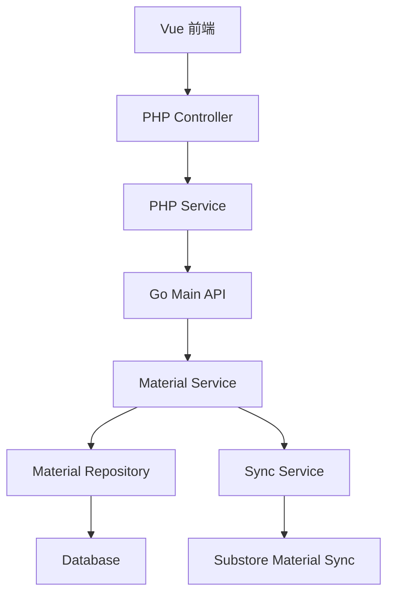

# 新管理端-物品可见性 设计文档

> 本文档定义新管理端-物品可见性功能的技术设计和实现方案。

## 📋 概述

在物品管理模块中增加"允许子店可见"设置开关，通过数据库字段控制物品在子店的可见性。当子店进行物品同步操作后，可见性设置才会生效。该功能主要涉及：

- **数据库层**: 在 `ttpos_material` 表中增加 `allow_substore_visible` 字段
- **Go Main 模块**: 更新 Material 模型，修改物品查询接口，添加可见性过滤逻辑
- **PHP Admin 模块**: 更新 Material 模型，添加物品管理界面控件
- **Vue 前端模块**: 在物品管理页面添加可见性设置开关和批量操作功能

---

## 🎯 规范对齐

### Go Main 规范 (go-main.mdc)

- Service 只依赖其他 Service 接口
- Repository 只持有 db 实例
- URL 使用 snake_case
- data 字段必须是对象
- 不使用 panic，返回 error
- 接口以 `I` 开头，实现以 `Impl` 结尾

### PHP 规范 (php.mdc)

- 遵循 MVC 分层
- Controller 不写业务逻辑
- 使用验证器验证参数
- 使用软删除

### API 设计规范 (api.mdc)

- URL 使用 snake_case
- 响应格式统一
- data 不能为 null 或数组

### 数据库规范 (database.mdc)

- 必需字段完整（id, uuid, create_time, update_time, delete_time）
- 时间字段使用 int
- 字段名使用 snake_case

---

## 🔄 代码复用分析

### 可复用的现有组件

- **Material 模型**: `main/app/model/material.go` - 物品数据模型
- **Material Service**: `main/app/service/material.go` - 物品业务逻辑，包含同步方法 `SyncMaterial`
- **Material Repository**: `main/app/repository/material_repo.go` - 物品数据访问
- **批量操作逻辑**: 参考现有的物品批量停用/开启功能

### 集成点

- **物品同步逻辑**: `main/app/service/material.go` 的 `SyncMaterial` 方法（第 2778 行）
- **物品查询接口**: 所有涉及物品列表查询的接口
- **物品管理界面**: PHP Admin 模块的物品管理页面

---

## 🏗️ 架构设计

### 分层设计原则

**Go Main 三层架构**:

```
API 层 (Controller/API)
  ↓ 依赖
业务层 (Service)
  ↓ 依赖
数据层 (Repository)
```

**依赖规则**:

- ✅ 上层可依赖下层
- ❌ 禁止下层依赖上层
- ❌ 禁止跨层调用
- ❌ Service 不能依赖 Repository
- ✅ Service 可以依赖其他 Service 接口

### 架构图



### 模块划分

#### Go Main 模块

- **Model 层**: `main/app/model/material.go` - 添加 `AllowSubstoreVisible` 字段
- **Repository 层**: `main/app/repository/material_repo.go` - 添加可见性过滤选项方法
- **Service 层**: `main/app/service/material.go` - 修改同步逻辑，添加可见性过滤
- **API 层**: `main/app/api/material_api.go` - 物品查询接口自动应用过滤（子店）

#### PHP Admin 模块

- **Controller 层**: `admin/app/{admin|shop}/controller/MaterialController.php` - 物品管理接口
- **Service 层**: `admin/app/{admin|shop}/service/MaterialService.php` - 业务逻辑
- **Model 层**: `admin/app/common/model/product/Material.php` - 添加字段映射

#### Vue 前端模块

- **Pages**: `admin/views/{admin|shop}/pages/material/index.vue` - 物品管理页面
- **Components**: 添加可见性开关组件
- **API**: `admin/views/{admin|shop}/api/material.ts` - API 封装

---

## 🗄️ 数据库设计

### 数据表设计

#### 表: ttpos_material（修改现有表）

**新增字段**:

```sql
ALTER TABLE `ttpos_material` 
ADD COLUMN `allow_substore_visible` tinyint(1) NOT NULL DEFAULT 1 
COMMENT '允许子店可见：1-允许，0-不允许' 
AFTER `warehouse_uuid`;

-- 添加索引（可选，用于查询优化）
ALTER TABLE `ttpos_material` 
ADD INDEX `idx_allow_substore_visible` (`allow_substore_visible`);
```

**字段说明**:

| 字段 | 类型 | 说明 | 约束 |
|------|------|------|------|
| allow_substore_visible | tinyint(1) | 允许子店可见 | DEFAULT 1, NOT NULL |

**索引设计**:

- 普通索引: `KEY idx_allow_substore_visible (allow_substore_visible)`（用于子店查询过滤）

**迁移文件**: `admin/database/migrations/{YYYYMMDDHHMMSS}_add_allow_substore_visible_to_material_table.php`

### 数据库迁移

**迁移脚本**:

```bash
# 创建迁移文件
cd admin
php think migrate:create AddAllowSubstoreVisibleToMaterialTable

# 执行迁移
php think migrate:run
```

**同步 Go Model**:

在 `main/app/model/material.go` 中添加对应字段

---

## 📊 数据模型

### Go Model

```go
// main/app/model/material.go
type Material struct {
	BaseModel
	Name                  string   `gorm:"type:text;default:'';column:name;comment:'原料名称'"`
	Code                  string   `gorm:"default:'';column:code;comment:'原料编码'"`
	// ... 其他字段 ...
	WarehouseUuid         uint64   `gorm:"default:0;column:warehouse_uuid;comment:'默认仓库Uuid，表示该原料的来自哪个仓库'"`
	AllowSubstoreVisible  int      `gorm:"type:tinyint(1);default:1;column:allow_substore_visible;comment:'允许子店可见：1-允许，0-不允许'"` // 新增字段
	
	// ... 关联关系 ...
}
```

### PHP Model

```php
// admin/app/common/model/product/Material.php
class Material extends BaseModel
{
    // ... 现有字段 ...
    
    /**
     * 允许子店可见：1-允许，0-不允许
     */
    protected $allowSubstoreVisible = 1;
    
    // ... 其他代码 ...
}
```

---

## 🔌 API 设计

### RESTful API

#### API 1: 更新物品可见性设置

**请求**:

- **URL**: `/api/v1/material/update_visible`
- **Method**: `POST`
- **Headers**:
  ```json
  {
    "Authorization": "Bearer {token}",
    "Content-Type": "application/json"
  }
  ```
- **Body**:
  ```json
  {
    "uuid": 123456,
    "allow_substore_visible": 0
  }
  ```

**响应**:

```json
{
  "code": 1,
  "message": "success",
  "data": {
    "uuid": 123456,
    "allow_substore_visible": 0
  }
}
```

#### API 2: 批量更新物品可见性

**请求**:

- **URL**: `/api/v1/material/batch_update_visible`
- **Method**: `POST`
- **Body**:
  ```json
  {
    "uuids": [123456, 123457, 123458],
    "allow_substore_visible": 0
  }
  ```

**响应**:

```json
{
  "code": 1,
  "message": "success",
  "data": {
    "updated_count": 3
  }
}
```

#### API 3: 物品列表查询（自动过滤）

**请求**:

- **URL**: `/api/v1/material/list`
- **Method**: `POST`
- **Body**:
  ```json
  {
    "page_no": 1,
    "page_size": 20,
    "allow_substore_visible": 1  // 可选筛选条件（仅总店可用）
  }
  ```

**响应**:

```json
{
  "code": 1,
  "message": "success",
  "data": {
    "list": [
      {
        "uuid": 123456,
        "name": "物品名称",
        "allow_substore_visible": 1
      }
    ],
    "meta": {
      "page_no": 1,
      "page_size": 20,
      "total": 100
    }
  }
}
```

**说明**: 
- 子店查询时，系统自动过滤 `allow_substore_visible = 1` 的物品
- 总店查询时，可通过 `allow_substore_visible` 参数筛选

---

## 🧩 组件和接口

### Service 层

#### Service 接口（无需新增，使用现有接口）

使用现有的 `IMaterialSrv` 接口，在实现中添加可见性过滤逻辑。

#### Service 实现修改

```go
// main/app/service/material.go

// 修改同步方法，同步 allow_substore_visible 字段
func (s *materialSrv) SyncMaterial(ctx context.Context) error {
	// ... 现有同步逻辑 ...
	
	// 在同步总部物品到子店时，同步 allow_substore_visible 字段
	for _, material := range headMaterialList {
		// ... 现有同步逻辑 ...
		subShopMaterial.AllowSubstoreVisible = material.AllowSubstoreVisible
		// ... 保存逻辑 ...
	}
	
	return nil
}

// 添加可见性过滤选项方法（供 Repository 使用）
func (s *materialSrv) FilterBySubstoreVisible(ctx context.Context, db *gorm.DB) *gorm.DB {
	companySetting := ctx.GetCompanySetting()
	if companySetting.IsSubShop() {
		// 子店自动过滤，只显示允许可见的物品
		return db.Where("allow_substore_visible = ?", 1)
	}
	// 总店不过滤
	return db
}
```

### Repository 层

#### Repository 接口（无需新增，使用现有接口）

使用现有的 `IMaterialRepo` 接口。

#### Repository 实现修改

```go
// main/app/repository/material_repo.go

// 在查询方法中添加可见性过滤选项
func (r *MaterialRepoImpl) GetMaterialList(options ...DBOption) []model.Material {
	db := r.db.Where("delete_time = ?", 0)
	
	for _, option := range options {
		db = option(db)
	}
	
	var list []model.Material
	db.Find(&list)
	return list
}

// 添加可见性过滤选项方法
func (r *MaterialRepoImpl) WhereAllowSubstoreVisible(visible int) DBOption {
	return func(db *gorm.DB) *gorm.DB {
		return db.Where("allow_substore_visible = ?", visible)
	}
}
```

### API 层

```go
// main/app/api/material_api.go

// 修改物品列表查询接口，自动应用可见性过滤
func (api *MaterialAPI) GetList(c *gin.Context) {
	var req dto_req.MaterialListReq
	if err := c.ShouldBindJSON(&req); err != nil {
		helper.ErrorWithDetail(c, constant.CodeInvalidParam, err)
		return
	}

	// 获取 Service
	materialSrv := service.NewMaterialSrv(api.dbm)
	
	// 查询物品列表（Service 内部会自动应用可见性过滤）
	list, total, err := materialSrv.GetList(c, &req)
	if err != nil {
		helper.ErrorWithDetail(c, constant.CodeFail, err)
		return
	}

	helper.Success(c, gin.H{
		"data": dto_resp.MaterialListResp{
			List: list,
			Meta: &dto_resp.PageMeta{
				PageNo:   req.PageNo,
				PageSize: req.PageSize,
				Total:    total,
			},
		},
	})
}
```

---

## ⚡ 缓存设计

### Redis 缓存

**缓存策略**: 暂不缓存，物品列表查询频率较低，直接查询数据库。

**未来优化**: 如需要，可缓存物品可见性设置，Key 格式：`ttpos:material:visible:{material_uuid}`

---

## 🚨 错误处理

### 错误场景

#### 场景 1: 子店尝试修改可见性设置

- **处理方式**: API 层检查用户权限，子店用户不允许修改
- **用户影响**: 返回权限错误提示
- **代码示例**:
  ```go
  companySetting := ctx.GetCompanySetting()
  if companySetting.IsSubShop() {
      return nil, errors.New("子店无权修改物品可见性设置")
  }
  ```

#### 场景 2: 同步失败

- **处理方式**: 记录错误日志，返回错误信息
- **用户影响**: 提示同步失败，建议重试

---

## 🔒 安全设计

### 身份验证

- **JWT Token**: 所有 API 需要 Token 验证

### 权限控制

- **总店权限**: 可以设置和查看物品可见性
- **子店权限**: 只能查看允许可见的物品，不能修改设置

### 数据安全

- **SQL 注入防护**: 使用参数化查询
- **XSS 防护**: 前端输入校验

---

## 🧪 测试策略

### 单元测试

**目标覆盖率**:

- main/app/service: 70%+
- main/app/repository: 80%+

**测试内容**:

- Service 业务逻辑（同步逻辑、可见性过滤）
- Repository 数据访问（可见性过滤选项）

### API 测试

**测试内容**:

- 总店设置可见性
- 子店查询物品列表（自动过滤）
- 批量操作

### 集成测试

**测试流程**:

- 总店设置物品可见性
- 子店同步物品
- 子店查询物品列表（验证过滤）
- 子店在 10 个业务模块中查询（验证过滤）

---

## 📈 性能优化

### 优化策略

1. **数据库优化**:
   - 添加索引 `idx_allow_substore_visible`
   - 优化 SQL 查询（子店查询时自动添加 WHERE 条件）

2. **查询优化**:
   - 子店查询时，在 SQL 层面过滤，减少数据传输

### 性能指标

- 本地响应时间: < 200ms
- 数据库查询: < 50ms

---

## 📚 实现清单

### Phase 1: 数据库和模型

- [ ] 创建数据库迁移文件
- [ ] 执行数据库迁移
- [ ] 更新 Go Model
- [ ] 更新 PHP Model

### Phase 2: 核心实现（Go Main）

- [ ] 修改 Repository，添加可见性过滤选项
- [ ] 修改 Service，添加可见性过滤逻辑
- [ ] 修改同步逻辑，同步可见性字段
- [ ] 修改 API，自动应用可见性过滤

### Phase 3: PHP Admin 模块

- [ ] 更新 Material Model
- [ ] 添加物品管理界面控件（可见性开关）
- [ ] 添加批量操作功能

### Phase 4: Vue 前端模块

- [ ] 添加可见性设置开关组件
- [ ] 添加批量操作 UI
- [ ] 添加筛选功能

### Phase 5: 业务模块过滤

- [ ] 修改 10 个业务模块的查询接口，添加可见性过滤

**详细任务**: 参见 `tasks.md`

---

## Graphiti & 活动日志

- Related Episode: `[待补充]`
- 模板：`docs/agent/templates/graphiti-episode.md`
- 活动日志：`docs/team/activities/{YYYY-MM}/{YYYY-MM-DD}.md`
- 在技术方案评审、关键架构决策或踩坑总结后，立即补充 Episode 并在设计文档尾部互链。

---

**版本**: v1.0.0  
**创建日期**: 2025-11-21  
**作者**: weifashi  
**审核者**: {审核者}

