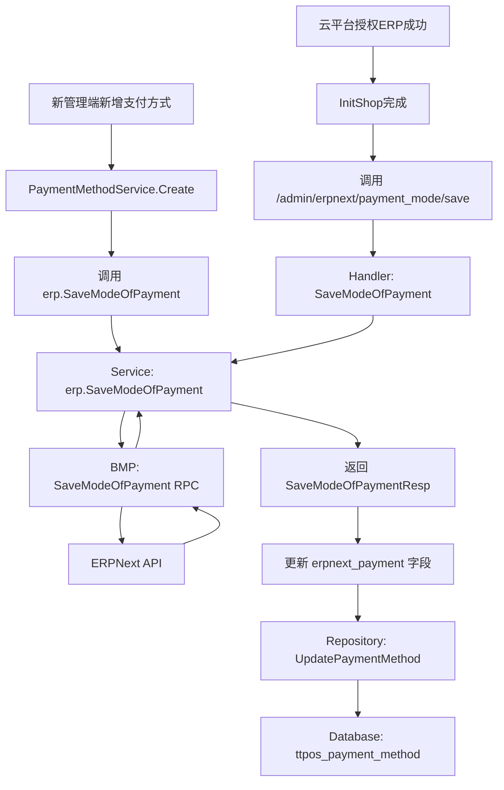
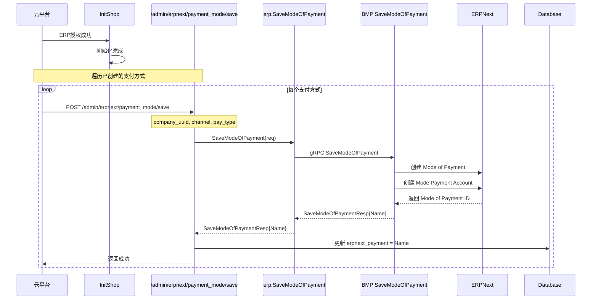
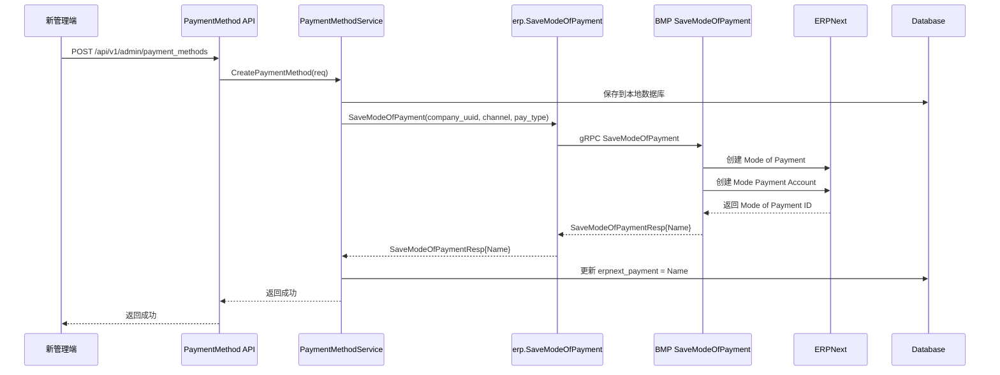

# story-admin-payment-mode-management / 新管理端支付方式管理 设计文档

> 本文档定义新管理端支付方式管理与 ERPNext 双向同步的技术设计和实现方案。

## 📋 概述

新管理端（Go Main 模块）需要实现支付方式管理功能，支持支付方式的创建、更新、删除，并与 ERPNext 系统进行双向同步。核心功能包括：

1. **云平台授权后同步**：云平台商家授权 ERP 成功后，调用 `/admin/erpnext/payment_mode/save` 同步已创建的支付方式到 ERP，并保存返回的 `erpnext_payment`
2. **新管理端新增同步**：新管理端新增支付方式时，调用 `SaveModeOfPayment` 同步到 ERP，并保存返回的 `erpnext_payment`

**技术说明**：使用现有数据表 `ttpos_payment_method`，无需创建新表。`SaveModeOfPayment` 方法已返回 `*selling.SaveModeOfPaymentResp`，包含生成的 Mode of Payment ID。

---

## 🎯 规范对齐

### Go Main 规范 (go-main.mdc)

- ✅ Service 只依赖其他 Service 接口
- ✅ Repository 只持有 db 实例
- ✅ URL 使用 snake_case
- ✅ data 字段必须是对象
- ✅ 不使用 panic，返回 error
- ✅ 接口以 `I` 开头，实现以 `Impl` 结尾

### API 设计规范 (api.mdc)

- ✅ URL 使用 snake_case（如：`/admin/erpnext/payment_mode/save`）
- ✅ 响应格式统一：`{code, message, data{}}`
- ✅ data 不能为 null 或数组

### 数据库规范 (database.mdc)

- ✅ 使用现有表 `ttpos_payment_method`
- ✅ 时间字段使用 int 类型
- ✅ UUID 字段使用 bigint unsigned

---

## 🔄 代码复用分析

### 可复用的现有组件

- **SaveModeOfPayment 方法**: `main/app/service/rpc/erp/selling.go:459` - 已实现，返回 `*selling.SaveModeOfPaymentResp`
- **SaveModeOfPayment API**: `main/app/api/v1/admin/handler.go:202` - `/admin/erpnext/payment_mode/save` 接口已存在
- **PaymentMethod Repository**: `main/app/repository/payment_method.go` - 支付方式数据访问层
- **PaymentMethod Service**: `main/app/service/payment_method.go` - 支付方式业务逻辑层
- **UpdatePaymentMethod**: `main/app/repository/payment_method.go:264` - 更新支付方式方法

### 集成点

- **现有 API**: `/admin/erpnext/payment_mode/save` - 用于云平台授权后同步支付方式
- **现有 Service**: `erp.SaveModeOfPayment` - 新管理端新增支付方式时调用
- **数据库表**: `ttpos_payment_method` - 使用现有表结构，更新 `erpnext_payment` 字段
- **InitShop 流程**: `main/app/service/rpc/erp/setup.go:79` - 云平台授权 ERP 成功后的初始化流程

---

## 🏗️ 架构设计

### 分层设计原则

**Go Main 三层架构**:

```
API 层 (Handler)
  ↓ 依赖
业务层 (Service)
  ↓ 依赖
数据层 (Repository)
```

**依赖规则**:

- ✅ 上层可依赖下层
- ❌ 禁止下层依赖上层
- ✅ Service 可以依赖其他 Service 接口
- ✅ Repository 只持有 db 实例

### 架构图



### 模块划分

#### Go Main 模块

- **API 层**: `main/app/api/v1/admin/handler.go` - 路由处理、参数校验
- **Service 层**: `main/app/service/rpc/erp/selling.go` - ERP 同步业务逻辑
- **Service 层**: `main/app/service/payment_method.go` - 支付方式业务逻辑
- **Repository 层**: `main/app/repository/payment_method.go` - 数据访问
- **Model 层**: `main/app/model/payment_order.go` - 数据模型（PaymentMethod）
- **DTO 层**: `main/app/dto/req/erpnext.go` - 请求参数

---

## 🗄️ 数据库设计

### 使用现有表结构

**表名**: `ttpos_payment_method`（已存在）

**关键字段**:

| 字段 | 类型 | 说明 |
|------|------|------|
| `id` | INT(11) | 主键 ID |
| `uuid` | BIGINT | 唯一标识 |
| `source` | INT(10) | 类型：0=系统，1=手动，2=LianLianPay |
| `erpnext_payment` | VARCHAR(255) | Mode of Payment ID（需要更新） |
| `payment_name` | VARCHAR(255) | 支付方式名称 |
| `status` | INT(10) | 状态：0=禁用，1=启用 |
| `create_time` | INT(10) | 创建时间 |
| `update_time` | INT(10) | 更新时间 |
| `delete_time` | INT(10) | 删除时间 |

**说明**：
- 无需创建新表或迁移脚本
- `erpnext_payment` 字段用于存储按命名规则生成的 Mode of Payment ID
- `source` 字段已支持类型区分（0-系统，1-手动，2-LianLianPay）

---

## 📊 数据模型

### Go Model（已存在）

```go
// main/app/model/payment_order.go
type PaymentMethod struct {
    BaseModel
    Name                 string  `gorm:"column:name"`
    Code                 int     `gorm:"column:code"`
    PaymentName          string  `gorm:"column:payment_name"`
    Source               int     `gorm:"column:source"` // 0=系统，1=手动，2=LianLianPay
    Status               int     `gorm:"column:status"`
    Sort                 int     `gorm:"column:sort"`
    ErpnextPayment       string  `gorm:"column:erpnext_payment"` // Mode of Payment ID
    // ... 其他字段
}
```

### DTO 定义

#### Request DTO（已存在）

```go
// main/app/dto/req/erpnext.go
type SaveModeOfPaymentReq struct {
    CompanyUuid uint64 `json:"company_uuid" binding:"required"` // 公司UUID
    Channel     string `json:"channel" binding:"required"`       // 渠道（LianLianPay 或空）
    PayType     string `json:"pay_type" binding:"required"`     // 支付方式（如 Alipay, WeChat Pay）
}
```

#### Response DTO（已存在）

```go
// ttpos-bmp/app/ttpos-erp/api/selling/selling.pb.go
type SaveModeOfPaymentResp struct {
    Name string `json:"name"` // 规范化名称 {channel}-{pay_type}-{NNNN} - {company_abbr}
}
```

---

## 🔌 API 设计

### RESTful API

#### API 1: 保存/同步支付方式（已存在，需更新）

**请求**:

- **URL**: `/admin/erpnext/payment_mode/save`
- **Method**: `POST`
- **Headers**:
  ```json
  {
    "Authorization": "Bearer {token}",
    "Content-Type": "application/json"
  }
  ```
- **Body**:
  ```json
  {
    "company_uuid": 123456,
    "channel": "LianLianPay",
    "pay_type": "Alipay"
  }
  ```

**响应**:

```json
{
  "code": 1,
  "message": "保存成功",
  "data": {
    "name": "LianLianPay-Alipay-0000 - No.21"
  }
}
```

**实现位置**: `main/app/api/v1/admin/handler.go:202`

**需要更新**：保存返回的 `erpnext_payment` 到数据库

---

## 🧩 组件和接口

### Service 层

#### Service 方法（已存在，已更新）

```go
// main/app/service/rpc/erp/selling.go
func (s *erpSrv) SaveModeOfPayment(ctx pkgCtx.Context, saveModeOfPaymentReq req.SaveModeOfPaymentReq) (*selling.SaveModeOfPaymentResp, error) {
    // 1. 获取公司信息
    // 2. 验证 ERP 是否开启
    // 3. 调用 BMP SaveModeOfPayment RPC
    // 4. 返回 SaveModeOfPaymentResp（包含 Name）
}
```

**返回值**：`*selling.SaveModeOfPaymentResp`，包含生成的 Mode of Payment ID（Name 字段）

### Repository 层

#### Repository 方法（已存在）

```go
// main/app/repository/payment_method.go
type IPaymentMethodRepo interface {
    UpdatePaymentMethod(data map[string]any, options ...DBOption) error
    WhereUuid(uuid uint64) DBOption
    // ... 其他方法
}
```

---

## ⚡ 核心业务流程

### 流程 1: 云平台授权 ERP 成功后同步支付方式

**触发时机**: 云平台商家授权 ERP 成功后（`InitShop` 完成后）

**执行流程**:



**实现要点**:

1. **查询已创建的支付方式**: 从 `ttpos_payment_method` 表查询 `source` 不为空且 `erpnext_payment` 为空的记录
2. **批量同步**: 遍历每个支付方式，调用 `/admin/erpnext/payment_mode/save`
3. **保存返回值**: 将返回的 `SaveModeOfPaymentResp.Name` 更新到 `erpnext_payment` 字段
4. **根据 source 确定 channel**: `source=2` → `channel="LianLianPay"`，其他 → `channel=""`

**代码位置**: 
- API: `main/app/api/v1/admin/handler.go:202`（已存在，需更新保存逻辑）
- Service: `main/app/service/rpc/erp/selling.go:459`（已存在，已返回响应）
- 需要新增：在 `InitShop` 完成后调用批量同步逻辑

### 流程 2: 新管理端新增支付方式同步

**触发时机**: 新管理端用户创建新的支付方式

**执行流程**:



**实现要点**:

1. **创建本地记录**: 先保存到 `ttpos_payment_method` 表
2. **同步到 ERP**: 调用 `erp.SaveModeOfPayment` 方法
3. **保存返回值**: 将返回的 `SaveModeOfPaymentResp.Name` 更新到 `erpnext_payment` 字段
4. **根据 source 确定 channel**: `source=2` → `channel="LianLianPay"`，其他 → `channel=""`

**代码位置**:
- Service: `main/app/service/payment_method.go:327` Create 方法（已存在，需添加 ERP 同步逻辑）
- Service: `main/app/service/rpc/erp/selling.go:459` SaveModeOfPayment（已存在，已返回响应）

---

## 🚨 错误处理

### 错误场景

#### 场景 1: ERP 未开启

- **处理方式**: 返回错误 "商家erp未开启"
- **用户影响**: 提示用户先开启 ERP
- **代码示例**:
  ```go
  if !company.IsOpenErp() || company.CompanySetting.ErpnextSiteCode == "" {
      return nil, errors.WithMessage(errors.New("商家erp未开启"))
  }
  ```

#### 场景 2: BMP RPC 调用失败

- **处理方式**: 记录错误日志，返回错误信息
- **用户影响**: 提示用户同步失败，可重试
- **代码示例**:
  ```go
  result, err := client.SaveModeOfPayment(ctx, params)
  if err != nil {
      logger.Logger.Error("SaveModeOfPayment-SaveModeOfPayment", zap.Error(err))
      return nil, errors.WithMessage(err)
  }
  ```

#### 场景 3: 更新 erpnext_payment 失败

- **处理方式**: 记录错误日志，但不回滚 ERP 操作（ERP 已创建成功）
- **用户影响**: ERP 中已有支付方式，但本地 `erpnext_payment` 字段未更新，可手动修复

---

## 🔒 安全设计

### 身份验证

- **JWT Token**: 所有 API 需要 Token 验证
- **内部接口**: `/admin/erpnext/payment_mode/save` 使用 `middleware.Internal()` 中间件

### 权限控制

- **管理员权限**: 只有管理员可以管理支付方式
- **公司隔离**: 通过 `company_uuid` 隔离不同公司的数据

---

## 🧪 测试策略

### 单元测试

**目标覆盖率**:

- main/app/service: 70%+
- main/app/repository: 80%+
- **Payment 相关: 100%**（高风险）

**测试内容**:

- Service 业务逻辑
- Repository 数据访问
- ERP 同步逻辑
- erpnext_payment 字段更新逻辑

### API 测试

**测试内容**:

- `/admin/erpnext/payment_mode/save` 接口调用
- 参数验证
- 响应格式
- erpnext_payment 字段更新

### 集成测试

**测试流程**:

- 端到端业务流程（创建 → 同步 → 查询）
- ERP 同步测试（Mock BMP RPC）
- erpnext_payment 字段更新测试

---

## 📈 性能优化

### 优化策略

1. **批量同步**: 云平台授权后批量同步支付方式，使用 goroutine 并发处理
2. **异步同步**: ERP 同步使用异步队列（可选），不阻塞主流程
3. **缓存优化**: 缓存支付方式列表（Redis，TTL 10 分钟）

### 性能指标

- 本地响应时间: < 200ms
- ERP 同步时间: < 2s（单次）
- 批量同步时间: < 10s（10 个支付方式）

---

## 📚 实现清单

### Phase 1: 云平台授权后同步支付方式

- [x] 在 `InitShop` 完成后调用批量同步逻辑 ✅ `main/app/service/rpc/erp/setup.go:162-204`
- [x] 查询已创建的支付方式（`source` 不为空，`erpnext_payment` 为空） ✅ 已实现
- [x] 遍历调用 `SaveModeOfPayment` ✅ 已实现
- [x] 保存返回的 `erpnext_payment` 字段 ✅ `InitErpnextPayment` 批量更新

### Phase 2: 新管理端新增支付方式同步

- [x] 在 `PaymentMethodService.Create` 中添加 ERP 同步逻辑 ✅ `main/app/service/payment_method.go:386-432`
- [x] 调用 `erp.SaveModeOfPayment` 方法 ✅ 已实现
- [x] 保存返回的 `erpnext_payment` 字段 ✅ 已实现
- [x] 在 `PaymentMethodService.Update` 中添加 ERP 同步逻辑 ✅ `main/app/service/payment_method.go:449-524`
- [x] 在 `PaymentMethodService.Delete` 中添加 ERP 禁用逻辑 ✅ `main/app/service/payment_method.go:546-595`

### Phase 3: 命名规则生成

- [x] 实现命名规则生成工具类（Go） ✅ `main/app/service/rpc/erp/payment_mode_naming.go`
- [x] 实现命名规则生成工具类（PHP） ✅ `admin/app/common/library/erp/PaymentModeNaming.php`
- [x] 实现 source 到 channel 的映射 ✅ `GetChannelBySource` 函数
- [x] 实现序号计算逻辑 ✅ `getNextSequenceNumber` 函数

### Phase 4: 测试和优化

- [ ] 单元测试（待完成）
- [ ] API 测试（待完成）
- [ ] 集成测试（待完成）
- [ ] 性能优化（待完成）

**详细任务**: 参见 `tasks.md`

---

## Graphiti & 活动日志

- Related Episode: `待补充`
- 模板：`docs/agent/templates/graphiti-episode.md`
- 活动日志：`docs/team/activities/王昱/2025-12/2025-12-12.md`
- 在技术方案评审、关键架构决策或踩坑总结后，立即补充 Episode 并在设计文档尾部互链。

---

---

## ✅ 实现状态

### 已完成功能

1. **命名规则生成工具类** ✅
   - `main/app/service/rpc/erp/payment_mode_naming.go` - Go 版本
   - `admin/app/common/library/erp/PaymentModeNaming.php` - PHP 版本
   - 实现了完整的命名规则：`{渠道}-{支付方式}-{序号}-{商家缩写}`
   - 序号规则：系统默认=0000，自行添加=0001起，LianLianPay=0000起

2. **云平台授权后批量同步** ✅
   - `main/app/service/rpc/erp/setup.go:162-204` - 在 `InitShop` 中实现
   - 遍历支付方式列表，调用 `SaveModeOfPayment` 同步到 ERP
   - 使用 `InitErpnextPayment` 批量更新 `erpnext_payment` 字段
   - 跳过已存在 `erpnext_payment` 的支付方式
   - 跳过总部同步的自行添加支付方式（无二维码图片）

3. **新管理端新增支付方式同步** ✅
   - `main/app/service/payment_method.go:386-432` - Create 方法
   - 使用事务确保数据一致性
   - 创建支付方式后，如果开启了 ERP 且 `erpnext_payment` 为空，则同步到 ERP
   - 根据 source 确定 channel，调用 `SaveModeOfPayment` 同步
   - 保存返回的 `erpnext_payment` 字段

4. **更新支付方式同步** ✅
   - `main/app/service/payment_method.go:449-524` - Update 方法
   - 如果 `erpnext_payment` 为空，则创建新的 ERP 支付方式
   - 如果 `erpnext_payment` 不为空，则更新现有的 ERP 支付方式

5. **删除支付方式同步** ✅
   - `main/app/service/payment_method.go:546-595` - Delete 方法
   - 删除支付方式时，同步禁用 ERP 中的支付方式（设置 `enabled=false`）

6. **SaveModeOfPayment 增强** ✅
   - `main/app/service/rpc/erp/selling.go` - 支持 `Enabled` 和 `Name` 参数
   - `main/app/dto/req/erpnext.go` - 更新 `SaveModeOfPaymentReq` 结构体
   - 支持创建和更新两种模式

### 待完成功能

1. **单元测试** ⏳
   - Service 层单元测试
   - Repository 层单元测试

2. **集成测试** ⏳
   - 端到端集成测试
   - 性能测试

---

**版本**: v1.0.0  
**创建日期**: 2025-12-12  
**最后更新**: 2025-12-12  
**作者**: 王昱  
**审核者**: 待定
