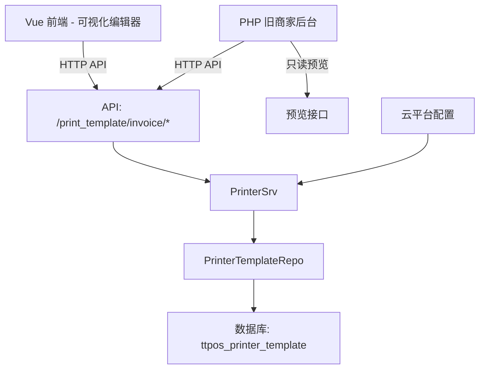

# 新管理端-自定义打印模板增加发票 设计文档

> 本文档定义新管理端发票打印模板的技术设计和实现方案。

## 📋 概述

在现有的新管理端自定义打印模板功能基础上，增加发票模板类型。提供可视化编辑界面，支持发票专属字段（发票编号、统一信用代码、交易单号、店铺编号等）、拖拽排序、重复添加、分割线/空行插入等高级编辑能力。

**核心交付物**：

- **后端（Go Main）**: 扩展打印模板系统，支持发票模板类型和发票专属字段
- **前端（Vue）**: 实现可视化编辑器，支持拖拽排序和高级编辑功能
- **旧商家后台（PHP）**: 实现发票模板预览功能（只读）

---

## 🎯 规范对齐

### Go Main 规范 (go-main.mdc)

- Service 只依赖其他 Service 接口
- Repository 只持有 db 实例
- URL 使用 snake_case
- data 字段必须是对象
- 不使用 panic，返回 error

### 打印模块规范 (go-printer.mdc)

- 遵循打印模块的架构设计
- 复用现有的打印模板基础设施
- 支持多种打印机类型
- 确保打印内容的兼容性

### API 设计规范 (api.mdc)

- URL: `/api/v1/print_template/invoice/*`
- 响应格式: `{code, message, data{}}`
- data 不能为 null 或数组

### 数据库规范 (database.mdc)

- 复用现有表 `ttpos_printer_template`
- 扩展 `tmp_data` 字段存储发票模板配置
- 使用 JSON 格式存储模板数据

### Vue 规范 (vue.mdc)

- 使用 Vue 3 + TypeScript + Vite
- 使用 Element Plus 组件库
- 使用成熟的拖拽库（Vuedraggable）

---

## 🔄 代码复用分析

### 可复用的现有组件

- **打印模板 Model**: `main/app/model/printer_template.go` - 复用现有表结构
- **打印模板 Repository**: `main/app/repository/printer_template.go` - 扩展接口和实现
- **打印模板 Service**: `main/app/service/printer.go` - 扩展业务逻辑
- **打印模板 API**: `main/app/api/v1/shop/shop_print.go` - 新增发票模板接口
- **打印模板基础组件**: `main/app/printer/template/` - 复用打印逻辑
- **旧商家后台打印**: `admin/app/shop/controller/Print.php` - 扩展预览功能

### 集成点

- **现有打印系统**: 扩展支持发票类型
- **数据库表**: 复用 `ttpos_printer_template` 表
- **云平台开关**: 集成云平台配置系统

---

## 🏗️ 架构设计

### 分层设计原则

**Go Main 三层架构**:

```
API 层 (PrintTemplateAPI)
  ↓ 解析请求参数
业务层 (PrinterSrv)
  ↓ 处理发票模板业务逻辑
数据层 (PrinterTemplateRepo)
  ↓ 数据持久化
```

**依赖规则**:

- ✅ API 层调用 Service 接口
- ✅ Service 持有 DBManager
- ✅ Repository 只持有 db 实例
- ❌ Service 不直接依赖 Repository

### 架构图



### 模块划分

#### Go Main 模块

- **API 层**: `main/app/api/v1/shop/shop_print.go` - 发票模板 CRUD 接口
- **Service 层**: `main/app/service/printer.go` - 发票模板业务逻辑
- **Repository 层**: `main/app/repository/printer_template.go` - 数据访问
- **Model 层**: `main/app/model/printer_template.go` - 数据模型
- **DTO 层**: 
  - `main/app/dto/req/printer_req.go` - 请求参数
  - `main/app/dto/resp/printer_resp.go` - 响应数据
- **打印模块**: `main/app/printer/template/` - 打印渲染逻辑

#### PHP Admin 模块

- **Controller 层**: `admin/app/shop/controller/Print.php` - 预览接口
- **View 层**: `admin/views/shop/print/invoice.html` - 预览页面

#### Vue 前端模块

- **Pages**: `admin/views/shop/pages/print-template/invoice/` - 发票模板页面
- **Components**: `admin/views/shop/components/print-template-editor/` - 可视化编辑器组件
- **API**: `admin/views/shop/api/printTemplate.ts` - API 封装

---

## 🗄️ 数据库设计

### 数据表设计

#### 表 1: ttpos_printer_template (复用现有表)

**表结构**:

```sql
CREATE TABLE IF NOT EXISTS `ttpos_printer_template` (
    `id` bigint unsigned NOT NULL AUTO_INCREMENT COMMENT '自增ID',
    `uuid` bigint unsigned NOT NULL DEFAULT 0 COMMENT '打印机模板ID',
    `name` varchar(255) NOT NULL DEFAULT '' COMMENT '打印名称',
    `template` int NOT NULL DEFAULT 1 COMMENT '模板选择',
    `is_show_sku` int NOT NULL DEFAULT 1 COMMENT '是否显示SKU：0=不显示，1=显示',
    `tmp_uuid` bigint unsigned NOT NULL DEFAULT 0 COMMENT '临时模板UUID',
    `tmp_data` text COMMENT '临时模板数据 (JSON格式)',
    `create_time` int NOT NULL DEFAULT 0 COMMENT '创建时间',
    `update_time` int NOT NULL DEFAULT 0 COMMENT '更新时间',
    `delete_time` int NOT NULL DEFAULT 0 COMMENT '删除时间',
    PRIMARY KEY (`id`),
    UNIQUE KEY `uk_uuid` (`uuid`),
    KEY `idx_tmp_uuid` (`tmp_uuid`),
    KEY `idx_delete_time` (`delete_time`)
) ENGINE=InnoDB DEFAULT CHARSET=utf8mb4 COMMENT='打印机模板表';
```

**字段说明**:
| 字段 | 类型 | 说明 | 用途 |
|------|------|------|------|
| template | int | 模板选择 | 1=结账单, 2=预结账单, **3=发票** |
| tmp_data | text | 临时模板数据 | 存储JSON格式的发票模板配置 |

**发票模板 tmp_data JSON 结构**:

```json
{
  "type": "invoice",
  "version": "1.0.0",
  "template_name": "发票模板名称",
  "is_default": false,
  "is_advanced": true,
  "config": {
    "items": [
      {
        "id": "shop_number",
        "type": "field",
        "label": "店铺编号",
        "field": "shop_number",
        "visible": true,
        "required": false,
        "order": 1
      },
      {
        "id": "invoice_number",
        "type": "field",
        "label": "发票编号",
        "field": "invoice_number",
        "visible": true,
        "required": false,
        "order": 2
      },
      {
        "id": "tax_code",
        "type": "field",
        "label": "统一信用代码",
        "field": "tax_code",
        "visible": true,
        "required": false,
        "order": 3
      },
      {
        "id": "transaction_number",
        "type": "field",
        "label": "交易单号",
        "field": "transaction_number",
        "visible": true,
        "required": false,
        "order": 4
      },
      {
        "id": "ticket_name",
        "type": "field",
        "label": "票据名称",
        "field": "ticket_name",
        "editable": true,
        "value": {
          "zh": "发票",
          "en": "Invoice"
        },
        "visible": true,
        "order": 5
      },
      {
        "id": "price_note",
        "type": "field",
        "label": "价格说明",
        "field": "price_note",
        "visible": true,
        "order": 6
      },
      {
        "id": "invoice_info",
        "type": "field",
        "label": "发票信息",
        "field": "invoice_info",
        "visible": true,
        "order": 7
      },
      {
        "id": "notice",
        "type": "field",
        "label": "注意事项",
        "field": "notice",
        "visible": true,
        "order": 8
      },
      {
        "id": "custom_text_1",
        "type": "custom_text",
        "label": "自定义文字",
        "value": {
          "zh": "",
          "en": ""
        },
        "max_length": 500,
        "visible": false,
        "order": 9
      },
      {
        "id": "custom_image_1",
        "type": "custom_image",
        "label": "自定义图片",
        "value": "",
        "visible": false,
        "order": 10
      },
      {
        "id": "divider_1",
        "type": "divider",
        "visible": false,
        "order": 11
      },
      {
        "id": "blank_line_1",
        "type": "blank_line",
        "visible": false,
        "order": 12
      }
    ],
    "products": {
      "visible": true,
      "deletable": false,
      "order": 100
    }
  },
  "cloud_advanced_enabled": false
}
```

**迁移策略**:

- 无需创建新表，复用现有表结构
- 发票模板使用 `template = 3` 标识
- 模板配置存储在 `tmp_data` 字段（JSON 格式）

---

## 📊 数据模型

### Go Model

```go
// main/app/model/printer_template.go (已存在，无需修改)
type PrinterTemplate struct {
    ID         uint64 `gorm:"column:id;primary_key;auto_increment" json:"id"`
    Uuid       uint64 `gorm:"column:uuid;unique;not null;default:0" json:"uuid"`
    Name       string `gorm:"column:name;type:varchar(255);default:''" json:"name"`
    Template   int    `gorm:"column:template;type:int(11);default:1" json:"template"` // 1=结账单, 2=预结账单, 3=发票
    IsShowSku  int    `gorm:"column:is_show_sku;type:int(1);default:1" json:"is_show_sku"`
    TmpUuid    uint64 `gorm:"column:tmp_uuid;type:bigint;not null;default:0" json:"tmp_uuid"`
    TmpData    string `gorm:"column:tmp_data;type:text" json:"tmp_data"` // JSON格式
    CreateTime int64  `gorm:"column:create_time;type:int(11);not null;default:0" json:"create_time"`
    UpdateTime int64  `gorm:"column:update_time;type:int(11);not null;default:0" json:"update_time"`
    DeleteTime int64  `gorm:"column:delete_time;type:int(10);not null;default:0" json:"delete_time"`
}

func (*PrinterTemplate) TableName() string {
    return "ttpos_printer_template"
}
```

### 发票模板配置结构

```go
// main/app/printer/pkg/template/invoice_template.go (新增)
type InvoiceTemplateConfig struct {
    Type                 string                   `json:"type"`                   // "invoice"
    Version              string                   `json:"version"`                // "1.0.0"
    TemplateName         string                   `json:"template_name"`          // 模板名称
    IsDefault            bool                     `json:"is_default"`             // 是否默认模板
    IsAdvanced           bool                     `json:"is_advanced"`            // 是否高级模板
    Config               InvoiceTemplateItems     `json:"config"`                 // 配置项
    CloudAdvancedEnabled bool                     `json:"cloud_advanced_enabled"` // 云平台是否开启高级功能
}

type InvoiceTemplateItems struct {
    Items    []InvoiceTemplateItem `json:"items"`    // 配置项列表
    Products ProductsConfig        `json:"products"` // 商品项配置
}

type InvoiceTemplateItem struct {
    ID        string                 `json:"id"`                  // 项目ID
    Type      string                 `json:"type"`                // field/custom_text/custom_image/divider/blank_line
    Label     string                 `json:"label"`               // 显示标签
    Field     string                 `json:"field,omitempty"`     // 字段名
    Editable  bool                   `json:"editable,omitempty"`  // 是否可编辑
    Value     interface{}            `json:"value,omitempty"`     // 值（多语言对象或字符串）
    MaxLength int                    `json:"max_length,omitempty"` // 最大长度（自定义文字）
    Visible   bool                   `json:"visible"`             // 是否显示
    Required  bool                   `json:"required,omitempty"`  // 是否必填
    Order     int                    `json:"order"`               // 排序
}

type ProductsConfig struct {
    Visible   bool `json:"visible"`   // 是否显示
    Deletable bool `json:"deletable"` // 是否可删除
    Order     int  `json:"order"`     // 排序
}
```

### DTO 定义

#### Request DTO

```go
// main/app/dto/req/printer_req.go (扩展)

// CreateInvoiceTemplateReq 创建发票模板请求
type CreateInvoiceTemplateReq struct {
    Name     string `json:"name" binding:"required,min=1,max=20"` // 模板名称 1-20字符
    TmpData  string `json:"tmp_data" binding:"required"`          // JSON格式的模板配置
}

// UpdateInvoiceTemplateReq 更新发票模板请求
type UpdateInvoiceTemplateReq struct {
    Uuid    uint64 `json:"uuid" binding:"required"`              // 模板UUID
    Name    string `json:"name" binding:"required,min=1,max=20"` // 模板名称
    TmpData string `json:"tmp_data" binding:"required"`          // JSON格式的模板配置
}

// GetInvoiceTemplateReq 获取发票模板请求
type GetInvoiceTemplateReq struct {
    Uuid uint64 `json:"uuid" binding:"required"` // 模板UUID
}

// DeleteInvoiceTemplateReq 删除发票模板请求
type DeleteInvoiceTemplateReq struct {
    Uuid uint64 `json:"uuid" binding:"required"` // 模板UUID
}

// UseInvoiceTemplateReq 使用发票模板请求
type UseInvoiceTemplateReq struct {
    Uuid uint64 `json:"uuid" binding:"required"` // 模板UUID
}

// RestoreDefaultInvoiceTemplateReq 恢复默认发票模板请求
type RestoreDefaultInvoiceTemplateReq struct {
    Uuid uint64 `json:"uuid" binding:"required"` // 模板UUID
}

// PreviewInvoiceTemplateReq 预览发票模板请求
type PreviewInvoiceTemplateReq struct {
    Uuid uint64 `json:"uuid" binding:"required"` // 模板UUID
}
```

#### Response DTO

```go
// main/app/dto/resp/printer_resp.go (扩展)

// InvoiceTemplateResp 发票模板响应
type InvoiceTemplateResp struct {
    Uuid       uint64 `json:"uuid"`        // 模板UUID
    Name       string `json:"name"`        // 模板名称
    IsDefault  bool   `json:"is_default"`  // 是否默认模板
    IsAdvanced bool   `json:"is_advanced"` // 是否高级模板
    IsUsing    bool   `json:"is_using"`    // 是否正在使用
    TmpData    string `json:"tmp_data"`    // JSON格式的模板配置
    CreateTime int64  `json:"create_time"` // 创建时间
    UpdateTime int64  `json:"update_time"` // 更新时间
}

// InvoiceTemplateListResp 发票模板列表响应
type InvoiceTemplateListResp struct {
    List []*InvoiceTemplateResp `json:"list"` // 模板列表
}

// InvoiceTemplatePreviewResp 发票模板预览响应
type InvoiceTemplatePreviewResp struct {
    PreviewUrl string `json:"preview_url"` // 预览图片URL
    HtmlContent string `json:"html_content"` // 预览HTML内容
}
```

---

## 🔌 API 设计

### RESTful API

#### API 1: 获取发票模板列表

**请求**:

- **URL**: `/api/v1/print_template/invoice/list`
- **Method**: `GET`
- **Headers**:
  ```json
  {
    "Authorization": "Bearer {token}",
    "Content-Type": "application/json"
  }
  ```

**响应**:

```json
{
  "code": 1,
  "message": "success",
  "data": {
    "list": [
      {
        "uuid": 123456,
        "name": "默认发票模板",
        "is_default": true,
        "is_advanced": false,
        "is_using": true,
        "tmp_data": "{...}",
        "create_time": 1733400000,
        "update_time": 1733400000
      }
    ]
  }
}
```

#### API 2: 创建发票模板

**请求**:

- **URL**: `/api/v1/print_template/invoice/create`
- **Method**: `POST`
- **Body**:
  ```json
  {
    "name": "自定义发票模板1",
    "tmp_data": "{...JSON配置...}"
  }
  ```

**响应**:

```json
{
  "code": 1,
  "message": "success",
  "data": {
    "uuid": 123457,
    "name": "自定义发票模板1",
    "is_default": false,
    "is_advanced": true,
    "is_using": false,
    "tmp_data": "{...}",
    "create_time": 1733400100,
    "update_time": 1733400100
  }
}
```

#### API 3: 更新发票模板

**请求**:

- **URL**: `/api/v1/print_template/invoice/update`
- **Method**: `POST`
- **Body**:
  ```json
  {
    "uuid": 123457,
    "name": "自定义发票模板1（修改）",
    "tmp_data": "{...JSON配置...}"
  }
  ```

**响应**:

```json
{
  "code": 1,
  "message": "success",
  "data": {}
}
```

#### API 4: 获取发票模板详情

**请求**:

- **URL**: `/api/v1/print_template/invoice/detail`
- **Method**: `GET`
- **Query**: `?uuid=123457`

**响应**:

```json
{
  "code": 1,
  "message": "success",
  "data": {
    "uuid": 123457,
    "name": "自定义发票模板1",
    "is_default": false,
    "is_advanced": true,
    "is_using": false,
    "tmp_data": "{...}",
    "create_time": 1733400100,
    "update_time": 1733400100
  }
}
```

#### API 5: 删除发票模板

**请求**:

- **URL**: `/api/v1/print_template/invoice/delete`
- **Method**: `POST`
- **Body**:
  ```json
  {
    "uuid": 123457
  }
  ```

**响应**:

```json
{
  "code": 1,
  "message": "success",
  "data": {}
}
```

#### API 6: 使用发票模板

**请求**:

- **URL**: `/api/v1/print_template/invoice/use`
- **Method**: `POST`
- **Body**:
  ```json
  {
    "uuid": 123457
  }
  ```

**响应**:

```json
{
  "code": 1,
  "message": "success",
  "data": {}
}
```

#### API 7: 恢复默认发票模板

**请求**:

- **URL**: `/api/v1/print_template/invoice/restore_default`
- **Method**: `POST`
- **Body**:
  ```json
  {
    "uuid": 123456
  }
  ```

**响应**:

```json
{
  "code": 1,
  "message": "success",
  "data": {}
}
```

#### API 8: 预览发票模板

**请求**:

- **URL**: `/api/v1/print_template/invoice/preview`
- **Method**: `GET`
- **Query**: `?uuid=123457`

**响应**:

```json
{
  "code": 1,
  "message": "success",
  "data": {
    "preview_url": "https://example.com/preview/123457.png",
    "html_content": "<html>...</html>"
  }
}
```

---

## 🧩 组件和接口

### Service 层

#### Service 接口扩展

```go
// main/app/service/i_printer_srv.go (扩展)
type IPrinterSrv interface {
    // 现有方法...
    
    // 发票模板方法
    GetInvoiceTemplateList(ctx context.Context) (*resp.InvoiceTemplateListResp, error)
    CreateInvoiceTemplate(ctx context.Context, req *dto_req.CreateInvoiceTemplateReq) (*resp.InvoiceTemplateResp, error)
    UpdateInvoiceTemplate(ctx context.Context, req *dto_req.UpdateInvoiceTemplateReq) error
    GetInvoiceTemplateDetail(ctx context.Context, uuid uint64) (*resp.InvoiceTemplateResp, error)
    DeleteInvoiceTemplate(ctx context.Context, uuid uint64) error
    UseInvoiceTemplate(ctx context.Context, uuid uint64) error
    RestoreDefaultInvoiceTemplate(ctx context.Context, uuid uint64) error
    PreviewInvoiceTemplate(ctx context.Context, uuid uint64) (*resp.InvoiceTemplatePreviewResp, error)
}
```

#### Service 实现扩展

```go
// main/app/service/printer.go (扩展)

// GetInvoiceTemplateList 获取发票模板列表
func (s *printerSrv) GetInvoiceTemplateList(ctx context.Context) (*resp.InvoiceTemplateListResp, error) {
    // 获取 Repository
    printerTemplateRepo := repository.NewPrinterTemplateRepo(s.dbm.GetDB(ctx))
    
    // 查询发票模板列表 (template = 3)
    templates, err := printerTemplateRepo.GetInvoiceTemplates()
    if err != nil {
        return nil, errors.WithMessage(err, "获取发票模板列表失败")
    }
    
    // 获取当前使用的模板UUID（从配置中读取）
    // 假设配置键为 "invoice_template_uuid"
    settingSrv := setting.NewSettingSrv(s.dbm, s.cache)
    usingUuidStr, _ := settingSrv.GetValue(ctx, "invoice_template_uuid")
    usingUuid, _ := strconv.ParseUint(usingUuidStr, 10, 64)
    
    // 转换为响应DTO
    list := make([]*resp.InvoiceTemplateResp, 0, len(templates))
    for _, template := range templates {
        // 解析 tmp_data JSON
        var config InvoiceTemplateConfig
        if err := json.Unmarshal([]byte(template.TmpData), &config); err != nil {
            continue
        }
        
        list = append(list, &resp.InvoiceTemplateResp{
            Uuid:       template.Uuid,
            Name:       template.Name,
            IsDefault:  config.IsDefault,
            IsAdvanced: config.IsAdvanced,
            IsUsing:    template.Uuid == usingUuid,
            TmpData:    template.TmpData,
            CreateTime: template.CreateTime,
            UpdateTime: template.UpdateTime,
        })
    }
    
    return &resp.InvoiceTemplateListResp{List: list}, nil
}

// CreateInvoiceTemplate 创建发票模板
func (s *printerSrv) CreateInvoiceTemplate(ctx context.Context, req *dto_req.CreateInvoiceTemplateReq) (*resp.InvoiceTemplateResp, error) {
    // 验证模板名称长度
    if len(req.Name) < 1 || len(req.Name) > 20 {
        return nil, errors.New("模板名称必须在1-20字符之间")
    }
    
    // 验证 JSON 格式
    var config InvoiceTemplateConfig
    if err := json.Unmarshal([]byte(req.TmpData), &config); err != nil {
        return nil, errors.WithMessage(err, "模板配置格式错误")
    }
    
    // 检查重复添加限制（最多5次）
    if err := s.validateItemDuplication(&config); err != nil {
        return nil, err
    }
    
    // 创建模板
    printerTemplateRepo := repository.NewPrinterTemplateRepo(s.dbm.GetDB(ctx))
    
    template := &model.PrinterTemplate{
        Uuid:       pkg_uuid.GenerateUuid(),
        Name:       req.Name,
        Template:   3, // 发票类型
        TmpData:    req.TmpData,
        CreateTime: time.Now().Unix(),
        UpdateTime: time.Now().Unix(),
    }
    
    if err := printerTemplateRepo.CreatePrinterTemplate(*template); err != nil {
        return nil, errors.WithMessage(err, "创建发票模板失败")
    }
    
    // 返回响应
    return &resp.InvoiceTemplateResp{
        Uuid:       template.Uuid,
        Name:       template.Name,
        IsDefault:  config.IsDefault,
        IsAdvanced: config.IsAdvanced,
        IsUsing:    false,
        TmpData:    template.TmpData,
        CreateTime: template.CreateTime,
        UpdateTime: template.UpdateTime,
    }, nil
}

// validateItemDuplication 验证项目重复添加限制
func (s *printerSrv) validateItemDuplication(config *InvoiceTemplateConfig) error {
    itemCount := make(map[string]int)
    for _, item := range config.Config.Items {
        if item.Type == "field" {
            itemCount[item.Field]++
            if itemCount[item.Field] > 5 {
                return errors.New(fmt.Sprintf("【%s】最多可重复添加5次", item.Label))
            }
        }
    }
    return nil
}

// DeleteInvoiceTemplate 删除发票模板
func (s *printerSrv) DeleteInvoiceTemplate(ctx context.Context, uuid uint64) error {
    printerTemplateRepo := repository.NewPrinterTemplateRepo(s.dbm.GetDB(ctx))
    
    // 获取模板详情
    template, err := printerTemplateRepo.GetPrinterTemplateByUuid(uuid)
    if err != nil {
        return errors.WithMessage(err, "模板不存在")
    }
    
    // 解析配置
    var config InvoiceTemplateConfig
    if err := json.Unmarshal([]byte(template.TmpData), &config); err != nil {
        return errors.WithMessage(err, "模板配置解析失败")
    }
    
    // 默认模板不可删除
    if config.IsDefault {
        return errors.New("默认模板不可删除")
    }
    
    // 检查是否正在使用
    settingSrv := setting.NewSettingSrv(s.dbm, s.cache)
    usingUuidStr, _ := settingSrv.GetValue(ctx, "invoice_template_uuid")
    usingUuid, _ := strconv.ParseUint(usingUuidStr, 10, 64)
    
    if uuid == usingUuid {
        return errors.New("正在使用的模板不可删除")
    }
    
    // 软删除
    template.DeleteTime = time.Now().Unix()
    if err := printerTemplateRepo.UpdatePrinterTemplate(template); err != nil {
        return errors.WithMessage(err, "删除发票模板失败")
    }
    
    return nil
}

// 其他方法实现...
```

### Repository 层扩展

```go
// main/app/repository/printer_template.go (扩展)

// IPrinterTemplateRepo 接口扩展
type IPrinterTemplateRepo interface {
    // 现有方法...
    
    // 发票模板方法
    GetInvoiceTemplates() ([]model.PrinterTemplate, error)
    GetPrinterTemplateByUuid(uuid uint64) (model.PrinterTemplate, error)
}

// GetInvoiceTemplates 获取所有发票模板
func (r *PrinterTemplateRepoImpl) GetInvoiceTemplates() ([]model.PrinterTemplate, error) {
    var templates []model.PrinterTemplate
    err := r.db.Model(&model.PrinterTemplate{}).
        Where("template = ?", 3). // 发票类型
        Where("delete_time = ?", 0).
        Order("create_time DESC").
        Find(&templates).Error
    return templates, err
}

// GetPrinterTemplateByUuid 根据UUID获取模板
func (r *PrinterTemplateRepoImpl) GetPrinterTemplateByUuid(uuid uint64) (model.PrinterTemplate, error) {
    var template model.PrinterTemplate
    err := r.db.Model(&model.PrinterTemplate{}).
        Where("uuid = ?", uuid).
        Where("delete_time = ?", 0).
        First(&template).Error
    return template, err
}
```

---

## ⚡ 缓存设计

### Redis 缓存

**缓存策略**:

- **Key 命名**: `ttpos:print_template:invoice:{uuid}`
- **过期时间**: 5分钟
- **更新策略**: Cache-Aside Pattern

**示例**:

```go
// 缓存读取
key := fmt.Sprintf("ttpos:print_template:invoice:%d", uuid)
cached, err := s.cache.Get(key)
if err == nil {
    // 缓存命中
    var template resp.InvoiceTemplateResp
    json.Unmarshal([]byte(cached), &template)
    return &template, nil
}

// 缓存未命中，查询数据库
template, err := printerTemplateRepo.GetPrinterTemplateByUuid(uuid)
if err != nil {
    return nil, err
}

// 写入缓存
cacheData, _ := json.Marshal(template)
s.cache.Set(key, string(cacheData), 5*time.Minute)
return &template, nil
```

---

## 🚨 错误处理

### 错误场景

#### 场景 1: 模板名称未填写

- **处理方式**: 返回错误提示
- **用户影响**: 前端显示Toast "请填写模板名称"
- **代码示例**:
  ```go
  if req.Name == "" {
      return nil, errors.New("请填写模板名称")
  }
  ```

#### 场景 2: 删除正在使用的模板

- **处理方式**: 返回错误提示
- **用户影响**: 前端显示Toast "正在使用的模板不可删除"
- **代码示例**:
  ```go
  if uuid == usingUuid {
      return errors.New("正在使用的模板不可删除")
  }
  ```

#### 场景 3: 项目重复添加超过5次

- **处理方式**: 返回错误提示
- **用户影响**: 前端显示Toast "【xxx】最多可重复添加5次"
- **代码示例**:
  ```go
  if itemCount[item.Field] > 5 {
      return errors.New(fmt.Sprintf("【%s】最多可重复添加5次", item.Label))
  }
  ```

---

## 🔒 安全设计

### 身份验证

- **JWT Token**: 所有 API 需要 Token 验证
- **商家身份**: 验证商家UUID

### 权限控制

- **RBAC**: 基于角色的访问控制
- **API 权限**: 每个 API 检查用户权限

### 数据安全

- **SQL 注入防护**: 使用参数化查询
- **XSS 防护**: 前端输入校验
- **图片上传验证**: 验证格式和大小

---

## 🧪 测试策略

### 单元测试

**目标覆盖率**:

- main/app/service: 70%+
- main/app/repository: 80%+

**测试内容**:

- Service 业务逻辑
- Repository 数据访问
- DTO 数据转换

**示例**:

```go
// main/app/service/printer_test.go
func TestPrinterService_CreateInvoiceTemplate(t *testing.T) {
    // 测试实现
}
```

### API 测试

**测试内容**:

- API 接口调用
- 参数验证
- 响应格式
- 错误处理

### E2E 测试

**测试流程**:

- 完整的模板创建流程
- 拖拽排序功能
- 模板使用和预览

---

## 📈 性能优化

### 优化策略

1. **数据库优化**:

   - 复用现有索引
   - 优化 JSON 字段查询

2. **缓存优化**:

   - Redis 缓存模板配置
   - 缓存预热
   - 缓存穿透防护

3. **前端优化**:

   - 虚拟列表（如果模板数量很多）
   - 防抖和节流（拖拽操作）

### 性能指标

- 本地响应时间: < 200ms
- 模板列表查询: < 50ms
- 缓存命中率: > 80%

---

## 🌐 浏览器兼容性

### 前端兼容性（Vue）

- Chrome 90+
- Safari 14+
- Firefox 88+
- Edge 90+

### 响应式设计

- 桌面端: 1920x1080
- 平板端: 1024x768

---

## 📚 实现清单

### Phase 1: 后端基础

- [ ] 扩展 PrinterTemplateRepo 接口和实现
- [ ] 扩展 PrinterSrv 接口和实现
- [ ] 创建发票模板 DTO
- [ ] 实现发票模板 API

### Phase 2: 前端可视化编辑器

- [ ] 实现左侧模板选择区
- [ ] 实现右侧样式编辑区
- [ ] 实现拖拽排序功能（Vuedraggable）
- [ ] 实现分割线/空行插入
- [ ] 实现重复添加限制

### Phase 3: 旧商家后台兼容

- [ ] PHP 预览接口
- [ ] PHP 预览页面

### Phase 4: 测试和优化

- [ ] 单元测试
- [ ] API 测试
- [ ] E2E 测试
- [ ] 性能优化

**详细任务**: 参见 `tasks.md`

---

## Graphiti & 活动日志

- Related Episode: `[待补充]`
- 模板：`docs/agent/templates/graphiti-episode.md`
- 活动日志：`docs/team/activities/2025-12/2025-12-05.md`
- 在技术方案评审、关键架构决策或踩坑总结后，立即补充 Episode 并在设计文档尾部互链。

---

**版本**: v1.0.0  
**创建日期**: 2025-12-05  
**作者**: weifashi  
**审核者**: [待审核]

