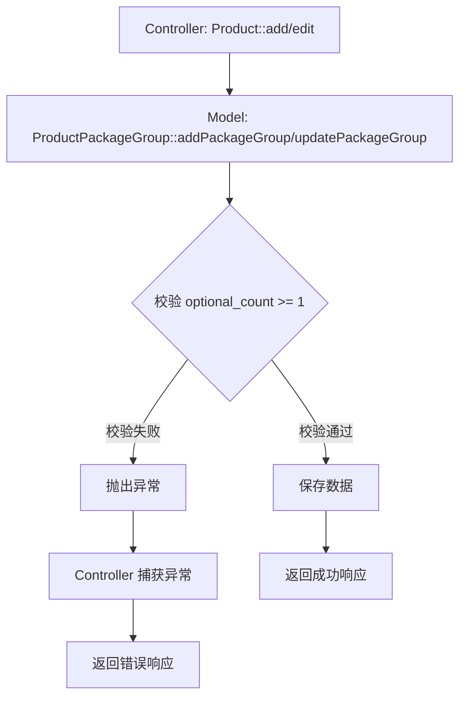

# 旧管理端-商品管理-套餐组可选数量校验 设计文档

> 本文档定义套餐组可选数量校验功能的技术设计和实现方案。

## 📋 概述

在旧管理端（PHP Admin 模块）的商品管理模块中，套餐保存接口需要添加数据校验，确保套餐组的"可选数量"字段至少为 1，防止创建无效的套餐配置。

**技术栈**: PHP (admin/) - ThinkPHP 6.0  
**影响范围**: 仅修改 PHP 后端 API，不涉及前端页面和数据库结构

---

## 🎯 规范对齐

### PHP 规范 (php.mdc)

- **遵循 MVC 分层**: Controller → Service → Model
- **Controller 不写业务逻辑**: 校验逻辑应在 Model 层实现
- **使用验证器验证参数**: 推荐使用验证器，但本需求在 Model 层直接校验
- **使用软删除**: 保持现有软删除机制

### API 设计规范 (api.mdc)

- **响应格式**: `{code, message, data{}}`
- **错误响应**: `{code: 错误码, message: "错误信息", data: {}}`
- **错误提示清晰**: 错误信息明确，便于前端展示

### 数据库规范 (database.mdc)

- **无需修改数据库结构**: 仅添加校验逻辑，不修改表结构
- **现有字段**: `ttpos_product_package_group.optional_count` 字段已存在

---

## 🔄 代码复用分析

### 可复用的现有组件

- **ProductPackageGroup Model**: `admin/app/common/model/product/ProductPackageGroup.php`
  - `addPackageGroup()` 方法：新增套餐分组
  - `updatePackageGroup()` 方法：更新套餐分组
  - 已有部分校验逻辑（检查必选+默认是否大于可选数量）

### 集成点

- **套餐保存接口**: `admin/app/shop/controller/product/store/Product.php`
  - `add()` 方法：创建套餐
  - `edit()` 方法：编辑套餐
- **套餐组 Model**: `admin/app/common/model/product/ProductPackageGroup.php`
  - 在 `addPackageGroup()` 和 `updatePackageGroup()` 方法中添加校验

---

## 🏗️ 架构设计

### 分层设计原则

**PHP MVC 三层架构**:

```
Controller 层 (Product.php)
  ↓ 调用
Model 层 (ProductPackageGroup.php)
  ↓ 校验
数据库
```

**依赖规则**:

- ✅ Controller 调用 Model 方法
- ✅ Model 层实现业务逻辑和校验
- ✅ 校验失败抛出异常，Controller 捕获并返回错误响应

### 架构图



### 模块划分

#### PHP Admin 模块

- **Controller 层**: `admin/app/shop/controller/product/store/Product.php` - 套餐保存接口
- **Model 层**: `admin/app/common/model/product/ProductPackageGroup.php` - 套餐组模型，添加校验逻辑

---

## 🗄️ 数据库设计

### 数据表设计

**无需修改数据库结构**，使用现有表：

#### 表: ttpos_product_package_group

**现有字段**:
| 字段 | 类型 | 说明 | 约束 |
|------|------|------|------|
| id | bigint unsigned | 主键 ID | AUTO_INCREMENT |
| uuid | bigint unsigned | 唯一标识 | DEFAULT 0, UNIQUE |
| optional_count | int | 可选数量 | DEFAULT 0 |
| group_type | int | 分组类型（0-固定，1-可选） | DEFAULT 0 |
| create_time | int | 创建时间 | DEFAULT 0 |
| update_time | int | 更新时间 | DEFAULT 0 |
| delete_time | int | 删除时间 | DEFAULT 0 |

**校验规则**: `optional_count` 必须 >= 1（当 `group_type` 为 1 时）

---

## 📊 数据模型

### PHP Model

**现有 Model**: `admin/app/common/model/product/ProductPackageGroup.php`

**无需新增 Model**，在现有方法中添加校验逻辑。

---

## 🔌 API 设计

### RESTful API

#### API: 保存套餐（创建/更新）

**请求**:

- **URL**: `/api/v1/shop/product/add` (创建) / `/api/v1/shop/product/edit` (更新)
- **Method**: `POST`
- **Headers**:
  ```json
  {
    "Authorization": "Bearer {token}",
    "Content-Type": "application/json"
  }
  ```
- **Body**:
  ```json
  {
    "package_group": [
      {
        "group_name": "分组名称",
        "group_type": 1,
        "optional_count": 0,  // ❌ 不允许为 0
        "product_list": [...]
      }
    ]
  }
  ```

**成功响应**:

```json
{
  "code": 1,
  "message": "success",
  "data": {
    "uuid": 123456
  }
}
```

**错误响应**:

```json
{
  "code": 0,
  "message": "套餐组可选数量不能小于 1",
  "data": {}
}
```

---

## 🧩 组件和接口

### Model 层

#### ProductPackageGroup Model

**文件**: `admin/app/common/model/product/ProductPackageGroup.php`

**修改方法**:

1. **addPackageGroup()** - 新增套餐分组
   - 在保存前校验 `optional_count >= 1`
   - 校验失败抛出异常

2. **updatePackageGroup()** - 更新套餐分组
   - 在保存前校验 `optional_count >= 1`
   - 校验失败抛出异常

**校验逻辑**:

```php
// 校验可选数量
$optionalCount = $item['optional_count'] ?? 0;
if ($optionalCount < 1) {
    throw new \Exception('套餐组可选数量不能小于 1');
}
```

**完整校验流程**:

1. 检查 `optional_count` 是否存在
2. 检查 `optional_count` 是否为整数
3. 检查 `optional_count` 是否 >= 1
4. 校验失败抛出异常，Controller 捕获并返回错误响应

---

## 🚨 错误处理

### 错误场景

#### 场景 1: optional_count 为 0

- **处理方式**: Model 层抛出异常，Controller 捕获并返回错误响应
- **用户影响**: 用户看到错误提示"套餐组可选数量不能小于 1"
- **代码示例**:
  ```php
  if ($optionalCount < 1) {
      throw new \Exception('套餐组可选数量不能小于 1');
  }
  ```

#### 场景 2: optional_count 为负数

- **处理方式**: 同场景 1，校验 `optional_count >= 1`
- **用户影响**: 用户看到错误提示"套餐组可选数量不能小于 1"

#### 场景 3: optional_count 为空或 null

- **处理方式**: 使用 `?? 0` 默认值，然后校验 >= 1
- **用户影响**: 用户看到错误提示"套餐组可选数量不能小于 1"

#### 场景 4: 多个套餐组，其中一个 optional_count 为 0

- **处理方式**: 遍历所有套餐组，任一不满足条件则拒绝保存
- **用户影响**: 用户看到错误提示，所有数据未保存

---

## 🔒 安全设计

### 数据安全

- **参数校验**: 在 Model 层校验，防止恶意输入
- **SQL 注入防护**: 使用 ThinkPHP ORM，自动参数化查询
- **异常处理**: 捕获异常，不暴露系统内部信息

---

## 🧪 测试策略

### 单元测试

**目标覆盖率**: Model 层校验逻辑 100%

**测试内容**:

- 校验逻辑正确性
- 错误处理
- 边界条件（1、0、负数、空值）

**测试用例**:

1. **正常场景**: `optional_count = 1` → 校验通过
2. **正常场景**: `optional_count = 5` → 校验通过
3. **异常场景**: `optional_count = 0` → 抛出异常
4. **异常场景**: `optional_count = -1` → 抛出异常
5. **异常场景**: `optional_count = null` → 抛出异常（默认值 0）
6. **多套餐组**: 一个为 0，其他正常 → 抛出异常，所有数据未保存

### API 测试

**测试内容**:

- API 接口调用
- 参数验证
- 响应格式
- 错误处理

**测试用例**:

1. **创建套餐**: `optional_count = 0` → 返回错误响应
2. **创建套餐**: `optional_count = 1` → 返回成功响应
3. **更新套餐**: `optional_count = 0` → 返回错误响应
4. **更新套餐**: `optional_count = 1` → 返回成功响应

---

## 📈 性能优化

### 优化策略

- **校验逻辑简单**: 仅做数值比较，性能影响可忽略
- **提前校验**: 在保存数据库前校验，避免无效操作

### 性能指标

- 校验执行时间: < 1ms
- 不影响现有接口性能

---

## 📚 实现清单

### Phase 1: 代码实现

- [ ] 在 `ProductPackageGroup::addPackageGroup()` 中添加校验
- [ ] 在 `ProductPackageGroup::updatePackageGroup()` 中添加校验
- [ ] 编写单元测试

### Phase 2: 测试验证

- [ ] 单元测试通过
- [ ] API 测试通过
- [ ] 集成测试通过

**详细任务**: 参见 `tasks.md`

---

## Graphiti & 活动日志

- Related Episode: `[待补充]`
- 模板：`docs/agent/templates/graphiti-episode.md`
- 活动日志：`docs/team/activities/{YYYY-MM}/{YYYY-MM-DD}.md`
- 在技术方案评审、关键架构决策或踩坑总结后，立即补充 Episode 并在设计文档尾部互链。

---

**版本**: v1.0.0  
**创建日期**: 2025-11-28  
**作者**: 王昱  
**审核者**: {审核者}

