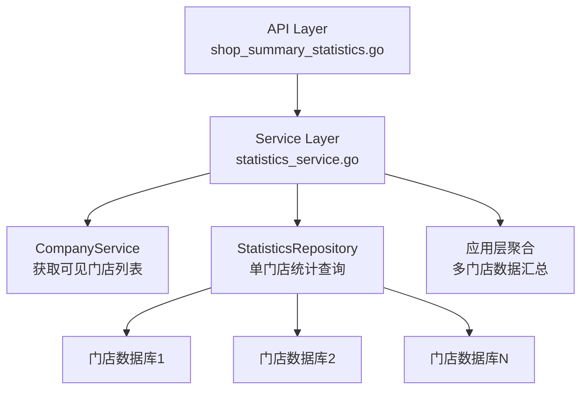

# 新管理端-报表-门店汇总统计 设计文档

> 本文档定义 新管理端-报表-门店汇总统计 的技术设计和实现方案。

## 📋 概述

在报表页面新增"门店汇总统计"功能，支持用户灵活选择数据指标（营业数据汇总/支付方式汇总/退款金额汇总），然后多选门店和选择日期范围（开始日期-结束日期），查看对应指标的每天各店数据和汇总数据。

**重要约束**：
- 已经被数据管理的订单，不参与此模块的计算（需要过滤）
- **SaaS 架构**：每个门店有独立数据库，多门店汇总需要在应用层聚合数据

**核心实现思路**：
1. **门店权限控制**：根据用户角色（总店/分店/子店）获取可查看的门店列表
2. **跨数据库查询**：遍历每个门店的独立数据库，分别查询统计数据
3. **应用层聚合**：在 Service 层聚合多个门店的数据，计算汇总行
4. **数据过滤**：由接口自行判断是否排除已被数据管理的订单（根据公司设置和数据管理设置）

---

## 🎯 规范对齐

### Go Main 规范 (go-main.mdc)

- Service 只依赖其他 Service 接口
- Repository 只持有 db 实例
- URL 使用 snake_case
- data 字段必须是对象
- 不使用 panic，返回 error
- 所有代码使用中文注释

### API 设计规范 (api.mdc)

- URL 使用 snake_case：`/api/v1/shop/shop_summary_statistics`
- 响应格式统一：`{code, message, data{}}`
- data 不能为 null 或数组

### 数据库规范 (database.mdc)

- 不新增数据库表，复用现有统计表
- 使用现有统计 Repository 方法

---

## 🔄 代码复用分析

### 可复用的现有组件

- **StatisticsService**: `main/app/service/statistics.go` - 统计服务
  - `CountBusinessSummary()` - 营业数据汇总
  - `CountPaymentMethod()` - 支付方式统计（需要确认是否存在）
- **StatisticsRepository**: `main/app/repository/statistics.go` - 统计数据仓库
  - `CountBusinessSummary()` - 营业数据汇总查询
  - `CountBusinessPaymentMethod()` - 支付方式统计查询（需要确认是否存在）
- **CompanyService**: `main/app/service/company.go` - 门店服务
  - `GetVisibleCompanyList()` - 获取可见门店列表（总店使用，返回本店及下级所有子店）
- **AuthService**: `main/app/service/auth.go` - 认证服务
  - `getCompanyList()` - 获取员工可用的商家列表（子店使用，返回本店及已授权的其他门店，过滤已过期、异常的商家）
- **CommonRepository**: `main/app/repository/common.go` - 通用仓库
  - `WhereNotInDataManageSubQuery()` - 数据管理订单过滤

### 集成点

- **现有统计 API**: 复用 `CountBusinessSummary` 的查询逻辑
- **门店权限**: 使用 `GetVisibleCompanyList` 获取可查看门店（总店）或 `GetCompanyList`（子店）
- **数据过滤**: 由接口自行判断是否排除数据管理订单（根据公司设置和数据管理设置）

---

## 🏗️ 架构设计

### 分层设计原则

**Go Main 三层架构**:

```
API 层 (Controller/API)
  ↓ 依赖
业务层 (Service)
  ↓ 依赖
数据层 (Repository)
```

**依赖规则**:

- ✅ 上层可依赖下层
- ❌ 禁止下层依赖上层
- ❌ 禁止跨层调用
- ❌ Service 不能依赖 Repository
- ✅ Service 可以依赖其他 Service 接口

### 架构图



### 模块划分

#### Go Main 模块

- **API 层**: `main/app/api/v1/shop/shop_summary_statistics.go` - 路由处理、参数校验
- **Service 层**: `main/app/service/statistics.go` - 业务逻辑、多门店聚合
- **Repository 层**: `main/app/repository/statistics.go` - 数据访问、数据库操作（复用现有方法）
- **DTO 层**: `main/app/dto/` - 数据传输对象
  - `req/shop_summary_statistics_req.go` - 请求参数
  - `resp/shop_summary_statistics_resp.go` - 响应数据

#### Vue 前端模块

- **Pages**: `admin/views/shop/pages/report/shop-summary-statistics/index.vue` - 页面
- **Components**: `admin/views/shop/components/report/` - 报表组件
- **API**: `admin/views/shop/api/report.ts` - API 封装
- **Store**: `admin/views/shop/store/report.ts` - 状态管理（如需要）

---

## 🗄️ 数据库设计

### 数据表设计

**不新增数据库表**，复用现有统计表：

- `ttpos_statistics_business_comprehensive` - 营业数据汇总表
- `ttpos_statistics_business_payment_method` - 支付方式统计表
- `ttpos_return_order` - 退款订单表（用于退款统计）

### SaaS 架构下的数据查询策略

**关键挑战**：每个门店有独立数据库，无法使用 SQL JOIN 跨数据库查询

**解决方案**：
1. **遍历门店数据库**：根据用户选择的门店列表，遍历每个门店的独立数据库
2. **分别查询**：在每个门店数据库中执行统计查询
3. **应用层聚合**：在 Service 层聚合多个门店的数据
4. **汇总计算**：根据汇总规则计算汇总行的数据

**性能优化**：
- 使用 goroutine 并发查询多个门店数据库
- 使用 channel 收集查询结果
- 设置超时机制，避免单个门店查询阻塞整体响应

---

## 📊 数据模型

### Request DTO

```go
// main/app/dto/req/shop_summary_statistics_req.go
type ShopSummaryStatisticsReq struct {
    // 数据指标类型：business(营业数据汇总)、payment_method(支付方式汇总)、refund(退款金额汇总)
    IndicatorType string   `json:"indicator_type" binding:"required,oneof=business payment_method refund"`
    
    // 门店UUID列表（多选）
    CompanyUuids  []uint64 `json:"company_uuids" binding:"required,min=1"`
    
    // 开始日期（格式：YYYY-MM-DD）
    QueryStartDate string `json:"query_start_date" binding:"required"`
    
    // 结束日期（格式：YYYY-MM-DD）
    QueryEndDate string `json:"query_end_date" binding:"required"`
    
    // 支付方式UUID列表（仅支付方式汇总时使用，可选）
    PaymentMethodUuids []uint64 `json:"payment_method_uuids,omitempty"`
    
    // 注意：ExcludeDataManage 不在请求参数中，由接口自行判断
}
```

### Response DTO

```go
// main/app/dto/resp/shop_summary_statistics_resp.go

// 营业数据汇总响应
type BusinessSummaryResp struct {
    DetailList []BusinessSummaryDetailItem `json:"detail_list"` // 明细表
    SummaryRow BusinessSummaryDetailItem   `json:"summary_row"` // 汇总行
}

type BusinessSummaryDetailItem struct {
    Date               string  `json:"date"`                  // 营业日
    CompanyName        string  `json:"company_name"`           // 门店名称
    OrderAmount        float64 `json:"order_amount"`           // 订单金额
    PayAmount          float64 `json:"pay_amount"`            // 实付金额
    OrderNum           int64   `json:"order_num"`             // 订单数量
    MealNum            int64   `json:"meal_num"`              // 用餐人数
    DeskNum            int64   `json:"desk_num"`              // 消费桌数
    AvgCustomerPrice   float64 `json:"avg_customer_price"`    // 平均客单价
    OrderAmountMealAvg float64 `json:"order_amount_meal_avg"` // 订单金额人均
    OrderAmountAvg     float64 `json:"order_amount_avg"`      // 订单金额单均
    PayAmountAvg       float64 `json:"pay_amount_avg"`         // 实付金额单均
    InstantOrderAmount float64 `json:"instant_order_amount"`  // 点餐订单金额
    DeskOrderAmount    float64 `json:"desk_order_amount"`     // 桌台订单金额
    TakeoutOrderAmount float64 `json:"takeout_order_amount"`   // 外送订单金额
}

// 支付方式汇总响应
type PaymentMethodSummaryResp struct {
    DetailList []PaymentMethodSummaryDetailItem `json:"detail_list"` // 明细表
    SummaryList []PaymentMethodSummaryDetailItem `json:"summary_list"` // 汇总表（按支付方式分组）
}

type PaymentMethodSummaryDetailItem struct {
    Date         string  `json:"date"`          // 营业日
    CompanyName  string  `json:"company_name"`  // 门店名称
    PaymentName  string  `json:"payment_name"`  // 支付方式名称
    PaymentAmount float64 `json:"payment_amount"` // 支付金额
    PaymentNum   int64   `json:"payment_num"`   // 支付笔数
    PaymentRatio float64 `json:"payment_ratio"` // 支付占比
}

// 退款金额汇总响应
type RefundSummaryResp struct {
    DetailList []RefundSummaryDetailItem `json:"detail_list"` // 明细表
    SummaryRow RefundSummaryDetailItem   `json:"summary_row"` // 汇总行
}

type RefundSummaryDetailItem struct {
    Date              string  `json:"date"`               // 营业日
    CompanyName       string  `json:"company_name"`       // 门店名称
    RefundAmount      float64 `json:"refund_amount"`     // 退款金额
    RefundNum         int64   `json:"refund_num"`        // 退款笔数
    RefundRate        float64 `json:"refund_rate"`        // 退款率
    PartialRefundAmount float64 `json:"partial_refund_amount"` // 部分退款金额
    PartialRefundNum   int64   `json:"partial_refund_num"`     // 部分退款笔数
    FullRefundAmount   float64 `json:"full_refund_amount"`     // 整单退款金额
    FullRefundNum      int64   `json:"full_refund_num"`        // 整单退款笔数
}

// 门店列表响应
type ShopSummaryCompanyListResp struct {
    List []*resp.CompanyStaffResp `json:"list"` // 门店列表
}

// 门店支付方式列表响应
type CompanyPaymentMethodListResp struct {
    List []CompanyPaymentMethodItem `json:"list"` // 支付方式列表（已去重）
}

// 门店支付方式项
type CompanyPaymentMethodItem struct {
    PaymentName string `json:"payment_name"` // 支付方式名称
}
```

---

## 🔌 API 设计

### RESTful API

#### API 1: 获取门店汇总统计

**请求**:

- **URL**: `/api/v1/shop/shop_summary_statistics`
- **Method**: `POST`
- **Headers**:
  ```json
  {
    "Authorization": "Bearer {token}",
    "Content-Type": "application/json"
  }
  ```
- **Body**:
  ```json
  {
    "indicator_type": "business",
    "company_uuids": [123456, 789012],
    "query_start_date": "2026-01-01",
    "query_end_date": "2026-01-02"
  }
  ```

**响应**:

```json
{
  "code": 1,
  "message": "success",
  "data": {
    "detail_list": [
      {
        "date": "2026-01-01",
        "company_name": "门店A",
        "order_amount": 10000.00,
        "pay_amount": 9500.00,
        "order_num": 100,
        "meal_num": 200,
        "desk_num": 50,
        "avg_customer_price": 47.50,
        "order_amount_meal_avg": 50.00,
        "order_amount_avg": 100.00,
        "pay_amount_avg": 95.00,
        "instant_order_amount": 3000.00,
        "desk_order_amount": 5000.00,
        "takeout_order_amount": 2000.00
      }
    ],
    "summary_row": {
      "date": "汇总",
      "company_name": "合计",
      "order_amount": 20000.00,
      "pay_amount": 19000.00,
      "order_num": 200,
      "meal_num": 400,
      "desk_num": 100,
      "avg_customer_price": 47.50,
      "order_amount_meal_avg": 50.00,
      "order_amount_avg": 100.00,
      "pay_amount_avg": 95.00,
      "instant_order_amount": 6000.00,
      "desk_order_amount": 10000.00,
      "takeout_order_amount": 4000.00
    }
  }
}
```

**错误响应**:

```json
{
  "code": 0,
  "message": "错误信息",
  "data": {}
}
```

#### API 2: 获取门店列表

**请求**:

- **URL**: `/api/v1/shop/shop_summary_statistics/company_list`
- **Method**: `GET`
- **Headers**:
  ```json
  {
    "Authorization": "Bearer {token}",
    "Content-Type": "application/json"
  }
  ```

**响应**:

```json
{
  "code": 1,
  "message": "success",
  "data": {
    "list": [
      {
        "company_uuid": 123456,
        "company_name": "门店A",
        "roles": ["店长", "收银员"],
        "is_super": 0
      },
      {
        "company_uuid": 789012,
        "company_name": "门店B",
        "roles": ["收银员"],
        "is_super": 0
      }
    ]
  }
}
```

**说明**:
- 总店用户：返回本店及下级所有子店列表（使用 `GetVisibleCompanyList`）
- 子店用户：返回本店及已授权的其他门店列表（使用 `getCompanyList`，过滤已过期、异常的商家）

#### API 3: 获取门店支付方式列表

**请求**:

- **URL**: `/api/v1/shop/statistics/company/payment_methods`
- **Method**: `GET`
- **Headers**:
  ```json
  {
    "Authorization": "Bearer {token}",
    "Content-Type": "application/json"
  }
  ```

**响应**:

```json
{
  "code": 1,
  "message": "success",
  "data": {
    "list": [
      {
        "payment_name": "现金"
      },
      {
        "payment_name": "微信支付"
      },
      {
        "payment_name": "支付宝"
      }
    ]
  }
}
```

**说明**:
- 获取当前用户有权限的所有门店的支付方式列表
- 自动汇总去重（按支付方式名称）
- 排序规则：按 Sort 升序、CreateTime 倒序、ID 倒序
- 只返回启用的支付方式
- 使用 goroutine 并发查询多个门店，提高性能

#### API 4: 导出门店汇总统计

**请求**:

- **URL**: `/api/v1/shop/shop_summary_statistics/export`
- **Method**: `POST`
- **Body**: 同 API 1

**响应**: Excel 文件下载

---

## 🧩 组件和接口

### Service 层

#### Service 接口

```go
// main/app/service/i_statistics_service.go (扩展)
type IStatisticsSrv interface {
    // ... 现有方法 ...
    
    // 获取门店列表（供前端选择）
    GetShopSummaryCompanyList(ctx context.Context) (*dto_resp.ShopSummaryCompanyListResp, error)
    
    // 获取门店汇总统计
    GetShopSummaryStatistics(ctx context.Context, req *dto_req.ShopSummaryStatisticsReq) (interface{}, error)
    
    // 导出门店汇总统计
    ExportShopSummaryStatistics(ctx context.Context, req *dto_req.ShopSummaryStatisticsReq) ([]byte, error)
}

// main/app/service/i_business_service.go (扩展)
type IBusinessSrv interface {
    // ... 现有方法 ...
    
    // 获取有权限的所有门店的支付方式（汇总去重）
    GetCompanyPaymentMethods(ctx context.Context) (*dto_resp.CompanyPaymentMethodListResp, error)
}
```

#### Service 实现

```go
// main/app/service/statistics.go (扩展)

// GetShopSummaryCompanyList 获取门店列表（供前端选择）
func (s *statisticsSrv) GetShopSummaryCompanyList(ctx context.Context) (*dto_resp.ShopSummaryCompanyListResp, error) {
    // 判断当前用户是总店还是子店
    company := ctx.GetCompany()
    companySetting := ctx.GetCompanySetting()
    
    var companyList []*resp.CompanyStaffResp
    
    // 总店：使用 GetVisibleCompanyList 获取本店及下级所有子店
    if companySetting.IsHeadquarter() {
        saasDB := s.dbm.GetDB(constant.DefaultDB)
        companyRepo := repository.NewCompanyRepo(saasDB)
        visibleCompanies, err := companyRepo.GetVisibleCompanyList(company.Uuid)
        if err != nil {
            return nil, errors.WithMessage(err, "获取可见门店列表失败")
        }
        
        // 转换为 CompanyStaffResp 格式
        companyList = make([]*resp.CompanyStaffResp, 0, len(visibleCompanies))
        for _, c := range visibleCompanies {
            companyList = append(companyList, &resp.CompanyStaffResp{
                CompanyUuid: c.Uuid,
                CompanyName: c.Name,
                Roles:       []string{}, // 总店场景不需要角色信息
                IsSuper:     0,
            })
        }
    } else {
        // 子店：使用 getCompanyList 获取本店及已授权的其他门店
        // 注意：getCompanyList 是 AuthService 的私有方法，需要提取为公共方法
        // 解决方案：在 AuthService 中添加 GetCompanyList 公共方法（参考 auth.go:1741）
        // 或者将 getCompanyList 逻辑提取到 CompanyService，创建 GetAvailableCompanyList 方法
        authSrv := s.authSrv // 需要注入 IAuthSrv，并将 getCompanyList 改为 GetCompanyList 公共方法
        companyList = authSrv.GetCompanyList(ctx) // 需要将 auth.go 中的 getCompanyList 改为 GetCompanyList
    }
    
    return &dto_resp.ShopSummaryCompanyListResp{
        List: companyList,
    }, nil
}

// GetShopSummaryStatistics 获取门店汇总统计
func (s *statisticsSrv) GetShopSummaryStatistics(ctx context.Context, req *dto_req.ShopSummaryStatisticsReq) (interface{}, error) {
    // 1. 获取当前用户可见的门店列表
    company := ctx.GetCompany()
    companySetting := ctx.GetCompanySetting()
    
    var visibleCompanyUuids []uint64
    
    // 总店：使用 GetVisibleCompanyList
    if companySetting.IsHeadquarter() {
        saasDB := s.dbm.GetDB(constant.DefaultDB)
        companyRepo := repository.NewCompanyRepo(saasDB)
        visibleCompanies, err := companyRepo.GetVisibleCompanyList(company.Uuid)
        if err != nil {
            return nil, errors.WithMessage(err, "获取可见门店列表失败")
        }
        visibleCompanyUuids = make([]uint64, 0, len(visibleCompanies))
        for _, c := range visibleCompanies {
            visibleCompanyUuids = append(visibleCompanyUuids, c.Uuid)
        }
    } else {
        // 子店：使用 getCompanyList
        authSrv := s.authSrv // 需要注入 IAuthSrv
        companyList := authSrv.getCompanyList(ctx)
        visibleCompanyUuids = make([]uint64, 0, len(companyList))
        for _, c := range companyList {
            visibleCompanyUuids = append(visibleCompanyUuids, c.CompanyUuid)
        }
    }
    
    // 2. 验证用户选择的门店是否在可见列表中
    validCompanyUuids := s.validateCompanyUuids(req.CompanyUuids, visibleCompanyUuids)
    if len(validCompanyUuids) == 0 {
        return nil, errors.New("没有可查看的门店")
    }
    
    // 3. 判断是否排除数据管理订单（由接口自行判断）
    companySetting := ctx.GetCompanySetting()
    dataManageSetting, _ := s.dataManageSrv.GetDataManageSetting(ctx)
    excludeDataManage := companySetting.IsOpenDataManagement() && dataManageSetting.IsEnableDataManage
    
    // 4. 根据指标类型调用不同的统计方法
    switch req.IndicatorType {
    case "business":
        return s.getBusinessSummaryStatistics(ctx, validCompanyUuids, req.QueryStartDate, req.QueryEndDate, excludeDataManage)
    case "payment_method":
        return s.getPaymentMethodSummaryStatistics(ctx, validCompanyUuids, req.QueryStartDate, req.QueryEndDate, req.PaymentMethodUuids, excludeDataManage)
    case "refund":
        return s.getRefundSummaryStatistics(ctx, validCompanyUuids, req.QueryStartDate, req.QueryEndDate, excludeDataManage)
    default:
        return nil, errors.New("不支持的指标类型")
    }
}

// getBusinessSummaryStatistics 获取营业数据汇总统计
func (s *statisticsSrv) getBusinessSummaryStatistics(ctx context.Context, companyUuids []uint64, queryStartDate, queryEndDate string, excludeDataManage bool) (*dto_resp.BusinessSummaryResp, error) {
    // 解析日期范围为时间戳
    timezone := ctx.GetCompanySetting().Timezone
    timeUtil := utils.SetTimezone(timezone)
    startTime, err := timeUtil.FormatDateTimeToUnix(queryStartDate + " 00:00:00")
    if err != nil {
        return nil, errors.WithMessage(err, "开始日期格式错误")
    }
    endTime, err := timeUtil.FormatDateTimeToUnix(queryEndDate + " 23:59:59")
    if err != nil {
        return nil, errors.WithMessage(err, "结束日期格式错误")
    }
    
    // 使用 goroutine 并发查询多个门店
    type result struct {
        companyUuid uint64
        data        []dto_resp.BusinessSummaryDetailItem
        err         error
    }
    
    resultChan := make(chan result, len(companyUuids))
    
    for _, companyUuid := range companyUuids {
        go func(uuid uint64) {
            // 为每个门店创建新的 context
            shopCtx := s.createShopContext(ctx, uuid)
            
            // 查询该门店的统计数据
            data, err := s.queryBusinessSummaryByCompany(shopCtx, uuid, startTime, endTime, excludeDataManage)
            resultChan <- result{
                companyUuid: uuid,
                data:        data,
                err:         err,
            }
        }(companyUuid)
    }
    
    // 收集所有门店的数据
    var allDetailList []dto_resp.BusinessSummaryDetailItem
    for i := 0; i < len(companyUuids); i++ {
        res := <-resultChan
        if res.err != nil {
            logger.Logger.Error("查询门店统计数据失败", zap.Uint64("company_uuid", res.companyUuid), zap.Error(res.err))
            continue
        }
        allDetailList = append(allDetailList, res.data...)
    }
    
    // 计算汇总行
    summaryRow := s.calculateBusinessSummaryRow(allDetailList)
    
    return &dto_resp.BusinessSummaryResp{
        DetailList: allDetailList,
        SummaryRow: summaryRow,
    }, nil
}

// queryBusinessSummaryByCompany 查询单个门店的营业数据汇总
func (s *statisticsSrv) queryBusinessSummaryByCompany(ctx context.Context, companyUuid uint64, startTime, endTime int64, excludeDataManage bool) ([]dto_resp.BusinessSummaryDetailItem, error) {
    // 获取门店数据库连接
    shopDB := s.dbm.GetDB(companyUuid)
    if shopDB == nil {
        return nil, errors.New("获取门店数据库连接失败")
    }
    
    statisticsRepo := repository.NewStatisticsRepo(shopDB)
    companyRepo := repository.NewCompanyRepo(s.dbm.GetDB(constant.DefaultDB))
    
    // 获取门店名称
    company, err := companyRepo.GetCompanyInfoByUuid(companyUuid)
    if err != nil {
        return nil, errors.WithMessage(err, "获取门店信息失败")
    }
    
    // 调用 Repository 查询统计数据（按日期范围查询，返回每日数据）
    _, dataList := statisticsRepo.CountBusinessSummary(repository.CountBusinessSummaryReq{
        StartTime:         startTime,
        EndTime:           endTime,
        Cycle:             0, // 按日
        PageNo:            1,
        PageSize:          1000, // 足够大的分页大小，获取所有日期数据
        ExcludeDataManage: excludeDataManage,
        Timezone:          ctx.GetCompanySetting().Timezone,
    })
    
    // 转换为响应格式
    var result []dto_resp.BusinessSummaryDetailItem
    for _, data := range dataList {
        item := dto_resp.BusinessSummaryDetailItem{
            Date:               data.Date,
            CompanyName:        company.Name,
            OrderAmount:        data.OrderAmount.Float64,
            PayAmount:          data.PayAmount.Float64 - data.RefundAmount.Float64,
            OrderNum:           data.OrderNum.Int64,
            MealNum:            data.MealNum.Int64,
            DeskNum:            data.DeskNum.Int64,
            AvgCustomerPrice:   data.PayAmountMealAvg.Float64,
            OrderAmountMealAvg: data.OrderAmountMealAvg.Float64,
            OrderAmountAvg:     data.OrderAmountAvg.Float64,
            PayAmountAvg:       data.PayAmountAvg.Float64,
            InstantOrderAmount: data.InstantOrderAmount.Float64,
            DeskOrderAmount:    data.DeskOrderAmount.Float64,
            TakeoutOrderAmount: data.TakeoutOrderAmount.Float64,
        }
        result = append(result, item)
    }
    
    return result, nil
}

// calculateBusinessSummaryRow 计算营业数据汇总行
func (s *statisticsSrv) calculateBusinessSummaryRow(detailList []dto_resp.BusinessSummaryDetailItem) dto_resp.BusinessSummaryDetailItem {
    var summary dto_resp.BusinessSummaryDetailItem
    summary.Date = "汇总"
    summary.CompanyName = "合计"
    
    // 金额类字段：求和
    var totalOrderAmount, totalPayAmount, totalInstantOrderAmount, totalDeskOrderAmount, totalTakeoutOrderAmount float64
    var totalOrderNum, totalMealNum, totalDeskNum int64
    
    for _, item := range detailList {
        totalOrderAmount += item.OrderAmount
        totalPayAmount += item.PayAmount
        totalOrderNum += item.OrderNum
        totalMealNum += item.MealNum
        totalDeskNum += item.DeskNum
        totalInstantOrderAmount += item.InstantOrderAmount
        totalDeskOrderAmount += item.DeskOrderAmount
        totalTakeoutOrderAmount += item.TakeoutOrderAmount
    }
    
    summary.OrderAmount = totalOrderAmount
    summary.PayAmount = totalPayAmount
    summary.OrderNum = totalOrderNum
    summary.MealNum = totalMealNum
    summary.DeskNum = totalDeskNum
    summary.InstantOrderAmount = totalInstantOrderAmount
    summary.DeskOrderAmount = totalDeskOrderAmount
    summary.TakeoutOrderAmount = totalTakeoutOrderAmount
    
    // 比率类字段：重新计算
    if totalMealNum > 0 {
        summary.AvgCustomerPrice = totalPayAmount / float64(totalMealNum)
        summary.OrderAmountMealAvg = totalOrderAmount / float64(totalMealNum)
    }
    if totalOrderNum > 0 {
        summary.OrderAmountAvg = totalOrderAmount / float64(totalOrderNum)
        summary.PayAmountAvg = totalPayAmount / float64(totalOrderNum)
    }
    
    return summary
}
```

### API 层

```go
// main/app/api/v1/shop/shop_summary_statistics.go
type shopSummaryStatisticsHandler struct {
    statisticsSrv service.IStatisticsSrv
}

func NewShopSummaryStatisticsHandler(statisticsSrv service.IStatisticsSrv) *shopSummaryStatisticsHandler {
    return &shopSummaryStatisticsHandler{
        statisticsSrv: statisticsSrv,
    }
}

// GetShopSummaryCompanyList 获取门店列表
// @Summary 获取门店列表
// @Description 获取门店汇总统计可选择的门店列表（总店返回本店及下级所有子店，子店返回本店及已授权的其他门店）
// @Tags 商家端.报表
// @Accept json
// @Produce json
// @Security JwtToken
// @Success 200 {object} dto.Response{data=dto_resp.ShopSummaryCompanyListResp} "门店列表"
// @Router /shop/shop_summary_statistics/company_list [get]
func (h *shopSummaryStatisticsHandler) GetShopSummaryCompanyList(c *gin.Context) {
    ctx := helper.GetContext(c)
    resp, err := h.statisticsSrv.GetShopSummaryCompanyList(ctx)
    if err != nil {
        helper.ErrorWithDetail(c, constant.CodeFail, errors.WithMessage(err))
        return
    }
    helper.Success(c, gin.H{
        "data": resp,
    })
}

// GetShopSummaryStatistics 获取门店汇总统计
// @Summary 获取门店汇总统计
// @Description 获取门店汇总统计（营业数据汇总/支付方式汇总/退款金额汇总）
// @Tags 商家端.报表
// @Accept json
// @Produce json
// @Security JwtToken
// @Param data body dto_req.ShopSummaryStatisticsReq true "查询参数"
// @Success 200 {object} dto.Response{data=interface{}} "统计数据"
// @Router /shop/shop_summary_statistics [post]
func (h *shopSummaryStatisticsHandler) GetShopSummaryStatistics(c *gin.Context) {
    ctx := helper.GetContext(c)
    var req dto_req.ShopSummaryStatisticsReq
    if err := c.ShouldBindJSON(&req); err != nil {
        helper.HandleValidationError(c, err, req, nil)
        return
    }
    
    // 注意：ExcludeDataManage 不在请求参数中，由 Service 层自行判断
    
    resp, err := h.statisticsSrv.GetShopSummaryStatistics(ctx, &req)
    if err != nil {
        helper.ErrorWithDetail(c, constant.CodeFail, errors.WithMessage(err))
        return
    }
    
    helper.Success(c, gin.H{
        "data": resp,
    })
}

// ExportShopSummaryStatistics 导出门店汇总统计
// @Summary 导出门店汇总统计
// @Description 导出门店汇总统计Excel文件
// @Tags 商家端.报表
// @Accept json
// @Produce application/vnd.openxmlformats-officedocument.spreadsheetml.sheet
// @Security JwtToken
// @Param data body dto_req.ShopSummaryStatisticsReq true "查询参数"
// @Success 200 {file} file "Excel文件"
// @Router /shop/shop_summary_statistics/export [post]
func (h *shopSummaryStatisticsHandler) ExportShopSummaryStatistics(c *gin.Context) {
    // 实现导出逻辑
}
```

---

## ⚡ 缓存设计

### Redis 缓存

**缓存策略**:

- **Key 命名**: `ttpos:shop:summary_statistics:{indicator_type}:{company_uuids}:{query_start_date}:{query_end_date}:{exclude_data_manage}`
- **过期时间**: 5分钟（统计数据实时性要求较高）
- **更新策略**: Cache-Aside Pattern

**缓存场景**:

- 多门店、多日期查询结果缓存
- 门店列表缓存（权限范围内）

---

## 🚨 错误处理

### 错误场景

#### 场景 1: 门店数据库连接失败

- **处理方式**: 记录错误日志，跳过该门店，继续查询其他门店
- **用户影响**: 该门店的数据不显示，其他门店数据正常显示
- **代码示例**:
  ```go
  shopDB := s.dbm.GetDB(companyUuid)
  if shopDB == nil {
      logger.Logger.Error("获取门店数据库连接失败", zap.Uint64("company_uuid", companyUuid))
      continue // 跳过该门店
  }
  ```

#### 场景 2: 单个门店查询超时

- **处理方式**: 使用 context.WithTimeout 设置超时，超时后跳过该门店
- **用户影响**: 该门店的数据不显示，其他门店数据正常显示

#### 场景 3: 用户无权限查看门店

- **处理方式**: 在 Service 层验证门店权限，返回错误
- **用户影响**: 返回错误提示"无权限查看该门店"

---

## 🔒 安全设计

### 身份验证

- **JWT Token**: 所有 API 需要 Token 验证
- **Token 刷新**: 自动刷新机制

### 权限控制

- **门店权限**: 根据用户角色和权限范围，只返回可查看的门店数据
- **API 权限**: 检查用户是否有"门店汇总统计"板块权限

### 数据安全

- **SQL 注入防护**: 使用参数化查询
- **XSS 防护**: 前端输入校验
- **数据过滤**: 排除已被数据管理的订单

---

## 🧪 测试策略

### 单元测试

**目标覆盖率**:

- main/app/service: 70%+
- main/app/repository: 80%+

**测试内容**:

- Service 业务逻辑（多门店聚合）
- Repository 数据访问（单门店查询）
- 汇总计算逻辑

### API 测试

**测试内容**:

- API 接口调用
- 参数验证
- 响应格式
- 错误处理
- 权限控制

### 集成测试

**测试流程**:

- 端到端业务流程（多门店查询）
- 数据聚合准确性
- 性能测试（多门店并发查询）

---

## 📈 性能优化

### 优化策略

1. **并发查询**:
   - 使用 goroutine 并发查询多个门店数据库
   - 使用 channel 收集查询结果
   - 设置超时机制

2. **缓存优化**:
   - Redis 缓存查询结果
   - 缓存门店列表

3. **查询优化**:
   - 复用现有统计 Repository 方法
   - 使用索引优化查询

### 性能指标

- 本地响应时间: < 200ms（单门店）
- 多门店查询: < 1s（5个门店以内）
- 数据库查询: < 50ms（单门店）

---

## 📚 实现清单

### Phase 1: DTO 和 API 定义

- [ ] 创建 Request DTO
- [ ] 创建 Response DTO
- [ ] 创建 API Handler
- [ ] 注册 API 路由

### Phase 2: Service 层实现

- [ ] 实现门店权限验证
- [ ] 实现多门店并发查询
- [ ] 实现营业数据汇总统计
- [ ] 实现支付方式汇总统计
- [ ] 实现退款金额汇总统计
- [ ] 实现汇总行计算逻辑

### Phase 3: 测试和优化

- [ ] 单元测试
- [ ] API 测试
- [ ] 集成测试
- [ ] 性能优化

**详细任务**: 参见 `tasks.md`

---

## Graphiti & 活动日志

- Related Episode: `[待补充]`
- 模板：`docs/agent/templates/graphiti-episode.md`
- 活动日志：`docs/team/activities/{YYYY-MM}/{YYYY-MM-DD}.md`
- 在技术方案评审、关键架构决策或踩坑总结后，立即补充 Episode 并在设计文档尾部互链。

---

**版本**: v1.0.0  
**创建日期**: 2026-01-04  
**作者**: 王昱  
**审核者**: {审核者}

