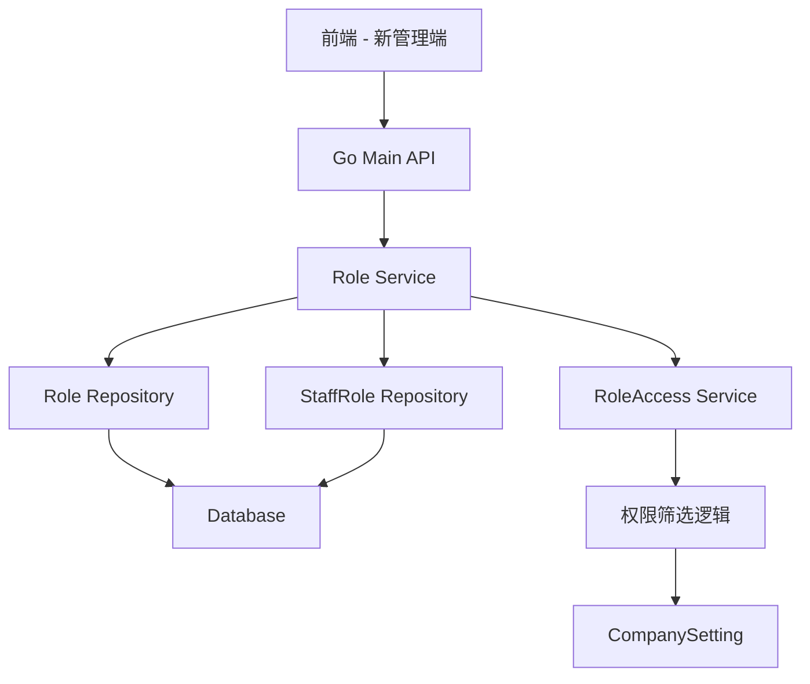

# 新管理端增加角色权限功能 设计文档

> 本文档定义新管理端增加角色权限功能的技术设计和实现方案。

## 📋 概述

在新管理端增加角色权限管理功能，支持创建角色、配置功能权限、关联员工等操作。该功能主要涉及：

- **数据库层**: 复用现有的 `ttpos_role`、`ttpos_role_access`、`ttpos_staff_role` 表
- **Go Main 模块**: 复用现有的 Role Service 和 Repository，扩展权限配置逻辑，提供角色管理 API 接口

> **注意**: 本 Spec 仅涉及 Go Main 模块开发，不涉及 PHP Admin 和 Vue 前端模块。前端可直接调用 Go Main API 实现功能。

---

## 🎯 规范对齐

### Go Main 规范 (go-main.mdc)

- Service 只依赖其他 Service 接口
- Repository 只持有 db 实例
- URL 使用 snake_case
- data 字段必须是对象
- 不使用 panic，返回 error
- 接口以 `I` 开头，实现以 `Impl` 结尾

### API 设计规范 (api.mdc)

- URL 使用 snake_case
- 响应格式统一
- data 不能为 null 或数组

### 数据库规范 (database.mdc)

- 必需字段完整（id, uuid, create_time, update_time, delete_time）
- 时间字段使用 int
- 字段名使用 snake_case

---

## 🔄 代码复用分析

### 可复用的现有组件

- **Role 模型**: `main/app/model/rbac.go` - 角色数据模型（已存在）
- **Role Repository**: `main/app/repository/role.go` - 角色数据访问（已存在）
- **Role Service**: 需要创建或扩展，用于角色业务逻辑
- **权限筛选逻辑**: `main/app/service/role_access.go` - 权限筛选方法 `filterPermission`

### 集成点

- **权限配置逻辑**: 复用 `main/app/service/role_access.go` 的权限筛选逻辑
- **角色管理接口**: 复用现有的角色 CRUD 接口
- **权限树构建**: 复用现有的权限树构建逻辑

---

## 🏗️ 架构设计

### 分层设计原则

**Go Main 三层架构**:

```
API 层 (Controller/API)
  ↓ 依赖
业务层 (Service)
  ↓ 依赖
数据层 (Repository)
```

**依赖规则**:

- ✅ 上层可依赖下层
- ❌ 禁止下层依赖上层
- ❌ 禁止跨层调用
- ❌ Service 不能依赖 Repository
- ✅ Service 可以依赖其他 Service 接口

### 架构图



> **说明**: 前端可直接调用 Go Main API，无需通过 PHP Admin 模块。

### 模块划分

#### Go Main 模块（本 Spec 范围）

- **Model 层**: `main/app/model/rbac.go` - 复用现有的 Role、RoleAccess 模型
- **Repository 层**: `main/app/repository/role.go` - 复用现有的 Role Repository
- **Service 层**: 需要创建或扩展 Role Service，添加角色管理业务逻辑
- **API 层**: 需要创建或扩展 Role API，提供角色管理接口

> **注意**: PHP Admin 和 Vue 前端模块不在本 Spec 范围内，前端可直接调用 Go Main API 实现功能。

---

## 🗄️ 数据库设计

### 数据表设计

#### 表: ttpos_role（复用现有表）

**表结构**（已存在）:

```sql
CREATE TABLE `ttpos_role` (
    `id` INT(11) UNSIGNED NOT NULL AUTO_INCREMENT PRIMARY KEY,
    `uuid` BIGINT UNSIGNED NOT NULL DEFAULT 0 COMMENT '角色ID',
    `name` VARCHAR(255) NOT NULL DEFAULT '' COMMENT '角色名称',
    `sort` INT(11) NOT NULL DEFAULT 100 COMMENT '排序',
    `create_time` INT(10) UNSIGNED NOT NULL DEFAULT 0,
    `update_time` INT(10) UNSIGNED NOT NULL DEFAULT 0,
    `delete_time` INT(10) UNSIGNED NOT NULL DEFAULT 0,
    UNIQUE KEY `unique_uuid` (`uuid`)
) ENGINE = InnoDB DEFAULT CHARSET = utf8mb4 COMMENT = '角色表';
```

#### 表: ttpos_role_access（复用现有表）

**表结构**（已存在）:

```sql
CREATE TABLE `ttpos_role_access` (
    `id` INT(11) UNSIGNED NOT NULL AUTO_INCREMENT PRIMARY KEY,
    `uuid` BIGINT UNSIGNED NOT NULL DEFAULT 0 COMMENT '角色权限关系ID',
    `role_uuid` BIGINT UNSIGNED NOT NULL DEFAULT 0 COMMENT '角色ID',
    `access_uuid` BIGINT UNSIGNED NOT NULL DEFAULT 0 COMMENT '权限ID',
    `create_time` INT(10) UNSIGNED NOT NULL DEFAULT 0,
    `update_time` INT(10) UNSIGNED NOT NULL DEFAULT 0,
    `delete_time` INT(10) UNSIGNED NOT NULL DEFAULT 0,
    UNIQUE KEY `unique_uuid` (`uuid`)
) ENGINE = InnoDB DEFAULT CHARSET = utf8mb4 COMMENT = '角色权限关系表';
```

#### 表: ttpos_staff_role（复用现有表）

**表结构**（已存在）:

```sql
CREATE TABLE `ttpos_staff_role` (
    `id` INT(11) UNSIGNED NOT NULL AUTO_INCREMENT PRIMARY KEY,
    `uuid` BIGINT UNSIGNED NOT NULL DEFAULT 0 COMMENT '员工角色关系ID',
    `staff_uuid` BIGINT UNSIGNED NOT NULL DEFAULT 0 COMMENT '员工ID',
    `role_uuid` BIGINT UNSIGNED NOT NULL DEFAULT 0 COMMENT '角色ID',
    `create_time` INT(10) UNSIGNED NOT NULL DEFAULT 0,
    `update_time` INT(10) UNSIGNED NOT NULL DEFAULT 0,
    `delete_time` INT(10) UNSIGNED NOT NULL DEFAULT 0,
    UNIQUE KEY `unique_uuid` (`uuid`)
) ENGINE = InnoDB DEFAULT CHARSET = utf8mb4 COMMENT = '员工角色关系表';
```

**说明**: 所有表已存在，无需创建迁移文件。

---

## 📊 数据模型

### Go Model

```go
// main/app/model/rbac.go（已存在）
type Role struct {
	BaseModel
	Name string `gorm:"column:name;type:varchar(255);comment:角色名称;NOT NULL" json:"name"`
	Sort int    `gorm:"column:sort;type:int(11);default:0;comment:排序(数字越小越靠前);NOT NULL" json:"sort"`
	Accesses []RoleAccess `gorm:"foreignKey:RoleUuid;references:Uuid" json:"accesses"`
}

type RoleAccess struct {
	BaseModel
	RoleUuid   uint64 `gorm:"column:role_uuid;type:bigint(20) unsigned;default:0;comment:角色ID;NOT NULL" json:"role_uuid"`
	AccessUuid uint64 `gorm:"column:access_uuid;type:bigint(20) unsigned;default:0;comment:权限ID;NOT NULL" json:"access_uuid"`
}
```

---

## 🔌 API 设计

### RESTful API

#### API 0: ShopBase 接口（增强）- 返回权限

**请求**:

- **URL**: `/api/v1/shop/base`
- **Method**: `GET`
- **Headers**:
  ```json
  {
    "Authorization": "Bearer {token}"
  }
  ```

**响应**（更新后）:

```json
{
  "code": 1,
  "message": "success",
  "data": {
    "username": "admin",
    "profile_uuid": 123456,
    "device_id": "device_001",
    "permissions": [
      {
        "uuid": 2856287473664000,
        "name": "首页",
        "path": "home",
        "children": []
      }
    ],
    "business": {},
    "buffet": {},
    "currency": {},
    "company": {}
  }
}
```

**实现要点**:

1. 在 `auth.go` 的 `ShopBase` 方法中调用权限服务：
   ```go
   // 获取员工权限（使用管理APP路由名称）
   permissions, err := s.roleAccessSrv.GetPermission(constant.ShopAppRouteName, staff.Uuid, staff.CompanyUuid)
   if err != nil {
       // 权限获取失败不影响基础信息获取，返回空权限数组
       logger.Logger.Error("获取权限失败", zap.Error(err))
       permissions = []*resp.Permission{}
   }
   ```

2. `ShopBase` 结构已包含 `permissions` 字段，无需修改：
   ```go
   type ShopBase struct {
       Username     string        `json:"username"`
       ProfileUuid  uint64        `json:"profile_uuid"`
       Permissions  []*Permission `json:"permissions"` // 已有字段
       // ... 其他字段
   }
   ```

---

#### API 1: 获取角色详情

**请求**:

- **URL**: `/api/v1/shop/role/detail?uuid={roleUuid}`
- **Method**: `GET`
- **Headers**:
  ```json
  {
    "Authorization": "Bearer {token}"
  }
  ```
- **Query Parameters**:
  - `uuid` (required): 角色UUID

**响应**:

```json
{
  "code": 1,
  "message": "success",
  "data": {
    "uuid": 123456,
    "name": "店长",
    "access_uuids": [2856266502144000, 2856287473664000],
    "staff_count": 5,
    "staff_uuids": [789012, 789013],
    "selected_leaf_count": 15,
    "total_leaf_count": 100
  }
}
```

**响应字段说明**:
- `selected_leaf_count`: 已选择叶子节点权限数量（角色已选择权限中的叶子节点总数）
- `total_leaf_count`: 公司管理APP、收银机、点餐助手三个权限组的叶子节点数量之和

> **注意**: 叶子节点是指权限树中没有子节点的权限节点。

> **注意**: 角色列表功能（`/api/v1/shop/role/list`）已从 `shop_role.go` 中移除，可能在 `shop_staff.go` 或其他模块中实现。
- **Method**: `POST`
- **Headers**:
  ```json
  {
    "Authorization": "Bearer {token}",
    "Content-Type": "application/json"
  }
  ```
- **Body**:
  ```json
  {
    "page_no": 1,
    "page_size": 20
  }
  ```

**响应**:

```json
{
  "code": 1,
  "message": "success",
  "data": {
    "list": [
      {
        "uuid": 123456,
        "name": "店长",
        "sort": 1,
        "access_count": 10,
        "staff_count": 5
      }
    ],
    "meta": {
      "page_no": 1,
      "page_size": 20,
      "total": 10
    }
  }
}
```

#### API 2: 创建角色

**请求**:

- **URL**: `/api/v1/shop/role/create`
- **Method**: `POST`
- **Headers**:
  ```json
  {
    "Authorization": "Bearer {token}",
    "Content-Type": "application/json"
  }
  ```
- **Body**:
  ```json
  {
    "name": "收银员",
    "access_uuids": [2856266502144000, 2856287473664000]  // 至少选择一个权限
  }
  ```

**响应**:

```json
{
  "code": 1,
  "message": "创建角色成功",
  "data": {
    "uuid": 123456,
    "name": "收银员",
    "create_time": 1732704000
  }
}
```

#### API 3: 更新角色

**请求**:

- **URL**: `/api/v1/shop/role/update`
- **Method**: `POST`
- **Headers**:
  ```json
  {
    "Authorization": "Bearer {token}",
    "Content-Type": "application/json"
  }
  ```
- **Body**:
  ```json
  {
    "uuid": 123456,
    "name": "收银员",
    "access_uuids": [2856266502144000, 2856287473664000],  // 至少选择一个权限
    "staff_uuids": [789012, 789013]  // 可选，编辑时关联员工
  }
  ```

**响应**:

```json
{
  "code": 1,
  "message": "更新角色成功",
  "data": {}
}
```

#### API 4: 删除角色

**请求**:

- **URL**: `/api/v1/shop/role/delete`
- **Method**: `DELETE`
- **Headers**:
  ```json
  {
    "Authorization": "Bearer {token}",
    "Content-Type": "application/json"
  }
  ```
- **Body**:
  ```json
  {
    "uuid": 123456
  }
  ```

**响应**:

```json
{
  "code": 1,
  "message": "删除角色成功",
  "data": {}
}
```

**错误响应**（角色已关联员工）:

```json
{
  "code": 0,
  "message": "该角色已关联员工，无法删除",
  "data": {}
}
```

#### API 0.5: 获取权限树接口（Requirement 0.5）

**请求**:

- **URL**: `/api/v1/shop/permission_tree`
- **Method**: `GET`
- **Headers**:
  ```json
  {
    "Authorization": "Bearer {token}",
    "Accept-Language": "zh"
  }
  ```
  - `Accept-Language`: 可选，指定返回的权限名称语言（zh/en/ja/ko等），默认为 zh

**响应**:

```json
{
  "code": 1,
  "message": "success",
  "data": {
    "list": [
      {
        "uuid": 2856287473664000,
        "name": "管理APP",
        "path": "",
        "children": [
          {
            "uuid": 2856287473664001,
            "name": "首页",
            "path": "home",
            "children": []
          }
        ]
      },
      {
        "uuid": 2856287473665000,
        "name": "收银机",
        "path": "",
        "children": []
      },
      {
        "uuid": 2856287473666000,
        "name": "点餐助手",
        "path": "",
        "children": []
      }
    ]
  }
}
```

> **注意**: 权限树不包含"管理后台"分组，只返回"管理APP"、"收银机"、"点餐助手"三个分组。

**响应示例（英文）**:

```json
{
  "code": 1,
  "message": "success",
  "data": {
    "list": [
      {
        "uuid": 2856287473664000,
        "name": "Management APP",
        "path": "",
        "children": [
          {
            "uuid": 2856287473664001,
            "name": "Home",
            "path": "home",
            "children": []
          }
        ]
      },
      {
        "uuid": 2856287473665000,
        "name": "Cashier",
        "path": "",
        "children": []
      },
      {
        "uuid": 2856287473666000,
        "name": "Assistant",
        "path": "",
        "children": []
      }
    ]
  }
}
```

> **说明**: 当请求头 `Accept-Language: en` 时，返回英文权限名称。

**实现要点**:

1. 在 Service 层新增 `GetCompanyPermissionTree` 方法（不依赖员工）：
   ```go
   func (s *roleAccessSrv) GetCompanyPermissionTree(companyUuid uint64) (resp.PermissionGroup, error) {
       // 获取店铺设置
       // 获取所有权限（不依赖员工）
       // 筛选权限
       // 构建权限树
   }
   ```

2. 在 `shop_staff.go` 中创建 `GetPermissionTree` Handler 方法：
   ```go
   func (h *StaffHandler) GetPermissionTree(c *gin.Context) {
       ctx := helper.GetContext(c)
       company := ctx.GetCompany()
       
       permissionGroup, err := h.roleAccessSrv.GetCompanyPermissionTree(company.Uuid)
       if err != nil {
           helper.ErrorWithDetail(c, constant.CodeSystemError, err)
           return
       }
       
       helper.Success(c, permissionGroup)
   }
   ```

3. 注册路由：
   ```go
   privateApi.GET("/permission_tree", wrapper.GetPermissionTree)
   ```

4. 权限数据已自动筛选（根据商户类型、ERP对接状态、渠道营收统计配置）

5. **国际化实现**（已完成）:
   - 语言从 `ctx.GetLanguage()` 获取（自动从请求头 Accept-Language 读取）
   - 在 `GetCompanyPermissionGroup` 方法的最后，递归翻译所有权限节点
   - 使用 `i18n.Translate(language, permission.Name)` 进行动态翻译
   - 翻译内容存储在 `main/i18n/languages/*.json` 文件中
   - 如果翻译不存在，返回原始权限名称作为 fallback
   - 代码位置：`main/app/service/role_access.go:323-327`（translatePermission 方法）

---

#### API 0.5.2: 获取权限组接口（用于角色权限配置）

**请求**:

- **URL**: `/api/v1/shop/permission_group`
- **Method**: `GET`
- **Headers**:
  ```json
  {
    "Authorization": "Bearer {token}",
    "Accept-Language": "zh"
  }
  ```
  - `Accept-Language`: 可选，指定返回的权限名称语言（zh/en/ja/ko等），默认为 zh

**响应**:

```json
{
  "code": 1,
  "message": "success",
  "data": {
    "list": [
      {
        "uuid": 2856287473664000,
        "name": "管理APP",
        "path": "",
        "children": [
          {
            "uuid": 2856287473664001,
            "name": "首页",
            "path": "home",
            "children": []
          }
        ]
      },
      {
        "uuid": 2856287473665000,
        "name": "收银机",
        "path": "",
        "children": []
      },
      {
        "uuid": 2856287473666000,
        "name": "点餐助手",
        "path": "",
        "children": []
      }
    ]
  }
}
```

> **注意**: 该接口**只返回**"管理APP"、"收银机"、"点餐助手"三个权限组，排除"管理后台"分组。通过 `includeRouteNames` 参数指定需要返回的权限组。

**实现要点**:

1. 在 `shop_role.go` 中创建 `GetPermissionGroup` Handler 方法：
   ```go
   func (h *RoleHandler) GetPermissionGroup(c *gin.Context) {
       ctx := helper.GetContext(c)
       
       // 只返回"管理APP"、"收银机"、"点餐助手"三个权限组
       permissionGroup, err := h.roleSrv.GetCompanyPermissionGroup(ctx,
           []constant.RouteName{
               constant.ShopAppRouteName,   // "管理APP"
               constant.CashierRouteName,   // "收银机"
               constant.AssistantRouteName, // "点餐助手"
           })
       if err != nil {
           helper.ErrorWithDetail(c, constant.CodeSystemError, err)
           return
       }
       
       helper.Success(c, permissionGroup)
   }
   ```

2. Service 层方法签名（在 `role_access.go` 中）：
   ```go
   func (s *roleAccessSrv) GetCompanyPermissionGroup(ctx context.Context, includeRouteNames []constant.RouteName) (resp.PermissionGroup, error)
   ```

3. Service 层实现（`role_access.go`）：
   ```go
   func (s *roleAccessSrv) GetCompanyPermissionGroup(ctx context.Context, includeRouteNames []constant.RouteName) (resp.PermissionGroup, error) {
       company := ctx.GetCompany()
       companyUuid := company.Uuid
       // ... 获取权限数据和店铺设置 ...
       
       // 筛选权限
       permissions = s.filterPermission(permissions, companySetting, *company)
       
       // 构建权限树形结构
       roots := s.buildPermissionTreeWithoutFilter(permissions)
       for _, root := range roots {
           // 只返回"管理APP"、"收银机"、"点餐助手"
           if !slices.Contains(includeRouteNames, constant.RouteName(root.Name)) {
               continue
           }
           groupPermission.List = append(groupPermission.List, root)
       }
       
       // 国际化翻译权限名称
       for _, root := range groupPermission.List {
           s.translatePermission(root, ctx.GetLanguage())
       }
       
       return groupPermission, nil
   }
   ```

**权限组过滤逻辑**:
- 通过 `includeRouteNames` 参数指定需要返回的权限组
- 在构建权限树后，遍历根节点，只保留名称匹配 `includeRouteNames` 的权限组
- 当前固定返回三个权限组：管理APP、收银机、点餐助手
- **商家后台特殊处理**: 商家后台（PHP Admin）在 `admin/app/common/model/shop/Access.php` 中过滤掉管理 APP 权限（uuid=2856266502144000），仅平台管理端可见

3. 注册路由：
   ```go
   privateApi.GET("/permission_group", wrapper.GetPermissionGroup)
   ```

4. 权限数据已自动筛选（根据商户类型、ERP对接状态、渠道营收统计配置）

5. **国际化实现**（已完成）:
   - 语言从 `ctx.GetLanguage()` 获取（自动从请求头 Accept-Language 读取）
   - 在 `GetCompanyPermissionGroup` 方法的最后，递归翻译所有权限节点
   - 使用 `i18n.Translate(language, permission.Name)` 进行动态翻译
   - 翻译内容存储在 `main/i18n/languages/*.json` 文件中
   - 如果翻译不存在，返回原始权限名称作为 fallback
   - 代码位置：`main/app/service/role_access.go:323-327`（translatePermission 方法）

---

#### API 0.5.1: 获取角色权限接口（Requirement 0.5）

**请求**:

- **URL**: `/api/v1/shop/role/permissions?role_uuid={roleUuid}`
- **Method**: `GET`
- **Headers**:
  ```json
  {
    "Authorization": "Bearer {token}"
  }
  ```
- **Query Parameters**:
  - `role_uuid` (required): 角色UUID

**响应**:

```json
{
  "code": 1,
  "message": "success",
  "data": {
    "permissions": [2856287473664001, 2856287473664002, 2856287473664003]
  }
}
```

**实现要点**:

1. 在 Service 层新增 `GetRolePermissions` 方法：
   ```go
   func (s *roleAccessSrv) GetRolePermissions(roleUuid, companyUuid uint64) ([]uint64, error) {
       // 调用 Repository 获取角色的权限UUID列表
   }
   ```

2. 在 `shop_staff.go` 中创建 `GetRolePermissions` Handler 方法：
   ```go
   func (h *StaffHandler) GetRolePermissions(c *gin.Context) {
       ctx := helper.GetContext(c)
       company := ctx.GetCompany()
       roleUuid := // 从 query 参数获取
       
       permissions, err := h.roleAccessSrv.GetRolePermissions(roleUuid, company.Uuid)
       if err != nil {
           helper.ErrorWithDetail(c, constant.CodeSystemError, err)
           return
       }
       
       helper.Success(c, gin.H{"permissions": permissions})
   }
   ```

3. 注册路由：
   ```go
   privateApi.GET("/role/permissions", wrapper.GetRolePermissions)
   ```

---

#### API 5: 获取权限树（用于权限配置 - 已废弃，使用 API 0.5）

**请求**:

- **URL**: `/api/v1/role/get_permission_tree`
- **Method**: `POST`
- **Body**:
  ```json
  {
    "route_name": "management_app"  // 可选：management_app, cashier, assistant
  }
  ```

**响应**:

```json
{
  "code": 1,
  "message": "success",
  "data": {
    "list": [
      {
        "uuid": 2856266502144000,
        "name": "管理APP",
        "children": [
          {
            "uuid": 2856287473664000,
            "name": "首页",
            "children": []
          }
        ]
      }
    ]
  }
}
```

---

## 🧩 组件和接口

### Service 层

#### Auth Service - ShopBase 接口增强

**文件**: `main/app/service/auth.go`

**修改点**: 在 `ShopBase` 方法中获取权限

```go
func (s *authSrv) ShopBase(ctx context.Context) (resp.ShopBase, error) {
    // ... 获取基础信息 ...
    
    // 获取员工权限（使用管理APP路由名称）
    permissions, err := s.roleAccessSrv.GetPermission(constant.ShopAppRouteName, staff.Uuid, staff.CompanyUuid)
    if err != nil {
        // 权限获取失败不影响基础信息获取，返回空权限数组
        logger.Logger.Error("获取权限失败", zap.Error(err))
        permissions = []*resp.Permission{}
    }
    
    return resp.ShopBase{
        // ... 其他字段 ...
        Permissions: permissions,
    }, nil
}
```

**响应结构**: `main/app/dto/resp/base.go`（已包含 `permissions` 字段，无需修改）

```go
type ShopBase struct {
    Username     string        `json:"username"`
    ProfileUuid  uint64        `json:"profile_uuid"`
    Permissions  []*Permission `json:"permissions"` // 已有字段
    // ... 其他字段 ...
}
```

---

#### Role Service 接口

```go
// main/app/service/role.go
type IRoleSrv interface {
	GetRoleList(ctx context.Context, pageReq dto.PageReq) (resp.RoleListResp, error) // 获取角色列表
	GetRoleDetail(ctx context.Context, uuid uint64) (resp.RoleDetailResp, error)     // 获取角色详情（包含叶子节点统计信息）
	CreateRole(ctx context.Context, createReq req.AddRoleReq) (*resp.Role, error)    // 创建角色
	UpdateRole(ctx context.Context, updateReq req.UpdateRoleReq) error               // 更新角色
	DeleteRole(ctx context.Context, deleteReq req.DeleteRoleReq) error               // 删除角色
}
```

**说明**: `GetCompanyPermissionGroup` 方法在 `IRoleAccessSrv` 接口中定义：

```go
// main/app/service/role_access.go
type IRoleAccessSrv interface {
	// ... 其他方法 ...
	GetCompanyPermissionGroup(ctx context.Context, includeRouteNames []constant.RouteName) (resp.PermissionGroup, error)
}
```

#### Service 实现

```go
// main/app/service/role.go
type roleSrv struct {
	dbm *database.DBManager
}

func (s *roleSrv) CreateRole(ctx context.Context, createReq req.AddRoleReq) (*resp.Role, error) {
	// 1. 验证角色名称（1-50字符，已通过 binding 验证）
	// 2. 验证权限列表（至少选择一个，已通过 binding 验证）
	// 3. 检查角色名称是否已存在
	// 4. 创建角色记录（UUID 和时间字段由 GORM 自动生成）
	// 5. 创建角色权限关联
	// 6. 返回角色信息
}

func (s *roleSrv) UpdateRole(ctx context.Context, updateReq req.UpdateRoleReq) error {
	// 1. 验证角色是否存在
	// 2. 验证权限列表（至少选择一个，已通过 binding 验证）
	// 3. 检查角色名称是否已被其他角色使用
	// 4. 更新角色信息（UpdateTime 由 GORM 自动更新）
	// 5. 更新角色权限关联
	// 6. 更新员工角色关联（如果提供了 staff_uuids）
	// 7. 推送 WebSocket 通知（权限更新成功）
}

func (s *roleSrv) GetRoleDetail(ctx context.Context, uuid uint64) (resp.RoleDetailResp, error) {
	// 1. 获取角色信息和权限列表
	// 2. 获取角色关联的员工列表
	// 3. 获取权限树（排除管理后台）
	// 4. 统计管理APP、收银机、点餐助手三个权限组的叶子节点数量之和
	// 5. 统计角色已选择权限中的叶子节点数量
	// 6. 返回角色详情（包含叶子节点统计信息）
}

func (s *roleSrv) DeleteRole(ctx context.Context, deleteReq req.DeleteRoleReq) error {
	// 1. 检查角色是否存在
	// 2. 检查角色是否关联员工
	// 3. 如果已关联，返回错误
	// 4. 软删除角色
}

// GetCompanyPermissionGroup 方法委托给 roleAccessSrv 实现
// 在 API Handler 中直接调用 roleAccessSrv.GetCompanyPermissionGroup(ctx, includeRouteNames)
```

### Repository 层

#### Repository 接口（已存在，可复用）

```go
// main/app/repository/role.go（已存在）
type IRoleRepo interface {
	WithAccesses() DBOption
	WhereUuids(uuids []uint64) DBOption
	WhereUuid(uuid uint64) DBOption
	WhereName(name string) DBOption
	GetRoleList(opts ...DBOption) ([]model.Role, error)
	PaginateGetRoleList(pageNo int, pageSize int) ([]model.Role, int64, error)
	GetRole(opts ...DBOption) (model.Role, error)
	UpdateRole(uuid uint, role model.Role) error
	CreateRole(role model.Role) (uint64, error)
	DeleteRole(uuid uint) error
	UpdateRoleAccess(roleUuid uint64, accessUuids []uint64) error
}
```

### API 层

```go
// main/app/api/v1/shop/shop_role.go
type RoleHandler struct {
	roleSrv       service.IRoleSrv
	roleAccessSrv service.IRoleAccessSrv
}

func (h *RoleHandler) GetRoleDetail(c *gin.Context) {
	// 获取角色详情（包含权限列表和关联员工）
}

func (h *RoleHandler) CreateRole(c *gin.Context) {
	// 创建角色并配置权限（权限至少选择一个）
}

func (h *RoleHandler) UpdateRole(c *gin.Context) {
	// 更新角色信息、权限和关联员工（权限至少选择一个）
}

func (h *RoleHandler) DeleteRole(c *gin.Context) {
	// 删除角色（已关联员工的角色无法删除）
}

func (h *RoleHandler) GetPermissionGroup(c *gin.Context) {
	// 获取店铺的所有权限组（管理APP、收银机、点餐助手）
	// 调用 roleAccessSrv.GetCompanyPermissionGroup 获取权限树
}
```

**路由注册**:

```go
func RegisterRoleHandlers(router gin.IRouter, dbm *database.DBManager, cache cache.Cache) {
	// 初始化服务
	roleAccessSrv := service.NewRoleAccessSrv(dbm)
	roleSrv := service.NewRoleSrv(dbm, roleAccessSrv)

	wrapper := &RoleHandler{
		roleSrv:       roleSrv,
		roleAccessSrv: roleAccessSrv,
	}

	// 需要认证
	privateApi := router.Group("", middleware.Auth(...))
	{
		privateApi.GET("/role/detail", wrapper.GetRoleDetail)     // 获取角色详情
		privateApi.POST("/role/create", wrapper.CreateRole)       // 创建角色
		privateApi.POST("/role/update", wrapper.UpdateRole)       // 更新角色
		privateApi.DELETE("/role/delete", wrapper.DeleteRole)     // 删除角色
		privateApi.GET("/permission_group", wrapper.GetPermissionGroup) // 获取权限组
	}
}
```

---

## ⚡ 权限规则处理

### 权限筛选逻辑

复用 `main/app/service/role_access.go` 的 `filterPermission` 方法，根据商户配置动态筛选权限：

1. **商家后台隐藏管理 APP 权限**: 商家后台（PHP Admin）在 `admin/app/common/model/shop/Access.php` 的 `recursiveMenuArray` 方法中过滤掉管理 APP 权限（uuid=2856266502144000），仅平台管理端可见
2. **总部商户**: 隐藏品采收货权限（UUID: 2858548203520000）
3. **散户商户**: 隐藏品牌采购（UUID: 2858468511744000）、品牌收货（UUID: 2858548203520000）、调拨单（UUID: 2858825027584000）权限
4. **已对接ERP**: 隐藏进销存权限（UUID: 2857919057920000）
5. **关闭渠道营收统计**: 隐藏首页渠道营收统计的"更多"选项
6. **授权配置**: 根据商户授权配置动态隐藏相关权限（进销存、会员、平板点餐、H5点餐、点餐助手、后厨、自助餐、扫码点餐接单、外送等）

### 管理APP默认权限

在权限配置界面，当选择管理APP权限时，默认勾选所有权限。

---

## 🚨 错误处理

### 错误场景

#### 场景 1: 角色名称验证失败

- **处理方式**: 返回参数错误
- **用户影响**: 提示"角色名称必填，1-50字符"

#### 场景 2: 删除已关联员工的角色

- **处理方式**: 返回业务错误
- **用户影响**: 删除按钮置灰，提示"该角色已关联员工，无法删除"

#### 场景 3: 权限配置错误

- **处理方式**: 返回参数错误
- **用户影响**: 提示"请至少选择一个权限"

#### 场景 4: ShopBase 获取权限失败

- **处理方式**: 记录错误日志，返回空权限数组，不影响基础信息获取
- **用户影响**: 基础信息正常返回，但权限列表为空，前端可正常显示但无权限控制
- **代码示例**:
  ```go
  permissions, err := s.roleAccessSrv.GetPermission(constant.ShopAppRouteName, staff.Uuid, staff.CompanyUuid)
  if err != nil {
      // 权限获取失败不影响基础信息获取，返回空权限数组
      logger.Logger.Error("获取权限失败", zap.Error(err))
      permissions = []*resp.Permission{}
  }
  ```

---

## 🔒 安全设计

### 身份验证

- **JWT Token**: 所有 API 需要 Token 验证

### 权限控制

- **商户管理员**: 可以创建、编辑、删除角色
- **普通员工**: 无权限管理角色

### 数据安全

- **SQL 注入防护**: 使用参数化查询
- **XSS 防护**: 前端输入校验

---

## 🧪 测试策略

### 单元测试

**目标覆盖率**:

- main/app/service: 70%+
- main/app/repository: 80%+

**测试内容**:

- Service 业务逻辑（创建、更新、删除角色）
- Repository 数据访问
- 权限筛选逻辑

### API 测试

**测试内容**:

- 创建角色
- 更新角色
- 删除角色
- 获取权限树

### 集成测试

**测试流程**:

- 创建角色 → 配置权限 → 关联员工 → 删除角色

---

## 📡 WebSocket 推送设计

### 推送时机

- **更新角色权限时**: 在 `UpdateRole` 方法中，更新角色权限成功后推送 WebSocket 通知
- **创建角色时**: 不推送（Requirement 2.8）
- **删除角色时**: 不推送（Requirement 2.8）

### 推送实现

**位置**: `main/app/service/role.go` 的 `UpdateRole` 方法

**实现方式**:

```go
// 更新角色权限成功后，推送 WebSocket 通知
utils.Go(func() {
    websocket.PushClient(
        ctx.GetCompanyUuid(),
        websocket.SourceAll,
        websocket.SourceAll,
        websocket.UPDATE_PERMISSION,
        map[string]any{
            "update_time": time.Now().Unix(),
            "role_uuid":   updateReq.Uuid,
        },
    )
})
```

**推送参数**:
- `companyUuid`: 从 `ctx.GetCompanyUuid()` 获取
- `sourceClient`: `websocket.SourceAll`（推送给所有客户端）
- `deviceId`: `websocket.SourceAll`（推送给所有设备）
- `messageType`: `websocket.UPDATE_PERMISSION`
- `data`: `{"update_time": timestamp, "role_uuid": roleUuid}`

**参考实现**: `main/app/service/staff.go:172-176`（更新员工权限时的推送示例）

### 推送范围

- 推送给所有客户端（`SourceAll`）
- 前端收到通知后，应刷新权限相关数据

---

## 📈 性能优化

### 优化策略

1. **数据库优化**:
   - 使用索引优化查询
   - 批量操作使用事务

2. **查询优化**:
   - 权限树查询使用缓存（可选）

3. **WebSocket 推送优化**:
   - 使用异步推送（`utils.Go`），不阻塞主流程
   - 推送失败不影响业务逻辑

### 性能指标

- 本地响应时间: < 200ms
- 数据库查询: < 50ms
- WebSocket 推送: 异步执行，不阻塞主流程

---

## 📚 实现清单

### Phase 1: 核心实现（Go Main）

- [x] 创建或扩展 Role Service
- [x] 创建 Role API
- [x] 实现权限筛选逻辑（复用 role_access.go）
- [x] 实现角色 CRUD 操作
- [x] 实现 WebSocket 推送（更新角色权限时）

### Phase 2: 权限规则处理

- [ ] 实现权限动态显示/隐藏逻辑
- [ ] 实现管理APP默认勾选所有权限（后端返回）
- [ ] 实现权限筛选逻辑

### Phase 3: 测试和优化

- [ ] 编写单元测试
- [ ] 编写 API 测试
- [ ] 编写集成测试
- [ ] 性能优化

> **注意**: PHP Admin 和 Vue 前端模块不在本 Spec 范围内，前端可直接调用 Go Main API 实现功能。

**详细任务**: 参见 `tasks.md`

---

## Graphiti & 活动日志

- Related Episode: `[待补充]`
- 模板：`docs/agent/templates/graphiti-episode.md`
- 活动日志：`docs/team/activities/{YYYY-MM}/{YYYY-MM-DD}.md`
- 在技术方案评审、关键架构决策或踩坑总结后，立即补充 Episode 并在设计文档尾部互链。

---

**版本**: v1.0.0  
**创建日期**: 2025-11-24  
**作者**: 曾振华  
**审核者**: {审核者}

