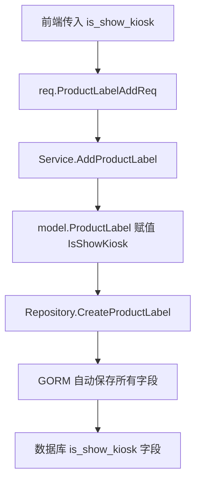
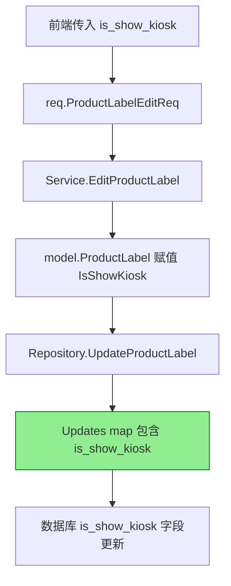
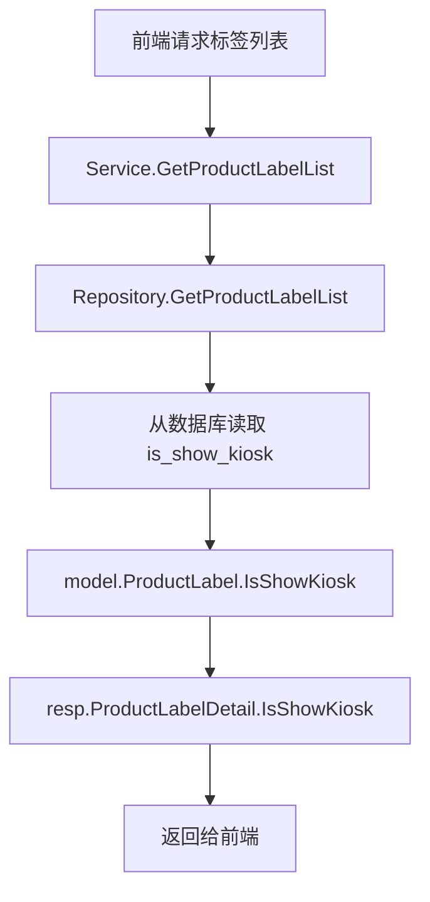

# 菜品标签自助点餐机显示功能 - 补充修复

> 任务37841 - 菜品标签增加自助点餐机显示选项（Repository 层补充）

---

## 📋 问题说明

在之前的实现中，菜品标签的自助点餐机显示功能在 **Service 层和 DTO 层** 已经完成，但是 **Repository 层的更新方法遗漏了 `is_show_kiosk` 字段**，导致编辑标签时无法保存该字段到数据库。

---

## ✅ 已修复的问题

### Repository 层 - UpdateProductLabel 方法

**文件**: `main/app/repository/product_label.go`  
**行号**: 91-107

**问题**：`UpdateProductLabel` 方法的 `Updates` 调用中缺少 `is_show_kiosk` 字段。

**修复前**:
```go
func (r *ProductLabelRepoImpl) UpdateProductLabel(productLabel model.ProductLabel) error {
	err := r.db.Model(&model.ProductLabel{}).Where("uuid = ?", productLabel.Uuid).Updates(map[string]any{
		"name":              productLabel.Name,
		"style":             productLabel.Style,
		"is_show_cashier":   productLabel.IsShowCashier,
		"is_show_tablet":    productLabel.IsShowTablet,
		"is_show_assistant": productLabel.IsShowAssistant,
		"is_show_h5":        productLabel.IsShowH5,
		"is_show_delivery":  productLabel.IsShowDelivery,
		"is_show_menu":      productLabel.IsShowMenu,
		// ❌ 缺少 is_show_kiosk
	}).Error
	if err != nil {
		return errors.WithMessage(err)
	}
	return nil
}
```

**修复后**:
```go
func (r *ProductLabelRepoImpl) UpdateProductLabel(productLabel model.ProductLabel) error {
	err := r.db.Model(&model.ProductLabel{}).Where("uuid = ?", productLabel.Uuid).Updates(map[string]any{
		"name":              productLabel.Name,
		"style":             productLabel.Style,
		"is_show_cashier":   productLabel.IsShowCashier,
		"is_show_tablet":    productLabel.IsShowTablet,
		"is_show_assistant": productLabel.IsShowAssistant,
		"is_show_h5":        productLabel.IsShowH5,
		"is_show_delivery":  productLabel.IsShowDelivery,
		"is_show_menu":      productLabel.IsShowMenu,
		"is_show_kiosk":     productLabel.IsShowKiosk, // ✅ 已添加
	}).Error
	if err != nil {
		return errors.WithMessage(err)
	}
	return nil
}
```

---

## 📊 菜品标签完整功能检查

### ✅ 已完成的部分

| 层级 | 组件 | 状态 | 说明 |
|------|------|------|------|
| **Model 层** | `model.ProductLabel` | ✅ | 已包含 `IsShowKiosk` 字段 |
| **DTO 层** | `req.ProductLabelAddReq` | ✅ | 已包含 `IsShowKiosk` 字段（第19行） |
| **DTO 层** | `req.ProductLabelEditReq` | ✅ | 已包含 `IsShowKiosk` 字段（第41行） |
| **DTO 层** | `resp.ProductLabelDetail` | ✅ | 已包含 `IsShowKiosk` 字段（第21行） |
| **Service 层** | `AddProductLabel` | ✅ | 创建时正确处理字段（第191行） |
| **Service 层** | `EditProductLabel` | ✅ | 编辑时正确处理字段（第263行） |
| **Service 层** | `GetProductLabelList` | ✅ | 查询时正确返回字段（第79行） |
| **Repository 层** | `CreateProductLabel` | ✅ | 创建时字段会自动保存（GORM 自动处理） |
| **Repository 层** | `UpdateProductLabel` | ✅ | 更新时字段已添加（本次修复） |
| **数据库** | `ttpos_product_label` | ✅ | 字段已存在 |

---

## 🔄 完整的数据流程

### 添加标签流程



### 编辑标签流程（本次修复）



### 查询标签流程



---

## 🐛 为什么之前会遗漏？

### 问题根源

在 `UpdateProductLabel` 方法中，使用 `Updates(map[string]any{...})` 需要**显式指定每个要更新的字段**。如果不包含某个字段，GORM 不会更新它。

### 对比：CreateProductLabel 为什么不需要？

```go
// CreateProductLabel - 不需要显式指定字段
func (r *ProductLabelRepoImpl) CreateProductLabel(productLabel model.ProductLabel) (uint64, error) {
	err := r.db.Create(&productLabel).Error // GORM 会自动保存结构体的所有字段
	if err != nil {
		return 0, errors.WithMessage(err)
	}
	return productLabel.Uuid, nil
}
```

**Create 方法**：GORM 会自动处理结构体的所有字段  
**Updates 方法**：需要显式指定每个要更新的字段（使用 map）

---

## 🧪 测试验证

### 测试场景1: 新建标签 - 设置显示

**前置条件**: 云平台已开启自助点餐机  
**操作步骤**:
1. 调用标签新建接口
2. 传递 `is_show_kiosk: 1`

**预期结果**:
- ✅ 接口返回成功
- ✅ 数据库 `is_show_kiosk` 字段为 1
- ✅ 查询标签列表时返回 `is_show_kiosk: 1`

---

### 测试场景2: 编辑标签 - 修改显示状态（本次修复的重点）

**前置条件**: 
- 已有标签 `is_show_kiosk` 为 0

**操作步骤**:
1. 调用标签编辑接口
2. 传递 `is_show_kiosk: 1`

**预期结果**:
- ✅ 接口返回成功
- ✅ 数据库 `is_show_kiosk` 字段更新为 1
- ✅ 查询标签列表时返回 `is_show_kiosk: 1`

**修复前的问题**:
- ❌ 数据库 `is_show_kiosk` 字段仍为 0（未更新）
- ❌ 前端看到的值不正确

**修复后的效果**:
- ✅ 数据库正确更新
- ✅ 前端显示正确

---

### 测试场景3: 查询标签列表

**操作步骤**:
1. 调用标签列表查询接口

**预期结果**:
- ✅ 返回数据包含 `is_show_kiosk` 字段
- ✅ 值与数据库一致

---

## 📝 修改清单

### 1. Repository 层

- [x] `main/app/repository/product_label.go`
  - [x] `UpdateProductLabel` 方法添加 `is_show_kiosk` 字段更新

### 2. 清理代码

- [x] `main/app/service/product.go`
  - [x] 删除调试代码 `fmt.Println("isShowKiosk", isShowKiosk)`

---

## ✅ 验收标准

### 功能验收

- [x] 新建标签时可以设置 `is_show_kiosk`
- [x] 编辑标签时可以修改 `is_show_kiosk`
- [x] 查询标签时可以获取 `is_show_kiosk`
- [x] 数据库字段正确更新
- [x] 无 linter 错误

### 代码质量

- [x] 遵循 Go Main 开发规范
- [x] Repository 层方法完整
- [x] 所有显示相关字段保持一致（都包含在 Updates 中）

---

## 📚 相关文档

- **需求文档**: `docs/shared/specs/active/story-admin-self-service-kiosk-client/requirements.md` - Requirement 2
- **设计文档**: `docs/shared/specs/active/story-admin-self-service-kiosk-client/design.md`
- **任务分解**: `docs/shared/specs/active/story-admin-self-service-kiosk-client/tasks.md` - Task 4.6-4.9
- **实现总结**: `docs/shared/specs/active/story-admin-self-service-kiosk-client/IMPLEMENTATION_SUMMARY.md`

---

## 🎓 经验总结

### 教训

1. **使用 GORM Updates 方法时必须显式指定所有要更新的字段**
   - `Create` 方法会自动处理所有字段
   - `Updates` 方法需要在 map 中逐个指定

2. **代码审查时应检查 Repository 层的一致性**
   - 新增字段时，同步检查所有 CRUD 方法
   - 特别是 `Updates` 方法中的字段列表

3. **测试应覆盖所有操作**
   - 不仅测试创建，也要测试更新
   - 确保数据库字段真正被更新

### 最佳实践

1. **添加新字段的完整检查清单**:
   - [ ] Model 层定义
   - [ ] DTO 层定义（Request 和 Response）
   - [ ] Service 层处理
   - [ ] Repository 层的 Create 方法
   - [ ] Repository 层的 Update 方法（⚠️ 容易遗漏）
   - [ ] 数据库迁移脚本

2. **使用 IDE 全局搜索确保一致性**:
   ```bash
   # 搜索类似字段的所有出现位置
   rg "is_show_delivery" 
   # 确保新字段 is_show_kiosk 也出现在相同位置
   ```

---

**修复完成日期**: 2025-12-18  
**修复类型**: Bug 修复（遗漏字段补充）  
**影响范围**: 菜品标签编辑功能
