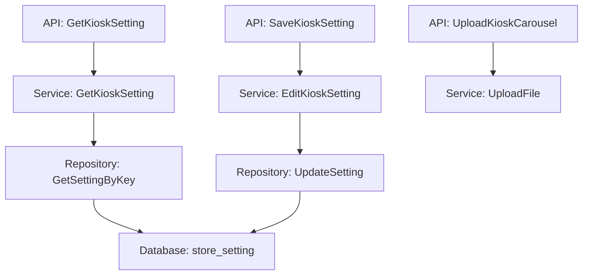

# （新管理端）新增【自助点餐机】客户端 设计文档

> 本文档定义（新管理端）新增【自助点餐机】客户端功能的技术设计和实现方案。

## 📋 概述

在新管理端新增自助点餐机（Kiosk）客户端的配置和管理功能的后端 API 支持。参考收银机设置的实现方式，使用相同的存储机制和 API 设计模式。

**实现范围**：仅实现后端 API 接口，参考现有收银机设置（`/shop/setting/cashier`）的实现方式。

---

## 🎯 规范对齐

### Go Main 规范 (go-main.mdc)

- Service 只依赖其他 Service 接口
- Repository 只持有 db 实例
- URL 使用 snake_case
- data 字段必须是对象
- 不使用 panic，返回 error

### API 设计规范 (api.mdc)

- URL 使用 snake_case：`/shop/setting/kiosk`
- 响应格式统一：`{code, message, data{}}`
- data 不能为 null 或数组

### 数据库规范 (database.mdc)

- 使用现有的 `store_setting` 表存储设置
- key 为常量 `SettingKiosk = "kiosk"`
- value 为 JSON 字符串

---

## 🔄 代码复用分析

### 可复用的现有组件

- **收银机设置 API**: `main/app/api/v1/shop/shop_setting.go` - `GetCashierSetting`, `SaveCashierSetting`, `UploadCashierCarousel`
- **收银机设置 Service**: `main/app/service/setting/setting.go` - `GetCashierSetting`, `EditCashierSetting`
- **收银机设置 DTO**: `main/app/dto/resp/setting/cashier_setting.go`, `main/app/dto/req/cashier_setting.go`
- **设置存储机制**: `main/app/service/setting/setting.go` - `getSettingByKey`, `UpdateSetting`
- **文件上传服务**: `main/app/service/upload_file_srv.go` - 复用现有文件上传逻辑

### 集成点

- **设置存储**: 使用 `store_setting` 表，key = `"kiosk"`，value = JSON 字符串
- **常量定义**: 在 `main/app/constant/setting.go` 中添加 `SettingKiosk = "kiosk"`
- **云平台状态检查**: 查询 `company_setting.enable_kiosk` 字段判断是否开启

---

## 🏗️ 架构设计

### 分层设计原则

**Go Main 三层架构**:

```
API 层 (shop_setting.go)
  ↓ 依赖
业务层 (setting/setting.go)
  ↓ 依赖
数据层 (repository/setting_repo.go)
```

**依赖规则**:

- ✅ API 层依赖 Service 接口
- ✅ Service 层依赖 Repository 接口
- ✅ Repository 层只持有 db 实例

### 架构图



### 模块划分

#### Go Main 模块

- **API 层**: `main/app/api/v1/shop/shop_setting.go` - 添加自助点餐机设置相关接口
- **Service 层**: `main/app/service/setting/setting.go` - 添加自助点餐机设置业务逻辑
- **Repository 层**: `main/app/repository/setting_repo.go` - 复用现有 Repository（无需修改）
- **Model 层**: `main/app/model/setting.go` - 复用现有 Model（无需修改）
- **DTO 层**: `main/app/dto/` - 创建自助点餐机设置相关 DTO
  - `req/kiosk_setting.go` - 请求参数
  - `resp/setting/kiosk_setting.go` - 响应数据

---

## 🗄️ 数据库设计

### 数据表设计

#### 复用现有表: store_setting

设置存储在现有的 `store_setting` 表中，无需新建表。

**表结构**（已存在）:

```sql
CREATE TABLE IF NOT EXISTS `ttpos_store_setting` (
    `id` bigint unsigned NOT NULL AUTO_INCREMENT COMMENT '主键ID',
    `uuid` bigint unsigned NOT NULL DEFAULT 0 COMMENT '唯一标识',
    `key` varchar(255) NOT NULL DEFAULT '' COMMENT '设置key',
    `values` text NOT NULL COMMENT '设置值（JSON字符串）',
    `create_time` int NOT NULL DEFAULT 0 COMMENT '创建时间',
    `update_time` int NOT NULL DEFAULT 0 COMMENT '更新时间',
    `delete_time` int NOT NULL DEFAULT 0 COMMENT '删除时间',
    PRIMARY KEY (`id`),
    UNIQUE KEY `uk_uuid` (`uuid`),
    KEY `idx_key` (`key`)
) ENGINE=InnoDB DEFAULT CHARSET=utf8mb4 COMMENT='门店设置表';
```

**存储方式**:

- **key**: `"kiosk"`（常量 `SettingKiosk`）
- **values**: JSON 字符串，包含所有自助点餐机设置

**字段说明**:
| 字段 | 类型 | 说明 | 约束 |
|------|------|------|------|
| key | varchar(255) | 设置key | `"kiosk"` |
| values | text | 设置值（JSON字符串） | 包含所有配置项 |

### 数据库迁移

**自助点餐机设置**: 复用现有 `store_setting` 表，只需添加常量定义。

**商品和标签表**: 需要添加 `is_show_kiosk` 字段。

#### 商品表字段添加

```sql
ALTER TABLE `ttpos_product_package` 
ADD COLUMN `is_show_kiosk` tinyint unsigned NOT NULL DEFAULT 0 COMMENT '是否在自助点餐机显示, 0-否 1-是' 
AFTER `is_show_delivery`;
```

#### 标签表字段添加

```sql
ALTER TABLE `ttpos_product_label` 
ADD COLUMN `is_show_kiosk` tinyint unsigned NOT NULL DEFAULT 0 COMMENT '是否在自助点餐机显示, 0-否 1-是' 
AFTER `is_show_menu`;
```

**字段说明**:
| 表名 | 字段 | 类型 | 说明 | 约束 |
|------|------|------|------|------|
| ttpos_product_package | is_show_kiosk | tinyint unsigned | 是否在自助点餐机显示 | DEFAULT 0 (0-否，1-是) |
| ttpos_product_label | is_show_kiosk | tinyint unsigned | 是否在自助点餐机显示 | DEFAULT 0 (0-否，1-是) |

---

## 📊 数据模型

### Go Model

复用现有的 `model.Setting` 结构体，无需新建。

### DTO 定义

#### Request DTO

```go
// main/app/dto/req/kiosk_setting.go
package req

import (
	"errors"
	"regexp"
	"slices"
	"ttpos-server-go/app/dto/resp/setting"
	errs "ttpos-server-go/app/errors"
)

// SaveKioskSettingReq 保存自助点餐机设置请求
type SaveKioskSettingReq struct {
	AdvancedPassword   string             `json:"advanced_password"`   // 高级密码（4-8位整数，默认666888）
	CallWaiterEnabled  int                `json:"call_waiter_enabled"`  // 呼叫服务员开关（0-关闭，1-开启，默认1）
	CommonLanguages    []string           `json:"common_languages"`    // 常用语言（JSON数组，默认所有语言）
	DefaultLanguage    string             `json:"default_language"`    // 默认语言（默认语言1）
	Carousel           []setting.CarouselItem `json:"carousel"`         // 轮播内容（图片+视频，最多10张图片+5个视频，总共最多15个，支持排序）
}

// Validate 验证自助点餐机设置请求参数
func (r *SaveKioskSettingReq) Validate() error {
	// 高级密码格式校验：4-8位整数
	if r.AdvancedPassword != "" {
		matched, _ := regexp.MatchString(`^[0-9]{4,8}$`, r.AdvancedPassword)
		if !matched {
			return errs.WithMessage(errors.New("高级密码必须为4-8位整数"))
		}
	}

	// 呼叫服务员开关校验
	if r.CallWaiterEnabled != 0 && r.CallWaiterEnabled != 1 {
		return errs.WithMessage(errors.New("呼叫服务员开关值无效"))
	}

	// 轮播内容数量限制：最多15个（10张图片+5个视频）
	if len(r.Carousel) > 15 {
		return errs.WithMessage(errors.New("轮播内容最多15个"))
	}

	// 统计图片和视频数量
	imageCount := 0
	videoCount := 0
	for _, item := range r.Carousel {
		if item.FileType == "image" {
			imageCount++
		} else if item.FileType == "video" {
			videoCount++
		}
	}

	// 图片数量限制：最多10张
	if imageCount > 10 {
		return errs.WithMessage(errors.New("轮播图片最多10张"))
	}

	// 视频数量限制：最多5个
	if videoCount > 5 {
		return errs.WithMessage(errors.New("轮播视频最多5个"))
	}

	return nil
}
```

#### Response DTO

```go
// main/app/dto/resp/setting/kiosk_setting.go
package setting

// KioskResp 自助点餐机设置，接口响应
type KioskResp struct {
	AdvancedPassword  string         `json:"advanced_password"`  // 高级密码（默认666888）
	CallWaiterEnabled int            `json:"call_waiter_enabled"` // 呼叫服务员开关（默认1-开启）
	CommonLanguages   []string       `json:"common_languages"`   // 常用语言（默认所有语言）
	DefaultLanguage   string         `json:"default_language"`   // 默认语言（默认语言1）
	Carousel          []CarouselItem `json:"carousel"`           // 轮播内容（图片+视频，最多10张图片+5个视频，总共最多15个，支持排序）
}

// Kiosk 自助点餐机设置（内部使用，包含敏感字段）
type Kiosk struct {
	KioskResp
	// 可扩展其他内部字段
}
```

---

## 🔌 API 设计

### RESTful API

#### API 1: 获取自助点餐机设置

**请求**:

- **URL**: `/shop/setting/kiosk`
- **Method**: `GET`
- **Headers**:
  ```json
  {
    "Authorization": "Bearer {token}",
    "Content-Type": "application/json"
  }
  ```

**响应**:

```json
{
  "code": 1,
  "message": "success",
  "data": {
    "advanced_password": "666888",
    "call_waiter_enabled": 1,
    "common_languages": ["th", "en", "zh", "zhtw"],
    "default_language": "th",
    "carousel": []
  }
}
```

#### API 2: 保存自助点餐机设置

**请求**:

- **URL**: `/shop/setting/kiosk`
- **Method**: `POST`
- **Headers**:
  ```json
  {
    "Authorization": "Bearer {token}",
    "Content-Type": "application/json"
  }
  ```
- **Body**:
  ```json
  {
    "advanced_password": "666888",
    "call_waiter_enabled": 1,
    "common_languages": ["th", "en", "zh"],
    "default_language": "th",
    "carousel": [
      {
        "file_path": "/uploads/kiosk/image1.jpg",
        "file_type": "image"
      }
    ]
  }
  ```

**响应**:

```json
{
  "code": 1,
  "message": "保存成功",
  "data": {}
}
```

**错误响应**:

```json
{
  "code": 0,
  "message": "高级密码必须为4-8位整数",
  "data": {}
}
```

#### API 3: 上传轮播图片

**请求**:

- **URL**: `/shop/setting/kiosk/carousel/upload`
- **Method**: `POST`
- **Headers**:
  ```json
  {
    "Authorization": "Bearer {token}"
  }
  ```
- **Body**: `multipart/form-data`
  - `file`: 文件（必填）
  - `file_type`: `"image"` 或 `"video"`（可选，不传则自动识别）

**响应**:

```json
{
  "code": 1,
  "message": "上传成功",
  "data": {
    "file_path": "/uploads/kiosk/image1.jpg",
    "file_type": "image"
  }
}
```

**校验规则**:

- **图片**: JPG、JPEG、PNG、WEBP 格式，<2MB，尺寸：1160*1104px
- **视频**: MP4 格式，<10MB，尺寸：1160*1104px

#### API 4: 商品管理 - 新增/编辑商品

**请求**:

- **URL**: `/shop/product/add` 或 `/shop/product/edit`
- **Method**: `POST`
- **Body**:
  ```json
  {
    "name": "商品名称",
    "is_show_kiosk": 1,
    // ... 其他字段
  }
  ```

**响应**: 标准响应格式

**说明**: 在现有商品新建/编辑接口中添加 `is_show_kiosk` 参数（可选，int类型，0-否，1-是，默认值根据云平台自助点餐机开启状态：已开启则为1，未开启则为0）

#### API 5: 商品管理 - 获取商品

**请求**:

- **URL**: `/shop/product/list` 或 `/shop/product/detail`
- **Method**: `GET`

**响应**:

```json
{
  "code": 1,
  "message": "success",
  "data": {
    "uuid": 123456,
    "name": "商品名称",
    "is_show_kiosk": 1,
    // ... 其他字段
  }
}
```

**说明**: 在现有商品查询接口中返回 `is_show_kiosk` 字段（int类型，0-否，1-是）

#### API 6: 标签管理 - 新增/编辑标签

**请求**:

- **URL**: `/shop/product_label/add` 或 `/shop/product_label/edit`
- **Method**: `POST`
- **Body**:
  ```json
  {
    "name": "标签名称",
    "is_show_kiosk": 1,
    // ... 其他字段
  }
  ```

**响应**: 标准响应格式

**说明**: 在现有标签新建/编辑接口中添加 `is_show_kiosk` 参数（可选，int类型，0-否，1-是，默认值根据云平台自助点餐机开启状态：已开启则为1，未开启则为0）

#### API 7: 标签管理 - 获取标签

**请求**:

- **URL**: `/shop/product_label/list` 或 `/shop/product_label/detail`
- **Method**: `GET`

**响应**:

```json
{
  "code": 1,
  "message": "success",
  "data": {
    "uuid": 123456,
    "name": "标签名称",
    "is_show_kiosk": 1,
    // ... 其他字段
  }
}
```

**说明**: 在现有标签查询接口中返回 `is_show_kiosk` 字段（int类型，0-否，1-是）

---

## 🧩 组件和接口

### Service 层

#### Service 接口（扩展现有接口）

```go
// main/app/service/setting/i_setting_service.go（已存在）
type ISrv interface {
    // ... 现有方法 ...
    GetKioskSetting(ctx context.Context) (setting.Kiosk, error)              // 获取自助点餐机设置
    EditKioskSetting(ctx context.Context, kioskSettingReq req.SaveKioskSettingReq) error // 修改自助点餐机设置
}
```

#### Service 实现

```go
// main/app/service/setting/setting.go
// GetKioskSetting 获取自助点餐机设置
func (s *Srv) GetKioskSetting(ctx context.Context) (setting.Kiosk, error) {
	var kiosk setting.Kiosk
	st := s.getSettingByKey(ctx, constant.SettingKiosk)

	// 解析 JSON 字符串
	if st.Values == "" || st.Values == "{}" {
		// 返回默认值
		return s.getDefaultKioskSetting(), nil
	}

	err := json.Unmarshal([]byte(st.Values), &kiosk)
	if err != nil {
		return kiosk, errors.WithMessage(err, "解析自助点餐机设置失败")
	}

	// 设置默认值
	kiosk = s.mergeDefaultKioskSetting(kiosk)

	return kiosk, nil
}

// EditKioskSetting 修改自助点餐机设置
func (s *Srv) EditKioskSetting(ctx context.Context, kioskSettingReq req.SaveKioskSettingReq) error {
	kioskSetting, err := s.GetKioskSetting(ctx)
	if err != nil {
		return errors.WithMessage(err)
	}

	// 更新字段（只更新传递的字段）
	if kioskSettingReq.AdvancedPassword != "" {
		kioskSetting.AdvancedPassword = kioskSettingReq.AdvancedPassword
	}
	if kioskSettingReq.CallWaiterEnabled != 0 {
		kioskSetting.CallWaiterEnabled = kioskSettingReq.CallWaiterEnabled
	}
	if kioskSettingReq.CommonLanguages != nil {
		kioskSetting.CommonLanguages = kioskSettingReq.CommonLanguages
	}
	if kioskSettingReq.DefaultLanguage != "" {
		kioskSetting.DefaultLanguage = kioskSettingReq.DefaultLanguage
	}
	if kioskSettingReq.Carousel != nil {
		kioskSetting.Carousel = kioskSettingReq.Carousel
	}

	// 保存设置
	if err := s.UpdateSetting(ctx, constant.SettingKiosk, kioskSetting); err != nil {
		return errors.WithMessage(err)
	}

	return nil
}

// getDefaultKioskSetting 获取默认自助点餐机设置
func (s *Srv) getDefaultKioskSetting() setting.Kiosk {
	// 获取所有语言列表
	allLanguages := []string{"th", "en", "zh", "zhtw"} // 根据实际语言列表获取

	return setting.Kiosk{
		KioskResp: setting.KioskResp{
			AdvancedPassword:  "666888",
			CallWaiterEnabled: 1,
			CommonLanguages:   allLanguages,
			DefaultLanguage:   "th", // 默认语言1
			Carousel:          []setting.CarouselItem{},
		},
	}
}

// mergeDefaultKioskSetting 合并默认值
func (s *Srv) mergeDefaultKioskSetting(kiosk setting.Kiosk) setting.Kiosk {
	defaultSetting := s.getDefaultKioskSetting()

	if kiosk.AdvancedPassword == "" {
		kiosk.AdvancedPassword = defaultSetting.AdvancedPassword
	}
	if kiosk.CallWaiterEnabled == 0 && kiosk.CallWaiterEnabled != 1 {
		kiosk.CallWaiterEnabled = defaultSetting.CallWaiterEnabled
	}
	if len(kiosk.CommonLanguages) == 0 {
		kiosk.CommonLanguages = defaultSetting.CommonLanguages
	}
	if kiosk.DefaultLanguage == "" {
		kiosk.DefaultLanguage = defaultSetting.DefaultLanguage
	}
	if kiosk.Carousel == nil {
		kiosk.Carousel = defaultSetting.Carousel
	}

	return kiosk
}
```

### API 层

```go
// main/app/api/v1/shop/shop_setting.go
// GetKioskSetting 获取自助点餐机设置
// @Summary 获取自助点餐机设置
// @Description 获取自助点餐机设置
// @Tags 商家端.自助点餐机设置
// @Accept json
// @Produce json
// @Security JwtToken
// @Success 200 {object} dto.Response{data=setting.KioskResp}
// @Router /shop/setting/kiosk [get]
func (h *SettingHandler) GetKioskSetting(c *gin.Context) {
	ctx := helper.GetContext(c)
	kioskSetting, err := h.settingSrv.GetKioskSetting(ctx)
	if err != nil {
		helper.ErrorWithDetail(c, constant.CodeFail, err)
		return
	}
	// 只返回响应字段，不返回敏感信息
	resp := setting.KioskResp{
		AdvancedPassword:  kioskSetting.AdvancedPassword,
		CallWaiterEnabled: kioskSetting.CallWaiterEnabled,
		CommonLanguages:   kioskSetting.CommonLanguages,
		DefaultLanguage:   kioskSetting.DefaultLanguage,
		Carousel:          kioskSetting.Carousel,
	}
	helper.Success(c, resp)
}

// SaveKioskSetting 保存自助点餐机设置
// @Summary 保存自助点餐机设置
// @Description 保存自助点餐机设置
// @Tags 商家端.自助点餐机设置
// @Accept json
// @Produce json
// @Security JwtToken
// @param data body req.SaveKioskSettingReq true "保存自助点餐机设置"
// @Success 200 {object} dto.Response
// @Router /shop/setting/kiosk [post]
func (h *SettingHandler) SaveKioskSetting(c *gin.Context) {
	ctx := helper.GetContext(c)
	var kioskSettingReq req.SaveKioskSettingReq
	if err := c.ShouldBindJSON(&kioskSettingReq); err != nil {
		helper.ErrorWithDetail(c, constant.CodeFail, err)
		return
	}

	// 参数验证
	if err := kioskSettingReq.Validate(); err != nil {
		helper.ErrorWithDetail(c, constant.CodeFail, err)
		return
	}

	// 调用 Service 层保存
	err := h.settingSrv.EditKioskSetting(ctx, kioskSettingReq)
	if err != nil {
		helper.ErrorWithDetail(c, constant.CodeFail, err)
		return
	}
	helper.Success(c, "保存成功")
}

// UploadKioskCarousel 上传自助点餐机轮播内容（图片/视频）
// @Summary 上传自助点餐机轮播内容
// @Description 上传自助点餐机轮播内容，支持图片（JPG、JPEG、PNG、WEBP，<2MB，1160*1104px）和视频（MP4，<10MB，1160*1104px）。上传后返回 CarouselItem，前端可将其添加到 carousel 数组中并排序。
// @Tags 商家端.自助点餐机设置
// @Accept multipart/form-data
// @Produce json
// @Security JwtToken
// @Param file formData file true "文件"
// @Param file_type formData string false "文件类型：image 或 video，不传则自动识别"
// @Success 200 {object} dto.Response{data=setting.CarouselItem}
// @Router /shop/setting/kiosk/carousel/upload [post]
func (h *SettingHandler) UploadKioskCarousel(c *gin.Context) {
	// 参考 UploadCashierCarousel 的实现
	// 校验规则：
	// - 图片：JPG、JPEG、PNG、WEBP，<2MB，尺寸：1160*1104px
	// - 视频：MP4，<10MB，尺寸：1160*1104px
	// 返回 CarouselItem 结构，前端将其添加到 carousel 数组并排序
}
```

### 商品和标签管理增强

#### 数据模型更新

**商品模型** (`main/app/model/product.go`):

```go
// ProductPackage 商品包表
type ProductPackage struct {
	// ... 现有字段 ...
	IsShowCashier   uint `gorm:"default:0;column:is_show_cashier;comment:'是否在收银设备显示, 0-否 1-是'"`
	IsShowTablet    uint `gorm:"default:0;column:is_show_tablet;comment:'是否在平板设备显示, 0-否 1-是'"`
	IsShowKitchen   uint `gorm:"default:0;column:is_show_kitchen;comment:'是否在厨房设备显示, 0-否 1-是'"`
	IsShowAssistant uint `gorm:"default:0;column:is_show_assistant;comment:'是否在助手设备显示, 0-否 1-是'"`
	IsShowH5        uint `gorm:"default:0;column:is_show_h5;comment:'是否在H5设备显示, 0-否 1-是'"`
	IsShowDelivery  uint `gorm:"default:0;column:is_show_delivery;comment:'是否在外送显示, 0-否 1-是'"`
	IsShowKiosk     uint `gorm:"default:0;column:is_show_kiosk;comment:'是否在自助点餐机显示, 0-否 1-是'"` // 新增字段
	// ... 其他字段 ...
}
```

**标签模型** (`main/app/model/product_label.go`):

```go
// ProductLabel 商品标签表
type ProductLabel struct {
	// ... 现有字段 ...
	IsShowCashier   uint `gorm:"default:0;column:is_show_cashier;comment:'是否在收银机显示, 0-否 1-是'"`
	IsShowTablet    uint `gorm:"default:0;column:is_show_tablet;comment:'是否在平板显示, 0-否 1-是'"`
	IsShowAssistant uint `gorm:"default:0;column:is_show_assistant;comment:'是否在助手显示, 0-否 1-是'"`
	IsShowH5        uint `gorm:"default:0;column:is_show_h5;comment:'是否在H5显示, 0-否 1-是'"`
	IsShowDelivery  uint `gorm:"default:0;column:is_show_delivery;comment:'是否在外送显示, 0-否 1-是'"`
	IsShowMenu      uint `gorm:"default:0;column:is_show_menu;comment:'是否在电子菜单显示, 0-否 1-是'"`
	IsShowKiosk     uint `gorm:"default:0;column:is_show_kiosk;comment:'是否在自助点餐机显示, 0-否 1-是'"` // 新增字段
	// ... 其他字段 ...
}
```

#### DTO 更新

**商品 Request DTO** (`main/app/dto/req/product.go`):

```go
// ProductAddReq 商品新增请求（扩展现有结构体）
type ProductAddReq struct {
	// ... 现有字段 ...
	IsShowKiosk int `json:"is_show_kiosk"` // 是否在自助点餐机显示, 0-否 1-是（可选，默认值根据云平台开启状态）
}

// ProductEditReq 商品编辑请求（扩展现有结构体）
type ProductEditReq struct {
	// ... 现有字段 ...
	IsShowKiosk int `json:"is_show_kiosk"` // 是否在自助点餐机显示, 0-否 1-是（可选，默认值根据云平台开启状态）
}
```

**标签 Request DTO** (`main/app/dto/req/product_label.go`):

```go
// ProductLabelAddReq 商品标签新增请求（扩展现有结构体）
type ProductLabelAddReq struct {
	// ... 现有字段 ...
	IsShowKiosk uint `json:"is_show_kiosk"` // 是否在自助点餐机显示, 0-否 1-是（可选，默认值根据云平台开启状态）
}

// ProductLabelEditReq 商品标签编辑请求（扩展现有结构体）
type ProductLabelEditReq struct {
	// ... 现有字段 ...
	IsShowKiosk uint `json:"is_show_kiosk"` // 是否在自助点餐机显示, 0-否 1-是（可选，默认值根据云平台开启状态）
}
```

**商品 Response DTO** (`main/app/dto/resp/product_resp/product.go`):

```go
// ProductShopListItemResp 商品列表项响应（扩展现有结构体）
type ProductShopListItemResp struct {
	// ... 现有字段 ...
	IsShowCashier   bool `json:"is_show_cashier"`
	IsShowTablet    bool `json:"is_show_tablet"`
	IsShowKitchen    bool `json:"is_show_kitchen"`
	IsShowAssistant  bool `json:"is_show_assistant"`
	IsShowH5         bool `json:"is_show_h5"`
	IsShowDelivery   bool `json:"is_show_delivery"`
	IsShowKiosk      int  `json:"is_show_kiosk"` // 新增字段（int类型，0-否，1-是）
	// ... 其他字段 ...
}
```

**标签 Response DTO** (`main/app/dto/resp/product_resp/product_label.go` 或相关文件):

```go
// ProductLabelResp 商品标签响应（扩展现有结构体）
type ProductLabelResp struct {
	// ... 现有字段 ...
	IsShowCashier   uint `json:"is_show_cashier"`
	IsShowTablet    uint `json:"is_show_tablet"`
	IsShowAssistant uint `json:"is_show_assistant"`
	IsShowH5        uint `json:"is_show_h5"`
	IsShowDelivery  uint `json:"is_show_delivery"`
	IsShowMenu      uint `json:"is_show_menu"`
	IsShowKiosk     uint `json:"is_show_kiosk"` // 新增字段
	// ... 其他字段 ...
}
```

#### Service 层实现

**商品 Service** (`main/app/service/product.go`):

```go
// 在商品新建/编辑方法中添加 is_show_kiosk 处理逻辑
func (s *productSrv) AddProduct(ctx context.Context, req req.ProductAddReq) error {
	// ... 现有逻辑 ...
	
	// 处理 is_show_kiosk 默认值
	if req.IsShowKiosk == 0 && req.IsShowKiosk != 1 {
		// 查询云平台开启状态
		enableKiosk, err := s.getKioskEnabled(ctx)
		if err != nil {
			return errors.WithMessage(err)
		}
		if enableKiosk {
			req.IsShowKiosk = 1 // 云平台已开启，默认显示
		} else {
			req.IsShowKiosk = 0 // 云平台未开启，默认不显示
		}
	}
	
	product := &model.ProductPackage{
		// ... 其他字段 ...
		IsShowKiosk: uint(req.IsShowKiosk),
	}
	
	// ... 保存逻辑 ...
}

// getKioskEnabled 查询云平台自助点餐机是否开启
func (s *productSrv) getKioskEnabled(ctx context.Context) (bool, error) {
	// 查询 company_setting.enable_kiosk 字段
	// 实现逻辑：查询 saas.company_setting 表的 enable_kiosk 字段
	// 返回 true 表示已开启，false 表示未开启
}
```

**标签 Service** (`main/app/service/product_label.go`):

```go
// 在标签新建/编辑方法中添加 is_show_kiosk 处理逻辑
func (s *productLabelSrv) AddProductLabel(ctx context.Context, req req.ProductLabelAddReq) error {
	// ... 现有逻辑 ...
	
	// 处理 is_show_kiosk 默认值（与商品逻辑相同）
	if req.IsShowKiosk == 0 && req.IsShowKiosk != 1 {
		enableKiosk, err := s.getKioskEnabled(ctx)
		if err != nil {
			return errors.WithMessage(err)
		}
		if enableKiosk {
			req.IsShowKiosk = 1
		} else {
			req.IsShowKiosk = 0
		}
	}
	
	label := &model.ProductLabel{
		// ... 其他字段 ...
		IsShowKiosk: req.IsShowKiosk,
	}
	
	// ... 保存逻辑 ...
}
```

#### API 层实现

**商品 API** (`main/app/api/v1/shop/shop_product.go`):

```go
// 在现有商品新建/编辑接口中，is_show_kiosk 参数会自动绑定到 req.ProductAddReq 或 req.ProductEditReq
// 无需修改 API 层代码，只需确保 DTO 中包含该字段即可
```

**标签 API** (`main/app/api/v1/shop/shop_product_label.go`):

```go
// 在现有标签新建/编辑接口中，is_show_kiosk 参数会自动绑定到 req.ProductLabelAddReq 或 req.ProductLabelEditReq
// 无需修改 API 层代码，只需确保 DTO 中包含该字段即可
```

---

## ⚡ 缓存设计

### Redis 缓存

**缓存策略**: 复用现有的设置缓存机制

- **Key 命名**: `ttpos:setting:{company_uuid}`
- **过期时间**: 无过期时间（手动删除）
- **更新策略**: Cache-Aside Pattern，更新设置时删除缓存

**实现**: 复用 `main/app/service/setting/setting.go` 中的缓存逻辑。

---

## 🚨 错误处理

### 错误场景

#### 场景 1: 高级密码格式错误

- **处理方式**: 在 `Validate()` 方法中校验，返回参数错误
- **用户影响**: 返回错误信息"高级密码必须为4-8位整数"
- **代码示例**:
  ```go
  if !matched {
      return errs.WithMessage(errors.New("高级密码必须为4-8位整数"))
  }
  ```

#### 场景 2: 轮播内容数量超限

- **处理方式**: 在 `Validate()` 方法中校验
- **用户影响**: 返回错误信息"轮播图片最多10张"或"轮播视频最多5个"

#### 场景 3: 文件上传格式/大小/尺寸校验失败

- **处理方式**: 在上传接口中校验
- **用户影响**: 返回具体错误信息（格式错误、大小超限、尺寸不符）

---

## 🔒 安全设计

### 身份验证

- **JWT Token**: 所有 API 需要 Token 验证（复用现有中间件）

### 数据安全

- **敏感数据**: 高级密码存储在 JSON 中，响应时不返回（如需要）
- **SQL 注入防护**: 使用参数化查询（GORM）
- **文件上传安全**: 格式、大小、尺寸校验

---

## 🧪 测试策略

### 单元测试

**目标覆盖率**:

- Service 层: 70%+
- Repository 层: 80%+（复用现有，无需测试）

**测试内容**:

- Service 业务逻辑
- DTO 数据转换
- 参数校验逻辑

### API 测试

**测试内容**:

- API 接口调用
- 参数验证
- 响应格式
- 错误处理

---

## 📈 性能优化

### 优化策略

1. **缓存优化**: 复用现有的设置缓存机制
2. **数据库优化**: 使用索引查询 `store_setting` 表

### 性能指标

- 本地响应时间: < 200ms
- 数据库查询: < 50ms（使用索引）

---

## 📚 实现清单

### Phase 1: 常量和 DTO

- [ ] 添加常量 `SettingKiosk = "kiosk"`
- [ ] 创建 Request DTO (`req/kiosk_setting.go`)
- [ ] 创建 Response DTO (`resp/setting/kiosk_setting.go`)

### Phase 2: Service 层

- [ ] 实现 `GetKioskSetting` 方法
- [ ] 实现 `EditKioskSetting` 方法
- [ ] 实现默认值处理逻辑

### Phase 3: API 层

- [ ] 实现 `GetKioskSetting` API
- [ ] 实现 `SaveKioskSetting` API
- [ ] 实现 `UploadKioskCarousel` API
- [ ] 注册路由

### Phase 4: 商品和标签管理增强

- [ ] 在商品模型中添加 `is_show_kiosk` 字段
- [ ] 在商品新建/编辑接口中添加 `is_show_kiosk` 参数
- [ ] 在商品查询接口中返回 `is_show_kiosk` 字段
- [ ] 在标签模型中添加 `is_show_kiosk` 字段
- [ ] 在标签新建/编辑接口中添加 `is_show_kiosk` 参数
- [ ] 在标签查询接口中返回 `is_show_kiosk` 字段
- [ ] 实现云平台开启状态检查逻辑（商品和标签默认值）

### Phase 5: 测试

- [ ] Service 单元测试
- [ ] API 集成测试
- [ ] 文件上传测试
- [ ] 商品和标签接口测试

**详细任务**: 参见 `tasks.md`

---

## Graphiti & 活动日志

- Related Episode: `[待补充]`
- 模板：`docs/agent/templates/graphiti-episode.md`
- 活动日志：`docs/team/activities/{YYYY-MM}/{YYYY-MM-DD}.md`
- 在技术方案评审、关键架构决策或踩坑总结后，立即补充 Episode 并在设计文档尾部互链。

---

**版本**: v1.0.0  
**创建日期**: 2025-12-08  
**作者**: 王昱  
**审核者**: {审核者}

