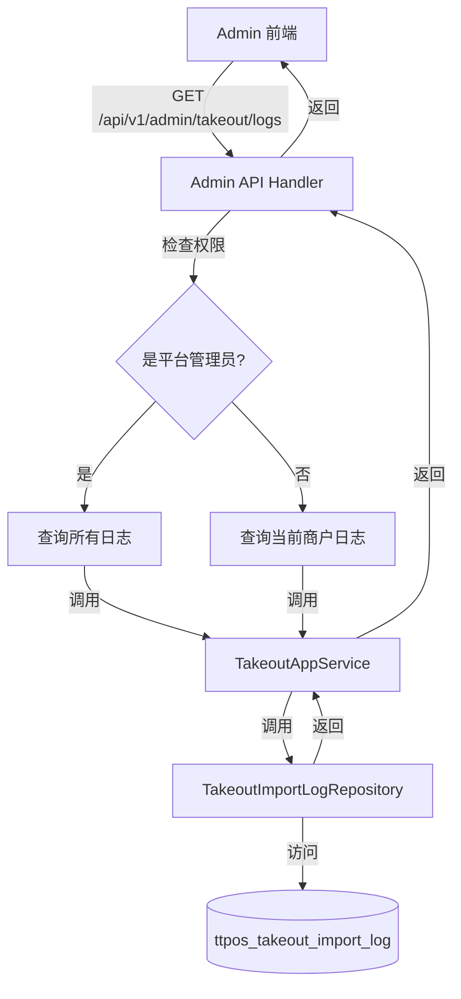
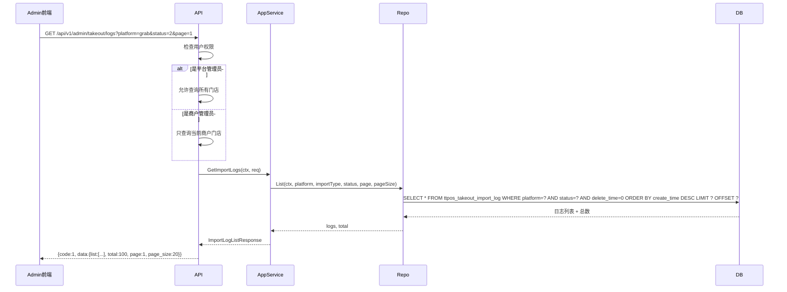
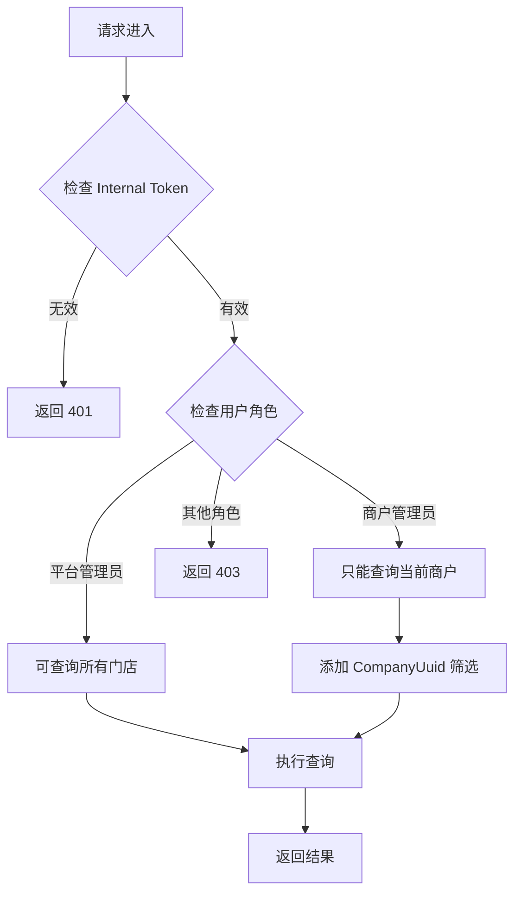
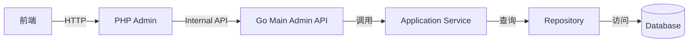

# 云平台-日志管理(外卖相关) 设计文档

> 本文档定义云平台外卖日志管理功能的技术设计和实现方案。

## 📋 概述

本设计旨在为云平台(Admin)添加外卖相关的日志管理功能,让平台管理员和商户能够查看、筛选和追溯外卖订单同步日志(Grab/LINE MAN等)。通过复用现有的日志基础设施，只需在 Admin 端添加 API 接口和权限控制，即可快速实现该功能。

**核心功能**:
1. 日志列表查询(支持按门店、类型、状态筛选)
2. 日志详情查看(查看完整的错误信息)
3. 分页查询(避免大量数据影响性能)
4. 权限控制(商户只能查看自己的日志,平台管理员可查看所有日志)

**现有基础设施**:
- ✅ 数据模型: `TakeoutImportLog` 已存在
- ✅ Repository: `TakeoutImportLogRepository` 已实现
- ✅ Domain Service: `ImportProgressService` 已实现
- ✅ Shop 端 API: `/shop/takeout/menu/import/logs` 已实现
- ⚠️ Admin 端 API: 需要新增

---

## 🎯 规范对齐

### Go Main 规范 (go-main.mdc)

本设计严格遵循 Go Main 开发规范:

- ✅ **分层设计**: API → Application Service → Domain Service → Repository 四层架构
- ✅ **依赖管理**: Application Service 调用 Domain Service,Domain Service 访问 Repository
- ✅ **接口命名**: 接口以 `I` 开头,实现以小写字母开头
- ✅ **Repository 约束**: 只持有 `db *gorm.DB`,不持有 DBManager
- ✅ **错误处理**: 不使用 panic,返回 error,使用 `errors.WithMessage` 包装
- ✅ **URL 命名**: 使用 snake_case(如 `/api/v1/admin/takeout/logs`)

### API 设计规范 (api.mdc)

- ✅ **响应格式**: `{code, message, data{}}`
- ✅ **data 字段**: 必须是对象,不能是 null 或数组
- ✅ **分页信息**: 使用 `page`, `page_size`, `total` 字段
- ✅ **错误处理**: 统一错误码和错误信息
- ✅ **国际化**: 支持 10 种语言

### 数据库规范 (database.mdc)

- ✅ **复用现有表**: `ttpos_takeout_import_log` 表已存在
- ✅ **字段完整**: id, uuid, create_time, update_time, delete_time 已具备
- ✅ **时间字段**: 使用 int 类型,\_time 结尾,默认值 0
- ✅ **索引优化**: platform, import_type, status, create_time 已建立索引

### 安全规范 (security.mdc)

- ✅ **权限控制**: 使用 middleware.Internal() 限制 Admin 端访问
- ✅ **数据隔离**: 商户只能查看自己的日志,平台管理员可查看所有日志
- ✅ **敏感信息**: 不返回敏感数据(如完整的 API Token)

---

## 🔄 代码复用分析

### 可复用的现有组件

1. **TakeoutImportLog Model**: `main/app/modules/takeout/domain/model/takeout_import_log.go`
   - 完全复用: 数据模型定义
   - 字段: UUID, Platform, ImportType, ImportDirection, Status, Progress, ErrorMessage 等

2. **TakeoutImportLogRepository**: `main/app/modules/takeout/domain/repository/takeout_import_log_repository.go`
   - 完全复用: Repository 接口和实现
   - 方法: `List()` - 支持按 platform, importType, status 筛选和分页

3. **TakeoutAppService**: `main/app/modules/takeout/application/takeout_app_service.go`
   - 复用: `GetImportLogs()` 方法
   - 扩展: 需要添加权限控制逻辑

4. **Shop TakeoutHandler**: `main/app/api/v1/shop/shop_takeout.go`
   - 参考: `GetImportLogs()` API 实现
   - 新增: Admin 端的 API Handler

### 集成点

1. **Admin API 层**
   - 新增: `main/app/api/v1/admin/admin_takeout.go` - Admin 端外卖日志 Handler
   - 路由: `/admin/takeout/logs` - 日志列表查询接口

2. **Application Service 层**
   - 复用: `TakeoutAppService.GetImportLogs()` - 无需修改,已支持筛选和分页
   - 扩展: 在 Admin Handler 中添加权限校验逻辑

3. **前端页面** (Admin 端)
   - 新增: 日志管理页面
   - 复用: Element Plus 组件(ElTable, ElSelect, ElPagination)

---

## 🏗️ 架构设计

### 分层设计原则

**四层架构**:

```
API 层 (admin_takeout.go)
  ↓ 调用
Application Service 层 (takeout_app_service.go)
  ↓ 调用
Domain Service 层 (import_progress_service.go)
  ↓ 访问
Repository 层 (takeout_import_log_repository.go)
  ↓ 访问
Database (ttpos_takeout_import_log)
```

**依赖规则**:

- ✅ API 层调用 Application Service
- ✅ Application Service 调用 Domain Service
- ✅ Domain Service 访问 Repository
- ✅ Repository 只持有 `db *gorm.DB`
- ❌ 禁止跨层调用

### 架构图



### 时序图 - 日志查询



### 权限控制流程



---

## 📦 模块划分

### 1. 数据模型 (复用现有)

**文件**: `main/app/modules/takeout/domain/model/takeout_import_log.go`

```go
// TakeoutImportLog 外卖导入日志实体 (已存在,无需修改)
type TakeoutImportLog struct {
    // 基础字段
    ID   uint64 `gorm:"primaryKey;autoIncrement" json:"id"`
    UUID uint64 `gorm:"uniqueIndex:uk_uuid;not null;default:0" json:"uuid"`

    // 导入信息字段
    Platform        string `gorm:"type:varchar(50);not null;default:'';index:idx_platform" json:"platform"`
    ImportType      int8   `gorm:"type:tinyint(3);not null;default:0;index:idx_import_type" json:"import_type"`
    ImportDirection string `gorm:"type:varchar(200);not null;default:''" json:"import_direction"`

    // 状态和进度字段
    Status   int8 `gorm:"type:tinyint(3);not null;default:0;index:idx_status" json:"status"`
    Progress int  `gorm:"type:int(10);not null;default:0" json:"progress"`

    // 统计信息字段
    SuccessCount int    `gorm:"type:int(10);not null;default:0" json:"success_count"`
    FailureCount int    `gorm:"type:int(10);not null;default:0" json:"failure_count"`
    TotalCount   int    `gorm:"type:int(10);not null;default:0" json:"total_count"`
    ErrorMessage string `gorm:"type:text" json:"error_message"`

    // 时间字段
    StartTime  int64 `gorm:"type:int(10);not null;default:0" json:"start_time"`
    EndTime    int64 `gorm:"type:int(10);not null;default:0" json:"end_time"`
    Duration   int64 `gorm:"type:int(10);not null;default:0" json:"duration"`
    CreateTime int64 `gorm:"type:int(10);not null;default:0;index:idx_create_time" json:"createtime"`
    UpdateTime int64 `gorm:"type:int(10);not null;default:0" json:"updatetime"`
    DeleteTime int64 `gorm:"type:int(10);not null;default:0;index:idx_delete_time" json:"deletetime"`
}
```

### 2. Repository 层 (复用现有)

**文件**: `main/app/modules/takeout/domain/repository/takeout_import_log_repository.go`

```go
// TakeoutImportLogRepository 外卖导入日志仓储接口 (已存在,无需修改)
type TakeoutImportLogRepository interface {
    // List 查询导入日志列表
    // platform: 平台筛选，空字符串表示不筛选
    // importType: 导入类型筛选，0 表示不筛选
    // status: 状态筛选，-1 表示不筛选
    // page: 页码（从 1 开始）
    // pageSize: 每页数量
    List(ctx context.Context, platform string, importType int8, status int8, page, pageSize int) ([]*model.TakeoutImportLog, int64, error)
}
```

### 3. Application Service 层 (复用现有)

**文件**: `main/app/modules/takeout/application/takeout_app_service.go`

```go
// GetImportLogs 获取导入日志列表 (已存在,无需修改)
func (s *takeoutAppService) GetImportLogs(ctx context.Context, req request.GetImportLogsRequest) (*response.ImportLogListResponse, error) {
    db := ctx.GetDB()
    repo := persistence.NewTakeoutImportLogRepository(db)

    // 参数处理
    platform := req.Platform
    importType := req.ImportType
    status := req.Status
    page := req.Page
    if page < 1 {
        page = 1
    }
    pageSize := req.PageSize
    if pageSize < 1 {
        pageSize = 20
    }
    if pageSize > 100 {
        pageSize = 100
    }

    // 查询日志列表
    logs, total, err := repo.List(ctx, platform, importType, status, page, pageSize)
    if err != nil {
        return nil, errors.WithMessage(err, "查询导入日志失败")
    }

    // 构建响应
    logItems := make([]response.ImportLogItem, 0, len(logs))
    for _, log := range logs {
        logItems = append(logItems, response.ImportLogItem{
            UUID:            log.UUID,
            Platform:        log.Platform,
            ImportType:      log.ImportType,
            ImportDirection: log.ImportDirection,
            Status:          log.Status,
            Progress:        log.Progress,
            SuccessCount:    log.SuccessCount,
            FailureCount:    log.FailureCount,
            TotalCount:      log.TotalCount,
            ErrorMessage:    log.ErrorMessage,
            StartTime:       log.StartTime,
            EndTime:         log.EndTime,
            Duration:        log.Duration,
            CreateTime:      log.CreateTime,
        })
    }

    return &response.ImportLogListResponse{
        List:     logItems,
        Total:    total,
        Page:     page,
        PageSize: pageSize,
    }, nil
}
```

### 4. Go Main Admin API 层 (新增)

**文件**: `main/app/api/v1/admin/admin_takeout.go` (新建)

```go
package admin

import (
    "strconv"

    "ttpos-server-go/app/api/helper"
    "ttpos-server-go/app/constant"
    "ttpos-server-go/app/errors"
    "ttpos-server-go/app/modules/takeout/application"
    "ttpos-server-go/app/modules/takeout/types/request"
    "ttpos-server-go/middleware"
    "ttpos-server-go/pkg/database"

    "github.com/gin-gonic/gin"
)

// TakeoutHandler Admin 端外卖处理程序
type TakeoutHandler struct {
    dbm           *database.DBManager
    takeoutAppSrv application.ITakeoutAppService
}

// NewTakeoutHandler 创建外卖 Handler
func NewTakeoutHandler(dbm *database.DBManager) *TakeoutHandler {
    return &TakeoutHandler{
        dbm:           dbm,
        takeoutAppSrv: application.NewTakeoutAppService(dbm),
    }
}

// GetTakeoutImportLogs 获取外卖导入日志列表
// @Summary 获取外卖导入日志列表
// @Description 分页查询外卖导入日志，支持按平台、类型、状态筛选。平台管理员可查看所有日志，商户管理员只能查看自己的日志。
// @Tags 平台端.外卖管理
// @Accept json
// @Produce json
// @Security InternalToken
// @Param platform query string false "外卖平台(grab/lineman等)，为空查询所有"
// @Param import_type query int false "导入类型(1-TTPOS推送到平台 2-平台推送到TTPOS)，0 查询所有"
// @Param status query int false "导入状态(0-进行中 1-成功 2-失败)，-1 查询所有"
// @Param page query int false "页码，默认 1"
// @Param page_size query int false "每页数量，默认 20，最大 100"
// @Param company_uuid query string false "商户 UUID(平台管理员可指定，商户管理员只能查自己的)"
// @Success 200 {object} response.ImportLogListResponse "成功"
// @Router /admin/takeout/logs [get]
func (h *TakeoutHandler) GetTakeoutImportLogs(c *gin.Context) {
    // 解析请求参数
    var reqData request.GetImportLogsRequest
    if err := c.ShouldBindQuery(&reqData); err != nil {
        helper.HandleValidationError(c, err, reqData, nil)
        return
    }

    ctx := helper.GetContext(c)

    // 权限控制逻辑
    // TODO: 实现权限检查
    // 1. 如果是平台管理员，可以查询所有商户的日志（可指定 company_uuid）
    // 2. 如果是商户管理员，只能查询当前商户的日志
    // 3. 这里需要根据实际的权限系统进行调整

    // 调用 Application Service
    logsResp, err := h.takeoutAppSrv.GetImportLogs(ctx, reqData)
    if err != nil {
        helper.ErrorWithDetail(c, constant.CodeFail, errors.WithMessage(err, "获取外卖导入日志失败"))
        return
    }

    helper.Success(c, logsResp)
}

// RegisterTakeoutHandlers 注册 Admin 端外卖路由
func RegisterTakeoutHandlers(router gin.IRouter, dbm *database.DBManager) {
    handler := NewTakeoutHandler(dbm)

    // 使用 Internal 中间件保护
    privateApi := router.Group("", middleware.Internal())
    {
        privateApi.GET("/takeout/logs", handler.GetTakeoutImportLogs)
    }
}
```

**更新**: `main/app/api/v1/admin/handler.go`

```go
func RegisterHandlers(router gin.IRouter, dbm *database.DBManager, cache cache.Cache) {
    // ... 现有代码 ...

    // 注册外卖路由
    RegisterTakeoutHandlers(router, dbm)
}
```

### 5. PHP Admin Controller 层 (新增)

**文件**: `admin/app/admin/controller/Takeout.php` (新建)

```php
<?php

namespace app\admin\controller;

use hg\apidoc\annotation as Apidoc;
use app\admin\controller\Controller;
use help\HttpHelp;

/**
 * 外卖日志管理
 * @Apidoc\Group("base")
 * @Apidoc\Sort(8)
 */
class Takeout extends Controller
{
    /**
     * @Apidoc\Title("外卖导入日志列表")
     * @Apidoc\Desc("分页查询外卖导入日志，支持按平台、类型、状态筛选")
     * @Apidoc\Method("GET")
     * @Apidoc\Url("/api/admin/takeout/logs")
     */
    public function logs()
    {
        // 获取请求参数
        $params = $this->getData();
        
        // 构建查询参数
        $queryParams = http_build_query([
            'platform' => $params['platform'] ?? '',
            'import_type' => $params['import_type'] ?? 0,
            'status' => $params['status'] ?? -1,
            'page' => $params['page'] ?? 1,
            'page_size' => $params['page_size'] ?? 20,
            'company_uuid' => $params['company_uuid'] ?? '',
        ]);

        // 调用 Go Main 接口
        $url = 'http://nginx/api/v1/admin/takeout/logs?' . $queryParams;
        $res = HttpHelp::getRequest($url, [], [
            'X-API-KEY: ' . env('JWT_SECRET'),
            'Accept-Language: ' . request()->header('language'),
        ]);

        if (!$res) {
            return $this->renderError('请求失败');
        }

        $res = json_decode($res, true);
        if ($res['code'] != 0) {
            return $this->renderError($res['message']);
        }

        return $this->renderSuccess('', $res['data']);
    }
}
```

**说明**:
- PHP Admin Controller 作为代理层，调用 Go Main 的接口
- 使用 `HttpHelp::getRequest()` 调用 Go Main API
- URL: `http://nginx/api/v1/admin/takeout/logs`
- Headers: `X-API-KEY` (Internal Token) + `Accept-Language`
- 参数透传给 Go Main，响应数据直接返回给前端

---

## 📡 API 设计

### API 架构



**说明**:
- 前端调用 PHP Admin 接口: `GET /api/admin/takeout/logs`
- PHP Admin 代理调用 Go Main: `GET http://nginx/api/v1/admin/takeout/logs`
- Go Main 处理业务逻辑并返回数据
- PHP Admin 透传响应给前端

### 1. 获取外卖导入日志列表

#### PHP Admin 接口 (前端调用)

**接口**: `GET /api/admin/takeout/logs`

**请求参数** (Query):

| 参数名 | 类型 | 必填 | 说明 |
|--------|------|------|------|
| platform | string | 否 | 外卖平台(grab/lineman)，为空查询所有 |
| import_type | int | 否 | 导入类型(1-TTPOS推送到平台 2-平台推送到TTPOS)，0 查询所有 |
| status | int | 否 | 导入状态(0-进行中 1-成功 2-失败)，-1 查询所有 |
| page | int | 否 | 页码，默认 1 |
| page_size | int | 否 | 每页数量，默认 20，最大 100 |
| company_uuid | string | 否 | 商户 UUID(平台管理员可指定，商户管理员只能查自己的) |

**响应格式**:

```json
{
    "code": 0,
    "message": "success",
    "data": {
        "list": [...],
        "total": 100,
        "page": 1,
        "page_size": 20
    }
}
```

#### Go Main 内部接口 (PHP Admin 调用)

**接口**: `GET /api/v1/admin/takeout/logs`

**请求参数** (Query):

| 参数名 | 类型 | 必填 | 说明 |
|--------|------|------|------|
| platform | string | 否 | 外卖平台(grab/lineman)，为空查询所有 |
| import_type | int | 否 | 导入类型(1-TTPOS推送到平台 2-平台推送到TTPOS)，0 查询所有 |
| status | int | 否 | 导入状态(0-进行中 1-成功 2-失败)，-1 查询所有 |
| page | int | 否 | 页码，默认 1 |
| page_size | int | 否 | 每页数量，默认 20，最大 100 |
| company_uuid | string | 否 | 商户 UUID(平台管理员可指定，商户管理员只能查自己的) |

**响应格式**:

```json
{
    "code": 1,
    "message": "success",
    "data": {
        "list": [
            {
                "uuid": 1234567890,
                "platform": "grab",
                "import_type": 2,
                "import_direction": "从Grab推送商品数据到TTPOS",
                "status": 2,
                "progress": 100,
                "success_count": 95,
                "failure_count": 5,
                "total_count": 100,
                "error_message": "部分商品导入失败: [...]",
                "start_time": 1702800000,
                "end_time": 1702800300,
                "duration": 300,
                "createtime": 1702800000
            }
        ],
        "total": 100,
        "page": 1,
        "page_size": 20
    }
}
```

**错误响应**:

```json
{
    "code": 0,
    "message": "查询外卖导入日志失败: 数据库连接失败",
    "data": {}
}
```

---

## 🎨 前端设计

### 1. 日志管理页面

**路径**: `admin-frontend/src/views/takeout/logs.vue`

**页面结构**:

```vue
<template>
  <div class="takeout-logs-container">
    <!-- 筛选区域 -->
    <el-card class="filter-card">
      <el-form :inline="true" :model="filterForm">
        <el-form-item label="门店">
          <el-select v-model="filterForm.companyUuid" placeholder="请选择门店" clearable>
            <el-option
              v-for="shop in shopList"
              :key="shop.uuid"
              :label="shop.name"
              :value="shop.uuid"
            />
          </el-select>
        </el-form-item>

        <el-form-item label="平台">
          <el-select v-model="filterForm.platform" placeholder="请选择平台" clearable>
            <el-option label="全部" value="" />
            <el-option label="Grab" value="grab" />
            <el-option label="LINE MAN" value="lineman" />
          </el-select>
        </el-form-item>

        <el-form-item label="类型">
          <el-select v-model="filterForm.importType" placeholder="请选择类型" clearable>
            <el-option label="全部" :value="0" />
            <el-option label="TTPOS推送" :value="1" />
            <el-option label="平台推送" :value="2" />
            <el-option label="TTPOS获取" :value="2" />
          </el-select>
        </el-form-item>

        <el-form-item label="状态">
          <el-select v-model="filterForm.status" placeholder="请选择状态" clearable>
            <el-option label="全部" :value="-1" />
            <el-option label="进行中" :value="0" />
            <el-option label="成功" :value="1" />
            <el-option label="失败" :value="2" />
          </el-select>
        </el-form-item>

        <el-form-item>
          <el-button type="primary" @click="handleQuery">查询</el-button>
          <el-button @click="handleReset">重置</el-button>
        </el-form-item>
      </el-form>
    </el-card>

    <!-- 日志列表 -->
    <el-card class="table-card">
      <el-table :data="logList" v-loading="loading" stripe>
        <el-table-column prop="import_direction" label="类型" width="200" />
        <el-table-column label="门店" width="120">
          <template #default="{ row }">
            {{ getShopName(row.company_uuid) }}
          </template>
        </el-table-column>
        <el-table-column prop="platform" label="平台" width="100">
          <template #default="{ row }">
            <el-tag size="small">{{ row.platform.toUpperCase() }}</el-tag>
          </template>
        </el-table-column>
        <el-table-column label="状态" width="150">
          <template #default="{ row }">
            <div v-if="row.status === 0">
              <el-progress :percentage="row.progress" status="warning" />
            </div>
            <div v-else-if="row.status === 1">
              <el-tag type="success">成功</el-tag>
            </div>
            <div v-else>
              <el-tag type="danger">失败</el-tag>
            </div>
          </template>
        </el-table-column>
        <el-table-column label="统计" width="150">
          <template #default="{ row }">
            <div>
              成功: {{ row.success_count }} / {{ row.total_count }}
            </div>
            <div v-if="row.failure_count > 0" style="color: #F56C6C">
              失败: {{ row.failure_count }}
            </div>
          </template>
        </el-table-column>
        <el-table-column label="时间" width="180">
          <template #default="{ row }">
            {{ formatTime(row.createtime) }}
          </template>
        </el-table-column>
        <el-table-column label="耗时" width="100">
          <template #default="{ row }">
            {{ formatDuration(row.duration) }}
          </template>
        </el-table-column>
        <el-table-column label="原因" min-width="200">
          <template #default="{ row }">
            <div v-if="row.error_message">
              <el-text type="danger" truncated>{{ row.error_message }}</el-text>
              <el-button
                type="primary"
                link
                size="small"
                @click="handleShowDetail(row)"
              >
                查看详情
              </el-button>
            </div>
            <span v-else>-</span>
          </template>
        </el-table-column>
      </el-table>

      <!-- 分页 -->
      <el-pagination
        v-model:current-page="pagination.page"
        v-model:page-size="pagination.pageSize"
        :total="pagination.total"
        :page-sizes="[20, 50, 100]"
        layout="total, sizes, prev, pager, next, jumper"
        @size-change="handleQuery"
        @current-change="handleQuery"
      />
    </el-card>

    <!-- 错误详情对话框 -->
    <el-dialog
      v-model="detailDialogVisible"
      title="错误详情"
      width="60%"
    >
      <div class="error-detail">
        <pre>{{ currentLog?.error_message }}</pre>
      </div>
    </el-dialog>
  </div>
</template>

<script setup lang="ts">
import { ref, reactive, onMounted } from 'vue'
import { ElMessage } from 'element-plus'
import { getTakeoutImportLogs } from '@/api/admin/takeout'
import type { TakeoutImportLog } from '@/types/takeout'

// 筛选表单
const filterForm = reactive({
  companyUuid: '',
  platform: '',
  importType: 0,
  status: -1
})

// 分页
const pagination = reactive({
  page: 1,
  pageSize: 20,
  total: 0
})

// 日志列表
const logList = ref<TakeoutImportLog[]>([])
const loading = ref(false)

// 门店列表
const shopList = ref([])

// 错误详情对话框
const detailDialogVisible = ref(false)
const currentLog = ref<TakeoutImportLog | null>(null)

// 查询日志
const handleQuery = async () => {
  loading.value = true
  try {
    const res = await getTakeoutImportLogs({
      company_uuid: filterForm.companyUuid,
      platform: filterForm.platform,
      import_type: filterForm.importType,
      status: filterForm.status,
      page: pagination.page,
      page_size: pagination.pageSize
    })
    logList.value = res.data.list
    pagination.total = res.data.total
  } catch (error) {
    ElMessage.error('查询日志失败')
  } finally {
    loading.value = false
  }
}

// 重置筛选
const handleReset = () => {
  filterForm.companyUuid = ''
  filterForm.platform = ''
  filterForm.importType = 0
  filterForm.status = -1
  pagination.page = 1
  handleQuery()
}

// 查看错误详情
const handleShowDetail = (log: TakeoutImportLog) => {
  currentLog.value = log
  detailDialogVisible.value = true
}

// 格式化时间
const formatTime = (timestamp: number) => {
  if (!timestamp) return '-'
  return new Date(timestamp * 1000).toLocaleString('zh-CN')
}

// 格式化耗时
const formatDuration = (duration: number) => {
  if (!duration) return '-'
  if (duration < 60) return `${duration}秒`
  const minutes = Math.floor(duration / 60)
  const seconds = duration % 60
  return `${minutes}分${seconds}秒`
}

// 获取门店名称
const getShopName = (uuid: string) => {
  const shop = shopList.value.find((s: any) => s.uuid === uuid)
  return shop?.name || uuid
}

// 页面加载时查询
onMounted(() => {
  handleQuery()
  // TODO: 加载门店列表
})
</script>

<style scoped lang="scss">
.takeout-logs-container {
  padding: 20px;

  .filter-card,
  .table-card {
    margin-bottom: 20px;
  }

  .error-detail {
    pre {
      white-space: pre-wrap;
      word-wrap: break-word;
      background: #f5f5f5;
      padding: 15px;
      border-radius: 4px;
      max-height: 400px;
      overflow-y: auto;
    }
  }

  .el-pagination {
    margin-top: 20px;
    justify-content: flex-end;
  }
}
</style>
```

### 2. API 调用

**文件**: `admin-frontend/src/api/admin/takeout.ts`

```typescript
import request from '@/utils/request'

export interface GetTakeoutImportLogsParams {
  company_uuid?: string
  platform?: string
  import_type?: number
  status?: number
  page?: number
  page_size?: number
}

export interface TakeoutImportLog {
  uuid: number
  platform: string
  import_type: number
  import_direction: string
  status: number
  progress: number
  success_count: number
  failure_count: number
  total_count: number
  error_message: string
  start_time: number
  end_time: number
  duration: number
  createtime: number
}

export interface ImportLogListResponse {
  list: TakeoutImportLog[]
  total: number
  page: number
  page_size: number
}

// 获取外卖导入日志列表
export function getTakeoutImportLogs(params: GetTakeoutImportLogsParams) {
  return request<ImportLogListResponse>({
    url: '/admin/takeout/logs',
    method: 'get',
    params
  })
}
```

---

## 🔐 权限设计

### 权限矩阵

| 角色 | 查询所有门店日志 | 查询指定门店日志 | 查询自己门店日志 |
|------|-----------------|-----------------|----------------|
| 平台管理员 | ✅ | ✅ | ✅ |
| 商户管理员 | ❌ | ❌ | ✅ |
| 其他角色 | ❌ | ❌ | ❌ |

### 权限实现

使用 `middleware.Internal()` 中间件限制只有内部系统可以访问。

**权限检查逻辑** (在 Handler 中):

```go
// 1. 获取当前用户信息
user := ctx.GetUser() // 假设有此方法

// 2. 判断用户角色
if user.IsPlatformAdmin() {
    // 平台管理员：可以查询所有门店
    // 如果指定了 company_uuid，则查询指定门店
    // 如果未指定 company_uuid，则查询所有门店
} else if user.IsShopAdmin() {
    // 商户管理员：只能查询自己的门店
    // 强制设置 company_uuid 为当前用户的商户
    reqData.CompanyUuid = ctx.GetCompanyUuid()
} else {
    // 其他角色：无权限
    helper.ErrorWithMessage(c, constant.CodeNoPermission, errors.New("无权限访问"))
    return
}
```

---

## 📊 数据库设计

### 表结构 (复用现有)

**表名**: `ttpos_takeout_import_log`

| 字段名 | 类型 | 索引 | 说明 |
|--------|------|------|------|
| id | bigint(20) unsigned | PRIMARY | 主键 |
| uuid | bigint(20) unsigned | UNIQUE | 唯一标识 |
| platform | varchar(50) | INDEX | 外卖平台 |
| import_type | tinyint(3) | INDEX | 导入类型 |
| import_direction | varchar(200) | - | 导入方向描述 |
| status | tinyint(3) | INDEX | 导入状态 |
| progress | int(10) | - | 进度百分比 |
| success_count | int(10) | - | 成功数量 |
| failure_count | int(10) | - | 失败数量 |
| total_count | int(10) | - | 总数量 |
| error_message | text | - | 错误信息 |
| start_time | int(10) | - | 开始时间 |
| end_time | int(10) | - | 结束时间 |
| duration | int(10) | - | 耗时(秒) |
| create_time | int(10) | INDEX | 创建时间 |
| update_time | int(10) | - | 更新时间 |
| delete_time | int(10) | INDEX | 删除时间 |

**索引说明**:
- `uk_uuid`: 唯一索引,确保 UUID 唯一
- `idx_platform`: 方便按平台筛选
- `idx_import_type`: 方便按类型筛选
- `idx_status`: 方便按状态筛选
- `idx_create_time`: 方便按时间排序
- `idx_delete_time`: 软删除筛选

**无需新增表或修改表结构** ✅

---

## 🧪 测试计划

### 1. 单元测试

**测试文件**: `main/app/api/v1/admin/admin_takeout_test.go`

**测试用例**:

1. **TestGetTakeoutImportLogs_Success**: 测试正常查询
2. **TestGetTakeoutImportLogs_WithPlatformFilter**: 测试按平台筛选
3. **TestGetTakeoutImportLogs_WithStatusFilter**: 测试按状态筛选
4. **TestGetTakeoutImportLogs_WithPagination**: 测试分页
5. **TestGetTakeoutImportLogs_PermissionDenied**: 测试无权限访问
6. **TestGetTakeoutImportLogs_ShopAdminOnlyOwnLogs**: 测试商户管理员只能查询自己的日志

### 2. 集成测试

**测试场景**:

1. **场景1: 平台管理员查询所有日志**
   - 请求: `GET /api/v1/admin/takeout/logs`
   - 预期: 返回所有门店的日志

2. **场景2: 平台管理员查询指定门店日志**
   - 请求: `GET /api/v1/admin/takeout/logs?company_uuid=123456`
   - 预期: 返回指定门店的日志

3. **场景3: 商户管理员查询日志**
   - 请求: `GET /api/v1/admin/takeout/logs`
   - 预期: 只返回当前商户的日志

4. **场景4: 按平台筛选**
   - 请求: `GET /api/v1/admin/takeout/logs?platform=grab`
   - 预期: 只返回 Grab 平台的日志

5. **场景5: 按状态筛选**
   - 请求: `GET /api/v1/admin/takeout/logs?status=2`
   - 预期: 只返回失败的日志

6. **场景6: 分页查询**
   - 请求: `GET /api/v1/admin/takeout/logs?page=2&page_size=20`
   - 预期: 返回第2页的日志

### 3. 性能测试

**测试指标**:

- 查询响应时间: < 500ms (10万条数据)
- 并发查询: 100 TPS 无性能下降
- 数据库查询优化: 使用索引,避免全表扫描

---

## 🚀 部署方案

### 1. 数据库迁移

**无需迁移** ✅ (表已存在)

### 2. 后端部署

**步骤**:

1. 合并代码到 `main` 分支
2. 运行单元测试: `make test`
3. 构建 Docker 镜像: `make docker-build`
4. 部署到测试环境
5. 执行集成测试
6. 部署到生产环境

### 3. 前端部署

**步骤**:

1. 添加路由配置
2. 添加菜单配置
3. 构建前端资源: `npm run build`
4. 部署到 CDN
5. 更新前端版本号

---

## 📈 监控和告警

### 1. 监控指标

- **API 响应时间**: 监控 `/admin/takeout/logs` 接口响应时间
- **错误率**: 监控接口错误率
- **查询频率**: 监控日志查询频率
- **数据量**: 监控日志表数据量增长

### 2. 告警规则

- 响应时间 > 1s: 发送告警
- 错误率 > 5%: 发送告警
- 日志表数据量 > 100万: 发送告警(需要归档)

---

## 🔧 扩展性设计

### 1. 日志归档

**当日志数据量过大时**(如超过 100 万条):

- 方案1: 定期归档历史日志到归档表 `ttpos_takeout_import_log_archive`
- 方案2: 按月分表 `ttpos_takeout_import_log_202512`
- 方案3: 使用 Elasticsearch 存储日志,数据库只保留近期数据

### 2. 多渠道支持

**未来支持更多外卖平台** (LINE MAN, Skootar, etc.):

- 无需修改代码,只需在 `platform` 字段添加新的平台标识
- 前端筛选下拉框动态加载平台列表

### 3. 导出功能

**未来支持导出日志** (CSV/Excel):

- 新增 API: `GET /api/v1/admin/takeout/logs/export`
- 支持按筛选条件导出
- 限制导出数量(如最多 10000 条)

---

## 📝 相关文档

### 参考文档

- [外卖菜单导入进度条显示 设计文档](../story-shop-takeout-import-progress/design.md)
- [Go Main 开发规范](.cursor/rules/go-main.mdc)
- [API 设计规范](.cursor/rules/api.mdc)
- [数据库开发规范](.cursor/rules/database.mdc)

### 需求提案

- [云平台-日志管理(外卖相关) 需求提案](../../../../team/proposals/2025-12/v2.12.0-cloud-platform-takeout-log-management.md)

---

**版本**: v1.0.0  
**创建日期**: 2025-12-17  
**维护者**: weifashi  
**关联任务**: DooTask #37765  
**目标版本**: v2.12.0

