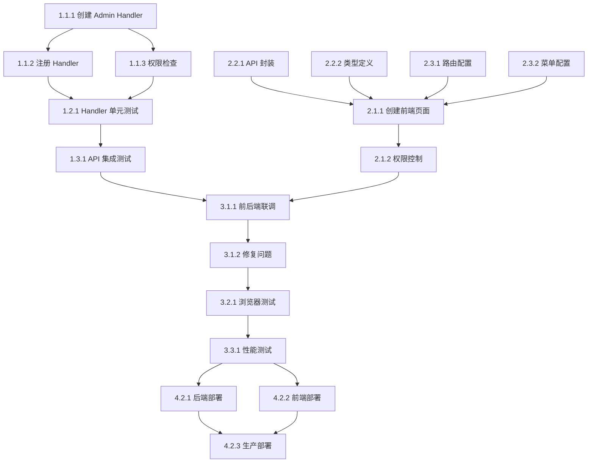

# 云平台-日志管理(外卖相关) 任务分解

> 本文档定义云平台外卖日志管理功能的详细执行任务清单。

## 📋 任务分解原则

- **颗粒度**: 每个任务 1-4 小时（SP ≤ 1）
- **可追踪**: 使用 `- [ ]` 和 `- [x]` 标记完成状态
- **可复用**: 明确 Leverage 可复用代码
- **AI 友好**: 提供 Prompt 模板辅助执行
- **需求关联**: 每个任务关联 requirements.md 中的具体需求

## 📊 进度总览

**总任务数**: 17  
**已完成**: 3  
**进行中**: -  
**完成率**: 18%

**预估 SP**: 3-5  
**预计天数**: 5-8 天

---

## Phase 1: 后端开发（3-4 天）

### 1.1 Go Main Admin API Handler

- [x] 1.1.1 创建 Go Main Admin Takeout Handler

  - File: `main/app/api/v1/admin/admin_takeout.go`
  - Status: ✅ 已完成
  - Purpose: 为 Admin 端添加外卖日志查询 API
  - Requirements: 1.1, 1.2, 2.1, 2.2, 4.1-4.6
  - Leverage:
    - 参考: `main/app/api/v1/shop/shop_takeout.go` - Shop 端实现
    - 复用: `main/app/modules/takeout/application/takeout_app_service.go` - Application Service
  - Prompt:
    ```
    Role: Go Backend Developer
    Task: 创建 Admin 端外卖日志查询 Handler (admin_takeout.go)
    Context:
    - 复用现有的 TakeoutAppService.GetImportLogs() 方法
    - 实现权限控制：平台管理员可查询所有商户，商户管理员只能查询自己的
    - API 路径: GET /api/v1/admin/takeout/logs
    - 参数: platform, import_type, status, page, page_size, company_uuid
    Restrictions:
    - 遵循 .cursor/rules/go-main.mdc
    - URL 使用 snake_case
    - 使用 middleware.Internal() 保护接口
    - 商户管理员强制设置 company_uuid 为当前商户
    Success:
    - Handler 创建成功
    - 参数验证正确
    - 权限控制实现正确
    - API 注释完整(Swagger格式)
    ```
  - Estimate: 3 小时

- [x] 1.1.2 更新 Go Main Admin Handler 注册

  - File: `main/app/api/v1/admin/handler.go`
  - Status: ✅ 已完成
  - Purpose: 注册外卖 Handler 到 Admin 路由
  - Requirements: 1.1
  - Leverage: Task 1.1.1 的 Handler
  - Changes:
    ```go
    func RegisterHandlers(router gin.IRouter, dbm *database.DBManager, cache cache.Cache) {
        // ... 现有代码 ...
        
        // 注册外卖路由
        RegisterTakeoutHandlers(router, dbm)
    }
    ```
  - Estimate: 0.5 小时

- [ ] 1.1.3 实现权限检查逻辑

  - File: `main/app/api/v1/admin/admin_takeout.go` (扩展 Task 1.1.1)
  - Purpose: 实现基于角色的权限控制
  - Requirements: 4.1-4.6
  - Leverage:
    - 参考: 现有 Admin API 的权限控制实现
    - 中间件: `middleware/internal.go`
  - Logic:
    ```go
    // 1. 获取当前用户信息
    user := ctx.GetUser()
    
    // 2. 判断用户角色
    if user.IsPlatformAdmin() {
        // 平台管理员：可以查询所有门店
        // 如果指定了 company_uuid，则查询指定门店
    } else if user.IsShopAdmin() {
        // 商户管理员：只能查询自己的门店
        // 强制设置 company_uuid 为当前用户的商户
        reqData.CompanyUuid = ctx.GetCompanyUuid()
    } else {
        // 其他角色：无权限
        return 403
    }
    ```
  - Estimate: 2 小时

---

### 1.2 PHP Admin Controller

- [x] 1.2.1 创建 PHP Admin Takeout Controller

  - File: `admin/app/admin/controller/Takeout.php`
  - Status: ✅ 已完成
  - Purpose: 创建 PHP Admin 代理层，调用 Go Main 接口
  - Requirements: 1.1, 2.1
  - Leverage:
    - 参考: `admin/app/admin/controller/Erpnext.php` - 已有的代理实现
    - 工具: `help\HttpHelp` - HTTP 请求工具
  - Implementation:
    ```php
    // 调用 Go Main 接口
    $url = 'http://nginx/api/v1/admin/takeout/logs?' . $queryParams;
    $res = HttpHelp::getRequest($url, [], [
        'X-API-KEY: ' . env('JWT_SECRET'),
        'Accept-Language: ' . request()->header('language'),
    ]);
    ```
  - Estimate: 1 小时

---

### 1.3 单元测试

- [ ] 1.3.1 Go Main Admin Handler 单元测试

  - File: `main/app/api/v1/admin/admin_takeout_test.go`
  - Purpose: 确保 Admin Handler 功能正确
  - Requirements: 全部
  - Leverage: 现有测试: `main/app/api/v1/shop/shop_takeout_test.go`
  - Test Cases:
    1. TestGetTakeoutImportLogs_Success - 测试正常查询
    2. TestGetTakeoutImportLogs_WithPlatformFilter - 测试按平台筛选
    3. TestGetTakeoutImportLogs_WithStatusFilter - 测试按状态筛选
    4. TestGetTakeoutImportLogs_WithPagination - 测试分页
    5. TestGetTakeoutImportLogs_PermissionDenied - 测试无权限访问
    6. TestGetTakeoutImportLogs_PlatformAdminAllShops - 测试平台管理员查询所有门店
    7. TestGetTakeoutImportLogs_ShopAdminOnlyOwnLogs - 测试商户管理员只能查询自己的日志
  - Prompt:
    ```
    Role: QA Engineer with Go testing expertise
    Task: 为 Admin Takeout Handler 编写单元测试，覆盖率 ≥ 80%
    Context:
    - 测试所有筛选条件组合
    - 测试权限控制逻辑
    - 测试分页功能
    - 测试错误处理
    Restrictions:
    - 遵循 .cursor/rules/go-main.mdc
    - 使用 testify/assert
    Success:
    - 测试覆盖率 ≥ 80%
    - 所有测试通过
    - 权限测试覆盖所有角色
    ```
  - Estimate: 2-3 小时

---

### 1.4 集成测试

- [ ] 1.4.1 API 集成测试

  - File: `test/integration/admin/takeout_test.go` (可选)
  - Purpose: 端到端测试 API
  - Requirements: 全部
  - Test Scenarios:
    1. 场景1: 平台管理员查询所有日志
    2. 场景2: 平台管理员查询指定门店日志
    3. 场景3: 商户管理员查询日志
    4. 场景4: 按平台筛选
    5. 场景5: 按状态筛选
    6. 场景6: 分页查询
  - Estimate: 2 小时

---

## Phase 2: 前端开发（2-3 天）

### 2.1 日志管理页面

- [ ] 2.1.1 创建日志管理页面组件

  - File: `admin-frontend/src/views/takeout/logs.vue`
  - Purpose: 实现日志列表展示和筛选功能
  - Requirements: 1.1-1.7, 2.1-2.6, 3.1-3.6
  - Leverage:
    - 组件库: Element Plus (ElTable, ElSelect, ElPagination, ElProgress, ElTag)
    - 参考: 其他 Admin 列表页面实现
  - Components:
    1. 筛选表单区域 (ElForm + ElSelect)
    2. 日志列表表格 (ElTable)
    3. 分页控件 (ElPagination)
    4. 错误详情对话框 (ElDialog)
  - Prompt:
    ```
    Role: Vue 3 Frontend Developer
    Task: 创建日志管理页面组件 (logs.vue)
    Context:
    - 使用 Vue 3 Composition API + TypeScript
    - 使用 Element Plus 组件库
    - 实现筛选表单(门店/平台/类型/状态)
    - 实现日志列表展示(表格形式)
    - 实现状态可视化(进度条/标签)
    - 实现分页功能
    - 实现错误详情查看(对话框)
    Restrictions:
    - 遵循 .cursor/rules/vue.mdc
    - 使用 Composition API
    - 组件命名使用 PascalCase
    - 变量和方法使用 camelCase
    Success:
    - 页面渲染正确
    - 筛选功能正常
    - 分页功能正常
    - 错误详情查看正常
    ```
  - Estimate: 4-5 小时

- [ ] 2.1.2 实现权限控制逻辑

  - File: `admin-frontend/src/views/takeout/logs.vue` (扩展 Task 2.1.1)
  - Purpose: 根据用户角色显示/隐藏门店筛选
  - Requirements: 4.1-4.6
  - Logic:
    ```typescript
    // 获取当前用户角色
    const userRole = getCurrentUserRole()
    
    // 平台管理员：显示门店筛选下拉框
    const showShopFilter = computed(() => userRole === 'platform_admin')
    
    // 商户管理员：隐藏门店筛选，自动设置为当前商户
    if (!showShopFilter.value) {
      filterForm.companyUuid = getCurrentCompanyUuid()
    }
    ```
  - Estimate: 1 小时

---

### 2.2 API 调用

- [ ] 2.2.1 创建 API 调用封装

  - File: `admin-frontend/src/api/admin/takeout.ts`
  - Purpose: 封装外卖日志 API 调用
  - Requirements: 1.1
  - Leverage: 现有 API 封装: `admin-frontend/src/api/`
  - API Methods:
    ```typescript
    export interface GetTakeoutImportLogsParams {
      company_uuid?: string
      platform?: string
      import_type?: number
      status?: number
      page?: number
      page_size?: number
    }
    
    export interface TakeoutImportLog {
      uuid: number
      platform: string
      import_type: number
      import_direction: string
      status: number
      progress: number
      success_count: number
      failure_count: number
      total_count: number
      error_message: string
      start_time: number
      end_time: number
      duration: number
      createtime: number
    }
    
    export interface ImportLogListResponse {
      list: TakeoutImportLog[]
      total: number
      page: number
      page_size: number
    }
    
    // 获取外卖导入日志列表
    export function getTakeoutImportLogs(params: GetTakeoutImportLogsParams) {
      return request<ImportLogListResponse>({
        url: '/admin/takeout/logs',
        method: 'get',
        params
      })
    }
    ```
  - Estimate: 1 小时

- [ ] 2.2.2 创建 TypeScript 类型定义

  - File: `admin-frontend/src/types/takeout.ts`
  - Purpose: 定义外卖相关的 TypeScript 类型
  - Requirements: 1.1
  - Leverage: Task 2.2.1 的类型定义
  - Estimate: 0.5 小时

---

### 2.3 路由和菜单配置

- [ ] 2.3.1 添加路由配置

  - File: `admin-frontend/src/router/index.ts`
  - Purpose: 添加日志管理页面路由
  - Requirements: 1.1
  - Changes:
    ```typescript
    {
      path: '/takeout/logs',
      name: 'TakeoutLogs',
      component: () => import('@/views/takeout/logs.vue'),
      meta: {
        title: '外卖日志管理',
        icon: 'Document',
        requiresAuth: true,
        roles: ['platform_admin', 'shop_admin']
      }
    }
    ```
  - Estimate: 0.5 小时

- [ ] 2.3.2 添加菜单配置

  - File: `admin-frontend/src/layout/menu.ts`
  - Purpose: 在侧边栏添加日志管理菜单
  - Requirements: 1.1
  - Changes:
    ```typescript
    {
      title: '外卖管理',
      icon: 'ShoppingCart',
      children: [
        // ... 现有菜单项 ...
        {
          title: '日志管理',
          path: '/takeout/logs',
          icon: 'Document'
        }
      ]
    }
    ```
  - Estimate: 0.5 小时

---

## Phase 3: 联调和测试（1 天）

### 3.1 前后端联调

- [ ] 3.1.1 联调测试

  - File: -
  - Purpose: 确保前后端对接正确
  - Requirements: 全部
  - Test Cases:
    1. 测试日志列表查询
    2. 测试筛选功能
    3. 测试分页功能
    4. 测试错误详情查看
    5. 测试权限控制
  - Estimate: 2-3 小时

- [ ] 3.1.2 修复联调问题

  - File: 根据问题确定
  - Purpose: 修复联调过程中发现的问题
  - Requirements: 全部
  - Estimate: 1-2 小时

---

### 3.2 浏览器兼容性测试

- [ ] 3.2.1 浏览器兼容性测试

  - File: -
  - Purpose: 确保在主流浏览器上正常运行
  - Requirements: 非功能需求 - 浏览器兼容性
  - Test Browsers:
    - [ ] Chrome 90+
    - [ ] Safari 14+
    - [ ] Firefox 88+
    - [ ] Edge 90+
  - Test Cases:
    1. 页面渲染是否正常
    2. 筛选功能是否正常
    3. 分页功能是否正常
    4. 对话框是否正常
    5. 响应式布局是否正常
  - Estimate: 1-2 小时

---

### 3.3 性能测试

- [ ] 3.3.1 查询性能测试

  - File: -
  - Purpose: 确保大数据量下查询性能达标
  - Requirements: 非功能需求 - 性能要求
  - Test Scenarios:
    1. 测试 1 万条数据查询响应时间
    2. 测试 10 万条数据查询响应时间
    3. 测试 100 TPS 并发查询
  - Success Criteria:
    - 查询响应时间 < 500ms (10万条数据)
    - 100 TPS 并发查询无性能下降
  - Estimate: 2 小时

---

## Phase 4: 文档和部署（0.5 天）

### 4.1 文档完善

- [x] 4.1.1 需求提案文档

  - File: `docs/team/proposals/2025-12/v2.12.0-cloud-platform-takeout-log-management.md`
  - Status: ✅ 已完成
  - Completed: 2025-12-17

- [x] 4.1.2 技术设计文档

  - File: `docs/shared/specs/active/story-admin-takeout-log-management/design.md`
  - Status: ✅ 已完成
  - Completed: 2025-12-17

- [x] 4.1.3 需求文档

  - File: `docs/shared/specs/active/story-admin-takeout-log-management/requirements.md`
  - Status: ✅ 已完成
  - Completed: 2025-12-17

- [x] 4.1.4 任务分解文档

  - File: `docs/shared/specs/active/story-admin-takeout-log-management/tasks.md`
  - Status: ✅ 已完成（本文档）
  - Completed: 2025-12-17

- [ ] 4.1.5 API 文档

  - File: -
  - Purpose: Swagger API 文档自动生成
  - Requirements: 1.1
  - Leverage: Swagger 注释(已在 Task 1.1.1 中添加)
  - Command: `swag init`
  - Estimate: 0.5 小时

---

### 4.2 部署

- [ ] 4.2.1 后端部署

  - File: -
  - Purpose: 部署后端代码到测试环境
  - Requirements: 全部
  - Steps:
    1. 合并代码到 `main` 分支
    2. 运行单元测试: `make test`
    3. 构建 Docker 镜像: `make docker-build`
    4. 部署到测试环境
    5. 执行集成测试
  - Estimate: 1 小时

- [ ] 4.2.2 前端部署

  - File: -
  - Purpose: 部署前端代码到测试环境
  - Requirements: 全部
  - Steps:
    1. 构建前端资源: `npm run build`
    2. 部署到 CDN
    3. 更新前端版本号
    4. 验证部署结果
  - Estimate: 0.5 小时

- [ ] 4.2.3 生产环境部署

  - File: -
  - Purpose: 部署到生产环境
  - Requirements: 全部
  - Steps:
    1. 确认测试环境测试通过
    2. 创建发布分支
    3. 部署后端到生产环境
    4. 部署前端到生产环境
    5. 验证生产环境功能
    6. 监控系统运行状态
  - Estimate: 1 小时

---

## 任务依赖关系



---

## 风险和缓解

### 风险 1: 权限系统集成复杂度

**影响**: 中  
**概率**: 中  
**缓解措施**:

- 在 Task 1.1.3 开始前,确认现有权限系统的实现方式
- 参考现有 Admin 端 API 的权限控制实现
- 预留 2 小时时间用于权限集成和测试

### 风险 2: 大数据量查询性能

**影响**: 高  
**概率**: 低  
**缓解措施**:

- 在 Task 3.3.1 中进行性能测试
- 使用已有索引优化查询(platform, status, create_time)
- 限制每页最大数量(100 条)
- 如性能不达标,考虑添加缓存或日志归档

### 风险 3: 前后端对接问题

**影响**: 中  
**概率**: 低  
**缓解措施**:

- 在 Task 3.1.1 中预留充足的联调时间
- 使用 Swagger 生成 API 文档,确保前后端对接一致
- 前后端开发同步进行,及时沟通

---

## 验收清单

### 功能验收

- [ ] 日志列表展示正确,包含所有必需字段
- [ ] 筛选功能正常,支持按门店、平台、类型、状态筛选
- [ ] 分页功能正常,支持 20/50/100 条/页
- [ ] 状态可视化正确(进度条、标签)
- [ ] 错误详情查看功能正常
- [ ] 权限控制正确,平台管理员可查询所有,商户管理员只能查询自己的

### 测试验收

- [ ] 单元测试覆盖率 ≥ 80%
- [ ] 集成测试通过
- [ ] 浏览器兼容性测试通过
- [ ] 性能测试达标(响应时间 < 500ms)

### 文档验收

- [x] 需求提案文档完成
- [x] 技术设计文档完成
- [x] 需求文档完成
- [x] 任务分解文档完成
- [ ] API 文档完成(Swagger)

### 部署验收

- [ ] 测试环境部署成功
- [ ] 生产环境部署成功
- [ ] 系统监控正常

---

## 时间表

| Phase | 内容 | 预计时间 | 负责人 | 状态 |
|-------|------|---------|--------|------|
| Phase 1 | 后端开发 | 3-4 天 | 待分配 | 🔵 待开始 |
| Phase 2 | 前端开发 | 2-3 天 | 待分配 | 🔵 待开始 |
| Phase 3 | 联调和测试 | 1 天 | 待分配 | 🔵 待开始 |
| Phase 4 | 文档和部署 | 0.5 天 | 待分配 | 🟡 进行中 |
| **总计** | - | **5-8 天** | - | - |

---

## 相关资源

### 代码位置

**后端**:
- Go Main Admin API Handler: `main/app/api/v1/admin/admin_takeout.go` (✅ 已创建)
- PHP Admin Controller: `admin/app/admin/controller/Takeout.php` (✅ 已创建)
- Application Service: `main/app/modules/takeout/application/takeout_app_service.go` (已存在,复用)
- Repository: `main/app/modules/takeout/domain/repository/takeout_import_log_repository.go` (已存在,复用)
- Model: `main/app/modules/takeout/domain/model/takeout_import_log.go` (已存在,复用)

**前端**:
- 日志管理页面: `admin-frontend/src/views/takeout/logs.vue` (待新建)
- API 封装: `admin-frontend/src/api/admin/takeout.ts` (待新建)
- 类型定义: `admin-frontend/src/types/takeout.ts` (待新建)

### 参考文档

- [技术设计文档](./design.md)
- [需求文档](./requirements.md)
- [需求提案](../../../../team/proposals/2025-12/v2.12.0-cloud-platform-takeout-log-management.md)
- [Go Main 开发规范](../../../../../.cursor/rules/go-main.mdc)
- [Vue 开发规范](../../../../../.cursor/rules/vue.mdc)
- [API 设计规范](../../../../../.cursor/rules/api.mdc)

---

**版本**: v1.0.0  
**创建日期**: 2025-12-17  
**维护者**: weifashi  
**最后更新**: 2025-12-17

