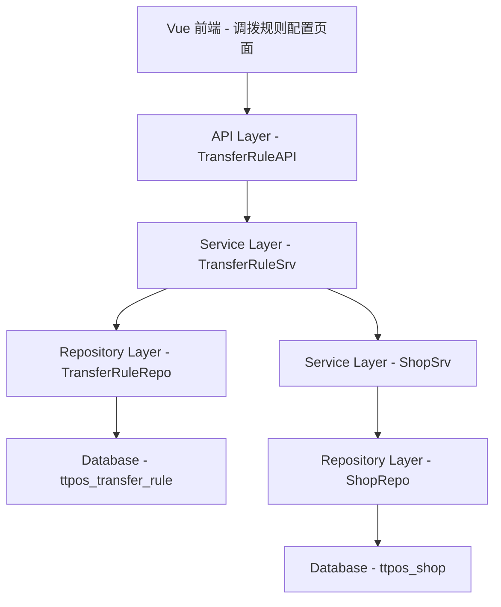

# 新管理端-业务设置-调拨规则 设计文档

> 本文档定义调拨规则配置功能的技术设计和实现方案。

## 📋 概述

在新管理端的业务设置中增加"调拨规则"功能，允许总店管理员配置各门店的调拨发起类型（调入/调出），实现对门店调拨权限的统一管理和控制。

**核心实现**：
- 数据库：新增 `ttpos_transfer_rule` 表存储门店调拨规则
- 后端：Go Main 模块实现 Repository + Service + API 完整三层架构
- 前端：Vue 3 实现调拨规则配置页面
- 权限控制：门店发起调拨时根据规则过滤可选类型

**技术栈**：Go (main/) + Vue 3 (admin/views/)

---

## 🎯 规范对齐

### Go Main 规范 (go-main.mdc)

本设计遵循以下规范：

- ✅ Service 只依赖其他 Service 接口
- ✅ Repository 只持有 db 实例
- ✅ URL 使用 snake_case
- ✅ data 字段必须是对象
- ✅ 不使用 panic，返回 error
- ✅ 接口以 `I` 开头，实现以 `Impl` 结尾
- ✅ 使用选项模式实现灵活查询

### API 设计规范 (api.mdc)

- ✅ URL: `/api/v1/transfer_rule/list`, `/api/v1/transfer_rule/save`, `/api/v1/transfer_rule/get`
- ✅ 响应格式: `{code, message, data{}}`
- ✅ data 不能为 null 或数组
- ✅ 列表接口的分页信息放在 data.meta 中

### 数据库规范 (database.mdc)

- ✅ 表名: `ttpos_transfer_rule`
- ✅ 必需字段: `id`, `uuid`, `create_time`, `update_time`, `delete_time`
- ✅ 时间字段使用 int 类型
- ✅ 唯一索引: `uk_uuid`, `uk_shop`

### Vue 规范 (vue.mdc)

- ✅ 使用 Vue 3 + TypeScript + Vite
- ✅ 使用 Element Plus 组件库
- ✅ 使用 Composition API
- ✅ 遵循命名规范

---

## 🔄 代码复用分析

### 可复用的现有组件

1. **Shop Service**: `main/app/service/shop/shop.go`
   - 复用门店列表查询逻辑
   - 用于获取所有门店数据

2. **UUID 生成**: `main/pkg/uuid/uuid.go`
   - 复用 UUID 生成工具

3. **Helper 响应**: `main/pkg/helper/response.go`
   - 复用统一响应格式

4. **选项模式**: `main/app/repository/db_option.go`
   - 复用 DBOption 类型和选项模式实现

### 集成点

- **Shop 模块**: 获取门店列表，展示所有门店及其规则配置
- **Transfer Order 模块**: 调拨单发起时查询规则，过滤可选类型
- **权限模块**: 验证总店管理员权限

---

## 🏗️ 架构设计

### 分层设计原则

**Go Main 三层架构**:

```
API 层 (Controller/API)
  ↓ 接收请求，参数校验
Service 层 (Service)
  ↓ 业务逻辑，规则验证
Repository 层 (Repository)
  ↓ 数据访问，CRUD 操作
```

**依赖规则**:

- ✅ API → Service → Repository
- ❌ 禁止跨层调用
- ❌ Service 不能依赖 Repository
- ✅ Service 可以依赖 Shop Service 接口

### 架构图



### 模块划分

#### Go Main 模块

- **API 层**: `main/app/api/v1/admin/admin_transfer_rule.go` - 路由处理、参数校验
- **Service 层**: `main/app/service/transfer_rule/transfer_rule.go` - 业务逻辑、规则验证
- **Repository 层**: `main/app/repository/transfer_rule.go` - 数据访问、数据库操作
- **Model 层**: `main/app/model/transfer_rule.go` - 数据模型
- **DTO 层**: 
  - `main/app/dto/req/transfer_rule_req.go` - 请求参数
  - `main/app/dto/resp/transfer_rule_resp.go` - 响应数据

#### Vue 前端模块

- **Pages**: `admin/views/admin/pages/business-setting/transfer-rule/index.vue` - 配置页面
- **API**: `admin/views/admin/api/transfer-rule.ts` - API 封装
- **Types**: `admin/views/admin/types/transfer-rule.ts` - TypeScript 类型定义

---

## 🗄️ 数据库设计

### 数据表设计

#### 表 1: ttpos_transfer_rule

```sql
CREATE TABLE IF NOT EXISTS `ttpos_transfer_rule` (
    `id` bigint unsigned NOT NULL AUTO_INCREMENT COMMENT '主键ID',
    `uuid` bigint unsigned NOT NULL DEFAULT 0 COMMENT '唯一标识',
    `shop_id` bigint unsigned NOT NULL DEFAULT 0 COMMENT '门店ID',
    `merchant_id` bigint unsigned NOT NULL DEFAULT 0 COMMENT '商户ID',
    `allow_transfer_in` tinyint NOT NULL DEFAULT 1 COMMENT '是否允许调入（1:是 0:否）',
    `allow_transfer_out` tinyint NOT NULL DEFAULT 1 COMMENT '是否允许调出（1:是 0:否）',
    `create_time` int NOT NULL DEFAULT 0 COMMENT '创建时间',
    `update_time` int NOT NULL DEFAULT 0 COMMENT '更新时间',
    `delete_time` int NOT NULL DEFAULT 0 COMMENT '删除时间',
    PRIMARY KEY (`id`),
    UNIQUE KEY `uk_uuid` (`uuid`),
    UNIQUE KEY `uk_shop` (`shop_id`, `delete_time`),
    KEY `idx_merchant` (`merchant_id`)
) ENGINE=InnoDB DEFAULT CHARSET=utf8mb4 COMMENT='调拨规则表';
```

**字段说明**:

| 字段 | 类型 | 说明 | 约束 |
|------|------|------|------|
| id | bigint unsigned | 主键 ID | AUTO_INCREMENT |
| uuid | bigint unsigned | 唯一标识 | DEFAULT 0, UNIQUE |
| shop_id | bigint unsigned | 门店ID | DEFAULT 0, UNIQUE (与 delete_time 组合) |
| merchant_id | bigint unsigned | 商户ID | DEFAULT 0 |
| allow_transfer_in | tinyint | 是否允许调入 | DEFAULT 1 (1:是 0:否) |
| allow_transfer_out | tinyint | 是否允许调出 | DEFAULT 1 (1:是 0:否) |
| create_time | int | 创建时间 | DEFAULT 0 |
| update_time | int | 更新时间 | DEFAULT 0 |
| delete_time | int | 删除时间（软删除） | DEFAULT 0 |

**索引设计**:

- 主键索引: `PRIMARY KEY (id)` - 唯一标识每条记录
- 唯一索引: `UNIQUE KEY uk_uuid (uuid)` - UUID 唯一性
- 唯一索引: `UNIQUE KEY uk_shop (shop_id, delete_time)` - 保证同一门店只有一条有效规则
- 普通索引: `KEY idx_merchant (merchant_id)` - 按商户查询优化

**迁移文件**: `admin/database/migrations/{YYYYMMDDHHMMSS}_create_ttpos_transfer_rule_table.php`

### 数据库迁移

**迁移脚本**:

```bash
# 创建迁移文件
cd admin
php think migrate:create CreateTtposTransferRuleTable

# 执行迁移
php think migrate:run
```

**同步 Go Model**:

在 `main/app/model/transfer_rule.go` 中创建对应的 Go 结构体

**参考**: `docs/agent/workflows/database-migration.md`

---

## 📊 数据模型

### Go Model

```go
// main/app/model/transfer_rule.go
package model

type TransferRule struct {
	Id                uint64 `gorm:"column:id;primaryKey" json:"id"`
	Uuid              uint64 `gorm:"column:uuid;uniqueIndex" json:"uuid"`
	ShopId            uint64 `gorm:"column:shop_id" json:"shop_id"`
	MerchantId        uint64 `gorm:"column:merchant_id" json:"merchant_id"`
	AllowTransferIn   int8   `gorm:"column:allow_transfer_in" json:"allow_transfer_in"`
	AllowTransferOut  int8   `gorm:"column:allow_transfer_out" json:"allow_transfer_out"`
	CreateTime        int64  `gorm:"column:create_time" json:"create_time"`
	UpdateTime        int64  `gorm:"column:update_time" json:"update_time"`
	DeleteTime        int64  `gorm:"column:delete_time;index" json:"delete_time"`
}

func (*TransferRule) TableName() string {
	return "ttpos_transfer_rule"
}
```

### DTO 定义

#### Request DTO

```go
// main/app/dto/req/transfer_rule_req.go
package dto_req

type TransferRuleSaveReq struct {
	ShopId           uint64 `json:"shop_id" binding:"required"`
	AllowTransferIn  int8   `json:"allow_transfer_in" binding:"oneof=0 1"`
	AllowTransferOut int8   `json:"allow_transfer_out" binding:"oneof=0 1"`
}

type TransferRuleGetReq struct {
	ShopId uint64 `json:"shop_id" form:"shop_id" binding:"required"`
}

type TransferRuleListReq struct {
	PageNo   int `json:"page_no" form:"page_no" binding:"required,min=1"`
	PageSize int `json:"page_size" form:"page_size" binding:"required,min=1,max=100"`
}
```

#### Response DTO

```go
// main/app/dto/resp/transfer_rule_resp.go
package dto_resp

type TransferRuleResp struct {
	ShopId           uint64 `json:"shop_id"`
	ShopName         string `json:"shop_name"`
	AllowTransferIn  int8   `json:"allow_transfer_in"`
	AllowTransferOut int8   `json:"allow_transfer_out"`
	UpdateTime       int64  `json:"update_time"`
}

type TransferRuleListResp struct {
	List []*TransferRuleResp `json:"list"`
	Meta *PageMeta           `json:"meta"`
}

type TransferRuleGetResp struct {
	AllowTransferIn  int8 `json:"allow_transfer_in"`
	AllowTransferOut int8 `json:"allow_transfer_out"`
}

type PageMeta struct {
	PageNo   int   `json:"page_no"`
	PageSize int   `json:"page_size"`
	Total    int64 `json:"total"`
}
```

---

## 🔌 API 设计

### RESTful API

#### API 1: 获取调拨规则列表

**请求**:

- **URL**: `/api/v1/transfer_rule/list`
- **Method**: `GET`
- **Headers**:
  ```json
  {
    "Authorization": "Bearer {token}",
    "Content-Type": "application/json"
  }
  ```
- **Query Params**:
  ```
  page_no: 1
  page_size: 20
  ```

**响应**:

```json
{
  "code": 1,
  "message": "success",
  "data": {
    "list": [
      {
        "shop_id": 1,
        "shop_name": "总店",
        "allow_transfer_in": 1,
        "allow_transfer_out": 1,
        "update_time": 1704528000
      },
      {
        "shop_id": 2,
        "shop_name": "分店A",
        "allow_transfer_in": 1,
        "allow_transfer_out": 0,
        "update_time": 1704528000
      }
    ],
    "meta": {
      "page_no": 1,
      "page_size": 20,
      "total": 10
    }
  }
}
```

**错误响应**:

```json
{
  "code": 0,
  "message": "参数错误",
  "data": {}
}
```

#### API 2: 保存调拨规则

**请求**:

- **URL**: `/api/v1/transfer_rule/save`
- **Method**: `POST`
- **Headers**:
  ```json
  {
    "Authorization": "Bearer {token}",
    "Content-Type": "application/json"
  }
  ```
- **Body**:
  ```json
  {
    "shop_id": 2,
    "allow_transfer_in": 1,
    "allow_transfer_out": 0
  }
  ```

**响应**:

```json
{
  "code": 1,
  "message": "保存成功",
  "data": {}
}
```

**错误响应**:

```json
{
  "code": 0,
  "message": "至少保留一个调拨类型",
  "data": {}
}
```

#### API 3: 获取门店的调拨规则（门店端）

**请求**:

- **URL**: `/api/v1/transfer_rule/get`
- **Method**: `GET`
- **Headers**:
  ```json
  {
    "Authorization": "Bearer {token}",
    "Content-Type": "application/json"
  }
  ```
- **Query Params**:
  ```
  shop_id: 2  (可选，不传则使用当前登录门店)
  ```

**响应**:

```json
{
  "code": 1,
  "message": "success",
  "data": {
    "allow_transfer_in": 1,
    "allow_transfer_out": 0
  }
}
```

**未配置时的响应**:

```json
{
  "code": 1,
  "message": "success",
  "data": {
    "allow_transfer_in": 1,
    "allow_transfer_out": 1
  }
}
```

---

## 🧩 组件和接口

### Repository 层

#### Repository 接口

```go
// main/app/repository/i_transfer_rule_repo.go
package repository

import (
	"gorm.io/gorm"
	"ttpos-server-go/main/app/model"
)

type ITransferRuleRepo interface {
	Create(rule *model.TransferRule) error
	Update(rule *model.TransferRule, options ...DBOption) error
	GetByShopId(shopId uint64, options ...DBOption) (*model.TransferRule, error)
	GetList(options ...DBOption) ([]*model.TransferRule, int64, error)
	
	// 选项方法
	WhereShopId(shopId uint64) DBOption
	WhereMerchantId(merchantId uint64) DBOption
	Offset(offset int) DBOption
	Limit(limit int) DBOption
}
```

#### Repository 实现（选项模式）

```go
// main/app/repository/transfer_rule.go
package repository

import (
	"gorm.io/gorm"
	"ttpos-server-go/main/app/model"
)

type TransferRuleRepoImpl struct {
	db *gorm.DB  // ✅ 只持有 db 实例
}

func NewTransferRuleRepo(db *gorm.DB) ITransferRuleRepo {
	return &TransferRuleRepoImpl{db: db}
}

func (r *TransferRuleRepoImpl) Create(rule *model.TransferRule) error {
	return r.db.Create(rule).Error
}

func (r *TransferRuleRepoImpl) Update(rule *model.TransferRule, options ...DBOption) error {
	db := r.db.Where("delete_time = ?", 0)
	for _, option := range options {
		db = option(db)
	}
	return db.Updates(rule).Error
}

func (r *TransferRuleRepoImpl) GetByShopId(shopId uint64, options ...DBOption) (*model.TransferRule, error) {
	var rule model.TransferRule
	db := r.db.Where("delete_time = ?", 0).Where("shop_id = ?", shopId)
	
	for _, option := range options {
		db = option(db)
	}
	
	if err := db.First(&rule).Error; err != nil {
		return nil, err
	}
	return &rule, nil
}

func (r *TransferRuleRepoImpl) GetList(options ...DBOption) ([]*model.TransferRule, int64, error) {
	var list []*model.TransferRule
	var total int64
	
	db := r.db.Where("delete_time = ?", 0)
	
	for _, option := range options {
		db = option(db)
	}
	
	if err := db.Model(&model.TransferRule{}).Count(&total).Error; err != nil {
		return nil, 0, err
	}
	
	if err := db.Find(&list).Error; err != nil {
		return nil, 0, err
	}
	
	return list, total, nil
}

// 选项方法
func (r *TransferRuleRepoImpl) WhereShopId(shopId uint64) DBOption {
	return func(db *gorm.DB) *gorm.DB {
		return db.Where("shop_id = ?", shopId)
	}
}

func (r *TransferRuleRepoImpl) WhereMerchantId(merchantId uint64) DBOption {
	return func(db *gorm.DB) *gorm.DB {
		return db.Where("merchant_id = ?", merchantId)
	}
}

func (r *TransferRuleRepoImpl) Offset(offset int) DBOption {
	return func(db *gorm.DB) *gorm.DB {
		return db.Offset(offset)
	}
}

func (r *TransferRuleRepoImpl) Limit(limit int) DBOption {
	return func(db *gorm.DB) *gorm.DB {
		return db.Limit(limit)
	}
}
```

### Service 层

#### Service 接口

```go
// main/app/service/transfer_rule/i_transfer_rule_srv.go
package transfer_rule

import (
	"github.com/gin-gonic/gin"
	dto_req "ttpos-server-go/main/app/dto/req"
	dto_resp "ttpos-server-go/main/app/dto/resp"
)

type ITransferRuleSrv interface {
	Save(ctx *gin.Context, req *dto_req.TransferRuleSaveReq) error
	GetByShopId(ctx *gin.Context, req *dto_req.TransferRuleGetReq) (*dto_resp.TransferRuleGetResp, error)
	GetList(ctx *gin.Context, req *dto_req.TransferRuleListReq) (*dto_resp.TransferRuleListResp, error)
}
```

#### Service 实现

```go
// main/app/service/transfer_rule/transfer_rule.go
package transfer_rule

import (
	"errors"
	"time"
	
	"github.com/gin-gonic/gin"
	"gorm.io/gorm"
	
	"ttpos-server-go/main/app/database"
	dto_req "ttpos-server-go/main/app/dto/req"
	dto_resp "ttpos-server-go/main/app/dto/resp"
	"ttpos-server-go/main/app/model"
	"ttpos-server-go/main/app/repository"
	"ttpos-server-go/main/app/service/shop"
	pkg_errors "ttpos-server-go/main/pkg/errors"
	pkg_uuid "ttpos-server-go/main/pkg/uuid"
)

type transferRuleSrv struct {
	dbm     *database.DBManager
	shopSrv shop.IShopSrv
}

func NewTransferRuleSrv(
	dbm *database.DBManager,
	shopSrv shop.IShopSrv,
) ITransferRuleSrv {
	return &transferRuleSrv{
		dbm:     dbm,
		shopSrv: shopSrv,
	}
}

func (s *transferRuleSrv) Save(ctx *gin.Context, req *dto_req.TransferRuleSaveReq) error {
	// 1. 验证参数：至少保留一个调拨类型
	if req.AllowTransferIn == 0 && req.AllowTransferOut == 0 {
		return pkg_errors.New("至少保留一个调拨类型")
	}
	
	// 2. 获取 Repository
	ruleRepo := repository.NewTransferRuleRepo(s.dbm.GetDB(ctx))
	
	// 3. 查询是否已存在规则
	existingRule, err := ruleRepo.GetByShopId(req.ShopId)
	if err != nil && !errors.Is(err, gorm.ErrRecordNotFound) {
		return pkg_errors.WithMessage(err, "查询规则失败")
	}
	
	// 4. 获取商户ID
	merchantId := ctx.GetUint64("merchant_id")
	
	// 5. 更新或创建规则
	if existingRule != nil {
		// 更新
		existingRule.AllowTransferIn = req.AllowTransferIn
		existingRule.AllowTransferOut = req.AllowTransferOut
		existingRule.UpdateTime = time.Now().Unix()
		
		if err := ruleRepo.Update(existingRule, ruleRepo.WhereShopId(req.ShopId)); err != nil {
			return pkg_errors.WithMessage(err, "更新规则失败")
		}
	} else {
		// 创建
		newRule := &model.TransferRule{
			Uuid:             pkg_uuid.GenerateUuid(),
			ShopId:           req.ShopId,
			MerchantId:       merchantId,
			AllowTransferIn:  req.AllowTransferIn,
			AllowTransferOut: req.AllowTransferOut,
			CreateTime:       time.Now().Unix(),
			UpdateTime:       time.Now().Unix(),
		}
		
		if err := ruleRepo.Create(newRule); err != nil {
			return pkg_errors.WithMessage(err, "创建规则失败")
		}
	}
	
	return nil
}

func (s *transferRuleSrv) GetByShopId(ctx *gin.Context, req *dto_req.TransferRuleGetReq) (*dto_resp.TransferRuleGetResp, error) {
	// 1. 获取 Repository
	ruleRepo := repository.NewTransferRuleRepo(s.dbm.GetDB(ctx))
	
	// 2. 查询规则
	rule, err := ruleRepo.GetByShopId(req.ShopId)
	if err != nil {
		if errors.Is(err, gorm.ErrRecordNotFound) {
			// 未配置规则，返回默认值（允许所有类型）
			return &dto_resp.TransferRuleGetResp{
				AllowTransferIn:  1,
				AllowTransferOut: 1,
			}, nil
		}
		return nil, pkg_errors.WithMessage(err, "查询规则失败")
	}
	
	// 3. 返回响应
	return &dto_resp.TransferRuleGetResp{
		AllowTransferIn:  rule.AllowTransferIn,
		AllowTransferOut: rule.AllowTransferOut,
	}, nil
}

func (s *transferRuleSrv) GetList(ctx *gin.Context, req *dto_req.TransferRuleListReq) (*dto_resp.TransferRuleListResp, error) {
	// 1. 获取商户ID
	merchantId := ctx.GetUint64("merchant_id")
	
	// 2. 获取所有门店
	shopList, err := s.shopSrv.GetAllShops(ctx, merchantId)
	if err != nil {
		return nil, pkg_errors.WithMessage(err, "获取门店列表失败")
	}
	
	// 3. 获取所有规则
	ruleRepo := repository.NewTransferRuleRepo(s.dbm.GetDB(ctx))
	rules, total, err := ruleRepo.GetList(
		ruleRepo.WhereMerchantId(merchantId),
	)
	if err != nil {
		return nil, pkg_errors.WithMessage(err, "查询规则失败")
	}
	
	// 4. 构建规则 Map
	ruleMap := make(map[uint64]*model.TransferRule)
	for _, rule := range rules {
		ruleMap[rule.ShopId] = rule
	}
	
	// 5. 组装响应数据
	respList := make([]*dto_resp.TransferRuleResp, 0, len(shopList))
	for _, shop := range shopList {
		rule, exists := ruleMap[shop.Id]
		
		resp := &dto_resp.TransferRuleResp{
			ShopId:           shop.Id,
			ShopName:         shop.Name,
			AllowTransferIn:  1, // 默认值
			AllowTransferOut: 1, // 默认值
			UpdateTime:       0,
		}
		
		if exists {
			resp.AllowTransferIn = rule.AllowTransferIn
			resp.AllowTransferOut = rule.AllowTransferOut
			resp.UpdateTime = rule.UpdateTime
		}
		
		respList = append(respList, resp)
	}
	
	// 6. 分页
	offset := (req.PageNo - 1) * req.PageSize
	end := offset + req.PageSize
	if end > len(respList) {
		end = len(respList)
	}
	
	pagedList := respList[offset:end]
	
	// 7. 返回响应
	return &dto_resp.TransferRuleListResp{
		List: pagedList,
		Meta: &dto_resp.PageMeta{
			PageNo:   req.PageNo,
			PageSize: req.PageSize,
			Total:    int64(len(respList)),
		},
	}, nil
}
```

### API 层

```go
// main/app/api/v1/admin/admin_transfer_rule.go
package admin

import (
	"github.com/gin-gonic/gin"
	
	dto_req "ttpos-server-go/main/app/dto/req"
	"ttpos-server-go/main/app/service/transfer_rule"
	"ttpos-server-go/main/pkg/constant"
	"ttpos-server-go/main/pkg/helper"
)

type TransferRuleAPI struct {
	transferRuleSrv transfer_rule.ITransferRuleSrv
}

func NewTransferRuleAPI(transferRuleSrv transfer_rule.ITransferRuleSrv) *TransferRuleAPI {
	return &TransferRuleAPI{transferRuleSrv: transferRuleSrv}
}

// POST /api/v1/transfer_rule/save
func (api *TransferRuleAPI) Save(c *gin.Context) {
	var req dto_req.TransferRuleSaveReq
	if err := c.ShouldBindJSON(&req); err != nil {
		helper.ErrorWithDetail(c, constant.CodeInvalidParam, err)
		return
	}
	
	if err := api.transferRuleSrv.Save(c, &req); err != nil {
		helper.ErrorWithDetail(c, constant.CodeFail, err)
		return
	}
	
	helper.Success(c, gin.H{
		"data": gin.H{},
	})
}

// GET /api/v1/transfer_rule/get
func (api *TransferRuleAPI) Get(c *gin.Context) {
	var req dto_req.TransferRuleGetReq
	if err := c.ShouldBindQuery(&req); err != nil {
		helper.ErrorWithDetail(c, constant.CodeInvalidParam, err)
		return
	}
	
	// 如果没有传 shop_id，使用当前登录门店
	if req.ShopId == 0 {
		req.ShopId = c.GetUint64("shop_id")
	}
	
	resp, err := api.transferRuleSrv.GetByShopId(c, &req)
	if err != nil {
		helper.ErrorWithDetail(c, constant.CodeFail, err)
		return
	}
	
	helper.Success(c, gin.H{
		"data": resp,
	})
}

// GET /api/v1/transfer_rule/list
func (api *TransferRuleAPI) List(c *gin.Context) {
	var req dto_req.TransferRuleListReq
	if err := c.ShouldBindQuery(&req); err != nil {
		helper.ErrorWithDetail(c, constant.CodeInvalidParam, err)
		return
	}
	
	resp, err := api.transferRuleSrv.GetList(c, &req)
	if err != nil {
		helper.ErrorWithDetail(c, constant.CodeFail, err)
		return
	}
	
	helper.Success(c, gin.H{
		"data": resp,
	})
}
```

---

## 🚨 错误处理

### 错误场景

#### 场景 1: 两个调拨类型都为 false

- **处理方式**: 前端置灰最后一个选项；后端返回错误
- **用户影响**: 用户看到提示"至少保留一个调拨类型"
- **代码示例**:
  ```go
  if req.AllowTransferIn == 0 && req.AllowTransferOut == 0 {
      return pkg_errors.New("至少保留一个调拨类型")
  }
  ```

#### 场景 2: 规则未配置

- **处理方式**: 返回默认值（允许所有类型）
- **用户影响**: 门店端显示所有调拨类型，保持兼容性
- **代码示例**:
  ```go
  if errors.Is(err, gorm.ErrRecordNotFound) {
      return &dto_resp.TransferRuleGetResp{
          AllowTransferIn:  1,
          AllowTransferOut: 1,
      }, nil
  }
  ```

#### 场景 3: 数据库操作失败

- **处理方式**: 记录日志，返回友好错误信息
- **用户影响**: 用户看到"操作失败，请稍后重试"
- **代码示例**:
  ```go
  if err != nil {
      logger.Logger.Error("创建规则失败", zap.Error(err))
      return pkg_errors.WithMessage(err, "创建规则失败")
  }
  ```

---

## 🔒 安全设计

### 身份验证

- **JWT Token**: 所有 API 需要 Token 验证
- **中间件**: 使用现有的 AuthMiddleware

### 权限控制

- **总店权限**: 只有总店管理员可以配置规则
- **权限中间件**: 在路由中添加权限检查
- **API 权限**: `/transfer_rule/save` 和 `/transfer_rule/list` 只允许总店管理员访问

### 数据安全

- **SQL 注入防护**: 使用 GORM 参数化查询
- **XSS 防护**: 前端输入校验
- **并发控制**: 使用数据库唯一索引防止重复创建

---

## 🧪 测试策略

### 单元测试

**目标覆盖率**:

- main/app/service/transfer_rule: 70%+
- main/app/repository: 80%+

**测试内容**:

- Service 业务逻辑（规则验证、默认值处理）
- Repository 数据访问（CRUD 操作）
- 边界场景（未配置规则、两个都为 false）

**示例**:

```go
// main/app/service/transfer_rule/transfer_rule_test.go
func TestTransferRuleService_Save(t *testing.T) {
    // 测试正常保存
    // 测试参数验证（两个都为 false）
    // 测试更新已存在的规则
}

// main/app/repository/transfer_rule_test.go
func TestTransferRuleRepo_Create(t *testing.T) {
    // 测试创建规则
    // 测试唯一索引约束
}
```

### API 测试

**测试内容**:

- API 接口调用（正常场景）
- 参数验证（缺少必填参数、参数类型错误）
- 响应格式（code, message, data 结构）
- 错误处理（数据库错误、业务逻辑错误）

### 集成测试

**测试流程**:

1. 配置规则 → 保存成功
2. 查询规则 → 返回正确数据
3. 门店端查询 → 根据规则过滤调拨类型
4. 更新规则 → 保存成功
5. 未配置规则 → 返回默认值

---

## 📈 性能优化

### 优化策略

1. **数据库优化**:
   - 添加索引: `uk_shop`, `idx_merchant`
   - 使用唯一索引防止重复创建
   - 软删除查询添加 `delete_time = 0` 条件

2. **缓存优化**:
   - Redis 缓存门店规则（5 分钟过期）
   - 规则更新时清除相关缓存
   - 缓存 Key: `ttpos:transfer_rule:shop:{shop_id}`

3. **查询优化**:
   - GetList 接口一次性查询所有门店和规则
   - 使用 Map 快速匹配规则

### 性能指标

- 本地响应时间: < 100ms
- 数据库查询: < 30ms
- 缓存命中率: > 80%（如实现缓存）

---

## 📚 实现清单

### Phase 1: 数据库和模型

- [ ] 创建数据库迁移文件
- [ ] 执行数据库迁移
- [ ] 创建 Go Model
- [ ] 更新 Seeds 文件（可选）

### Phase 2: 核心实现

- [ ] 实现 Repository 接口和实现
- [ ] 实现 Service 接口和实现
- [ ] 实现 API 接口
- [ ] 创建 DTO 定义
- [ ] 注册路由

### Phase 3: 前端实现

- [ ] 创建 API 封装
- [ ] 创建调拨规则配置页面
- [ ] 实现规则验证（前端）
- [ ] 实现门店端规则查询和应用

### Phase 4: 测试

- [ ] 单元测试
- [ ] API 测试
- [ ] 集成测试
- [ ] 手动测试

**详细任务**: 参见 `tasks.md`

---

## Graphiti & 活动日志

- Related Episode: `[待补充]`
- 模板：`docs/agent/templates/graphiti-episode.md`
- 活动日志：`docs/team/activities/2026-01/2026-01-06.md`
- 在技术方案评审、关键架构决策或踩坑总结后，立即补充 Episode 并在设计文档尾部互链。

---

**版本**: v1.0.0  
**创建日期**: 2026-01-06  
**作者**: weifashi  
**审核者**: 技术负责人

