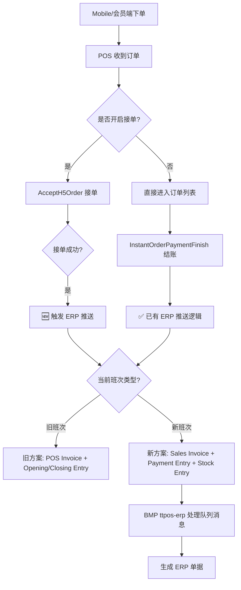

# story-all-erp-mobile-order-sync 技术设计

## 📋 概述

| 项目 | 内容 |
|------|------|
| Spec ID | story-all-erp-mobile-order-sync |
| 设计人 | weifashi |
| 设计日期 | 2026-03-11 |
| 总 SP | 3 |

让会员端/扫码点餐(Mobile)产生的即时订单，在接单或结账时同步进入 ERP，复用现有 POS 即时订单的 ERP 推送流水线（Sales Invoice + Payment Entry + Stock Entry）。

---

## 🔄 代码复用分析

### 可复用的现有组件

| 文件 | 说明 | 复用方式 |
|------|------|---------|
| `main/app/service/order_pay.go` | `InstantOrderPaymentFinish` 结账 ERP 推送 | **直接复用** - 结账场景已包含 SI/POS Invoice 判断，会员/扫码订单结账时自然走此路径 |
| `main/app/service/order_erp_sales_invoice.go` | `SaveSalesInvoice` 构建 SI 请求 | **扩展** - 增加 `order_source_uuid` 和 `order_source_name` 字段透传 |
| `main/app/service/order_h5.go` | `AcceptH5Order` 接单逻辑 | **扩展** - 接单成功后增加 ERP 推送触发 |
| `main/app/queue/erp/erp_sales_invoice_callback.go` | MQ 回调处理 | **直接复用** - `sale_order` OrderType 已覆盖 |
| `main/app/dto/req/erpnext.go` | `SaveSalesInvoiceReq` 请求结构 | **扩展** - 增加 `order_source_uuid` 和 `order_source_name` 字段 |
| BMP `ttpos-erp` SaveSalesInvoice | BMP 端 SI 创建 | **无需修改** - 通过 OrderType 区分，新增字段透传到 ERP |

### 不使用的组件

| 文件 | 说明 | 原因 |
|------|------|------|
| `main/app/modules/takeout/domain/service/takeout_erp_sync_service.go` | 外卖 ERP 同步 | 会员/扫码订单走即时订单路径，不走外卖路径 |

---

## 🏗️ 架构设计

### 架构图



### 分层说明

- **Service Layer**: `main/app/service/order_h5.go` - 接单时 ERP 推送（新增）
- **Service Layer**: `main/app/service/order_pay.go` - 结账时 ERP 推送（已有，无需修改）
- **Service Layer**: `main/app/service/order_erp_sales_invoice.go` - SI 请求构建（扩展字段）
- **DTO Layer**: `main/app/dto/req/erpnext.go` - 请求结构体（扩展字段）
- **BMP Layer**: `ttpos-bmp/app/ttpos-erp/` - SI/PE 创建（扩展字段透传）

---

## 🧩 组件和接口

### 变更点 1: AcceptH5Order 接单后触发 ERP 推送

**位置**: `main/app/service/order_h5.go:273`

**当前逻辑**:
```
AcceptH5Order → 获取h5订单 → 接单 → 送厨 → 更新h5订单状态 → 返回
```

**新增逻辑**:
```
AcceptH5Order → 获取h5订单 → 接单 → 送厨 → 更新h5订单状态
  → 🆕 判断是否需要推 ERP（company.IsOpenErpPhase3 + companySetting.ErpnextSiteCode）
  → 🆕 判断新旧方案（companySetting.IsErpSalesInvoiceMode + currentShift.IsNewShiftVersion）
  → 🆕 调用 SaveSalesInvoice 或 SavePosInvoice
  → 返回
```

**关键约束**:
- 接单时订单可能**尚未结账**（无 PaymentOrders），接单触发 ERP 推送的前提是**订单已结账**
- 如果接单时订单未结账 → 不推送 ERP，等结账时由 `InstantOrderPaymentFinish` 触发
- 如果接单时订单已结账 → 在接单事务完成后推送 ERP

### 变更点 2: SaveSalesInvoice 增加订单来源字段

**位置**: `main/app/service/order_erp_sales_invoice.go:541`

**当前**:
```go
param := req.SaveSalesInvoiceReq{
    // ... 现有字段
    Customer:  "Default",
    OrderType: "sale_order",
}
```

**新增**:
```go
param := req.SaveSalesInvoiceReq{
    // ... 现有字段
    Customer:        "Default",
    OrderType:       "sale_order",
    OrderSourceUuid: fmt.Sprintf("%d", saleBill.OrderSourceUuid),  // 🆕
    OrderSourceName: saleBill.GetOrderSourceDisplayName(),          // 🆕
}
```

### 变更点 3: SaveSalesInvoiceReq 增加字段

**位置**: `main/app/dto/req/erpnext.go:178`

```go
type SaveSalesInvoiceReq struct {
    // ... 现有字段
    OrderSourceUuid string `json:"order_source_uuid"` // 🆕 订单来源UUID
    OrderSourceName string `json:"order_source_name"` // 🆕 订单来源名称
}
```

### 变更点 4: BMP 透传订单来源到 ERP

**位置**: `ttpos-bmp/app/ttpos-erp/internal/logic/selling/sales_invoice.go`

在构建 Sales Invoice 文档时，将 `order_source_uuid` 和 `order_source_name` 作为自定义字段传入 ERPNext。

---

## 📊 数据模型

### 现有模型（无需修改）

**SaleBill** (`main/app/model/sale_bill.go`):
- `OrderSourceUuid uint64` - 已有，标识订单来源
- `OrderSourceName string` - 已有，来源名称 JSON 快照

**SaleOrder** (`main/app/model/sale_order.go`):
- `ErpSyncStatus int` - 已有，ERP 同步状态
- `ErpSalesInvoiceName string` - 已有，SI 名称

**StaffShiftLog** (`main/app/model/staff.go`):
- `ShiftVersion int` - 已有，班次版本（1=旧, 2=新）
- `IsNewShiftVersion()` - 已有，判断新旧方案

### 需扩展的 DTO

**SaveSalesInvoiceReq** (`main/app/dto/req/erpnext.go`):
```go
// 新增字段
OrderSourceUuid string `json:"order_source_uuid"` // 订单来源UUID
OrderSourceName string `json:"order_source_name"` // 订单来源名称
```

**BMP protobuf** (`ttpos-bmp/app/ttpos-erp/api/selling/`):
```protobuf
// SaveSalesInvoiceReq 新增字段
string order_source_uuid = N;
string order_source_name = N;
```

---

## 🔌 API 设计

**无需新增 API 端点**。所有变更在现有流程内部完成：

| 现有触发点 | 文件 | 变更类型 |
|-----------|------|---------|
| POS 结账 | `order_pay.go:InstantOrderPaymentFinish` | 无需修改（已支持） |
| H5 接单 | `order_h5.go:AcceptH5Order` | 扩展：接单后判断并推送 ERP |
| SI 构建 | `order_erp_sales_invoice.go:SaveSalesInvoice` | 扩展：增加来源字段 |

---

## 🚨 错误处理

### 场景 1: 接单时 ERP 推送失败

- **处理方式**: ERP 推送失败不影响接单成功。推送使用异步队列，失败后由 BMP consumer 重试（5 分钟间隔，最多 3 次）
- **用户影响**: 接单正常完成，ERP 同步延迟但最终一致

### 场景 2: 接单时订单未结账

- **处理方式**: 不推送 ERP，等结账时由 `InstantOrderPaymentFinish` 自然触发
- **用户影响**: 无感知，ERP 推送在结账后正常触发

### 场景 3: 新旧班次切换边界

- **处理方式**: 以班次为原子切换单位，查询当前 StaffShiftLog.ShiftVersion 确定方案
- **用户影响**: 无感知，系统自动选择正确方案

---

## ⚠️ 风险识别

| 风险 | 影响 | 缓解措施 |
|------|------|---------|
| 接单时 ERP 推送与接单事务耦合 | 高 | ERP 推送放在接单事务**外部**（事务成功后异步推送），推送失败不回滚接单 |
| 旧班次下接单推送走 POS Invoice | 中 | 复用 `order_pay.go` 同样的 `useSalesInvoice` 判断逻辑，确保一致性 |
| SaveSalesInvoiceReq 新增字段向下兼容 | 低 | 新字段为可选字段（空字符串=无来源），BMP 端做空值兼容 |

---

## 🧪 测试策略

**目标覆盖率**:
- `main/app/service/order_h5.go`: 80%+（接单 ERP 推送逻辑）
- `main/app/service/order_erp_sales_invoice.go`: 80%+（来源字段透传）

**测试命令**:
```bash
cd main && go test -coverprofile=coverage.out ./app/service/...
cd main && go tool cover -html=coverage.out
```

**端到端验证**:
```bash
# 使用 stock-entry-e2e 技能验证完整链路
/stock-entry-e2e
```

---

**版本**: v1.0.0
**创建日期**: 2026-03-11
