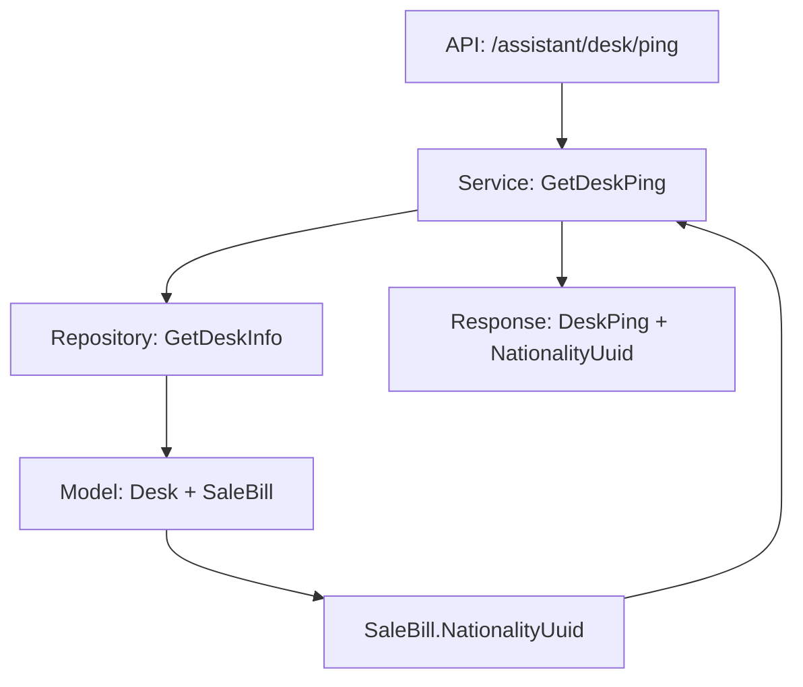

# 在 /assistant/desk/ping 接口中返回已选国旗ID 设计文档

> 本文档定义「在 /assistant/desk/ping 接口中返回已选国旗ID」功能的技术设计和实现方案。

## 📋 概述

在 `/assistant/desk/ping` 接口的响应结构 `DeskPing` 中添加 `nationality_uuid` 字段，从现有的 `SaleBill.NationalityUuid` 字段中读取并返回。该功能为简单的字段扩展，无需数据库变更，只需修改响应结构和 Service 层逻辑。

---

## 🎯 规范对齐

### Go Main 规范 (go-main.mdc)

- ✅ Service 只依赖其他 Service 接口（已符合）
- ✅ Repository 只持有 db 实例（已符合）
- ✅ URL 使用 snake_case（已符合：`/assistant/desk/ping`）
- ✅ data 字段必须是对象（已符合）
- ✅ 不使用 panic，返回 error（已符合）

### API 设计规范 (api.mdc)

- ✅ URL 使用 snake_case（已符合）
- ✅ 响应格式统一（已符合）
- ✅ data 不能为 null 或数组（已符合）

### 数据库规范 (database.mdc)

- ✅ 无需数据库变更，使用现有 `SaleBill.NationalityUuid` 字段

---

## 🔄 代码复用分析

### 可复用的现有组件

- **DeskPing 响应结构**: `main/app/dto/resp/desk.go` - 现有响应结构，只需添加字段
- **GetDeskPing Service**: `main/app/service/desk.go` - 现有 Service 方法，只需添加赋值逻辑
- **SaleBill 模型**: `main/app/model/sale_bill.go` - 已包含 `NationalityUuid` 字段
- **Desk Repository**: `main/app/repository/desk_repo.go` - 已支持获取 `SaleBill` 关联数据

### 集成点

- **现有 API**: `/assistant/desk/ping` - 扩展响应字段
- **现有数据**: `SaleBill.NationalityUuid` - 从已有字段读取
- **相关接口**: `/assistant/desk/set_nationality` - 设置国籍的接口（已存在）

---

## 🏗️ 架构设计

### 分层设计原则

**Go Main 三层架构**:

```
API 层 (Controller/API)
  ↓ 依赖
业务层 (Service)
  ↓ 依赖
数据层 (Repository)
```

**本次修改范围**:

- ✅ API 层：无需修改（响应结构自动序列化）
- ✅ Service 层：在 `GetDeskPing` 方法中添加赋值逻辑
- ✅ Repository 层：无需修改（已支持获取 `SaleBill` 关联数据）

### 架构图



---

## 🗄️ 数据库设计

### 无需数据库变更

- ✅ 使用现有 `ttpos_sale_bill` 表的 `nationality_uuid` 字段
- ✅ 字段定义：`nationality_uuid` bigint(20) DEFAULT 0 COMMENT '国籍UUID（0=未记录）'
- ✅ 已在 `story-order-source-nationality` Spec 中实现

---

## 📊 数据模型

### Go Model（无需修改）

```go
// main/app/model/sale_bill.go
type SaleBill struct {
    // ... 现有字段 ...
    NationalityUuid uint64 `gorm:"column:nationality_uuid;type:bigint(20);default:0;comment:国籍UUID（0=未记录）" json:"nationality_uuid"`
    // ... 其他字段 ...
}
```

### DTO 定义

#### Response DTO（需要修改）

```go
// main/app/dto/resp/desk.go
type DeskPing struct {
    UnsentKitchenInfo   UnsentKitchenInfo      `json:"unsent_kitchen_info"`
    DeskInfo            Desk                   `json:"desk_info"`
    SentKitchen         SentKitchen            `json:"sent_kitchen"`
    UnsentKitchen       UnsentKitchen          `json:"unsent_kitchen"`
    SentKitchenProducts SentKitchenProductList `json:"sent_kitchen_products"`
    Buffet              BuffetInfo             `json:"buffet"`
    MustPlans           ProductMustPlanList    `json:"must_plans"`
    SaleOrderList       []SaleOrder            `json:"sale_order_list"`
    UpdateTime          int64                  `json:"update_time"`
    Product             *product_resp.Product  `json:"product,omitempty"`
    OrderRemark         *OrderRemarkRes        `json:"order_remark,omitempty"`
    NationalityUuid     uint64                 `json:"nationality_uuid"` // 新增：国籍UUID（0=未设置）
}
```

---

## 🔌 API 设计

### RESTful API

#### API: 获取桌台详情（轮询）- 扩展响应字段

**请求**:

- **URL**: `/api/v1/assistant/desk/ping`
- **Method**: `GET`
- **Headers**:
  ```json
  {
    "Authorization": "Bearer {token}",
    "Content-Type": "application/json"
  }
  ```
- **Query Params**:
  ```json
  {
    "uuid": 1234567890
  }
  ```

**响应**（扩展后）:

```json
{
  "code": 1,
  "message": "success",
  "data": {
    "desk_info": {
      "uuid": 1234567890,
      "desk_no": "A01",
      "status": 1
    },
    "sent_kitchen": {},
    "unsent_kitchen": {},
    "sale_order_list": [],
    "update_time": 1704067200,
    "nationality_uuid": 4567890123
  }
}
```

**响应字段说明**:

- `nationality_uuid` (uint64): 国籍UUID
  - `0`: 表示未设置国籍（桌台未开台或订单未设置国籍）
  - `> 0`: 表示已设置的国籍UUID

**错误响应**:

```json
{
  "code": 0,
  "message": "错误信息",
  "data": {}
}
```

---

## 🧩 组件和接口

### Service 层

#### Service 实现（需要修改）

```go
// main/app/service/desk.go
func (s *deskSrv) GetDeskPing(ctx context.Context, deskUuid uint64, shopCart *resp.ShopCart) (resp.DeskPing, error) {
    res := resp.DeskPing{
        // ... 现有字段初始化 ...
        NationalityUuid: 0, // 默认值：未设置
    }
    
    // 获取桌台详情
    desk, err := repository.NewDeskRepo(ctx.GetDB()).GetDeskInfo(deskUuid)
    if err != nil {
        return res, errors.WithMessage(errors.New("桌台不存在"), "获取桌台详情失败")
    }
    res.DeskInfo = desk.GetDeskResp()

    // 如果没有销售账单,直接返回（nationality_uuid 为 0）
    if desk.SaleBill == nil {
        return res, nil
    }
    
    // 设置国籍UUID
    res.NationalityUuid = desk.SaleBill.NationalityUuid
    
    // ... 现有逻辑继续 ...
    
    return res, nil
}
```

### API 层（无需修改）

```go
// main/app/api/v1/assistant/assistant_desk.go
// GetDeskPing 方法无需修改，响应结构自动序列化
func (h *DeskHandler) GetDeskPing(c *gin.Context) {
    // ... 现有逻辑 ...
    res, err := h.deskSrv.GetDeskPing(helper.GetContext(c), deskInfoReq.Uuid, nil)
    // ... 返回响应 ...
    helper.Success(c, res)
}
```

---

## ⚡ 缓存设计

### 无需缓存变更

- ✅ 响应数据实时从数据库读取，无需缓存
- ✅ 不影响现有缓存逻辑

---

## 🚨 错误处理

### 错误场景

#### 场景 1: 桌台不存在

- **处理方式**: 返回错误，`nationality_uuid` 不返回
- **用户影响**: 前端收到错误响应
- **代码示例**:
  ```go
  if err != nil {
      return res, errors.WithMessage(errors.New("桌台不存在"), "获取桌台详情失败")
  }
  ```

#### 场景 2: SaleBill 为 nil（未开台）

- **处理方式**: 正常返回，`nationality_uuid` 为 `0`
- **用户影响**: 前端收到正常响应，`nationality_uuid` 为 `0`
- **代码示例**:
  ```go
  if desk.SaleBill == nil {
      return res, nil // nationality_uuid 默认为 0
  }
  ```

#### 场景 3: NationalityUuid 为 0（未设置国籍）

- **处理方式**: 正常返回，`nationality_uuid` 为 `0`
- **用户影响**: 前端收到正常响应，`nationality_uuid` 为 `0`，表示未设置国籍
- **代码示例**:
  ```go
  res.NationalityUuid = desk.SaleBill.NationalityUuid // 可能为 0
  ```

---

## 🔒 安全设计

### 身份验证

- ✅ **JWT Token**: 所有 API 需要 Token 验证（已符合）

### 权限控制

- ✅ **API 权限**: 助手端接口已有权限控制（已符合）

### 数据安全

- ✅ **无敏感数据**: 仅返回 UUID，不涉及敏感信息
- ✅ **SQL 注入防护**: 使用参数化查询（已符合）

---

## 🧪 测试策略

### 单元测试

**目标覆盖率**:

- Service 层：≥ 70%

**测试内容**:

- Service 业务逻辑：测试 `GetDeskPing` 方法中 `nationality_uuid` 的赋值逻辑
- 边界条件：测试 `SaleBill` 为 `nil` 的情况
- 数据正确性：测试 `NationalityUuid` 为 `0` 和 `> 0` 的情况

**示例**:

```go
// main/app/service/desk_test.go
func TestDeskSrv_GetDeskPing_NationalityUuid(t *testing.T) {
    // 测试场景 1: 未开台（SaleBill 为 nil）
    // 期望: nationality_uuid 为 0
    
    // 测试场景 2: 已开台但未设置国籍（NationalityUuid 为 0）
    // 期望: nationality_uuid 为 0
    
    // 测试场景 3: 已设置国籍（NationalityUuid > 0）
    // 期望: nationality_uuid 为对应值
}
```

### API 测试

**测试内容**:

- API 接口调用
- 响应格式验证
- 字段值验证

**测试用例**:

1. **未开台场景**: 调用接口，验证 `nationality_uuid` 为 `0`
2. **已开台但未设置国籍**: 调用接口，验证 `nationality_uuid` 为 `0`
3. **已设置国籍**: 调用接口，验证 `nationality_uuid` 为对应 UUID
4. **设置国籍后轮询**: 先设置国籍，再轮询，验证返回更新后的 UUID

---

## 📈 性能优化

### 优化策略

1. **无需额外查询**: 从已有的 `desk.SaleBill` 中读取，无性能影响
2. **无缓存需求**: 响应数据实时，无需缓存

### 性能指标

- ✅ 本地响应时间: < 200ms（无额外查询，性能影响可忽略）
- ✅ 数据库查询: 无额外查询

---

## 📚 实现清单

### Phase 1: 响应结构扩展

- [ ] 修改 `resp.DeskPing` 结构体，添加 `NationalityUuid` 字段

### Phase 2: Service 层实现

- [ ] 修改 `service.GetDeskPing` 方法，添加赋值逻辑
- [ ] 添加空值检查，确保 `desk.SaleBill` 不为 `nil` 时再读取

### Phase 3: 文档更新

- [ ] 更新 Swagger 文档，说明新增字段含义

### Phase 4: 测试

- [ ] 编写单元测试
- [ ] 编写 API 测试
- [ ] 手动测试验证

**详细任务**: 参见 `tasks.md`

---

## Graphiti & 活动日志

- Related Episode: `[待补充]`
- 模板：`docs/agent/templates/graphiti-episode.md`
- 活动日志：`docs/team/activities/{YYYY-MM}/{YYYY-MM-DD}.md`
- 在技术方案评审、关键架构决策或踩坑总结后，立即补充 Episode 并在设计文档尾部互链。

---

**版本**: v1.0.0  
**创建日期**: 2025-11-25  
**作者**: TTPOS Team  
**审核者**: {审核者}

