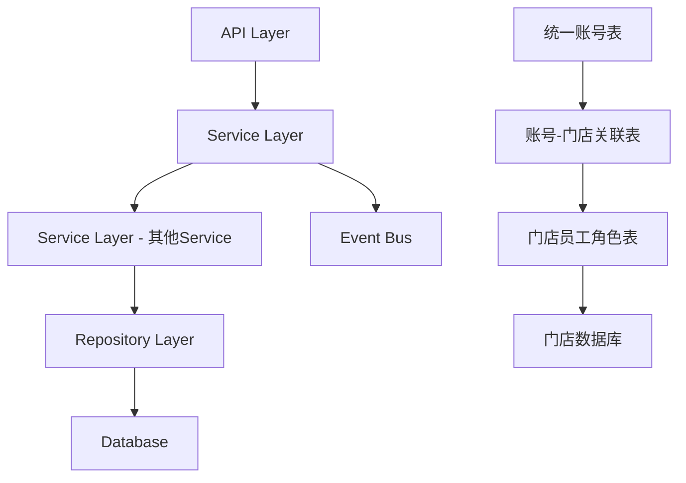

# 全平台统一账号 设计文档

> 本文档定义全平台统一账号功能的技术设计和实现方案。

## 📋 概述

实现全平台统一账号体系，通过手机号和邮箱作为唯一标识（两者都全平台唯一），支持员工跨门店复用账号。在云平台、新管理端、收银端、点餐助手、平板端、厨显端等所有终端实现统一的账号管理和门店切换功能。

**核心设计原则**：
- 邮箱和手机号都全平台唯一
- 账号在门店的角色在门店数据库中管理
- 支持一个账号关联多个门店
- 登录时根据权限自动选择或手动切换门店

---

## 🎯 规范对齐

### Go Main 规范 (go-main.mdc)

- Service 只依赖其他 Service 接口
- Repository 只持有 db 实例
- URL 使用 snake_case
- data 字段必须是对象
- 不使用 panic，返回 error
- 接口以 `I` 开头，实现以 `Impl` 结尾

### PHP 规范 (php.mdc)

- 遵循 MVC 分层
- Controller 不写业务逻辑
- 使用验证器验证参数
- 使用软删除

### API 设计规范 (api.mdc)

- URL 使用 snake_case
- 响应格式统一：`{code, message, data{}}`
- data 不能为 null 或数组
- 分页信息统一放在 meta 中

### 数据库规范 (database.mdc)

- 必需字段完整：`id`, `uuid`, `create_time`, `update_time`, `delete_time`
- 时间字段使用 int 类型，\_time 结尾，默认值 0
- 金额字段使用 decimal(20,8)
- UUID 字段使用 bigint unsigned
- 表名使用 ttpos\_ 前缀
- 字段名使用 snake_case

---

## 🔄 代码复用分析

### 可复用的现有组件

- **Auth Service**: `main/app/service/auth.go` - 登录认证逻辑，需要扩展支持多门店
- **Staff Model**: `main/app/model/staff.go` - 员工数据模型，需要扩展邮箱字段和唯一性约束
- **Company Model**: `main/app/model/company.go` - 门店数据模型
- **Role Model**: `main/app/model/role.go` - 角色数据模型
- **StaffRole Model**: `main/app/model/staff.go` - 员工角色关联表

### 集成点

- **现有登录流程**: `main/app/service/auth.go::Login()` - 需要扩展支持门店选择
- **现有员工管理**: `main/app/api/v1/shop/shop_staff.go` - 需要扩展支持账号导入和门店关联
- **现有权限系统**: `main/app/service/role_access.go` - 需要适配多门店权限模型

---

## 🏗️ 架构设计

### 分层设计原则

**Go Main 三层架构**:

```
API 层 (Controller/API)
  ↓ 依赖
业务层 (Service)
  ↓ 依赖
数据层 (Repository)
```

**依赖规则**:

- ✅ 上层可依赖下层
- ❌ 禁止下层依赖上层
- ❌ 禁止跨层调用
- ❌ Service 不能依赖 Repository
- ✅ Service 可以依赖其他 Service 接口

### 架构图



### 模块划分

#### Go Main 模块

- **API 层**: `main/app/api/` - 路由处理、参数校验
- **Service 层**: `main/app/service/` - 业务逻辑、事务管理
- **Repository 层**: `main/app/repository/` - 数据访问、数据库操作
- **Model 层**: `main/app/model/` - 数据模型
- **DTO 层**: `main/app/dto/` - 数据传输对象
  - `req/` - 请求参数
  - `resp/` - 响应数据

#### PHP Admin 模块

- **Controller 层**: `admin/app/admin/controller/` - 云平台控制器
  - `admin/app/admin/controller/admin/Staff.php` - 统一账号管理（列表、创建、编辑、启用禁用）
- **Service 层**: `admin/app/admin/service/` - 业务逻辑（可选，如业务复杂可添加）
- **Model 层**: `admin/app/admin/model/` - 数据模型
  - `admin/app/admin/model/admin/Staff.php` - 统一账号模型（操作 saas.ttpos_staff 表）
- **Validate 层**: `admin/app/admin/validate/` - 参数验证
  - `admin/app/admin/validate/StaffValidate.php` - 统一账号参数验证

#### Vue 前端模块

- **Pages**: `admin/views/admin/pages/` - 云平台页面
- **Components**: `admin/views/admin/components/` - 组件
- **API**: `admin/views/admin/api/` - API 封装
- **Store**: `admin/views/admin/store/` - 状态管理

---

## 🗄️ 数据库设计

### 数据表设计

#### 表 1: 统一账号表 (ttpos_staff) - saas 数据库

**说明**: 在 saas 数据库中创建 `ttpos_staff` 表，作为全平台统一账号表。

```sql
CREATE TABLE `ttpos_staff` (
  `id` int unsigned NOT NULL AUTO_INCREMENT COMMENT '自增ID',
  `uuid` bigint unsigned NOT NULL DEFAULT '0' COMMENT '员工ID',
  `email` varchar(255) COLLATE utf8mb4_unicode_ci NOT NULL DEFAULT '' COMMENT '邮箱（全平台唯一）',
  `phone` varchar(20) COLLATE utf8mb4_unicode_ci DEFAULT '' COMMENT '手机号（全平台唯一，允许空字符串）',
  `real_name` varchar(255) COLLATE utf8mb4_unicode_ci NOT NULL DEFAULT '' COMMENT '姓名',
  `password` varchar(255) COLLATE utf8mb4_unicode_ci NOT NULL DEFAULT '' COMMENT '登录密码（加密）', 
  `password_change_count` int DEFAULT '0' COMMENT '修改密码次数',
  `password_change_time` int unsigned NOT NULL DEFAULT '0' COMMENT '修改密码时间', 
  `is_disable` int NOT NULL DEFAULT '0' COMMENT '是否禁用1禁用,0未禁用',
  `last_company_uuid` bigint unsigned NOT NULL DEFAULT '0' COMMENT '上次登录新管理端的商家UUID',
  `create_time` int unsigned NOT NULL DEFAULT '0' COMMENT '创建时间(时间戳)',
  `update_time` int unsigned NOT NULL DEFAULT '0' COMMENT '更新时间(时间戳)',
  `delete_time` int unsigned NOT NULL DEFAULT '0' COMMENT '删除时间(时间戳)',
  PRIMARY KEY (`id`),
  UNIQUE KEY `unique_uuid` (`uuid`),
  UNIQUE KEY `uk_email` (`email`),
  KEY `idx_phone` (`phone`),
  KEY `idx_last_company_uuid` (`last_company_uuid`),
  KEY `idx_delete_time` (`delete_time`)
) ENGINE=InnoDB DEFAULT CHARSET=utf8mb4 COLLATE=utf8mb4_unicode_ci COMMENT='员工表（统一账号表）';
```

**字段说明**:
| 字段 | 类型 | 说明 | 约束 |
|------|------|------|------|
| id | int unsigned | 自增ID | AUTO_INCREMENT |
| uuid | bigint unsigned | 员工ID | DEFAULT 0, UNIQUE |
| email | varchar(255) | 邮箱 | NOT NULL, UNIQUE（全平台唯一） |
| phone | varchar(20) | 手机号 | DEFAULT ''（全平台唯一，允许空字符串，应用层验证） |
| real_name | varchar(255) | 姓名 | NOT NULL, DEFAULT ''（从商家数据库 ttpos_staff 表迁移） |
| password | varchar(255) | 登录密码 | NOT NULL（加密存储） |
| password_change_count | int | 修改密码次数 | DEFAULT 0 |
| password_change_time | int unsigned | 修改密码时间 | DEFAULT 0 |
| is_disable | int | 是否禁用 | DEFAULT 0（1-禁用，0-未禁用） |
| last_company_uuid | bigint unsigned | 上次登录新管理端的商家UUID | DEFAULT 0（初始数据来源于 ttpos_company_staff.company_uuid） |
| create_time | int unsigned | 创建时间 | DEFAULT 0 |
| update_time | int unsigned | 更新时间 | DEFAULT 0 |
| delete_time | int unsigned | 删除时间 | DEFAULT 0 |

**索引设计**:

- 主键索引: `PRIMARY KEY (id)`
- 唯一索引: `UNIQUE KEY unique_uuid (uuid)`
- 唯一索引: `UNIQUE KEY uk_email (email)` - 全平台唯一
- **注意**: 手机号不建立唯一索引，因为允许空字符串。唯一性验证在应用层处理（排除空字符串）
- 普通索引: `KEY idx_phone (phone)` - 用于查询优化
- 普通索引: `KEY idx_last_company_uuid (last_company_uuid)` - 用于查询员工上次登录的商家
- 普通索引: `KEY idx_delete_time (delete_time)`

**重要说明**:
- **手机号唯一性处理**: 由于现有数据手机号可能为空字符串，不能直接建立唯一索引。唯一性验证在应用层处理：
  - 查询时排除 `phone = ''` 的记录
  - 只有非空手机号才需要验证唯一性
- **邮箱唯一性**: 邮箱必须唯一，使用数据库唯一索引保证
- **上次登录商家UUID (`last_company_uuid`)**: 
  - 初始数据来源于 `saas.ttpos_company_staff` 中的 `company_uuid`（取该员工关联的第一个门店）
  - 在新管理端每次切换商家时，需要更新该字段为选择的商家UUID
  - 用于记录员工上次登录新管理端时选择的商家，方便下次登录时默认选择

**迁移文件**: `admin/database/migrations/{YYYYMMDDHHMMSS}_create_ttpos_staff_table_in_saas.php`

#### 表 2: 账号-门店关联表 (ttpos_company_staff) - saas 数据库

**说明**: 使用现有的 `ttpos_company_staff` 表作为账号-门店关联表，表结构暂不需要调整。

**现有表结构**:
```sql
-- ttpos_company_staff 表已存在，结构如下：
CREATE TABLE `ttpos_company_staff` (
  `id` int unsigned NOT NULL AUTO_INCREMENT COMMENT '自增ID',
  `uuid` bigint unsigned NOT NULL DEFAULT '0' COMMENT '员工ID',
  `company_uuid` bigint unsigned NOT NULL DEFAULT '0' COMMENT '集团ID',
  `username` varchar(255) NOT NULL DEFAULT '' COMMENT '员工账号',
  `phone` varchar(255) NOT NULL DEFAULT '' COMMENT '员工手机号',
  `is_super` int NOT NULL DEFAULT '0' COMMENT '是否超级管理员',
  `create_time` int unsigned NOT NULL DEFAULT '0' COMMENT '创建时间（时间戳）',
  `update_time` int unsigned NOT NULL DEFAULT '0' COMMENT '更新时间（时间戳）',
  `delete_time` int unsigned NOT NULL DEFAULT '0' COMMENT '删除时间（时间戳）',
  PRIMARY KEY (`id`),
  KEY `idx_uuid` (`uuid`),
  KEY `idx_company_uuid` (`company_uuid`),
  KEY `idx_delete_time` (`delete_time`),
  KEY `idx_username` (`username`)
) ENGINE=InnoDB DEFAULT CHARSET=utf8mb4 COMMENT='集团员工关联表';
```

**字段说明**:
| 字段 | 类型 | 说明 | 约束 |
|------|------|------|------|
| id | int unsigned | 自增ID | AUTO_INCREMENT |
| uuid | bigint unsigned | 员工ID（关联 ttpos_staff.uuid） | DEFAULT 0 |
| company_uuid | bigint unsigned | 集团ID（门店UUID） | NOT NULL |
| username | varchar(255) | 员工账号 | NOT NULL |
| phone | varchar(255) | 员工手机号 | NOT NULL |
| is_super | int | 是否超级管理员 | DEFAULT 0 |
| create_time | int unsigned | 创建时间 | DEFAULT 0 |
| update_time | int unsigned | 更新时间 | DEFAULT 0 |
| delete_time | int unsigned | 删除时间 | DEFAULT 0 |

**索引设计**:

- 主键索引: `PRIMARY KEY (id)`
- 普通索引: `KEY idx_uuid (uuid)` - 用于查询员工关联的门店（允许一个员工关联多个门店）
- 普通索引: `KEY idx_company_uuid (company_uuid)` - 用于查询门店下的员工
- 普通索引: `KEY idx_delete_time (delete_time)`

**使用说明**:
- `uuid` 字段关联到 `ttpos_staff.uuid`（统一账号UUID）
- `company_uuid` 字段关联到 `ttpos_company.uuid`（门店UUID）
- 一个账号可以关联多个门店（一个 `ttpos_staff.uuid` 可以有多条 `ttpos_company_staff` 记录）
- 账号在门店的角色仍然在门店数据库的 `ttpos_staff_role` 表中管理

**注意**: 账号在门店的角色仍然在 `ttpos_staff_role` 表中管理（门店数据库中），不需要修改。

### 数据库迁移

#### 1. 创建表结构迁移

**迁移脚本**:

```bash
# 创建迁移文件（仅在 saas 数据库中创建 ttpos_staff 表）
cd admin
php think migrate:create CreateTtposStaffTableInSaas

# 执行迁移
php think migrate:run
```

#### 2. 数据迁移方案

**目标**: 将现有用户数据迁移到 `saas.ttpos_staff` 表

**数据来源**:

1. **saas 数据库的 `ttpos_company_staff` 表**（主要来源）:
   - `id` → `saas.ttpos_staff.id`
   - `uuid` → `saas.ttpos_staff.uuid`
   - `username` → `saas.ttpos_staff.email`（**重要：email 来自 username**）
   - `phone` → `saas.ttpos_staff.phone`
   - `create_time` → `saas.ttpos_staff.create_time`
   - `update_time` → `saas.ttpos_staff.update_time`
   - `delete_time` → `saas.ttpos_staff.delete_time`

2. **门店数据库的 `ttpos_staff` 表**（补充信息）:
   - `real_name` → `saas.ttpos_staff.real_name`
   - `password` → `saas.ttpos_staff.password`
   - `password_change_count` → `saas.ttpos_staff.password_change_count`
   - `password_change_time` → `saas.ttpos_staff.password_change_time`
   - `is_disable` → `saas.ttpos_staff.is_disable`

3. **初始 last_company_uuid**:
   - 从 `saas.ttpos_company_staff` 中获取该员工关联的第一个门店的 `company_uuid`
   - 如果员工关联多个门店，取 `create_time` 最早的那条记录的 `company_uuid`

**迁移逻辑**:

```sql
-- 数据迁移 SQL（伪代码，实际需要在 PHP 迁移脚本中实现）
-- 步骤 1: 从 saas.ttpos_company_staff 获取基础信息
-- 步骤 2: 关联门店数据库的 ttpos_staff 表获取密码等信息
-- 步骤 3: 处理重复数据（同一个 uuid 可能在多个门店有记录，只取一条）
-- 步骤 4: 插入到 saas.ttpos_staff 表

INSERT INTO saas.ttpos_staff (
    id, uuid, email, phone, real_name, password, password_change_count, 
    password_change_time, is_disable, last_company_uuid, create_time, update_time, delete_time
)
SELECT DISTINCT
    cs.id,
    cs.uuid,
    cs.username AS email,  -- 重要：email 来自 username
    cs.phone,
    -- 从门店数据库的 ttpos_staff 表获取真实姓名、密码等信息
    -- 注意：需要通过 uuid 关联，可能需要遍历所有门店数据库
    COALESCE(shop_staff.real_name, '') AS real_name,
    COALESCE(shop_staff.password, '') AS password,
    COALESCE(shop_staff.password_change_count, 0) AS password_change_count,
    COALESCE(shop_staff.password_change_time, 0) AS password_change_time,
    COALESCE(shop_staff.is_disable, 0) AS is_disable,
    -- 重要：last_company_uuid 初始数据来源于 ttpos_company_staff 中的 company_uuid
    -- 取该员工关联的第一个门店（按 create_time 排序）
    MIN(cs.company_uuid) AS last_company_uuid,
    cs.create_time,
    cs.update_time,
    cs.delete_time
FROM saas.ttpos_company_staff cs
LEFT JOIN (
    -- 从所有门店数据库中查找对应的员工信息
    -- 注意：这里需要遍历所有门店数据库
    SELECT uuid, real_name, password, password_change_count, password_change_time, is_disable
    FROM shop_db_1.ttpos_staff
    WHERE delete_time = 0
    UNION ALL
    SELECT uuid, real_name, password, password_change_count, password_change_time, is_disable
    FROM shop_db_2.ttpos_staff
    WHERE delete_time = 0
    -- ... 其他门店数据库
) shop_staff ON cs.uuid = shop_staff.uuid
WHERE cs.delete_time = 0
GROUP BY cs.uuid  -- 处理重复数据，同一个 uuid 只取一条
ON DUPLICATE KEY UPDATE
    email = VALUES(email),
    phone = VALUES(phone),
    real_name = VALUES(real_name),
    password = VALUES(password),
    password_change_count = VALUES(password_change_count),
    password_change_time = VALUES(password_change_time),
    is_disable = VALUES(is_disable),
    last_company_uuid = VALUES(last_company_uuid),
    update_time = VALUES(update_time);
```

**迁移脚本实现要点**:

1. **遍历所有门店数据库**: 需要动态获取所有门店数据库连接，从每个门店数据库的 `ttpos_staff` 表中查找对应的员工信息

2. **处理重复数据**: 
   - 同一个 `uuid` 可能在 `ttpos_company_staff` 表中有多条记录（关联多个门店）
   - 迁移时只取一条记录，使用 `GROUP BY uuid` 或 `DISTINCT`

3. **数据关联**:
   - 通过 `uuid` 字段关联 `ttpos_company_staff` 和门店数据库的 `ttpos_staff`
   - 如果某个员工在多个门店数据库中都有记录，优先取第一个找到的记录

4. **字段映射**:
   - `ttpos_company_staff.username` → `ttpos_staff.email`（**重要**）
   - `门店数据库.ttpos_staff.real_name` → `saas.ttpos_staff.real_name`（从商家数据库迁移）
   - 其他字段按上述映射关系

5. **错误处理**:
   - 处理邮箱重复的情况（如果 username 重复）
   - 处理手机号空字符串的情况
   - 处理密码为空的情况（设置默认值）

**迁移文件**: `admin/database/migrations/{YYYYMMDDHHMMSS}_migrate_existing_users_to_saas_staff.php`

**迁移脚本实现示例**:

```php
<?php
// admin/database/migrations/{YYYYMMDDHHMMSS}_migrate_existing_users_to_saas_staff.php

use think\facade\Db;

class MigrateExistingUsersToSaasStaff
{
    public function up()
    {
        // 获取 saas 数据库连接
        $saasDb = Db::connect('saas');
        
        // 获取所有门店数据库连接配置
        $shopDbs = $this->getAllShopDatabases();
        
        // 从 saas.ttpos_company_staff 获取所有员工记录
        $companyStaffs = $saasDb->table('ttpos_company_staff')
            ->where('delete_time', 0)
            ->group('uuid')  // 处理重复数据
            ->select();
        
        foreach ($companyStaffs as $cs) {
            // 从门店数据库中查找对应的员工信息
            $shopStaff = $this->findShopStaffByUuid($cs['uuid'], $shopDbs);
            
            // 准备插入数据
            // 获取该员工关联的第一个门店的 company_uuid（作为初始 last_company_uuid）
            $firstCompany = $saasDb->table('ttpos_company_staff')
                ->where('uuid', $cs['uuid'])
                ->where('delete_time', 0)
                ->order('create_time', 'asc')
                ->find();
            
            $staffData = [
                'id' => $cs['id'],
                'uuid' => $cs['uuid'],
                'email' => $cs['username'],  // 重要：email 来自 username
                'phone' => $cs['phone'] ?? '',
                'password' => $shopStaff['password'] ?? '',
                'password_change_count' => $shopStaff['password_change_count'] ?? 0,
                'password_change_time' => $shopStaff['password_change_time'] ?? 0,
                'is_disable' => $shopStaff['is_disable'] ?? 0,
                'last_company_uuid' => $firstCompany['company_uuid'] ?? 0,  // 初始数据来源于第一个门店
                'create_time' => $cs['create_time'],
                'update_time' => $cs['update_time'],
                'delete_time' => $cs['delete_time'],
            ];
            
            // 检查邮箱是否已存在（处理重复）
            $exists = $saasDb->table('ttpos_staff')
                ->where('email', $staffData['email'])
                ->where('uuid', '<>', $staffData['uuid'])
                ->find();
            
            if ($exists) {
                // 邮箱重复，记录日志或跳过
                \think\facade\Log::warning("邮箱重复: {$staffData['email']}, UUID: {$staffData['uuid']}");
                continue;
            }
            
            // 插入或更新数据
            $saasDb->table('ttpos_staff')
                ->insert($staffData, true);  // true 表示 ON DUPLICATE KEY UPDATE
        }
    }
    
    /**
     * 从所有门店数据库中查找员工信息
     */
    private function findShopStaffByUuid($uuid, $shopDbs)
    {
        foreach ($shopDbs as $shopDbConfig) {
            try {
                $shopDb = Db::connect($shopDbConfig);
                $staff = $shopDb->table('ttpos_staff')
                    ->where('uuid', $uuid)
                    ->where('delete_time', 0)
                    ->find();
                
                if ($staff) {
                    return $staff;
                }
            } catch (\Exception $e) {
                // 门店数据库连接失败，继续查找下一个
                continue;
            }
        }
        
        return null;
    }
    
    /**
     * 获取所有门店数据库配置
     */
    private function getAllShopDatabases()
    {
        // 从配置或数据库中获取所有门店数据库连接配置
        // 这里需要根据实际项目情况实现
        return [];
    }
    
    public function down()
    {
        // 回滚操作：清空 saas.ttpos_staff 表
        Db::connect('saas')->table('ttpos_staff')->delete(true);
    }
}
```

**参考**: `docs/agent/workflows/database-migration.md`

**数据库说明**:
- **saas 数据库**: 存储统一账号表 `ttpos_staff` 和账号-门店关联表 `ttpos_company_staff`
- **门店数据库**: 存储员工在门店的角色信息 `ttpos_staff_role`（不需要修改），以及员工密码等信息（迁移后不再使用）

---

## 📊 数据模型

### Go Model

#### SaasStaff Model（saas 数据库的统一账号表）

```go
// main/app/model/saas_staff.go
package model

// SaasStaff saas库保存的统一账号表 ttpos_staff
type SaasStaff struct {
    BaseModel
    Email               string `gorm:"column:email;type:varchar(255);uniqueIndex;comment:邮箱（全平台唯一）;NOT NULL" json:"email"`
    Phone               string `gorm:"column:phone;type:varchar(20);index;comment:手机号（全平台唯一，允许空字符串）" json:"phone"`
    RealName            string `gorm:"column:real_name;type:varchar(255);comment:姓名;NOT NULL" json:"real_name"`
    Password            string `gorm:"column:password;type:varchar(255);comment:登录密码（加密）;NOT NULL" json:"-"`
    PasswordChangeCount int    `gorm:"column:password_change_count;type:int;default:0;comment:修改密码次数" json:"password_change_count"`
    PasswordChangeTime  int64  `gorm:"column:password_change_time;type:int unsigned;default:0;comment:修改密码时间;NOT NULL" json:"password_change_time"`
    IsDisable           int    `gorm:"column:is_disable;type:int;default:0;comment:是否禁用1禁用,0未禁用;NOT NULL" json:"is_disable"`
    LastCompanyUuid uint64 `gorm:"column:last_company_uuid;type:bigint unsigned;index;default:0;comment:上次登录新管理端的商家UUID;NOT NULL" json:"last_company_uuid"`
}

func (*SaasStaff) TableName() string {
    return "ttpos_staff"
}

// 注意：此表在 saas 数据库中，需要使用 saas 数据库连接
```

**重要说明**:
- 手机号字段不设置 `uniqueIndex`，因为允许空字符串
- 手机号唯一性验证在应用层处理（排除空字符串）
- 邮箱字段设置 `uniqueIndex`，数据库保证唯一性

#### CompanyStaff Model（saas 数据库的账号-门店关联表）

**说明**: 使用现有的 `CompanyStaff` 模型，位于 `main/app/model/company.go`。

```go
// main/app/model/company.go (已存在)
// CompanyStaff saas库保存的集团员工关联表 ttpos_company_staff
type CompanyStaff struct {
    BaseModel
    CompanyUuid uint64 `gorm:"column:company_uuid;type:bigint(20) unsigned;default:0;comment:集团ID;NOT NULL" json:"company_uuid"`
    Username    string `gorm:"column:username;type:varchar(255);comment:员工账号;NOT NULL" json:"username"`
    Phone       string `gorm:"column:phone;type:varchar(255);comment:员工手机号;NOT NULL" json:"phone"`
    IsSuper     int    `gorm:"column:is_super;type:int(11);default:0;comment:是否超级管理员" json:"is_super"`
    
    Company *Company `gorm:"foreignKey:CompanyUuid;references:Uuid"`
    // 关联到 SaasStaff
    Staff   *SaasStaff `gorm:"foreignKey:Uuid;references:Uuid"`
}
```

**使用说明**:
- `CompanyStaff.Uuid` 关联到 `SaasStaff.Uuid`（统一账号UUID）
- `CompanyStaff.CompanyUuid` 关联到 `Company.Uuid`（门店UUID）
- 一个账号可以关联多个门店（一个 `SaasStaff.Uuid` 可以有多条 `CompanyStaff` 记录）

### DTO 定义

#### Request DTO

```go
// main/app/dto/req/saas_staff_req.go
package req

type SaasStaffCreateReq struct {
    Email      string `json:"email" binding:"required,email,max=255"`
    Phone      string `json:"phone" binding:"omitempty,max=20"`
    RealName   string `json:"real_name" binding:"omitempty,max=255"`
    Password   string `json:"password" binding:"required,min=6"`
    CompanyUuid uint64 `json:"company_uuid" binding:"required"`
    RoleUuids  []uint64 `json:"role_uuids"`
}

type SaasStaffUpdateReq struct {
    Uuid      uint64 `json:"uuid" binding:"required"`
    Email     string `json:"email" binding:"omitempty,email,max=255"`
    Phone     string `json:"phone" binding:"omitempty,max=20"`
    RealName  string `json:"real_name" binding:"omitempty,max=255"`
    Password  string `json:"password" binding:"omitempty,min=6"`
}

type SaasStaffListReq struct {
    PageNo   int    `json:"page_no" binding:"required"`
    PageSize int    `json:"page_size" binding:"required"`
    Email    string `json:"email"`
    Phone    string `json:"phone"`
}

type CompanyStaffBindReq struct {
    StaffUuid  uint64   `json:"staff_uuid" binding:"required"`
    CompanyUuid uint64   `json:"company_uuid" binding:"required"`
    Username   string   `json:"username" binding:"required"`
    RoleUuids  []uint64 `json:"role_uuids"`
}

type StoreSwitchReq struct {
    CompanyUuid uint64 `json:"company_uuid" binding:"required"`
}
```

#### Response DTO

```go
// main/app/dto/resp/saas_staff_resp.go
package resp

type SaasStaffResp struct {
    Uuid                uint64 `json:"uuid"`
    Email               string `json:"email"`
    Phone               string `json:"phone"`
    RealName            string `json:"real_name"`
    LastCompanyUuid uint64 `json:"last_company_uuid"`
    CreateTime          int64  `json:"create_time"`
    UpdateTime          int64  `json:"update_time"`
}

type SaasStaffListResp struct {
    List []*SaasStaffResp `json:"list"`
    Meta *PageMeta        `json:"meta"`
}

type CompanyStaffResp struct {
    Uuid        uint64 `json:"uuid"`
    StaffUuid   uint64 `json:"staff_uuid"`
    CompanyUuid uint64 `json:"company_uuid"`
    CompanyName string `json:"company_name"`
    Username    string `json:"username"`
    IsSuper     int    `json:"is_super"`
}

type StoreSwitchResp struct {
    CompanyUuid uint64   `json:"company_uuid"`
    CompanyName string   `json:"company_name"`
    Roles       []string `json:"roles"`
}

type ShopLoginResp struct {
    Token              string            `json:"token"`
    RefreshToken       string            `json:"refresh_token"`
    NeedChangePassword bool              `json:"need_change_password"`
    CompanyList        []*CompanyStaffResp `json:"company_list,omitempty"`  // 多个门店时返回
    DefaultCompanyUuid uint64            `json:"default_company_uuid,omitempty"`  // 默认门店UUID（多个门店时返回）
    CompanyUuid        uint64            `json:"company_uuid,omitempty"`  // 单个门店时返回
    CompanyName        string            `json:"company_name,omitempty"`  // 单个门店时返回
}
```

---

## 🔌 API 设计

### RESTful API

**说明**: 
- **云平台端账号管理**（列表、创建、编辑、启用禁用）在 **PHP Admin 模块**实现，参考 `admin/app/admin/controller/admin/User.php` 的实现方式
- **新管理端登录和门店切换**在 **Go Main 模块**实现

---

#### API 1: 创建统一账号（PHP Admin）

**请求**:

- **URL**: `/api/admin/admin.staff/add`
- **Method**: `POST`
- **Headers**:
  ```json
  {
    "Authorization": "Bearer {token}",
    "Content-Type": "application/json"
  }
  ```
- **Body**:
  ```json
  {
    "email": "user@example.com",
    "phone": "13800138000",
    "password": "password123",
    "confirm_password": "password123",
    "company_uuid": 123456,
    "role_uuids": [789, 790]
  }
  ```

**响应**:

```json
{
  "code": 1,
  "message": "success",
  "data": {
    "uuid": 123456,
    "email": "user@example.com",
    "phone": "13800138000",
    "create_time": 1702195200,
    "update_time": 1702195200
  }
}
```

**错误响应**:

```json
{
  "code": 0,
  "message": "该邮箱/手机号已在平台注册，请使用其他邮箱/手机号",
  "data": {}
}
```

**实现位置**: `admin/app/admin/controller/admin/Staff.php::add()`

**参考**: `admin/app/admin/controller/admin/User.php::add()`

---

#### API 2: 账号列表（PHP Admin）

**请求**:

- **URL**: `/api/admin/admin.staff/index`
- **Method**: `POST`
- **Body**:
  ```json
  {
    "keyword": "user@example.com",
    "page_no": 1,
    "page_size": 20
  }
  ```
  
**说明**: `keyword` 支持搜索邮箱、手机号、员工ID

**响应**:

```json
{
  "code": 1,
  "message": "success",
  "data": {
    "list": [
      {
        "uuid": 123456,
        "email": "user@example.com",
        "phone": "13800138000",
        "real_name": "张三",
        "is_disable": 0,
        "create_time": 1702195200,
        "update_time": 1702195200,
        "company_list": [
          {
            "company_uuid": 789012,
            "company_name": "测试门店1",
            "roles": [
              {
                "role_uuid": 101,
                "role_name": "收银员"
              },
              {
                "role_uuid": 102,
                "role_name": "店长"
              }
            ]
          },
          {
            "company_uuid": 789013,
            "company_name": "测试门店2",
            "roles": [
              {
                "role_uuid": 103,
                "role_name": "服务员"
              }
            ]
          }
        ]
      }
    ],
    "meta": {
      "page_no": 1,
      "page_size": 20,
      "total": 100
    }
  }
}
```

**说明**: 
- `company_list` 包含账号关联的所有门店信息
- 每个门店包含 `company_uuid`、`company_name` 和 `roles`（角色列表）
- `roles` 包含该账号在该门店下的角色信息（从门店数据库的 `ttpos_staff_role` 表查询）

**实现位置**: `admin/app/admin/controller/admin/Staff.php::index()`

**参考**: `admin/app/admin/controller/admin/User.php::index()`

---

#### API 3: 编辑账号（PHP Admin）

**请求**:

- **URL**: `/api/admin/admin.staff/edit`
- **Method**: `POST`
- **Body**:
  ```json
  {
    "staff_uuid": 123456,
    "email": "newemail@example.com",
    "phone": "13900139000",
    "password": "newpassword123",
    "confirm_password": "newpassword123",
    "company_list": [
      {
        "company_uuid": 789012,
        "role_uuids": [101, 102]
      },
      {
        "company_uuid": 789013,
        "role_uuids": [103]
      }
    ]
  }
  ```
  
**说明**: 
- `password` 和 `confirm_password` 为可选，不传则不修改密码
- `company_list` 为可选，用于设置账号关联的门店和角色
- 如果提供了 `company_list`，将更新账号的门店关联和角色设置：
  - 删除不在 `company_list` 中的门店关联
  - 添加或更新 `company_list` 中的门店关联
  - 更新每个门店下的角色设置（删除旧角色，添加新角色）

**响应**:

```json
{
  "code": 1,
  "message": "success",
  "data": {}
}
```

**实现位置**: `admin/app/admin/controller/admin/Staff.php::edit()`

**参考**: `admin/app/admin/controller/admin/User.php::edit()`

---

#### API 4: 启用禁用账号（PHP Admin）

**请求**:

- **URL**: `/api/admin/admin.staff/updateStatus`
- **Method**: `POST`
- **Body**:
  ```json
  {
    "staff_uuid": 123456
  }
  ```

**响应**:

```json
{
  "code": 1,
  "message": "操作成功",
  "data": {}
}
```

**说明**: 切换账号的启用/禁用状态（`is_disable` 字段）

**实现位置**: `admin/app/admin/controller/admin/Staff.php::updateStatus()`

**参考**: `admin/app/admin/controller/admin/User.php::updateStatus()`

---

#### API 5: 新管理端登录（Go Main）

**请求**:

- **URL**: `/api/v1/auth/login`
- **Method**: `POST`
- **Body**:
  ```json
  {
    "username": "user@example.com",
    "password": "password123",
    "code": "1234",
    "device_id": "device123",
    "source": "shop"
  }
  ```

**响应**（多个门店时）:

```json
{
  "code": 1,
  "message": "success",
  "data": {
    "token": "jwt_token_here",
    "refresh_token": "refresh_token_here",
    "need_change_password": false,
    "company_list": [
      {
        "uuid": 789012,
        "company_uuid": 789012,
        "company_name": "测试门店1",
        "is_super": 0
      },
      {
        "uuid": 789013,
        "company_uuid": 789013,
        "company_name": "测试门店2",
        "is_super": 0
      }
    ],
    "default_company_uuid": 789012
  }
}
```

**响应**（单个门店时，直接进入）:

```json
{
  "code": 1,
  "message": "success",
  "data": {
    "token": "jwt_token_here",
    "refresh_token": "refresh_token_here",
    "need_change_password": false,
    "company_uuid": 789012,
    "company_name": "测试门店"
  }
}
```

**登录流程说明**:

1. **验证账号密码**: 使用邮箱或手机号 + 密码登录
2. **获取门店列表**: 查询 `saas.ttpos_company_staff` 表，获取员工关联的所有门店
3. **判断门店数量**:
   - **单个门店**: 直接进入，返回 token 和门店信息
   - **多个门店**: 
     - 读取 `saas.ttpos_staff.last_company_uuid` 字段
     - 如果 `last_company_uuid` 有值且员工有该门店权限，则 `default_company_uuid` 设置为该值
     - 如果 `last_company_uuid` 无值或员工无该门店权限，则 `default_company_uuid` 设置为第一个门店
     - 返回门店列表和默认门店UUID，前端显示门店选择界面
4. **门店选择**: 用户选择门店后，调用门店切换 API，更新 `last_company_uuid` 字段

#### API 6: 门店切换（Go Main）

**请求**:

- **URL**: `/api/v1/auth/store_switch`
- **Method**: `POST`
- **Body**:
  ```json
  {
    "company_uuid": 789012
  }
  ```

**响应**:

```json
{
  "code": 1,
  "message": "success",
  "data": {
    "company_uuid": 789012,
    "company_name": "测试门店",
    "roles": ["收银员", "店长"]
  }
}
```

**说明**:
- 切换门店成功后，需要调用 `SaasStaffSrv.UpdateLastCompany()` 更新 `last_company_uuid` 字段
- 该字段用于记录员工上次登录新管理端时选择的商家，下次登录时默认选择该门店

#### API 7: 获取账号关联的门店列表（Go Main）

**请求**:

- **URL**: `/api/v1/auth/company_list`
- **Method**: `GET`

**响应**:

```json
{
  "code": 1,
  "message": "success",
  "data": {
    "list": [
      {
        "uuid": 789012,
        "staff_uuid": 123456,
        "company_uuid": 789012,
        "company_name": "测试门店1",
        "username": "user@example.com",
        "is_super": 0
      },
      {
        "uuid": 789013,
        "staff_uuid": 123456,
        "company_uuid": 789013,
        "company_name": "测试门店2",
        "username": "user@example.com",
        "is_super": 0
      }
    ]
  }
}
```

---

#### API 8: 获取总部下所有门店列表（Go Main）

**请求**:

- **URL**: `/api/v1/shop/company/list`
- **Method**: `GET`
- **说明**: 仅总部管理员可访问，返回总部下所有门店列表（包含名称和超管信息）

**响应**:

```json
{
  "code": 1,
  "message": "success",
  "data": {
    "list": [
      {
        "uuid": 789012,
        "name": "测试门店1",
        "is_super": 0,
        "is_headquarter": 0
      },
      {
        "uuid": 789013,
        "name": "测试门店2",
        "is_super": 1,
        "is_headquarter": 0
      }
    ]
  }
}
```

**说明**:
- `is_super`: 该门店是否有超管（从 `saas.ttpos_company_staff` 表中查询 `is_super=1` 的记录）
- `is_headquarter`: 是否为总部（从 `ttpos_company_setting.headquarter_uuid` 判断）
- 仅总部管理员可访问，需要验证权限

**实现位置**: `main/app/api/v1/shop/shop_setting.go`

---

#### API 9: 获取门店信息（Go Main）

**请求**:

- **URL**: `/api/v1/shop/company/info`
- **Method**: `GET`
- **Query参数**: `company_uuid` (uint64) - 门店UUID（可选，不传则获取当前门店）
- **说明**: 总部管理员可查看任意门店信息，分店只能查看自己门店信息

**响应**:

```json
{
  "code": 1,
  "message": "success",
  "data": {
    "name": "测试门店1",
    "avatar_url": "https://example.com/avatar.jpg",
    "logo_url": "https://example.com/logo.jpg",
    "zeroing_method": "0",
    "ip_white_list": "",
    "time_zone": "Asia/Shanghai",
    "no_clear_table": "0",
    "time_zone_list": [],
    "company": "测试公司",
    "address": "测试地址",
    "phone": "13800138000",
    "tax_number": "123456789",
    "store_code": "STORE001",
    "chain_number": "",
    "language": [],
    "auth_language": "zh-CN",
    "coordinates": "116.397128,39.916527"
  }
}
```

**说明**:
- 响应结构为 `setting.Store` 类型
- 总部管理员可传入 `company_uuid` 参数查看任意门店信息
- 分店管理员只能查看自己门店信息（忽略 `company_uuid` 参数）

**实现位置**: `main/app/api/v1/shop/shop_setting.go`

**参考**: 使用 `settingSrv.GetStoreSetting(ctx)` 方法，但需要支持指定 `company_uuid`

---

#### API 10: 修改门店信息（Go Main）

**请求**:

- **URL**: `/api/v1/shop/company/update`
- **Method**: `POST`
- **Body**:
  ```json
  {
    "company_uuid": 789012,
    "name": "测试门店1",
    "logo_url": "https://example.com/logo.jpg",
    "address": "测试地址",
    "coordinates": "116.397128,39.916527",
    "company": "测试公司",
    "phone": "13800138000",
    "tax_number": "123456789",
    "language": ["zh-CN", "en-US"],
    "time_zone": "Asia/Shanghai"
  }
  ```
  
**说明**:
- `company_uuid`: 门店UUID（可选，不传则修改当前门店）
- 总部管理员可修改任意门店信息
- 分店管理员只能修改自己门店信息（忽略 `company_uuid` 参数）
- 可修改字段：商家名称、商家LOGO、地址、经纬度、公司名称、联系电话、税号、语言、时区

**响应**:

```json
{
  "code": 1,
  "message": "保存成功",
  "data": {}
}
```

**实现位置**: `main/app/api/v1/shop/shop_setting.go`

**参考**: `main/app/api/v1/shop/shop_setting.go::SaveStoreSetting`，但需要支持指定 `company_uuid` 和权限验证

---

## 🧩 组件和接口

### PHP Admin 模块实现

#### Controller 层

**文件**: `admin/app/admin/controller/admin/Staff.php`

```php
<?php

namespace app\admin\controller\admin;

use hg\apidoc\annotation as Apidoc;
use app\admin\controller\Controller;
use app\admin\validate\StaffValidate;
use app\admin\model\admin\Staff as StaffModel;

/**
 * 统一账号管理
 * @Apidoc\Group("staff")
 * @Apidoc\Sort(1)
 */
class Staff extends Controller
{
    /**
     * @Apidoc\Title("列表")
     * @Apidoc\Method ("POST")
     * @Apidoc\Url("/api/admin/admin.staff/index")
     * @Apidoc\Param("keyword", type="string", require=true, default="", desc="邮箱,手机号,员工ID")
     * @Apidoc\Param(ref="pageParam")
     * @Apidoc\Returned("list", type="array", ref="app\admin\model\admin\Staff\getList", desc="账号列表")
     */
    public function index()
    {
        $model = new StaffModel();
        $list = $model->getList($this->postData());
        return $this->renderSuccess('', compact('list'));
    }

    /**
     * @Apidoc\Title("添加")
     * @Apidoc\Method("post")
     * @Apidoc\Url("/api/admin/admin.staff/add")
     * @Apidoc\Param("email", type="string", require=true, default="", desc="邮箱")
     * @Apidoc\Param("phone", type="string", require=true, default="", desc="手机号")
     * @Apidoc\Param("real_name", type="string", require=false, default="", desc="真实姓名")
     * @Apidoc\Param("password", type="string", require=true, default="", desc="登录密码")
     * @Apidoc\Param("confirm_password", type="string", require=true, default="", desc="确认密码")
     * @Apidoc\Param("company_uuid", type="int", require=true, desc="门店UUID")
     */
    public function add(StaffValidate $validate)
    {
        $param = $validate->goCheck('add');
        $model = new StaffModel;
        if ($model->add($param)) {
            return $this->renderSuccess('添加成功');
        }
        return $this->renderError($model->getError() ?: '添加失败');
    }

    /**
     * @Apidoc\Title("编辑")
     * @Apidoc\Method("post")
     * @Apidoc\Url("/api/admin/admin.staff/edit")
     * @Apidoc\Param("uuid", type="int", require=true, desc="员工UUID")
     * @Apidoc\Param("email", type="string", require=true, default="", desc="邮箱")
     * @Apidoc\Param("phone", type="string", require=true, default="", desc="手机号")
     * @Apidoc\Param("real_name", type="string", require=false, default="", desc="真实姓名")
     * @Apidoc\Param("password", type="string", require=false, default="", desc="登录密码（不传则不修改）")
     * @Apidoc\Param("confirm_password", type="string", require=false, default="", desc="确认密码")
     * @Apidoc\Param("company_list", type="array", require=false, desc="门店列表（包含门店UUID和角色UUID列表）")
     */
    public function edit(StaffValidate $validate)
    {
        $param = $validate->goCheck('edit');
        $model = new StaffModel;
        if ($model->edit($param)) {
            return $this->renderSuccess('编辑成功');
        }
        return $this->renderError($model->getError() ?: '编辑失败');
    }

    /**
     * @Apidoc\Title("启用禁用状态")
     * @Apidoc\Method("post")
     * @Apidoc\Url("/api/admin/admin.staff/updateStatus")
     * @Apidoc\Param("uuid", type="int", require=true, default="", desc="员工UUID")
     */
    public function updateStatus(StaffValidate $validate)
    {
        $param = $validate->goCheck('uuid');
        $model = StaffModel::detail($param['uuid']);
        if (!$model->updateStatus()) {
            return $this->renderError('操作失败');
        }
        return $this->renderSuccess('操作成功');
    }
}
```

**参考**: `admin/app/admin/controller/admin/User.php`

#### Model 层

**文件**: `admin/app/admin/model/admin/Staff.php`

```php
<?php

namespace app\admin\model\admin;

use think\Model;
use app\common\model\BaseModel;
use think\facade\Db;

/**
 * 统一账号模型（saas.ttpos_staff）
 */
class Staff extends BaseModel
{
    protected $name = 'ttpos_staff';
    protected $pk = 'uuid';
    
    // 指定数据库连接（saas 数据库）
    protected $connection = 'saas';
    
    /**
     * 获取账号列表（包含关联门店和角色信息）
     * @Apidoc\withoutField("password")
     */
    public function getList($param)
    {
        $keyword = $param['keyword'] ?? '';
        
        $list = self::field('uuid, email, phone, is_disable, last_company_uuid, create_time, update_time')
            ->when($keyword, function ($q) use ($keyword) {
                $q->where(function ($qq) use ($keyword) {
                    $qq->like('email', $keyword);
                    $qq->orLike('phone', $keyword);
                    $qq->orLike('uuid', $keyword);
                });
            })
            ->where('delete_time', 0)
            ->order('create_time', 'desc')
            ->paginate($param);
        
        // 为每个账号添加关联门店和角色信息
        foreach ($list as &$item) {
            $item['company_list'] = $this->getCompanyListWithRoles($item['uuid']);
        }
        
        return $list;
    }
    
    /**
     * 获取账号关联的门店列表和角色信息
     */
    private function getCompanyListWithRoles($staffUuid)
    {
        // 从 saas 数据库查询账号关联的门店
        $companyStaffList = Db::connect('saas')
            ->table('ttpos_company_staff')
            ->where('uuid', $staffUuid)
            ->where('delete_time', 0)
            ->select();
        
        $companyList = [];
        foreach ($companyStaffList as $cs) {
            $companyUuid = $cs['company_uuid'];
            
            // 获取门店名称（从门店数据库的 ttpos_company 表）
            $companyName = $this->getCompanyName($companyUuid);
            
            // 获取该账号在该门店下的角色（从门店数据库的 ttpos_staff_role 表）
            $roles = $this->getStaffRoles($staffUuid, $companyUuid);
            
            $companyList[] = [
                'company_uuid' => $companyUuid,
                'company_name' => $companyName,
                'roles' => $roles,
            ];
        }
        
        return $companyList;
    }
    
    /**
     * 获取门店名称
     */
    private function getCompanyName($companyUuid)
    {
        // 需要根据实际项目情况获取门店数据库连接配置
        // 这里假设有一个方法可以获取门店数据库连接
        $shopDb = $this->getShopDbConnection($companyUuid);
        if (!$shopDb) {
            return '';
        }
        
        $company = $shopDb->table('ttpos_company')
            ->where('uuid', $companyUuid)
            ->where('delete_time', 0)
            ->find();
        
        return $company ? $company['name'] : '';
    }
    
    /**
     * 获取员工在门店下的角色列表
     */
    private function getStaffRoles($staffUuid, $companyUuid)
    {
        // 需要根据实际项目情况获取门店数据库连接配置
        $shopDb = $this->getShopDbConnection($companyUuid);
        if (!$shopDb) {
            return [];
        }
        
        // 查询员工角色关系表
        $staffRoles = $shopDb->table('ttpos_staff_role')
            ->alias('sr')
            ->leftJoin('ttpos_role r', 'sr.role_uuid = r.uuid')
            ->where('sr.staff_uuid', $staffUuid)
            ->where('sr.delete_time', 0)
            ->where('r.delete_time', 0)
            ->field('r.uuid as role_uuid, r.name as role_name')
            ->select();
        
        return $staffRoles ?: [];
    }
    
    /**
     * 获取门店数据库连接（需要根据实际项目情况实现）
     */
    private function getShopDbConnection($companyUuid)
    {
        // 这里需要根据 company_uuid 获取对应的门店数据库连接配置
        // 实际实现需要从配置或数据库中获取门店数据库连接信息
        // 返回 ThinkPHP 的数据库连接对象
        return null; // 占位符，需要实际实现
    }
    
    /**
     * 添加账号
     */
    public function add($data)
    {
        $this->startTrans();
        try {
            // 验证邮箱唯一性
            $exists = self::where('email', $data['email'])
                ->where('delete_time', 0)
                ->find();
            if ($exists) {
                $this->error = '该邮箱已在平台注册';
                $this->rollback();
                return false;
            }
            
            // 验证手机号唯一性（只有非空手机号才验证）
            if (!empty($data['phone'])) {
                $exists = self::where('phone', $data['phone'])
                    ->where('phone', '<>', '')
                    ->where('delete_time', 0)
                    ->find();
                if ($exists) {
                    $this->error = '该手机号已在平台注册';
                    $this->rollback();
                    return false;
                }
            }
            
            // 创建统一账号
            $res = self::create([
                'uuid' => createUuid(),
                'email' => trim($data['email']),
                'phone' => trim($data['phone'] ?? ''),
                'real_name' => trim($data['real_name'] ?? ''),
                'password' => salt_hash($data['password']),
                'password_change_count' => 0,
                'password_change_time' => 0,
                'is_disable' => 0,
                'last_company_uuid' => $data['company_uuid'] ?? 0,
                'create_time' => time(),
                'update_time' => time(),
            ]);
            
            // 绑定门店（如果提供了 company_uuid）
            if (!empty($data['company_uuid'])) {
                $companyStaffModel = new \app\admin\model\CompanyStaff();
                $companyStaffModel->connection = 'saas';
                $companyStaffModel->save([
                    'uuid' => $res['uuid'],
                    'company_uuid' => $data['company_uuid'],
                    'username' => $data['email'],
                    'phone' => $data['phone'] ?? '',
                    'is_super' => 0,
                    'create_time' => time(),
                    'update_time' => time(),
                ]);
            }
            
            $this->commit();
            return true;
        } catch (\Exception $e) {
            $this->error = $e->getMessage();
            $this->rollback();
            return false;
        }
    }
    
    /**
     * 编辑账号（支持设置关联门店和角色）
     */
    public function edit($data)
    {
        $this->startTrans();
        try {
            $where = ['uuid' => $data['staff_uuid']];
            
            // 验证邮箱唯一性（排除自己）
            $exists = self::where('email', $data['email'])
                ->where('uuid', '<>', $data['staff_uuid'])
                ->where('delete_time', 0)
                ->find();
            if ($exists) {
                $this->error = '该邮箱已在平台注册';
                $this->rollback();
                return false;
            }
            
            // 验证手机号唯一性（只有非空手机号才验证，排除自己）
            if (!empty($data['phone'])) {
                $exists = self::where('phone', $data['phone'])
                    ->where('phone', '<>', '')
                    ->where('uuid', '<>', $data['staff_uuid'])
                    ->where('delete_time', 0)
                    ->find();
                if ($exists) {
                    $this->error = '该手机号已在平台注册';
                    $this->rollback();
                    return false;
                }
            }
            
            $arr = [
                'email' => trim($data['email']),
                'phone' => trim($data['phone'] ?? ''),
                'real_name' => trim($data['real_name'] ?? ''),
                'update_time' => time(),
            ];
            
            // 如果提供了密码，则更新密码
            if (!empty($data['password'])) {
                $arr['password'] = salt_hash($data['password']);
                $arr['password_change_count'] = Db::raw('password_change_count + 1');
                $arr['password_change_time'] = time();
            }
            
            self::update($arr, $where);
            
            // 如果提供了 company_list，更新门店关联和角色设置
            if (!empty($data['company_list']) && is_array($data['company_list'])) {
                $this->updateCompanyList($data['staff_uuid'], $data['company_list'], $data['email'], $data['phone'] ?? '');
            }
            
            $this->commit();
            return true;
        } catch (\Exception $e) {
            $this->error = $e->getMessage();
            $this->rollback();
            return false;
        }
    }
    
    /**
     * 更新账号关联的门店列表和角色设置
     */
    private function updateCompanyList($staffUuid, $companyList, $email, $phone)
    {
        $saasDb = Db::connect('saas');
        $currentTime = time();
        
        // 获取当前关联的门店列表
        $currentCompanyList = $saasDb->table('ttpos_company_staff')
            ->where('uuid', $staffUuid)
            ->where('delete_time', 0)
            ->column('company_uuid');
        
        $newCompanyUuids = array_column($companyList, 'company_uuid');
        
        // 删除不在新列表中的门店关联
        $toDelete = array_diff($currentCompanyUuids, $newCompanyUuids);
        if (!empty($toDelete)) {
            $saasDb->table('ttpos_company_staff')
                ->where('uuid', $staffUuid)
                ->where('company_uuid', 'in', $toDelete)
                ->update(['delete_time' => $currentTime, 'update_time' => $currentTime]);
        }
        
        // 添加或更新门店关联和角色设置
        foreach ($companyList as $company) {
            $companyUuid = $company['company_uuid'];
            $roleUuids = $company['role_uuids'] ?? [];
            
            // 检查门店关联是否存在
            $exists = $saasDb->table('ttpos_company_staff')
                ->where('uuid', $staffUuid)
                ->where('company_uuid', $companyUuid)
                ->where('delete_time', 0)
                ->find();
            
            if ($exists) {
                // 更新现有关联
                $saasDb->table('ttpos_company_staff')
                    ->where('uuid', $staffUuid)
                    ->where('company_uuid', $companyUuid)
                    ->update([
                        'username' => $email,
                        'phone' => $phone,
                        'update_time' => $currentTime,
                    ]);
            } else {
                // 创建新关联
                $saasDb->table('ttpos_company_staff')
                    ->insert([
                        'uuid' => $staffUuid,
                        'company_uuid' => $companyUuid,
                        'username' => $email,
                        'phone' => $phone,
                        'is_super' => 0,
                        'create_time' => $currentTime,
                        'update_time' => $currentTime,
                    ]);
            }
            
            // 更新门店数据库中的角色设置
            $this->updateStaffRoles($staffUuid, $companyUuid, $roleUuids);
        }
    }
    
    /**
     * 更新员工在门店下的角色设置
     */
    private function updateStaffRoles($staffUuid, $companyUuid, $roleUuids)
    {
        // 获取门店数据库连接
        $shopDb = $this->getShopDbConnection($companyUuid);
        if (!$shopDb) {
            return;
        }
        
        $currentTime = time();
        
        // 删除旧的角色关联
        $shopDb->table('ttpos_staff_role')
            ->where('staff_uuid', $staffUuid)
            ->where('delete_time', 0)
            ->update(['delete_time' => $currentTime, 'update_time' => $currentTime]);
        
        // 添加新的角色关联
        if (!empty($roleUuids)) {
            $insertData = [];
            foreach ($roleUuids as $roleUuid) {
                $insertData[] = [
                    'uuid' => createUuid(),
                    'staff_uuid' => $staffUuid,
                    'role_uuid' => $roleUuid,
                    'create_time' => $currentTime,
                    'update_time' => $currentTime,
                ];
            }
            $shopDb->table('ttpos_staff_role')->insertAll($insertData);
        }
    }
    
    /**
     * 更新启用禁用状态
     */
    public function updateStatus()
    {
        $this->is_disable = $this->is_disable == 0 ? 1 : 0;
        $this->update_time = time();
        return $this->save();
    }
    
    /**
     * 获取账号详情
     */
    public static function detail($uuid)
    {
        $model = new static();
        return $model::where('uuid', $uuid)
            ->where('delete_time', 0)
            ->find();
    }
}
```

**参考**: `admin/app/admin/model/admin/User.php`

#### Validate 层

**文件**: `admin/app/admin/validate/StaffValidate.php`

```php
<?php

namespace app\admin\validate;

use app\admin\model\admin\Staff;
use app\common\validate\BaseValidate;

class StaffValidate extends BaseValidate
{
    //定义验证规则
    protected $rule = [
        'staff_uuid' => 'require|checkIdExist',
        'email|邮箱' => 'require|max:255|checkEmailExist|email',
        'phone|手机号' => 'max:20|checkPhoneExist',
        'password|密码' => 'require|checkPassword',
        'confirm_password|确认密码' => 'requireWith:password|confirm:password',
        'company_uuid|门店UUID' => 'require|integer',
    ];

    protected $message = [
        'staff_uuid.require' => '参数错误',
        'staff_uuid.checkIdExist' => '账号不存在',
        'email.checkEmailExist' => '该邮箱已在平台注册',
        'email.max' => '邮箱长度不能超过255个字符',
        'email.email' => '请确认邮箱格式',
        'phone.max' => '手机号长度不能超过20个字符',
        'phone.checkPhoneExist' => '该手机号已在平台注册',
        'password.require' => '密码不能为空',
        'confirm_password.requireWith' => '确认密码不能为空',
        'confirm_password.confirm' => '确认密码与密码不一致',
        'company_uuid.require' => '请选择门店',
    ];

    protected $scene = [
        'add' => [
            'email',
            'phone',
            'password',
            'confirm_password',
            'company_uuid',
        ],
        'edit' => [
            'staff_uuid',
            'email',
            'phone',
            'password',
            'confirm_password',
        ],
        'id' => [
            'staff_uuid'
        ]
    ];

    /**
     * edit 验证场景额外定义
     */
    public function sceneEdit()
    {
        return $this->only($this->scene[$this->currentScene])->remove('password', 'require');
    }

    /**
     * 验证邮箱是否存在
     */
    protected function checkEmailExist($value, $rule, $data = [])
    {
        $uuid = $data['staff_uuid'] ?? 0;
        $user = Staff::where('email', $value)
            ->where('delete_time', 0)
            ->when($uuid, function ($q) use ($uuid) {
                $q->where('uuid', '<>', $uuid);
            })
            ->find();
        if ($user) {
            return false;
        } else {
            return true;
        }
    }

    /**
     * 验证手机号是否存在（排除空字符串）
     */
    protected function checkPhoneExist($value, $rule, $data = [])
    {
        // 空字符串不验证
        if (empty($value)) {
            return true;
        }
        
        $uuid = $data['staff_uuid'] ?? 0;
        $user = Staff::where('phone', $value)
            ->where('phone', '<>', '')
            ->where('delete_time', 0)
            ->when($uuid, function ($q) use ($uuid) {
                $q->where('uuid', '<>', $uuid);
            })
            ->find();
        if ($user) {
            return false;
        } else {
            return true;
        }
    }

    /**
     * 验证ID是否存在
     */
    protected function checkIdExist($value, $rule, $data = [])
    {
        $user = Staff::detail($value);
        if (!$user) {
            return false;
        } else {
            return true;
        }
    }
}
```

**参考**: `admin/app/admin/validate/AdminUserValidate.php`

---

### Go Main 模块 - Service 层

**重要说明**：
- **调整现有方法**：新管理端的员工添加、编辑功能使用现有的 `main/app/service/staff.go` 中的 `AddStaff` 和 `UpdateStaff` 方法，**不需要新增方法**。
- **调整逻辑**：需要调整这两个方法的实现逻辑，使其支持统一账号体系（使用 `saas.ttpos_staff` 表作为统一账号表）。
- **代码风格**：Service 接口命名 `I{Name}Srv`，实现结构体命名 `{name}Srv`（小写开头），构造函数 `New{Name}Srv` 和 `New{Name}SrvImpl`。

#### 调整现有 Staff Service

**文件**: `main/app/service/staff.go`

**需要调整的方法**：

1. **`AddStaff` 方法**：调整逻辑以支持统一账号体系
   - 验证邮箱和手机号唯一性时，需要查询 `saas.ttpos_staff` 表（而不是只查询 `saas.ttpos_company_staff`）
   - 创建员工时，需要同时创建 `saas.ttpos_staff` 记录和 `saas.ttpos_company_staff` 记录
   - 设置 `last_company_uuid` 为当前门店UUID

2. **`UpdateStaff` 方法**：调整逻辑以支持统一账号体系
   - 验证邮箱和手机号唯一性时，需要查询 `saas.ttpos_staff` 表
   - 更新员工时，需要同时更新 `saas.ttpos_staff` 表和 `saas.ttpos_company_staff` 表
   - 如果修改了邮箱或手机号，需要同步更新 `saas.ttpos_staff` 表

#### 新增 SaasStaff Service（用于门店切换等功能）

**文件**: `main/app/service/saas_staff_srv.go`

**说明**：仅用于门店切换、获取默认门店等新管理端特有功能，不用于员工添加/编辑。

```go
// main/app/service/saas_staff_srv.go
type ISaasStaffSrv interface {
    UpdateLastCompany(ctx context.Context, staffUuid, companyUuid uint64) error  // 更新上次登录商家UUID
    GetDefaultCompanyUuid(ctx context.Context, staffUuid uint64) (uint64, error) // 获取默认门店UUID（登录时使用）
}

type saasStaffSrv struct {
    dbm *database.DBManager
    cache cache.Cache
}

func NewSaasStaffSrv(dbm *database.DBManager, cache cache.Cache) ISaasStaffSrv {
    return NewSaasStaffSrvImpl(dbm, cache)
}

func NewSaasStaffSrvImpl(dbm *database.DBManager, cache cache.Cache) ISaasStaffSrv {
    return &saasStaffSrv{
        dbm: dbm,
        cache: cache,
    }
}

func (s *saasStaffSrv) Create(ctx *gin.Context, req *dto_req.SaasStaffCreateReq) (*dto_resp.SaasStaffResp, error) {
    // 获取 Repository（使用 saas 数据库连接）
    saasDB := s.dbm.GetSaasDB(ctx)  // 获取 saas 数据库连接
    staffRepo := repository.NewSaasStaffRepo(saasDB)
    companyStaffRepo := repository.NewCompanyStaffRepo(saasDB)
    
    // 验证邮箱唯一性
    exists, err := staffRepo.CheckEmailExists(req.Email, 0)
    if err != nil {
        return nil, errors.WithMessage(err, "验证邮箱失败")
    }
    if exists {
        return nil, errors.New("该邮箱已在平台注册，请使用其他邮箱")
    }
    
    // 验证手机号唯一性（只有非空手机号才验证）
    if req.Phone != "" {
        exists, err = staffRepo.CheckPhoneExists(req.Phone, 0)
        if err != nil {
            return nil, errors.WithMessage(err, "验证手机号失败")
        }
        if exists {
            return nil, errors.New("该手机号已在平台注册，请使用其他手机号")
        }
    }
    
    // 开始事务（saas 数据库事务）
    tx := saasDB.Begin()
    defer func() {
        if r := recover(); r != nil {
            tx.Rollback()
        }
    }()
    
    // 创建统一账号（saas 数据库）
    staff := &model.SaasStaff{
        Uuid:              pkg_uuid.GenerateUuid(),
        Email:             req.Email,
        Phone:             req.Phone,  // 允许空字符串
        Password:          utils.HashPassword(req.Password),
        PasswordChangeCount: 0,
        PasswordChangeTime:  0,
        IsDisable:         0,
        CreateTime:        time.Now().Unix(),
        UpdateTime:        time.Now().Unix(),
    }
    
    if err := staffRepo.Create(staff); err != nil {
        tx.Rollback()
        return nil, errors.WithMessage(err, "创建账号失败")
    }
    
    // 绑定门店（saas 数据库）
    companyStaff := &model.CompanyStaff{
        Uuid:        staff.Uuid,  // 注意：CompanyStaff.Uuid 等于 SaasStaff.Uuid（统一账号UUID）
        CompanyUuid: req.CompanyUuid,
        Username:    req.Email,    // username 使用 email
        Phone:       req.Phone,
        IsSuper:     0,
        CreateTime:  time.Now().Unix(),
        UpdateTime:  time.Now().Unix(),
    }
    
    if err := companyStaffRepo.Create(companyStaff); err != nil {
        tx.Rollback()
        return nil, errors.WithMessage(err, "绑定门店失败")
    }
    
    // 设置初始 last_company_uuid（创建账号时设置为第一个关联的门店）
    staff.LastCompanyUuid = req.CompanyUuid
    
    // 在门店数据库中创建员工记录并关联角色（门店数据库中管理）
    // 这里需要调用门店数据库的 Service，创建门店数据库的 Staff 记录
    
    tx.Commit()
    
    return &dto_resp.SaasStaffResp{
        Uuid:                staff.Uuid,
        Email:               staff.Email,
        Phone:               staff.Phone,
        LastCompanyUuid: staff.LastCompanyUuid,
        CreateTime:          staff.CreateTime,
        UpdateTime:          staff.UpdateTime,
    }, nil
}

// 更新上次登录商家UUID（门店切换时调用）
func (s *saasStaffSrv) UpdateLastCompany(ctx context.Context, staffUuid, companyUuid uint64) error {
    saasDB := s.dbm.GetDB(constant.DefaultDB)
    staffRepo := repository.NewSaasStaffRepo(saasDB)
    
    staff, err := staffRepo.GetByUuid(staffUuid)
    if err != nil {
        return errors.WithMessage(err, "获取员工信息失败")
    }
    
    // 验证员工是否有该门店权限
    companyStaffRepo := repository.NewCompanyStaffRepo(saasDB)
    companyStaff := companyStaffRepo.GetCompanyStaff(
        companyStaffRepo.WhereUsernameOrPhone("", ""), // 占位，实际需要通过其他方式查询
        companyStaffRepo.WhereNotUuid(0), // 占位
    )
    if companyStaff.Uuid == 0 {
        return errors.New("无权限访问该门店")
    }
    
    // 更新 last_company_uuid
    return staffRepo.Update(staffUuid, map[string]any{
        "last_company_uuid": companyUuid,
        "update_time": time.Now().Unix(),
    })
    
    staff.LastCompanyUuid = companyUuid
    staff.UpdateTime = time.Now().Unix()
    
    if err := staffRepo.Update(staff); err != nil {
        return errors.WithMessage(err, "更新上次登录商家失败")
    }
    
    return nil
}

// 获取默认门店UUID（登录时使用）
func (s *saasStaffSrv) GetDefaultCompanyUuid(ctx *gin.Context, staffUuid uint64) (uint64, error) {
    saasDB := s.dbm.GetSaasDB(ctx)
    staffRepo := repository.NewSaasStaffRepo(saasDB)
    companyStaffRepo := repository.NewCompanyStaffRepo(saasDB)
    
    // 获取员工信息
    staff, err := staffRepo.GetByUuid(staffUuid)
    if err != nil {
        return 0, errors.WithMessage(err, "获取员工信息失败")
    }
    
    // 获取员工关联的门店列表
    companyList, err := companyStaffRepo.GetByStaffUuid(staffUuid)
    if err != nil {
        return 0, errors.WithMessage(err, "获取门店列表失败")
    }
    
    if len(companyList) == 0 {
        return 0, errors.New("员工未关联任何门店")
    }
    
    // 如果只有一个门店，直接返回
    if len(companyList) == 1 {
        return companyList[0].CompanyUuid, nil
    }
    
    // 多个门店时，优先使用 last_company_uuid
    if staff.LastCompanyUuid > 0 {
        // 验证员工是否有该门店权限
        for _, cs := range companyList {
            if cs.CompanyUuid == staff.LastCompanyUuid {
                return staff.LastCompanyUuid, nil
            }
        }
    }
    
    // 如果 last_company_uuid 无效，返回第一个门店
    return companyList[0].CompanyUuid, nil
}

// 其他方法实现...
```

### Repository 层

#### Repository 接口和实现

**代码风格**：Repository 接口命名 `I{Name}Repo`，实现结构体命名 `{name}Repo`（小写开头），构造函数 `New{Name}Repo` 和 `New{Name}RepoImpl`。

```go
// main/app/repository/saas_staff.go
// 注意：需要使用 saas 数据库连接
type ISaasStaffRepo interface {
    Create(staff *model.SaasStaff) error
    Update(uuid uint64, vars map[string]any) error
    GetByUuid(uuid uint64, options ...DBOption) (*model.SaasStaff, error)
    GetByEmail(email string, options ...DBOption) (*model.SaasStaff, error)
    GetByPhone(phone string, options ...DBOption) (*model.SaasStaff, error)
    CheckEmailExists(email string, excludeUuid uint64) (bool, error)
    CheckPhoneExists(phone string, excludeUuid uint64) (bool, error)
    
    // 选项方法
    WhereUuid(uuid uint64) DBOption
    WhereEmail(email string) DBOption
    WherePhone(phone string) DBOption
}

func NewSaasStaffRepo(db *gorm.DB) ISaasStaffRepo {
    return NewSaasStaffRepoImpl(db)
}

type saasStaffRepo struct {
    db *gorm.DB  // saas 数据库连接
}

func NewSaasStaffRepoImpl(db *gorm.DB) ISaasStaffRepo {
    return &saasStaffRepo{db: db}
}

func (r *saasStaffRepo) Create(staff *model.SaasStaff) error {
    return r.db.Model(&model.SaasStaff{}).Create(staff).Error
}

func (r *saasStaffRepo) Update(uuid uint64, vars map[string]any) error {
    return r.db.Model(&model.SaasStaff{}).Where("uuid = ?", uuid).Updates(vars).Error
}

func (r *saasStaffRepo) GetByUuid(uuid uint64, options ...DBOption) (*model.SaasStaff, error) {
    var staff model.SaasStaff
    db := r.db.Model(&model.SaasStaff{}).Scopes(NotDeleted)
    
    for _, option := range options {
        db = option(db)
    }
    
    if err := db.Where("uuid = ?", uuid).First(&staff).Error; err != nil {
        return nil, err
    }
    return &staff, nil
}

func (r *saasStaffRepo) GetByEmail(email string, options ...DBOption) (*model.SaasStaff, error) {
    var staff model.SaasStaff
    db := r.db.Model(&model.SaasStaff{}).Scopes(NotDeleted).Where("email = ?", email)
    
    for _, option := range options {
        db = option(db)
    }
    
    if err := db.First(&staff).Error; err != nil {
        return nil, err
    }
    return &staff, nil
}

func (r *saasStaffRepo) GetByPhone(phone string, options ...DBOption) (*model.SaasStaff, error) {
    var staff model.SaasStaff
    db := r.db.Model(&model.SaasStaff{}).Scopes(NotDeleted).Where("phone = ?", phone)
    
    for _, option := range options {
        db = option(db)
    }
    
    if err := db.First(&staff).Error; err != nil {
        return nil, err
    }
    return &staff, nil
}

func (r *saasStaffRepo) CheckEmailExists(email string, excludeUuid uint64) (bool, error) {
    var count int64
    db := r.db.Model(&model.SaasStaff{}).Scopes(NotDeleted).Where("email = ?", email)
    if excludeUuid > 0 {
        db = db.Where("uuid != ?", excludeUuid)
    }
    if err := db.Count(&count).Error; err != nil {
        return false, err
    }
    return count > 0, nil
}

func (r *saasStaffRepo) CheckPhoneExists(phone string, excludeUuid uint64) (bool, error) {
    // 重要：手机号唯一性验证需要排除空字符串
    // 只有非空手机号才需要验证唯一性
    if phone == "" {
        return false, nil  // 空字符串不验证唯一性
    }
    
    var count int64
    db := r.db.Model(&model.SaasStaff{}).
        Scopes(NotDeleted).
        Where("phone = ?", phone).
        Where("phone != ?", "")  // 排除空字符串
    if excludeUuid > 0 {
        db = db.Where("uuid != ?", excludeUuid)
    }
    if err := db.Count(&count).Error; err != nil {
        return false, err
    }
    return count > 0, nil
}

func (r *saasStaffRepo) WhereUuid(uuid uint64) DBOption {
    return func(db *gorm.DB) *gorm.DB {
        return db.Where("uuid = ?", uuid)
    }
}

func (r *saasStaffRepo) WhereEmail(email string) DBOption {
    return func(db *gorm.DB) *gorm.DB {
        return db.Where("email = ?", email)
    }
}

func (r *saasStaffRepo) WherePhone(phone string) DBOption {
    return func(db *gorm.DB) *gorm.DB {
        return db.Where("phone = ?", phone)
    }
}

// 其他方法实现...

// main/app/repository/company_staff_repo.go
// 注意：需要使用 saas 数据库连接
type CompanyStaffRepoImpl struct {
    db *gorm.DB  // saas 数据库连接
}

func NewCompanyStaffRepo(db *gorm.DB) ICompanyStaffRepo {
    return &CompanyStaffRepoImpl{db: db}
}

func (r *CompanyStaffRepoImpl) GetByStaffUuid(staffUuid uint64, options ...DBOption) ([]*model.CompanyStaff, error) {
    var list []*model.CompanyStaff
    db := r.db.Where("delete_time = ?", 0).Where("uuid = ?", staffUuid)
    
    for _, option := range options {
        db = option(db)
    }
    
    if err := db.Find(&list).Error; err != nil {
        return nil, err
    }
    return list, nil
}

func (r *CompanyStaffRepoImpl) GetByStaffAndCompany(staffUuid, companyUuid uint64, options ...DBOption) (*model.CompanyStaff, error) {
    var companyStaff model.CompanyStaff
    db := r.db.Where("delete_time = ?", 0).
        Where("uuid = ?", staffUuid).
        Where("company_uuid = ?", companyUuid)
    
    for _, option := range options {
        db = option(db)
    }
    
    if err := db.First(&companyStaff).Error; err != nil {
        return nil, err
    }
    return &companyStaff, nil
}

// 其他方法实现...
```

### API 层

**重要说明**：
- **不需要新增 API 文件**：新管理端的员工管理功能（添加、编辑）使用现有的 `main/app/api/v1/shop/shop_staff.go` 中的 API 接口。
- **调整现有 API**：`StaffHandler` 中的 `AddStaff` 和 `UpdateStaff` 方法会调用调整后的 Service 方法，自动支持统一账号体系。
- **无需修改 API 层代码**：API 层代码保持不变，只需要调整 Service 层的实现逻辑即可。

**现有 API 接口**：
- `POST /shop/staff/add` - 添加员工（`StaffHandler.AddStaff`）
- `POST /shop/staff/update` - 编辑员工（`StaffHandler.UpdateStaff`）
- `GET /shop/staff/list` - 员工列表（`StaffHandler.GetStaffList`）

**需要新增的 API 接口**：
- `GET /shop/staff/detail?uuid=xxx` - 获取员工详情（需要新增）

**API 调整说明**：

#### 员工列表 API (`GET /shop/staff/list`)

**功能调整**：
- **上级门店**：返回本店及所有下级门店的员工列表
  - Service 层 `PaginateGetStaffs` 方法需要调整：
    - 通过 `companyRepo.GetAllSubShopsAndHeadquarterListByCompanyUuid()` 获取本店及下级门店UUID列表
    - 查询 `saas.ttpos_company_staff` 表，获取这些门店关联的所有员工UUID
    - 在门店数据库中查询这些员工的信息（需要跨数据库查询）
    - 返回员工列表，每个员工包含所在门店信息
- **子店**：只返回本店的员工（现有逻辑保持不变）

**响应格式调整**（上级门店时）：
```json
{
  "code": 1,
  "message": "success",
  "data": {
    "list": [
      {
        "uuid": 123456,
        "username": "user@example.com",
        "phone": "13800138000",
        "real_name": "张三",
        "roles": [...],
        "is_disable": 0,
        "is_super": 0,
        "company_uuid": 789012,
        "company_name": "测试门店1",
        "create_time": 1702195200
      }
    ],
    "meta": {...}
  }
}
```

#### 编辑员工 API (`POST /shop/staff/update`)

**功能调整**：
- **上级门店**：可为员工配置本店及下级门店的角色
  - 需要扩展 `UpdateStaffReq` DTO，添加 `company_role_list` 字段：
    ```go
    type UpdateStaffReq struct {
        // ... 现有字段 ...
        CompanyRoleList []CompanyRoleItem `json:"company_role_list"` // 可选，上级门店使用
    }
    
    type CompanyRoleItem struct {
        CompanyUuid uint64   `json:"company_uuid" binding:"required"` // 门店UUID（单选）
        RoleUuids   []uint64 `json:"role_uuids"`                      // 角色UUID列表（多选）
    }
    ```
  - Service 层 `UpdateStaff` 方法需要调整：
    - 如果提供了 `company_role_list`，更新 `saas.ttpos_company_staff` 表（添加或更新门店关联）
    - 更新各门店数据库的 `ttpos_staff_role` 表（更新角色关联）
- **子店**：只能配置本店的角色（现有逻辑保持不变，使用 `roles` 字段）

#### 员工详情 API (`GET /shop/staff/detail?uuid=xxx`) - 新增

**请求**:
- **URL**: `/shop/staff/detail`
- **Method**: `GET`
- **Query参数**: `uuid` (uint64) - 员工UUID

**响应**（上级门店）:
```json
{
  "code": 1,
  "message": "success",
  "data": {
    "uuid": 123456,
    "username": "user@example.com",
    "phone": "13800138000",
    "real_name": "张三",
    "is_disable": 0,
    "company_role_list": [
      {
        "company_uuid": 789012,
        "company_name": "测试门店1",
        "roles": [
          {
            "uuid": 101,
            "name": "收银员"
          },
          {
            "uuid": 102,
            "name": "店长"
          }
        ]
      },
      {
        "company_uuid": 789013,
        "company_name": "测试门店2",
        "roles": [
          {
            "uuid": 103,
            "name": "服务员"
          }
        ]
      }
    ]
  }
}
```

**说明**:
- **上级门店**：可查看员工在本店及下级门店的角色配置
  - 查询 `saas.ttpos_company_staff` 表，获取员工关联的所有门店
  - 查询各门店数据库的 `ttpos_staff_role` 和 `ttpos_role` 表，获取角色信息
- **子店**：只能查看员工在本店的角色配置

**实现位置**: `main/app/api/v1/shop/shop_staff.go`（新增 `GetStaffDetail` 方法）

这些接口会通过调整后的 Service 层自动支持统一账号体系和多门店管理。

---

## ⚡ 缓存设计

### Redis 缓存

**缓存策略**:

- **Key 命名**: `ttpos:saas_staff:{uuid}`
- **过期时间**: 5 分钟
- **更新策略**: Cache-Aside Pattern

**示例**:

```go
// 缓存账号信息
key := fmt.Sprintf("ttpos:saas_staff:%d", uuid)
cached, err := redis.Get(key)
if err == nil {
    return cached
}

// 缓存未命中，查询数据库（saas 数据库）
staff, err := repo.GetByUuid(uuid)
if err != nil {
    return err
}

// 写入缓存
redis.Set(key, staff, 5*time.Minute)
return staff
```

---

## 🚨 错误处理

### 错误场景

#### 场景 1: 邮箱或手机号重复

- **处理方式**: 在创建/编辑账号时验证唯一性，返回明确错误信息
- **用户影响**: 提示"该邮箱/手机号已在平台注册，请使用其他邮箱/手机号"
- **代码示例**:
  ```go
  if exists, _ := repo.CheckEmailExists(email, excludeUuid); exists {
      return nil, errors.New("该邮箱已在平台注册，请使用其他邮箱")
  }
  ```

#### 场景 2: 账号不存在

- **处理方式**: 查询账号时检查是否存在
- **用户影响**: 返回"账号不存在"错误

#### 场景 3: 门店切换失败

- **处理方式**: 验证账号是否有该门店权限
- **用户影响**: 返回"无权限访问该门店"错误

#### 场景 4: 更新上次登录商家UUID失败

- **处理方式**: 门店切换成功后，更新 `last_company_uuid` 字段，如果更新失败记录日志但不影响切换流程
- **用户影响**: 用户切换成功，但下次登录时可能不会默认选择上次的商家
- **代码示例**:
  ```go
  // 门店切换成功后，更新上次登录商家UUID
  if err := saasStaffSrv.UpdateLastCompany(ctx, staffUuid, companyUuid); err != nil {
      logger.Logger.Warn("更新上次登录商家失败", zap.Error(err))
      // 不影响切换流程，继续执行
  }
  ```

---

## 🔒 安全设计

### 身份验证

- **JWT Token**: 所有 API 需要 Token 验证
- **Token 刷新**: 自动刷新机制
- **门店权限**: 登录时验证账号是否有门店权限

### 权限控制

- **RBAC**: 基于角色的访问控制
- **门店权限**: 账号只能访问有权限的门店
- **API 权限**: 每个 API 检查用户权限

### 数据安全

- **敏感数据加密**: 密码加密存储
- **SQL 注入防护**: 使用参数化查询
- **XSS 防护**: 前端输入校验
- **唯一性验证**: 使用数据库唯一索引 + 应用层验证

---

## 🧪 测试策略

### 单元测试

**目标覆盖率**:

- main/app/service: 70%+
- main/app/repository: 80%+
- **账号唯一性验证: 100%**（高风险）

**测试内容**:

- Service 业务逻辑
- Repository 数据访问
- 账号唯一性验证
- 门店切换逻辑

### API 测试

**测试内容**:

- API 接口调用
- 参数验证
- 响应格式
- 错误处理

### 集成测试

**测试流程**:

- 端到端业务流程（创建账号、绑定门店、门店切换）
- 数据库事务
- 缓存一致性
- 并发场景（防止重复账号创建）

---

## 📈 性能优化

### 优化策略

1. **数据库优化**:
   - 添加索引（邮箱、手机号唯一索引）
   - 优化 SQL 查询
   - 使用连接池

2. **缓存优化**:
   - Redis 缓存账号信息
   - 缓存门店权限列表
   - 缓存预热

3. **并发控制**:
   - UUID 锁防止并发创建重复账号
   - 事务隔离级别
   - 分布式锁（如需要）

### 性能指标

- 本地响应时间: < 200ms
- 数据库查询: < 50ms
- 缓存命中率: > 80%
- 并发能力: 1000+ QPS

---

## 📚 实现清单

### Phase 1: 数据库和模型

- [ ] 创建数据库迁移文件（统一账号表、账号-门店关联表）
- [ ] 执行数据库迁移
- [ ] 创建 Go Model
- [ ] 扩展 Staff Model（添加邮箱字段）

### Phase 2: 核心实现

- [ ] 实现 Repository 接口和实现
- [ ] 实现 Service 接口和实现
- [ ] 实现 API 接口
- [ ] 创建 DTO 定义

### Phase 3: 登录和门店切换

- [ ] 扩展登录流程（支持门店选择）
  - 登录时获取员工关联的门店列表
  - 单个门店时直接进入
  - 多个门店时读取 `last_company_uuid` 作为默认选择
  - 返回门店列表和默认门店UUID
- [ ] 实现门店切换功能
  - 切换成功后更新 `last_company_uuid` 字段
- [ ] 实现账号导入功能

### Phase 4: 测试

- [ ] 单元测试
- [ ] API 测试
- [ ] 集成测试
- [ ] 性能测试

**详细任务**: 参见 `tasks.md`

---

## Graphiti & 活动日志

- Related Episode: `[待补充]`
- 模板：`docs/agent/templates/graphiti-episode.md`
- 活动日志：`docs/team/activities/{YYYY-MM}/{YYYY-MM-DD}.md`
- 在技术方案评审、关键架构决策或踩坑总结后，立即补充 Episode 并在设计文档尾部互链。

---

**版本**: v1.0.0  
**创建日期**: 2025-12-10  
**作者**: 曾振华  
**审核者**: {审核者}
