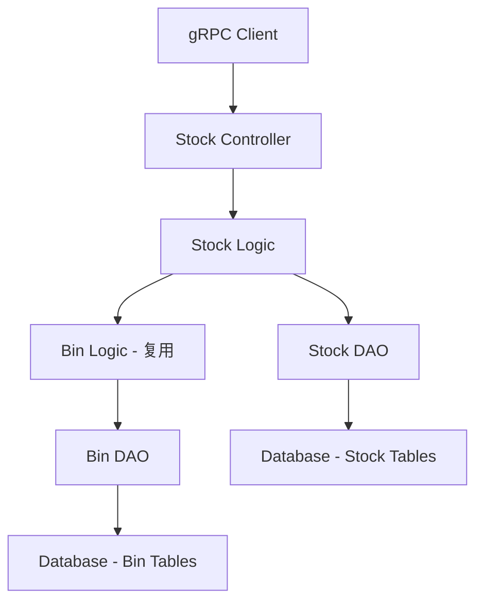

# Get Item Stock By Bin Service 设计文档

> 本文档定义 获取商品按货位分组的库存信息 的技术设计和实现方案。

## 📋 概述

为 BMP 微服务模块新增 GetItemStockByBin 服务接口，支持根据仓库和商品代码查询货位库存信息。该服务通过调用已有的 Bin 查询服务获取库存数据，按货位分组返回包含 item_code, actual_qty, projected_qty, reserved_qty_for_pos, stock_uom, valuation_rate 等字段的库存信息。

## 🎯 规范对齐

### Go BMP 规范 (go-bmp.mdc)

[说明设计如何遵循 Go BMP 微服务规范]

- 禁止修改 dao/entity/do/ 目录（自动生成）
- gRPC 服务注册到 Nacos
- 遵循 GoFrame 项目结构

### API 设计规范 (api.mdc)

[说明 API 设计如何遵循规范]

- gRPC 服务使用 proto3 语法
- 响应格式统一
- data 不能为 null 或数组

### 数据库规范 (database.mdc)

[说明数据库设计如何遵循规范]

- 复用现有的库存和货位相关表结构
- 查询优化：使用合适的索引提升查询性能
- 参考: `.cursor/rules/database.mdc` - 数据库开发规范

---

## 🔄 代码复用分析

### 可复用的现有组件

- **Bin 查询服务**: `ttpos-bmp/app/ttpos-erp/internal/logic/stock/` - 已有的货位查询逻辑
- **库存相关 DAO**: `ttpos-bmp/app/ttpos-erp/internal/dao/` - 自动生成的库存数据访问对象
- **gRPC 控制器模板**: `ttpos-bmp/app/ttpos-erp/internal/controller/rpc/stock/stock.go` - 参考现有的库存 gRPC 接口实现

### 集成点

- **Bin 查询服务**: 新接口将调用现有的 Bin 查询逻辑
- **库存数据表**: 复用现有的库存相关数据表结构
- **gRPC 基础设施**: 使用现有的 gRPC 框架和 Nacos 注册

---

## 🏗️ 架构设计

### 分层设计原则

**BMP 微服务三层架构**:

```
API 层 (gRPC Controller)
  ↓ 调用
Logic 层 (业务逻辑)
  ↓ 调用
DAO 层 (数据访问)
```

**依赖规则**:

- ✅ 上层可依赖下层
- ❌ 禁止下层依赖上层
- ✅ Logic 可调用其他 Logic
- ✅ Controller 调用 Logic

### 架构图



### 模块划分

#### BMP 微服务模块

- **gRPC Controller**: `ttpos-bmp/app/ttpos-erp/internal/controller/rpc/stock/stock.go` - 新增 GetItemStockByBin 接口
- **Logic 层**: `ttpos-bmp/app/ttpos-erp/internal/logic/stock/stock_bin.go` - 在现有文件中新增 GetItemStockByBin 方法
- **DAO 层**: `ttpos-bmp/app/ttpos-erp/internal/dao/` - 复用现有的库存和货位 DAO（自动生成 ❌ 禁止修改）
- **Protobuf**: `ttpos-bmp/app/ttpos-erp/manifest/protobuf/stock/stock.proto` - 新增 GetItemStockByBin 消息定义

---

## 🗄️ 数据库设计

### 数据表设计

#### 复用现有表结构

该功能复用现有的库存和货位相关表结构，不需要新增数据库表。

**涉及的现有表**:
- `ttpos_stock_ledger` - 库存台账表
- `ttpos_bin` - 货位表
- `ttpos_item` - 商品表

**字段说明**:
| 表名 | 字段 | 类型 | 说明 |
|------|------|------|------|
| ttpos_stock_ledger | item_code | varchar | 商品代码 |
| ttpos_stock_ledger | actual_qty | decimal | 实际库存数量 |
| ttpos_stock_ledger | projected_qty | decimal | 预计库存数量 |
| ttpos_stock_ledger | reserved_qty_for_pos | decimal | POS 预留数量 |
| ttpos_stock_ledger | stock_uom | varchar | 库存单位 |
| ttpos_stock_ledger | valuation_rate | decimal | 估价率 |
| ttpos_bin | bin_code | varchar | 货位代码 |
| ttpos_bin | warehouse | varchar | 仓库代码 |

### 数据库迁移

**不需要新的数据库迁移**，复用现有表结构。

---

## 🔌 API 设计

### gRPC API

#### API 1: GetItemStockByBin

**请求消息**:

```protobuf
// ttpos-bmp/app/ttpos-erp/manifest/protobuf/stock/stock.proto
service StockService {
  rpc GetItemStockByBin (GetItemStockByBinReq) returns (GetItemStockByBinResp);
}

message GetItemStockByBinReq {
  string warehouse = 1;  // 仓库代码（必填）
  string item_code = 2;  // 商品代码（可选，为空时返回该仓库所有商品）
}

message GetItemStockByBinResp {
  int32 code = 1;
  string message = 2;
  GetItemStockByBinData data = 3;
}

message GetItemStockByBinData {
  repeated ItemStockBin items = 1;
}

message ItemStockBin {
  string item_code = 1;              // 商品代码
  string warehouse = 2;               // 仓库名称
  double actual_qty = 3;             // 实际库存数量
  double projected_qty = 4;          // 预计库存数量
  double reserved_qty_for_pos = 5;   // POS预留数量
  string stock_uom = 6;              // 库存单位
  double valuation_rate = 7;         // 估价率
  double stock_value = 8;            // 库存价值
}
```

**成功响应示例**:

```json
{
  "code": 1,
  "message": "success",
  "data": {
    "items": [
      {
        "item_code": "ITEM001",
        "warehouse": "MAIN_WH",
        "actual_qty": 100.00,
        "projected_qty": 95.00,
        "reserved_qty_for_pos": 5.00,
        "stock_uom": "PCS",
        "valuation_rate": 10.50,
        "stock_value": 1050.00
      }
    ]
  }
}
```

**错误响应示例**:

```json
{
  "code": 0,
  "message": "仓库代码不存在",
  "data": {}
}
```

### Protobuf 生成代码

```bash
cd ttpos-bmp/app/ttpos-erp
make dao
```

**参考**: `docs/agent/workflows/microservice-integration.md`

---

## 🧩 组件和接口

### Logic 层

#### Stock Logic 实现

```go
// ttpos-bmp/app/ttpos-erp/internal/logic/stock/stock_bin.go
// GetItemStockByBin 根据仓库和商品代码查询货位库存信息
// 参数：
//   - ctx: 上下文对象，用于传递请求范围的元数据
//   - req: GetItemStockByBin 请求参数，包含仓库代码和可选的商品代码
//
// 返回：
//   - res: 按货位分组的库存信息数据
//   - err: 操作过程中产生的错误（若有）
func (s *sStock) GetItemStockByBin(ctx context.Context, req *stock.GetItemStockByBinReq) (*stock.GetItemStockByBinData, error) {
	// 1. 参数验证
	if err := s.validateGetItemStockByBinReq(req); err != nil {
		g.Log().Warning(ctx, "GetItemStockByBin 参数验证失败", err)
		return nil, err
	}

	// 2. 构建查询过滤器
	filters := [][]string{
		{"warehouse", "=", req.Warehouse},
	}
	// 如果指定了商品代码，添加到过滤器中
	if req.ItemCode != "" {
		filters = append(filters, []string{"item_code", "=", req.ItemCode})
	}

	// 3. 查询 Bin 表，获取所有需要的字段
	binResp, err := service.Document().List(ctx, &erp.ErpReq{
		DocType: erp.DocTypeBin,
	}, &erp.RequestParams{
		Filters: filters,
		Fields: []string{
			"item_code",
			"warehouse",
			"actual_qty",
			"projected_qty",
			"reserved_qty_for_pos",
			"stock_uom",
			"valuation_rate",
			"stock_value",
		},
		Limit: 99999, // 设置最大记录数
	})
	if err != nil {
		g.Log().Errorf(ctx, "GetItemStockByBin 查询 Bin 表失败: warehouse=%s, err=%v", req.Warehouse, err)
		return nil, gerror.Wrapf(err, "查询 Bin 表失败")
	}

	// 4. 解析 Bin 数据
	binData := binResp.GetJsons("data")
	if len(binData) == 0 {
		g.Log().Infof(ctx, "GetItemStockByBin 未找到货位信息: warehouse=%s", req.Warehouse)
		return &stock.GetItemStockByBinData{
			Items: []*stock.ItemStockBin{},
		}, nil
	}

	// 5. 转换为响应格式
	var result []*stock.ItemStockBin
	for _, entry := range binData {
		item := &stock.ItemStockBin{
			ItemCode:          entry.Get("item_code").String(),
			Warehouse:         entry.Get("warehouse").String(),
			ActualQty:         entry.Get("actual_qty").Float64(),
			ProjectedQty:      entry.Get("projected_qty").Float64(),
			ReservedQtyForPos: entry.Get("reserved_qty_for_pos").Float64(),
			StockUom:          entry.Get("stock_uom").String(),
			ValuationRate:     entry.Get("valuation_rate").Float64(),
			StockValue:        entry.Get("stock_value").Float64(),
		}
		result = append(result, item)
	}

	g.Log().Infof(ctx, "GetItemStockByBin 查询完成: warehouse=%s, item_filter=%s, result_count=%d",
		req.Warehouse, req.ItemCode, len(result))

	return &stock.GetItemStockByBinData{
		Items: result,
	}, nil
}

// validateGetItemStockByBinReq 验证 GetItemStockByBin 请求参数
func (s *sStock) validateGetItemStockByBinReq(req *stock.GetItemStockByBinReq) error {
	if req == nil {
		return gerror.New("请求参数不能为空")
	}
	if req.Warehouse == "" {
		return gerror.New("仓库代码不能为空")
	}
	return nil
}

// queryStockByBin 根据货位代码查询库存信息
func (s *sStock) queryStockByBin(ctx context.Context, binCode, itemCode string) (*stock.ItemStockByBin, error) {
	// 查询库存台账
	stockResp, err := service.Document().List(ctx, &erp.ErpReq{
		DocType: "Stock Ledger Entry",
	}, &erp.RequestParams{
		Filters: [][]string{
			{"item_code", "=", itemCode},
			{"warehouse", "=", binCode}, // bin_code 对应 warehouse 字段
		},
		Fields: []string{
			"item_code",
			"actual_qty",
			"projected_qty",
			"reserved_qty_for_pos",
			"stock_uom",
			"valuation_rate",
		},
		Limit: 1,
	})

	if err != nil {
		return nil, gerror.Wrapf(err, "查询库存台账失败: bin_code=%s", binCode)
	}

	stockData := stockResp.GetJsons("data")
	if len(stockData) == 0 {
		// 无库存记录，返回空
		return nil, nil
	}

	entry := stockData[0]
	return &stock.ItemStockByBin{
		ItemCode:          entry.Get("item_code").String(),
		ActualQty:         entry.Get("actual_qty").String(),
		ProjectedQty:      entry.Get("projected_qty").String(),
		ReservedQtyForPos: entry.Get("reserved_qty_for_pos").String(),
		StockUom:          entry.Get("stock_uom").String(),
		ValuationRate:     entry.Get("valuation_rate").String(),
	}, nil
}
```

### gRPC Controller

```go
// ttpos-bmp/app/ttpos-erp/internal/controller/rpc/stock/stock.go
func (c *StockController) GetItemStockByBin(ctx context.Context, req *stock.GetItemStockByBinReq) (*stock.GetItemStockByBinResp, error) {
	l := stock.NewGetItemStockByBinLogic(ctx, c.svcCtx)
	return l.GetItemStockByBin(req)
}
```

---

## ⚡ 缓存设计

### Redis 缓存（如需要）

**缓存策略**:

- **Key 命名**: `ttpos:bmp:stock_by_bin:{warehouse}:{item_code}`
- **过期时间**: 5 分钟（库存数据更新频率中等）
- **更新策略**: Write-Through Pattern

---

## 🚨 错误处理

### 错误场景

#### 场景 1: 仓库代码不存在

- **处理方式**: 验证仓库代码存在性
- **用户影响**: 返回"仓库代码不存在"错误
- **代码示例**:
  ```go
  if !warehouseExists(req.Warehouse) {
      return nil, errors.New("仓库代码不存在")
  }
  ```

#### 场景 2: Bin 查询服务异常

- **处理方式**: 捕获异常，返回错误信息
- **用户影响**: 返回"查询货位信息失败"错误
- **代码示例**:
  ```go
  binData, err := binLogic.GetBinsByWarehouse(req.Warehouse)
  if err != nil {
      return nil, errors.Wrap(err, "查询货位信息失败")
  }
  ```

---

## 🔒 安全设计

### 身份验证

- **gRPC Token**: 所有 gRPC 调用需要 Token 验证
- **服务间认证**: 使用内部认证机制

### 权限控制

- **仓库权限**: 验证调用方是否有该仓库的查询权限
- **数据隔离**: 只能查询授权范围内的库存数据

---

## 🧪 测试策略

### 单元测试

**目标覆盖率**:

- ttpos-bmp/app/ttpos-erp/internal/logic: ≥ 70%
- ttpos-bmp/app/ttpos-erp/internal/controller/rpc: ≥ 70%

**测试内容**:

- Logic 业务逻辑验证
- Controller 参数处理
- 错误场景处理

### API 测试

**测试内容**:

- gRPC 接口调用
- 参数验证
- 响应格式
- 错误处理

### 集成测试

**测试流程**:

- 端到端 gRPC 调用流程
- Bin 查询服务集成
- 数据库数据一致性

---

## 📈 性能优化

### 优化策略

1. **数据库优化**:

   - 添加仓库和货位相关的复合索引
   - **直接查询 Bin 表，单次查询获取所有需要的数据**
   - **在数据库层面过滤条件（warehouse 和可选的 item_code），减少数据传输**
   - 设置最大查询限制 (Limit: 99999)
   - 优化 Bin 表查询 SQL
   - 使用连接池

2. **缓存优化**:

   - Redis 缓存热点库存数据
   - 缓存预热机制
   - 缓存穿透防护

3. **并发控制**:

   - 读写锁保护共享数据
   - 批量查询优化

### 性能指标

- 本地响应时间: < 200ms
- 数据库查询: < 50ms
- 缓存命中率: > 80%
- 并发能力: 500+ QPS

---

## 🌐 浏览器兼容性

不适用（微服务接口，无前端界面）

---

## 📚 实现清单

### Phase 1: Protobuf 定义和生成

- [ ] 定义 GetItemStockByBin 消息和接口
- [ ] 生成 gRPC Go 代码
- [ ] 更新服务注册

### Phase 2: 核心实现

- [ ] 实现 GetItemStockByBin Logic
- [ ] 实现 gRPC Controller
- [ ] 集成 Bin 查询服务

### Phase 3: 测试和优化

- [ ] 单元测试
- [ ] 集成测试
- [ ] 性能优化

**详细任务**: 参见 `tasks.md`

---

## Graphiti & 活动日志

- Related Episode: `[待补充]`
- 模板：`docs/agent/templates/graphiti-episode.md`
- 活动日志：`docs/team/activities/{YYYY-MM}/{YYYY-MM-DD}.md`
- 在技术方案评审、关键架构决策或踩坑总结后，立即补充 Episode 并在设计文档尾部互链。

---

**版本**: v1.0.0
**创建日期**: 2025-12-26
**作者**: rikugun
**审核者**: {审核者}
