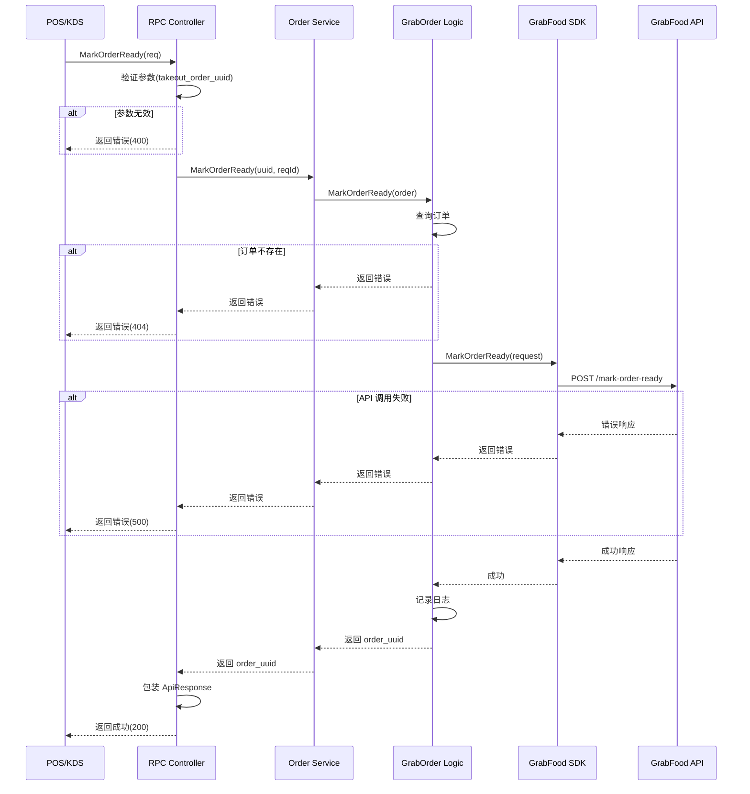

# GrabFood Mark Order as Ready API 集成 设计文档

> 本文档定义 GrabFood 订单准备完成通知功能的技术设计和实现方案。

## 📋 概述

实现 GrabFood 的 "Mark order as ready" API 集成，当厨房完成订单准备后，通过 gRPC 接口调用 GrabFood API，通知平台和配送员订单已准备就绪。该功能是 ttpos-takeout 微服务中订单流程管理的重要一环，位于订单接受之后、配送跟踪之前。

**技术栈**: Go + GoFrame 2.x + gRPC + GrabFood SDK

---

## 🎯 规范对齐

### Go BMP 规范 (go-bmp.mdc)

本设计严格遵循 GoFrame 微服务规范：

- ✅ **分层架构**: Controller → Service → Logic → DAO
- ✅ **禁止修改**: dao/entity/do/ 目录（自动生成）
- ✅ **gRPC 服务**: 注册到 Nacos，使用 takeout.ApiResponse 包装响应
- ✅ **Logic 层**: 不返回 takeout.ApiResponse（由 Controller 包装）
- ✅ **遵循 GoFrame 项目结构**: internal/controller/rpc/, internal/logic/, internal/service/

### API 设计规范 (api.mdc)

- ✅ **gRPC 命名**: 使用 snake_case（takeout_order_uuid）
- ✅ **响应格式**: 统一使用 takeout.ApiResponse
- ✅ **字段命名**: Protobuf 使用 snake_case，Go 使用 CamelCase
- ✅ **错误处理**: 明确区分参数错误、业务错误、系统错误

### 安全规范 (security.mdc)

- ✅ **服务发现**: 通过 Nacos 调用，不直接暴露端口
- ✅ **参数验证**: 防止注入攻击
- ✅ **错误信息**: 不暴露敏感数据

---

## 🔄 代码复用分析

### 可复用的现有组件

- **PrepareOrder 方法**: `ttpos-bmp/app/ttpos-takeout/internal/logic/grab_order/grab_order.go`
  - 复用点：GrabFood SDK 调用模式、错误处理逻辑、日志记录
  - 相似度：95%（唯一区别是调用不同的 SDK 方法）

- **GrabFood SDK**: `github.com/grab/grabfood-api-sdk-go`
  - 已集成，复用现有配置和认证
  - 方法：`MarkOrderReady(request)`

- **订单 Service**: `ttpos-bmp/app/ttpos-takeout/internal/service/order.go`
  - 复用订单查询和验证逻辑

### 集成点

- **gRPC 服务**: 通过 OrderService 暴露 MarkOrderReady 接口
- **Protobuf 定义**: 在 order.proto 中新增消息和 RPC 方法
- **Controller 层**: 在 order.go 中新增 MarkOrderReady 实现
- **Logic 层**: 在 grab_order.go 中新增 MarkOrderReady 业务逻辑

---

## 🏗️ 架构设计

### 分层设计原则

**GoFrame 微服务分层**:

```
RPC Controller 层 (internal/controller/rpc/order/)
  ↓ 调用 Service 接口
Service 接口层 (internal/service/)
  ↓ 注入 Logic 实现
Logic 业务层 (internal/logic/grab_order/)
  ↓ 调用外部 SDK
GrabFood SDK (github.com/grab/grabfood-api-sdk-go)
```

**依赖规则**:

- ✅ Controller 调用 Service 接口
- ✅ Service 注入 Logic 实现
- ✅ Logic 调用 GrabFood SDK
- ❌ Controller 不直接调用 Logic
- ❌ Logic 不返回 takeout.ApiResponse

### 架构图

```mermaid
graph TD
    A[POS/KDS 客户端] -->|gRPC 调用| B[Nacos 服务注册中心]
    B --> C[ttpos-takeout: OrderService.MarkOrderReady]
    C -->|参数验证| D[Controller 层]
    D -->|service.Order().MarkOrderReady| E[Service 接口层]
    E -->|logic.MarkOrderReady| F[Logic 业务层]
    F -->|查询订单| G[订单数据]
    F -->|SDK 调用| H[GrabFood API]
    H -->|通知配送员| I[GrabFood 平台]
    D -->|记录日志| J[日志系统]
    F -->|记录日志| J
```

### 模块划分

#### ttpos-takeout 模块

- **RPC Controller**: `ttpos-bmp/app/ttpos-takeout/internal/controller/rpc/order/order.go`
  - 职责：参数验证、响应包装、日志记录
  - 输入：MarkOrderReadyReq (takeout_order_uuid, request_id)
  - 输出：takeout.ApiResponse (包含 MarkOrderReadyResp)

- **Service 接口**: `ttpos-bmp/app/ttpos-takeout/internal/service/order.go`
  - 职责：定义业务接口
  - 方法：`MarkOrderReady(ctx context.Context, takeoutOrderUuid string, requestId string) (orderUuid string, err error)`

- **Logic 层**: `ttpos-bmp/app/ttpos-takeout/internal/logic/grab_order/grab_order.go`
  - 职责：核心业务逻辑、SDK 调用、错误处理
  - 输入：订单实体
  - 输出：订单 UUID 或错误

- **Protobuf 定义**: `ttpos-bmp/app/ttpos-takeout/manifest/protobuf/order/order.proto`
  - 消息：MarkOrderReadyReq, MarkOrderReadyResp
  - RPC 方法：`rpc MarkOrderReady(MarkOrderReadyReq) returns (takeout.ApiResponse);`

---

## 🗄️ 数据库设计

**本功能不涉及数据库变更**：

- 只读取现有订单数据（ttpos_takeout_order 表）
- 不修改本地订单状态（等待 GrabFood 回调更新）
- 无需创建迁移文件

---

## 📊 数据模型

### Protobuf 消息定义

```protobuf
// ttpos-bmp/app/ttpos-takeout/manifest/protobuf/order/order.proto

// MarkOrderReady 请求
message MarkOrderReadyReq {
  string takeout_order_uuid = 1; // 外卖订单 UUID
  string request_id = 2;         // 请求 ID（可选，用于幂等性）
}

// MarkOrderReady 响应
message MarkOrderReadyResp {
  string order_uuid = 1; // 订单 UUID
}

// RPC 方法定义
service OrderService {
  // 标记订单准备完成（markStatus 默认为 1）
  rpc MarkOrderReady(MarkOrderReadyReq) returns (takeout.ApiResponse);
}
```

### Go DTO 定义

Logic 层内部使用订单实体：

```go
// 使用现有的订单实体
type TakeoutOrder struct {
    OrderUuid      string `json:"order_uuid"`
    ProviderName   string `json:"provider_name"`
    ProviderOrderId string `json:"provider_order_id"`
    // ... 其他字段
}
```

---

## 🔌 API 设计

### gRPC API

#### MarkOrderReady - 标记订单准备完成

**请求**:

```protobuf
MarkOrderReadyReq {
  takeout_order_uuid: "1234567890"
  request_id: "req-001"  // 可选
}
```

**成功响应**:

```json
{
  "code": 0,
  "message": "success",
  "data": {
    "@type": "type.googleapis.com/order.MarkOrderReadyResp",
    "order_uuid": "1234567890"
  }
}
```

**错误响应 - 参数错误**:

```json
{
  "code": 400,
  "message": "takeout_order_uuid 不能为空",
  "data": {}
}
```

**错误响应 - 订单不存在**:

```json
{
  "code": 404,
  "message": "订单不存在",
  "data": {}
}
```

**错误响应 - GrabFood API 失败**:

```json
{
  "code": 500,
  "message": "调用 GrabFood API 失败: network timeout",
  "data": {}
}
```

### API 调用流程



---

## 🧩 组件和接口

### Controller 层

```go
// ttpos-bmp/app/ttpos-takeout/internal/controller/rpc/order/order.go

func (c *ControllerV1) MarkOrderReady(ctx context.Context, req *v1.MarkOrderReadyReq) (*takeout.ApiResponse, error) {
    // 1. 参数验证
    if req.TakeoutOrderUuid == "" {
        return common.BuildApiResponse(400, "takeout_order_uuid 不能为空", nil), nil
    }

    // 2. 记录请求日志
    g.Log().Infof(ctx, "接收到 MarkOrderReady 请求: order_uuid=%s, request_id=%s", 
        req.TakeoutOrderUuid, req.RequestId)

    // 3. 调用 Service
    orderUuid, err := service.Order().MarkOrderReady(ctx, req.TakeoutOrderUuid, req.RequestId)
    if err != nil {
        g.Log().Errorf(ctx, "MarkOrderReady 失败: %v", err)
        return common.BuildApiResponse(500, "标记订单准备完成失败", nil), nil
    }

    // 4. 构建响应
    resp := &v1.MarkOrderReadyResp{
        OrderUuid: orderUuid,
    }

    // 5. 记录成功日志
    g.Log().Infof(ctx, "MarkOrderReady 成功: order_uuid=%s", orderUuid)

    return common.BuildApiResponse(0, "success", resp), nil
}
```

### Service 接口

```go
// ttpos-bmp/app/ttpos-takeout/internal/service/order.go

type IOrder interface {
    // ... 现有方法
    
    // MarkOrderReady 标记订单准备完成
    // @param ctx context.Context
    // @param takeoutOrderUuid 外卖订单 UUID
    // @param requestId 请求 ID（可选，用于幂等性）
    // @return orderUuid 订单 UUID
    // @return err 错误信息
    MarkOrderReady(ctx context.Context, takeoutOrderUuid string, requestId string) (orderUuid string, err error)
}
```

### Logic 层

```go
// ttpos-bmp/app/ttpos-takeout/internal/logic/grab_order/grab_order.go

// MarkOrderReady 标记订单准备完成
// @param order *entity.TakeoutOrder 订单实体
// @return error
func (l *sGrabOrder) MarkOrderReady(ctx context.Context, order *entity.TakeoutOrder) error {
    // 1. 参数校验
    if order == nil {
        return gerror.New("订单不能为空")
    }
    if order.ProviderName != "grab" {
        return gerror.Newf("订单渠道错误，期望 grab，实际 %s", order.ProviderName)
    }
    if order.ProviderOrderId == "" {
        return gerror.New("provider_order_id 不能为空")
    }

    // 2. 记录开始日志
    g.Log().Infof(ctx, "开始调用 GrabFood MarkOrderReady API: provider_order_id=%s", 
        order.ProviderOrderId)

    // 3. 构建 SDK 请求
    request := grabfood.MarkOrderReadyRequest{
        OrderID:    order.ProviderOrderId,
        MarkStatus: 1, // 固定传入 1（订单准备完成）
    }

    // 4. 调用 GrabFood SDK
    if err := l.grabClient.MarkOrderReady(ctx, &request); err != nil {
        // 记录详细错误日志
        g.Log().Errorf(ctx, "调用 GrabFood MarkOrderReady API 失败: order_id=%s, error=%v", 
            order.ProviderOrderId, err)
        return gerror.Wrapf(err, "调用 GrabFood API 失败")
    }

    // 5. 记录成功日志
    g.Log().Infof(ctx, "调用 GrabFood MarkOrderReady API 成功: provider_order_id=%s", 
        order.ProviderOrderId)

    // 6. 记录操作日志（可选，用于审计）
    l.logOperation(ctx, order, "mark_ready", "success")

    return nil
}

// logOperation 记录操作日志（私有方法）
func (l *sGrabOrder) logOperation(ctx context.Context, order *entity.TakeoutOrder, action string, result string) {
    // 实现操作日志记录
    // 可以写入数据库或发送到日志系统
}
```

---

## 🚨 错误处理

### 错误场景

#### 场景 1: 参数验证失败

- **处理方式**: Controller 层验证，直接返回 400 错误
- **用户影响**: 看到明确的错误提示"takeout_order_uuid 不能为空"
- **代码示例**:
  ```go
  if req.TakeoutOrderUuid == "" {
      return common.BuildApiResponse(400, "takeout_order_uuid 不能为空", nil), nil
  }
  ```

#### 场景 2: 订单不存在

- **处理方式**: Logic 层查询订单，未找到时返回错误
- **用户影响**: 看到错误提示"订单不存在"
- **代码示例**:
  ```go
  order, err := l.getOrderByUuid(ctx, takeoutOrderUuid)
  if err != nil {
      return gerror.Wrap(err, "查询订单失败")
  }
  if order == nil {
      return gerror.New("订单不存在")
  }
  ```

#### 场景 3: 订单渠道错误

- **处理方式**: Logic 层验证 provider_name，不是 "grab" 时返回错误
- **用户影响**: 看到错误提示"订单渠道错误，期望 grab，实际 xxx"
- **代码示例**:
  ```go
  if order.ProviderName != "grab" {
      return gerror.Newf("订单渠道错误，期望 grab，实际 %s", order.ProviderName)
  }
  ```

#### 场景 4: GrabFood API 调用失败

- **处理方式**: Logic 层捕获 SDK 错误，记录详细日志并返回
- **用户影响**: 看到错误提示"调用 GrabFood API 失败: xxx"
- **代码示例**:
  ```go
  if err := l.grabClient.MarkOrderReady(ctx, &request); err != nil {
      g.Log().Errorf(ctx, "调用 GrabFood MarkOrderReady API 失败: order_id=%s, error=%v", 
          order.ProviderOrderId, err)
      return gerror.Wrapf(err, "调用 GrabFood API 失败")
  }
  ```

#### 场景 5: 网络超时

- **处理方式**: GrabFood SDK 自动处理超时（30 秒），Logic 层记录错误
- **用户影响**: 看到错误提示"调用 GrabFood API 失败: timeout"
- **监控**: 记录超时次数，触发告警

---

## 🔒 安全设计

### 身份验证

- **gRPC 认证**: 通过 Nacos 服务发现调用，内部服务间通信
- **GrabFood API 认证**: 使用已配置的 merchant_id 和 API key

### 权限控制

- **服务级别**: 只有内部服务（POS/KDS）可以调用
- **业务级别**: 订单必须属于当前商户

### 数据安全

- **参数验证**: 防止 SQL 注入（虽然本功能不涉及 SQL 写入）
- **错误信息**: 不暴露订单详情、商户信息等敏感数据
- **日志脱敏**: 敏感字段（如 API key）不记录到日志

---

## 🧪 测试策略

### 单元测试

**目标覆盖率**: Logic 层 ≥ 80%

**测试内容**:

1. **Logic 层测试** (`grab_order_test.go`):
   - 测试成功场景：正常调用 SDK
   - 测试订单不存在
   - 测试订单渠道错误
   - 测试 provider_order_id 为空
   - 测试 SDK 调用失败

**示例**:

```go
// ttpos-bmp/app/ttpos-takeout/internal/logic/grab_order/grab_order_test.go

func TestMarkOrderReady_Success(t *testing.T) {
    // Mock 依赖
    mockClient := &MockGrabClient{}
    logic := &sGrabOrder{grabClient: mockClient}

    // 构造测试数据
    order := &entity.TakeoutOrder{
        OrderUuid:       "1234567890",
        ProviderName:    "grab",
        ProviderOrderId: "GRAB-001",
    }

    // 执行测试
    err := logic.MarkOrderReady(context.Background(), order)

    // 断言
    assert.NoError(t, err)
    assert.Equal(t, 1, mockClient.CallCount)
}

func TestMarkOrderReady_InvalidProvider(t *testing.T) {
    logic := &sGrabOrder{}
    order := &entity.TakeoutOrder{
        OrderUuid:    "1234567890",
        ProviderName: "foodpanda",
    }

    err := logic.MarkOrderReady(context.Background(), order)

    assert.Error(t, err)
    assert.Contains(t, err.Error(), "订单渠道错误")
}
```

### 集成测试

**测试内容**:

1. **端到端测试**:
   - 通过 gRPC 调用 MarkOrderReady
   - 验证响应格式
   - 验证日志记录

2. **Mock GrabFood API**:
   - 使用 httptest 模拟 GrabFood API
   - 测试成功响应
   - 测试失败响应（超时、404 等）

### 手动测试

**测试环境**: staging

**测试步骤**:

1. 创建测试订单（已接受状态）
2. 调用 MarkOrderReady gRPC 接口
3. 检查 GrabFood 平台订单状态
4. 验证日志记录
5. 测试幂等性（重复调用）

---

## 📈 性能优化

### 优化策略

1. **API 响应时间**:
   - 目标：< 500ms（包含 GrabFood API 调用）
   - GrabFood SDK 超时设置：30 秒
   - 异步日志记录：不阻塞主流程

2. **并发处理**:
   - 支持多订单同时标记
   - 无需加锁（不涉及本地状态修改）

3. **错误处理**:
   - 快速失败：参数错误立即返回
   - 详细日志：记录完整错误信息

### 性能指标

- **API 响应时间**: < 500ms (P95)
- **GrabFood API 调用**: < 300ms (P95)
- **并发能力**: 100+ QPS
- **成功率**: > 99%

---

## 📚 实现清单

### Phase 1: Protobuf 定义和代码生成 (0.5 天)

- [ ] 在 order.proto 中新增 MarkOrderReadyReq 消息
- [ ] 在 order.proto 中新增 MarkOrderReadyResp 消息
- [ ] 在 OrderService 中新增 MarkOrderReady RPC 方法
- [ ] 执行 `gf gen pb` 生成 Go 代码
- [ ] 验证生成的代码正确

### Phase 2: Logic 层实现 (0.5 天)

- [ ] 在 grab_order.go 中新增 MarkOrderReady 方法
- [ ] 实现参数验证
- [ ] 调用 GrabFood SDK
- [ ] 实现错误处理和日志记录
- [ ] 编写单元测试（覆盖率 ≥ 80%）

### Phase 3: Controller 层实现 (0.5 天)

- [ ] 在 order.go 中实现 MarkOrderReady 方法
- [ ] 实现参数验证
- [ ] 调用 Service 接口
- [ ] 包装 ApiResponse
- [ ] 实现错误处理和日志记录

### Phase 4: 测试和文档 (0.5 天)

- [ ] 集成测试（端到端流程）
- [ ] 手动测试（staging 环境）
- [ ] 更新 API 文档
- [ ] 更新 CHANGELOG.md

**详细任务**: 参见 `tasks.md`

---

## Graphiti & 活动日志

- Related Episode: `[待补充]`
- 模板：`docs/agent/templates/graphiti-episode.md`
- 活动日志：`docs/team/activities/rikugun/2025-12/2025-12-23.md`
- 在技术方案评审、关键架构决策或踩坑总结后，立即补充 Episode 并在设计文档尾部互链。

---

**版本**: v1.0.0  
**创建日期**: 2025-12-23  
**作者**: rikugun  
**审核者**: 待审核

