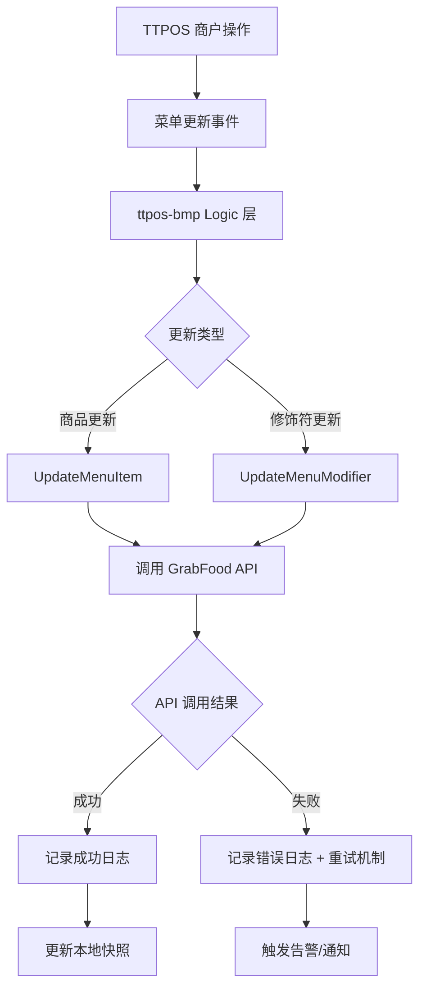

# GrabFood 菜单项和修饰符更新功能 设计文档

> 本文档定义 GrabFood 菜单项和修饰符更新功能 的技术设计和实现方案。

## 📋 概述

在现有的 `ttpos-bmp/app/ttpos-takeout/internal/logic/grab_menu/grab_menu.go` 文件中增加对接 GrabFood API `update-menu-record` 接口的实现。该功能允许商户在 TTPOS 中更新商品或修饰符信息时，自动同步到 GrabFood 平台，确保外卖菜单信息的实时一致性。

该功能属于 BMP 微服务模块，使用 GoFrame 框架开发，主要涉及第三方 API 集成和菜单同步逻辑。

---

## 🎯 规范对齐

### Go BMP 规范 (go-bmp.mdc)

[说明设计如何遵循 Go BMP 开发规范]

- **GoFrame 框架**: 使用 GoFrame v2.x，遵循项目结构规范
- **Protobuf 集成**: 如需 gRPC 接口，遵循 proto-rules.mdc
- **自动生成代码**: dao/entity/do/ 目录禁止手动修改
- **服务注册**: gRPC 服务注册到 Nacos
- **日志规范**: 使用 GoFrame 日志组件
- **错误处理**: 使用 gerror 包，中文错误信息

### API 设计规范 (api.mdc)

[说明 API 设计如何遵循规范]

- **第三方 API**: 遵循 GrabFood API v1.1.3 规范
- **接口设计**: 内部方法遵循 GoFrame 项目规范
- **响应格式**: 使用 SDK 提供的响应结构
- **错误处理**: 第三方 API 错误转换为内部错误格式

### 数据库规范 (database.mdc)

[说明数据库设计如何遵循规范]

- **现有表使用**: 复用现有的 channel_menu_snapshot 和 menu_log 表
- **数据一致性**: 确保菜单快照与 GrabFood 平台同步
- **事务管理**: 更新操作使用事务保证数据一致性

---

## 🔄 代码复用分析

[分析将复用、扩展或集成的现有代码]

### 可复用的现有组件

- **grab_menu.go**: `ttpos-bmp/app/ttpos-takeout/internal/logic/grab_menu/grab_menu.go` - 复用现有的菜单处理逻辑
- **GrabFood SDK**: `github.com/grab/grabfood-api-sdk-go` - 复用第三方 SDK
- **菜单服务**: `service.ChannelMenu()` - 复用现有的菜单数据获取服务
- **日志记录**: 复用现有的 menu_log 表结构

### 集成点

- **现有菜单同步**: 集成到现有的 SyncMenu 流程中
- **错误处理**: 复用现有的错误处理和日志记录机制
- **异步处理**: 考虑集成现有的队列处理机制（RocketMQ）

---

## 🏗️ 架构设计

[描述整体架构和使用的设计模式]

### 分层设计原则

**BMP 微服务架构**:

```
API 层 (gRPC Controller)
  ↓ 调用
Logic 层 (业务逻辑)
  ↓ 调用
外部服务 (GrabFood API)
  ↓ 记录
数据库 (MySQL)
```

**设计模式**:

- **适配器模式**: 适配 GrabFood API 到内部数据结构
- **策略模式**: UpdateMenuItem 和 UpdateMenuModifier 作为两种更新策略
- **观察者模式**: 菜单更新后触发同步状态回调

### 架构图



### 模块划分

#### Go BMP 模块

- **Logic 层**: `ttpos-bmp/app/ttpos-takeout/internal/logic/grab_menu/` - 核心业务逻辑
- **DTO 层**: `ttpos-bmp/app/ttpos-takeout/internal/model/dto/grab/` - 数据传输对象
- **外部集成**: `github.com/grab/grabfood-api-sdk-go` - 第三方 API SDK

---

## 🗄️ 数据库设计

### 数据表设计

#### 表 1: channel_menu_snapshot（复用现有表）

```sql
-- 复用现有表，无需新建
-- 主要字段：
-- shop_uuid: 门店UUID
-- provider_name: 提供商名称 ('grab')
-- ttpos_menu_data: TTPOS菜单数据JSON
-- sync_state: 同步状态
-- updated_at: 更新时间
```

**字段说明**:
| 字段 | 类型 | 说明 | 约束 |
|------|------|------|------|
| shop_uuid | bigint unsigned | 门店UUID | 主键 |
| provider_name | varchar(50) | 提供商名称 | 主键 |
| ttpos_menu_data | json | TTPOS菜单数据 | - |
| sync_state | varchar(20) | 同步状态 | - |
| updated_at | datetime | 更新时间 | - |

#### 表 2: menu_log（复用现有表）

```sql
-- 复用现有表，无需新建
-- 主要字段：
-- uuid: 日志UUID
-- merchant_id: 商户ID
-- provider_name: 提供商名称 ('grab')
-- status: 同步状态
-- error_msg: 错误信息
-- created_at: 创建时间
```

**字段说明**:
| 字段 | 类型 | 说明 | 约束 |
|------|------|------|------|
| uuid | bigint unsigned | 日志UUID | 主键 |
| merchant_id | varchar(100) | 商户ID | - |
| provider_name | varchar(50) | 提供商名称 | - |
| status | varchar(20) | 同步状态 | - |
| error_msg | text | 错误信息 | - |
| created_at | datetime | 创建时间 | - |

### 数据库迁移

**无需新迁移**: 复用现有表结构

---

## 📊 数据模型

### Go Model

**复用现有模型**:
- `channel_menu_snapshot` 表对应现有模型
- `menu_log` 表对应现有模型

### DTO 定义

#### Request DTO

```go
// ttpos-bmp/app/ttpos-takeout/internal/model/dto/grab/menu_update_req.go
type UpdateMenuItemReq struct {
    MerchantID      string `json:"merchant_id" v:"required"`
    ItemID         string `json:"item_id" v:"required"`
    Name           string `json:"name"`
    Price          *grabfood.Money `json:"price"`
    IsAvailable    *bool  `json:"is_available"`
    StockCount     *int32 `json:"stock_count"`
}

type UpdateMenuModifierReq struct {
    MerchantID      string `json:"merchant_id" v:"required"`
    ModifierGroupID string `json:"modifier_group_id" v:"required"`
    ModifierID     string `json:"modifier_id" v:"required"`
    Name           string `json:"name"`
    Price          *grabfood.Money `json:"price"`
    IsAvailable    *bool  `json:"is_available"`
}
```

#### Response DTO

```go
// ttpos-bmp/app/ttpos-takeout/internal/model/dto/grab/menu_update_resp.go
type UpdateMenuResult struct {
    Success     bool   `json:"success"`
    RequestID   string `json:"request_id,omitempty"`
    ErrorMsg    string `json:"error_msg,omitempty"`
}
```

---

## 🔌 API 设计

### 第三方 API

#### GrabFood Update Menu Record API

**请求**:

- **URL**: `https://partner-api.grabfood.com/grabfood/partner/v1/menu/update-record`
- **Method**: `PUT`
- **Headers**:
  ```json
  {
    "Authorization": "Bearer {access_token}",
    "Content-Type": "application/json"
  }
  ```
- **Body** (Item Update):
  ```json
  {
    "merchantID": "string",
    "items": [
      {
        "id": "string",
        "name": "string",
        "price": {
          "amount": "string",
          "currency": "string"
        },
        "isAvailable": true,
        "stockCount": 100
      }
    ]
  }
  ```

- **Body** (Modifier Update):
  ```json
  {
    "merchantID": "string",
    "modifierGroups": [
      {
        "id": "string",
        "modifiers": [
          {
            "id": "string",
            "name": "string",
            "price": {
              "amount": "string",
              "currency": "string"
            },
            "isAvailable": true
          }
        ]
      }
    ]
  }
  ```

**响应**:

```json
{
  "requestID": "string"
}
```

### 内部接口设计

#### Logic 层接口

```go
// ttpos-bmp/app/ttpos-takeout/internal/logic/grab_menu/grab_menu.go

// UpdateMenuItem 更新单个商品信息
func (s *sGrabMenu) UpdateMenuItem(ctx context.Context, req *grabDto.UpdateMenuItemReq) (*grabDto.UpdateMenuResult, error)

// UpdateMenuModifier 更新单个修饰符信息
func (s *sGrabMenu) UpdateMenuModifier(ctx context.Context, req *grabDto.UpdateMenuModifierReq) (*grabDto.UpdateMenuResult, error)
```

---

## 🧩 组件和接口

### Logic 层

#### 核心业务逻辑

```go
// ttpos-bmp/app/ttpos-takeout/internal/logic/grab_menu/grab_menu.go
type sGrabMenu struct{}

func (s *sGrabMenu) UpdateMenuItem(ctx context.Context, req *grabDto.UpdateMenuItemReq) (*grabDto.UpdateMenuResult, error) {
    // 1. 参数验证
    // 2. 构建 GrabFood API 请求
    // 3. 调用第三方 API
    // 4. 记录操作日志
    // 5. 返回结果
}

func (s *sGrabMenu) UpdateMenuModifier(ctx context.Context, req *grabDto.UpdateMenuModifierReq) (*grabDto.UpdateMenuResult, error) {
    // 1. 参数验证
    // 2. 构建 GrabFood API 请求
    // 3. 调用第三方 API
    // 4. 记录操作日志
    // 5. 返回结果
}
```

### 外部依赖

#### GrabFood SDK 集成

```go
import grabfood "github.com/grab/grabfood-api-sdk-go"

// 使用 SDK 客户端
client := grabfood.NewClient(accessToken)
response, err := client.UpdateMenuRecord(ctx, updateRequest)
```

---

## ⚡ 缓存设计

### Redis 缓存

**缓存策略**:

- **Key 命名**: `ttpos:bmp:menu:{merchant_id}:{item_id}`
- **过期时间**: 5 分钟（菜单更新频率较高）
- **更新策略**: Write-Through Pattern

**示例**:

```go
// 缓存菜单项信息
key := fmt.Sprintf("ttpos:bmp:menu:%s:%s", merchantID, itemID)
redis.Set(key, itemData, 5*time.Minute)
```

---

## 🚨 错误处理

### 错误场景

#### 场景 1: GrabFood API 调用失败

- **处理方式**: 记录错误日志，重试机制，触发告警
- **用户影响**: 菜单更新延迟，用户需稍后重试
- **代码示例**:
  ```go
  if err := callGrabFoodAPI(); err != nil {
      g.Log().Errorf(ctx, "[Grab] Update menu item failed: %v", err)
      // 记录错误日志到 menu_log 表
      // 触发重试或告警机制
      return nil, gerror.Wrap(err, "failed to update menu item")
  }
  ```

#### 场景 2: 参数验证失败

- **处理方式**: 返回验证错误，不调用第三方 API
- **用户影响**: 立即获得错误反馈
- **代码示例**:
  ```go
  if err := g.Validator().CheckStruct(req); err != nil {
      return nil, gerror.Wrap(err, "parameter validation failed")
  }
  ```

---

## 🔒 安全设计

### 身份验证

- **API Token**: 使用 GrabFood 颁发的访问令牌
- **Token 管理**: 通过配置中心管理，定期刷新

### 数据安全

- **敏感数据**: 不记录 API Token 到日志
- **错误信息**: 只记录必要错误信息，避免泄露敏感数据

### 访问控制

- **权限验证**: 验证商户是否有权限更新对应菜单
- **频率限制**: 避免过度调用第三方 API

---

## 🧪 测试策略

### 单元测试

**目标覆盖率**:

- Logic 层: ≥ 70%

**测试内容**:

- 参数验证逻辑
- API 调用模拟
- 错误处理逻辑
- 日志记录功能

**示例**:

```go
// ttpos-bmp/app/ttpos-takeout/internal/logic/grab_menu/grab_menu_test.go
func TestGrabMenu_UpdateMenuItem(t *testing.T) {
    // 测试正常更新场景
    // 测试参数验证失败场景
    // 测试 API 调用失败场景
}
```

### 集成测试

**测试流程**:

- 模拟 GrabFood API 响应
- 测试完整更新流程
- 验证数据库记录
- 检查日志记录

---

## 📈 性能优化

### 优化策略

1. **异步处理**:

   - 菜单更新使用异步队列，避免阻塞主流程
   - 返回请求ID，允许客户端查询更新状态

2. **缓存优化**:

   - 缓存菜单项信息，减少数据库查询
   - 缓存第三方 API 响应

3. **错误重试**:

   - 实现指数退避重试机制
   - 避免因临时网络问题导致失败

### 性能指标

- **响应时间**: < 500ms（包含第三方 API 调用）
- **成功率**: > 95%
- **重试成功率**: > 80%

---

## 🌐 浏览器兼容性

**不适用**: 该功能为后端微服务，无前端界面

---

## 📚 实现清单

### Phase 1: 需求分析和技术设计

- [x] 分析 GrabFood API 文档
- [x] 设计内部接口结构
- [x] 定义数据传输对象

### Phase 2: 核心实现

- [ ] 实现 UpdateMenuItem 方法
- [ ] 实现 UpdateMenuModifier 方法
- [ ] 集成第三方 SDK
- [ ] 添加参数验证
- [ ] 实现错误处理
- [ ] 添加日志记录

### Phase 3: 测试和优化

- [ ] 编写单元测试
- [ ] 实现集成测试
- [ ] 性能优化
- [ ] 错误重试机制

**详细任务**: 参见 `tasks.md`

---

## Graphiti & 活动日志

- Related Episode: `[待补充]`
- 模板：`docs/agent/templates/graphiti-episode.md`
- 活动日志：`docs/team/activities/{YYYY-MM}/{YYYY-MM-DD}.md`
- 在技术方案评审、关键架构决策或踩坑总结后，立即补充 Episode 并在设计文档尾部互链。

---

**版本**: v1.0.0
**创建日期**: 2025-12-15
**作者**: rikugun
**审核者**: {审核者}
