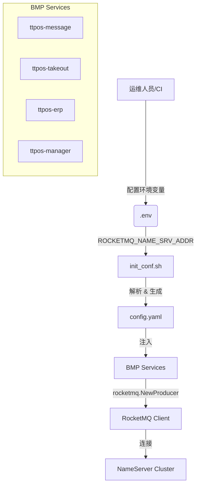

# 技术设计文档: BMP RocketMQ 集群配置支持

> 对应需求: [story-bmp-rocketmq-cluster](./requirements.md)

---

## 1. 🏗️ 架构设计

### 1.1 模块架构图



### 1.2 核心流程

1.  **配置生成阶段**:
    - `init_conf.sh` 脚本读取 `ROCKETMQ_NAME_SRV_ADDR`。
    - 判断是否包含多个地址（通过 `,` 或 `;` 分隔）。
    - 格式化为 YAML 数组字符串（如 `["addr1", "addr2"]` 或 `["addr1"]`）。
    - 通过 `envsubst` 替换 `config.tpl.yaml` 中的变量。

2.  **服务启动阶段**:
    - GoFrame 框架加载 `config.yaml`。
    - `nameSrvAdders` 字段被解析为 `[]string`。
    - 调用 `rocketmq.NewProducer` 或 `rocketmq.NewPushConsumer` 时传入该切片。

---

## 2. 🔌 接口设计

本次修改不涉及对外 API 接口变更。

---

## 3. 💾 数据模型

本次修改不涉及数据库模型变更。

---

## 4. 💻 代码实现细节

### 4.1 脚本修改 (`ttpos-bmp/hack/init_conf.sh`)

修改逻辑如下：

```bash
# 伪代码
if ROCKETMQ_NAME_SRV_ADDR contains "," or ";":
    split into array
    format as YAML list string: "addr1", "addr2"
    export ROCKETMQ_NAME_SRV_ADDR_FORMATTED
else:
    format as single item: "addr1"
    export ROCKETMQ_NAME_SRV_ADDR_FORMATTED
```

### 4.2 配置文件模板 (`manifest/config/config.tpl.yaml`)

将所有 BMP 模块的 `config.tpl.yaml` 中的 RocketMQ 配置修改为：

```yaml
# 旧
nameSrvAdders: [ "$ROCKETMQ_NAME_SRV_ADDR" ]

# 新
nameSrvAdders: [ $ROCKETMQ_NAME_SRV_ADDR ]
```

注意去掉引号，因为脚本生成的字符串将包含必要的引号。

### 4.3 涉及文件清单

1.  `ttpos-bmp/hack/init_conf.sh`
2.  `ttpos-bmp/app/ttpos-message/manifest/config/config.tpl.yaml`
3.  `ttpos-bmp/app/ttpos-takeout/manifest/config/config.tpl.yaml`
4.  `ttpos-bmp/app/ttpos-erp/manifest/config/config.tpl.yaml`
5.  `ttpos-bmp/app/ttpos-manager/manifest/config/config.tpl.yaml`
6.  `ttpos-bmp/app/ttpos-shop/manifest/config/config.tpl.yaml` (如果有)
7.  `ttpos-bmp/app/ttpos-websocket/manifest/config/config.tpl.yaml` (如果有)

---

## 5. 🧪 测试计划

### 5.1 单元测试
- 编写 Shell 脚本测试用例，验证 `init_conf.sh` 对不同格式环境变量的处理结果。

### 5.2 集成测试
- 在本地 Docker 环境配置多个 RocketMQ NameServer（或模拟），验证服务启动和连接。
- 验证单节点配置是否仍然正常工作。

---

## 6. ⚠️ 安全与性能

- **安全**: 无特殊安全风险。
- **性能**: 无性能影响。
