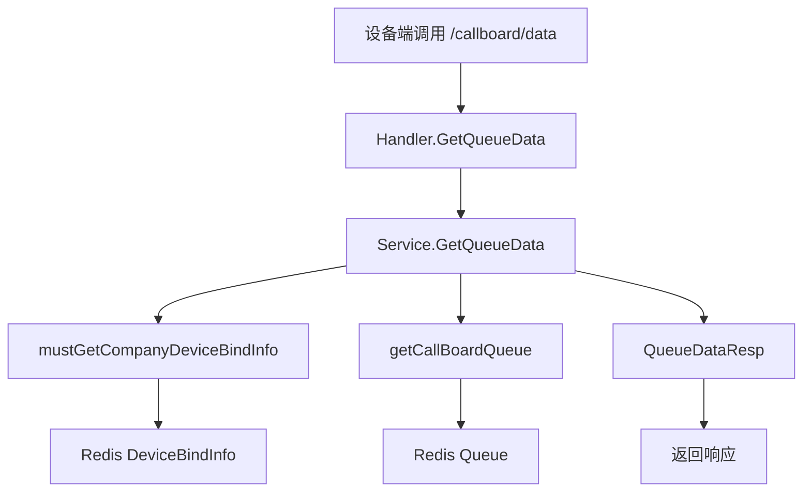

# 叫号系统返回配置信息 设计文档

> 本文档定义 叫号系统返回配置信息 的技术设计和实现方案。

## 📋 概述

扩展 `/callboard/data` 接口，在现有队列数据基础上返回叫号系统配置信息。配置信息已存储在 Redis 的 `DeviceBindInfo` 中，只需在 `GetQueueData` 方法中读取并填充到响应结构即可。实现简单，无需数据库变更，保持向后兼容。

---

## 🎯 规范对齐

### Go Main 规范 (go-main.mdc)

- ✅ Service 只依赖其他 Service 接口（无需修改）
- ✅ Repository 只持有 db 实例（无需修改）
- ✅ URL 使用 snake_case（`/callboard/data`）
- ✅ data 字段必须是对象（响应结构已符合）
- ✅ 不使用 panic，返回 error（现有代码已遵循）

### API 设计规范 (api.mdc)

- ✅ URL 使用 snake_case（`/callboard/data`）
- ✅ 响应格式统一（`{code, message, data{}}`）
- ✅ data 不能为 null 或数组（响应结构已符合）
- ✅ 新增字段为必返字段（不使用 `omitempty`）

### 数据库规范 (database.mdc)

- ✅ 无需数据库变更（配置信息存储在 Redis）
- ✅ 使用现有 `DeviceBindInfo` 结构

---

## 🔄 代码复用分析

### 可复用的现有组件

- **callBoardService**: `main/app/service/callboard/service.go` - 叫号系统服务，已实现 `GetQueueData` 方法
- **DeviceBindInfo**: `main/app/service/callboard/service.go` - 设备绑定信息结构，已包含配置字段
- **mustGetCompanyDeviceBindInfo**: `main/app/service/callboard/service.go` - 获取设备绑定信息方法，已返回包含配置的 `DeviceBindInfo`
- **QueueDataResp**: `main/app/dto/resp/callboard.go` - 队列数据响应结构，需要扩展

### 集成点

- **现有 API**: `/callboard/data` - 扩展响应结构，新增配置字段
- **Redis 缓存**: 配置信息已存储在 `DeviceBindInfo` 中，无需额外查询

---

## 🏗️ 架构设计

### 分层设计原则

**Go Main 三层架构**:

```
API 层 (Handler)
  ↓ 调用
Service 层 (callBoardService.GetQueueData)
  ↓ 读取
Redis 缓存 (DeviceBindInfo)
```

**依赖规则**:

- ✅ API 层调用 Service 层
- ✅ Service 层从 Redis 读取配置信息
- ✅ 无需修改 Repository 层（无数据库操作）

### 架构图



### 模块划分

#### Go Main 模块

- **API 层**: `main/app/api/v1/callboard/handler.go` - 无需修改
- **Service 层**: `main/app/service/callboard/service.go` - 修改 `GetQueueData` 方法
- **DTO 层**: `main/app/dto/resp/callboard.go` - 扩展 `QueueDataResp` 结构

---

## 🗄️ 数据库设计

### 无需数据库变更

配置信息已存储在 Redis 中，使用现有 `DeviceBindInfo` 结构：

**Redis Key**: `ttpos:binded_device:{device_id}`

**Hash Fields**:
- `name`: 叫号系统名称
- `background_image_url`: 背景图片 URL
- `timeout_limit`: 超时限制（分钟）
- `voice_call_enabled`: 语音叫号开关
- `call_count`: 叫号次数

---

## 📊 数据模型

### DTO 定义

#### Response DTO（扩展）

```go
// main/app/dto/resp/callboard.go
// QueueDataResp 队列数据响应（扩展）
type QueueDataResp struct {
	Lang1              string   `json:"lang1"`
	Lang2              string   `json:"lang2"`
	UpdateTime         int64    `json:"update_time"`
	PreparingQueue     []string `json:"preparing_queue"`
	PreparedQueue      []string `json:"prepared_queue"`
	// 新增配置字段（必返）
	Name               string   `json:"name"`                 // 叫号系统名称
	BackgroundImageUrl string   `json:"background_image_url"` // 背景图片 URL
	TimeoutLimit       *int     `json:"timeout_limit"`       // 超时限制（分钟）
	VoiceCallEnabled   *bool    `json:"voice_call_enabled"`  // 语音叫号开关
	CallCount          int      `json:"call_count"`          // 叫号次数
}
```

**说明**:
- 所有配置字段为必返字段（不使用 `omitempty`）
- `TimeoutLimit` 和 `VoiceCallEnabled` 使用指针类型，允许 nil
- 其他字段使用值类型，设置默认值

---

## 🔌 API 设计

### RESTful API

#### API: 获取队列数据（扩展）

**请求**:

- **URL**: `/callboard/data`
- **Method**: `GET`
- **Headers**:
  ```json
  {
    "Authorization": "Bearer {device_token}"
  }
  ```
- **Query Parameters**:
  ```
  device_id: string (required)
  limit: int (required)
  update_time: int (optional)
  ```

**响应**:

```json
{
  "code": 1,
  "message": "success",
  "data": {
    "lang1": "zh",
    "lang2": "en",
    "update_time": 1702281600,
    "preparing_queue": ["A001", "A002"],
    "prepared_queue": ["A003"],
    "name": "WALLACE",
    "background_image_url": "https://example.com/image.jpg",
    "timeout_limit": 10,
    "voice_call_enabled": true,
    "call_count": 3
  }
}
```

**错误响应**:

```json
{
  "code": 0,
  "message": "设备未绑定",
  "data": {}
}
```

**变更说明**:
- 响应中新增 5 个配置字段
- 字段为必返字段，始终存在
- 配置信息缺失时使用默认值

---

## 🧩 组件和接口

### Service 层

#### Service 方法修改

```go
// main/app/service/callboard/service.go
// GetQueueData 获取队列数据（扩展）
func (s *callBoardService) GetQueueData(ctx context.Context, companyUuid uint64, req req.GetQueueDataReq) (*resp.QueueDataResp, error) {
	bindInfo, err := s.mustGetCompanyDeviceBindInfo(companyUuid, req.DeviceId)
	if err != nil {
		return nil, err
	}
	
	preparingQueue, err := s.getCallBoardQueue(cachekey.GetPreparingQueueKey(companyUuid), req.Limit, bindInfo.CreateTime)
	if err != nil {
		return nil, err
	}
	
	preparedQueue, err := s.getCallBoardQueue(cachekey.GetPreparedQueueKey(companyUuid), req.Limit, bindInfo.CreateTime)
	if err != nil {
		return nil, err
	}

	utils.Go(func() {
		maxScore := time.Now().Add(-7 * 24 * time.Hour).Unix()
		s.removeExpireMemberFromQueues(cachekey.GetPreparingQueueKey(companyUuid), maxScore)
		s.removeExpireMemberFromQueues(cachekey.GetPreparedQueueKey(companyUuid), maxScore)
	})

	// 设置默认值
	name := bindInfo.Name
	if name == "" {
		name = "WALLACE"
	}
	
	timeoutLimit := bindInfo.TimeoutLimit
	if timeoutLimit == nil {
		timeoutLimit = &[]int{0}[0]
	}
	
	voiceCallEnabled := bindInfo.VoiceCallEnabled
	if voiceCallEnabled == nil {
		voiceCallEnabled = &[]bool{false}[0]
	}
	
	callCount := bindInfo.CallCount
	if callCount == 0 {
		callCount = 1
	}

	return &resp.QueueDataResp{
		Lang1:              bindInfo.Lang1,
		Lang2:              bindInfo.Lang2,
		UpdateTime:         time.Now().Unix(),
		PreparingQueue:     preparingQueue,
		PreparedQueue:      preparedQueue,
		// 新增配置字段
		Name:               name,
		BackgroundImageUrl: bindInfo.BackgroundImageUrl,
		TimeoutLimit:       timeoutLimit,
		VoiceCallEnabled:   voiceCallEnabled,
		CallCount:          callCount,
	}, nil
}
```

**关键实现点**:
1. 从 `bindInfo` 读取配置信息（已包含在 `DeviceBindInfo` 中）
2. 设置默认值逻辑：
   - `name`: 为空时设置为 "WALLACE"
   - `background_image_url`: 为空时设置为空字符串
   - `timeout_limit`: 为 nil 时设置为 0
   - `voice_call_enabled`: 为 nil 时设置为 false
   - `call_count`: 为 0 时设置为 1
3. 配置信息读取失败不影响队列数据返回（`mustGetCompanyDeviceBindInfo` 已处理）

### API 层

**无需修改**: `main/app/api/v1/callboard/handler.go` 中的 `GetQueueData` 方法无需修改，Service 层返回的响应结构已包含配置字段。

---

## ⚡ 缓存设计

### Redis 缓存

**缓存策略**:

- **Key**: `ttpos:binded_device:{device_id}`
- **Type**: Hash
- **过期时间**: 无（设备绑定信息持久化）
- **更新策略**: 商家管理端更新配置时更新 Redis

**配置信息读取**:

- 从 `DeviceBindInfo` Hash 中读取所有配置字段
- 读取失败时使用默认值，不影响队列数据返回

---

## 🚨 错误处理

### 错误场景

#### 场景 1: 配置信息不存在或为空

- **处理方式**: 使用默认值填充
- **用户影响**: 设备端获取到默认配置值，功能正常
- **代码示例**:
  ```go
  name := bindInfo.Name
  if name == "" {
      name = "WALLACE"  // 默认值
  }
  ```

#### 场景 2: 配置信息读取失败

- **处理方式**: `mustGetCompanyDeviceBindInfo` 已处理错误，返回错误时不会继续执行
- **用户影响**: 返回错误响应，设备端可重试
- **代码示例**:
  ```go
  bindInfo, err := s.mustGetCompanyDeviceBindInfo(companyUuid, req.DeviceId)
  if err != nil {
      return nil, err  // 返回错误，不继续执行
  }
  ```

#### 场景 3: 队列数据读取失败

- **处理方式**: 返回错误，不返回部分数据
- **用户影响**: 返回错误响应，设备端可重试

---

## 🔒 安全设计

### 身份验证

- **设备认证**: 使用 `middleware.BindedDeviceAuth` 中间件验证设备绑定状态
- **Token 验证**: 设备端使用设备密钥签名验证

### 数据安全

- **配置信息隔离**: 按 `company_uuid` 隔离，设备只能获取所属商户的配置
- **Redis 安全**: 配置信息存储在 Redis，不暴露敏感信息

---

## 🧪 测试策略

### 单元测试

**目标覆盖率**:

- Service 层: 70%+

**测试内容**:

- 配置信息存在时的返回
- 配置信息为空时的默认值处理
- 配置信息为 nil 时的默认值处理
- 配置信息读取失败时的错误处理

**示例**:

```go
// main/app/service/callboard/service_test.go
func TestCallBoardService_GetQueueData_WithConfig(t *testing.T) {
    // 测试配置信息存在时的返回
}

func TestCallBoardService_GetQueueData_DefaultValues(t *testing.T) {
    // 测试默认值逻辑
}
```

### API 测试

**测试内容**:

- API 接口调用
- 响应格式验证（包含配置字段）
- 默认值验证

### 集成测试

**测试流程**:

- 端到端流程：设备端调用接口获取配置信息
- 配置信息更新后的返回验证

---

## 📈 性能优化

### 优化策略

1. **缓存优化**:
   - 配置信息已存储在 Redis，读取性能高
   - 无需额外数据库查询

2. **响应优化**:
   - 新增字段不影响现有队列数据查询性能
   - 配置信息读取与队列数据读取并行（已实现）

### 性能指标

- 本地响应时间: < 200ms（配置信息从 Redis 读取，性能影响可忽略）
- Redis 查询: < 10ms
- 配置信息读取: 无额外开销（已包含在 `mustGetCompanyDeviceBindInfo` 中）

---

## 📚 实现清单

### Phase 1: DTO 扩展

- [x] 扩展 `QueueDataResp` 响应结构，新增配置字段

### Phase 2: Service 层实现

- [x] 修改 `GetQueueData` 方法，读取配置信息
- [x] 实现默认值逻辑

### Phase 3: 测试

- [ ] 单元测试（Service 层）
- [ ] API 测试
- [ ] 集成测试

**详细任务**: 参见 `tasks.md`

---

## Graphiti & 活动日志

- Related Episode: `[待补充]`
- 模板：`docs/agent/templates/graphiti-episode.md`
- 活动日志：`docs/team/activities/2025-12/2025-12-11.md`
- 在技术方案评审、关键架构决策或踩坑总结后，立即补充 Episode 并在设计文档尾部互链。

---

**版本**: v1.0.0  
**创建日期**: 2025-12-11  
**作者**: 王昱  
**审核者**: {审核者}
