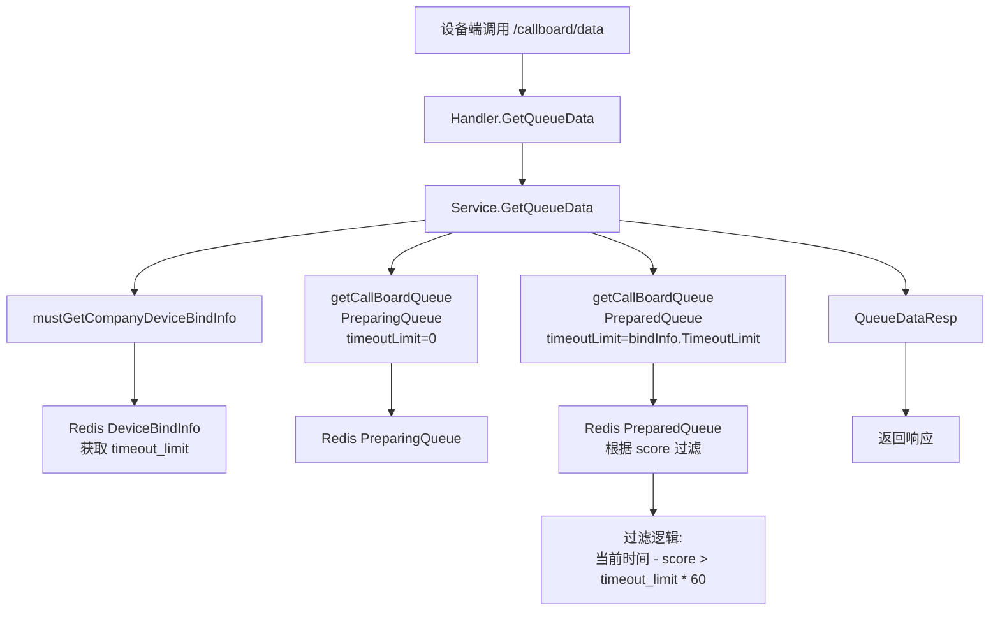

# 叫号系统-订单已完成自动消失（时间）设计文档

> 本文档定义 叫号系统-订单已完成自动消失（时间） 的技术设计和实现方案。

## 📋 概述

为叫号系统添加订单完成后自动消失功能，使用现有的 `timeout_limit` 配置项。当订单完成后超过设定的时间，自动从叫号系统显示屏上移除该订单的显示内容。

**技术实现**：
- 使用现有的 `timeout_limit` 字段（单位：分钟），无需新增字段或数据库迁移
- 订单完成时间从 `PreparedQueue` 的 score（Redis Sorted Set 的时间戳）获取
- 在 `/callboard/data` 接口中根据 `timeout_limit` 过滤 `PreparedQueue` 中的订单
- 过滤逻辑：`当前时间 - 订单完成时间(score) > timeout_limit * 60`（秒）

---

## 🎯 规范对齐

### Go Main 规范 (go-main.mdc)

- ✅ Service 只依赖其他 Service 接口（无需修改）
- ✅ Repository 只持有 db 实例（无需修改）
- ✅ URL 使用 snake_case（`/callboard/data`）
- ✅ data 字段必须是对象（响应结构已符合）
- ✅ 不使用 panic，返回 error（现有代码已遵循）

### API 设计规范 (api.mdc)

- ✅ URL 使用 snake_case（`/callboard/data`）
- ✅ 响应格式统一（`{code, message, data{}}`）
- ✅ data 不能为 null 或数组（响应结构已符合）
- ✅ 不影响现有接口行为（向后兼容）

### 数据库规范 (database.mdc)

- ✅ 无需数据库变更（使用现有 Redis 数据结构）
- ✅ 订单完成时间从 Redis Sorted Set 的 score 获取

---

## 🔄 代码复用分析

### 可复用的现有组件

- **callBoardService**: `main/app/service/callboard/service.go` - 叫号系统服务，已实现 `GetQueueData` 和 `getCallBoardQueue` 方法
- **DeviceBindInfo**: `main/app/service/callboard/service.go` - 设备绑定信息结构，已包含 `TimeoutLimit` 字段
- **mustGetCompanyDeviceBindInfo**: `main/app/service/callboard/service.go` - 获取设备绑定信息方法，已返回包含 `TimeoutLimit` 的 `DeviceBindInfo`
- **getCallBoardQueue**: `main/app/service/callboard/service.go` - 获取队列数据方法，需要扩展支持超时过滤

### 集成点

- **现有 API**: `/callboard/data` - 在获取 `PreparedQueue` 时应用过滤逻辑
- **Redis Sorted Set**: `PreparedQueue` 的 score 存储订单完成时间（Unix 时间戳）

---

## 🏗️ 架构设计

### 分层设计原则

**Go Main 三层架构**:

```
API 层 (Handler)
  ↓ 调用
Service 层 (callBoardService.GetQueueData)
  ↓ 读取
Redis 缓存 (DeviceBindInfo + Queue)
```

**依赖规则**:

- ✅ API 层调用 Service 层
- ✅ Service 层从 Redis 读取配置和队列数据
- ✅ 过滤逻辑在 Service 层实现
- ✅ 无需修改 Repository 层（无数据库操作）

### 架构图



### 模块划分

#### Go Main 模块

- **API 层**: `main/app/api/v1/callboard/handler.go` - 无需修改
- **Service 层**: `main/app/service/callboard/service.go` - 修改 `GetQueueData` 和 `getCallBoardQueue` 方法
- **DTO 层**: `main/app/dto/resp/callboard.go` - 无需修改

---

## 🗄️ 数据库设计

### 无需数据库变更

- 使用现有的 Redis 数据结构
- `PreparedQueue` 使用 Redis Sorted Set，score 为订单完成时间（Unix 时间戳，单位：秒）
- `DeviceBindInfo` 存储在 Redis Hash 中，已包含 `timeout_limit` 字段

**Redis Key**:
- `ttpos:binded_device:{device_id}` - 设备绑定信息（包含 `timeout_limit`）
- `ttpos:callboard:preparing_queue:{company_uuid}` - 制作中队列
- `ttpos:callboard:prepared_queue:{company_uuid}` - 制作完成队列（需要过滤）

---

## 📊 数据模型

### 现有数据结构

#### DeviceBindInfo（无需修改）

```go
// main/app/service/callboard/service.go
type DeviceBindInfo struct {
	// ... 其他字段
	TimeoutLimit *int `redis:"timeout_limit"` // 超时限制（分钟）
	// ... 其他字段
}
```

#### QueueDataResp（无需修改）

```go
// main/app/dto/resp/callboard.go
type QueueDataResp struct {
	// ... 其他字段
	PreparedQueue []string `json:"prepared_queue"` // 制作完成队列
	TimeoutLimit  *int     `json:"timeout_limit"`  // 超时限制（分钟）
	// ... 其他字段
}
```

---

## 🔌 API 设计

### RESTful API

#### API: 获取队列数据（扩展过滤逻辑）

**请求**: 无需修改

```
GET /api/v1/callboard/data
```

**响应**: 无需修改结构，但 `prepared_queue` 内容会根据 `timeout_limit` 过滤

```json
{
  "code": 0,
  "message": "success",
  "data": {
    "lang1": "zh",
    "lang2": "en",
    "update_time": 1702281600,
    "preparing_queue": ["ORDER001", "ORDER002"],
    "prepared_queue": ["ORDER003"],  // 已过滤超时订单
    "name": "WALLACE",
    "background_image_url": "",
    "timeout_limit": 5,  // 5分钟
    "voice_call_enabled": true,
    "call_count": 1
  }
}
```

**过滤逻辑**:
- 如果 `timeout_limit` 为 0 或 nil，返回所有 `PreparedQueue` 中的订单
- 如果 `timeout_limit` > 0，过滤掉 `当前时间 - 订单完成时间(score) > timeout_limit * 60` 的订单

---

## 💻 实现设计

### Service 层实现

#### 修改 `GetQueueData` 方法

**文件**: `main/app/service/callboard/service.go`

**修改点**:
1. 获取 `timeout_limit` 配置
2. 调用 `getCallBoardQueue` 时传递 `timeout_limit` 参数
3. `PreparingQueue` 传递 `timeout_limit = 0`（不过滤）
4. `PreparedQueue` 传递实际的 `timeout_limit` 值

**代码示例**:

```go
func (s *callBoardService) GetQueueData(ctx context.Context, companyUuid uint64, req req.GetQueueDataReq) (*resp.QueueDataResp, error) {
	bindInfo, err := s.mustGetCompanyDeviceBindInfo(companyUuid, req.DeviceId)
	if err != nil {
		return nil, err
	}

	// 获取 timeout_limit，nil 或 0 表示不过滤
	timeoutLimit := 0
	if bindInfo.TimeoutLimit != nil && *bindInfo.TimeoutLimit > 0 {
		timeoutLimit = *bindInfo.TimeoutLimit
	}

	// PreparingQueue 不进行过滤（传递 0）
	preparingQueue, err := s.getCallBoardQueue(
		cachekey.GetPreparingQueueKey(companyUuid),
		req.Limit,
		bindInfo.CreateTime,
		0, // timeoutLimit = 0，不过滤
	)
	if err != nil {
		return nil, err
	}

	// PreparedQueue 根据 timeout_limit 过滤
	preparedQueue, err := s.getCallBoardQueue(
		cachekey.GetPreparedQueueKey(companyUuid),
		req.Limit,
		bindInfo.CreateTime,
		timeoutLimit, // 传递实际的 timeout_limit
	)
	if err != nil {
		return nil, err
	}

	// ... 其余代码保持不变
}
```

#### 修改 `getCallBoardQueue` 方法

**文件**: `main/app/service/callboard/service.go`

**修改点**:
1. 增加 `timeoutLimit` 参数（单位：分钟）
2. 如果 `timeoutLimit > 0`，在过滤队列成员时根据 score（完成时间）进行过滤
3. 过滤条件：`当前时间 - score > timeoutLimit * 60`（秒）

**代码示例**:

```go
func (s *callBoardService) getCallBoardQueue(queueKey string, limit int64, minScore int64, timeoutLimit int) ([]string, error) {
	opt := &redis.ZRangeBy{
		Min:    strconv.FormatInt(minScore, 10),
		Max:    "+inf",
		Offset: 0,
		Count:  limit,
	}
	results, err := s.getRedisClient().ZRevRangeByScoreWithScores(context.Background(), queueKey, opt).Result()
	if err != nil {
		if errors.Is(err, redis.Nil) {
			return []string{}, nil
		}
		return nil, err
	}

	// 当前时间（Unix 时间戳，单位：秒）
	now := time.Now().Unix()
	// 超时时间阈值（秒）
	timeoutThreshold := int64(timeoutLimit * 60)

	// 收集所有有效的队列成员
	queueMembers := make([]queueMember, 0, len(results))
	for _, result := range results {
		str, _ := result.Member.(string)
		mem, ok := parseQueueMember(str)
		if !ok {
			continue
		}

		// 如果 timeoutLimit > 0，进行超时过滤
		if timeoutLimit > 0 {
			// score 是订单完成时间（Unix 时间戳，单位：秒）
			completedTime := int64(result.Score)
			// 如果订单完成时间超过超时阈值，跳过该订单
			if now-completedTime > timeoutThreshold {
				continue
			}
		}

		queueMembers = append(queueMembers, mem)
	}

	// 按照 CreateTime 从小到大排序
	sort.Slice(queueMembers, func(i, j int) bool {
		return queueMembers[i].CreateTime < queueMembers[j].CreateTime
	})

	// 提取排序后的 SerialNo
	serialNoList := make([]string, 0, len(queueMembers))
	for _, member := range queueMembers {
		serialNoList = append(serialNoList, member.SerialNo)
	}
	return serialNoList, nil
}
```

### 关键实现细节

#### 1. 时间单位转换

- `timeout_limit` 配置单位：分钟
- Redis score 单位：秒（Unix 时间戳）
- 过滤条件：`当前时间(秒) - 订单完成时间(秒) > timeout_limit(分钟) * 60`

#### 2. 向后兼容

- `timeout_limit` 为 nil 或 0 时，不进行过滤
- `PreparingQueue` 始终不进行过滤（传递 `timeoutLimit = 0`）
- 现有设备配置行为保持不变

#### 3. 性能优化

- 过滤逻辑在内存中进行，不影响 Redis 查询性能
- 使用 `ZRevRangeByScoreWithScores` 一次性获取所有数据，避免多次查询
- 过滤操作在获取数据后立即进行，减少不必要的数据处理

---

## 🧪 测试设计

### 单元测试

#### Service 层测试

**文件**: `main/app/service/callboard/service_test.go`（如不存在则创建）

**测试用例**:

1. **测试 timeout_limit 为 0 时不过滤**
   - 设置 `timeout_limit = 0`
   - 验证所有 `PreparedQueue` 订单都返回

2. **测试 timeout_limit > 0 时过滤超时订单**
   - 设置 `timeout_limit = 5`（分钟）
   - 创建完成时间分别为 2 分钟前、6 分钟前的订单
   - 验证只返回 2 分钟前的订单

3. **测试 timeout_limit 为 nil 时不过滤**
   - 设置 `timeout_limit = nil`
   - 验证所有 `PreparedQueue` 订单都返回

4. **测试 PreparingQueue 不受 timeout_limit 影响**
   - 设置 `timeout_limit = 5`
   - 验证 `PreparingQueue` 返回所有订单（不进行过滤）

5. **测试边界情况**
   - 订单完成时间刚好等于 `timeout_limit` 分钟
   - `PreparedQueue` 为空的情况

### 集成测试

**测试场景**:

1. **端到端流程测试**
   - 订单完成制作 → 进入 `PreparedQueue` → 超过 `timeout_limit` 后从接口返回中消失

2. **配置更新测试**
   - 修改设备 `timeout_limit` 配置 → 验证接口返回立即生效

---

## 🔒 安全设计

### 无新增安全风险

- 使用现有的认证和授权机制
- 过滤逻辑在服务端执行，客户端无法绕过
- 时间判断使用服务器时间，防止客户端时间篡改

---

## 📈 性能设计

### 性能影响分析

- **Redis 查询**: 无影响（查询逻辑不变）
- **内存处理**: 轻微增加（过滤逻辑在内存中执行）
- **响应时间**: 预计增加 < 5ms（过滤操作开销很小）

### 优化措施

- 过滤逻辑在获取数据后立即执行，避免处理不必要的数据
- 使用高效的数据结构（slice）进行过滤
- 考虑未来如果队列很大，可以在 Redis 查询时使用 `ZRangeByScore` 直接过滤

---

## 🔄 兼容性设计

### 向后兼容

- ✅ 现有设备配置（`timeout_limit` 为 nil 或 0）行为保持不变
- ✅ `PreparingQueue` 不受影响，始终返回所有订单
- ✅ API 响应结构不变，只是 `prepared_queue` 内容可能减少

### 迁移方案

- ✅ 无需数据迁移
- ✅ 无需配置迁移（使用现有配置）

---

## 📝 实现检查清单

- [ ] 修改 `GetQueueData` 方法，传递 `timeout_limit` 参数
- [ ] 修改 `getCallBoardQueue` 方法，增加 `timeoutLimit` 参数
- [ ] 实现过滤逻辑：`当前时间 - score > timeout_limit * 60`
- [ ] 处理 `timeout_limit` 为 nil 或 0 的情况
- [ ] 确保 `PreparingQueue` 不受过滤影响
- [ ] 编写单元测试
- [ ] 编写集成测试
- [ ] 性能测试验证

---

## 📚 参考资料

### 核心规范

- `.cursor/rules/go-main.mdc` - Go Main 核心约束
- `.cursor/rules/api.mdc` - API 设计规范
- `.cursor/rules/database.mdc` - 数据库开发规范

### 相关功能

- `story-callboard-data-config` - 叫号系统数据配置相关功能
- `docs/shared/specs/active/story-callboard-data-config/design.md` - 叫号系统数据配置设计文档

### 代码参考

- `main/app/service/callboard/service.go` - 叫号系统服务实现
- `main/app/dto/resp/callboard.go` - 响应 DTO 定义

---

**版本**: v1.0.0  
**创建日期**: 2025-12-11  
**作者**: 王昱  
**审核者**: {审核者}
