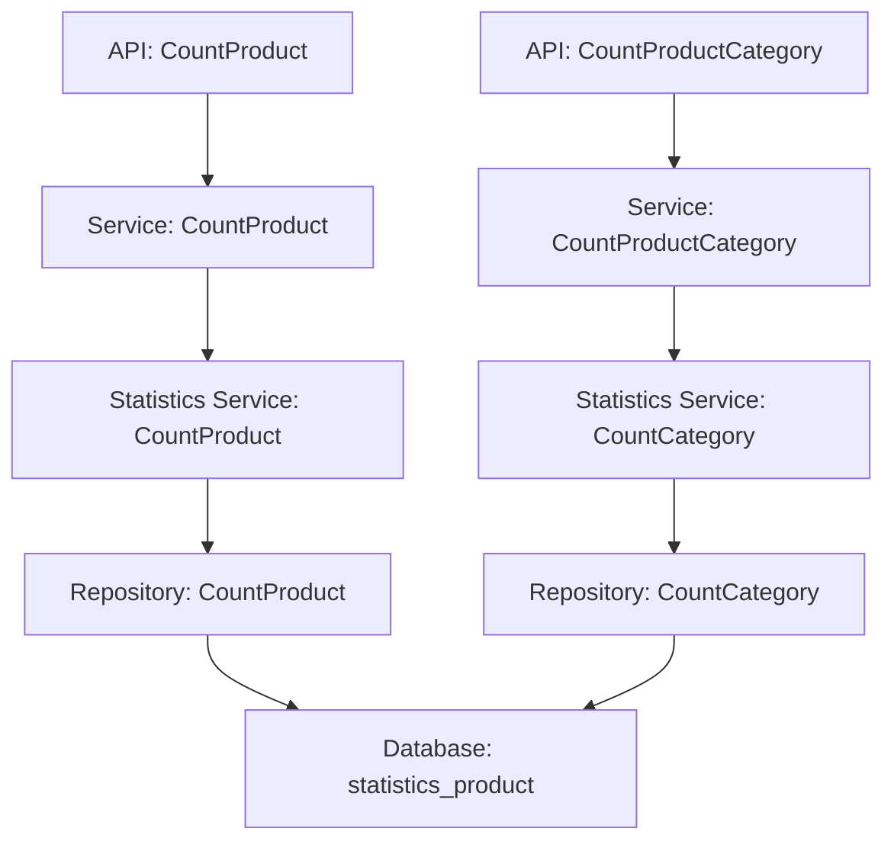

# （优化）收银机-营业数据按商品【合计】、按商品分类【销售额】取值调整 设计文档

> 本文档定义（优化）收银机-营业数据按商品【合计】、按商品分类【销售额】取值调整功能的技术设计和实现方案。

## 📋 概述

调整收银机营业数据统计中，按商品统计的【合计】字段和按商品分类统计的【销售额】字段的计算逻辑，从原价销售额改为实际销售额（不包含退款金额）。

**实现范围**：调整后端统计计算逻辑，确保退款金额正确扣减，与商家后台的实际销售额计算保持一致。

---

## 🎯 规范对齐

### Go Main 规范 (go-main.mdc)

- Service 只依赖其他 Service 接口
- Repository 只持有 db 实例
- URL 使用 snake_case
- data 字段必须是对象
- 不使用 panic，返回 error

### API 设计规范 (api.mdc)

- URL 使用 snake_case：`/cashier/statistics/product`、`/cashier/statistics/product_category`
- 响应格式统一：`{code, message, data{}}`
- data 不能为 null 或数组

### 数据库规范 (database.mdc)

- 无需新增数据库表或字段
- 仅调整统计查询逻辑，使用现有的 `refund_num` 字段
- 参考: `.cursor/rules/database.mdc` - 数据库开发规范

---

## 🔄 代码复用分析

### 可复用的现有组件

- **统计查询逻辑**: `main/app/repository/statistics.go` - `CountProduct`、`CountCategory` 方法
- **实际销售额计算逻辑**: `main/app/repository/statistics.go` - `CountProductSale` 方法中的 `actual_sale_amount` 计算逻辑
- **业务逻辑层**: `main/app/service/business.go` - `CountProduct`、`CountProductCategory` 方法
- **统计服务层**: `main/app/service/statistics.go` - `CountProduct`、`CountCategory` 方法

### 集成点

- **数据表**: 使用 `ttpos_statistics_product` 表，字段包括 `product_final_price`、`product_num`、`refund_num`、`free_num`、`give_num`
- **计算逻辑**: 参考 `CountProductSale` 方法中的实际销售额计算：`SUM(IF(sp.free_num > 0 OR sp.give_num > 0, 0, sp.product_final_price * (sp.product_num - sp.refund_num)))`

---

## 🏗️ 架构设计

### 分层设计原则

**Go Main 三层架构**:

```
API 层 (cashier_statistics.go)
  ↓ 依赖
业务层 (business.go)
  ↓ 依赖
统计服务层 (statistics.go)
  ↓ 依赖
数据层 (repository/statistics.go)
```

**依赖规则**:

- ✅ API 层依赖 Service 接口
- ✅ Service 层依赖统计 Service 接口
- ✅ Repository 层只持有 db 实例

### 架构图



### 模块划分

#### Go Main 模块

- **API 层**: `main/app/api/v1/cashier/cashier_statistics.go` - 无需修改（接口不变）
- **Service 层**: `main/app/service/business.go` - 无需修改（业务逻辑不变）
- **统计服务层**: `main/app/service/statistics.go` - 无需修改（服务层不变）
- **Repository 层**: `main/app/repository/statistics.go` - **需要修改**
  - `CountProduct` 方法：调整 `sale_amount` 计算逻辑
  - `CountCategory` 方法：调整 `sale_amount` 计算逻辑

---

## 🗄️ 数据库设计

### 数据表设计

无需新增数据库表或字段，使用现有的 `ttpos_statistics_product` 表。

#### 表结构：ttpos_statistics_product

**关键字段**:

| 字段 | 类型 | 说明 | 用途 |
|------|------|------|------|
| product_final_price | decimal(14,2) | 商品最终单价 | 用于计算销售额 |
| product_num | decimal(14,2) | 商品数量 | 用于计算销售额 |
| refund_num | decimal(14,2) | 退款数量 | 用于扣减退款 |
| free_num | decimal(14,2) | 免单数量 | 用于排除免单 |
| give_num | decimal(14,2) | 赠菜数量 | 用于排除赠菜 |

**计算逻辑**:

- **原价销售额**（当前）: `SUM(sp.product_final_price * sp.product_num)`
- **实际销售额**（调整后）: `SUM(IF(sp.free_num > 0 OR sp.give_num > 0, 0, sp.product_final_price * (sp.product_num - sp.refund_num)))`

**说明**:
- 排除免单和赠菜（`free_num > 0 OR give_num > 0`）
- 扣减退款数量（`product_num - refund_num`）
- 使用商品最终单价（`product_final_price`）

---

## 📊 数据模型

### Go Model

无需修改，使用现有的 `StatisticsProduct` 模型：

```go
// main/app/model/statistics.go
type StatisticsProduct struct {
    // ... 其他字段
    ProductFinalPrice float64 `gorm:"column:product_final_price"`
    ProductNum       float64 `gorm:"column:product_num"`
    RefundNum         float64 `gorm:"column:refund_num"`
    FreeNum           float64 `gorm:"column:free_num"`
    GiveNum           float64 `gorm:"column:give_num"`
    // ...
}
```

### DTO 定义

无需修改，使用现有的响应 DTO：

```go
// main/app/dto/resp/business_data_resp/base.go
type Product struct {
    Name     string  `json:"name"`
    SalesNum float64 `json:"sales_num"`
    Price    float64 `json:"price"`
    Subtotal float64 `json:"subtotal"`  // 合计（需要调整计算逻辑）
}

type Category struct {
    Name     string  `json:"name"`
    SalesNum float64 `json:"sales_num"`
    Prices   float64 `json:"prices"`  // 销售额（需要调整计算逻辑）
}
```

---

## 🔌 API 设计

### RESTful API

#### API 1: 统计商品

**请求**:

- **URL**: `/cashier/statistics/product`
- **Method**: `GET`
- **Headers**:
  ```json
  {
    "Authorization": "Bearer {token}",
    "Content-Type": "application/json"
  }
  ```
- **Query Parameters**:
  ```
  time_type=1&query_start_time=2025-12-01 00:00:00&query_end_time=2025-12-08 23:59:59
  ```

**响应**:

```json
{
  "code": 1,
  "message": "success",
  "data": {
    "products": [
      {
        "name": "商品名称",
        "sales_num": 10,
        "price": 50.00,
        "subtotal": 450.00  // 调整后：实际销售额（已扣减退款）
      }
    ],
    "opening_hours": "09:00-22:00"
  }
}
```

**变更说明**:
- `subtotal` 字段从原价销售额改为实际销售额（不包含退款）

#### API 2: 统计商品分类

**请求**:

- **URL**: `/cashier/statistics/product_category`
- **Method**: `GET`
- **Headers**: 同上

**响应**:

```json
{
  "code": 1,
  "message": "success",
  "data": {
    "sales_num": 100,
    "total_refund_money": 50.00,
    "total_received_price": 4500.00,
    "category_list": [
      {
        "name": "分类名称",
        "sales_num": 50,
        "prices": 2250.00  // 调整后：实际销售额（已扣减退款）
      }
    ],
    "payment_method_incomes": [],
    "opening_hours": "09:00-22:00"
  }
}
```

**变更说明**:
- `prices` 字段从原价销售额改为实际销售额（不包含退款）

---

## 🧩 组件和接口

### Repository 层

#### CountProduct 方法调整

**当前实现**:

```go
// main/app/repository/statistics.go
db.Table(statisticsProductTable).
    Select(
        // ...
        "SUM(sp.product_final_price * sp.product_num) AS sale_amount",
        // ...
    )
```

**调整后实现**:

```go
// main/app/repository/statistics.go
db.Table(statisticsProductTable).
    Select(
        // ...
        "SUM(IF(sp.free_num > 0 OR sp.give_num > 0, 0, sp.product_final_price * (sp.product_num - sp.refund_num))) AS sale_amount",
        // ...
    )
```

**说明**:
- 排除免单和赠菜（`free_num > 0 OR give_num > 0`）
- 扣减退款数量（`product_num - refund_num`）
- 使用商品最终单价（`product_final_price`）

#### CountCategory 方法调整

**当前实现**:

```go
// main/app/repository/statistics.go
db.Table(statisticsProductTable).
    Select(
        // ...
        "SUM(sp.product_final_price * sp.product_num) AS sale_amount",
        // ...
    )
```

**调整后实现**:

```go
// main/app/repository/statistics.go
db.Table(statisticsProductTable).
    Select(
        // ...
        "SUM(IF(sp.free_num > 0 OR sp.give_num > 0, 0, sp.product_final_price * (sp.product_num - sp.refund_num))) AS sale_amount",
        // ...
    )
```

**说明**:
- 与 `CountProduct` 方法使用相同的计算逻辑
- 确保按商品和按商品分类统计的数据一致性

---

## ⚡ 缓存设计

### Redis 缓存

**缓存策略**:

- **Key 命名**: `ttpos:statistics:product:{shop_uuid}:{time_type}:{start_time}:{end_time}`
- **过期时间**: 5 分钟
- **更新策略**: Cache-Aside Pattern

**说明**:
- 统计查询结果缓存，减少数据库压力
- 缓存失效策略：数据更新时清除相关缓存

---

## 🚨 错误处理

### 错误场景

#### 场景 1: 退款数量大于商品数量

- **处理方式**: SQL 的 `IF` 函数会自动处理，`product_num - refund_num` 不会为负数（退款数量不会超过商品数量）
- **用户影响**: 无影响，数据正常显示
- **代码示例**:
  ```sql
  -- refund_num 不会超过 product_num，由业务逻辑保证
  SUM(IF(sp.free_num > 0 OR sp.give_num > 0, 0, sp.product_final_price * (sp.product_num - sp.refund_num)))
  ```

#### 场景 2: 数据不一致

- **处理方式**: 确保计算逻辑与商家后台一致，进行数据对比测试
- **用户影响**: 统计数据与商家后台一致
- **缓解措施**: 充分测试，确保计算逻辑正确

---

## 🔒 安全设计

### 身份验证

- **JWT Token**: 所有 API 需要 Token 验证
- **权限控制**: 收银员只能查看本店铺数据

### 数据安全

- **SQL 注入防护**: 使用参数化查询
- **数据权限**: 基于店铺 UUID 过滤数据

---

## 🧪 测试策略

### 单元测试

**目标覆盖率**:

- Repository 层: 80%+
- **统计计算逻辑: 100%**（高风险）

**测试内容**:

- `CountProduct` 方法：测试退款扣减逻辑
- `CountCategory` 方法：测试退款扣减逻辑
- 测试免单和赠菜的排除逻辑
- 测试退款数量边界情况

**示例**:

```go
// main/app/repository/statistics_test.go
func TestCountProduct_RefundDeduction(t *testing.T) {
    // 测试退款扣减逻辑
    // 1. 正常商品，无退款
    // 2. 正常商品，有退款
    // 3. 免单商品，有退款
    // 4. 赠菜商品，有退款
}
```

### API 测试

**测试内容**:

- API 接口调用
- 响应格式验证
- 数据准确性验证

### 集成测试

**测试流程**:

- 创建订单并支付
- 执行单品退款
- 查询统计接口，验证退款扣减
- 执行整单退款
- 查询统计接口，验证退款扣减
- 对比商家后台数据，确保一致性

---

## 📈 性能优化

### 优化策略

1. **数据库优化**:
   - 使用现有索引（`sale_bill_uuid`、`product_bom_uuid` 等）
   - SQL 查询优化（使用 `IF` 函数，避免子查询）

2. **缓存优化**:
   - Redis 缓存统计查询结果
   - 缓存失效策略

3. **查询优化**:
   - 确保退款数量扣减计算不影响查询性能
   - 使用聚合函数，减少数据传输

### 性能指标

- 本地响应时间: < 500ms（现有性能要求）
- 数据库查询: < 100ms
- 缓存命中率: > 80%

---

## 📚 实现清单

### Phase 1: 代码实现

- [ ] 调整 `CountProduct` 方法的 `sale_amount` 计算逻辑
- [ ] 调整 `CountCategory` 方法的 `sale_amount` 计算逻辑
- [ ] 验证计算逻辑与商家后台一致

### Phase 2: 测试验证

- [ ] Repository 层单元测试
- [ ] API 集成测试
- [ ] 数据对比测试（与商家后台）

### Phase 3: 打印功能验证

- [ ] 检查打印模板数据来源
- [ ] 验证打印数据与调整后的接口数据一致

**详细任务**: 参见 `tasks.md`

---

## Graphiti & 活动日志

- Related Episode: `[待补充]`
- 模板：`docs/agent/templates/graphiti-episode.md`
- 活动日志：`docs/team/activities/{YYYY-MM}/{YYYY-MM-DD}.md`
- 在技术方案评审、关键架构决策或踩坑总结后，立即补充 Episode 并在设计文档尾部互链。

---

**版本**: v1.0.0  
**创建日期**: 2025-12-08  
**作者**: 王昱  
**审核者**: {审核者}

