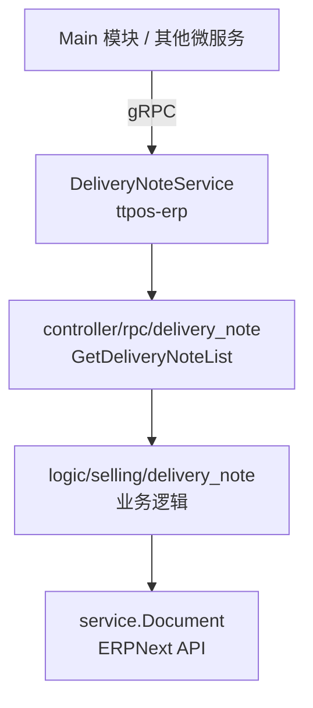

# story-erp-delivery-note-query 技术设计

## 概述

| 项目 | 内容 |
|------|------|
| Spec ID | story-erp-delivery-note-query |
| 设计人 | rikugun |
| 设计日期 | 2026-01-26 |
| 总 SP | 2 |

---

## 代码复用分析

### 可复用代码

| 文件 | 说明 | 复用方式 |
|------|------|---------|
| `ttpos-bmp/app/ttpos-erp/internal/logic/stock/delivery_note.go` | 送货单 Logic 层（GetDeliveryNoteList 方法已实现） | **迁移**到 selling 目录 |
| `ttpos-bmp/app/ttpos-erp/api/delivery_note/delivery_note.go` | 送货单请求/响应 DTO | 扩展添加 PoNo 字段 |
| `ttpos-bmp/app/ttpos-erp/manifest/protobuf/selling/selling.proto` | 现有 Selling 模块 proto | 参考结构 |

### 需要新建

| 文件 | 说明 |
|------|------|
| `ttpos-bmp/app/ttpos-erp/manifest/protobuf/selling/delivery_note.proto` | **新建** DeliveryNote 独立 proto 定义 |
| `ttpos-bmp/app/ttpos-erp/internal/controller/rpc/delivery_note/delivery_note.go` | **新建** DeliveryNote gRPC Controller |
| `ttpos-bmp/app/ttpos-erp/internal/logic/selling/delivery_note.go` | **迁移** Logic 从 stock 到 selling |

### 需要修改

| 文件 | 说明 |
|------|------|
| `ttpos-bmp/app/ttpos-erp/api/delivery_note/delivery_note.go` | GetDeliveryNoteListReq 添加 PoNo 字段 |
| `ttpos-bmp/app/ttpos-erp/internal/cmd/cmd.go` | 注册 DeliveryNoteService |
| `ttpos-bmp/app/ttpos-erp/internal/service/delivery_note.go` | 更新 service 注册指向新 Logic |

---

## 架构设计

### 架构图



### 分层说明

- **gRPC Layer**: `manifest/protobuf/selling/delivery_note.proto` - 独立接口定义
- **Controller Layer**: `internal/controller/rpc/delivery_note/delivery_note.go` - 独立控制器
- **Logic Layer**: `internal/logic/selling/delivery_note.go` - 业务逻辑（从 stock 迁移）
- **Service Layer**: `internal/service/` - 服务接口注册

### 设计决策

**为什么独立 proto 而不是扩展 StockService？**

1. **职责分离**：DeliveryNote（送货单）属于 Selling 领域，不是 Stock 领域
2. **可维护性**：独立 Service 便于后续扩展（如 CreateDeliveryNote、UpdateDeliveryNote）
3. **一致性**：与 ERPNext 的模块划分保持一致（Delivery Note 在 Stock 模块下，但业务上属于 Selling 流程）

**为什么将 Logic 从 stock 迁移到 selling？**

1. **目录一致性**：proto、controller、logic 都统一在 selling 领域下
2. **代码组织**：便于按业务领域查找和维护代码
3. **依赖清晰**：避免 selling 相关代码散落在 stock 目录中

---

## 组件和接口

### Proto 定义

**位置**: `manifest/protobuf/selling/delivery_note.proto`

```protobuf
syntax = "proto3";
import "erp.proto";

package delivery_note;

option go_package = "ttpos-bmp/app/ttpos-erp/api/delivery_note_pb";

// 送货单信息
message DeliveryNote {
  string name = 1;                    // 送货单号
  string company = 2;                 // 公司
  string customer = 3;                // 客户
  string customer_name = 4;           // 客户名称
  string posting_date = 5;            // 过账日期
  string posting_time = 6;            // 过账时间
  string set_warehouse = 7;           // 设置仓库
  string selling_price_list = 8;      // 销售价格表
  double total_qty = 9;               // 总数量
  double grand_total = 10;            // 总金额
  string status = 11;                 // 状态
  int32 docstatus = 12;               // 单据状态
  repeated DeliveryNoteItem items = 13; // 送货项
}

// 送货单明细项
message DeliveryNoteItem {
  string item_code = 1;               // 物品编码
  string item_name = 2;               // 物品名称
  double qty = 3;                     // 数量
  string uom = 4;                     // 单位
  double rate = 5;                    // 单价
  double amount = 6;                  // 金额
  string warehouse = 7;               // 仓库
  string against_sales_order = 8;     // 关联销售订单
}

// 获取送货单列表请求
message GetDeliveryNoteListReq {
  string company_abbr = 1;            // 公司缩写，必填
  string branch = 2;                  // 分支名称，可选
  string customer = 3;                // 客户，可选
  string warehouse = 4;               // 仓库，可选
  string status = 5;                  // 状态，可选
  string from_date = 6;               // 开始日期，可选
  string to_date = 7;                 // 结束日期，可选
  int32 limit = 8;                    // 查询限制数量，可选
  bool include_items = 9;             // 是否包含明细项，可选
  string po_no = 10;                  // 采购订单号，可选（通过关联销售订单反查）
}

// 获取送货单列表响应
message GetDeliveryNoteListResp {
  repeated DeliveryNote delivery_note_list = 1; // 送货单列表
}

// DeliveryNoteService 送货单服务定义
service DeliveryNoteService {
  // 获取送货单列表
  // 参数：查询条件，包含公司、客户、仓库、采购订单号等过滤条件
  // 返回：送货单列表
  rpc GetDeliveryNoteList(GetDeliveryNoteListReq) returns (erp.ResponseInfo);
}
```

### Controller 实现

**位置**: `internal/controller/rpc/delivery_note/delivery_note.go`

```go
package delivery_note

import (
    "context"
    "ttpos-bmp/app/ttpos-erp/api"
    pb "ttpos-bmp/app/ttpos-erp/api/delivery_note_pb"
    dto "ttpos-bmp/app/ttpos-erp/api/delivery_note"
    "ttpos-bmp/app/ttpos-erp/internal/controller/rpc"
    "ttpos-bmp/app/ttpos-erp/internal/service"

    "github.com/gogf/gf/contrib/rpc/grpcx/v2"
)

// Controller 送货单服务控制器
type Controller struct {
    pb.UnimplementedDeliveryNoteServiceServer
}

// Register 注册送货单服务到gRPC服务器
func Register(s *grpcx.GrpcServer) {
    pb.RegisterDeliveryNoteServiceServer(s.Server, &Controller{})
}

// GetDeliveryNoteList 获取送货单列表
// 参数：ctx 上下文，req 查询条件
// 返回：送货单列表和操作结果
func (*Controller) GetDeliveryNoteList(ctx context.Context, req *pb.GetDeliveryNoteListReq) (*api.ResponseInfo, error) {
    // 参数验证
    if len(req.CompanyAbbr) == 0 {
        return rpc.ApiError("公司简称不能为空"), nil
    }

    // 转换请求参数
    logicReq := &dto.GetDeliveryNoteListReq{
        CompanyAbbr:  req.CompanyAbbr,
        Branch:       req.Branch,
        Customer:     req.Customer,
        Warehouse:    req.Warehouse,
        Status:       req.Status,
        FromDate:     req.FromDate,
        ToDate:       req.ToDate,
        Limit:        req.Limit,
        IncludeItems: req.IncludeItems,
        PoNo:         req.PoNo,
    }

    // 调用 Logic 层
    resp, err := service.DeliveryNote().GetDeliveryNoteList(ctx, logicReq)
    if err != nil {
        return rpc.ApiError(err.Error()), nil
    }

    // 返回成功响应
    return rpc.ApiSuccessWithData("获取送货单列表成功", resp), nil
}
```

---

## 数据模型

### 需要扩展的 DTO

**位置**: `api/delivery_note/delivery_note.go`

```go
// GetDeliveryNoteListReq 获取送货单列表请求（扩展）
type GetDeliveryNoteListReq struct {
    CompanyAbbr  string `json:"company_abbr" v:"required#公司缩写不能为空"`
    Branch       string `json:"branch"`
    Customer     string `json:"customer"`
    Warehouse    string `json:"warehouse"`
    Status       string `json:"status"`
    FromDate     string `json:"from_date"`
    ToDate       string `json:"to_date"`
    Limit        int32  `json:"limit"`
    IncludeItems bool   `json:"include_items"`
    PoNo         string `json:"po_no"`  // 新增：采购订单号
}
```

### 复用现有结构

| 文件 | 结构体 | 说明 |
|------|--------|------|
| `api/delivery_note/delivery_note.go` | `GetDeliveryNoteListResp` | 响应数据 |
| `api/delivery_note/delivery_note.go` | `DeliveryNoteData` | 送货单数据 |
| `api/delivery_note/delivery_note.go` | `DeliveryNoteItemData` | 送货单明细 |

### po_no 查询逻辑

采购订单(PO) → 销售订单(SO) → 送货单(DN) 关联链路：

1. 通过 `po_no` 查询关联的内部销售订单
2. 通过销售订单号筛选送货单（使用 `against_sales_order` 字段）

---

## API 设计

### GetDeliveryNoteList

| 项目 | 内容 |
|------|------|
| Protocol | gRPC |
| Service | **DeliveryNoteService** |
| Method | GetDeliveryNoteList |
| 请求 | GetDeliveryNoteListReq |
| 响应 | erp.ResponseInfo (data: GetDeliveryNoteListResp) |

**请求参数**：

| 字段 | 类型 | 必填 | 说明 |
|------|------|------|------|
| company_abbr | string | 是 | 公司缩写 |
| branch | string | 否 | 分支名称 |
| customer | string | 否 | 客户 |
| warehouse | string | 否 | 仓库 |
| status | string | 否 | 状态 |
| from_date | string | 否 | 开始日期 (YYYY-MM-DD) |
| to_date | string | 否 | 结束日期 (YYYY-MM-DD) |
| limit | int32 | 否 | 查询限制 (默认 100，最大 1000) |
| include_items | bool | 否 | 是否包含明细项 |
| po_no | string | 否 | 采购订单号（通过关联销售订单反查） |

**响应示例**：

```json
{
  "code": 1,
  "message": "获取送货单列表成功",
  "data": {
    "delivery_note_list": [
      {
        "name": "DN-2026-00001",
        "company": "Test Company",
        "customer": "CUST-001",
        "customer_name": "测试客户",
        "posting_date": "2026-01-26",
        "total_qty": 10.0,
        "grand_total": 1000.00,
        "status": "To Bill",
        "items": [...]
      }
    ]
  }
}
```

---

## 风险识别

| 风险 | 影响 | 缓解措施 |
|------|------|---------|
| 送货单数据量大时查询性能受影响 | 中 | 已实现分页机制，limit 限制最大 1000 |
| include_items=true 时 N+1 查询 | 低 | 现有实现逐个获取明细，可接受；后续可优化批量查询 |
| 新建 Controller 需要注册 | 低 | 在 cmd.go 中添加注册代码 |

---

## 测试策略

**目标覆盖率**:
- Controller 层: 80%+

**测试用例**:
1. 正常查询 - 带 company_abbr 返回列表
2. 参数缺失 - company_abbr 为空返回错误
3. 筛选条件 - 按 customer/warehouse/status/日期范围筛选
4. 包含明细 - include_items=true 返回 items
5. po_no 查询 - 按采购订单号筛选关联送货单

**测试命令**:
```bash
cd ttpos-bmp/app/ttpos-erp && go test ./internal/controller/rpc/delivery_note/...
```
