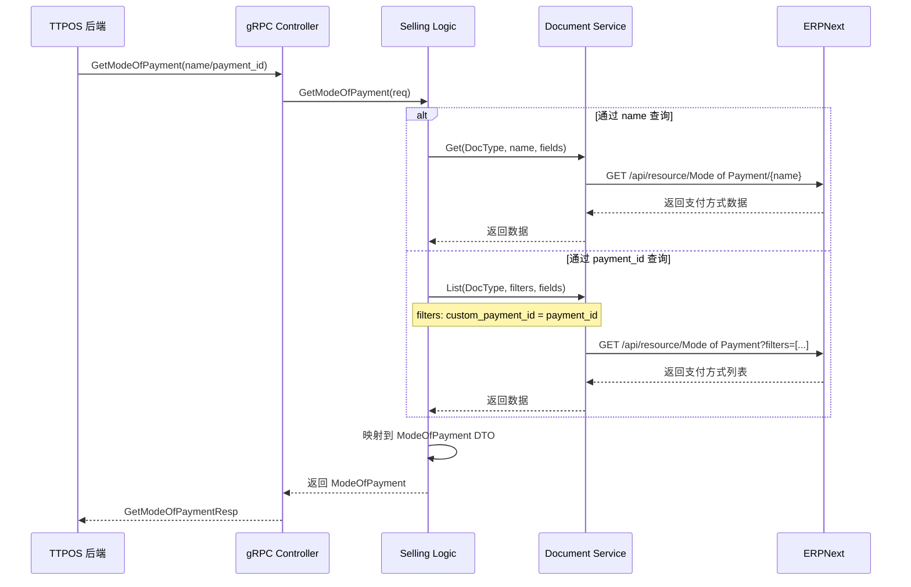
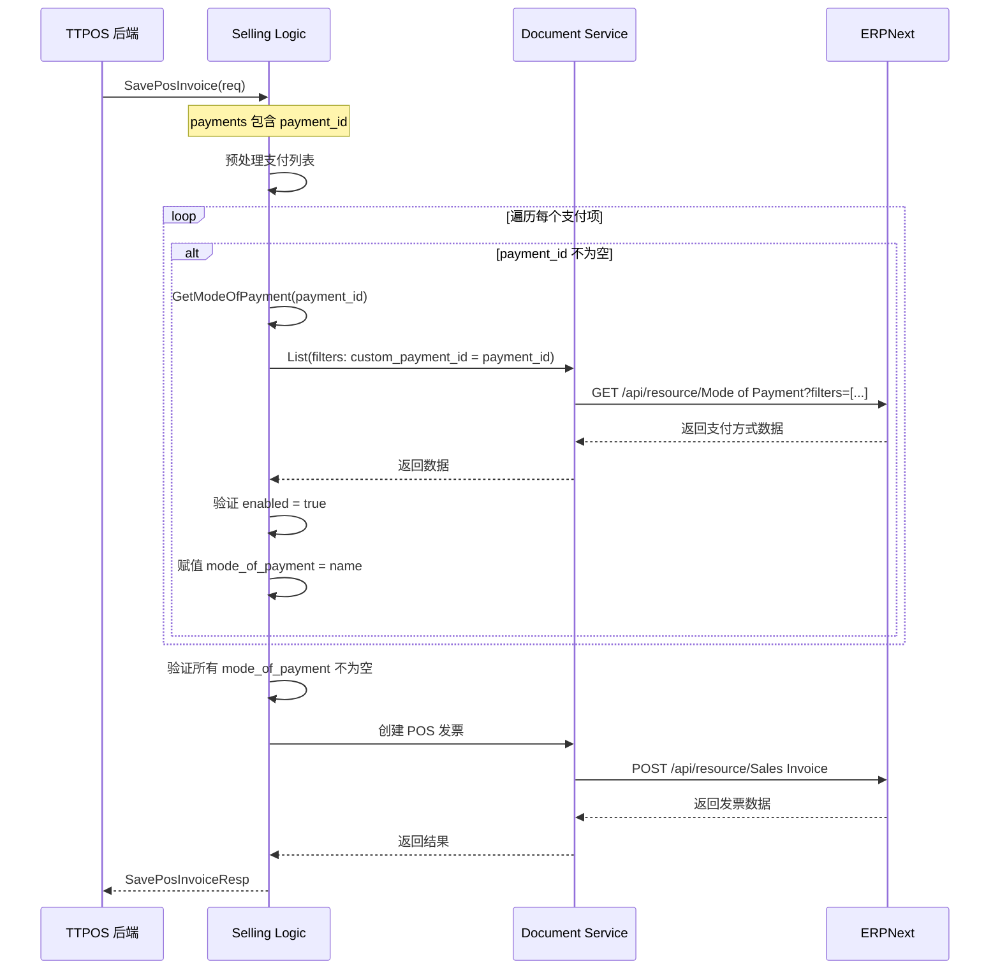
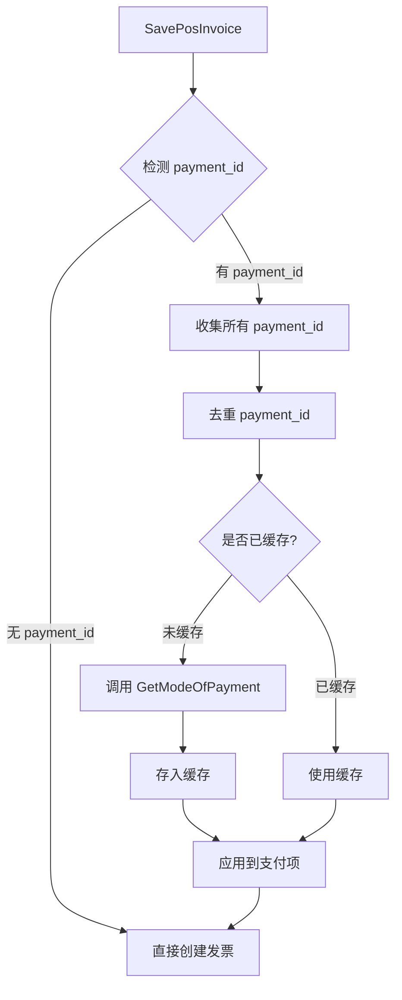

# ERP 支付方式 PaymentID 查询与自动解析 设计文档

> 本文档定义 ERP 支付方式 PaymentID 查询与自动解析功能的技术设计和实现方案。

## 📋 概述

本设计实现两个核心功能：

1. **GetModeOfPayment gRPC 接口**：支持通过 `name` 或 `payment_id` 查询单个支付方式
2. **POS 发票支付流程集成**：`SavePosInvoice` 自动解析 `payment_id` 为 `mode_of_payment`

**技术栈**：
- Go + GoFrame 2.x（ttpos-bmp/app/ttpos-erp 模块）
- gRPC + Protobuf 3
- ERPNext HTTP API（Document Service）

**模块位置**：
- Protobuf: `ttpos-bmp/app/ttpos-erp/manifest/protobuf/selling/selling.proto`
- Logic 层: `ttpos-bmp/app/ttpos-erp/internal/logic/selling/selling.go`
- Controller: `ttpos-bmp/app/ttpos-erp/internal/controller/rpc/selling.go`（自动生成）

---

## 🎯 规范对齐

### Go BMP 规范 (go-bmp.mdc)

本设计严格遵循 GoFrame 和 ttpos-bmp 开发规范：

- ✅ **框架使用**: GoFrame 2.x
- ✅ **禁止修改自动生成目录**: 不修改 `dao/`, `entity/`, `do/` 目录
- ✅ **DTO 定义**: 复用现有 `internal/model/dto/erp/selling.go` 中的 `ModeOfPayment`
- ✅ **服务集成**: 使用 `service.Document()` 与 ERPNext 交互
- ✅ **日志规范**: 使用 `g.Log()`，中文描述
- ✅ **错误处理**: 返回 error，不使用 panic

### Protobuf 规范 (proto-rules.mdc)

- ✅ **命名规范**: 请求消息以 `Req` 结尾，响应消息以 `Resp` 结尾
- ✅ **字段命名**: 使用 snake_case
- ✅ **注释规范**: 添加中文注释说明字段用途
- ✅ **可选字段**: 使用 `optional` 保持向后兼容

### ERPNext 集成规范 (erpnext.mdc)

- ✅ **不修改 ERPNext 源代码**: 所有逻辑在 ttpos-erp 模块实现
- ✅ **不使用 Server Scripts**: 通过代码实现
- ✅ **使用通用服务**: 通过 `service.Document()` 查询
- ✅ **遵循 DocType 规范**: 查询 `Mode of Payment` DocType

---

## 🔄 代码复用分析

### 可复用的现有组件

1. **ERPNext Document Service**: `ttpos-bmp/app/ttpos-erp/internal/logic/erpnext/document.go`
   - 复用 `Get()` 方法：通过 name 查询（主键查询）
   - 复用 `List()` 方法：通过 custom_payment_id 查询（Filter 查询）

2. **Selling Logic**: `ttpos-bmp/app/ttpos-erp/internal/logic/selling/selling.go`
   - 扩展 `sSelling` 结构体，新增 `GetModeOfPayment()` 方法
   - 修改 `SavePosInvoice()` 方法，集成 payment_id 自动解析

3. **ModeOfPayment DTO**: `ttpos-bmp/app/ttpos-erp/internal/model/dto/erp/selling.go`
   - 复用现有 `ModeOfPayment` 结构体（已包含 name, enabled, payment_id）

4. **UUID 工具**: `ttpos-bmp/utility/uuid/uuid.go`
   - 已在 `story-erp-mode-of-payments-paymentid` 中实现，无需修改

### 集成点

1. **Protobuf 集成**:
   - 新增 `GetModeOfPaymentReq` 和 `GetModeOfPaymentResp` 消息
   - 修改 `PosInvoicePayment` 消息，新增 `payment_id` 字段
   - 在 `SellingService` 中添加 `GetModeOfPayment` RPC 方法

2. **Logic 层集成**:
   - 在 `selling.go` 中实现 `GetModeOfPayment()` 方法
   - 修改 `SavePosInvoice()` 方法，在处理支付列表前解析 `payment_id`

3. **ERPNext 集成**:
   - 查询 `Mode of Payment` DocType 的 `custom_payment_id` 字段
   - 该字段已在 `story-erp-mode-of-payments-paymentid` 中添加

---

## 🏗️ 架构设计

### 分层设计原则

**Go BMP (GoFrame) 架构**:

```
gRPC Controller 层 (RPC)
  ↓ 调用
Logic 层 (Business Logic)
  ↓ 调用
Service 层 (ERPNext Service)
  ↓ HTTP API
ERPNext (外部系统)
```

**依赖规则**:
- ✅ Controller 只调用 Logic 接口
- ✅ Logic 只调用 Service 接口
- ✅ Service 封装 ERPNext HTTP API 调用
- ❌ 不跨层调用

### 架构图

#### 1. GetModeOfPayment 查询流程



#### 2. SavePosInvoice 支付流程（含 payment_id 解析）



### 性能优化：批量查询缓存



---

## 📐 数据模型设计

### Protobuf 消息定义

#### 1. GetModeOfPayment 查询接口

```protobuf
// GetModeOfPaymentReq 查询单个支付方式请求
message GetModeOfPaymentReq {
  optional string name = 1;       // 支付方式名称（精确匹配），与 payment_id 二选一
  optional string payment_id = 2; // 支付方式唯一标识（PaymentID），与 name 二选一
}

// GetModeOfPaymentResp 查询单个支付方式响应（复用 ResponseInfo）
// 实际返回通过 erp.ResponseInfo 包装
// data 字段包含 ModeOfPayment 对象
```

#### 2. PosInvoicePayment 消息修改

```protobuf
// PosInvoicePayment POS发票付款
message PosInvoicePayment {
  string mode_of_payment = 1; // 支付方式，与 payment_id 二选一（必填其中之一）
  double amount = 2;          // 金额，必填
  optional string payment_id = 3; // 支付方式唯一标识（PaymentID），与 mode_of_payment 二选一
  // 注意：当 payment_id 不为空时，系统自动调用 GetModeOfPayment 查询 mode_of_payment 值
}
```

**字段说明**：
- `mode_of_payment`: 支付方式名称（ERP 格式，如 `Cash-0001 - ABC`）
- `amount`: 支付金额
- `payment_id`: 支付方式唯一标识（如 `PID3704524594350081`）

**兼容性**：
- 新增 `payment_id` 字段为 `optional`，保持向后兼容
- 旧客户端只传递 `mode_of_payment` 仍可正常工作
- 新客户端可只传递 `payment_id`，由 ERP 自动解析

### ERPNext 数据结构

#### Mode of Payment DocType

```json
{
  "name": "Cash-0001 - ABC",           // 主键，唯一标识
  "enabled": 1,                        // 是否启用（1=启用，0=禁用）
  "custom_payment_id": "PID3704524594350081",  // 自定义字段：PaymentID
  "type": "Cash",                      // 支付类型
  "custom_company": "ABC Company",     // 自定义字段：公司
  "custom_branch": "Main Branch"       // 自定义字段：分支
}
```

**查询方式**：
1. **通过 name 查询**：`GET /api/resource/Mode of Payment/{name}`
2. **通过 custom_payment_id 查询**：`GET /api/resource/Mode of Payment?filters=[["custom_payment_id", "=", "PID..."]]`

---

## 🔌 API 设计

### gRPC 接口定义

#### 新增方法：GetModeOfPayment

```protobuf
service SellingService {
  // 查询单个支付方式
  rpc GetModeOfPayment (GetModeOfPaymentReq) returns (erp.ResponseInfo);
}
```

**请求参数**：
- `name` (optional): 支付方式名称
- `payment_id` (optional): PaymentID

**响应格式**：
```json
{
  "code": 0,
  "message": "Success",
  "data": {
    "name": "Cash-0001 - ABC",
    "enabled": true,
    "payment_id": "PID3704524594350081"
  }
}
```

**错误码**：
- `400`: 参数错误（name 和 payment_id 都未提供）
- `404`: 支付方式不存在
- `500`: ERPNext 查询失败

#### 修改方法：SavePosInvoice

**变更点**：
- `PosInvoicePayment` 新增 `payment_id` 字段
- 自动解析 `payment_id` 为 `mode_of_payment`

**请求示例**（新增 payment_id）：
```json
{
  "order_no": "ORD20251223001",
  "open_pos_entry_name": "POS-ABC-001",
  "payments": [
    {
      "payment_id": "PID3704524594350081",  // 新增：直接传 payment_id
      "amount": 100.00
    },
    {
      "mode_of_payment": "Cash-0001 - ABC",  // 兼容：仍可传 mode_of_payment
      "amount": 50.00
    }
  ]
}
```

**处理逻辑**：
1. 遍历 `payments` 列表
2. 如果 `payment_id` 不为空，调用 `GetModeOfPayment(payment_id)`
3. 验证支付方式 `enabled = true`
4. 赋值 `mode_of_payment = result.name`
5. 继续创建 POS 发票

---

## 💻 组件设计

### 1. Logic 层：GetModeOfPayment 实现

**文件**: `ttpos-bmp/app/ttpos-erp/internal/logic/selling/selling.go`

**方法签名**：
```go
func (s *sSelling) GetModeOfPayment(ctx context.Context, req *selling.GetModeOfPaymentReq) (*selling.ModeOfPayment, error)
```

**实现逻辑**：
```go
func (s *sSelling) GetModeOfPayment(ctx context.Context, req *selling.GetModeOfPaymentReq) (*selling.ModeOfPayment, error) {
    // 1. 参数校验
    if req.Name == "" && req.PaymentId == "" {
        return nil, gerror.New("name 或 payment_id 至少提供一个")
    }

    var modeOfPayment *selling.ModeOfPayment

    // 2. 通过 name 查询（主键，性能最优）
    if req.Name != "" {
        resp, err := service.Document().Get(ctx, erp.DocTypeModeOfPayment, req.Name, []string{
            "name", "enabled", "custom_payment_id",
        })
        if err != nil {
            return nil, gerror.Wrapf(err, "查询支付方式失败: name=%s", req.Name)
        }
        
        // 数据映射
        modeOfPayment = &selling.ModeOfPayment{
            Name:      resp.Get("name").String(),
            Enabled:   resp.Get("enabled").Int() == 1,
            PaymentId: resp.Get("custom_payment_id").String(),
        }
        
        return modeOfPayment, nil
    }

    // 3. 通过 payment_id 查询（Filter 查询）
    filters := [][]string{{"custom_payment_id", "=", req.PaymentId}}
    resp, err := service.Document().List(ctx, &erp.ErpReq{
        DocType: erp.DocTypeModeOfPayment,
    }, &erp.RequestParams{
        Fields:  []string{"name", "enabled", "custom_payment_id"},
        Filters: filters,
        Limit:   1,
    })
    if err != nil {
        return nil, gerror.Wrapf(err, "查询支付方式失败: payment_id=%s", req.PaymentId)
    }

    // 4. 检查结果
    dataArray := resp.Get("data").Array()
    if len(dataArray) == 0 {
        return nil, gerror.Newf("支付方式不存在: payment_id=%s", req.PaymentId)
    }

    // 5. 数据映射
    data := dataArray[0]
    modeOfPayment = &selling.ModeOfPayment{
        Name:      data.Get("name").String(),
        Enabled:   data.Get("enabled").Int() == 1,
        PaymentId: data.Get("custom_payment_id").String(),
    }

    return modeOfPayment, nil
}
```

**错误处理**：
- 参数缺失：返回 `gerror.New("name 或 payment_id 至少提供一个")`
- 支付方式不存在：返回 `gerror.Newf("支付方式不存在: payment_id=%s", req.PaymentId)`
- ERPNext 查询失败：使用 `gerror.Wrapf()` 包装错误

### 2. Logic 层：SavePosInvoice 支付流程集成

**文件**: `ttpos-bmp/app/ttpos-erp/internal/logic/selling/selling.go`

**方法修改点**：在 `SavePosInvoice` 方法开头添加支付项预处理逻辑

**实现逻辑**：
```go
func (s *sSelling) SavePosInvoice(ctx context.Context, req *selling.SavePosInvoiceReq) (*selling.SavePosInvoiceResp, error) {
    // 新增：支付项预处理 - 解析 payment_id
    if err := s.resolvePaymentIDs(ctx, req.Payments); err != nil {
        return nil, err
    }

    // 原有逻辑：创建 POS 发票...
    // ...
}

// resolvePaymentIDs 解析支付列表中的 payment_id
func (s *sSelling) resolvePaymentIDs(ctx context.Context, payments []*selling.PosInvoicePayment) error {
    // 1. 收集所有需要解析的 payment_id（去重）
    cache := make(map[string]string) // payment_id -> mode_of_payment
    
    for i, payment := range payments {
        // 2. 如果 payment_id 不为空，进行解析
        if payment.PaymentId != "" {
            // 检查缓存
            if modeOfPayment, cached := cache[payment.PaymentId]; cached {
                payment.ModeOfPayment = modeOfPayment
                continue
            }
            
            // 3. 调用 GetModeOfPayment 查询
            mopResp, err := s.GetModeOfPayment(ctx, &selling.GetModeOfPaymentReq{
                PaymentId: payment.PaymentId,
            })
            if err != nil {
                return gerror.Wrapf(err, "解析支付项 %d 的 payment_id 失败", i+1)
            }
            
            // 4. 验证支付方式是否启用
            if !mopResp.Enabled {
                return gerror.Newf("支付项 %d: 支付方式 %s 已禁用", i+1, mopResp.Name)
            }
            
            // 5. 赋值并缓存
            payment.ModeOfPayment = mopResp.Name
            cache[payment.PaymentId] = mopResp.Name
        }
        
        // 6. 验证 mode_of_payment 是否存在
        if payment.ModeOfPayment == "" {
            return gerror.Newf("支付项 %d: mode_of_payment 和 payment_id 至少提供一个", i+1)
        }
    }
    
    return nil
}
```

**性能优化**：
- 使用 `cache map[string]string` 缓存查询结果
- 相同 `payment_id` 只查询一次
- 减少 ERPNext API 调用次数

**错误处理**：
- `payment_id` 解析失败：返回详细错误信息，包含支付项索引
- 支付方式已禁用：返回业务错误
- `mode_of_payment` 和 `payment_id` 都未提供：返回参数错误

### 3. Controller 层（自动生成）

**文件**: `ttpos-bmp/app/ttpos-erp/internal/controller/rpc/selling.go`

Controller 层由 GoFrame 自动生成，无需手动修改。在执行 `gf gen service` 后自动更新。

**生成的方法签名**：
```go
func (c *cSelling) GetModeOfPayment(ctx context.Context, req *selling.GetModeOfPaymentReq) (res *erp.ResponseInfo, err error) {
    // 调用 Logic 层
    data, err := service.Selling().GetModeOfPayment(ctx, req)
    if err != nil {
        return rpc.ApiError(err.Error()), nil
    }
    return rpc.ApiSuccessWithData("查询成功", data), nil
}
```

---

## 🧪 测试策略

### 1. 单元测试

#### GetModeOfPayment 测试

**文件**: `ttpos-bmp/app/ttpos-erp/internal/logic/selling/selling_test.go`

**测试用例**：
1. **通过 name 查询 - 成功**
   - 提供有效的 name
   - 验证返回的 ModeOfPayment 对象
   
2. **通过 payment_id 查询 - 成功**
   - 提供有效的 payment_id
   - 验证返回的 ModeOfPayment 对象

3. **参数缺失 - 失败**
   - name 和 payment_id 都未提供
   - 验证返回参数错误

4. **支付方式不存在 - 失败**
   - 提供不存在的 name 或 payment_id
   - 验证返回 404 错误

#### SavePosInvoice 支付流程测试

**测试用例**：
1. **payment_id 自动解析 - 成功**
   - 提供 payment_id，不提供 mode_of_payment
   - 验证自动解析成功，POS 发票创建成功

2. **mode_of_payment 直接使用 - 成功**（向后兼容）
   - 只提供 mode_of_payment
   - 验证 POS 发票创建成功

3. **同时提供两者 - 优先使用 payment_id**
   - 同时提供 mode_of_payment 和 payment_id
   - 验证优先使用 payment_id

4. **都未提供 - 失败**
   - mode_of_payment 和 payment_id 都未提供
   - 验证返回参数错误

5. **payment_id 无效 - 失败**
   - 提供无效的 payment_id
   - 验证返回错误，POS 发票未创建

6. **支付方式已禁用 - 失败**
   - 提供的 payment_id 对应的支付方式 enabled = false
   - 验证返回业务错误

### 2. 集成测试

**测试流程**：
1. 创建测试支付方式（包含 custom_payment_id）
2. 调用 GetModeOfPayment(payment_id)
3. 验证返回正确的支付方式信息
4. 创建 POS 发票，使用 payment_id
5. 验证 POS 发票创建成功
6. 清理测试数据

### 3. 性能测试

**测试场景**：
1. **单个查询响应时间**
   - 通过 name 查询：< 100ms
   - 通过 payment_id 查询：< 200ms

2. **批量查询缓存效果**
   - 创建包含多个相同 payment_id 的 POS 发票
   - 验证只查询一次 ERPNext
   - 验证总响应时间增量 < 50ms/支付项

---

## 🔒 安全考虑

### 1. 参数校验

- ✅ 验证 name 和 payment_id 至少提供一个
- ✅ 验证 payment_id 格式（PID + 数字）
- ✅ 防止 SQL 注入（ERPNext API 自动处理）

### 2. 权限控制

- ✅ gRPC 接口需要身份验证（由框架统一处理）
- ✅ ERPNext API 调用使用授权 Token

### 3. 数据验证

- ✅ 验证支付方式 enabled = true
- ✅ 验证 mode_of_payment 不为空

---

## 📊 监控和日志

### 1. 日志记录

**关键操作日志**（使用 `g.Log()`，中文描述）：
```go
g.Log().Infof(ctx, "[GetModeOfPayment] 查询支付方式: name=%s, payment_id=%s", req.Name, req.PaymentId)
g.Log().Infof(ctx, "[SavePosInvoice] 解析 payment_id: %s -> mode_of_payment: %s", paymentID, modeOfPayment)
g.Log().Errorf(ctx, "[GetModeOfPayment] 查询失败: payment_id=%s, err=%v", req.PaymentId, err)
```

### 2. 性能监控

**关键指标**：
- GetModeOfPayment 响应时间
- SavePosInvoice 响应时间增量
- ERPNext API 调用次数
- 缓存命中率

---

## 📋 部署计划

### 1. 部署步骤

1. **更新 Protobuf 定义**
   ```bash
   cd ttpos-bmp/app/ttpos-erp
   gf gen pb
   ```

2. **更新 Service 接口**
   ```bash
   cd ttpos-bmp/app/ttpos-erp
   gf gen service
   ```

3. **运行测试**
   ```bash
   cd ttpos-bmp/app/ttpos-erp
   go test ./internal/logic/selling/...
   ```

4. **构建部署**
   ```bash
   cd ttpos-bmp/app/ttpos-erp
   go build -o bin/ttpos-erp main.go
   ```

### 2. 回滚计划

如果新功能出现问题：
- **向后兼容**：旧客户端不受影响（仍可只传 mode_of_payment）
- **快速回滚**：部署旧版本即可
- **数据无影响**：不涉及数据库表变更

---

## 🔗 相关资源

### 核心文件

- Protobuf: `ttpos-bmp/app/ttpos-erp/manifest/protobuf/selling/selling.proto`
- Logic: `ttpos-bmp/app/ttpos-erp/internal/logic/selling/selling.go`
- Service: `ttpos-bmp/app/ttpos-erp/internal/logic/erpnext/document.go`

### 参考规范

- `ttpos-bmp/.cursor/rules/go-rules.mdc` - Go BMP 开发规范
- `ttpos-bmp/.cursor/rules/proto-rules.mdc` - Protobuf 开发规范
- `ttpos-bmp/.cursor/rules/erpnext.mdc` - ERPNext 集成规范

### 关联 Spec

- `story-erp-mode-of-payments-paymentid` - PaymentID 字段新增（前置依赖）

---

**版本**: v1.0.0  
**创建日期**: 2025-12-23  
**作者**: rikugun  
**审核者**: 待指定

