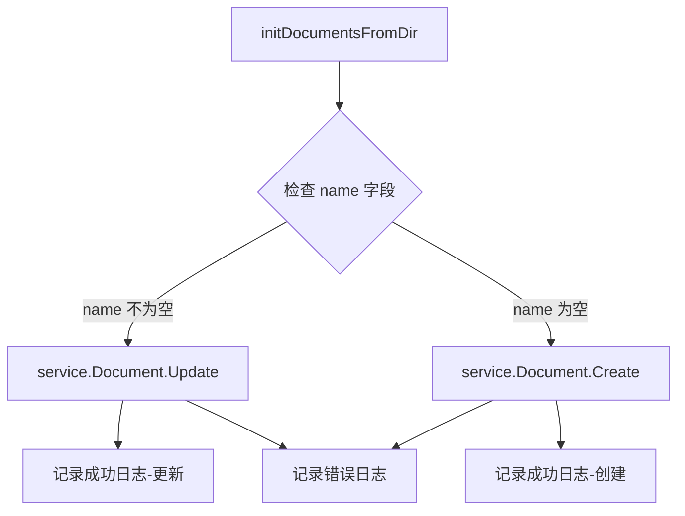

# ERP 文档初始化支持更新模式 设计文档

> 本文档定义 ERP 文档初始化支持更新模式 的技术设计和实现方案。

## 📋 概述

本功能是对 `ttpos-bmp/app/ttpos-erp/internal/logic/setup/setup.go` 中 `initDocumentsFromDir` 方法的优化，使其能够根据 JSON 数据中的 `name` 字段智能判断并执行创建或更新操作，实现 ERPNext 文档配置管理的幂等性。

**核心改进**：
- 增加条件判断逻辑，检查 JSON 数据中的 `name` 字段
- 根据 `name` 字段是否为空，决定调用 Create 或 Update 方法
- 保持向后兼容，不影响现有初始化流程

---

## 🎯 规范对齐

### Go BMP 规范 (go-bmp.mdc)

本设计完全遵循 GoFrame 开发规范：

- **框架遵循**: 使用 GoFrame 2.x 框架
- **代码组织**: 修改位于 `internal/logic/` 目录，符合 GoFrame 项目结构
- **禁止修改自动生成代码**: 不涉及 `dao/entity/do/` 目录
- **错误处理**: 不使用 panic，返回 error
- **注释规范**: 所有注释使用中文
- **日志规范**: 使用 `g.Log()` 记录日志，描述使用中文

### 规范参考

- `ttpos-bmp/.cursor/rules/go-rules.mdc` - GoFrame 开发规范
- `.cursor/rules/go-bmp.mdc` - Go BMP 微服务规范
- `.cursor/rules/structs.mdc` - 项目结构规范

---

## 🔄 代码复用分析

### 可复用的现有组件

- **`service.Document().Create()`**: `ttpos-bmp/app/ttpos-erp/internal/service/document.go` - 用于创建 ERPNext 文档
- **`service.Document().Update()`**: `ttpos-bmp/app/ttpos-erp/internal/service/document.go` - 用于更新 ERPNext 文档
- **现有错误处理和日志记录机制**: 保持现有的 `g.Log().Error()` 和 `g.Log().Infof()` 调用

### 集成点

- **`initDocumentsFromDir` 方法**: `ttpos-bmp/app/ttpos-erp/internal/logic/setup/setup.go` (第 485 行) - 本次修改的核心方法
- **调用方**: `InitErpDocTypeWithDirname`, `InitCustomFields`, `InitCustomers`, `InitModeOfPayment` 等方法 - 不需要修改

---

## 🏗️ 架构设计

### 分层设计原则

**GoFrame 分层架构**:

```
Controller 层
  ↓ 依赖
Logic 层 (业务逻辑) ← 本次修改在这里
  ↓ 依赖
Service 层 (Document 服务)
  ↓ 依赖
ERPNext API
```

### 模块位置

本次修改仅涉及 Logic 层的一个方法：

- **Logic 层**: `ttpos-bmp/app/ttpos-erp/internal/logic/setup/setup.go`
  - 修改方法: `initDocumentsFromDir()`
  - 调用服务: `service.Document().Create()` 和 `service.Document().Update()`

### 架构图



---

## 🗄️ 数据库设计

本需求不涉及数据库变更。

---

## 📊 数据模型

本需求不涉及新的数据模型。

使用现有的 JSON 数据结构：

```go
// JSON 文件内容示例（创建新文档）
{
    "doctype": "Custom Field",
    "label": "自定义字段",
    "fieldtype": "Data",
    // ... 其他字段
    // name 字段为空或不存在
}

// JSON 文件内容示例（更新已有文档）
{
    "name": "Custom Field-xxx",  // 文档名称，用于标识已存在的文档
    "doctype": "Custom Field",
    "label": "自定义字段（更新）",
    "fieldtype": "Data",
    // ... 其他字段
}
```

---

## 🔌 API 设计

本需求不涉及对外 API，为内部方法优化。

---

## 🧩 组件和接口

### Logic 层方法

#### 修改前的代码逻辑

```go
// ttpos-bmp/app/ttpos-erp/internal/logic/setup/setup.go (第 520 行)
// 调用service.Document.Create创建文档
if _, err := service.Document().Create(ctx, config.DocType, docData); err != nil {
    g.Log().Error(ctx, fmt.Sprintf("创建%s失败", config.ItemName), err, g.Map{"file": path, "data": docData})
    //return gerror.Wrapf(err, "创建%s失败: %s", config.ItemName, path)
}

g.Log().Infof(ctx, "%s创建成功: %s", config.ItemName, path)
```

#### 修改后的代码逻辑

```go
// ttpos-bmp/app/ttpos-erp/internal/logic/setup/setup.go (第 520 行)
// 检查 docData 中的 name 字段
docName, hasName := docData["name"].(string)

if hasName && docName != "" {
    // name 不为空，调用 Update 方法更新文档
    if _, err := service.Document().Update(ctx, config.DocType, docName, docData); err != nil {
        g.Log().Error(ctx, fmt.Sprintf("更新%s失败", config.ItemName), err, g.Map{"file": path, "data": docData})
    } else {
        g.Log().Infof(ctx, "%s更新成功: %s", config.ItemName, path)
    }
} else {
    // name 为空，调用 Create 方法创建文档
    if _, err := service.Document().Create(ctx, config.DocType, docData); err != nil {
        g.Log().Error(ctx, fmt.Sprintf("创建%s失败", config.ItemName), err, g.Map{"file": path, "data": docData})
    } else {
        g.Log().Infof(ctx, "%s创建成功: %s", config.ItemName, path)
    }
}
```

### 关键实现要点

1. **类型断言**：使用 `docData["name"].(string)` 进行类型断言，获取 `name` 字段
2. **空值检查**：检查 `hasName && docName != ""`，确保 name 存在且不为空字符串
3. **分支处理**：根据 name 是否为空，分别调用 Update 或 Create 方法
4. **日志记录**：
   - 成功时记录 Info 级别日志，明确标注"创建"或"更新"
   - 失败时记录 Error 级别日志，包含完整的错误信息和上下文
5. **错误处理**：保持现有机制，单个文件失败不中断整个流程

### Service.Document() 接口

#### Create 方法

```go
// service.Document().Create()
func (s *sDocument) Create(ctx context.Context, docType string, data interface{}) (*gjson.Json, error)
```

**参数**：
- `ctx`: 上下文对象
- `docType`: 文档类型（如 "Custom Field"）
- `data`: 文档数据（map[string]interface{}）

**返回**：
- `*gjson.Json`: 创建成功的文档数据
- `error`: 错误信息

#### Update 方法

```go
// service.Document().Update()
func (s *sDocument) Update(ctx context.Context, docType string, name string, data interface{}) (*gjson.Json, error)
```

**参数**：
- `ctx`: 上下文对象
- `docType`: 文档类型（如 "Custom Field"）
- `name`: 文档名称（用于标识要更新的文档）
- `data`: 文档数据（map[string]interface{}）

**返回**：
- `*gjson.Json`: 更新成功的文档数据
- `error`: 错误信息

---

## ⚡ 缓存设计

本需求不涉及缓存。

---

## 🚨 错误处理

### 错误场景

#### 场景 1: Update 方法调用失败

- **可能原因**: 
  - 文档不存在
  - ERPNext API 权限不足
  - 网络超时
  - 数据格式错误
- **处理方式**: 记录详细错误日志，继续处理其他文件
- **用户影响**: 在日志中看到错误信息，但不影响其他文档的处理
- **代码示例**:
  ```go
  if _, err := service.Document().Update(ctx, config.DocType, docName, docData); err != nil {
      g.Log().Error(ctx, fmt.Sprintf("更新%s失败", config.ItemName), err, g.Map{"file": path, "data": docData})
  }
  ```

#### 场景 2: Create 方法调用失败

- **可能原因**:
  - 文档已存在（重复创建）
  - 数据验证失败
  - 网络超时
- **处理方式**: 记录详细错误日志，继续处理其他文件
- **用户影响**: 在日志中看到错误信息，但不影响其他文档的处理
- **代码示例**:
  ```go
  if _, err := service.Document().Create(ctx, config.DocType, docData); err != nil {
      g.Log().Error(ctx, fmt.Sprintf("创建%s失败", config.ItemName), err, g.Map{"file": path, "data": docData})
  }
  ```

#### 场景 3: 类型断言失败

- **可能原因**: JSON 数据中 name 字段不是 string 类型
- **处理方式**: `hasName` 为 false，走创建分支
- **用户影响**: 无影响，按创建逻辑处理
- **代码示例**:
  ```go
  docName, hasName := docData["name"].(string)
  if hasName && docName != "" {
      // Update 分支
  } else {
      // Create 分支（包含类型断言失败的情况）
  }
  ```

---

## 🔒 安全设计

### 文件路径安全

- **路径遍历防护**: 使用 `filepath.Walk()` 遍历目录，不接受外部路径输入
- **文件类型验证**: 只处理 `.json` 扩展名的文件

### 日志安全

- **敏感信息保护**: 日志中不记录敏感配置信息
- **错误信息完整性**: 记录完整的错误上下文，便于排查问题

---

## 🧪 测试策略

### 单元测试

**目标覆盖率**: 80%+

**测试用例**:

1. **测试创建新文档**
   - 输入: JSON 数据不包含 `name` 字段
   - 预期: 调用 `Create` 方法，记录"创建成功"日志

2. **测试更新已有文档**
   - 输入: JSON 数据包含 `name` 字段且不为空
   - 预期: 调用 `Update` 方法，记录"更新成功"日志

3. **测试 name 为空字符串**
   - 输入: JSON 数据包含 `name` 字段但值为 `""`
   - 预期: 调用 `Create` 方法

4. **测试 name 字段类型错误**
   - 输入: JSON 数据包含 `name` 字段但类型不是 string
   - 预期: 类型断言失败，调用 `Create` 方法

5. **测试 Update 失败**
   - 输入: 模拟 Update 方法返回错误
   - 预期: 记录错误日志，继续处理

6. **测试 Create 失败**
   - 输入: 模拟 Create 方法返回错误
   - 预期: 记录错误日志，继续处理

### 集成测试

**测试流程**:

1. **首次执行初始化**
   - 准备 JSON 文件（不包含 name 字段）
   - 执行 `initDocumentsFromDir`
   - 验证文档创建成功

2. **重复执行初始化**
   - 修改 JSON 文件（添加 name 字段）
   - 再次执行 `initDocumentsFromDir`
   - 验证文档更新成功

3. **混合场景**
   - 准备多个 JSON 文件，部分包含 name，部分不包含
   - 执行 `initDocumentsFromDir`
   - 验证创建和更新都成功

### 手动测试

**测试环境**: 开发环境

**测试步骤**:

1. 准备测试 JSON 文件
2. 执行初始化命令
3. 检查 ERPNext 系统中的文档状态
4. 检查日志输出
5. 修改 JSON 文件，添加 name 字段
6. 再次执行初始化命令
7. 验证文档更新成功

---

## 📈 性能优化

### 性能影响分析

本次修改对性能的影响：

1. **增加的开销**:
   - 类型断言: 微秒级别（可忽略）
   - 条件判断: 微秒级别（可忽略）
   - 一个 Update API 调用（如果 name 不为空）

2. **性能保持不变**:
   - 文件读取时间
   - JSON 解析时间
   - Create/Update API 调用时间（单个调用）

3. **性能优化**:
   - 无需手动删除已有文档再重新创建
   - 支持增量更新，减少数据传输

### 性能指标

- **文件处理时间**: 保持不变
- **单个文档操作时间**: Create ≈ Update（取决于 ERPNext API）
- **整体初始化时间**: 无显著变化

---

## 🌐 浏览器兼容性

本需求不涉及前端。

---

## 📚 实现清单

### Phase 1: 代码实现

- [x] 修改 `initDocumentsFromDir` 方法
  - File: `ttpos-bmp/app/ttpos-erp/internal/logic/setup/setup.go` (第 520 行)
  - 添加 name 字段检查逻辑
  - 添加条件分支（Create / Update）
  - 更新日志记录

- [x] 更新方法注释
  - File: `ttpos-bmp/app/ttpos-erp/internal/logic/setup/setup.go` (第 477 行)
  - 说明方法支持创建和更新两种模式

### Phase 2: 测试验证

- [ ] 编写单元测试
  - File: `ttpos-bmp/app/ttpos-erp/internal/logic/setup/setup_test.go`
  - 测试用例覆盖率 ≥ 80%

- [ ] 手动测试
  - 在开发环境执行初始化流程
  - 验证创建和更新两种场景

- [ ] 集成测试
  - 测试重复执行初始化
  - 测试混合场景（创建 + 更新）

### Phase 3: 文档更新

- [ ] 更新代码注释
  - 说明新增的功能
  - 标注 JSON 文件格式要求

- [ ] 更新 README（如需要）
  - 说明初始化流程的幂等性
  - 提供 JSON 文件示例

**详细任务**: 参见 `tasks.md`

---

## Graphiti & 活动日志

- Related Episode: `[待补充]`
- 模板：`docs/agent/templates/graphiti-episode.md`
- 活动日志：`docs/team/activities/2026-01/2026-01-04.md`
- 在实现过程中若遇到 ERPNext API 的特殊行为或需要注意的点，及时记录 Episode。

---

**版本**: v1.0.0  
**创建日期**: 2026-01-04  
**作者**: rikugun  
**审核者**: rikugun

