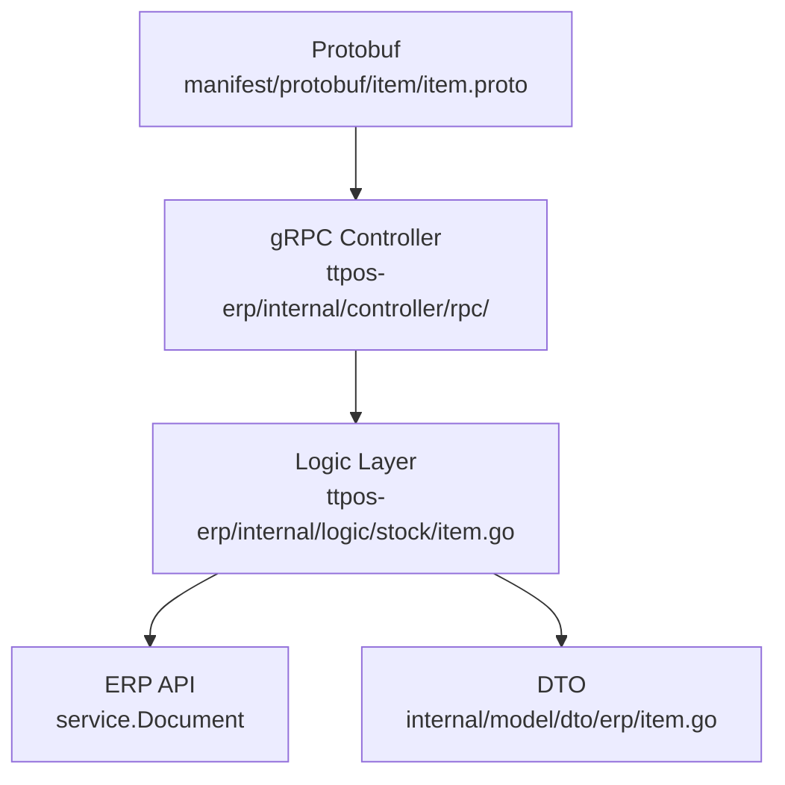

# story-erp-item-sales-uom 技术设计

## 📋 概述

| 项目       | 内容                       |
| ---------- | -------------------------- |
| Spec ID    | story-erp-item-sales-uom   |
| 设计人     | rikugun                    |
| 设计日期   | 2026-01-16                 |
| 总 SP      | 2                          |

---

## 🔄 代码复用分析

### 可复用代码

| 文件                                                      | 说明                   | 复用方式 |
| --------------------------------------------------------- | ---------------------- | -------- |
| `ttpos-bmp/app/ttpos-erp/internal/logic/stock/item.go`    | 现有 Item 服务逻辑     | 扩展     |
| `ttpos-bmp/app/ttpos-erp/internal/model/dto/erp/item.go`  | Item DTO 结构体        | 扩展     |
| `ttpos-bmp/app/ttpos-erp/manifest/protobuf/item/item.proto` | ItemInfo protobuf 定义 | 扩展     |

### 需要新建

无需新建文件，仅在现有文件中扩展字段。

---

## 🏗️ 架构设计

### 架构图



### 分层说明

- **Protobuf Layer**: `manifest/protobuf/item/item.proto` - 接口定义
- **Controller Layer**: `internal/controller/rpc/` - gRPC Handler（自动生成，无需修改）
- **Logic Layer**: `internal/logic/stock/item.go` - 业务逻辑实现
- **DTO Layer**: `internal/model/dto/erp/item.go` - 数据传输对象

---

## 🧩 组件和接口

### 修改点 1: item.proto - ItemInfo 消息

**位置**: `ttpos-bmp/app/ttpos-erp/manifest/protobuf/item/item.proto`

**变更**: 在 `ItemInfo` 消息中新增字段

```protobuf
message ItemInfo {
  // ... 现有字段 ...
  string purchase_uom = 20; // 默认采购单位，可选
  // 新增字段
  optional string sales_uom = 26; // 销售单位，可选
  // ... 其他字段 ...
}
```

**字段编号**: 使用 26（在 `allow_negative_stock = 25` 之后）

### 修改点 2: erp/item.go - Item DTO

**位置**: `ttpos-bmp/app/ttpos-erp/internal/model/dto/erp/item.go`

**变更**: 在 `Item` 结构体中新增字段

```go
type Item struct {
    // ... 现有字段 ...
    PurchaseUom string `json:"purchase_uom,omitempty"` // 采购单位
    SalesUom    string `json:"sales_uom,omitempty"`    // 销售单位（新增）
    // ... 其他字段 ...
}
```

### 修改点 3: stock/item.go - Logic 层

**位置**: `ttpos-bmp/app/ttpos-erp/internal/logic/stock/item.go`

**变更**:

1. `queryItemList()` - 在 Fields 中添加 `"sales_uom"` 并映射到返回结果
2. `buildUpdateItemData()` - 添加 `sales_uom` 字段处理
3. `buildNewItemData()` - 添加 `sales_uom` 字段处理

---

## 📊 数据模型

### ERP Item 字段映射

| TTPOS 字段   | ERP 字段    | 类型   | 说明       |
| ------------ | ----------- | ------ | ---------- |
| stock_uom    | stock_uom   | string | 库存单位   |
| purchase_uom | purchase_uom | string | 采购单位   |
| sales_uom    | sales_uom   | string | 销售单位（新增） |

---

## 🔌 API 设计

### 影响的 RPC 方法

| 方法         | 变更说明                           |
| ------------ | ---------------------------------- |
| GetItemList  | 返回结果中包含 sales_uom 字段      |
| GetItem      | 返回结果中包含 sales_uom 字段      |
| SaveItem     | 支持保存 sales_uom 字段            |

### 请求/响应示例

**GetItemList 响应**:
```json
{
  "item_list": [
    {
      "item_code": "PROD-001",
      "item_name": "商品A",
      "stock_uom": "箱",
      "purchase_uom": "箱",
      "sales_uom": "瓶"
    }
  ]
}
```

**SaveItem 请求**:
```json
{
  "item_code": "PROD-001",
  "item_name": "商品A",
  "stock_uom": "箱",
  "sales_uom": "瓶"
}
```

---

## ⚠️ 风险识别

| 风险                   | 影响 | 缓解措施                                      |
| ---------------------- | ---- | --------------------------------------------- |
| 现有调用方未适配新字段 | 低   | 使用 `optional` 关键字，向后兼容              |
| ERP 系统不支持该字段   | 低   | 需确认 ERP 系统已有 sales_uom 字段            |

---

## 🧪 测试策略

**测试要点**:
1. GetItemList 返回 sales_uom 字段（有值时返回，无值时为空）
2. GetItem 返回 sales_uom 字段
3. SaveItem 正确保存 sales_uom 字段
4. SaveItem 未传 sales_uom 时不影响其他字段

**测试命令**:
```bash
cd ttpos-bmp/app/ttpos-erp && go test ./internal/logic/stock/... -v
```

---

**版本**: v1.0.0
