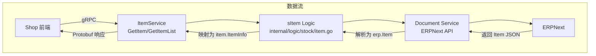

# story-erp-item-supplier-fields 技术设计

## 📋 概述

| 项目 | 内容 |
|------|------|
| Spec ID | story-erp-item-supplier-fields |
| 设计人 | rikugun |
| 设计日期 | 2026-01-26 |
| 总 SP | 3 |

---

## 🔄 代码复用分析

### 可复用代码

| 文件 | 说明 | 复用方式 |
|------|------|---------|
| `ttpos-bmp/app/ttpos-erp/internal/model/dto/erp/item.go` | `erp.Item.DeliveredBySupplier` 字段已存在 | 直接使用 |
| `ttpos-bmp/app/ttpos-erp/internal/model/dto/erp/item.go` | `erp.Item.SupplierItems` 字段已存在 | 需改类型 |
| `ttpos-bmp/app/ttpos-erp/internal/logic/stock/item.go` | `sItem.GetItem` 和 `GetItemList` 方法 | 扩展 |

### 需要新建/修改

| 文件 | 说明 |
|------|------|
| `ttpos-bmp/app/ttpos-erp/manifest/protobuf/item/item.proto` | 新增 `delivered_by_supplier`、`supplier_items` 字段和 `SupplierItem` message |
| `ttpos-bmp/app/ttpos-erp/internal/model/dto/erp/item.go` | 新增 `ItemSupplier` 结构体，修改 `SupplierItems` 类型 |
| `ttpos-bmp/app/ttpos-erp/internal/logic/stock/item.go` | 修改 `queryItemList` 方法添加字段映射 |

---

## 🏗️ 架构设计

### 架构图



### 分层说明

| 层级 | 位置 | 职责 |
|------|------|------|
| **API Layer** | `ttpos-bmp/app/ttpos-erp/api/item/` | Protobuf 定义，自动生成 |
| **Controller** | `ttpos-bmp/app/ttpos-erp/internal/controller/` | HTTP/gRPC 入口，自动生成 |
| **Logic Layer** | `ttpos-bmp/app/ttpos-erp/internal/logic/stock/item.go` | 业务逻辑，手动编写 |
| **DTO Layer** | `ttpos-bmp/app/ttpos-erp/internal/model/dto/erp/item.go` | ERPNext 数据映射 |

---

## 🧩 组件和接口

### Service: sItem

**位置**: `ttpos-bmp/app/ttpos-erp/internal/logic/stock/item.go`

**受影响方法**:

```go
// GetItem 获取单个商品信息（含供应商字段）
func (s *sItem) GetItem(ctx context.Context, req *item.GetItemReq) (res *erp.Item, err error)

// GetItemList 获取商品列表（每个 ItemInfo 含供应商字段）
func (s *sItem) GetItemList(ctx context.Context, req *item.GetItemListReq) (res *item.GetItemListResp, err error)
```

**修改点**:
- `queryItemList` 方法（第 128 行）：在构建 `item.ItemInfo` 时添加 `DeliveredBySupplier` 和 `SupplierItems` 字段映射

---

## 📊 数据模型

### Protobuf: ItemInfo 扩展

**位置**: `ttpos-bmp/app/ttpos-erp/manifest/protobuf/item/item.proto`

```protobuf
message ItemInfo {
  // ... existing fields (1-26) ...
  bool delivered_by_supplier = 27;           // 是否由供应商直接配送
  repeated SupplierItem supplier_items = 28; // 关联的供应商列表
}

message SupplierItem {
  string supplier = 1; // 供应商名称
  int32 idx = 2;       // 排序索引
}
```

### DTO: ItemSupplier 新增

**位置**: `ttpos-bmp/app/ttpos-erp/internal/model/dto/erp/item.go`

```go
// ItemSupplier 供应商商品关联信息
type ItemSupplier struct {
    Name       string `json:"name,omitempty"`       // ERPNext 内部 ID
    Supplier   string `json:"supplier,omitempty"`   // 供应商名称
    Idx        int    `json:"idx,omitempty"`        // 排序索引
    Parent     string `json:"parent,omitempty"`     // 父级商品编码
    Parenttype string `json:"parenttype,omitempty"` // 父级类型
    Doctype    string `json:"doctype,omitempty"`    // 文档类型
}
```

### DTO: Item 修改

```go
type Item struct {
    // ... existing fields ...
    SupplierItems []ItemSupplier `json:"supplier_items,omitempty"` // 从 []interface{} 改为 []ItemSupplier
}
```

---

## 🔌 API 设计

### GetItem

| 项目 | 内容 |
|------|------|
| Method | gRPC |
| Service | ItemService |
| 请求 | `item.GetItemReq` |
| 响应 | `erp.ResponseInfo` (包含 `item.GetItemResp`) |
| 新增字段 | `delivered_by_supplier`, `supplier_items` |

### GetItemList

| 项目 | 内容 |
|------|------|
| Method | gRPC |
| Service | ItemService |
| 请求 | `item.GetItemListReq` |
| 响应 | `erp.ResponseInfo` (包含 `item.GetItemListResp`) |
| 新增字段 | 每个 `ItemInfo` 包含 `delivered_by_supplier`, `supplier_items` |

---

## ⚠️ 风险识别

| 风险 | 影响 | 缓解措施 |
|------|------|---------|
| ERPNext 接口返回格式变更 | 中 | 增加字段校验和默认值处理，`supplier_items` 为空时返回空数组 |
| 批量查询性能影响 | 中 | 当前实现已在 `GetItemList` 中逐个调用 `GetItem`，供应商字段已包含在返回数据中，无额外查询开销 |
| DTO 类型变更导致兼容性问题 | 低 | `[]interface{}` 改为 `[]ItemSupplier` 为向下兼容，JSON 解析自动适配 |

---

## 🧪 测试策略

### 测试范围

| 测试类型 | 文件 | 覆盖目标 |
|---------|------|---------|
| 单元测试 | `ttpos-bmp/app/ttpos-erp/internal/logic/stock/item_test.go` | 字段映射逻辑 |
| 集成测试 | 手动/自动化 | 接口返回值验证 |

### 测试用例

1. **GetItem 正常返回**
   - WHEN 调用 GetItem 查询有供应商的商品
   - THEN 返回 `delivered_by_supplier=true` 和非空 `supplier_items`

2. **GetItem 无供应商**
   - WHEN 调用 GetItem 查询无供应商的商品
   - THEN 返回 `delivered_by_supplier=false` 和空 `supplier_items` 数组

3. **GetItemList 批量返回**
   - WHEN 调用 GetItemList 查询商品列表
   - THEN 每个 ItemInfo 包含供应商字段

### 测试命令

```bash
cd ttpos-bmp/app/ttpos-erp && make run  # 启动服务
# 使用 grpcurl 或 Postman 测试接口
```

---

**版本**: v1.0.0
**创建日期**: 2026-01-26
