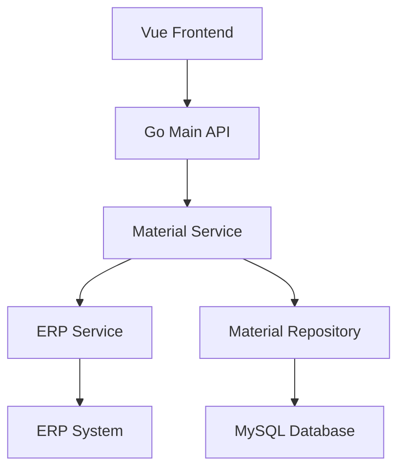

# 物品负库存控制 设计文档

> 本文档定义物品负库存控制功能的技术设计和实现方案。

## 📋 概述

在物品管理功能中增加"允许负库存"的设置选项，允许商户针对不同物品配置是否允许负库存。该功能涉及数据库字段添加、API 接口更新、ERP 同步逻辑完善和前端 UI 组件开发。

**技术栈**：
- Go Main 模块：API 接口和业务逻辑
- PHP Admin 模块：数据库迁移和模型更新
- Vue 前端模块：UI 组件开发

---

## 🎯 规范对齐

### Go Main 规范 (go-main.mdc)

- ✅ Service 只依赖其他 Service 接口，不直接依赖 Repository
- ✅ Repository 只持有 db 实例，不持有 DBManager
- ✅ URL 使用 snake_case（如：`/api/v1/shop/material/add`）
- ✅ data 字段必须是对象，不能是 null 或数组
- ✅ 不使用 panic，返回 error
- ✅ 使用 errors.WithMessage 包装错误

### PHP 规范 (php.mdc)

- ✅ 遵循 MVC 分层
- ✅ Controller 不写业务逻辑
- ✅ 使用验证器验证参数
- ✅ 使用软删除
- ✅ 迁移文件遵循命名规范

### API 设计规范 (api.mdc)

- ✅ URL 使用 snake_case
- ✅ 响应格式统一：`{code, message, data{}}`
- ✅ data 不能为 null 或数组
- ✅ 分页信息统一放在 meta 中

### 数据库规范 (database.mdc)

- ✅ 必需字段完整：`id`, `uuid`, `create_time`, `update_time`, `delete_time`
- ✅ 时间字段使用 int 类型，\_time 结尾，默认值 0
- ✅ 字段名使用 snake_case
- ✅ 表名使用 ttpos\_ 前缀
- ✅ 字段类型：`INT(1)` 用于布尔值，默认值 0

---

## 🔄 代码复用分析

### 可复用的现有组件

- **Material Service**: `main/app/service/material.go` - 物品管理服务，已有 `AddMaterial` 和 `EditMaterial` 方法
- **Material Repository**: `main/app/repository/material_repo.go` - 物品数据访问层
- **ERP Service**: `main/app/service/rpc/erp/material.go` - ERP 同步服务，已有 `AddMaterial` 方法
- **数据库迁移模板**: `admin/database/migrations/20251121081848_add_allow_substore_visible_to_material_table.php` - 参考添加字段的迁移方式

### 集成点

- **Material Model**: `main/app/model/material.go` - 需要添加 `AllowNegativeStock` 字段
- **MaterialAddReq**: `main/app/dto/req/material.go` - 已有 `AllowNegativeStock` 字段（需验证）
- **MaterialEditReq**: `main/app/dto/req/material.go` - 已有 `AllowNegativeStock` 字段（需验证）
- **MaterialEditErpReq**: `main/app/dto/req/material.go` - 需要添加 `AllowNegativeStock` 字段

---

## 🏗️ 架构设计

### 分层设计原则

**Go Main 三层架构**:

```
API 层 (Controller/API)
  ↓ 依赖
业务层 (Service)
  ↓ 依赖
数据层 (Repository)
```

**依赖规则**:

- ✅ 上层可依赖下层
- ❌ 禁止下层依赖上层
- ❌ 禁止跨层调用
- ❌ Service 不能依赖 Repository
- ✅ Service 可以依赖其他 Service 接口

### 架构图



### 模块划分

#### Go Main 模块

- **API 层**: `main/app/api/v1/shop/shop_material.go` - 物品管理 API
- **Service 层**: `main/app/service/material.go` - 物品业务逻辑
- **Repository 层**: `main/app/repository/material_repo.go` - 物品数据访问
- **Model 层**: `main/app/model/material.go` - 物品数据模型
- **DTO 层**: `main/app/dto/req/material.go` - 请求参数定义

#### PHP Admin 模块

- **Migration**: `admin/database/migrations/` - 数据库迁移文件
- **Model**: `admin/app/common/model/product/Material.php` - PHP 物品模型

#### Vue 前端模块

- **Pages**: `admin/views/shop/pages/material/` - 物品管理页面
- **API**: `admin/views/shop/api/material.ts` - API 封装

---

## 🗄️ 数据库设计

### 数据表设计

#### 表: ttpos_material

**字段变更**：

在 `ttpos_material` 表中添加 `allow_negative_stock` 字段。

**迁移 SQL**:

```sql
ALTER TABLE `ttpos_material` 
ADD COLUMN `allow_negative_stock` INT(1) NOT NULL DEFAULT 0 COMMENT '是否允许负库存：1-允许，0-不允许' 
AFTER `origin_country_code`;
```

**字段说明**:
| 字段 | 类型 | 说明 | 约束 |
|------|------|------|------|
| allow_negative_stock | INT(1) | 是否允许负库存 | NOT NULL, DEFAULT 0 |

**迁移文件**: `admin/database/migrations/{YYYYMMDDHHMMSS}_add_allow_negative_stock_to_material_table.php`

**参考迁移文件**: `admin/database/migrations/20251121081848_add_allow_substore_visible_to_material_table.php`

---

## 📊 数据模型

### Go Model

```go
// main/app/model/material.go
type Material struct {
    BaseModel
    // ... 其他字段 ...
    OriginCountryCode     string   `gorm:"type:varchar(10);default:'';column:origin_country_code;comment:'原产地国家编码（ISO 3166-1 alpha-2）'"`
    AllowNegativeStock    int      `gorm:"column:allow_negative_stock;default:0;comment:'是否允许负库存：1-允许，0-不允许'"` // 新增字段
    // ... 其他字段 ...
}
```

### DTO 定义

#### Request DTO

```go
// main/app/dto/req/material.go

// MaterialAddReq - 已有 AllowNegativeStock 字段（*bool）
type MaterialAddReq struct {
    // ... 其他字段 ...
    AllowNegativeStock   *bool              `json:"allow_negative_stock"`   // 是否允许负库存
    // ... 其他字段 ...
}

// MaterialEditReq - 已有 AllowNegativeStock 字段（bool）
type MaterialEditReq struct {
    // ... 其他字段 ...
    AllowNegativeStock   bool               `json:"allow_negative_stock"`   // 是否允许负库存
    // ... 其他字段 ...
}

// MaterialEditErpReq - 需要添加 AllowNegativeStock 字段
type MaterialEditErpReq struct {
    // ... 其他字段 ...
    AllowNegativeStock   *bool            `json:"allow_negative_stock"` // 是否允许负库存-对应ttpos的允许负库存
    // ... 其他字段 ...
}
```

#### Response DTO

```go
// main/app/dto/resp/material_resp/material.go
// 需要在响应结构体中添加 AllowNegativeStock 字段
```

---

## 🔌 API 设计

### RESTful API

#### API 1: 添加物品（已存在，需更新）

**请求**:

- **URL**: `/api/v1/shop/material/add`
- **Method**: `POST`
- **Body**:
  ```json
  {
    "locale_name": {...},
    "category_uuid": 123,
    "allow_negative_stock": true,
    ...
  }
  ```

**响应**:

```json
{
  "code": 1,
  "message": "success",
  "data": {
    "uuid": 123456,
    "allow_negative_stock": 1,
    ...
  }
}
```

#### API 2: 编辑物品（已存在，需更新）

**请求**:

- **URL**: `/api/v1/shop/material/edit`
- **Method**: `POST`
- **Body**:
  ```json
  {
    "uuid": 123456,
    "locale_name": {...},
    "allow_negative_stock": true,
    ...
  }
  ```

**响应**:

```json
{
  "code": 1,
  "message": "success",
  "data": {
    "uuid": 123456,
    "allow_negative_stock": 1,
    ...
  }
}
```

---

## 🧩 组件和接口

### Service 层

#### Service 接口（已存在）

```go
// main/app/service/i_material_service.go
type IMaterialSrv interface {
    AddMaterial(ctx context.Context, req req.MaterialAddReq) error
    EditMaterial(ctx context.Context, req req.MaterialEditReq) error
    // ... 其他方法 ...
}
```

#### Service 实现（需更新）

**AddMaterial 方法**（已支持 `AllowNegativeStock`，需验证保存逻辑）：

```go
// main/app/service/material.go
func (s *materialSrv) AddMaterial(ctx context.Context, req req.MaterialAddReq) error {
    // ... 现有逻辑 ...
    
    // 在 addMaterial 函数中，需要确保 AllowNegativeStock 字段被正确保存
    // 当前代码已有：AllowNegativeStock: request.AllowNegativeStock
    // 需要验证：数据库保存逻辑是否正确
}
```

**EditMaterial 方法**（需添加 `AllowNegativeStock` 更新逻辑）：

```go
// main/app/service/material.go
func (s *materialSrv) EditMaterial(ctx context.Context, request req.MaterialEditReq) error {
    // ... 现有逻辑 ...
    
    // 需要添加：更新 AllowNegativeStock 字段
    // 参考 UpdateMaterialAllowSubstoreVisible 的实现方式
    err = materialRepo.UpdateMaterialAllowNegativeStock(request.Uuid, request.AllowNegativeStock)
    if err != nil {
        return errors.WithMessage(err, "更新物品负库存设置失败")
    }
    
    // ERP 同步逻辑也需要更新
    if ctx.GetCompany().IsOpenErp() {
        // 在 MaterialEditErpReq 中添加 AllowNegativeStock 字段
    }
}
```

### Repository 层

#### Repository 接口（需添加方法）

```go
// main/app/repository/i_material_repo.go
type IMaterialRepo interface {
    // ... 现有方法 ...
    UpdateMaterialAllowNegativeStock(uuid uint64, allowNegativeStock bool) error
}
```

#### Repository 实现（需添加方法）

```go
// main/app/repository/material_repo.go
func (r *MaterialRepoImpl) UpdateMaterialAllowNegativeStock(uuid uint64, allowNegativeStock bool) error {
    value := 0
    if allowNegativeStock {
        value = 1
    }
    return r.db.Model(&model.Material{}).
        Where("uuid = ?", uuid).
        Update("allow_negative_stock", value).Error
}
```

---

## ⚡ 缓存设计

**缓存策略**: 无需特殊缓存策略，物品信息已通过现有缓存机制处理。

---

## 🚨 错误处理

### 错误场景

#### 场景 1: 数据库字段更新失败

- **处理方式**: 返回错误信息，记录日志
- **用户影响**: 提示"更新物品负库存设置失败"
- **代码示例**:
  ```go
  if err != nil {
      logger.Logger.Error("更新物品负库存设置失败", zap.Uint64("uuid", uuid), zap.Error(err))
      return errors.WithMessage(err, "更新物品负库存设置失败")
  }
  ```

#### 场景 2: ERP 同步失败

- **处理方式**: 记录错误日志，不影响本地数据保存
- **用户影响**: 本地数据已保存，但 ERP 同步失败，提示用户检查 ERP 连接

---

## 🔒 安全设计

### 身份验证

- **JWT Token**: 所有 API 需要 Token 验证（已实现）

### 权限控制

- **RBAC**: 基于角色的访问控制（已实现）
- **API 权限**: 物品管理接口需要相应权限（已实现）

### 数据安全

- **参数验证**: 使用 DTO 的 Validate 方法验证参数
- **SQL 注入防护**: 使用 GORM 参数化查询（已实现）

---

## 🧪 测试策略

### 单元测试

**目标覆盖率**:

- Service 层: 70%+
- Repository 层: 80%+

**测试内容**:

- `UpdateMaterialAllowNegativeStock` 方法
- `AddMaterial` 方法中 `AllowNegativeStock` 字段的保存逻辑
- `EditMaterial` 方法中 `AllowNegativeStock` 字段的更新逻辑

### API 测试

**测试内容**:

- 添加物品时设置 `allow_negative_stock`
- 编辑物品时修改 `allow_negative_stock`
- 验证响应中包含 `allow_negative_stock` 字段

### 集成测试

**测试流程**:

- 端到端测试：添加物品 → 编辑物品 → 查询物品
- ERP 同步测试：验证 `AllowNegativeStock` 字段正确同步到 ERP

---

## 📈 性能优化

### 优化策略

1. **数据库优化**:
   - 字段类型使用 `INT(1)`，占用空间小
   - 默认值 0，无需额外索引

2. **接口优化**:
   - 字段更新使用单独方法，避免全量更新
   - 参考 `UpdateMaterialAllowSubstoreVisible` 的实现方式

---

## 🌐 浏览器兼容性

### 前端兼容性（Vue）

- Chrome 90+
- Safari 14+
- Firefox 88+
- Edge 90+

---

## 📚 实现清单

### Phase 1: 数据库和模型

- [x] 创建数据库迁移文件
- [ ] 执行数据库迁移
- [ ] 更新 Go Model
- [ ] 更新 PHP Model

### Phase 2: 核心实现

- [ ] 添加 Repository 方法
- [ ] 更新 Service 方法（AddMaterial、EditMaterial）
- [ ] 更新 DTO（MaterialEditErpReq）
- [ ] 更新 ERP 同步逻辑

### Phase 3: 前端实现

- [ ] 更新添加物品表单
- [ ] 更新编辑物品表单
- [ ] 更新 API 封装

### Phase 4: 测试

- [ ] 单元测试
- [ ] API 测试
- [ ] 集成测试

**详细任务**: 参见 `tasks.md`

---

## Graphiti & 活动日志

- Related Episode: `[待补充]`
- 模板：`docs/agent/templates/graphiti-episode.md`
- 活动日志：`docs/team/activities/{YYYY-MM}/{YYYY-MM-DD}.md`
- 在技术方案评审、关键架构决策或踩坑总结后，立即补充 Episode 并在设计文档尾部互链。

---

**版本**: v1.0.0  
**创建日期**: 2025-12-10  
**作者**: xiezhihuan  
**审核者**: {审核者}

