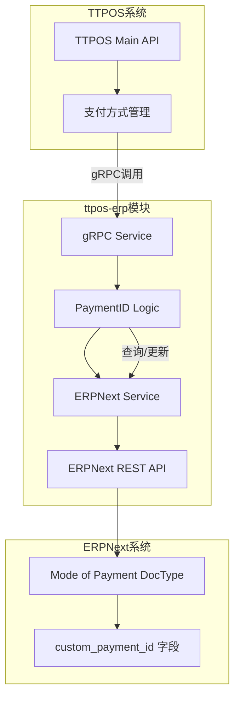
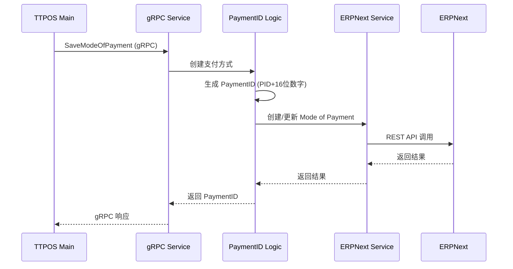
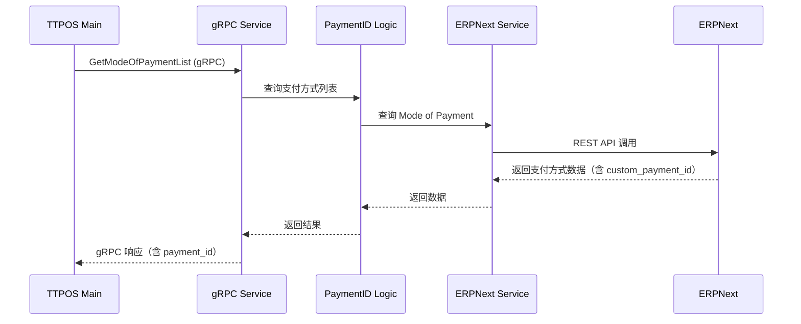
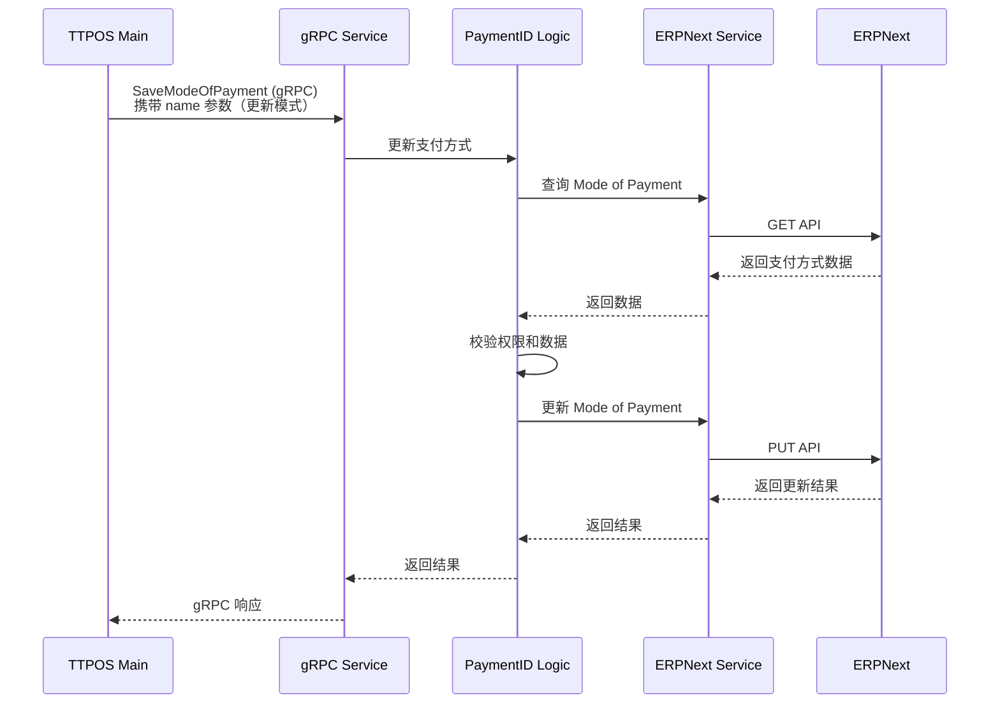

# ERP 支付方式 PaymentID 字段 设计文档

> 本文档定义 ERP 支付方式 PaymentID 字段 的技术设计和实现方案。

## 📋 概述

本功能在 ERPNext 系统的 Mode of Payment DocType 中添加 `custom_payment_id` 自定义字段，用于唯一标识支付方式并实现与 TTPOS 系统的双向数据同步。该字段采用 PID + 16位数字的生成规则，确保全局唯一性，为 ERP-TTPOS 支付数据对接提供基础。

**核心功能**：
1. ERP 自定义字段创建和管理
2. PaymentID 自动生成逻辑
3. ERP → TTPOS 数据同步
4. TTPOS → ERP 数据同步
5. 状态同步和错误处理

---

## 🎯 规范对齐

### Go BMP 规范 (go-bmp.mdc)

本功能主要在 ttpos-erp 模块实现，遵循 GoFrame 开发规范：

- ✅ 使用 GoFrame 2.x 框架
- ✅ 遵循 Logic → Service → DAO 分层
- ✅ 禁止修改 dao/entity/do/ 自动生成目录
- ✅ DTO 定义在 internal/model/dto/erp/ 目录
- ✅ 与 ERPNext 交互使用通用服务
- ✅ 日志使用中文描述

### ERPNext 集成规范 (erpnext)

- ✅ 不修改 ERPNext 源代码
- ✅ 不使用 ERPNext Server Scripts 功能
- ✅ 通过 ttpos-erp 模块的代码实现功能
- ✅ 使用 ERPNext REST API 进行交互
- ✅ 自定义字段通过迁移脚本管理

### API 设计规范 (api.mdc)

- ✅ URL 使用 snake_case 命名
- ✅ 响应格式统一：`{code, message, data{}}`
- ✅ data 字段必须是对象，不能为 null 或数组
- ✅ 错误信息使用中文

---

## 🔄 代码复用分析

### 可复用的现有组件

- **ERPNext 通用服务**: `ttpos-bmp/app/ttpos-erp/internal/logic/erpnext/` - 提供与 ERPNext 交互的通用方法（Create/Update/Delete/ChangeStatus/Count）
- **支付方式 Logic**: `ttpos-bmp/app/ttpos-erp/internal/logic/setup/mode_of_payment.go` - 已有的支付方式管理逻辑
- **UUID 生成器**: 项目通用的 UUID 生成工具

### 集成点

- **ERPNext API**: 通过 REST API 与 ERPNext 交互
- **TTPOS Main API**: 通过 HTTP API 调用 TTPOS 主服务
- **迁移脚本**: 使用 `manifest/erp-migrate/v2.12/01_custom_field/` 管理 ERP 自定义字段

---

## 🏗️ 架构设计

### 整体架构



### 数据流向

#### 1. PaymentID 生成流程



#### 2. 数据查询流程



#### 3. 支付方式更新流程



### 模块划分

#### ttpos-erp 模块

```
ttpos-bmp/app/ttpos-erp/
├── api/
│   └── selling/
│       └── selling.proto                     # gRPC 接口定义（复用现有）
├── internal/
│   ├── logic/
│   │   ├── erpnext/
│   │   │   └── document.go                   # ERPNext 通用服务（复用）
│   │   └── selling/
│   │       └── selling.go                    # 支付方式业务逻辑（已修改）
│   └── model/
│       └── dto/
│           └── erp/
│               └── mode_of_payment.go        # 支付方式 DTO（复用）
└── manifest/
    └── erp-migrate/
        └── v2.12/
            └── 01_custom_field/
                └── 01_custom_payment_id.json # ERP 字段迁移脚本
```

---

## 🗄️ ERP 字段设计

### 自定义字段定义

#### custom_payment_id 字段

**迁移脚本**: `ttpos-bmp/app/ttpos-erp/manifest/erp-migrate/v2.12/01_custom_field/01_custom_payment_id.json`

```json
{
  "doctype": "DocType",
  "label": "Payment ID",
  "fieldname": "custom_payment_id",
  "fieldtype": "Data",
  "insert_after": "custom_company",
  "dt": "Mode of Payment"
}
```

**字段说明**:
| 属性 | 值 | 说明 |
|------|------|------|
| fieldname | custom_payment_id | 字段名称 |
| fieldtype | Data | 字符串类型 |
| label | Payment ID | 显示标签 |
| insert_after | custom_company | 插入位置 |
| dt | Mode of Payment | 所属 DocType |

**字段约束**:
- 必填：是
- 唯一：是
- 只读：是（创建后不可修改）
- 最大长度：20 字符
- 格式：PID + 16位数字（如：PID1234567890123456）

---

## 📊 数据模型

### ERPNext DTO

#### ModeOfPayment DTO

```go
// ttpos-bmp/app/ttpos-erp/internal/model/dto/erp/mode_of_payment.go
type ModeOfPaymentDTO struct {
    Name              string `json:"name"`                // 支付方式名称
    ModeOfPayment     string `json:"mode_of_payment"`     // 支付方式
    Type              string `json:"type"`                // 类型
    CustomPaymentID   string `json:"custom_payment_id,omitempty"`   // PaymentID（新增字段）
    CustomCompany     string `json:"custom_company,omitempty"`      // 公司
    CustomBranch      string `json:"custom_branch,omitempty"`       // 分支
    Enabled           int    `json:"enabled"`             // 启用状态 (1=启用, 0=禁用)
    CreationTime      string `json:"creation,omitempty"`  // 创建时间
    ModifiedTime      string `json:"modified,omitempty"`  // 修改时间
}

// PaymentID 生成请求
type GeneratePaymentIDReq struct {
    ModeOfPaymentName string `json:"mode_of_payment_name"` // 支付方式名称
}

// PaymentID 生成响应
type GeneratePaymentIDResp struct {
    PaymentID string `json:"payment_id"` // 生成的 PaymentID
}

// 同步请求
type SyncModeOfPaymentReq struct {
    Name            string `json:"name"`             // 支付方式名称
    CustomPaymentID string `json:"custom_payment_id"` // PaymentID
    Action          string `json:"action"`           // 操作类型: create/update/delete
}

// 同步响应
type SyncModeOfPaymentResp struct {
    Success bool   `json:"success"` // 同步是否成功
    Message string `json:"message"` // 结果消息
}
```

---

## 🔌 gRPC 接口设计

### 现有 gRPC 接口复用

本功能复用现有的 gRPC 接口，无需新增接口：

#### 接口 1: SaveModeOfPayment

**定义位置**: `ttpos-bmp/app/ttpos-erp/api/selling/selling.proto`

**消息结构**:
```protobuf
message SaveModeOfPaymentReq {
  string company_abbr = 1;    // 公司简称，必填
  string branch = 2;          // 分支，必填
  string channel = 3;         // 渠道，如 LianLianPay，创建时必填
  string pay_type = 4;        // 支付类型（TTPOS 定义），创建时必填
  optional bool enabled = 5;  // 是否启用，可选
  optional string name = 6;   // 支付方式名称，可选（传入时执行更新操作）
  string payment_id = 7;      // PaymentID，可选（创建时若未提供则自动生成）
}

message SaveModeOfPaymentResp {
  string name = 1;  // 支付方式名称
}
```

**功能说明**:
- **创建模式**: 不传 `name` 参数，自动生成 PaymentID（若未提供）
- **更新模式**: 传入 `name` 参数，可更新 `enabled` 或 `payment_id` 字段

#### 接口 2: GetModeOfPaymentList

**定义位置**: `ttpos-bmp/app/ttpos-erp/api/selling/selling.proto`

**消息结构**:
```protobuf
message GetModeOfPaymentListReq {
  string company_abbr = 1;  // 公司缩写，可选
  string branch = 2;        // 分支，可选
}

message ModeOfPayment {
  string name = 1;        // 支付方式名称
  bool enabled = 2;       // 是否启用
  string payment_id = 3;  // PaymentID（新增字段）
}

message GetModeOfPaymentListResp {
  repeated ModeOfPayment mode_of_payment_list = 1;
}
```

**功能说明**:
- 查询支付方式列表，返回包含 `payment_id` 字段
- 支持按公司和分支筛选

---

## 🧩 核心实现

### PaymentID 生成逻辑

**实现位置**: `ttpos-bmp/app/ttpos-erp/internal/logic/selling/selling.go`

**生成规则**: `PID` + 16位数字

**实现方式**:
```go
// 在 createModeOfPayment 方法中
// 生成或使用提供的 PaymentID
paymentID := req.PaymentId
if paymentID == "" {
    // 自动生成：PID + 16位数字
    paymentID = fmt.Sprintf("PID%d", uuid.MustGetID())
}

payload := g.Map{
    "mode_of_payment":    name,
    "name":               name,
    "type":               "General",
    "custom_branch":      req.Branch,
    "custom_company":     companyName,
    "custom_payment_id":  paymentID,  // 设置 PaymentID
    // ... 其他字段
}
```

**唯一性保证**:
- 使用 `ttpos-bmp/utility/uuid` 包的 `MustGetID()` 方法
- 基于雪花算法，保证分布式环境下的唯一性
- 无需额外的并发控制或唯一性校验

---

## 🚨 错误处理

### 错误场景

#### 场景 1: PaymentID 已存在（并发冲突）

- **处理方式**: 由于使用雪花算法生成，极低概率发生，若发生则返回创建失败
- **用户影响**: 创建支付方式失败，提示"创建失败，请重试"
- **代码示例**:
  ```go
  payload := g.Map{
      "custom_payment_id": paymentID,
      // ... 其他字段
  }
  resp, err := service.Document().Create(ctx, erp.DocTypeModeOfPayment, payload)
  if err != nil {
      if strings.Contains(err.Error(), "exists") || strings.Contains(err.Error(), "Duplicate") {
          // 并发/重复情况下重试（最多3次）
          continue
      }
      return nil, gerror.Wrapf(err, "创建支付方式失败")
  }
  ```

#### 场景 2: ERPNext API 调用失败

- **处理方式**: 捕获异常，记录详细错误信息，返回用户友好提示
- **用户影响**: 显示"ERP 系统暂时不可用，请稍后重试"
- **代码示例**:
  ```go
  resp, err := service.Document().Create(ctx, erp.DocTypeModeOfPayment, payload)
  if err != nil {
      g.Log().Error(ctx, "创建支付方式失败", "payload", payload, "error", err)
      return nil, gerror.Wrapf(err, "创建支付方式失败")
  }
  ```

#### 场景 3: 权限校验失败

- **处理方式**: 校验支付方式是否属于当前公司，避免越权操作
- **用户影响**: 显示"无权限修改此支付方式"
- **代码示例**:
  ```go
  erpCompany := resp.Get("data.custom_company").String()
  if erpCompany != companyName {
      g.Log().Warningf(ctx, "尝试越权修改支付方式：name=%s, 请求公司=%s, ERP公司=%s",
          name, companyName, erpCompany)
      return nil, gerror.New("无权限修改此支付方式")
  }
  ```

---

## 🔒 安全设计

### 身份验证

- **gRPC 认证**: 通过 gRPC 拦截器进行身份验证
- **ERP API Key**: ERPNext API 调用使用 API Key 和 Secret

### 权限控制

- **管理员权限**: 只有管理员可以创建和修改支付方式
- **公司隔离**: 支付方式按公司隔离，在更新时校验 `custom_company` 字段，不能跨公司访问

### 数据安全

- **PaymentID 唯一性**: 使用雪花算法保证唯一性，ERP 层面通过重试机制处理并发冲突
- **操作审计**: 记录所有创建、更新操作的日志
- **敏感信息保护**: API Key 等敏感信息使用环境变量

---

## 🧪 测试策略

### 单元测试

**目标覆盖率**: 80%+

**测试内容**:
- PaymentID 生成逻辑（格式验证）
- DTO 数据转换
- 错误处理逻辑
- 权限校验逻辑

**示例**:
```go
// ttpos-bmp/app/ttpos-erp/internal/logic/selling/selling_test.go
func TestCreateModeOfPayment_GeneratePaymentID(t *testing.T) {
    // 测试自动生成 PaymentID
    req := &selling.SaveModeOfPaymentReq{
        CompanyAbbr: "TEST",
        Branch:      "Main",
        Channel:     "Cash",
        PayType:     "Cash",
        PaymentId:   "", // 不提供 PaymentID，应自动生成
    }
    
    resp, err := sellingLogic.SaveModeOfPayment(ctx, req)
    assert.NoError(t, err)
    assert.NotEmpty(t, resp.Name)
    
    // 验证生成的 PaymentID 格式
    modeOfPayment, _ := getModeOfPayment(ctx, resp.Name)
    assert.Regexp(t, `^PID\d{16}$`, modeOfPayment.CustomPaymentID)
}

func TestUpdateModeOfPayment_ValidatePermission(t *testing.T) {
    // 测试跨公司修改权限校验
    req := &selling.SaveModeOfPaymentReq{
        Name:        "Cash - COMP1",
        CompanyAbbr: "COMP2", // 不同公司
        Enabled:     proto.Bool(false),
    }
    
    _, err := sellingLogic.SaveModeOfPayment(ctx, req)
    assert.Error(t, err)
    assert.Contains(t, err.Error(), "无权限修改")
}
```

### gRPC 接口测试

**测试内容**:
- gRPC 接口调用
- 参数验证
- 响应格式
- 错误处理

### 集成测试

**测试流程**:
- TTPOS 通过 gRPC 创建支付方式 → 自动生成 PaymentID → 写入 ERP
- TTPOS 通过 gRPC 查询支付方式 → 读取 PaymentID
- TTPOS 通过 gRPC 更新支付方式 → 更新 ERP 状态
- 并发创建场景 → 验证唯一性和重试机制

---

## 📈 性能优化

### 优化策略

1. **PaymentID 生成优化**:
   - 使用项目统一的 `uuid.MustGetID()` 方法（基于雪花算法）
   - 单次调用即可生成唯一 ID，性能极高
   - 无需额外的唯一性校验和并发控制

2. **ERP API 调用优化**:
   - 并发冲突时自动重试（最多3次）
   - 每次重试间隔随机化，避免冲突聚集

3. **查询优化**:
   - 使用 ERPNext 的字段过滤，仅返回必要字段
   - 按公司和分支进行索引过滤

### 性能指标

- PaymentID 生成时间: < 10ms
- ERP API 调用: < 200ms
- 创建支付方式总耗时: < 300ms
- 并发支持: 100+ QPS

---

## 📚 实现清单

### Phase 1: ERP 字段和迁移

- [x] 创建 ERP 迁移脚本 (`v2.12/01_custom_field/01_custom_payment_id.json`)
- [ ] 执行迁移添加 custom_payment_id 字段
- [ ] 验证字段创建成功

### Phase 2: Protobuf 定义

- [x] 更新 `ModeOfPayment` 消息，添加 `payment_id` 字段
- [x] 更新 `SaveModeOfPaymentReq` 消息，添加 `payment_id` 字段
- [x] 重新生成 API 代码（`gf gen pb`）

### Phase 3: Logic 层实现

- [x] 修改 `GetModeOfPaymentList` 方法，查询和返回 `custom_payment_id`
- [x] 修改 `createModeOfPayment` 方法，实现 PaymentID 自动生成
- [x] 修改 `updateModeOfPayment` 方法，支持 PaymentID 更新
- [x] 添加 `uuid` 包导入

### Phase 4: 测试

- [ ] 单元测试：PaymentID 生成格式验证
- [ ] 单元测试：权限校验逻辑
- [ ] gRPC 接口测试：创建支付方式
- [ ] gRPC 接口测试：查询支付方式
- [ ] gRPC 接口测试：更新支付方式
- [ ] 集成测试：端到端流程

### Phase 5: 文档和优化

- [x] 更新设计文档
- [ ] 更新任务文档
- [ ] 性能测试和优化
- [ ] 操作手册编写

**详细任务**: 参见 `tasks.md`

---

## Graphiti & 活动日志

- Related Episode: `[待补充]`
- 模板：`docs/agent/templates/graphiti-episode.md`
- 活动日志：`docs/team/activities/2025-12/2025-12-23.md`
- 在技术方案评审、关键架构决策或踩坑总结后，立即补充 Episode 并在设计文档尾部互链。

---

**版本**: v1.0.0  
**创建日期**: 2025-12-23  
**作者**: rikugun  
**审核者**: {审核者}

