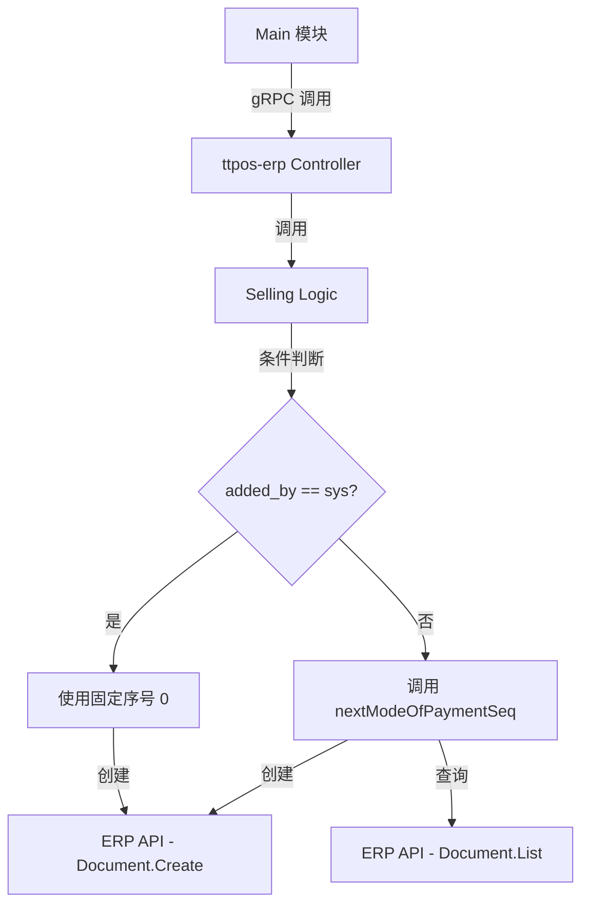

# 支付方式系统标识字段 设计文档

> 本文档定义支付方式系统标识字段功能的技术设计和实现方案。

## 📋 概述

本功能通过在 `SaveModeOfPaymentReq` 中新增 `added_by` 字段，支持标识支付方式的创建来源。当 `added_by` 值为常量 `"sys"` 时，系统使用固定序号 0000 创建支付方式，用于区分系统默认支付方式和用户自定义支付方式。

该功能主要应用于：
- 系统初始化时创建标准支付方式（Cash、Balance、Free Meal 等）
- 数据迁移场景快速识别系统支付方式
- 多公司部署保持命名一致性

**技术栈**: Go BMP 模块（GoFrame 2.x + gRPC）  
**影响范围**: `ttpos-bmp/app/ttpos-erp/` - Protobuf 定义 + 业务逻辑

---

## 🎯 规范对齐

### Go BMP 规范 (go-rules.mdc)

本设计严格遵循 ttpos-bmp 开发规范：

- ✅ 使用 GoFrame 2.x 框架
- ✅ Protobuf 文件放在 `manifest/protobuf/` 目录
- ✅ 业务逻辑在 `internal/logic/` 目录
- ✅ 禁止修改 `dao/entity/do/` 目录（自动生成）
- ✅ Protobuf 修改后执行 `gf gen pb` 重新生成代码
- ✅ 日志记录使用中文
- ✅ 错误信息使用中文

### Protobuf 规范 (proto-rules.mdc)

- ✅ 文件名使用小写 + 下划线（`selling.proto`）
- ✅ 请求消息以 `Req` 结尾
- ✅ 响应消息以 `Resp` 结尾
- ✅ 字段命名使用 snake_case
- ✅ 可选字段使用 `optional` 修饰符
- ✅ 字段注释清晰完整

### ttpos-erp 子模块规则 (go-ttpos-erp.mdc)

- ✅ logic/service 层返回具体业务数据类型
- ✅ 对外 gRPC 服务响应通过 `erp.ResponseInfo` 包装
- ✅ 尽量复用已有逻辑，避免重复实现

---

## 🔄 代码复用分析

### 可复用的现有组件

#### 1. SaveModeOfPayment 方法
- **路径**: `ttpos-bmp/app/ttpos-erp/internal/logic/selling/selling.go`
- **当前功能**: 创建/更新支付方式
- **复用方式**: 扩展 `createModeOfPayment` 方法，增加条件判断

#### 2. nextModeOfPaymentSeq 方法
- **路径**: `ttpos-bmp/app/ttpos-erp/internal/logic/selling/selling.go` (Line 1442-1491)
- **当前功能**: 计算下一个可用序号
- **复用方式**: 保持不变，当 `added_by = "sys"` 时跳过调用

#### 3. 现有常量定义
- **路径**: `ttpos-bmp/app/ttpos-erp/internal/consts/`
- **复用方式**: 参考现有常量定义方式，新增系统创建标识常量

### 集成点

#### Protobuf 定义
- **位置**: `ttpos-bmp/app/ttpos-erp/manifest/protobuf/selling/selling.proto` (Line 189-204)
- **当前结构**: `SaveModeOfPaymentReq` 已有 7 个字段
- **集成方式**: 新增第 8 个字段 `optional string added_by`

#### 业务逻辑
- **位置**: `ttpos-bmp/app/ttpos-erp/internal/logic/selling/selling.go` (Line 1363-1439)
- **当前逻辑**: `createModeOfPayment` 方法
- **集成方式**: 在调用 `nextModeOfPaymentSeq` 前增加条件判断

---

## 🏗️ 架构设计

### 分层设计原则

**Go BMP 架构（GoFrame）**:

```
Controller (gRPC) 层
  ↓ 调用
Logic (业务逻辑) 层
  ↓ 调用
DAO (数据访问) 层
  ↓ 访问
Database / ERP API
```

**依赖规则**:
- ✅ Controller 调用 Logic
- ✅ Logic 复用其他 Logic
- ✅ Logic 调用 DAO（自动生成）
- ❌ 禁止修改 DAO 层代码

### 模块划分

#### Go BMP 模块（ttpos-erp）

```
ttpos-bmp/app/ttpos-erp/
├── manifest/
│   └── protobuf/
│       └── selling/
│           └── selling.proto          # 修改：新增 added_by 字段
├── api/
│   └── selling/
│       └── selling.pb.go              # 自动生成（gf gen pb）
├── internal/
│   ├── consts/
│   │   └── payment.go                 # 新增：定义常量
│   ├── logic/
│   │   └── selling/
│   │       └── selling.go             # 修改：扩展 createModeOfPayment
│   └── controller/
│       └── rpc/
│           └── selling_controller.go  # 无需修改
```

### 架构图



---

## 🗄️ 数据库设计

本需求不涉及数据库表结构变更。

支付方式数据存储在 ERPNext 系统中，通过 ERP API 访问。

---

## 📊 数据模型

### Protobuf 定义

#### 修改：SaveModeOfPaymentReq

```protobuf
// ttpos-bmp/app/ttpos-erp/manifest/protobuf/selling/selling.proto

// SaveModeOfPaymentReq 保存/同步支付方式请求
message SaveModeOfPaymentReq {
  string company_abbr = 1;     // 公司缩写，必填
  string branch = 2;           // 分支，必填
  string channel = 3;          // 渠道，如 LianLianPay，创建时必填
  string pay_type = 4;         // 支付类型（TTPOS 定义），创建时必填
  optional bool enabled = 5;   // 是否启用，可选
  optional string name = 6;    // 支付方式名称，可选
  string payment_id = 7;       // 支付方式唯一标识（PaymentID）
  optional string added_by = 8; // 新增：创建来源标识，"sys" 表示系统创建
}
```

### Go 常量定义

#### 新增：payment.go

```go
// ttpos-bmp/app/ttpos-erp/internal/consts/payment.go

package consts

// 支付方式创建来源
const (
    // PaymentAddedBySystem 系统创建的支付方式
    // 使用此标识时，支付方式序号固定为 0000
    PaymentAddedBySystem = "sys"
)

// 支付方式序号
const (
    // PaymentSeqSystem 系统支付方式固定序号
    PaymentSeqSystem = 0
)
```

---

## 🔌 API 设计

### gRPC API

#### SaveModeOfPayment

本接口功能不变，增加对 `added_by` 字段的处理。

**请求**:
```protobuf
message SaveModeOfPaymentReq {
  string company_abbr = 1;
  string branch = 2;
  string channel = 3;
  string pay_type = 4;
  optional bool enabled = 5;
  optional string name = 6;
  string payment_id = 7;
  optional string added_by = 8; // 新增字段
}
```

**响应**:
```protobuf
message SaveModeOfPaymentResp {
  string name = 1;       // 支付方式规范化名称
  string payment_id = 2; // 支付方式唯一标识
}
```

**行为变化**:
- `added_by` 未传入：保持现有行为（自动递增序号）
- `added_by = "sys"`：使用固定序号 0000
- `added_by` 为其他值：使用自动递增序号

---

## 🧩 组件和接口

### Logic 层

#### 修改：createModeOfPayment 方法

**文件**: `ttpos-bmp/app/ttpos-erp/internal/logic/selling/selling.go`

**修改位置**: Line 1363-1439

**修改方案**:

```go
// createModeOfPayment 创建支付方式
func (s *sSelling) createModeOfPayment(ctx context.Context, req *selling.SaveModeOfPaymentReq) (*selling.SaveModeOfPaymentResp, error) {
    companyName, err := service.Company().GetCompanyNameWithAbbr(ctx, req.CompanyAbbr)
    if err != nil {
        return nil, gerror.Wrapf(err, "根据公司缩写[%s]查询公司失败", req.CompanyAbbr)
    }

    // 允许 channel 为空，前缀仅拼接非空段，末尾统一加 -
    parts := make([]string, 0, 2)
    if strings.TrimSpace(req.Channel) != "" {
        parts = append(parts, req.Channel)
    }
    if strings.TrimSpace(req.PayType) != "" {
        parts = append(parts, req.PayType)
    }
    prefix := strings.Join(parts, "-") + "-"

    // ============ 核心修改：判断是否为系统创建 ============
    var nextSeq int
    if req.AddedBy != nil && strings.TrimSpace(*req.AddedBy) == consts.PaymentAddedBySystem {
        // 系统创建：使用固定序号
        nextSeq = consts.PaymentSeqSystem
        g.Log().Infof(ctx, "[createModeOfPayment] 系统创建支付方式，使用固定序号 %04d, company=%s, prefix=%s",
            nextSeq, req.CompanyAbbr, prefix)
    } else {
        // 用户创建：自动递增序号
        nextSeq, err = s.nextModeOfPaymentSeq(ctx, prefix, companyName)
        if err != nil {
            return nil, err
        }
        g.Log().Debugf(ctx, "[createModeOfPayment] 用户创建支付方式，使用递增序号 %04d, company=%s, prefix=%s",
            nextSeq, req.CompanyAbbr, prefix)
    }
    // ============ 核心修改结束 ============

    name := fmt.Sprintf("%s%04d - %s", prefix, nextSeq, req.CompanyAbbr)

    // 生成或使用提供的 PaymentID
    paymentID := req.PaymentId
    if paymentID == "" {
        paymentID = fmt.Sprintf("PID%d", uuid.MustGetID())
    }

    payload := g.Map{
        "mode_of_payment":   name,
        "name":              name,
        "type":              "General",
        "custom_branch":     req.Branch,
        "custom_company":    companyName,
        "custom_payment_id": paymentID,
    }

    // 如果请求明确携带enabled字段，则更新ERP的启用状态
    if req.Enabled != nil {
        if req.GetEnabled() {
            payload["enabled"] = 1
        } else {
            payload["enabled"] = 0
        }
    }

    resp, err := service.Document().Create(ctx, erp.DocTypeModeOfPayment, payload)
    if err != nil {
        return nil, gerror.Wrapf(err, "创建支付方式失败")
    }

    createdName := name
    if resp != nil {
        if v := resp.Get("data.name").String(); v != "" {
            createdName = v
        }
    }

    // 创建对应公司的支付账户关联
    if err := service.Selling().CreateModePaymentAccount(ctx, &setup.CreateModePaymentAccountInp{
        CompanyAbbr: req.CompanyAbbr,
        PaymentType: createdName,
    }); err != nil {
        return nil, gerror.Wrapf(err, "创建支付方式账号关联失败")
    }

    return &selling.SaveModeOfPaymentResp{
        Name:      createdName,
        PaymentId: paymentID,
    }, nil
}
```

**关键修改点**:
1. 新增条件判断：检查 `req.AddedBy` 是否为 `consts.PaymentAddedBySystem`
2. 系统创建时使用常量 `consts.PaymentSeqSystem`（值为 0）
3. 添加日志记录，区分系统创建和用户创建
4. 使用 `Infof` 记录系统创建，`Debugf` 记录用户创建

### Controller 层

**无需修改**。Controller 层只负责 gRPC 接口处理，新增字段自动映射到 Logic 层。

---

## 🚨 错误处理

### 错误场景

#### 场景 1: 序号 0000 已被占用（可选增强）

- **处理方式**: 返回错误，提示序号冲突
- **用户影响**: 无法创建系统支付方式
- **代码示例**:
  ```go
  if nextSeq == consts.PaymentSeqSystem {
      // 检查序号 0000 是否已存在
      existingName := fmt.Sprintf("%s%04d - %s", prefix, nextSeq, req.CompanyAbbr)
      count, err := service.Doctype().Count(ctx, &erp.ErpReq{
          DocType: erp.DocTypeModeOfPayment,
      }, &erp.RequestParams{
          Filters: [][]string{{"name", "=", existingName}},
      })
      if err != nil {
          return nil, gerror.Wrapf(err, "检查支付方式序号冲突失败")
      }
      if count > 0 {
          g.Log().Errorf(ctx, "系统支付方式序号 0000 已被占用: %s", existingName)
          return nil, gerror.Newf("系统支付方式序号 0000 已被占用: %s", existingName)
      }
  }
  ```

#### 场景 2: added_by 字段值无效

- **处理方式**: 忽略，使用默认逻辑（自动递增序号）
- **用户影响**: 无影响，兼容旧版本
- **代码示例**: 已在设计中处理（只判断是否为 "sys"）

---

## 🔒 安全设计

### 输入验证

- **added_by 字段**: 可选字段，值为字符串，无需额外验证
- **未来增强**: 可在 Controller 层增加权限检查，限制只有管理员可以使用 `added_by = "sys"`

### 审计日志

- **系统创建**: 使用 `Infof` 级别记录，便于审计
- **用户创建**: 使用 `Debugf` 级别记录，降低日志噪音
- **日志内容**: 包含 company、prefix、序号信息

---

## 🧪 测试策略

### 单元测试

**目标覆盖率**: Logic 层 ≥ 80%

**测试内容**:

#### Test 1: 系统创建支付方式（added_by = "sys"）
```go
func Test_createModeOfPayment_SystemCreated(t *testing.T) {
    // 输入：added_by = "sys"
    // 预期：nextSeq = 0，name = "{prefix}0000 - {company_abbr}"
}
```

#### Test 2: 用户创建支付方式（added_by 为空）
```go
func Test_createModeOfPayment_UserCreated_Empty(t *testing.T) {
    // 输入：added_by = nil
    // 预期：调用 nextModeOfPaymentSeq，使用自动递增序号
}
```

#### Test 3: 用户创建支付方式（added_by 为其他值）
```go
func Test_createModeOfPayment_UserCreated_OtherValue(t *testing.T) {
    // 输入：added_by = "user"
    // 预期：调用 nextModeOfPaymentSeq，使用自动递增序号
}
```

#### Test 4: 序号 0000 冲突（可选增强）
```go
func Test_createModeOfPayment_SeqConflict(t *testing.T) {
    // 前置：序号 0000 已存在
    // 输入：added_by = "sys"
    // 预期：返回错误，提示序号冲突
}
```

### 集成测试

**测试流程**:
1. 调用 gRPC `SaveModeOfPayment` 接口
2. 传入 `added_by = "sys"`
3. 验证创建的支付方式名称包含 "0000"
4. 验证 ERP 系统中数据正确

### 回归测试

**测试内容**:
- 旧客户端不传 `added_by` 字段，功能正常
- 新客户端传入 `added_by`，功能正常
- 现有支付方式创建流程不受影响

---

## 📈 性能优化

### 优化策略

1. **无性能影响**: 只增加一个条件判断，性能开销可忽略
2. **日志优化**: 系统创建使用 `Infof`，用户创建使用 `Debugf`，减少日志量
3. **缓存策略**: 无需缓存，序号生成逻辑足够快

### 性能指标

- 条件判断耗时: < 1ms
- 不影响现有支付方式创建性能

---

## 📚 实现清单

### Phase 1: Protobuf 定义和代码生成

- [ ] 修改 `selling.proto`，新增 `added_by` 字段
- [ ] 执行 `gf gen pb` 生成 Go 代码
- [ ] 验证生成的代码正确

### Phase 2: 常量定义

- [ ] 创建 `consts/payment.go`
- [ ] 定义 `PaymentAddedBySystem` 常量
- [ ] 定义 `PaymentSeqSystem` 常量

### Phase 3: 业务逻辑实现

- [ ] 修改 `createModeOfPayment` 方法
- [ ] 增加条件判断逻辑
- [ ] 添加日志记录
- [ ] 可选：增加序号冲突检测

### Phase 4: 测试

- [ ] 编写单元测试（4 个场景）
- [ ] 编写集成测试
- [ ] 编写回归测试
- [ ] 手动测试验证

**详细任务**: 参见 `tasks.md`

---

## Graphiti & 活动日志

- Related Episode: `[待补充]`
- 模板：`docs/agent/templates/graphiti-episode.md`
- 活动日志：`docs/team/activities/rikugun/2025-12/2025-12-30.md`
- 在技术方案评审、关键架构决策或踩坑总结后，立即补充 Episode 并在设计文档尾部互链。

---

**版本**: v1.0.0  
**创建日期**: 2025-12-30  
**作者**: rikugun  
**审核者**: 待审核

